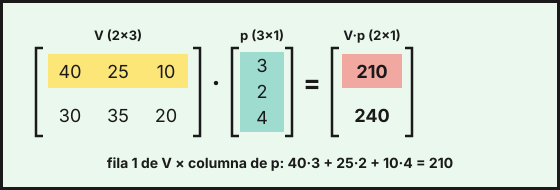
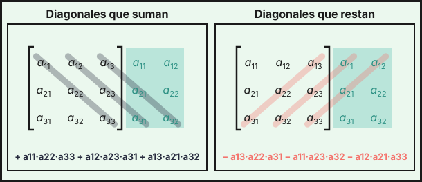

## 1. Concepto y tipos

Una **matriz** de dimensión $m \times n$ es una tabla de números con $m$ filas y $n$ columnas. El elemento $a_{ij}$ está en la fila $i$ y la columna $j$. Las matrices sirven para organizar datos: ventas por tienda, personas encuestadas por edad, costes por producto.

Ejemplo: en una encuesta sobre el transporte público, las filas son la respuesta (a favor, en contra) y las columnas, la franja de edad (18–35, 36–55, más de 55):

$$E=\begin{pmatrix}120&95&60\\80&105&140\end{pmatrix}\in\mathcal{M}_{2\times 3}$$

El elemento $e_{23}=140$ son las personas de más de 55 años que están en contra.

| Tipo | Condición |
|---|---|
| Cuadrada de orden $n$ | $m=n$ |
| Fila / columna | $m=1$ / $n=1$ |
| Diagonal | cuadrada con $a_{ij}=0$ si $i\neq j$ |
| Identidad $I_n$ | diagonal con unos en la diagonal |
| Triangular | ceros por encima (o por debajo) de la diagonal |
| Simétrica | $A=A^t$ |
| Nula $O$ | todos los elementos son 0 |

## 2. Operaciones

**Suma y resta**: solo entre matrices de la misma dimensión, elemento a elemento. Si $E_A$ y $E_B$ son las encuestas de dos municipios, el conjunto de ambos es

$$E_A+E_B=\begin{pmatrix}120&95&60\\80&105&140\end{pmatrix}+\begin{pmatrix}70&60&40\\50&65&90\end{pmatrix}=\begin{pmatrix}190&155&100\\130&170&230\end{pmatrix}$$

**Producto por un número**: se multiplica cada elemento por el número. Si una tienda vende cada semana $V=\begin{pmatrix}40&25&10\\30&35&20\end{pmatrix}$ unidades de café, té y cacao (filas: tienda 1 y tienda 2), en dos semanas iguales vende $2\cdot V=\begin{pmatrix}80&50&20\\60&70&40\end{pmatrix}$.

**Producto de matrices**: $A_{m\times n}\cdot B_{n\times p}=C_{m\times p}$. El elemento $c_{ij}$ es la fila $i$ de $A$ por la columna $j$ de $B$:

$$c_{ij}=a_{i1}b_{1j}+a_{i2}b_{2j}+\dots+a_{in}b_{nj}$$

Si el precio por unidad es $p=\begin{pmatrix}3\\2\\4\end{pmatrix}$ euros, los ingresos de cada tienda son $V\cdot p$:

{fig-alt="Producto de una matriz de ventas de 2 filas y 3 columnas por una columna de tres precios, con la primera fila y la columna resaltadas y el resultado 210 y 240" width="85%" fig-align="center"}

Otro ejemplo con matrices cuadradas:

$$A=\begin{pmatrix}2&1\\0&1\end{pmatrix},\ B=\begin{pmatrix}1&3\\1&0\end{pmatrix}:\qquad A\cdot B=\begin{pmatrix}3&6\\1&0\end{pmatrix},\quad B\cdot A=\begin{pmatrix}2&4\\2&1\end{pmatrix}$$

::: {.callout-warning}
## Cuidado con el producto
- Solo se puede multiplicar si **columnas de $A$ = filas de $B$**.
- **No es conmutativo**: en general $A\cdot B\neq B\cdot A$, como en el ejemplo anterior.
- $A\cdot B=O$ **no** implica $A=O$ ni $B=O$.
- $(A+B)^2=A^2+A\cdot B+B\cdot A+B^2$, que no es $A^2+2A\cdot B+B^2$ salvo que $A\cdot B=B\cdot A$.
:::

**Propiedades útiles**: $A\cdot(B+C)=A\cdot B+A\cdot C$, $(A\cdot B)\cdot C=A\cdot(B\cdot C)$ y $A\cdot I_n=I_n\cdot A=A$.

**Traspuesta**. La **traspuesta** $A^t$ se obtiene cambiando filas por columnas. Por ejemplo, $V^t=\begin{pmatrix}40&30\\25&35\\10&20\end{pmatrix}$. Propiedades:

$$(A+B)^t=A^t+B^t \qquad (k\cdot A)^t=k\cdot A^t \qquad (A\cdot B)^t=B^t\cdot A^t \qquad (A^t)^t=A$$

**Potencias**. $A^n=A\cdot A\cdots A$ ($n$ veces), solo para matrices cuadradas. Para calcular $A^n$, halla $A^2,\ A^3,\ A^4$, detecta el patrón y generalízalo. Ejemplo con $A=\begin{pmatrix}1&0\\2&1\end{pmatrix}$:

$$A^2=\begin{pmatrix}1&0\\4&1\end{pmatrix},\quad A^3=\begin{pmatrix}1&0\\6&1\end{pmatrix},\quad A^4=\begin{pmatrix}1&0\\8&1\end{pmatrix}\ \Rightarrow\ A^n=\begin{pmatrix}1&0\\2n&1\end{pmatrix}$$

Si $A^2=I_n$ (por ejemplo $\begin{pmatrix}0&1\\1&0\end{pmatrix}$), las potencias alternan: $A^n=A$ si $n$ es impar y $A^n=I_n$ si $n$ es par.

## 3. Determinantes

El **determinante** de una matriz cuadrada $A$, que se escribe $|A|$, es un número asociado a ella. Sirve para saber si $A$ tiene inversa, para calcularla y para hallar el rango. En este curso se calculan hasta **orden 3**.

**Orden 2**: producto de la diagonal principal menos producto de la diagonal secundaria.

$$\left|\begin{matrix}a&b\\c&d\end{matrix}\right|=ad-bc\qquad\text{Ejemplo: }\left|\begin{matrix}5&2\\3&4\end{matrix}\right|=20-6=14$$

**Orden 3 — regla de Sarrus**. Se repiten a la derecha las dos primeras columnas. Suman los productos de las tres diagonales descendentes y restan los de las tres ascendentes:

{fig-alt="Dos dibujos de una matriz de orden 3 con sus dos primeras columnas repetidas a la derecha: a la izquierda las diagonales descendentes que suman y a la derecha las ascendentes que restan" width="85%" fig-align="center"}

$$\left|\begin{matrix}a_{11}&a_{12}&a_{13}\\a_{21}&a_{22}&a_{23}\\a_{31}&a_{32}&a_{33}\end{matrix}\right|=a_{11}a_{22}a_{33}+a_{12}a_{23}a_{31}+a_{13}a_{21}a_{32}-a_{13}a_{22}a_{31}-a_{11}a_{23}a_{32}-a_{12}a_{21}a_{33}$$

Ejemplo:
$$\left|\begin{matrix}1&2&3\\0&1&4\\2&1&0\end{matrix}\right|=(0+16+0)-(6+4+0)=16-10=6$$

::: {.callout-note}
Sarrus solo vale para orden 3. Para otros órdenes se usan los adjuntos.
:::

**Menores y adjuntos**. El **menor** $M_{ij}$ es el determinante que queda al quitar la fila $i$ y la columna $j$. El **adjunto** es $A_{ij}=(-1)^{i+j}M_{ij}$; los signos forman el tablero $\begin{pmatrix}+&-&+\\-&+&-\\+&-&+\end{pmatrix}$. El determinante se puede **desarrollar por cualquier fila o columna**:

$$|A|=a_{i1}A_{i1}+a_{i2}A_{i2}+a_{i3}A_{i3}$$

Conviene elegir la fila o columna con más ceros. Desarrollando por la segunda columna:

$$\left|\begin{matrix}3&0&2\\1&4&-1\\2&0&5\end{matrix}\right|=4\cdot(+1)\left|\begin{matrix}3&2\\2&5\end{matrix}\right|=4\cdot11=44$$

**Propiedades**. Sean $A$ y $B$ matrices cuadradas de orden $n$:

| Propiedad | Fórmula |
|---|---|
| Traspuesta | $\lvert A^t\rvert=\lvert A\rvert$ |
| Producto | $\lvert A\cdot B\rvert=\lvert A\rvert\cdot\lvert B\rvert$ |
| Inversa | $\lvert A^{-1}\rvert=\dfrac{1}{\lvert A\rvert}$ |
| Producto por un número | $\lvert k\cdot A\rvert=k^n\cdot\lvert A\rvert$ |

Sobre filas (o columnas):

1. Si se **intercambian** dos filas, el determinante **cambia de signo**.
2. Si una fila se **multiplica por $k$**, el determinante queda multiplicado por $k$.
3. Si a una fila se le **suma un múltiplo de otra**, el determinante **no cambia**.
4. Si hay una fila de ceros, o dos filas iguales o proporcionales (en general, una fila combinación lineal de las otras), el determinante es $0$.

Ejemplo: si $A$ es de orden 3 y $|A|=3$, entonces $|A^t|=3$, $|A^2|=9$, $|A^{-1}|=\tfrac13$ y $|2\cdot A|=2^3\cdot3=24$.

::: {.callout-warning}
Ojo: $|A+B|\neq|A|+|B|$ en general, y $|k\cdot A|\neq k\cdot|A|$ (es $k^n\cdot|A|$).
:::

## 4. Rango de una matriz

El **rango** $\operatorname{rg}A$ es el número máximo de filas (o columnas) linealmente independientes. Se puede calcular de dos formas.

**Por Gauss**: se hacen ceros por debajo de la diagonal y se cuenta el número de filas no nulas. Ejemplo:

$$\begin{pmatrix}1&2&1\\2&1&-1\\3&3&0\end{pmatrix}\xrightarrow[F_3-3F_1]{F_2-2F_1}\begin{pmatrix}1&2&1\\0&-3&-3\\0&-3&-3\end{pmatrix}\xrightarrow{F_3-F_2}\begin{pmatrix}1&2&1\\0&-3&-3\\0&0&0\end{pmatrix}$$

Hay dos filas no nulas, luego el rango es 2.

**Por menores**: el rango es el orden del mayor menor distinto de cero. En la matriz anterior, el determinante de orden 3 vale $0$ (la tercera fila es la suma de las otras dos) y el menor $\left|\begin{matrix}1&2\\2&1\end{matrix}\right|=-3\neq0$, luego el rango es 2.

**Con un parámetro**. Se calcula el determinante, se ve para qué valores se anula y se estudia el rango en cada caso. Para $P(m)=\begin{pmatrix}1&1&m\\1&m&1\\m&1&1\end{pmatrix}$:

$$|P(m)|=-(m-1)^2(m+2)$$

- Si $m\neq1$ y $m\neq-2$, el determinante no es 0 y $\operatorname{rg}P=3$.
- Si $m=1$, todas las filas son $(1,\,1,\,1)$ y $\operatorname{rg}P=1$.
- Si $m=-2$, las dos primeras filas $(1,\,1,\,-2)$ y $(1,\,-2,\,1)$ no son proporcionales y el determinante es 0, luego $\operatorname{rg}P=2$.

::: {.callout-note}
- $\operatorname{rg}A\le\min(m,n)$.
- Una matriz cuadrada de orden $n$ tiene $|A|\neq0$ si y solo si $\operatorname{rg}A=n$.
:::

## 5. Matriz inversa

Una matriz cuadrada $A$ de orden $n$ es **invertible** si existe $A^{-1}$ con $A\cdot A^{-1}=A^{-1}\cdot A=I_n$. Esto ocurre **si y solo si $|A|\neq0$**. La inversa, si existe, es **única**, y además:

$$(A\cdot B)^{-1}=B^{-1}\cdot A^{-1}\qquad (A^t)^{-1}=(A^{-1})^t$$

**Cálculo por adjuntos**:

$$A^{-1}=\frac{1}{|A|}\,\bigl(\operatorname{Adj}A\bigr)^t$$

donde $\operatorname{Adj}A$ es la matriz de los adjuntos $A_{ij}$. Pasos: (1) calcula $|A|$ y comprueba que no es 0; (2) calcula los adjuntos; (3) traspón la matriz de adjuntos; (4) divide entre $|A|$.

Para **orden 2** hay atajo: si $|A|=ad-bc\neq0$, entonces $\begin{pmatrix}a&b\\c&d\end{pmatrix}^{-1}=\dfrac{1}{ad-bc}\begin{pmatrix}d&-b\\-c&a\end{pmatrix}$. Por ejemplo, si $H=\begin{pmatrix}4&6\\1&2\end{pmatrix}$, entonces $|H|=2$ y

$$H^{-1}=\frac12\begin{pmatrix}2&-6\\-1&4\end{pmatrix}=\begin{pmatrix}1&-3\\-\tfrac12&2\end{pmatrix}$$

Ejemplo de **orden 3** con $Q=\begin{pmatrix}2&1&1\\1&1&0\\0&1&1\end{pmatrix}$:

1. Por Sarrus, $|Q|=(2+0+1)-(0+0+1)=2\neq0$, luego $Q$ es invertible.
2. Adjuntos: $A_{11}=1,\ A_{12}=-1,\ A_{13}=1$; $A_{21}=0,\ A_{22}=2,\ A_{23}=-2$; $A_{31}=-1,\ A_{32}=1,\ A_{33}=1$.
3. Se traspone la matriz de adjuntos y se divide entre $|Q|=2$:

$$Q^{-1}=\frac12\begin{pmatrix}1&-1&1\\0&2&-2\\-1&1&1\end{pmatrix}^{t}=\frac12\begin{pmatrix}1&0&-1\\-1&2&1\\1&-2&1\end{pmatrix}=\begin{pmatrix}\tfrac12&0&-\tfrac12\\-\tfrac12&1&\tfrac12\\\tfrac12&-1&\tfrac12\end{pmatrix}$$

**Con un parámetro**: para $A(m)=\begin{pmatrix}m&1\\4&m\end{pmatrix}$ se tiene $|A|=m^2-4$, que se anula en $m=\pm2$. Luego $A$ tiene inversa para todo $m\neq2$ y $m\neq-2$.

::: {.callout-note}
## Otro método: Gauss-Jordan
Se escribe $(A\,|\,I_n)$ y se hacen operaciones entre filas hasta obtener $(I_n\,|\,A^{-1})$. Si aparece una fila de ceros a la izquierda, $A$ no es invertible. Con $G=\begin{pmatrix}3&1\\5&2\end{pmatrix}$:

$$\left(\begin{array}{cc|cc}3&1&1&0\\5&2&0&1\end{array}\right)\xrightarrow{3F_2-5F_1}\left(\begin{array}{cc|cc}3&1&1&0\\0&1&-5&3\end{array}\right)\xrightarrow{F_1-F_2}\left(\begin{array}{cc|cc}3&0&6&-3\\0&1&-5&3\end{array}\right)\xrightarrow{F_1/3}\left(\begin{array}{cc|cc}1&0&2&-1\\0&1&-5&3\end{array}\right)$$

Luego $G^{-1}=\begin{pmatrix}2&-1\\-5&3\end{pmatrix}$.
:::

## 6. Ecuaciones matriciales

Se despeja la matriz incógnita $X$ como en una ecuación normal, pero **cuidando el orden** del producto y **sin dividir**: se multiplica por la inversa, que debe existir ($|A|\neq0$).

| Ecuación | Solución |
|---|---|
| $A\cdot X=B$ | $X=A^{-1}\cdot B$ (inversa **a la izquierda**) |
| $X\cdot A=B$ | $X=B\cdot A^{-1}$ (inversa **a la derecha**) |
| $A\cdot X+B=C$ | $X=A^{-1}\cdot(C-B)$ |
| $A\cdot X+X=B$ | $(A+I_n)\cdot X=B$, luego $X=(A+I_n)^{-1}\cdot B$ |
| $A\cdot X\cdot B=C$ | $X=A^{-1}\cdot C\cdot B^{-1}$ |

::: {.callout-important}
Al sacar factor común, la identidad aparece explícita: $A\cdot X+X=(A+I_n)\cdot X$, no $(A+1)\cdot X$.
:::

**Ejemplo 1 (producción).** Una fábrica elabora dos productos, $P_1$ y $P_2$, con dos materias primas, $M_1$ y $M_2$. La matriz $A$ da las unidades de materia prima por unidad de producto (filas: $M_1$ y $M_2$; columnas: $P_1$ y $P_2$), y $B$ el consumo total de materias primas en dos semanas (una columna por semana). La matriz $X$ de unidades producidas de cada producto en cada semana cumple $A\cdot X=B$:

$$A=\begin{pmatrix}2&1\\1&3\end{pmatrix},\quad B=\begin{pmatrix}100&120\\105&135\end{pmatrix}$$

Como $|A|=5$, $A^{-1}=\dfrac15\begin{pmatrix}3&-1\\-1&2\end{pmatrix}$ y

$$X=A^{-1}\cdot B=\frac15\begin{pmatrix}3&-1\\-1&2\end{pmatrix}\begin{pmatrix}100&120\\105&135\end{pmatrix}=\frac15\begin{pmatrix}195&225\\110&150\end{pmatrix}=\begin{pmatrix}39&45\\22&30\end{pmatrix}$$

En la primera semana se producen 39 unidades de $P_1$ y 22 de $P_2$.

**Ejemplo 2.** Resuelve $A\cdot X+X=B$ con $A=\begin{pmatrix}2&1\\1&1\end{pmatrix}$ y $B=\begin{pmatrix}5&10\\5&5\end{pmatrix}$. Se tiene $(A+I_2)\cdot X=B$, con $A+I_2=\begin{pmatrix}3&1\\1&2\end{pmatrix}$ y $|A+I_2|=5$, luego

$$X=(A+I_2)^{-1}\cdot B=\frac15\begin{pmatrix}2&-1\\-1&3\end{pmatrix}\begin{pmatrix}5&10\\5&5\end{pmatrix}=\begin{pmatrix}1&3\\2&1\end{pmatrix}$$

**Ejemplo 3.** Resuelve $X\cdot A-2I_2=B$ con $A=\begin{pmatrix}1&2\\1&3\end{pmatrix}$ y $B=\begin{pmatrix}3&1\\2&5\end{pmatrix}$. Se pasa $2I_2$ al otro lado y se multiplica por $A^{-1}$ **a la derecha**: $X=(B+2I_2)\cdot A^{-1}$. Como $|A|=1$, $A^{-1}=\begin{pmatrix}3&-2\\-1&1\end{pmatrix}$ y

$$X=\begin{pmatrix}5&1\\2&7\end{pmatrix}\begin{pmatrix}3&-2\\-1&1\end{pmatrix}=\begin{pmatrix}14&-9\\-1&3\end{pmatrix}$$

::: {.callout-tip}
## Resumen rápido
- $A\cdot B$ existe si columnas de $A$ = filas de $B$, y en general $A\cdot B\neq B\cdot A$.
- $(A\cdot B)^t=B^t\cdot A^t$ y $(A\cdot B)^{-1}=B^{-1}\cdot A^{-1}$.
- $|A|$ de orden 2: $ad-bc$; de orden 3: Sarrus o adjuntos. $|A\cdot B|=|A|\cdot|B|$ y $|k\cdot A|=k^n\cdot|A|$.
- $\operatorname{rg}A$ = nº de filas no nulas tras Gauss, o mayor orden de un menor $\neq0$.
- $A$ es invertible si y solo si $|A|\neq0$, y entonces $A^{-1}=\dfrac{1}{|A|}(\operatorname{Adj}A)^t$.
- $A\cdot X=B\Rightarrow X=A^{-1}\cdot B$; $X\cdot A=B\Rightarrow X=B\cdot A^{-1}$.
:::
