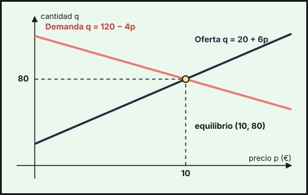

## 1. Sistemas lineales y su clasificación

Un **sistema de ecuaciones lineales** es un conjunto de ecuaciones de primer grado con las mismas incógnitas. Una **solución** es un conjunto de valores que cumple todas las ecuaciones a la vez. Según el número de soluciones, el sistema es:

| Tipo | Soluciones | Abreviatura |
|---|---|---|
| Compatible determinado | una sola | SCD |
| Compatible indeterminado | infinitas | SCI |
| Incompatible | ninguna | SI |

Con dos incógnitas cada ecuación es una recta: si se cortan en un punto el sistema es SCD, si son paralelas es SI y si son la misma recta es SCI. Un ejemplo económico es el **punto de equilibrio**: con una demanda $q=120-4p$ y una oferta $q=20+6p$ (precio $p$ en euros y cantidad $q$ en miles de unidades), el equilibrio es la solución del sistema

$$\begin{cases}q+4p=120\\ q-6p=20\end{cases}\quad\Rightarrow\quad p=10,\ q=80$$

{fig-alt="Dos rectas, la de demanda decreciente y la de oferta creciente, que se cortan en el punto de coordenadas precio 10 y cantidad 80" width="85%" fig-align="center"}

**Ejemplo de planteamiento.** Una persona invierte 30 000 € en tres productos: un depósito (2 % anual), unos bonos (4 %) y un fondo (6 %). El año pasado cobró 1 400 € de intereses y en bonos puso el doble que en el depósito. Si $x$, $y$, $z$ son los euros en depósito, bonos y fondo:

$$\begin{cases}x+y+z=30000\\ 0{,}02x+0{,}04y+0{,}06z=1400\\ y=2x\end{cases}\ \Longleftrightarrow\ \begin{cases}x+y+z=30000\\ x+2y+3z=70000\\ 2x-y=0\end{cases}$$

(la segunda ecuación se ha multiplicado por 50 para quitar los decimales). Este sistema se resuelve con los métodos de las secciones siguientes.

## 2. Expresión matricial y teorema de Rouché-Fröbenius

Un sistema de $m$ ecuaciones y $n$ incógnitas se escribe como una ecuación entre matrices, $A\cdot X=B$, donde $A$ es la **matriz de coeficientes**, $X$ la columna de incógnitas y $B$ la de términos independientes. La **matriz ampliada** $A^*$ es $A$ con la columna $B$ añadida. Para el sistema de la inversión:

$$\underbrace{\begin{pmatrix}1&1&1\\1&2&3\\2&-1&0\end{pmatrix}}_{A}\underbrace{\begin{pmatrix}x\\y\\z\end{pmatrix}}_{X}=\underbrace{\begin{pmatrix}30000\\70000\\0\end{pmatrix}}_{B}\qquad A^*=\left(\begin{array}{ccc|c}1&1&1&30000\\1&2&3&70000\\2&-1&0&0\end{array}\right)$$

Si $A$ es cuadrada y $|A|\neq0$, existe $A^{-1}$ y la solución es $X=A^{-1}\cdot B$ (ver el [tema 1](../01-matrices-determinantes/index.qmd)).

El **teorema de Rouché-Fröbenius** clasifica el sistema comparando rangos, con $n$ el número de incógnitas:

| Rangos | Tipo de sistema |
|---|---|
| $\operatorname{rg}A\neq\operatorname{rg}A^*$ | Incompatible (SI) |
| $\operatorname{rg}A=\operatorname{rg}A^*=n$ | Compatible determinado (SCD) |
| $\operatorname{rg}A=\operatorname{rg}A^*<n$ | Compatible indeterminado (SCI), con $n-\operatorname{rg}A$ parámetros |

## 3. Método de Gauss

Consiste en transformar la matriz ampliada, con operaciones entre filas, en una **escalonada** (ceros por debajo de la diagonal) que da un sistema equivalente fácil de resolver de abajo hacia arriba. Las operaciones permitidas son intercambiar dos filas, multiplicar una fila por un número distinto de 0 y sumar a una fila un múltiplo de otra.

**Ejemplo (SCD).** Sistema de la inversión:

$$\left(\begin{array}{ccc|c}1&1&1&30000\\1&2&3&70000\\2&-1&0&0\end{array}\right)\xrightarrow[F_3-2F_1]{F_2-F_1}\left(\begin{array}{ccc|c}1&1&1&30000\\0&1&2&40000\\0&-3&-2&-60000\end{array}\right)\xrightarrow{F_3+3F_2}\left(\begin{array}{ccc|c}1&1&1&30000\\0&1&2&40000\\0&0&4&60000\end{array}\right)$$

De la última fila, $4z=60000$, luego $z=15000$. De la segunda, $y=40000-2z=10000$. De la primera, $x=30000-y-z=5000$. Se invirtieron 5 000 € en el depósito, 10 000 € en bonos y 15 000 € en el fondo. Comprobación: $100+400+900=1400$ € de intereses.

**Ejemplo (SI y SCI).** Una frutería vende tomate, pimiento y cebolla (precios $x$, $y$, $z$ en €/kg). El pedido 1 (2 kg de tomate, 3 de pimiento y 1 de cebolla) costó 14 €, el pedido 2 (1 kg de cada uno de tomate y pimiento y 2 de cebolla) costó 9 €, y el pedido 3 junta ambos pedidos y debería costar 23 €. Si por error la factura del pedido 3 dice 24 € (en la matriz se ponen primero las ecuaciones más sencillas, es decir, se intercambian los pedidos 1 y 2):

$$\left(\begin{array}{ccc|c}1&1&2&9\\2&3&1&14\\3&4&3&24\end{array}\right)\xrightarrow[F_3-3F_1]{F_2-2F_1}\left(\begin{array}{ccc|c}1&1&2&9\\0&1&-3&-4\\0&1&-3&-3\end{array}\right)\xrightarrow{F_3-F_2}\left(\begin{array}{ccc|c}1&1&2&9\\0&1&-3&-4\\0&0&0&1\end{array}\right)$$

La última fila dice $0=1$: el sistema es **incompatible**. Con la factura correcta (23 €), la última fila queda $0=0$ y el sistema es **compatible indeterminado** ($\operatorname{rg}A=\operatorname{rg}A^*=2<3$). Se toma $z=\lambda$ como parámetro: $y=3\lambda-4$ y $x=9-y-2z=13-5\lambda$, es decir

$$(x,\,y,\,z)=(13-5\lambda,\ 3\lambda-4,\ \lambda)$$

Hay infinitas soluciones porque el pedido 3 no aporta información nueva. Si además se sabe que la cebolla cuesta 2 €/kg ($\lambda=2$), el tomate cuesta 3 €/kg y el pimiento 2 €/kg.

## 4. Regla de Cramer

Si el sistema es cuadrado ($n$ ecuaciones, $n$ incógnitas) y $|A|\neq0$, es **SCD** y cada incógnita es un cociente de determinantes:

$$x_i=\frac{|A_i|}{|A|}$$

donde $A_i$ es la matriz $A$ con su columna $i$ sustituida por la columna $B$. Para el sistema de la inversión, $|A|=4$ y

$$x=\frac{\left|\begin{matrix}30000&1&1\\70000&2&3\\0&-1&0\end{matrix}\right|}{4}=\frac{20000}{4}=5000,\quad y=\frac{40000}{4}=10000,\quad z=\frac{60000}{4}=15000$$

Para el equilibrio de mercado, $\left|\begin{matrix}1&4\\1&-6\end{matrix}\right|=-10$ y $q=\dfrac{\left|\begin{matrix}120&4\\20&-6\end{matrix}\right|}{-10}=\dfrac{-800}{-10}=80$, $p=\dfrac{\left|\begin{matrix}1&120\\1&20\end{matrix}\right|}{-10}=\dfrac{-100}{-10}=10$.

**Si $|A|=0$**, no se puede aplicar tal cual. Se calculan los rangos y, si el sistema es compatible indeterminado, se eligen $\operatorname{rg}A$ ecuaciones e incógnitas con un menor distinto de cero, se pasan las demás incógnitas al segundo miembro como parámetros y se aplica Cramer al sistema reducido.

Ejemplo con la frutería (factura de 23 €). Aquí $|A|=0$ y $\operatorname{rg}A=2$. Con las dos primeras ecuaciones, el menor $\left|\begin{matrix}2&3\\1&1\end{matrix}\right|=-1\neq0$ permite tomar $z=\lambda$ como parámetro:

$$\begin{cases}2x+3y=14-\lambda\\ x+y=9-2\lambda\end{cases}\quad\Rightarrow\quad x=\frac{\left|\begin{matrix}14-\lambda&3\\9-2\lambda&1\end{matrix}\right|}{-1}=13-5\lambda,\quad y=\frac{\left|\begin{matrix}2&14-\lambda\\1&9-2\lambda\end{matrix}\right|}{-1}=3\lambda-4$$

::: {.callout-warning}
## Cuándo se puede usar Cramer
- Solo si hay **tantas ecuaciones como incógnitas** y $|A|\neq0$. Si $|A|=0$ hay que mirar los rangos.
- En problemas con datos reales, comprueba que la solución tiene sentido: precios o cantidades negativas, o fracciones de personas, indican un error de planteamiento o restricciones que faltan.
:::

## 5. Discusión de un sistema con parámetro

Discutir un sistema es decir de qué tipo es según los valores del parámetro. Pasos: (1) se calcula $|A|$ y se ve para qué valores se anula; (2) para los demás valores el sistema es SCD; (3) para cada valor que anula $|A|$ se sustituye y se comparan $\operatorname{rg}A$ y $\operatorname{rg}A^*$.

**Ejemplo.** Discute y resuelve según $m$:

$$\begin{cases}x+y+z=3\\ x-y+mz=1\\ 2x+z=5\end{cases}$$

El determinante de los coeficientes es $|A|=2m$.

- **Si $m\neq0$**: $\operatorname{rg}A=\operatorname{rg}A^*=3$, SCD. Por Cramer,
$$x=\frac{5m+1}{2m},\qquad y=\frac{m+1}{2m},\qquad z=-\frac1m$$
Por ejemplo, para $m=1$ la solución es $(3,\ 1,\ -1)$.
- **Si $m=0$**: la tercera fila de $A$, $(2,\ 0,\ 1)$, es la suma de las dos primeras, $(1,1,1)+(1,-1,0)$, luego $\operatorname{rg}A=2$. Pero los términos independientes cumplen $3+1=4\neq5$, así que $\operatorname{rg}A^*=3$. El sistema es **incompatible**.

## 6. Modelización de problemas

Para resolver un problema con un sistema:

1. **Leer** y decidir qué se pregunta: esas son las incógnitas (con sus unidades).
2. **Traducir** cada condición del enunciado a una ecuación.
3. **Resolver** por Gauss, Cramer o matriz inversa.
4. **Interpretar** la solución en el contexto y comprobarla en el enunciado.

**Ejemplo (producción).** Un taller fabrica tres modelos de bicicleta: urbana ($x$), de montaña ($y$) y eléctrica ($z$), que pasan por tres secciones. Las horas por unidad en montaje son 2, 3 y 1; en pintura, 1, 2 y 1; y en embalaje, 1, 1 y 2. Este mes hay disponibles 95 h de montaje, 60 h de pintura y 55 h de embalaje, y se quiere aprovechar todo el tiempo. En forma matricial:

$$\begin{pmatrix}2&3&1\\1&2&1\\1&1&2\end{pmatrix}\begin{pmatrix}x\\y\\z\end{pmatrix}=\begin{pmatrix}95\\60\\55\end{pmatrix}$$

Como $|A|=2\neq0$, existe la inversa y

$$X=A^{-1}\cdot B=\frac12\begin{pmatrix}3&-5&1\\-1&3&-1\\-1&1&1\end{pmatrix}\begin{pmatrix}95\\60\\55\end{pmatrix}=\frac12\begin{pmatrix}40\\30\\20\end{pmatrix}=\begin{pmatrix}20\\15\\10\end{pmatrix}$$

Se fabrican 20 bicicletas urbanas, 15 de montaña y 10 eléctricas. Comprobación del montaje: $2\cdot20+3\cdot15+10=95$ h.

**Ejemplo (inversión).** El sistema de la sección 1 se resolvió por Gauss y por Cramer. También se puede resolver por la inversa: con $|A|=4$,

$$A^{-1}=\frac14\begin{pmatrix}3&-1&1\\6&-2&-2\\-5&3&1\end{pmatrix}\quad\Rightarrow\quad X=A^{-1}\cdot B=\begin{pmatrix}5000\\10000\\15000\end{pmatrix}$$

::: {.callout-tip}
## Resumen rápido
- Sistema: $A\cdot X=B$; matriz ampliada $A^*=(A\,|\,B)$.
- **Rouché-Fröbenius**: $\operatorname{rg}A\neq\operatorname{rg}A^*$ → SI; $\operatorname{rg}A=\operatorname{rg}A^*=n$ → SCD; $\operatorname{rg}A=\operatorname{rg}A^*<n$ → SCI.
- **Gauss**: escalonar $A^*$ y resolver de abajo arriba; una fila $0=k\neq0$ indica SI.
- **Cramer** ($|A|\neq0$): $x_i=|A_i|/|A|$. Con $|A|=0$ y SCI, parámetros y Cramer sobre el sistema reducido.
- **Inversa** ($|A|\neq0$): $X=A^{-1}\cdot B$.
- Con parámetro: calcula $|A|$, estudia los valores que lo anulan con los rangos.
- En problemas: incógnitas con unidades, una ecuación por condición, comprobar en el contexto.
:::
