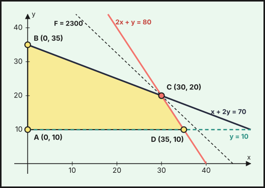
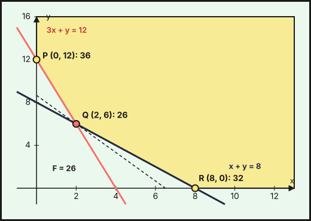
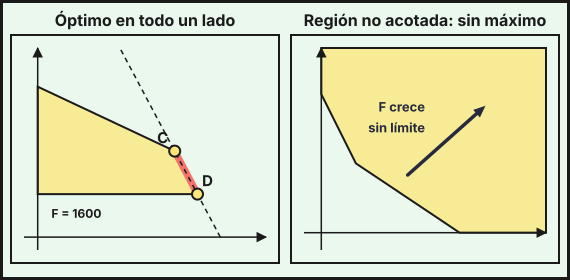

## 1. Qué es un problema de programación lineal

La **programación lineal** busca el mayor beneficio (o el menor coste) posible cuando los recursos son limitados. Un problema tiene estos elementos:

- **Variables de decisión** $x$ e $y$: lo que se puede elegir (unidades a fabricar, kilos a comprar).
- **Restricciones**: desigualdades lineales que limitan las variables (horas disponibles, cantidades mínimas). Casi siempre incluyen $x\ge0$, $y\ge0$.
- **Región factible**: el conjunto de puntos $(x,y)$ que cumplen todas las restricciones a la vez.
- **Función objetivo** $F(x,y)=ax+by$: lo que se quiere **maximizar** (beneficio) o **minimizar** (coste).
- **Solución óptima**: el punto de la región factible donde $F$ toma el mayor (o menor) valor.

::: {.callout-note}
## Teorema fundamental
Si la región factible es un polígono **acotado**, $F$ alcanza su máximo y su mínimo en **vértices** de la región. Si dos vértices consecutivos dan el mismo valor óptimo, también lo da **todo el lado** que los une. Si la región **no está acotada**, el máximo (o el mínimo) puede no existir.
:::

## 2. Región factible: determinación gráfica

Cada restricción $ax+by\le c$ (o $\ge c$) es un **semiplano** limitado por la recta $ax+by=c$. Para dibujarlo:

1. Se traza la recta $ax+by=c$ con dos de sus puntos (por ejemplo, los cortes con los ejes).
2. Se elige un **punto de prueba** que no esté en la recta, normalmente $(0,0)$, y se sustituye. Si cumple la desigualdad, el semiplano es el que lo contiene; si no, es el otro.
3. La región factible es la **intersección** de todos los semiplanos.

Traducción de frases a desigualdades:

| El enunciado dice | Se escribe |
|---|---|
| «como máximo», «no más de», «dispone de» | $\le$ |
| «al menos», «como mínimo», «necesita» | $\ge$ |
| «exactamente» | $=$ |

## 3. Vértices y solución óptima

Los **vértices** son los puntos de corte de pares de rectas que además cumplen **todas** las restricciones. Se hallan resolviendo sistemas de dos ecuaciones (por reducción o por Cramer, ver el [tema 2](../02-sistemas-ecuaciones-lineales/index.qmd)) y se descartan los cortes que incumplen alguna desigualdad.

Después se calcula $F$ en cada vértice y se elige el mayor (si se maximiza) o el menor (si se minimiza). Una forma gráfica equivalente son las **rectas de nivel** $F(x,y)=k$: son paralelas entre sí, y al desplazarlas en el sentido en que $F$ crece, la última que toca la región pasa por el vértice óptimo.

## 4. Ejemplo 1: maximizar el beneficio

Una panadería elabora pan rústico y pan de molde. Cada tanda de pan rústico necesita 2 kg de harina y 1 hora de horno; cada tanda de pan de molde, 1 kg de harina y 2 horas de horno. Dispone de 80 kg de harina y 70 horas de horno. Debe hacer al menos 10 tandas de pan de molde para una residencia. Cada tanda deja un beneficio de 50 € (rústico) y 40 € (molde). ¿Cuántas tandas de cada pan maximizan el beneficio?

**Planteamiento.** $x$ = tandas de pan rústico, $y$ = tandas de pan de molde.

$$\max\ F(x,y)=50x+40y\quad\text{sujeto a}\quad\begin{cases}2x+y\le80&\text{(harina)}\\ x+2y\le70&\text{(horno)}\\ y\ge10&\text{(pedido mínimo)}\\ x\ge0\end{cases}$$

**Región factible.** Las rectas pasan por $2x+y=80$: $(0,80)$ y $(40,0)$; $x+2y=70$: $(0,35)$ y $(70,0)$; $y=10$: horizontal. Con el punto de prueba $(0,20)$: $2\cdot0+20=20\le80$ ✓, $0+40=40\le70$ ✓, $20\ge10$ ✓, así que la región está del lado de ese punto en las tres.

{fig-alt="Cuadrilátero amarillo con vértices A (0,10), B (0,35), C (30,20) y D (35,10), limitado por las rectas de harina, horno y pedido mínimo, y una recta de nivel discontinua que pasa por C" width="90%" fig-align="center"}

**Vértices.**

- $A$: $x=0$ e $y=10$ → $A(0,10)$.
- $B$: $x=0$ y $x+2y=70$ → $B(0,35)$.
- $C$: $2x+y=80$ y $x+2y=70$. Por Cramer, $\left|\begin{matrix}2&1\\1&2\end{matrix}\right|=3$, $x=\dfrac{\left|\begin{matrix}80&1\\70&2\end{matrix}\right|}{3}=\dfrac{90}{3}=30$ e $y=\dfrac{\left|\begin{matrix}2&80\\1&70\end{matrix}\right|}{3}=\dfrac{60}{3}=20$ → $C(30,20)$.
- $D$: $y=10$ y $2x+y=80$ → $D(35,10)$.

Otros cortes de rectas no son vértices: $x=0$ con $2x+y=80$ da $(0,80)$, que incumple el horno ($0+160>70$); $y=10$ con $x+2y=70$ da $(50,10)$, que incumple la harina ($100+10>80$).

**Solución óptima.**

| Vértice | $F=50x+40y$ |
|---|---|
| $A(0,10)$ | $400$ |
| $B(0,35)$ | $1400$ |
| $C(30,20)$ | $\mathbf{2300}$ |
| $D(35,10)$ | $2150$ |

El máximo está en $C$: **30 tandas de pan rústico y 20 de pan de molde**, con un beneficio de **2 300 €**. Comprobación: harina $2\cdot30+20=80$ kg, horno $30+2\cdot20=70$ h; se usan todos los recursos.

## 5. Ejemplo 2: minimizar el coste (región no acotada)

Un comedor social compra legumbres ($x$ kg, a 4 €/kg) y arroz ($y$ kg, a 3 €/kg). Cada kilo de legumbres aporta 3 unidades de proteína y cada kilo de arroz, 1. Necesita al menos 12 unidades de proteína y al menos 8 kg de alimento en total. ¿Cómo comprar con el menor coste?

$$\min\ F(x,y)=4x+3y\quad\text{sujeto a}\quad\begin{cases}3x+y\ge12&\text{(proteína)}\\ x+y\ge8&\text{(total)}\\ x\ge0,\ y\ge0\end{cases}$$

Con el punto de prueba $(0,0)$: $0\ge12$ es falso, luego la región queda **al otro lado** de ambas rectas (arriba y a la derecha). No hay ninguna restricción «$\le$», así que la región **no está acotada**.

{fig-alt="Región amarilla que se extiende hacia arriba y a la derecha, con vértices P (0,12), Q (2,6) y R (8,0) y una recta de nivel discontinua que pasa por Q" width="90%" fig-align="center"}

**Vértices.** $P$: $x=0$ y $3x+y=12$ → $P(0,12)$. $Q$: $3x+y=12$ y $x+y=8$; restando, $2x=4$, luego $Q(2,6)$. $R$: $y=0$ y $x+y=8$ → $R(8,0)$. Se descartan $(0,8)$ (incumple la proteína: $8<12$) y $(4,0)$ (incumple el total: $4<8$).

| Vértice | $F=4x+3y$ |
|---|---|
| $P(0,12)$ | $36$ |
| $Q(2,6)$ | $\mathbf{26}$ |
| $R(8,0)$ | $32$ |

El mínimo es **26 €**, comprando **2 kg de legumbres y 6 kg de arroz**. Como $x,y\ge0$ y los coeficientes de $F$ son positivos, $F\ge0$ y el mínimo existe aunque la región no esté acotada. En cambio, $F$ **no tiene máximo**: en el punto $(1000,1000)$ ya vale $7000$, y crece sin límite.

## 6. Casos especiales

{fig-alt="Dos dibujos: a la izquierda la región de la panadería con una recta de nivel paralela al lado entre C y D que está resaltado; a la derecha una región no acotada con una flecha que indica que la función objetivo crece sin límite" width="95%" fig-align="center"}

- **Infinitas soluciones óptimas.** En la panadería, si el beneficio fuera $F=40x+20y$, resultaría $F(C)=1600$ y $F(D)=1600$: la recta de nivel es paralela al lado $CD$ (que está sobre $2x+y=80$). Son óptimos todos los puntos $(x,\,80-2x)$ con $30\le x\le35$. Si las tandas han de ser enteras, hay seis soluciones, por ejemplo $(31,18)$, con $F=40\cdot31+20\cdot18=1600$.
- **Sin máximo (o sin mínimo).** En una región no acotada, $F$ puede crecer o decrecer sin límite en una dirección.
- **Sin solución.** Si las restricciones se contradicen, la región factible es vacía.

::: {.callout-warning}
## Errores frecuentes
- Evaluar $F$ en puntos de corte que no cumplen todas las restricciones. Cada candidato a vértice debe comprobarse en **todas** las desigualdades.
- Olvidar $x\ge0$ e $y\ge0$ cuando son cantidades físicas.
- Dar solo el valor de $F$: el enunciado pide también **en qué punto** se alcanza, y con las unidades.
:::

::: {.callout-tip}
## Resumen rápido
1. Define $x$ e $y$ (con unidades), la función objetivo $F$ y las restricciones.
2. Dibuja las rectas y marca la región factible (punto de prueba).
3. Halla los vértices resolviendo sistemas 2×2 y comprobando todas las restricciones.
4. Calcula $F$ en cada vértice y elige el mayor o el menor.
5. Si hay dos vértices óptimos consecutivos, lo es todo el lado. Si la región no está acotada, puede no haber máximo o mínimo.
6. Interpreta la solución en el contexto.
:::
