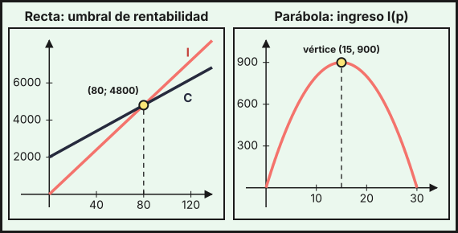
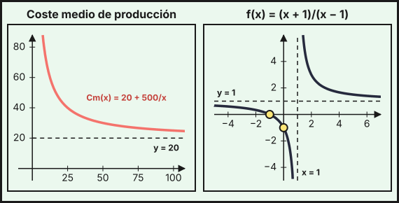
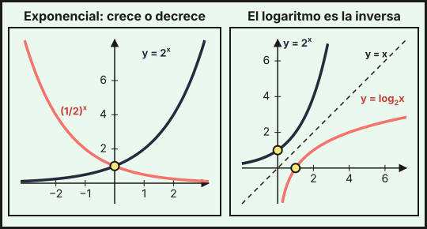
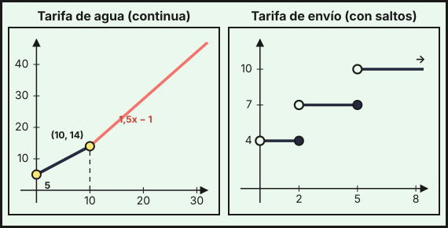

## 1. Concepto, dominio y propiedades básicas

Una **función** $f$ asigna a cada número $x$ de su **dominio** un único valor $y=f(x)$. El **dominio** $\operatorname{Dom}f$ es el conjunto de valores de $x$ para los que $f(x)$ existe; el **recorrido** es el conjunto de valores que toma $y$. La **gráfica** es el conjunto de puntos $(x,\,f(x))$.

**Dominio según el tipo de función**:

| Tipo | Dominio |
|---|---|
| Polinómica | todos los reales, $\mathbb{R}$ |
| Racional $\dfrac{P(x)}{Q(x)}$ | $\mathbb{R}$ menos los $x$ que anulan el denominador, $Q(x)=0$ |
| Con raíz de índice par $\sqrt{g(x)}$ | los $x$ con $g(x)\ge0$ |
| Logarítmica $\ln g(x)$ | los $x$ con $g(x)>0$ |
| Exponencial $a^{g(x)}$ | el dominio de $g$ |

Ejemplos:

- $f(x)=\dfrac{2x+1}{x^2-4}$: el denominador se anula en $x=\pm2$, luego $\operatorname{Dom}f=\mathbb{R}\setminus\{-2,\,2\}$.
- $g(x)=\ln(x-3)$: hace falta $x-3>0$, luego $\operatorname{Dom}g=(3,\,+\infty)$.
- $h(x)=\sqrt{6-2x}$: hace falta $6-2x\ge0$, luego $\operatorname{Dom}h=(-\infty,\,3]$.

**Puntos de corte con los ejes**: con el eje $Y$, el punto $(0,\,f(0))$ (si $0$ está en el dominio); con el eje $X$, los puntos $(x,\,0)$ con $f(x)=0$.

**Simetrías**: $f$ es **par** si $f(-x)=f(x)$ (simétrica respecto del eje $Y$, como $x^2$) y **impar** si $f(-x)=-f(x)$ (simétrica respecto del origen, como $x^3$).

**Crecimiento**: $f$ es **creciente** en un intervalo si al aumentar $x$ aumenta $f(x)$, y **decreciente** si disminuye. Los puntos donde pasa de crecer a decrecer son **máximos relativos**, y a la inversa, **mínimos relativos**. Con derivadas (tema 6) se calculan con precisión.

## 2. Funciones polinómicas

**Función lineal** $f(x)=mx+n$: su gráfica es una recta de **pendiente** $m$ (lo que aumenta $y$ cuando $x$ aumenta 1) y **ordenada en el origen** $n$ (el corte con el eje $Y$). Es el modelo de las magnitudes que crecen de forma constante.

*Ejemplo (umbral de rentabilidad).* Un taller tiene unos costes fijos de 2 000 € y 35 € de coste por unidad fabricada, y vende cada unidad a 60 €:

$$C(x)=2000+35x,\qquad I(x)=60x,\qquad B(x)=I(x)-C(x)=25x-2000$$

El **umbral de rentabilidad** es el valor de $x$ en el que ingresos y costes coinciden: $60x=2000+35x\Rightarrow x=80$ unidades (para $x=80$, $I=C=4800$ €). A partir de ahí hay beneficio: con 100 unidades, $B(100)=500$ €.

**Función cuadrática** $f(x)=ax^2+bx+c$ con $a\neq0$: su gráfica es una **parábola**, que se abre hacia arriba si $a>0$ y hacia abajo si $a<0$. Su **vértice** está en $x_v=-\dfrac{b}{2a}$, y es un mínimo si $a>0$ y un máximo si $a<0$. Los cortes con el eje $X$ salen de resolver $ax^2+bx+c=0$.

*Ejemplo (ingreso máximo).* Si el precio de un producto es $p$ euros, la demanda es $q=120-4p$ miles de unidades (como en el [tema 2](../02-sistemas-ecuaciones-lineales/index.qmd)) y el ingreso es

$$I(p)=p\cdot(120-4p)=-4p^2+120p$$

Corta el eje $X$ en $p=0$ y $p=30$; el vértice está en $p_v=-\dfrac{120}{2\cdot(-4)}=15$, con $I(15)=900$ (miles de euros), cuando se venden $q=60$ miles de unidades. Si cada unidad cuesta 5 € producirla, el beneficio es $B(p)=(p-5)(120-4p)=-4p^2+140p-600$, que corta el eje $X$ en $p=5$ y $p=30$ y tiene su máximo en $p_v=17{,}5$ con $B=625$.

{fig-alt="A la izquierda dos rectas, ingresos y costes, que se cortan en el punto de 80 unidades y 4800 euros; a la derecha una parábola abierta hacia abajo con vértice en precio 15 e ingreso 900" width="95%" fig-align="center"}

Las polinómicas de grado 3 o más tienen gráficas con más «curvas». Para estudiarlas se necesitan las derivadas (temas 6 y 7).

## 3. Funciones racionales

Una **función racional** es un cociente de polinomios, $f(x)=\dfrac{P(x)}{Q(x)}$. Su dominio excluye los ceros de $Q$. En un cero de $Q$ que no anula a $P$ la gráfica tiene una **asíntota vertical** (la curva se pega a una recta vertical sin tocarla). Cuando $x$ crece mucho, la curva puede acercarse a una **asíntota horizontal** $y=b$. Estas asíntotas se estudian con límites en el [tema 5](../05-limites-continuidad/index.qmd).

El caso más sencillo es la **hipérbola** $f(x)=\dfrac{k}{x-a}+b$, con asíntotas $x=a$ e $y=b$.

*Ejemplo (coste medio).* Una empresa tiene unos costes totales $C(x)=500+20x$ al producir $x$ unidades. El **coste medio** por unidad es

$$C_m(x)=\frac{500+20x}{x}=20+\frac{500}{x},\qquad x>0$$

| $x$ | 10 | 25 | 100 | 500 | 1000 |
|---|---|---|---|---|---|
| $C_m(x)$ | 70 | 40 | 25 | 21 | 20,5 |

El coste medio baja al producir más (se reparten los costes fijos), pero nunca baja de 20 €, que es la asíntota horizontal $y=20$.

*Ejemplo (representación).* Para $f(x)=\dfrac{x+1}{x-1}=1+\dfrac{2}{x-1}$:

- **Dominio**: $\mathbb{R}\setminus\{1\}$. Asíntota vertical: $x=1$.
- **Asíntota horizontal**: $y=1$, porque $f(x)=1+\dfrac{2}{x-1}$ se acerca a 1 cuando $x$ crece o decrece mucho.
- **Cortes**: con el eje $Y$, $f(0)=-1$; con el eje $X$, $x+1=0\Rightarrow x=-1$.
- **Tabla de valores**:

| $x$ | $-3$ | $-2$ | $0$ | $2$ | $3$ | $5$ |
|---|---|---|---|---|---|---|
| $f(x)$ | $\tfrac12$ | $\tfrac13$ | $-1$ | $3$ | $2$ | $\tfrac32$ |

{fig-alt="A la izquierda una curva decreciente que se acerca a la recta horizontal y igual a 20; a la derecha una hipérbola con dos ramas separadas por la asíntota vertical x igual a 1 y la asíntota horizontal y igual a 1" width="95%" fig-align="center"}

## 4. Funciones exponenciales

Una **función exponencial** es $f(x)=a^x$ con $a>0$ y $a\neq1$. Sus propiedades son:

- Dominio $\mathbb{R}$ y recorrido $(0,\,+\infty)$: siempre es positiva.
- Pasa por $(0,\,1)$ porque $a^0=1$.
- Si $a>1$ es **creciente** (crecimiento); si $0<a<1$ es **decreciente** (decrecimiento).
- Tiene una asíntota horizontal en $y=0$: por la izquierda si $a>1$ y por la derecha si $0<a<1$.

El número $e\approx2{,}718$ es la base más usada en ciencia y economía: $f(x)=e^x$.

Se usa para modelizar magnitudes que crecen o decrecen un **porcentaje fijo** en cada período:

- **Capital**: $5000$ € al $3\,\%$ anual valen $C(t)=5000\cdot1{,}03^t$ tras $t$ años; con $t=10$, $C(10)\approx6719{,}58$ €.
- **Depreciación**: una máquina de $20000$ € que pierde el $15\,\%$ de su valor cada año vale $V(t)=20000\cdot0{,}85^t$; tras 5 años, $V(5)\approx8874{,}11$ €.
- **Población**: un municipio de $80000$ habitantes que pierde el $1{,}5\,\%$ cada año tiene $P(t)=80000\cdot0{,}985^t$; tras 10 años, $P(10)\approx68778$ habitantes.

## 5. Funciones logarítmicas

El **logaritmo en base $a$** ($a>0$, $a\neq1$) es el exponente al que hay que elevar $a$ para obtener un número: $\log_a x=y\iff a^y=x$. Con base $10$ se escribe $\log x$ y con base $e$, $\ln x$.

La función $f(x)=\log_a x$ es la **inversa** de $a^x$: sus gráficas son simétricas respecto de la recta $y=x$. Sus propiedades son:

- Dominio $(0,\,+\infty)$ y recorrido $\mathbb{R}$.
- Pasa por $(1,\,0)$ porque $\log_a1=0$.
- Es creciente si $a>1$ y decreciente si $0<a<1$. Tiene una asíntota vertical en $x=0$.

**Propiedades de los logaritmos**:

$$\log_a(M\cdot N)=\log_aM+\log_aN\qquad\log_a\frac MN=\log_aM-\log_aN\qquad\log_a M^k=k\log_aM\qquad\log_a M=\frac{\ln M}{\ln a}$$

{fig-alt="A la izquierda dos curvas que pasan por el punto (0,1), una creciente y otra decreciente; a la derecha la exponencial de base 2 y su logaritmo, simétricos respecto de la diagonal" width="95%" fig-align="center"}

**Ecuaciones exponenciales y logarítmicas.** Para despejar un exponente se toman logaritmos; para despejar el argumento de un logaritmo se usa la definición.

- ¿En cuántos años se duplica un capital al $3\,\%$ anual? $1{,}03^t=2\Rightarrow t=\dfrac{\ln2}{\ln1{,}03}\approx23{,}45$ años.
- ¿Cuándo tendrá el municipio menos de $60000$ habitantes? $80000\cdot0{,}985^t=60000\Rightarrow0{,}985^t=0{,}75\Rightarrow t=\dfrac{\ln0{,}75}{\ln0{,}985}\approx19{,}03$. A los 19 años aún tiene $60031$ habitantes y a los 20 baja a $59131$, luego lo hará **a partir del año 20**.
- $\log_2(x+3)=4\Rightarrow x+3=2^4=16\Rightarrow x=13$.
- $3^{2x-1}=81=3^4\Rightarrow2x-1=4\Rightarrow x=\tfrac52$.
- $e^x=7\Rightarrow x=\ln7\approx1{,}946$.

## 6. Funciones definidas a trozos

Una función **a trozos** usa una fórmula distinta en cada intervalo. Su dominio es la unión de los intervalos. Para calcular $f(a)$ se busca el trozo al que pertenece $a$ y se aplica su fórmula. Para dibujarla, se representa cada trozo solo en su intervalo, marcando con un punto **relleno** los extremos que sí pertenecen al trozo y con un punto **abierto** los que no.

*Ejemplo (factura del agua).* Una compañía cobra 5 € de cuota fija más 0,90 €/m³ en los primeros 10 m³. Los m³ que pasen de 10 se cobran a 1,50 €:

$$f(x)=\begin{cases}5+0{,}9x&0\le x\le10\\14+1{,}5(x-10)=1{,}5x-1&x>10\end{cases}$$

Se tiene $f(8)=12{,}2$ €, $f(10)=14$ € y $f(25)=36{,}5$ €. Los dos trozos dan el mismo valor en $x=10$ ($5+9=14=15-1$), así que la gráfica no tiene saltos. Si una factura es de 32 €, como $32>14$ se usa el segundo trozo: $1{,}5x-1=32\Rightarrow x=22$ m³.

*Ejemplo (tarifa de envío).* El precio de un envío es 4 € hasta 2 kg, 7 € de más de 2 kg a 5 kg, y 10 € por encima de 5 kg:

$$g(w)=\begin{cases}4&0<w\le2\\7&2<w\le5\\10&w>5\end{cases}$$

Aquí la gráfica sí tiene **saltos** (en $w=2$ y $w=5$): un paquete de 2 kg cuesta $g(2)=4$ € y uno de 2,5 kg, $g(2{,}5)=7$ €. La continuidad se estudia con rigor en el [tema 5](../05-limites-continuidad/index.qmd).

{fig-alt="A la izquierda dos tramos rectos unidos en el punto de 10 metros cúbicos y 14 euros; a la derecha tres segmentos horizontales con puntos abiertos y cerrados que saltan en 2 y 5 kilos" width="95%" fig-align="center"}

El **valor absoluto** es otra función a trozos: $|x-3|=\begin{cases}3-x&x<3\\x-3&x\ge3\end{cases}$.

::: {.callout-tip}
## Cómo representar una función
1. **Dominio** (denominadores, raíces, logaritmos) y, si hay trozos, los intervalos.
2. **Cortes** con los ejes: $f(0)$ y $f(x)=0$.
3. **Asíntotas**: verticales en los ceros del denominador; horizontales según el comportamiento para $x$ grande.
4. **Simetrías** y **tabla de valores** con puntos a ambos lados de las asíntotas y de los cortes.
5. **Crecimiento y extremos** (con la derivada, temas 6 y 7).
6. Unir los puntos respetando dominio, asíntotas y puntos abiertos.
:::

::: {.callout-note}
## Resumen rápido
- Lineal $mx+n$: recta. Cuadrática: parábola de vértice $x_v=-b/(2a)$.
- Racional: dominio sin ceros del denominador; asíntotas verticales y horizontales.
- Exponencial $a^x$: $\mathbb{R}\to(0,\infty)$, pasa por $(0,1)$; $a>1$ crece, $0<a<1$ decrece.
- Logaritmo: inversa de la exponencial, definida para $x>0$, pasa por $(1,0)$.
- A trozos: una fórmula por intervalo; ojo a los puntos de unión (rellenos o abiertos).
:::
