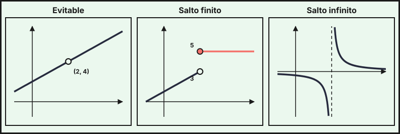
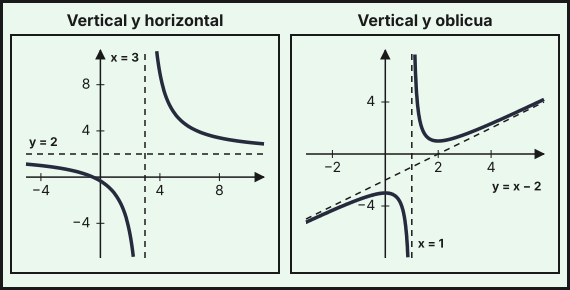

## 1. Límite de una función

El **límite** de $f$ cuando $x$ tiende a $a$, escrito $\displaystyle\lim_{x\to a}f(x)=L$, indica a qué valor se acerca $f(x)$ cuando $x$ se acerca a $a$ (sin necesidad de que $x$ llegue a valer $a$). Pueden ser $L=\pm\infty$ si $f(x)$ crece o decrece sin límite.

Los **límites laterales** estudian el acercamiento por un solo lado: $\displaystyle\lim_{x\to a^-}f(x)$ (por la izquierda, con $x<a$) y $\displaystyle\lim_{x\to a^+}f(x)$ (por la derecha, con $x>a$). El límite existe si y solo si **los dos laterales existen y son iguales**.

*Ejemplos con las funciones del [tema 4](../04-funciones/index.qmd).* En la factura del agua, en $x=10$ ambos laterales valen 14 (la gráfica no se rompe), así que $\lim_{x\to10}f(x)=14$. En la tarifa de envío $g(w)$, en $w=2$ el límite por la izquierda es 4 y por la derecha 7: **no existe** el límite.

## 2. Cálculo de límites en un punto

Para las funciones elementales (polinomios, racionales, exponenciales, logaritmos, raíces) basta **sustituir** $x=a$ cuando $a$ está en el dominio. Si la sustitución no da un número, aparecen estas situaciones:

| Forma al sustituir | Qué hacer |
|---|---|
| $\dfrac{k}{0}$ con $k\neq0$ | El límite es $\pm\infty$: se estudia el signo por cada lado |
| $\dfrac00$ (indeterminada) | Factorizar y simplificar, o multiplicar por el conjugado si hay raíces |

**Ejemplos.**

- $\displaystyle\lim_{x\to1}\frac{x+2}{(x-1)^2}$: da $\frac30$ y $(x-1)^2>0$ a ambos lados, luego el límite es $+\infty$.
- $\displaystyle\lim_{x\to1}\frac{1}{x-1}$: por la izquierda $-\infty$ y por la derecha $+\infty$, luego **no existe**.
- $\displaystyle\lim_{x\to2}\frac{x^2-4}{x-2}=\lim_{x\to2}\frac{(x-2)(x+2)}{x-2}=\lim_{x\to2}(x+2)=4$ (forma $\frac00$, se factoriza).
- $\displaystyle\lim_{x\to3}\frac{\sqrt{x+1}-2}{x-3}$: forma $\frac00$. Se multiplica y divide por el conjugado $\sqrt{x+1}+2$:
$$\frac{(\sqrt{x+1}-2)(\sqrt{x+1}+2)}{(x-3)(\sqrt{x+1}+2)}=\frac{x-3}{(x-3)(\sqrt{x+1}+2)}=\frac{1}{\sqrt{x+1}+2}\ \xrightarrow[x\to3]{}\ \frac14$$

## 3. Límites en el infinito

El límite $\displaystyle\lim_{x\to+\infty}f(x)$ (o $-\infty$) describe el comportamiento a largo plazo.

- **Polinomios**: dominan los términos de mayor grado; por ejemplo $\lim_{x\to+\infty}x^3=+\infty$ y $\lim_{x\to-\infty}x^3=-\infty$.
- **Cocientes de polinomios**: se comparan los **grados** del numerador $n$ y del denominador $d$:

| Grados | Límite en $\pm\infty$ |
|---|---|
| $n<d$ | $0$ |
| $n=d$ | cociente de los coeficientes de mayor grado |
| $n>d$ | $\pm\infty$ (se estudia el signo) |

$$\lim_{x\to\infty}\frac{3x^2+x}{x^2-5}=3,\qquad\lim_{x\to\infty}\frac{2x+1}{x^2+3}=0,\qquad\lim_{x\to\infty}\frac{x^3+1}{2x^2}=+\infty$$

- **Diferencia de raíces** ($\infty-\infty$): se multiplica y divide por el conjugado.
$$\lim_{x\to\infty}\left(\sqrt{x^2+x}-x\right)=\lim_{x\to\infty}\frac{x^2+x-x^2}{\sqrt{x^2+x}+x}=\lim_{x\to\infty}\frac{x}{\sqrt{x^2+x}+x}=\frac12$$
- **Exponenciales y logaritmos**: $e^x\to+\infty$ y $\ln x\to+\infty$ cuando $x\to+\infty$, pero a ritmos muy distintos. Crece más rápido la exponencial que cualquier potencia, y esta más rápido que el logaritmo, de modo que
$$\lim_{x\to\infty}\frac{x}{e^x}=0,\qquad\lim_{x\to\infty}\frac{\ln x}{x}=0,\qquad\lim_{x\to\infty}e^{-x}=0,\qquad\lim_{x\to-\infty}e^{x}=0$$

*Ejemplo (saturación).* El porcentaje de hogares de un barrio con conexión a internet $t$ años después de un programa de ayudas es $S(t)=\dfrac{80t}{t+4}$. Se tiene $S(4)=40\,\%$, $S(16)=64\,\%$ y $S(96)=76{,}8\,\%$. Como $\lim_{t\to\infty}S(t)=80$, la cobertura se acerca al $80\,\%$ pero nunca lo supera. De igual forma, el coste medio $C_m(x)=20+\frac{500}{x}$ del tema 4 cumple $\lim_{x\to\infty}C_m(x)=20$.

::: {.callout-important}
## Ampliación (fuera del currículo de la PAU)
**La indeterminación $1^\infty$ y el número $e$.** Se tiene $\displaystyle\lim_{n\to\infty}\left(1+\frac rn\right)^n=e^r$. Es la base de la **capitalización continua**: un capital $C_0$ al interés anual $r$ capitalizado de forma continua vale $C_0\,e^{rt}$ tras $t$ años. Con $5000$ € al $3\,\%$ durante 10 años: $5000\,e^{0{,}3}\approx6749{,}29$ €, frente a los $6719{,}58$ € de la capitalización anual del tema 4.
:::

## 4. Continuidad

Una función $f$ es **continua en $x=a$** si cumple las tres condiciones:

1. $f(a)$ existe (está en el dominio).
2. $\displaystyle\lim_{x\to a}f(x)$ existe (laterales iguales).
3. $\displaystyle\lim_{x\to a}f(x)=f(a)$.

Las funciones **polinómicas** son continuas en todo $\mathbb{R}$; las **racionales**, en su dominio; la exponencial, en $\mathbb{R}$; el logaritmo, en $(0,+\infty)$; y las raíces, en su dominio. Una función **a trozos** puede romperse en los puntos de unión, que hay que estudiar uno a uno.

*Ejemplo (comisión bancaria).* Un banco cobra por una transferencia de $x$ euros una comisión
$$C(x)=\begin{cases}a+0{,}01x&0<x\le500\\10+0{,}005x&x>500\end{cases}$$
¿Qué valor de $a$ hace que $C$ sea continua en $x=500$? Hay que igualar los laterales: $a+0{,}01\cdot500=10+0{,}005\cdot500\Rightarrow a+5=12{,}5\Rightarrow a=7{,}5$ €.

*Otro ejemplo.* Para que $f(x)=\begin{cases}ax+1&x\le2\\x^2-a&x>2\end{cases}$ sea continua en $x=2$ se iguala $2a+1=4-a$, y resulta $a=1$.

## 5. Tipos de discontinuidad

Si $f$ no es continua en $a$, se dice que tiene una **discontinuidad** en $a$, que se clasifica según los límites:

| Tipo | Condición | Ejemplo en $x=2$ |
|---|---|---|
| **Evitable** | existe el límite (finito) pero no coincide con $f(2)$, o $f(2)$ no existe | $f(x)=\dfrac{x^2-4}{x-2}$: el límite es $4$ y $f(2)$ no existe |
| **De salto finito** | los límites laterales existen, son finitos y distintos | $h(x)=\begin{cases}x+1&x<2\\5&x\ge2\end{cases}$: laterales $3$ y $5$ (salto de $2$) |
| **De salto infinito** | algún límite lateral es $\pm\infty$ | $k(x)=\dfrac{1}{x-2}$: laterales $-\infty$ y $+\infty$ |

La discontinuidad evitable se «repara» definiendo $f(2)$ igual al límite. La tarifa de envío del tema 4 tiene discontinuidades de salto finito en $w=2$ y $w=5$.

{fig-alt="Tres gráficas con una discontinuidad en x igual a 2: una recta con un punto hueco, dos tramos con un salto vertical entre los valores 3 y 5, y una hipérbola con asíntota vertical" width="95%" fig-align="center"}

## 6. Asíntotas

Una **asíntota** es una recta a la que la gráfica se acerca indefinidamente.

**Vertical** $x=a$: cuando $\displaystyle\lim_{x\to a^-}f(x)=\pm\infty$ o $\displaystyle\lim_{x\to a^+}f(x)=\pm\infty$ (la discontinuidad es de salto infinito). Se buscan en los puntos donde $f$ no está definida: ceros del denominador (que no anulen el numerador) y, en $\ln g(x)$, donde $g(x)\to0^+$.

**Horizontal** $y=b$: cuando $\displaystyle\lim_{x\to+\infty}f(x)=b$ o $\displaystyle\lim_{x\to-\infty}f(x)=b$, con $b$ un número real. Puede haber una distinta a cada lado.

**Oblicua** $y=mx+n$: cuando la gráfica se acerca a una recta que no es horizontal. Se calcula en $+\infty$ (y análogamente en $-\infty$):
$$m=\lim_{x\to\infty}\frac{f(x)}{x}\ (\text{finito y }\neq0),\qquad n=\lim_{x\to\infty}\bigl(f(x)-mx\bigr)\ (\text{finito})$$
No hay asíntota oblicua por un lado en el que ya hay una horizontal. En una función racional existe cuando el grado del numerador es **exactamente una unidad mayor** que el del denominador, y se obtiene dividiendo: el cociente es $mx+n$.

*Ejemplo 1.* $f(x)=\dfrac{2x+1}{x-3}$:

- Vertical: el denominador se anula en $x=3$ y $f$ tiende a $+\infty$ por la derecha y a $-\infty$ por la izquierda: $x=3$.
- Horizontal: $\lim_{x\to\pm\infty}f(x)=2$: $y=2$.

*Ejemplo 2.* $g(x)=\dfrac{x^2-3x+3}{x-1}$. Al dividir, $g(x)=x-2+\dfrac{1}{x-1}$.

- Vertical: $x=1$ (el numerador vale $1$ en $x=1$).
- Horizontal: no hay, porque $\lim_{x\to\pm\infty}g(x)=\pm\infty$.
- Oblicua: $m=\lim\dfrac{g(x)}{x}=1$ y $n=\lim\bigl(g(x)-x\bigr)=-2$, luego $y=x-2$.

{fig-alt="A la izquierda una hipérbola con asíntota vertical x igual a 3 y horizontal y igual a 2; a la derecha una función con asíntota vertical x igual a 1 y asíntota oblicua y igual a x menos 2" width="95%" fig-align="center"}

Las funciones exponenciales y logarítmicas del tema 4 tienen asíntotas: $a^x$ tiene una horizontal en $y=0$ (por un lado) y $\ln x$ una vertical en $x=0$.

::: {.callout-tip}
## Resumen rápido
- $\lim_{x\to a}f=L\iff$ los dos laterales valen $L$.
- $\frac k0\to\pm\infty$ (signo por lados); $\frac00$: factorizar o conjugado; $\infty-\infty$ con raíces: conjugado.
- En $\pm\infty$ con racionales: comparar grados. Orden de crecimiento: $\ln x\ll x^n\ll e^x$.
- Continua en $a$: $f(a)$ existe, el límite existe y son iguales.
- Discontinuidad: evitable (límite finito $\neq f(a)$), salto finito (laterales finitos distintos), salto infinito (algún lateral infinito).
- Asíntotas: vertical $x=a$ (límite infinito), horizontal $y=b$ (límite finito en $\pm\infty$), oblicua $y=mx+n$ con $m=\lim f/x$, $n=\lim(f-mx)$.
:::
