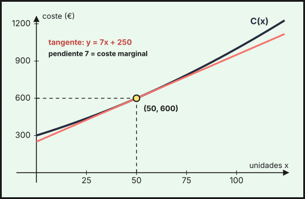
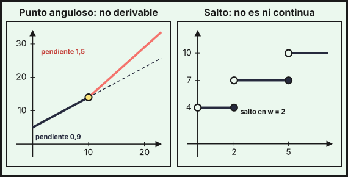

## 1. Derivada de una función en un punto

La **tasa de variación media** de $f$ en $[a,\,b]$ es $\dfrac{f(b)-f(a)}{b-a}$: cuánto cambia $f$ por unidad de $x$ en promedio. La **derivada** en $a$ es la tasa de variación **instantánea**, el límite de la media cuando el intervalo se hace muy pequeño:

$$f'(a)=\lim_{h\to0}\frac{f(a+h)-f(a)}{h}=\lim_{x\to a}\frac{f(x)-f(a)}{x-a}$$

- **Significado geométrico**: $f'(a)$ es la **pendiente de la recta tangente** a la gráfica en $(a,\,f(a))$.
- **Significado económico**: si $C(x)$ es el coste de producir $x$ unidades, $C'(x)$ es el **coste marginal** (lo que cuesta, aproximadamente, producir una unidad más). De igual forma existen el ingreso marginal $I'(x)$ y el beneficio marginal $B'(x)$.

*Ejemplo.* Para $C(x)=0{,}02x^2+5x+300$ (euros, con $x$ unidades), pasar de 50 a 60 unidades cuesta de media $\dfrac{C(60)-C(50)}{10}=\dfrac{672-600}{10}=7{,}2$ € por unidad. El coste marginal en $x=50$ es la derivada, que se obtiene con la definición:

$$\frac{C(50+h)-C(50)}{h}=\frac{0{,}02(100h+h^2)+5h}{h}=7+0{,}02h\ \xrightarrow[h\to0]{}\ 7$$

es decir, $C'(50)=7$ €/unidad. La función $f'$, que da la derivada en cada punto, es la **función derivada**.

## 2. Derivadas de las funciones elementales y reglas de derivación

| $f(x)$ | $f'(x)$ |
|---|---|
| $k$ (constante) | $0$ |
| $x^n$ | $n\,x^{n-1}$ |
| $\sqrt{x}$ | $\dfrac{1}{2\sqrt{x}}$ |
| $e^x$ | $e^x$ |
| $a^x$ | $a^x\ln a$ |
| $\ln x$ | $\dfrac1x$ |
| $\log_a x$ | $\dfrac{1}{x\ln a}$ |

**Reglas de las operaciones**:

- **Suma**: $(f+g)'=f'+g'$. **Producto por un número**: $(k\cdot f)'=k\cdot f'$.
- **Producto**: $(f\cdot g)'=f'\cdot g+f\cdot g'$.
- **Cociente**: $\left(\dfrac fg\right)'=\dfrac{f'\cdot g-f\cdot g'}{g^2}$.
- **Regla de la cadena**: $(f\circ g)'(x)=f'(g(x))\cdot g'(x)$ (se deriva «por fuera» y se multiplica por la derivada de «lo de dentro»).

Con la cadena, cada fila de la tabla se generaliza ($u$ es una función de $x$):

| $f(x)$ | $f'(x)$ |
|---|---|
| $u^n$ | $n\,u^{n-1}\cdot u'$ |
| $\sqrt{u}$ | $\dfrac{u'}{2\sqrt{u}}$ |
| $e^{u}$ | $u'\,e^{u}$ |
| $a^{u}$ | $u'\,a^{u}\ln a$ |
| $\ln u$ | $\dfrac{u'}{u}$ |
| $\log_a u$ | $\dfrac{u'}{u\ln a}$ |

**Ejemplos.**

| Función | Derivada |
|---|---|
| $x^3-2x^2+5x-1$ (polinómica) | $3x^2-4x+5$ |
| $(2x+1)^5$ (cadena) | $5(2x+1)^4\cdot2=10(2x+1)^4$ |
| $\dfrac{x^2+1}{x-2}$ (racional) | $\dfrac{2x(x-2)-(x^2+1)}{(x-2)^2}=\dfrac{x^2-4x-1}{(x-2)^2}$ |
| $\sqrt{x^2+1}$ (irracional) | $\dfrac{2x}{2\sqrt{x^2+1}}=\dfrac{x}{\sqrt{x^2+1}}$ |
| $e^{x^2}$ y $2^x$ (exponenciales) | $2x\,e^{x^2}$ y $2^x\ln2$ |
| $\ln(x^2+1)$ y $\log_2x$ (logarítmicas) | $\dfrac{2x}{x^2+1}$ y $\dfrac{1}{x\ln2}$ |

*Ejemplo con contexto (publicidad).* Las ventas, en miles de euros, al invertir $x$ miles de euros en publicidad son $V(x)=x\,e^{-x/10}$. Por la regla del producto y la cadena:

$$V'(x)=1\cdot e^{-x/10}+x\cdot\left(-\tfrac1{10}\right)e^{-x/10}=\left(1-\frac{x}{10}\right)e^{-x/10}$$

## 3. Recta tangente

La recta tangente a $y=f(x)$ en el punto de abscisa $a$ es

$$y-f(a)=f'(a)\,(x-a)$$

*Ejemplo.* La tangente al coste $C(x)=0{,}02x^2+5x+300$ en $x=50$: $C(50)=600$ y $C'(x)=0{,}04x+5$, luego $C'(50)=7$ y la tangente es $y=600+7(x-50)=7x+250$. Sirve para estimar: $C(51)\approx7\cdot51+250=607$ €; el valor exacto es $C(51)=607{,}02$ €.

{fig-alt="Curva creciente de costes y una recta tangente a ella en el punto de 50 unidades y 600 euros" width="85%" fig-align="center"}

*Ejemplo (tangente con pendiente dada).* Para hallar la tangente a $f(x)=x^2-x$ paralela a $y=2x+1$ se impone $f'(x)=2$: $2x-1=2\Rightarrow x=\frac32$. Como $f\!\left(\frac32\right)=\frac34$, la tangente es $y-\frac34=2\left(x-\frac32\right)$, es decir, $y=2x-\frac94$.

*Otro ejemplo.* La tangente a $f(x)=\ln x$ en $x=1$: $f(1)=0$, $f'(1)=1$, luego $y=x-1$.

## 4. Derivabilidad, derivadas laterales y continuidad

Las **derivadas laterales** son $f'(a^-)=\displaystyle\lim_{h\to0^-}\frac{f(a+h)-f(a)}{h}$ y $f'(a^+)=\displaystyle\lim_{h\to0^+}\frac{f(a+h)-f(a)}{h}$. La función es **derivable** en $a$ si las dos existen y son iguales: $f'(a^-)=f'(a^+)$.

::: {.callout-note}
## Derivabilidad y continuidad
- **Si $f$ es derivable en $a$, entonces es continua en $a$.** Por tanto, si no es continua, no es derivable.
- El recíproco es **falso**: $f$ puede ser continua y no derivable (un «pico» o **punto anguloso**), como $f(x)=|x|$ en $x=0$.
:::

*Ejemplos.* La factura del agua (tema 4) es continua en $x=10$, pero las derivadas laterales son distintas: $f'(10^-)=0{,}9$ y $f'(10^+)=1{,}5$, luego **no es derivable** en $x=10$ (el precio por m³ cambia de golpe). La tarifa de envío ni siquiera es continua en $w=2$, así que tampoco es derivable.

{fig-alt="A la izquierda dos tramos rectos de distinta pendiente que se unen en un punto anguloso; a la derecha una función escalonada con saltos" width="95%" fig-align="center"}

**Derivabilidad de una función a trozos.** En cada punto $a$ de unión de los trozos:

1. Se comprueba la **continuidad**: los dos valores laterales coinciden.
2. Se derivan los trozos y se comparan **las derivadas laterales** en $a$.

*Ejemplo.* $f(x)=\begin{cases}x^2-1&x\le2\\2x-1&x>2\end{cases}$. En $x=2$: los valores laterales son $3$ y $3$ (continua). Las derivadas, $2x=4$ por la izquierda y $2$ por la derecha, son distintas: continua pero **no derivable** en $x=2$.

## 5. Hallar coeficientes para que se cumplan ciertas propiedades

Cada propiedad da una ecuación sobre los coeficientes:

| Propiedad | Ecuación |
|---|---|
| La gráfica pasa por $(a,\,b)$ | $f(a)=b$ |
| La tangente en $x=a$ tiene pendiente $m$ | $f'(a)=m$ |
| Tangente horizontal (o extremo) en $x=a$ | $f'(a)=0$ |
| Continua en $x=a$ (función a trozos) | los valores laterales coinciden |
| Derivable en $x=a$ (función a trozos) | continua y derivadas laterales iguales |

*Ejemplo (función a trozos derivable).* Se quiere que $f(x)=\begin{cases}x^2+ax+b&x\le1\\\ln x+3&x>1\end{cases}$ sea derivable en $x=1$. Continuidad: $1+a+b=\ln1+3=3\Rightarrow a+b=2$. Derivadas: $f'(1^-)=2+a$ y $f'(1^+)=\frac11=1$, luego $2+a=1\Rightarrow a=-1$ y $b=3$.

*Ejemplo (otro tipo de trozos).* $f(x)=\begin{cases}ax+b&x<0\\e^x&x\ge0\end{cases}$ es derivable en $0$ si $b=e^0=1$ (continuidad) y $a=e^0=1$ (derivadas laterales).

*Ejemplo (función de costes).* Se sabe que $C(x)=ax^2+bx+c$ tiene un coste fijo de 200 € ($C(0)=200$), cuesta 420 € producir 10 unidades ($C(10)=420$) y el coste marginal en 10 unidades es 32 € ($C'(10)=32$). Como $c=200$, queda $100a+10b=220$ y $20a+b=32$; resolviendo, $a=1$ y $b=12$: $C(x)=x^2+12x+200$.

*Ejemplo (máximo).* Una función de ingresos $I(x)=ax^2+bx$ tiene su máximo en $x=25$ con $I(25)=625$. Por tanto $I'(25)=50a+b=0$ y $625a+25b=625$; de la primera $b=-50a$, y entonces $-625a=625$, de donde $a=-1$ y $b=50$: $I(x)=-x^2+50x$.

## 6. Derivadas y cálculo de límites: regla de L'Hôpital

Si al calcular $\displaystyle\lim_{x\to a}\frac{f(x)}{g(x)}$ sale la indeterminación $\dfrac00$ o $\dfrac{\infty}{\infty}$, y existe el límite del cociente de las derivadas, entonces

$$\lim_{x\to a}\frac{f(x)}{g(x)}=\lim_{x\to a}\frac{f'(x)}{g'(x)}$$

Vale también para $x\to\pm\infty$. Se derivan **numerador y denominador por separado** (no es la regla del cociente). Se puede aplicar varias veces.

- $\displaystyle\lim_{x\to0}\frac{e^x-1}{x}=\frac00\ \Rightarrow\ \lim_{x\to0}\frac{e^x}{1}=1$.
- $\displaystyle\lim_{x\to1}\frac{\ln x}{x-1}=\frac00\ \Rightarrow\ \lim_{x\to1}\frac{1/x}{1}=1$.
- $\displaystyle\lim_{x\to\infty}\frac{x^2}{e^x}=\frac\infty\infty\ \Rightarrow\ \lim\frac{2x}{e^x}=\frac\infty\infty\ \Rightarrow\ \lim\frac{2}{e^x}=0$.
- $\displaystyle\lim_{x\to\infty}\frac{\ln x}{\sqrt x}=\lim\frac{1/x}{1/(2\sqrt x)}=\lim\frac{2}{\sqrt x}=0$.

::: {.callout-important}
## Ampliación (fuera del currículo de la PAU)
- **Otras indeterminaciones con L'Hôpital.** Las formas $0\cdot\infty$, $\infty-\infty$, $1^\infty$, $0^0$ o $\infty^0$ se transforman primero en un cociente. Por ejemplo, $\displaystyle\lim_{x\to0^+}x\ln x=\lim_{x\to0^+}\frac{\ln x}{1/x}=\lim\frac{1/x}{-1/x^2}=\lim(-x)=0$.
- **Derivación logarítmica.** Para derivar $y=x^x$ se toman logaritmos, $\ln y=x\ln x$, y se deriva: $\frac{y'}{y}=\ln x+1$, luego $y'=x^x(\ln x+1)$.
:::

::: {.callout-tip}
## Resumen rápido
- $f'(a)=\lim_{h\to0}\frac{f(a+h)-f(a)}{h}$: pendiente de la tangente y tasa de variación instantánea (coste, ingreso o beneficio marginal).
- Tabla de derivadas + suma, producto, cociente y **cadena**: $(u^n)'=nu^{n-1}u'$, $(e^u)'=u'e^u$, $(\ln u)'=u'/u$, $(\sqrt u)'=u'/(2\sqrt u)$.
- Tangente: $y-f(a)=f'(a)(x-a)$.
- Derivable en $a$ $\iff$ $f'(a^-)=f'(a^+)$. Derivable $\Rightarrow$ continua; no al revés.
- A trozos: continuidad primero, derivadas laterales después. Parámetros: una ecuación por propiedad.
- L'Hôpital: solo para $\frac00$ y $\frac\infty\infty$; se deriva numerador y denominador por separado.
:::
