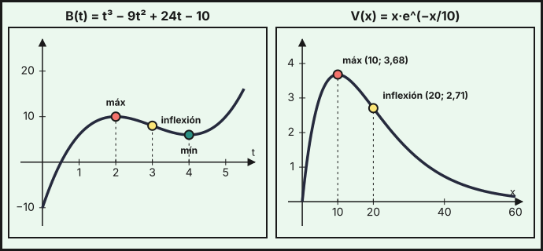
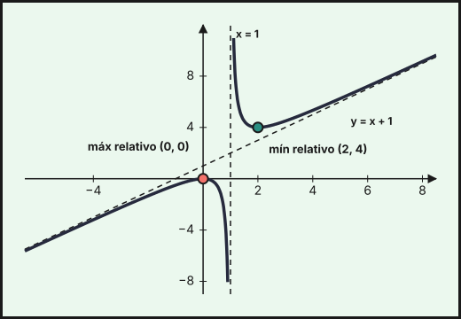
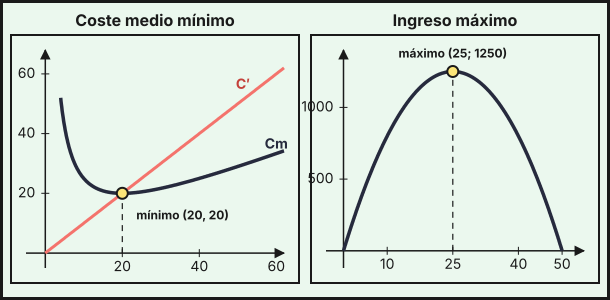

## 1. Crecimiento y decrecimiento

El signo de la derivada indica cómo se comporta la función:

- Si $f'(x)>0$ en un intervalo, $f$ es **creciente** en él.
- Si $f'(x)<0$ en un intervalo, $f$ es **decreciente** en él.

Para estudiarlo: (1) se halla el dominio; (2) se calcula $f'$; (3) se buscan los puntos donde $f'(x)=0$ o donde $f$ o $f'$ no existen; (4) esos puntos dividen el dominio en intervalos, y se mira el signo de $f'$ en cada uno.

*Ejemplo.* El beneficio, en miles de euros, de una empresa de reparto $t$ años después de abrir es $B(t)=t^3-9t^2+24t-10$. Su derivada es $B'(t)=3t^2-18t+24=3(t-2)(t-4)$, que se anula en $t=2$ y $t=4$:

| Intervalo | $(0,\,2)$ | $(2,\,4)$ | $(4,\,+\infty)$ |
|---|---|---|---|
| Signo de $B'$ | $+$ | $-$ | $+$ |
| $B$ | crece | decrece | crece |

El beneficio crece los dos primeros años, baja entre los años 2 y 4 (por ejemplo, por la competencia) y luego se recupera.

## 2. Extremos relativos

Un **máximo relativo** es un punto donde $f$ pasa de crecer a decrecer, y un **mínimo relativo**, de decrecer a crecer. Si $f$ es derivable, en ellos $f'(a)=0$ (la tangente es horizontal). Para clasificar un punto con $f'(a)=0$:

| Criterio | Máximo en $a$ | Mínimo en $a$ |
|---|---|---|
| **Signo de $f'$** (primera derivada) | $f'$ pasa de $+$ a $-$ | $f'$ pasa de $-$ a $+$ |
| **Segunda derivada** | $f''(a)<0$ | $f''(a)>0$ |

*Ejemplo.* Con $B''(t)=6t-18$: $B''(2)=-6<0$, luego hay un **máximo relativo** en $(2,\,10)$; y $B''(4)=6>0$, luego un **mínimo relativo** en $(4,\,6)$.

**Extremos absolutos en un intervalo cerrado $[a,\,b]$**: el mayor y el menor valor de $f$ en el intervalo se alcanzan en un extremo relativo o en un extremo del intervalo, así que se comparan los valores en todos ellos. Si el período estudiado es $t\in[0,\,8]$:

| $t$ | $0$ | $2$ | $4$ | $8$ |
|---|---|---|---|---|
| $B(t)$ | $-10$ | $10$ | $6$ | $118$ |

El máximo absoluto es $118$ (miles de euros) en $t=8$ y el mínimo absoluto, $-10$, en $t=0$ (el año de apertura).

::: {.callout-important}
## Ampliación (fuera del currículo de la PAU)
Si $f'(a)=0$ y también $f''(a)=0$, el criterio de la segunda derivada no decide. Se sigue derivando hasta la primera derivada de orden $k$ que no se anula en $a$: si $k$ es **par**, hay un extremo (mínimo si $f^{(k)}(a)>0$, máximo si $<0$); si $k$ es **impar**, no hay extremo sino un punto de inflexión. Por ejemplo, $x^4$ tiene un mínimo en $0$ ($k=4$) y $x^3$ una inflexión en $0$ ($k=3$).
:::

## 3. Concavidad, convexidad y puntos de inflexión

La segunda derivada indica la **curvatura** de la gráfica. Siguiendo la notación de la Junta de Andalucía:

- Si $f''(x)>0$ en un intervalo, $f$ es **convexa** (la gráfica tiene forma de $\cup$: la pendiente aumenta).
- Si $f''(x)<0$ en un intervalo, $f$ es **cóncava** (forma de $\cap$: la pendiente disminuye).

Un **punto de inflexión** es un punto donde la función cambia de cóncava a convexa o al revés; en él, $f''(a)=0$ (cuando $f''$ existe). Para hallarlos se resuelve $f''(x)=0$ y se comprueba que $f''$ cambia de signo.

*Ejemplo.* $B''(t)=6(t-3)$ cambia de signo en $t=3$: $B$ es cóncava en $(0,\,3)$, convexa en $(3,\,+\infty)$ y tiene un **punto de inflexión** en $(3,\,8)$. Económicamente, entre los años 2 y 3 el beneficio baja cada vez más deprisa; desde el año 3 la bajada se frena y, tras el mínimo del año 4, el beneficio vuelve a crecer cada vez más deprisa.

*Ejemplo (publicidad).* Las ventas, en miles de euros, al invertir $x$ miles en publicidad son $V(x)=x\,e^{-x/10}$ para $x\ge0$. Por el [tema 6](../06-derivadas/index.qmd), $V'(x)=\left(1-\dfrac{x}{10}\right)e^{-x/10}$, que se anula en $x=10$ y es positiva antes y negativa después. La segunda derivada es $V''(x)=\dfrac{x-20}{100}\,e^{-x/10}$.

- $V$ **crece** en $(0,\,10)$ y **decrece** en $(10,\,+\infty)$: máximo en $\left(10,\ \tfrac{10}{e}\right)\approx(10;\ 3{,}68)$.
- $V''<0$ en $(0,\,20)$ (cóncava) y $V''>0$ en $(20,\,+\infty)$ (convexa): inflexión en $\left(20,\ \tfrac{20}{e^2}\right)\approx(20;\ 2{,}71)$.
- Como $\lim_{x\to\infty}V(x)=0$ (tema 5), la recta $y=0$ es asíntota horizontal.

Con este modelo, invertir más de 10 000 € en publicidad reduce las ventas.

{fig-alt="A la izquierda una curva cúbica con un máximo relativo, un punto de inflexión y un mínimo relativo marcados; a la derecha una curva que sube hasta un máximo y baja acercándose al eje horizontal, con un punto de inflexión marcado" width="95%" fig-align="center"}

## 4. Representación gráfica completa de una función

Para representar $y=f(x)$ se reúne, en este orden, toda la información:

1. **Dominio** y, si procede, simetrías.
2. **Cortes** con los ejes: $f(0)$ y las soluciones de $f(x)=0$.
3. **Asíntotas**: verticales, horizontales y oblicuas ([tema 5](../05-limites-continuidad/index.qmd)).
4. **Monotonía y extremos relativos**: signo de $f'$.
5. **Curvatura e inflexiones**: signo de $f''$.
6. Una tabla con algunos puntos y se dibuja la curva respetando todo lo anterior.

*Ejemplo.* Representa $f(x)=\dfrac{x^2}{x-1}$.

- **Dominio**: $\mathbb{R}\setminus\{1\}$. **Cortes**: $f(0)=0$ y $f(x)=0\Leftrightarrow x=0$, solo el origen.
- **Asíntotas**: vertical $x=1$ (con $f\to+\infty$ por la derecha y $-\infty$ por la izquierda). Como $f(x)=x+1+\dfrac{1}{x-1}$, la recta $y=x+1$ es asíntota **oblicua** en $\pm\infty$.
- **Derivada**: $f'(x)=\dfrac{2x(x-1)-x^2}{(x-1)^2}=\dfrac{x(x-2)}{(x-1)^2}$, que se anula en $x=0$ y $x=2$.

| Intervalo | $(-\infty,\,0)$ | $(0,\,1)$ | $(1,\,2)$ | $(2,\,+\infty)$ |
|---|---|---|---|---|
| Signo de $f'$ | $+$ | $-$ | $-$ | $+$ |
| $f$ | crece | decrece | decrece | crece |

Hay un **máximo relativo** en $(0,\,0)$ y un **mínimo relativo** en $(2,\,4)$.

- **Segunda derivada**: $f''(x)=\dfrac{2}{(x-1)^3}$. No se anula nunca, así que no hay inflexiones: $f$ es **cóncava** en $(-\infty,\,1)$ y **convexa** en $(1,\,+\infty)$.

{fig-alt="Función racional con dos ramas separadas por la asíntota vertical x igual a 1, con la asíntota oblicua y igual a x más 1 y los extremos relativos marcados" width="85%" fig-align="center"}

## 5. Optimización

Un problema de **optimización** pide el valor de una variable que hace máxima o mínima una magnitud (beneficio, ingreso, coste, área). Pasos:

1. Se define la variable $x$ y se escribe la **función a optimizar** $f(x)$ (si aparecen dos variables, se elimina una con la condición del enunciado).
2. Se determina el **dominio** que tiene sentido en el problema.
3. Se resuelve $f'(x)=0$.
4. Se comprueba si es máximo o mínimo (con $f''$ o con el signo de $f'$) y, si el dominio es un intervalo cerrado, se comparan también los extremos.
5. Se **responde** al enunciado, con el valor óptimo y sus unidades.

**Ejemplo 1 (beneficio máximo).** Con un precio de $p$ euros, el beneficio de un producto es $B(p)=-4p^2+140p-600$ (miles de euros), como en el [tema 4](../04-funciones/index.qmd). $B'(p)=-8p+140=0\Rightarrow p=17{,}5$. Como $B''(p)=-8<0$ es un máximo, y $B(17{,}5)=625$: el precio óptimo es **17,50 €**, con un beneficio de 625 000 €.

**Ejemplo 2 (ingreso máximo).** Una compañía de autobuses vende todos los billetes (60 plazas) a 20 € y, por cada euro que sube el precio, pierde 2 viajeros. Con el billete a $p$ euros viajan $60-2(p-20)=100-2p$ personas y el ingreso es $I(p)=p\,(100-2p)=100p-2p^2$. Entonces $I'(p)=100-4p=0\Rightarrow p=25$, con $I''=-4<0$ (máximo). A 25 € viajan $50$ personas y el ingreso es $I(25)=1250$ €, frente a los $1200$ € de los 20 €.

**Ejemplo 3 (coste medio mínimo).** El coste total de producir $x$ unidades es $C(x)=0{,}5x^2+200$, así que el coste medio es $C_m(x)=\dfrac{C(x)}{x}=0{,}5x+\dfrac{200}{x}$ con $x>0$. $C_m'(x)=0{,}5-\dfrac{200}{x^2}=0\Rightarrow x^2=400\Rightarrow x=20$. Como $C_m''(x)=\dfrac{400}{x^3}>0$, es un mínimo, y $C_m(20)=10+10=20$ €/unidad. Observa que el coste marginal es $C'(20)=20$: **en el mínimo del coste medio coinciden el coste medio y el marginal**.

{fig-alt="A la izquierda la curva del coste medio con su mínimo en el punto donde corta a una recta creciente, el coste marginal; a la derecha una parábola de ingresos con el vértice marcado" width="95%" fig-align="center"}

**Ejemplo 4 (área máxima).** Un huerto comunitario rectangular se cierra con 80 m de valla por tres lados, pues el cuarto es un muro. Si los lados perpendiculares al muro miden $x$, el lado paralelo mide $80-2x$ y el área es $A(x)=x\,(80-2x)=80x-2x^2$ con $0<x<40$. $A'(x)=80-4x=0\Rightarrow x=20$, con $A''=-4<0$ (máximo). Las dimensiones son $20\times40$ m y el área, **800 m²**.

::: {.callout-tip}
## Resumen rápido
- $f'>0$: creciente; $f'<0$: decreciente. Extremo relativo: $f'(a)=0$ con $f'$ cambiando de signo, o $f''(a)<0$ (máximo) / $f''(a)>0$ (mínimo).
- $f''>0$: **convexa**; $f''<0$: **cóncava**; inflexión: $f''$ cambia de signo.
- En $[a,\,b]$, los extremos absolutos están entre los extremos relativos y los extremos del intervalo.
- Representación: dominio, cortes, asíntotas, $f'$, $f''$, tabla de puntos.
- Optimización: función de una variable, dominio, $f'=0$, comprobar máximo o mínimo, responder con unidades.
:::
