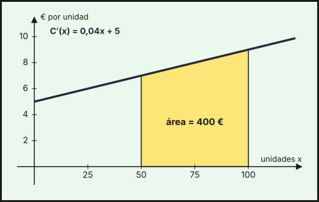
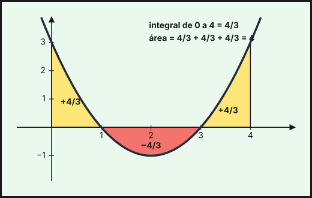
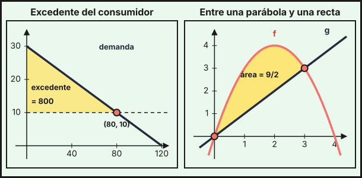

## 1. Primitiva e integral indefinida

Una **primitiva** de $f$ es una función $F$ cuya derivada es $f$: $F'(x)=f(x)$. Si $F$ es una primitiva, también lo es $F+C$ para cualquier constante $C$, así que el conjunto de todas ellas, la **integral indefinida**, se escribe

$$\int f(x)\,dx=F(x)+C$$

Integrar es el proceso inverso de derivar. Es **lineal**: $\int\bigl(a\,f(x)+b\,g(x)\bigr)dx=a\int f\,dx+b\int g\,dx$.

*Ejemplo (del coste marginal al coste).* Si el coste marginal es $C'(x)=0{,}04x+5$ (como en el [tema 6](../06-derivadas/index.qmd)), el coste es una primitiva:
$$C(x)=\int(0{,}04x+5)\,dx=0{,}02x^2+5x+K$$
La constante $K$ se fija con un dato: si el coste fijo es 300 €, $C(0)=300\Rightarrow K=300$, y $C(x)=0{,}02x^2+5x+300$. Del mismo modo, si el ingreso marginal es $I'(x)=100-4x$ y sin ventas no hay ingreso, $I(x)=100x-2x^2$ (con $I(0)=0$).

## 2. Primitivas inmediatas

| $f(x)$ | $\displaystyle\int f(x)\,dx$ |
|---|---|
| $k$ | $kx+C$ |
| $x^n$ ($n\neq-1$) | $\dfrac{x^{n+1}}{n+1}+C$ |
| $\dfrac1x$ | $\ln\lvert x\rvert+C$ |
| $e^x$ | $e^x+C$ |
| $a^x$ | $\dfrac{a^x}{\ln a}+C$ |

Las raíces se escriben como potencias: $\sqrt x=x^{1/2}$ y $\dfrac1{x^2}=x^{-2}$. Con $u$ una función de $x$ y $u'$ su derivada, las **primitivas compuestas** (la regla de la cadena al revés) son:

| $f(x)$ | $\displaystyle\int f(x)\,dx$ |
|---|---|
| $u'\cdot u^n$ ($n\neq-1$) | $\dfrac{u^{n+1}}{n+1}+C$ |
| $\dfrac{u'}{u}$ | $\ln\lvert u\rvert+C$ |
| $u'\cdot e^{u}$ | $e^{u}+C$ |
| $u'\cdot a^{u}$ | $\dfrac{a^{u}}{\ln a}+C$ |
| $\dfrac{u'}{\sqrt u}$ | $2\sqrt u+C$ |

Para aplicarlas, hay que tener **exactamente** $u'$ delante; si falta una constante, se multiplica y divide por ella.

**Ejemplos.**

| Integral | Resultado |
|---|---|
| $\displaystyle\int(3x^2-4x+5)\,dx$ | $x^3-2x^2+5x+C$ |
| $\displaystyle\int\left(\tfrac1x+e^x\right)dx$ | $\ln\lvert x\rvert+e^x+C$ |
| $\displaystyle\int\sqrt x\,dx$ | $\tfrac23x^{3/2}+C$ |
| $\displaystyle\int(2x+1)^4\,dx$ (con $u=2x+1$, $u'=2$) | $\tfrac12\cdot\dfrac{(2x+1)^5}{5}+C=\dfrac{(2x+1)^5}{10}+C$ |
| $\displaystyle\int e^{3x}\,dx$ | $\dfrac{e^{3x}}{3}+C$ |
| $\displaystyle\int\dfrac{1}{3x+2}\,dx$ | $\dfrac13\ln\lvert3x+2\rvert+C$ |
| $\displaystyle\int\dfrac{2x}{x^2+1}\,dx$ (aquí $u=x^2+1$) | $\ln(x^2+1)+C$ |
| $\displaystyle\int x\,e^{x^2}\,dx$ (con $u=x^2$, falta el factor 2) | $\tfrac12e^{x^2}+C$ |
| $\displaystyle\int\dfrac{x}{\sqrt{x^2+1}}\,dx$ (con $u=x^2+1$) | $\sqrt{x^2+1}+C$ |

::: {.callout-note}
Siempre se puede **comprobar** el resultado derivándolo: debe salir la función original.
:::

## 3. Integral definida y regla de Barrow

La **integral definida** $\displaystyle\int_a^b f(x)\,dx$ mide el área con signo entre la gráfica de $f$ y el eje $X$ en $[a,\,b]$ (positiva si $f\ge0$). La **regla de Barrow** la calcula con una primitiva $F$ cualquiera de $f$:

$$\int_a^b f(x)\,dx=F(b)-F(a)=\Bigl[F(x)\Bigr]_a^b$$

**Propiedades**: $\int_a^a f=0$; $\int_a^b f=-\int_b^a f$; $\int_a^b f=\int_a^c f+\int_c^b f$; y es lineal.

*Ejemplo.* $\displaystyle\int_0^2(3x^2+1)\,dx=\bigl[x^3+x\bigr]_0^2=(8+2)-0=10$.

*Ejemplo (coste de aumentar la producción).* El coste de pasar de 50 a 100 unidades es la integral del coste marginal:

$$\int_{50}^{100}(0{,}04x+5)\,dx=\bigl[0{,}02x^2+5x\bigr]_{50}^{100}=(200+500)-(50+250)=400\text{ €}$$

que coincide con $C(100)-C(50)=1000-600$. Es el área bajo la gráfica del coste marginal entre 50 y 100.

{fig-alt="Recta creciente del coste marginal con la región entre las abscisas 50 y 100 sombreada bajo ella, de área 400 euros" width="85%" fig-align="center"}

*Ejemplo (exponencial).* Una asociación gana nuevos socios a un ritmo de $s(t)=120\,e^{-0{,}1t}$ socios por mes, $t$ en meses desde su lanzamiento. En los primeros 10 meses ingresan

$$\int_0^{10}120\,e^{-0{,}1t}\,dt=\Bigl[-1200\,e^{-0{,}1t}\Bigr]_0^{10}=1200\,(1-e^{-1})\approx758{,}5$$

es decir, unos **758 socios** (la primitiva de $e^{-0{,}1t}$ es $\frac{e^{-0{,}1t}}{-0{,}1}$).

## 4. Cálculo de áreas

**Área bajo una curva.** Si $f\ge0$ en $[a,b]$, el área es $\int_a^bf$; si $f\le0$, es $-\int_a^bf$. Si $f$ **cambia de signo**, hay que hallar los puntos de corte con el eje $X$ y calcular **por separado** cada tramo, tomando valores absolutos.

*Ejemplo.* Para $f(x)=x^2-4x+3=(x-1)(x-3)$ en $[0,\,4]$, con $F(x)=\frac{x^3}{3}-2x^2+3x$:

| Tramo | $\displaystyle\int f\,dx=F(b)-F(a)$ | Signo | Área |
|---|---|---|---|
| $[0,\,1]$ | $\frac43-0=\frac43$ | $+$ | $\frac43$ |
| $[1,\,3]$ | $0-\frac43=-\frac43$ | $-$ | $\frac43$ |
| $[3,\,4]$ | $\frac43-0=\frac43$ | $+$ | $\frac43$ |

La integral $\int_0^4f=\frac43$ (las partes se compensan), pero el **área** es $\frac43+\frac43+\frac43=4$.

{fig-alt="Parábola con dos regiones amarillas sobre el eje horizontal a los lados y una región roja central bajo el eje, cada una de área 4/3" width="85%" fig-align="center"}

**Área entre dos curvas.** Si $f(x)\ge g(x)$ en $[a,\,b]$, el área entre ambas es

$$\text{Área}=\int_a^b\bigl(f(x)-g(x)\bigr)\,dx$$

Pasos: (1) se hallan los **puntos de corte** igualando $f(x)=g(x)$; (2) se ve cuál función está por encima en cada tramo; (3) se integra la diferencia (la de arriba menos la de abajo).

*Ejemplo.* El área entre $f(x)=-x^2+4x$ y $g(x)=x$: $-x^2+4x=x\Rightarrow x(3-x)=0\Rightarrow x=0,\ x=3$; en $(0,3)$, $f>g$ (por ejemplo, en $x=1$: $3>1$). Entonces

$$\text{Área}=\int_0^3(-x^2+3x)\,dx=\Bigl[-\tfrac{x^3}{3}+\tfrac{3x^2}{2}\Bigr]_0^3=-9+\tfrac{27}{2}=\tfrac92=4{,}5$$

*Ejemplo (curvas que se cruzan).* Entre $y=x$ e $y=x^3$ en $[-1,\,1]$ se cortan en $x=-1,\,0,\,1$, y cambia cuál está arriba: en $[-1,0]$ es $x^3$ y en $[0,1]$ es $x$. Por simetría el área es $2\int_0^1(x-x^3)\,dx=2\left(\tfrac12-\tfrac14\right)=\tfrac12$.

*Ejemplo (exponencial).* Entre $y=e^x$ e $y=x+1$ en $[0,\,1]$ (donde $e^x\ge x+1$): $\int_0^1(e^x-x-1)\,dx=\Bigl[e^x-\tfrac{x^2}{2}-x\Bigr]_0^1=e-\tfrac52\approx0{,}218$.

### Aplicación: excedente del consumidor

Con la demanda $q=120-4p$ del [tema 2](../02-sistemas-ecuaciones-lineales/index.qmd), el precio máximo que está dispuesto a pagar el comprador de la unidad $q$ es $p=30-\frac q4$. En el equilibrio se venden $q=80$ unidades a $10$ €. Los compradores que hubieran pagado más ahorran dinero: el **excedente del consumidor** es el área entre la curva de demanda y el precio de equilibrio:

$$\int_0^{80}\left(30-\frac q4-10\right)dq=\Bigl[20q-\frac{q^2}{8}\Bigr]_0^{80}=1600-800=800$$

Es el área de un triángulo de base 80 y altura 20, $\frac12\cdot80\cdot20=800$, y equivale a 800 (miles de euros).

{fig-alt="A la izquierda un triángulo amarillo entre la recta de demanda y la horizontal de precio 10; a la derecha la región entre una parábola y una recta entre sus dos puntos de corte" width="95%" fig-align="center"}

::: {.callout-tip}
## Resumen rápido
- $F'=f\Rightarrow\int f\,dx=F+C$. Comprueba derivando.
- Inmediatas: $\int x^n=\frac{x^{n+1}}{n+1}$ ($n\neq-1$), $\int\frac1x=\ln|x|$, $\int e^x=e^x$, $\int a^x=\frac{a^x}{\ln a}$. Compuestas con $u'$: $\int u'u^n$, $\int\frac{u'}{u}=\ln|u|$, $\int u'e^u=e^u$.
- Barrow: $\int_a^bf=F(b)-F(a)$. Del coste marginal al coste: $C(b)-C(a)=\int_a^bC'(x)\,dx$.
- Área con $f$ que cambia de signo: separar en los puntos de corte con el eje.
- Área entre curvas: $\int_a^b(\text{arriba}-\text{abajo})\,dx$, con los límites en los puntos de corte.
:::
