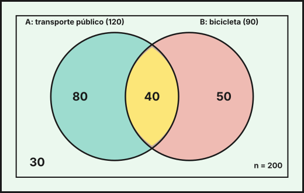
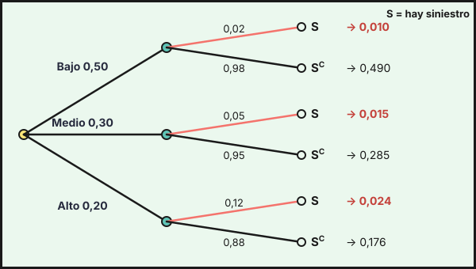

## 1. Sucesos y operaciones

Un **experimento aleatorio** es aquel cuyo resultado no se puede predecir con certeza aunque se repita en las mismas condiciones (elegir a una persona al azar, lanzar una moneda). El conjunto de todos los resultados posibles es el **espacio muestral** $E$, y un **suceso** es un subconjunto de $E$. El suceso $E$ es el **suceso seguro** y $\emptyset$ el **suceso imposible**.

Notación y operaciones entre sucesos $A$ y $B$:

| Operación | Notación | Se verifica cuando… |
|---|---|---|
| Unión | $A\cup B$ | ocurre $A$ o $B$ (o ambos) |
| Intersección | $A\cap B$ | ocurren $A$ y $B$ a la vez |
| Complementario | $A^C$ | no ocurre $A$ |
| Diferencia | $A-B=A\cap B^C$ | ocurre $A$ y no ocurre $B$ |
| Incompatibles | $A\cap B=\emptyset$ | no pueden ocurrir a la vez |

Se cumplen las **leyes de De Morgan**: $(A\cup B)^C=A^C\cap B^C$ y $(A\cap B)^C=A^C\cup B^C$.

## 2. Axiomas de Kolmogorov y propiedades

La **probabilidad** $P$ asigna a cada suceso un número cumpliendo los **axiomas de Kolmogorov**:

1. $P(A)\ge0$ para todo suceso $A$.
2. $P(E)=1$.
3. Si $A$ y $B$ son incompatibles ($A\cap B=\emptyset$), entonces $P(A\cup B)=P(A)+P(B)$.

De ellos se deducen las propiedades:

- $P(\emptyset)=0$ y $0\le P(A)\le1$.
- $P(A^C)=1-P(A)$.
- $P(A\cup B)=P(A)+P(B)-P(A\cap B)$.
- $P(A-B)=P(A)-P(A\cap B)$.
- Si $A\subset B$, entonces $P(A)\le P(B)$.

**Regla de Laplace**: si los $N$ resultados son equiprobables, $P(A)=\dfrac{\text{casos favorables}}{\text{casos posibles}}$.

*Ejemplo.* En una encuesta a $n=200$ personas, 120 usan el transporte público ($A$), 90 la bicicleta ($B$) y 40 usan ambos. Se elige una persona al azar:

- $P(A)=\frac{120}{200}=0{,}6$, $P(B)=0{,}45$ y $P(A\cap B)=\frac{40}{200}=0{,}2$.
- $P(A\cup B)=0{,}6+0{,}45-0{,}2=0{,}85$.
- Ninguno de los dos medios: $P(A^C\cap B^C)=P\bigl((A\cup B)^C\bigr)=1-0{,}85=0{,}15$ (son 30 personas).
- Solo transporte público: $P(A-B)=0{,}6-0{,}2=0{,}4$; solo bicicleta: $P(B-A)=0{,}45-0{,}2=0{,}25$.

{fig-alt="Dos círculos que se cortan dentro de un rectángulo con los números 80 en A solo, 40 en la intersección, 50 en B solo y 30 fuera de ambos" width="85%" fig-align="center"}

## 3. Experimentos compuestos y diagramas de árbol

Un **experimento compuesto** consta de varios experimentos simples sucesivos. Se representa con un **diagrama de árbol**: cada rama lleva su probabilidad y la probabilidad de un camino completo es el **producto** de las probabilidades de sus ramas. Las probabilidades de las ramas que salen de un mismo nodo suman 1.

Si las pruebas son **independientes** (por ejemplo, extracciones **con reemplazamiento**), las probabilidades de las ramas no cambian de una etapa a otra. Si **no** hay reemplazamiento, las probabilidades de la segunda etapa dependen de la primera.

*Ejemplo.* Un centro tiene 12 docentes, 7 mujeres y 5 hombres, y se eligen al azar dos para una comisión.

- **Sin reemplazamiento** (no se puede elegir dos veces a la misma persona): $P(\text{dos mujeres})=\dfrac{7}{12}\cdot\dfrac{6}{11}=\dfrac{7}{22}\approx0{,}318$ y $P(\text{una de cada})=\dfrac{7}{12}\cdot\dfrac{5}{11}+\dfrac{5}{12}\cdot\dfrac{7}{11}=\dfrac{35}{66}\approx0{,}530$.
- **Con reemplazamiento** (las extracciones son independientes): $P(\text{dos mujeres})=\left(\dfrac{7}{12}\right)^2=\dfrac{49}{144}\approx0{,}340$.

::: {.callout-note}
En poblaciones finitas, se entiende que las muestras se toman **con reemplazamiento** salvo que el enunciado diga lo contrario.
:::

## 4. Probabilidad condicionada e independencia

La **probabilidad de $A$ condicionada a $B$** es la probabilidad de que ocurra $A$ sabiendo que ha ocurrido $B$ (con $P(B)>0$):

$$P(A\mid B)=\frac{P(A\cap B)}{P(B)}\qquad\Longrightarrow\qquad P(A\cap B)=P(B)\cdot P(A\mid B)$$

Dos sucesos son **independientes** si saber que ocurre uno no cambia la probabilidad del otro:

$$A\text{ y }B\text{ independientes}\iff P(A\cap B)=P(A)\cdot P(B)\iff P(A\mid B)=P(A)$$

(Si $A$ y $B$ son independientes, también lo son $A$ y $B^C$, $A^C$ y $B$, y $A^C$ y $B^C$.)

En la encuesta del apartado 2, $P(A\mid B)=\frac{40}{90}=\frac49\approx0{,}444\neq P(A)=0{,}6$ y $P(A\cap B)=0{,}2\neq P(A)P(B)=0{,}27$: usar la bicicleta y el transporte público **no son independientes** (quien usa la bici usa menos el transporte público).

**Tablas de contingencia.** Recogen frecuencias de dos características a la vez; las probabilidades se obtienen dividiendo entre el total. *Ejemplo:* contratos de las 200 personas de una empresa.

| | Indefinido ($I$) | Temporal ($T$) | Total |
|---|---|---|---|
| Hombre ($H$) | 70 | 40 | 110 |
| Mujer ($M$) | 45 | 45 | 90 |
| **Total** | 115 | 85 | 200 |

- $P(I)=\frac{115}{200}=0{,}575$, $P(M)=0{,}45$ y $P(I\cap M)=\frac{45}{200}=0{,}225$.
- $P(I\mid M)=\frac{45}{90}=0{,}5$ y $P(I\mid H)=\frac{70}{110}\approx0{,}636$: las mujeres tienen con menos frecuencia contrato indefinido.
- $P(M\mid T)=\frac{45}{85}=\frac{9}{17}\approx0{,}529$: entre las personas con contrato temporal, algo más de la mitad son mujeres.
- No son independientes: $P(I\mid M)=0{,}5\neq P(I)=0{,}575$ (o también $P(I\cap M)=0{,}225\neq P(I)P(M)=0{,}25875$).

*Ejemplo (independencia).* Un edificio tiene dos sistemas de alarma independientes que funcionan con probabilidad $0{,}9$ y $0{,}8$. Entonces $P(\text{ambos})=0{,}9\cdot0{,}8=0{,}72$; $P(\text{al menos uno})=1-P(\text{ninguno})=1-0{,}1\cdot0{,}2=0{,}98$; y $P(\text{exactamente uno})=0{,}9\cdot0{,}2+0{,}1\cdot0{,}8=0{,}26$.

## 5. Teoremas de la probabilidad total y de Bayes

Sea $A_1,A_2,\dots,A_n$ un **sistema completo de sucesos**: incompatibles dos a dos y con $A_1\cup\dots\cup A_n=E$. Para cualquier suceso $B$:

$$\textbf{Probabilidad total:}\quad P(B)=\sum_{i=1}^{n}P(A_i)\cdot P(B\mid A_i)$$

$$\textbf{Teorema de Bayes:}\quad P(A_j\mid B)=\frac{P(A_j)\cdot P(B\mid A_j)}{P(B)}=\frac{P(A_j)\cdot P(B\mid A_j)}{\sum_i P(A_i)\cdot P(B\mid A_i)}$$

**Interpretación.** Las $P(A_i)$ son las probabilidades **a priori** (antes de observar nada). Al observar que ha ocurrido $B$, Bayes las **actualiza** a las probabilidades **a posteriori** $P(A_i\mid B)$. Es la herramienta para **decidir en condiciones de incertidumbre**: dado lo que se ha observado, ¿qué causa es la más probable?

*Ejemplo (aseguradora).* Una aseguradora clasifica a sus clientes en riesgo bajo ($50\,\%$), medio ($30\,\%$) y alto ($20\,\%$). La probabilidad de tener un siniestro en el año es $0{,}02$, $0{,}05$ y $0{,}12$, respectivamente. Sea $S$ «el cliente tiene un siniestro».

{fig-alt="Árbol con tres ramas, riesgo bajo, medio y alto, y de cada una dos ramas, siniestro y no siniestro, con sus probabilidades y las probabilidades conjuntas al final" width="95%" fig-align="center"}

*Probabilidad total.* $P(S)=0{,}5\cdot0{,}02+0{,}3\cdot0{,}05+0{,}2\cdot0{,}12=0{,}010+0{,}015+0{,}024=0{,}049$: el $4{,}9\,\%$ de los clientes tiene un siniestro.

*Bayes.* Si sabemos que un cliente ha tenido un siniestro, ¿de qué tipo es?

$$P(\text{alto}\mid S)=\frac{0{,}2\cdot0{,}12}{0{,}049}=\frac{0{,}024}{0{,}049}=\frac{24}{49}\approx0{,}490,\quad P(\text{medio}\mid S)=\frac{15}{49}\approx0{,}306,\quad P(\text{bajo}\mid S)=\frac{10}{49}\approx0{,}204$$

Los clientes de riesgo alto eran el $20\,\%$ de la cartera, pero entre quienes tienen un siniestro suben al $49\,\%$. Con esta información la aseguradora actualiza su valoración del riesgo.

*Ejemplo (detector de fraude).* El $2\,\%$ de las operaciones de un banco son fraudulentas. Un detector da alerta en el $95\,\%$ de las fraudulentas y, por error, en el $4\,\%$ de las legítimas. Sea $F$ «fraude» y $L$ «alerta».

$$P(L)=0{,}02\cdot0{,}95+0{,}98\cdot0{,}04=0{,}019+0{,}0392=0{,}0582,\qquad P(F\mid L)=\frac{0{,}019}{0{,}0582}=\frac{95}{291}\approx0{,}326$$

Aunque el detector acierta el $95\,\%$ de las veces con fraudes, **solo una de cada tres alertas es un fraude real**, porque los fraudes son raros. Decisión: lo razonable es revisar manualmente las alertas, no bloquear automáticamente. En cambio, si no hay alerta, $P(F\mid L^C)=\frac{0{,}02\cdot0{,}05}{1-0{,}0582}\approx0{,}001$: es muy improbable que haya fraude.

::: {.callout-tip}
## Resumen rápido
- $A^C$ complementario; $A-B=A\cap B^C$; De Morgan: $(A\cup B)^C=A^C\cap B^C$.
- Kolmogorov: $P\ge0$, $P(E)=1$, aditividad para incompatibles. $P(A\cup B)=P(A)+P(B)-P(A\cap B)$; $P(A^C)=1-P(A)$.
- Árbol: se multiplica por las ramas del camino y se suman los caminos favorables.
- $P(A\mid B)=P(A\cap B)/P(B)$; independientes $\iff P(A\cap B)=P(A)P(B)$.
- Total: $P(B)=\sum P(A_i)P(B\mid A_i)$. Bayes: $P(A_j\mid B)=P(A_j)P(B\mid A_j)/P(B)$ (de a priori a a posteriori).
:::
