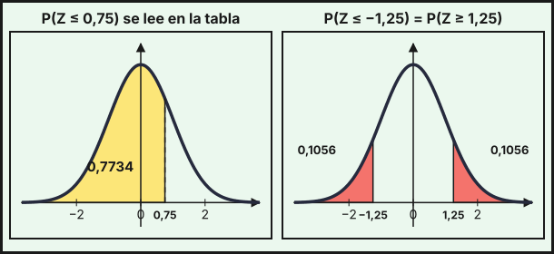
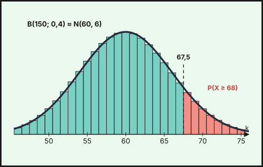

## 1. Variables aleatorias discretas y continuas

Una **variable aleatoria** $X$ asigna un número a cada resultado de un experimento aleatorio. Es **discreta** si toma un número finito (o numerable) de valores, y **continua** si puede tomar cualquier valor de un intervalo.

**Variable discreta.** Se describe con su **función de probabilidad**: la tabla de los valores $x_i$ y sus probabilidades $p_i=P(X=x_i)$, con $p_i\ge0$ y $\sum p_i=1$. Sus parámetros son:

$$\mu=E[X]=\sum x_i\,p_i\qquad\sigma^2=\sum x_i^2\,p_i-\mu^2\qquad\sigma=\sqrt{\sigma^2}$$

*Ejemplo.* Los ingresos diarios $X$ (en euros) de un puesto de mercado tienen esta distribución:

| $x_i$ | $0$ | $100$ | $200$ | $300$ |
|---|---|---|---|---|
| $p_i$ | $0{,}1$ | $0{,}3$ | $0{,}4$ | $0{,}2$ |

La suma de probabilidades es $1$. La media es $\mu=0\cdot0{,}1+100\cdot0{,}3+200\cdot0{,}4+300\cdot0{,}2=170$ €. Como $\sum x_i^2p_i=10000\cdot0{,}3+40000\cdot0{,}4+90000\cdot0{,}2=37000$, la varianza es $\sigma^2=37000-170^2=8100$ y la desviación típica $\sigma=90$ €.

**Variable continua.** Se describe con una **función de densidad** $f(x)\ge0$ cuya área total vale $1$. La probabilidad de un intervalo es el **área** bajo $f$ (integral, [tema 8](../08-integrales/index.qmd)):

$$P(a\le X\le b)=\int_a^bf(x)\,dx\qquad P(X=a)=0\qquad\mu=\int x\,f(x)\,dx\qquad\sigma^2=\int x^2f(x)\,dx-\mu^2$$

*Ejemplo.* El tiempo de espera $X$ (en minutos) en una oficina tiene densidad $f(x)=\dfrac{10-x}{50}$ para $0\le x\le10$ (es un triángulo de base 10 y altura $0{,}2$, de área $1$). Entonces

$$P(X\le2)=\int_0^2\frac{10-x}{50}\,dx=\frac{1}{50}\Bigl[10x-\tfrac{x^2}{2}\Bigr]_0^2=0{,}36,\qquad P(X>5)=\int_5^{10}\frac{10-x}{50}\,dx=0{,}25$$

La media es $\mu=\int_0^{10}\frac{x(10-x)}{50}dx=\frac{10}{3}\approx3{,}33$ min, y como $\int_0^{10}\frac{x^2(10-x)}{50}dx=\frac{50}{3}$, la varianza es $\sigma^2=\frac{50}{3}-\frac{100}{9}=\frac{50}{9}$ y $\sigma\approx2{,}36$ min.

## 2. Distribución binomial

Un experimento sigue una **distribución binomial** $B(n,\,p)$ si consiste en $n$ pruebas **independientes** con solo dos resultados (éxito, con probabilidad $p$, y fracaso, con $q=1-p$) y la misma probabilidad en todas. La variable $X$ = «número de éxitos» toma los valores $0,1,\dots,n$:

$$P(X=k)=\binom nk\,p^k\,q^{\,n-k},\qquad\mu=n\,p,\qquad\sigma=\sqrt{n\,p\,q}$$

*Ejemplo.* El $30\,\%$ de los hogares de un barrio tiene fibra óptica. Se visitan 8 hogares al azar (con reemplazamiento, es decir, con independencia), y $X$ = «hogares con fibra» sigue $B(8;\,0{,}3)$:

- $P(X=3)=\binom83\cdot0{,}3^3\cdot0{,}7^5=56\cdot0{,}027\cdot0{,}16807\approx0{,}2541$.
- $P(X\ge2)=1-P(X=0)-P(X=1)=1-0{,}7^8-8\cdot0{,}3\cdot0{,}7^7\approx1-0{,}0576-0{,}1977=0{,}7447$.
- $\mu=8\cdot0{,}3=2{,}4$ hogares y $\sigma=\sqrt{8\cdot0{,}3\cdot0{,}7}=\sqrt{1{,}68}\approx1{,}296$.

## 3. Distribución normal

La **distribución normal** $N(\mu,\,\sigma)$ tiene una densidad en forma de campana, **simétrica** respecto de $x=\mu$: la media $\mu$ marca el centro y la desviación típica $\sigma$ la dispersión. El área total es $1$ y cada mitad vale $0{,}5$.

La **normal estándar** es $Z\sim N(0,\,1)$. Cualquier $X\sim N(\mu,\sigma)$ se **tipifica**:

$$Z=\frac{X-\mu}{\sigma}\sim N(0,\,1)\qquad P(X\le x)=P\!\left(Z\le\frac{x-\mu}{\sigma}\right)$$

### Cómo se usa la tabla

La tabla da $\Phi(z)=P(Z\le z)$ para $z\ge0$. Está en el examen, con **cuatro decimales hasta $z=2{,}6$** y **cinco decimales desde $z=2{,}7$**. La fila da $z$ con un decimal y la columna, el segundo decimal. Un extracto:

| $z$ | $0{,}00$ | $0{,}01$ | $0{,}02$ | $0{,}03$ | $0{,}04$ | $0{,}05$ | $0{,}06$ | $0{,}07$ | $0{,}08$ | $0{,}09$ |
|---|---|---|---|---|---|---|---|---|---|---|
| $0{,}7$ | $0{,}7580$ | $0{,}7611$ | $0{,}7642$ | $0{,}7673$ | $0{,}7704$ | $0{,}7734$ | $0{,}7764$ | $0{,}7794$ | $0{,}7823$ | $0{,}7852$ |
| $1{,}0$ | $0{,}8413$ | $0{,}8438$ | $0{,}8461$ | $0{,}8485$ | $0{,}8508$ | $0{,}8531$ | $0{,}8554$ | $0{,}8577$ | $0{,}8599$ | $0{,}8621$ |
| $1{,}2$ | $0{,}8849$ | $0{,}8869$ | $0{,}8888$ | $0{,}8907$ | $0{,}8925$ | $0{,}8944$ | $0{,}8962$ | $0{,}8980$ | $0{,}8997$ | $0{,}9015$ |
| $1{,}6$ | $0{,}9452$ | $0{,}9463$ | $0{,}9474$ | $0{,}9484$ | $0{,}9495$ | $0{,}9505$ | $0{,}9515$ | $0{,}9525$ | $0{,}9535$ | $0{,}9545$ |
| $2{,}7$ | $0{,}99653$ | $0{,}99664$ | $0{,}99674$ | $0{,}99683$ | $0{,}99693$ | $0{,}99702$ | $0{,}99711$ | $0{,}99720$ | $0{,}99728$ | $0{,}99736$ |

Por ejemplo, $P(Z\le0{,}75)$ es la fila $0{,}7$, columna $0{,}05$: $0{,}7734$. Las reglas para cualquier probabilidad son:

| Se pide | Cálculo con la tabla |
|---|---|
| $P(Z\le z)$, con $z\ge0$ | se lee directamente |
| $P(Z>z)$ | $1-P(Z\le z)$ |
| $P(Z\le-z)$ | $1-P(Z\le z)$ (simetría) |
| $P(a<Z<b)$ | $P(Z\le b)-P(Z\le a)$ |

Si al tipificar $z$ tiene más de dos decimales, se **redondea a dos decimales** para leer la tabla (en el examen los datos suelen dar $z$ con dos decimales).

{fig-alt="Dos campanas de Gauss: a la izquierda con el área a la izquierda de 0,75 sombreada; a la derecha con las dos colas más allá de menos 1,25 y 1,25 sombreadas" width="95%" fig-align="center"}

*Ejemplo.* El tiempo diario que los adolescentes de una región dedican a redes sociales sigue $X\sim N(150,\,40)$ minutos.

- $P(X\le180)=P\!\left(Z\le\frac{180-150}{40}\right)=P(Z\le0{,}75)=0{,}7734$.
- $P(X>200)=P(Z>1{,}25)=1-0{,}8944=0{,}1056$.
- $P(130<X<190)=P(-0{,}5<Z<1)=P(Z\le1)-P(Z\le-0{,}5)=0{,}8413-(1-0{,}6915)=0{,}5328$.
- $P(X<110)=P(Z<-1)=1-0{,}8413=0{,}1587$.

### Lectura inversa de la tabla

A veces se conoce la probabilidad y hay que hallar $z$. Si el valor **aparece en la tabla**, se lee su $z$. Si **no aparece**, se acepta cualquiera de dos procedimientos:

1. **Valor más cercano**: se toma el $z$ de la tabla cuya probabilidad esté más próxima.
2. **Interpolación**: si $p$ está entre $p_1=\Phi(z_1)$ y $p_2=\Phi(z_2)$ con $z_2=z_1+0{,}01$, entonces
$$z\approx z_1+0{,}01\cdot\frac{p-p_1}{p_2-p_1}$$

*Ejemplo.* ¿Por debajo de qué tiempo está el $90\,\%$ de los adolescentes? Se busca $k$ con $P(X\le k)=0{,}90$, es decir, $P(Z\le z)=0{,}90$. En la tabla, $0{,}8997$ ($z=1{,}28$) y $0{,}9015$ ($z=1{,}29$): el $0{,}90$ no aparece.

- *Valor más cercano*: $0{,}8997$ está a $0{,}0003$ y $0{,}9015$ a $0{,}0015$, luego $z=1{,}28$ y $k=150+40\cdot1{,}28=201{,}2$.
- *Interpolación*: $z\approx1{,}28+0{,}01\cdot\frac{0{,}9000-0{,}8997}{0{,}9015-0{,}8997}=1{,}28+0{,}01\cdot\frac{0{,}0003}{0{,}0018}\approx1{,}2817$, y $k\approx201{,}27$.

Con el valor exacto, $z=1{,}28155$ y $k\approx201{,}26$. En los tres casos, **$k\approx201$ minutos**.

*Ejemplo (valor que sí aparece).* $P(X\le k)=0{,}9332$: en la tabla $0{,}9332$ corresponde a $z=1{,}50$, luego $k=150+40\cdot1{,}5=210$ min.

*Ejemplo (probabilidad de la cola).* ¿Qué tiempo superan solo el $5\,\%$? $P(X>k)=0{,}05\Rightarrow P(X\le k)=0{,}95$. En la tabla, $0{,}9495$ ($z=1{,}64$) y $0{,}9505$ ($z=1{,}65$) están a la misma distancia: se acepta $z=1{,}64$, $z=1{,}65$ o la interpolación $z=1{,}645$. Resulta $k=215{,}6$; $216{,}0$ o $215{,}8$ (el valor exacto es $215{,}79$): en todos los casos, **$k\approx216$ minutos**.

*Ejemplo (desviación típica desconocida).* Si $X\sim N(150,\sigma)$ y $P(X\le170)=0{,}8413$, entonces $\frac{170-150}{\sigma}=1$ (la tabla da $0{,}8413$ para $z=1$), de donde $\sigma=20$.

::: {.callout-warning}
## Tabla y valor exacto
La tabla redondea a cuatro decimales y $z$ se redondea a dos, así que el resultado puede diferir del valor exacto en la cuarta cifra decimal (o más). Por ejemplo, $P(-1<Z<1)=2\cdot0{,}8413-1=0{,}6826$ con la tabla, frente a $0{,}6827$ exacto. Si $X=165$, $z=\frac{15}{40}=0{,}375$, que se redondea a $0{,}38$: $P(X\le165)\approx0{,}6480$ con la tabla y $0{,}6462$ con el valor exacto de $z$. En el examen se aceptan los resultados obtenidos con la tabla.
:::

## 4. Aproximación de la binomial por la normal

Si $X\sim B(n,\,p)$ y se cumplen **las dos condiciones**

$$n\,p\ge5\qquad\text{y}\qquad n\,(1-p)\ge5$$

entonces $X$ se aproxima por una normal con la misma media y desviación típica:

$$B(n,\,p)\ \approx\ Y\sim N\!\left(np,\ \sqrt{npq}\right)$$

Como la binomial es discreta y la normal continua, se aplica siempre la **corrección por continuidad**: cada valor entero $k$ se representa por el intervalo $(k-0{,}5,\ k+0{,}5)$.

| Binomial | Con la normal $Y$ |
|---|---|
| $P(X=k)$ | $P(k-0{,}5<Y<k+0{,}5)$ |
| $P(X\le k)$ | $P(Y<k+0{,}5)$ |
| $P(X<k)=P(X\le k-1)$ | $P(Y<k-0{,}5)$ |
| $P(X\ge k)$ | $P(Y>k-0{,}5)$ |
| $P(X>k)=P(X\ge k+1)$ | $P(Y>k+0{,}5)$ |
| $P(a\le X\le b)$ | $P(a-0{,}5<Y<b+0{,}5)$ |

*Ejemplo.* El $40\,\%$ de los hogares de un barrio tiene fibra óptica y se encuestan $150$: $X\sim B(150;\,0{,}4)$. Se comprueba: $np=60\ge5$ y $nq=90\ge5$, luego $X\approx Y\sim N(60,\,6)$ porque $\sigma=\sqrt{150\cdot0{,}4\cdot0{,}6}=\sqrt{36}=6$.

- $P(X\ge68)=P(Y>67{,}5)=P\!\left(Z>\frac{67{,}5-60}{6}\right)=P(Z>1{,}25)=1-0{,}8944=0{,}1056$.
- $P(X\le55)=P(Y<55{,}5)=P(Z<-0{,}75)=1-0{,}7734=0{,}2266$.
- $P(53\le X\le64)=P(52{,}5<Y<64{,}5)=P(-1{,}25<Z<0{,}75)=0{,}7734-(1-0{,}8944)=0{,}6678$.

{fig-alt="Diagrama de barras de la binomial con la campana normal superpuesta; las barras de 68 en adelante están coloreadas y una línea vertical marca 67,5" width="90%" fig-align="center"}

::: {.callout-warning}
## No olvides la corrección por continuidad
Sin ella, $P(X\ge68)\approx P(Z\ge1{,}33)=0{,}0918$, lejos del valor exacto de la binomial, $0{,}1061$. Con la corrección sale $0{,}1056$.
:::

::: {.callout-note}
## Comparación con la binomial exacta

| Probabilidad | Binomial exacta | Aproximación con la tabla |
|---|---|---|
| $P(X\ge68)$ | $0{,}1061$ | $0{,}1056$ |
| $P(X\le55)$ | $0{,}2274$ | $0{,}2266$ |
| $P(53\le X\le64)$ | $0{,}6691$ | $0{,}6678$ |

(El valor exacto de la normal da $0{,}1056$, $0{,}2266$ y $0{,}6677$: coincide con la tabla salvo en la última cifra del tercero.)
:::

::: {.callout-tip}
## Resumen rápido
- Discreta: $\mu=\sum x_ip_i$, $\sigma^2=\sum x_i^2p_i-\mu^2$. Continua: $P(a\le X\le b)=\int_a^bf$.
- $B(n,p)$: $P(X=k)=\binom nkp^kq^{n-k}$, $\mu=np$, $\sigma=\sqrt{npq}$.
- $N(\mu,\sigma)$: se tipifica con $Z=(X-\mu)/\sigma$ y se usa la tabla de $P(Z\le z)$: $P(Z>z)=1-P(Z\le z)$ y $P(Z\le-z)=1-P(Z\le z)$.
- Lectura inversa: si el valor no aparece, valor más cercano o interpolación.
- $B(n,p)\approx N(np,\sqrt{npq})$ si $np\ge5$ y $nq\ge5$, **siempre con corrección por continuidad** ($\pm0{,}5$).
:::
