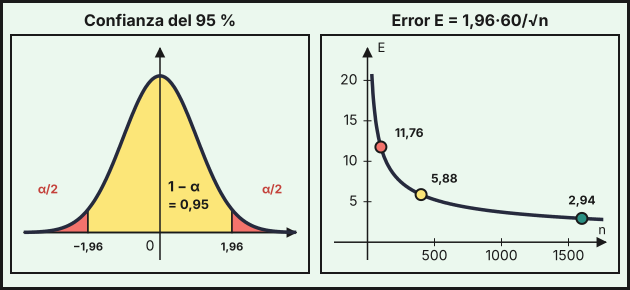

## 1. Población, muestra y muestreo aleatorio simple

La **estadística inferencial** estudia una **población** (todos los individuos de interés) a partir de una **muestra** (una parte de ellos). Una característica de la población, como su media $\mu$, su desviación típica $\sigma$ o la proporción $p$ de individuos con cierta propiedad, es un **parámetro** (desconocido). Su equivalente en la muestra, como la media muestral $\overline{X}$ o la proporción muestral $\hat p$, es un **estadístico** (se calcula con los datos).

En el **muestreo aleatorio simple** (MAS), todos los individuos tienen la misma probabilidad de entrar en la muestra y las elecciones son **independientes**. En poblaciones finitas se entiende que se elige **con reemplazamiento**. Para que la muestra sea **representativa**, la selección debe ser aleatoria y el tamaño $n$ suficiente: se consideran **muestras grandes** las de $n\ge30$.

::: {.callout-warning}
## Muestras sesgadas
Preguntar solo a quien sale de un centro comercial, o a quien responde por voluntad propia, **no es un muestreo aleatorio**: unos grupos tienen más probabilidad de aparecer que otros y las conclusiones quedan sesgadas. Un tamaño grande no corrige un mal método de selección.
:::

## 2. Estimación puntual y por intervalo

Una **estimación puntual** usa un único valor de la muestra para aproximar el parámetro: $\overline{x}$ para $\mu$ y $\hat p$ para $p$. *Ejemplo:* si en una encuesta a $100$ hogares el gasto medio mensual en alimentación es $\overline{x}=420$ €, esa es la estimación puntual de $\mu$.

Una **estimación por intervalo** da un intervalo $(a,\,b)$ que contiene al parámetro con una confianza fijada, el **nivel de confianza** $1-\alpha$ (habitualmente $90\,\%$, $95\,\%$ o $99\,\%$). Es más informativa porque indica el margen de error.

## 3. Distribución de la media y de la proporción muestrales

Si de una población con media $\mu$ y desviación típica $\sigma$ se toman muestras de tamaño $n\ge30$, la **media muestral** sigue aproximadamente una normal:

$$\overline{X}\approx N\!\left(\mu,\ \frac{\sigma}{\sqrt n}\right)$$

(si la población ya es normal, vale para cualquier $n$). Para una **proporción** $p$ en la población, con $n\ge30$, la **proporción muestral** cumple

$$\hat p\approx N\!\left(p,\ \sqrt{\frac{p\,(1-p)}{n}}\right)$$

Al aumentar $n$, la dispersión de $\overline{X}$ y de $\hat p$ disminuye. Con la tabla de la normal ([tema 10](../10-distribuciones/index.qmd)) se calculan probabilidades de estos estadísticos.

*Ejemplo (media).* El salario mensual de los trabajadores de un sector tiene $\mu=1200$ € y $\sigma=300$ €. Con una muestra de $n=100$, $\overline{X}\approx N\!\left(1200,\ \frac{300}{10}\right)=N(1200,\,30)$:

- $P(\overline{X}>1236)=P\!\left(Z>\frac{1236-1200}{30}\right)=P(Z>1{,}2)=1-0{,}8849=0{,}1151$.
- $P(1185<\overline{X}<1245)=P(-0{,}5<Z<1{,}5)=0{,}9332-(1-0{,}6915)=0{,}6247$.

*Ejemplo (proporción).* El $40\,\%$ de los hogares de una ciudad tiene fibra óptica. En una muestra de $n=150$, $\hat p\approx N\!\left(0{,}4,\ \sqrt{\frac{0{,}4\cdot0{,}6}{150}}\right)=N(0{,}4,\ 0{,}04)$:

- $P(\hat p\ge0{,}46)=P(Z\ge1{,}5)=1-0{,}9332=0{,}0668$.
- $P(\hat p\le0{,}35)=P(Z\le-1{,}25)=1-0{,}8944=0{,}1056$.

## 4. Intervalo de confianza para la media (σ conocida)

Si $\overline{X}\approx N(\mu,\,\sigma/\sqrt n)$, entonces con probabilidad $1-\alpha$ la media muestral queda a una distancia de $\mu$ menor que $z_{\alpha/2}\,\sigma/\sqrt n$. De aquí, el **intervalo de confianza** de nivel $1-\alpha$ para $\mu$ es

$$\left(\overline{x}-z_{\alpha/2}\frac{\sigma}{\sqrt n},\ \ \overline{x}+z_{\alpha/2}\frac{\sigma}{\sqrt n}\right)\qquad E=z_{\alpha/2}\frac{\sigma}{\sqrt n}\ \text{ es el error máximo admisible}$$

El **valor crítico** $z_{\alpha/2}$ cumple $P(Z\le z_{\alpha/2})=1-\frac\alpha2$, es decir, deja $\frac\alpha2$ en cada cola. Se lee en la tabla con la lectura inversa del tema 10:

| Confianza $1-\alpha$ | $P(Z\le z_{\alpha/2})$ | $z_{\alpha/2}$ |
|---|---|---|
| $90\,\%$ | $0{,}95$ | $1{,}645$ |
| $95\,\%$ | $0{,}975$ | $1{,}96$ |
| $99\,\%$ | $0{,}995$ | $2{,}575$ |

Para el $95\,\%$, el $0{,}9750$ aparece en la tabla ($z=1{,}96$). Para el $90\,\%$, la tabla tiene $0{,}9495$ ($z=1{,}64$) y $0{,}9505$ ($z=1{,}65$), a la misma distancia de $0{,}95$: se acepta $1{,}64$, $1{,}65$ o la interpolación $1{,}645$. Para el $99\,\%$, $0{,}9949$ ($z=2{,}57$) y $0{,}9951$ ($z=2{,}58$) están a la misma distancia de $0{,}995$: se acepta $2{,}57$, $2{,}58$ o la interpolación $2{,}575$.

{fig-alt="A la izquierda la campana normal con el 95 por ciento central sombreado entre menos 1,96 y 1,96; a la derecha una curva decreciente del error frente al tamaño de la muestra con tres puntos marcados" width="95%" fig-align="center"}

*Ejemplo.* El gasto mensual en alimentación de los hogares tiene $\sigma=60$ €. Con una muestra de $n=100$ hogares se obtiene $\overline{x}=420$ €, y $\frac{\sigma}{\sqrt n}=\frac{60}{10}=6$:

| Confianza | $z_{\alpha/2}$ | Error $E$ | Intervalo |
|---|---|---|---|
| $90\,\%$ | $1{,}645$ | $9{,}87$ | $(410{,}13;\ 429{,}87)$ |
| $95\,\%$ | $1{,}96$ | $11{,}76$ | $(408{,}24;\ 431{,}76)$ |
| $99\,\%$ | $2{,}575$ | $15{,}45$ | $(404{,}55;\ 435{,}45)$ |

**Interpretación** (95 %): «Con una confianza del $95\,\%$, el gasto medio mensual de todos los hogares está entre $408{,}24$ € y $431{,}76$ €». Significa que, si se repitiera el muestreo muchas veces, aproximadamente el $95\,\%$ de los intervalos construidos contendría la media poblacional. No quiere decir que el $95\,\%$ de los hogares gaste entre esos valores.

Si se usara $z=1{,}64$ o $z=1{,}65$ para el $90\,\%$, los extremos cambiarían en unas centésimas: $(410{,}16;\ 429{,}84)$ y $(410{,}10;\ 429{,}90)$. Con el valor exacto $z=1{,}6449$ sale $(410{,}13;\ 429{,}87)$, igual que con $1{,}645$.

::: {.callout-important}
## Ampliación (fuera del currículo de la PAU)
Cuando la desviación típica $\sigma$ de la población es **desconocida**, con muestras grandes se sustituye por la desviación típica muestral $s$. Para muestras pequeñas y poblaciones normales se usaría la distribución $t$ de Student. En este curso $\sigma$ es siempre un dato.
:::

## 5. Intervalo de confianza para una proporción

Si en una muestra de tamaño $n\ge30$ la proporción muestral es $\hat p$, el intervalo de confianza de nivel $1-\alpha$ para la proporción $p$ de la población es

$$\left(\hat p-z_{\alpha/2}\sqrt{\frac{\hat p\,(1-\hat p)}{n}},\ \ \hat p+z_{\alpha/2}\sqrt{\frac{\hat p\,(1-\hat p)}{n}}\right)\qquad E=z_{\alpha/2}\sqrt{\frac{\hat p\,(1-\hat p)}{n}}$$

*Ejemplo.* En una encuesta a $n=400$ personas, $120$ declaran que colaboran como voluntarias en alguna ONG: $\hat p=\frac{120}{400}=0{,}3$. El error típico es $\sqrt{\frac{0{,}3\cdot0{,}7}{400}}\approx0{,}0229$.

- Al $95\,\%$: $E=1{,}96\cdot0{,}0229\approx0{,}0449$, luego el intervalo es $(0{,}2551;\ 0{,}3449)$, es decir, entre el $25{,}5\,\%$ y el $34{,}5\,\%$ de la población.
- Al $90\,\%$: $E=1{,}645\cdot0{,}0229\approx0{,}0377$, y el intervalo es $(0{,}2623;\ 0{,}3377)$.

::: {.callout-important}
## Ampliación (fuera del currículo de la PAU)
Además de $n\ge30$, para que la aproximación normal de una proporción sea buena conviene que $n\,\hat p\ge5$ y $n\,(1-\hat p)\ge5$. Si $\hat p$ es muy cercano a $0$ o a $1$, el intervalo puede salirse de $[0,1]$ y no es fiable.
:::

## 6. Tamaño muestral mínimo

Como $E=z_{\alpha/2}\frac{\sigma}{\sqrt n}$, para que el error no pase de un valor $E$ dado hace falta

$$n\ge\left(\frac{z_{\alpha/2}\,\sigma}{E}\right)^2\qquad(\text{media})\qquad\qquad n\ge\frac{z_{\alpha/2}^2\,p\,(1-p)}{E^2}\qquad(\text{proporción})$$

y se toma el **entero superior** (se redondea hacia arriba). Si no se conoce $p$ ni hay estimación previa, se usa $p=0{,}5$, que da el mayor tamaño posible.

*Ejemplo (media).* Con $\sigma=60$ €, ¿qué $n$ hace que el error máximo a un $95\,\%$ de confianza no supere $8$ €? $n\ge\left(\frac{1{,}96\cdot60}{8}\right)^2=14{,}7^2=216{,}09$, luego $n=217$ hogares.

*Ejemplo (proporción).* Se quiere estimar la proporción de personas que usan el transporte público con un error máximo de $0{,}03$ al $95\,\%$.

- Sin información previa ($p=0{,}5$): $n\ge\frac{1{,}96^2\cdot0{,}25}{0{,}03^2}=1067{,}11$, luego $n=1068$.
- Si un estudio previo estimó $p=0{,}3$: $n\ge\frac{1{,}96^2\cdot0{,}3\cdot0{,}7}{0{,}03^2}=896{,}37$, luego $n=897$.

## 7. Relación entre confianza, error y tamaño

De $E=z_{\alpha/2}\,\sigma/\sqrt n$ se deduce:

- A **mayor confianza**, mayor $z_{\alpha/2}$ y **mayor error** (intervalo más ancho), con $n$ fijo.
- A **mayor tamaño** $n$, **menor error**. Como $E$ depende de $\frac1{\sqrt n}$, para dividir el error entre $2$ hay que **cuadruplicar** $n$.
- Si se quiere más confianza **sin aumentar el error**, hay que aumentar $n$.

*Ejemplo.* Con $\sigma=60$ €, al $95\,\%$: $n=100$ da $E=11{,}76$, $n=400$ da $E=5{,}88$ y $n=1600$ da $E=2{,}94$ (la gráfica de la derecha de la figura). Y para $E\le8$ €:

| Confianza | $z_{\alpha/2}$ | $n$ mínimo |
|---|---|---|
| $90\,\%$ | $1{,}645$ | $153$ |
| $95\,\%$ | $1{,}96$ | $217$ |
| $99\,\%$ | $2{,}575$ | $373$ |

Cuando el valor crítico no aparece en la tabla (90 % y 99 %), el $n$ mínimo depende del valor elegido: para el $90\,\%$ sale $152$ con $z=1{,}64$, $153$ con $1{,}645$ y $154$ con $1{,}65$; para el $99\,\%$, $372$ con $2{,}57$, $373$ con $2{,}575$ y $375$ con $2{,}58$ (con el valor exacto $2{,}5758$ saldría $374$). Todos son válidos si se usa un valor de la tabla de forma coherente. En la tabla de arriba se usa el valor intermedio ($1{,}645$ y $2{,}575$).

::: {.callout-tip}
## Resumen rápido
- MAS: igual probabilidad e independencia (con reemplazamiento). Muestra grande: $n\ge30$.
- $\overline{X}\approx N(\mu,\ \sigma/\sqrt n)$; $\hat p\approx N\!\left(p,\ \sqrt{p(1-p)/n}\right)$.
- Valores críticos: $z_{\alpha/2}=1{,}645$ ($90\,\%$), $1{,}96$ ($95\,\%$), $2{,}575$ ($99\,\%$).
- IC para $\mu$: $\overline{x}\pm z_{\alpha/2}\,\sigma/\sqrt n$. IC para $p$: $\hat p\pm z_{\alpha/2}\sqrt{\hat p(1-\hat p)/n}$.
- Tamaño mínimo: $n\ge(z\sigma/E)^2$ (media) y $n\ge z^2p(1-p)/E^2$ (proporción); se redondea hacia arriba.
- Más confianza → más error; más $n$ → menos error ($n$ por 4 divide $E$ entre 2).
:::
