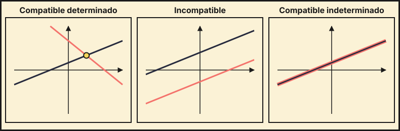

## 1. Conceptos básicos

Un sistema de $m$ ecuaciones lineales con $n$ incógnitas se escribe en forma matricial $AX=B$:

$$\begin{cases}a_{11}x_1+\dots+a_{1n}x_n=b_1\\\vdots\\a_{m1}x_1+\dots+a_{mn}x_n=b_m\end{cases}\iff\underbrace{\begin{pmatrix}a_{11}&\cdots&a_{1n}\\\vdots&&\vdots\\a_{m1}&\cdots&a_{mn}\end{pmatrix}}_{A}\begin{pmatrix}x_1\\\vdots\\x_n\end{pmatrix}=\underbrace{\begin{pmatrix}b_1\\\vdots\\b_m\end{pmatrix}}_{B}$$

- $A$ es la **matriz de coeficientes**.
- $A^*=(A\,|\,B)$ es la **matriz ampliada**.

Según sus soluciones, un sistema es:

| Tipo | Soluciones |
|---|---|
| **Compatible determinado** (SCD) | una única |
| **Compatible indeterminado** (SCI) | infinitas |
| **Incompatible** (SI) | ninguna |

## 2. Teorema de Rouché-Frobenius

Sea $n$ el número de incógnitas.

| Condición | Tipo |
|---|---|
| $\operatorname{rg}A=\operatorname{rg}A^*=n$ | SCD |
| $\operatorname{rg}A=\operatorname{rg}A^*<n$ | SCI (con $n-\operatorname{rg}A$ parámetros) |
| $\operatorname{rg}A\neq\operatorname{rg}A^*$ | SI |

::: {.callout-note}
Siempre $\operatorname{rg}A\le\operatorname{rg}A^*$. Si $A$ es cuadrada con $|A|\neq0$, el sistema es SCD.
:::

{fig-alt="Tres dibujos con dos rectas: que se cortan en un punto, paralelas y coincidentes" width="100%" fig-align="center"}

## 3. Método de Gauss

Se escalona la matriz ampliada con operaciones entre filas (intercambiar, multiplicar por un número $\neq0$, sumar a una fila un múltiplo de otra) y se resuelve de abajo arriba.

Ejemplo:
$$\begin{cases}x+y+z=6\\2x-y+z=3\\x+2y-z=2\end{cases}\quad\left(\begin{array}{ccc|c}1&1&1&6\\2&-1&1&3\\1&2&-1&2\end{array}\right)\xrightarrow[F_3-F_1]{F_2-2F_1}\left(\begin{array}{ccc|c}1&1&1&6\\0&-3&-1&-9\\0&1&-2&-4\end{array}\right)$$
$$\xrightarrow{3F_3+F_2}\left(\begin{array}{ccc|c}1&1&1&6\\0&-3&-1&-9\\0&0&-7&-21\end{array}\right)$$
De la última fila $z=3$; de la segunda $-3y-3=-9\Rightarrow y=2$; de la primera $x=6-2-3=1$. Solución: $(1,2,3)$.

**Cómo leer el resultado**:

- Fila $(0\ 0\ 0\,|\,c)$ con $c\neq0$: sistema **incompatible**.
- Fila $(0\ 0\ 0\,|\,0)$: se elimina; si quedan menos ecuaciones que incógnitas, hay **infinitas soluciones**: las incógnitas libres se sustituyen por parámetros ($z=\lambda$).

## 4. Regla de Cramer

Se aplica a sistemas con **$n$ ecuaciones, $n$ incógnitas y $|A|\neq0$**. Cada incógnita es
$$x_i=\frac{|A_i|}{|A|}$$
donde $A_i$ es $A$ con la columna $i$ sustituida por la columna $B$.

Ejemplo: $\begin{cases}x+y=3\\2x-y=0\end{cases}$ con $|A|=-3$:
$$x=\frac{\left|\begin{matrix}3&1\\0&-1\end{matrix}\right|}{-3}=\frac{-3}{-3}=1\qquad y=\frac{\left|\begin{matrix}1&3\\2&0\end{matrix}\right|}{-3}=\frac{-6}{-3}=2$$

También vale $X=A^{-1}B$ cuando $A$ es invertible.

## 5. Sistemas homogéneos

Son los de la forma $AX=O$ (todos los términos independientes son 0).

- Siempre son compatibles: $X=O$ (solución trivial) lo es.
- Si $|A|\neq0$ (cuadrada): solo la solución trivial (SCD).
- Si $|A|=0$: tiene infinitas soluciones, además de la trivial.

## 6. Discusión de un sistema con parámetros

Para sistemas $3\times3$ con un parámetro $m$:

1. Calcula $|A|$ y halla los valores de $m$ que lo anulan.
2. Si $m$ no es uno de esos valores: $\operatorname{rg}A=\operatorname{rg}A^*=3$, **SCD**.
3. Para **cada** valor que anula $|A|$, sustitúyelo y calcula $\operatorname{rg}A$ y $\operatorname{rg}A^*$ con Gauss o menores. Aplica Rouché.
4. Si te piden resolver, hazlo con Gauss o Cramer en cada caso.

::: {.callout-warning}
Después de discutir, revisa cada valor especial por separado. No basta con mirar el determinante.
:::

## 7. Problemas de planteamiento

1. Elige las incógnitas y escribe qué representa cada una.
2. Traduce cada condición del enunciado a una ecuación.
3. Resuelve el sistema.
4. Comprueba que la solución tiene sentido (por ejemplo, que no sea negativa si son personas).

::: {.callout-tip}
## Resumen rápido
- Rouché: $\operatorname{rg}A=\operatorname{rg}A^*=n$ SCD; $<n$ SCI; distintos SI.
- Gauss: escalonar y resolver de abajo arriba.
- Cramer: $x_i=|A_i|/|A|$ si $|A|\neq0$.
- Homogéneo: siempre compatible; solución no trivial $\iff|A|=0$.
- Con parámetro: $|A|=0$ da los valores críticos; estudiar cada uno.
:::
