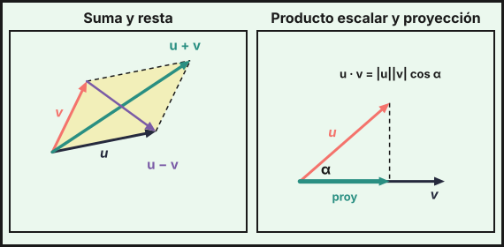
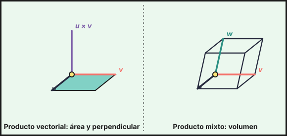

## 1. Vectores en $\mathbb{R}^3$

Un vector $\vec u=(u_1,u_2,u_3)$ tiene tres componentes. El vector que va del punto $A(a_1,a_2,a_3)$ al punto $B(b_1,b_2,b_3)$ es
$$\overrightarrow{AB}=B-A=(b_1-a_1,\ b_2-a_2,\ b_3-a_3)$$

- **Módulo**: $|\vec u|=\sqrt{u_1^2+u_2^2+u_3^2}$. Distancia entre dos puntos: $d(A,B)=|\overrightarrow{AB}|$.
- **Vector unitario** en la dirección de $\vec u$: $\dfrac{\vec u}{|\vec u|}$.
- **Suma, resta y producto por un número**: componente a componente.

Puntos notables:

- Punto medio de $A$ y $B$: $M=\dfrac{A+B}{2}$.
- Simétrico de $A$ respecto de $B$: $A'=2B-A$.
- Baricentro del triángulo $ABC$: $G=\dfrac{A+B+C}{3}$.
- Cuarto vértice del paralelogramo $ABCD$: $D=A+C-B$.

## 2. Dependencia lineal y bases

Los vectores $\vec u,\vec v,\vec w$ son **linealmente dependientes** si alguno es combinación lineal de los demás. Si no, son **independientes**.

- Dos vectores son dependientes si son **proporcionales** (paralelos).
- Tres vectores son dependientes si son **coplanarios**, es decir, si $\det(\vec u,\vec v,\vec w)=0$.
- Tres vectores independientes forman una **base** de $\mathbb{R}^3$: todo vector se escribe de forma única como $\vec t=a\vec u+b\vec v+c\vec w$.

Para hallar las coordenadas $(a,b,c)$ se resuelve el sistema $a\vec u+b\vec v+c\vec w=\vec t$.

{fig-alt="Dos dibujos: la suma y la resta de dos vectores en un paralelogramo, y un vector proyectado sobre otro con el ángulo entre ellos" width="95%" fig-align="center"}

## 3. Producto escalar

$$\vec u\cdot\vec v=u_1v_1+u_2v_2+u_3v_3=|\vec u|\,|\vec v|\cos\alpha$$
donde $\alpha$ es el ángulo que forman. El resultado es un **número**.

| Uso | Fórmula |
|---|---|
| Ángulo | $\cos\alpha=\dfrac{\vec u\cdot\vec v}{|\vec u|\,|\vec v|}$ |
| Perpendiculares | $\vec u\perp\vec v\iff\vec u\cdot\vec v=0$ |
| Módulo | $\vec u\cdot\vec u=|\vec u|^2$ |
| Proyección de $\vec u$ sobre $\vec v$ | $\dfrac{\vec u\cdot\vec v}{|\vec v|}$ (longitud con signo) |
| Vector proyección | $\dfrac{\vec u\cdot\vec v}{\vec v\cdot\vec v}\,\vec v$ |

Ejemplo: $\vec u=(1,2,3)$ y $\vec v=(2,-1,1)$ dan $\vec u\cdot\vec v=2-2+3=3$ y $\cos\alpha=\dfrac{3}{\sqrt{14}\sqrt6}=\dfrac{\sqrt{21}}{14}$, es decir $\alpha\approx70{,}9^\circ$.

## 4. Producto vectorial

$$\vec u\times\vec v=\left|\begin{matrix}\vec i&\vec j&\vec k\\u_1&u_2&u_3\\v_1&v_2&v_3\end{matrix}\right|$$

El resultado es un **vector** con estas propiedades:

- Es **perpendicular** a $\vec u$ y a $\vec v$.
- Su módulo es $|\vec u\times\vec v|=|\vec u|\,|\vec v|\sin\alpha$ = área del paralelogramo que forman.
- $\vec u\times\vec v=-(\vec v\times\vec u)$ (no es conmutativo).
- $\vec u\times\vec v=\vec 0\iff\vec u$ y $\vec v$ son paralelos.

Ejemplo: $(1,2,3)\times(2,-1,1)=(2+3,\ 6-1,\ -1-4)=(5,5,-5)$.

**Aplicaciones**:

- Área del paralelogramo: $|\overrightarrow{AB}\times\overrightarrow{AC}|$.
- Área del triángulo: $\dfrac12|\overrightarrow{AB}\times\overrightarrow{AC}|$.
- Vector perpendicular a dos vectores: $\vec u\times\vec v$. Dividiéndolo entre su módulo se obtiene uno unitario.

## 5. Producto mixto

$$[\vec u,\vec v,\vec w]=\vec u\cdot(\vec v\times\vec w)=\left|\begin{matrix}u_1&u_2&u_3\\v_1&v_2&v_3\\w_1&w_2&w_3\end{matrix}\right|$$

{fig-alt="Dos dibujos en perspectiva: un paralelogramo con el vector perpendicular u por v, y un paralelepípedo con sus tres aristas u, v y w" width="95%" fig-align="center"}

- Volumen del paralelepípedo: $V=|[\vec u,\vec v,\vec w]|$.
- Volumen del tetraedro $ABCD$: $V=\dfrac16\left|[\overrightarrow{AB},\overrightarrow{AC},\overrightarrow{AD}]\right|$.
- Coplanarios $\iff[\vec u,\vec v,\vec w]=0$.
- Altura del tetraedro desde $D$ sobre la base $ABC$: $h=\dfrac{3V}{\text{Área}(ABC)}$.

::: {.callout-tip}
## Resumen rápido
- $\overrightarrow{AB}=B-A$; punto medio $=\frac{A+B}{2}$; baricentro $=\frac{A+B+C}{3}$.
- Escalar → número: ángulo y perpendicularidad. Vectorial → vector: áreas y perpendicular. Mixto → número: volúmenes y coplanaridad.
- Área del triángulo $=\frac12|\overrightarrow{AB}\times\overrightarrow{AC}|$.
- Volumen del tetraedro $=\frac16|[\overrightarrow{AB},\overrightarrow{AC},\overrightarrow{AD}]|$.
- Tres vectores forman base $\iff\det\neq0$.
:::
