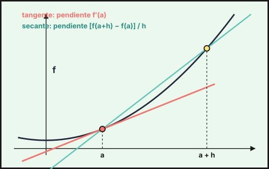
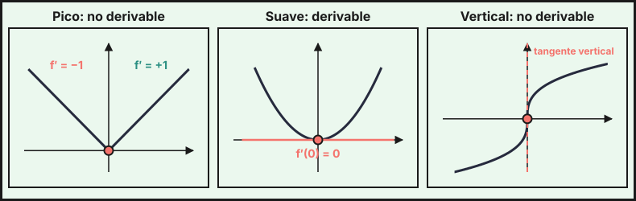

## 1. Definición y significado

La **derivada de $f$ en $a$** es
$$f'(a)=\lim_{h\to0}\frac{f(a+h)-f(a)}{h}=\lim_{x\to a}\frac{f(x)-f(a)}{x-a}$$

- **Significado geométrico**: $f'(a)$ es la pendiente de la recta tangente a la gráfica en el punto $(a,f(a))$.
- **Significado físico**: si $s(t)$ es la posición, $s'(t)$ es la velocidad y $s''(t)$ la aceleración.
- Si $f$ es **derivable** en $a$, entonces es **continua** en $a$. El recíproco es falso: $f(x)=|x|$ es continua en 0 y no derivable.

{fig-alt="Curva con una secante por dos puntos y la tangente en el primero, con las pendientes indicadas" width="85%" fig-align="center"}

## 2. Derivadas de funciones elementales

| $f(x)$ | $f'(x)$ |
|---|---|
| $k$ | $0$ |
| $x^n$ | $nx^{n-1}$ |
| $\sqrt x$ | $\dfrac{1}{2\sqrt x}$ |
| $e^x$ | $e^x$ |
| $a^x$ | $a^x\ln a$ |
| $\ln x$ | $\dfrac1x$ |
| $\sin x$ | $\cos x$ |
| $\cos x$ | $-\sin x$ |
| $\tan x$ | $\dfrac{1}{\cos^2x}=1+\tan^2x$ |
| $\arcsin x$ | $\dfrac{1}{\sqrt{1-x^2}}$ |
| $\arccos x$ | $-\dfrac{1}{\sqrt{1-x^2}}$ |
| $\arctan x$ | $\dfrac{1}{1+x^2}$ |

## 3. Reglas de derivación

- **Suma**: $(f+g)'=f'+g'$. **Producto por un número**: $(kf)'=kf'$.
- **Producto**: $(fg)'=f'g+fg'$.
- **Cociente**: $\left(\dfrac fg\right)'=\dfrac{f'g-fg'}{g^2}$.
- **Regla de la cadena**: $(f\circ g)'(x)=f'(g(x))\cdot g'(x)$.

Con la cadena, cada fila de la tabla se generaliza: $(e^{u})'=u'e^u$, $(\ln u)'=\dfrac{u'}{u}$, $(\sin u)'=u'\cos u$, $(u^n)'=nu^{n-1}u'$, $(\arctan u)'=\dfrac{u'}{1+u^2}$.

Ejemplos:

- $f(x)=e^{3x}\sin x$: $f'=3e^{3x}\sin x+e^{3x}\cos x=e^{3x}(3\sin x+\cos x)$.
- $f(x)=\ln(x^2+1)$: $f'=\dfrac{2x}{x^2+1}$.
- $f(x)=\dfrac{x^2+1}{x-2}$: $f'=\dfrac{2x(x-2)-(x^2+1)}{(x-2)^2}=\dfrac{x^2-4x-1}{(x-2)^2}$.

**Derivación logarítmica**: para $y=f(x)^{g(x)}$ se toman logaritmos, $\ln y=g\ln f$, y se deriva: $\dfrac{y'}{y}=g'\ln f+g\dfrac{f'}{f}$.

Ejemplo: $y=x^x\Rightarrow\ln y=x\ln x\Rightarrow\dfrac{y'}{y}=\ln x+1\Rightarrow y'=x^x(\ln x+1)$.

**Derivada de la función inversa**: $(f^{-1})'(b)=\dfrac{1}{f'(a)}$ si $f(a)=b$.

**Derivadas sucesivas**: $f''=(f')'$, $f'''=(f'')'$. Por ejemplo, para $f=xe^x$ es $f^{(n)}=(x+n)e^x$.

## 4. Recta tangente y recta normal

En el punto $(a,f(a))$:

- **Tangente**: $y-f(a)=f'(a)\,(x-a)$.
- **Normal** (perpendicular a la tangente, si $f'(a)\neq0$): $y-f(a)=-\dfrac{1}{f'(a)}\,(x-a)$.

**Tangente paralela a una recta** de pendiente $m$: se resuelve $f'(x)=m$.

**Tangente horizontal**: $f'(x)=0$.

**Tangente desde un punto exterior $Q$**: la tangente en $x=a$ es $y=f(a)+f'(a)(x-a)$; se impone que pase por $Q$ y se despeja $a$.

## 5. Derivabilidad de funciones a trozos

Para $f(x)=\begin{cases}g(x)&x\le a\\h(x)&x>a\end{cases}$ en el punto de unión:

1. **Continuidad**: $g(a)=h(a)$.
2. **Derivabilidad**: además $g'(a)=h'(a)$ (las derivadas laterales coinciden).

Las derivadas laterales se calculan derivando cada rama y sustituyendo en $a$. Este atajo vale si $f$ es continua en $a$ y cada rama es derivable a su lado; si no, se usa la definición con límites laterales. Para el valor absoluto, se escribe como función a trozos.

Ejemplo: $f(x)=|x-1|$ tiene derivada lateral $-1$ por la izquierda y $+1$ por la derecha en $x=1$: no es derivable ahí.

{fig-alt="Tres dibujos: la función valor absoluto con un pico en cero, una parábola con tangente horizontal en cero y una raíz cúbica con tangente vertical en cero" width="100%" fig-align="center"}

::: {.callout-note}
Si la función no es continua en $a$, tampoco es derivable en $a$. Empieza siempre por la continuidad.
:::

::: {.callout-tip}
## Resumen rápido
- $f'(a)$ es la pendiente de la tangente: $y-f(a)=f'(a)(x-a)$.
- Producto: $f'g+fg'$. Cociente: $\frac{f'g-fg'}{g^2}$. Cadena: $f'(g)\cdot g'$.
- $y=f^g$: derivación logarítmica.
- A trozos: continuidad más igualdad de derivadas laterales.
- Derivable implica continua; no al revés.
:::
