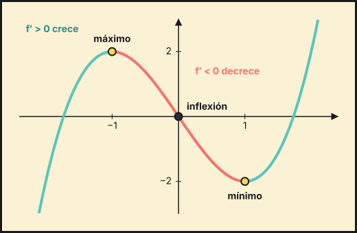
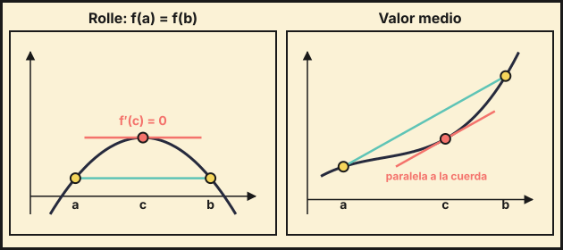

## 1. Monotonía y extremos relativos

Sea $f$ derivable en un intervalo:

- $f'(x)>0$ en todo el intervalo: $f$ es **creciente**.
- $f'(x)<0$ en todo el intervalo: $f$ es **decreciente**.

**Puntos críticos**: los $x$ con $f'(x)=0$ (y los puntos donde $f'$ no existe).

**Método**:

1. Calcula el dominio y $f'$.
2. Resuelve $f'(x)=0$. Los puntos críticos y los puntos fuera del dominio dividen la recta en intervalos.
3. Estudia el signo de $f'$ en cada intervalo.
4. Si $f'$ pasa de $+$ a $-$ en $a$: **máximo relativo**. Si pasa de $-$ a $+$: **mínimo relativo**. Si no cambia de signo: no hay extremo.

**Criterio de la segunda derivada**: si $f'(a)=0$:

- $f''(a)>0\Rightarrow$ mínimo relativo.
- $f''(a)<0\Rightarrow$ máximo relativo.
- $f''(a)=0\Rightarrow$ el criterio no decide; se estudia el signo de $f'$.

::: {.callout-warning}
$f'(a)=0$ no basta para tener un extremo. Por ejemplo, $f(x)=x^3$ tiene $f'(0)=0$ y no tiene extremo.
:::

## 2. Curvatura y puntos de inflexión

- $f''(x)>0$: $f$ es **convexa** ($\cup$, cóncava hacia arriba).
- $f''(x)<0$: $f$ es **cóncava** ($\cap$, cóncava hacia abajo).

Un **punto de inflexión** es un punto donde cambia la curvatura. Se buscan resolviendo $f''(x)=0$ y comprobando que $f''$ cambia de signo (o que $f'''(a)\neq0$).

{fig-alt="Gráfica de x al cubo menos 3x con el máximo, el mínimo y el punto de inflexión marcados" width="85%" fig-align="center"}

## 3. Extremos absolutos en un intervalo cerrado

Si $f$ es continua en $[a,b]$, por el teorema de Weierstrass tiene máximo y mínimo absolutos. Se calculan los valores de $f$ en:

- los extremos $a$ y $b$, y
- los puntos críticos del interior,

y se comparan. El mayor es el máximo absoluto y el menor el mínimo absoluto.

## 4. Optimización

Para resolver un problema de máximos o mínimos:

1. Dibuja y nombra las variables.
2. Escribe la **función a optimizar** $F$.
3. Usa las condiciones del enunciado para dejar $F$ con **una sola variable**.
4. Indica el dominio (valores con sentido).
5. Resuelve $F'(x)=0$ y comprueba con $F''$ o con el signo de $F'$ que es máximo o mínimo.
6. Responde con las unidades y comprueba los extremos del dominio.

## 5. Teoremas de Rolle y del valor medio

**Teorema de Rolle**: si $f$ es continua en $[a,b]$, derivable en $(a,b)$ y $f(a)=f(b)$, existe $c\in(a,b)$ con $f'(c)=0$.

**Teorema del valor medio (Lagrange)**: si $f$ es continua en $[a,b]$ y derivable en $(a,b)$, existe $c\in(a,b)$ con
$$f'(c)=\frac{f(b)-f(a)}{b-a}$$
(hay una tangente paralela a la cuerda que une los extremos).

{fig-alt="Dos dibujos: una curva con la misma altura en a y b y una tangente horizontal en c, y otra curva con una cuerda entre a y b y una tangente paralela a ella en c" width="95%" fig-align="center"}

Para aplicarlos hay que **comprobar siempre las hipótesis** (continuidad y derivabilidad) antes de concluir.

**Usos típicos**:

- Probar que una ecuación tiene **a lo sumo** una solución: si tuviera dos, Rolle daría un punto con $f'=0$; si $f'\neq0$ siempre, es imposible. Para que tenga **al menos** una, se usa Bolzano.
- Probar desigualdades con el teorema del valor medio.

## 6. Estudio completo de una función

1. **Dominio**.
2. **Simetrías**: par ($f(-x)=f(x)$) o impar ($f(-x)=-f(x)$).
3. **Cortes** con los ejes: $f(0)$ y $f(x)=0$.
4. **Asíntotas**: verticales, horizontales y oblicuas.
5. **Monotonía y extremos** con $f'$.
6. **Curvatura e inflexión** con $f''$.
7. **Gráfica**, marcando los puntos obtenidos.

::: {.callout-tip}
## Resumen rápido
- $f'>0$ crece, $f'<0$ decrece; extremo: $f'$ cambia de signo.
- $f''>0$ convexa, $f''<0$ cóncava; inflexión: $f''$ cambia de signo.
- Extremos absolutos en $[a,b]$: comparar los valores en los extremos y en los puntos críticos.
- Optimización: función de una variable, derivar, igualar a 0, comprobar.
- Rolle: $f(a)=f(b)\Rightarrow f'(c)=0$. Lagrange: $f'(c)=\frac{f(b)-f(a)}{b-a}$.
:::
