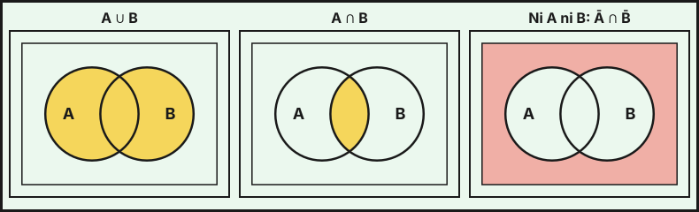

## 1. Experimentos y sucesos

- **Experimento aleatorio**: no se puede predecir el resultado, pero sí se conocen los posibles.
- **Espacio muestral** $E$: conjunto de todos los resultados. **Suceso**: subconjunto de $E$.
- **Suceso seguro** $E$, **imposible** $\varnothing$, **contrario** $\overline A$ (o $A^c$).
- **Unión** $A\cup B$ (ocurre $A$ o $B$), **intersección** $A\cap B$ (ocurren los dos).
- $A$ y $B$ son **incompatibles** si $A\cap B=\varnothing$.

**Leyes de De Morgan**: $\overline{A\cup B}=\overline A\cap\overline B$ y $\overline{A\cap B}=\overline A\cup\overline B$.

## 2. Probabilidad

**Regla de Laplace** (resultados equiprobables): $P(A)=\dfrac{\text{casos favorables}}{\text{casos posibles}}$. Para contar se usan las técnicas de combinatoria: permutaciones, variaciones y combinaciones $\binom nk=\dfrac{n!}{k!(n-k)!}$.

**Propiedades**:

- $0\le P(A)\le1$, $P(E)=1$, $P(\varnothing)=0$.
- $P(\overline A)=1-P(A)$.
- $P(A\cup B)=P(A)+P(B)-P(A\cap B)$. Si son incompatibles, $P(A\cup B)=P(A)+P(B)$.
- $P(\overline A\cap\overline B)=1-P(A\cup B)$ y $P(\overline A\cup\overline B)=1-P(A\cap B)$.

{fig-alt="Tres diagramas de Venn con la unión, la intersección y el complemento de la unión sombreados" width="100%" fig-align="center"}

## 3. Probabilidad condicionada e independencia

$$P(A\mid B)=\frac{P(A\cap B)}{P(B)}\qquad(P(B)>0)$$

De aquí sale la **regla del producto**: $P(A\cap B)=P(B)\,P(A\mid B)=P(A)\,P(B\mid A)$.

**Independencia**: $A$ y $B$ son independientes si $P(A\cap B)=P(A)\,P(B)$, equivalentemente $P(A\mid B)=P(A)$.

::: {.callout-warning}
**Incompatibles** ($A\cap B=\varnothing$) no es lo mismo que **independientes**. Si $P(A)>0$ y $P(B)>0$, dos sucesos incompatibles son siempre dependientes, porque $P(A\cap B)=0\neq P(A)P(B)$.
:::

Si $A$ y $B$ son independientes, también lo son $A$ y $\overline B$, $\overline A$ y $B$, y $\overline A$ y $\overline B$.

## 4. Probabilidad total y teorema de Bayes

Sea $A_1,\dots,A_n$ un **sistema completo** de sucesos (incompatibles dos a dos y con unión $E$).

**Probabilidad total**:
$$P(B)=\sum_{i=1}^nP(A_i)\,P(B\mid A_i)$$

**Teorema de Bayes**:
$$P(A_i\mid B)=\frac{P(A_i)\,P(B\mid A_i)}{P(B)}=\frac{P(A_i)\,P(B\mid A_i)}{\sum_jP(A_j)\,P(B\mid A_j)}$$

Se usa cuando se conoce el resultado final ($B$) y se pregunta por la causa ($A_i$).

**Método con diagrama de árbol**:

1. Dibuja las ramas de la primera etapa con sus probabilidades.
2. Desde cada rama, dibuja las de la segunda con las probabilidades **condicionadas**.
3. La probabilidad de un camino es el **producto** de sus ramas.
4. $P(B)$ es la **suma** de los caminos que llegan a $B$.
5. Bayes: camino concreto dividido entre $P(B)$.

## 5. Tablas de contingencia

Una tabla de doble entrada recoge las frecuencias de dos características. Las probabilidades conjuntas salen dividiendo cada celda entre el total, las marginales de los totales de fila o columna, y las condicionadas dividiendo dentro de la fila o columna dada.

| | Fuma | No fuma | Total |
|---|---|---|---|
| Mujer | 30 | 90 | 120 |
| Hombre | 40 | 40 | 80 |
| Total | 70 | 130 | 200 |

Por ejemplo, $P(\text{mujer}\mid\text{fuma})=\dfrac{30}{70}=\dfrac37$ y $P(\text{fuma}\mid\text{hombre})=\dfrac{40}{80}=\dfrac12$.

## 6. Extracciones con y sin reemplazamiento

- **Con reemplazamiento**: las extracciones son independientes, las probabilidades no cambian.
- **Sin reemplazamiento**: las extracciones son dependientes, hay que usar probabilidades condicionadas: $P(R_1\cap R_2)=\dfrac{5}{8}\cdot\dfrac47$ si hay 5 rojas en 8 bolas.
- Para «**al menos uno**» se usa el suceso contrario: $P(\text{al menos uno})=1-P(\text{ninguno})$.

::: {.callout-tip}
## Resumen rápido
- $P(A\cup B)=P(A)+P(B)-P(A\cap B)$; $P(\overline A)=1-P(A)$.
- $P(A\mid B)=\frac{P(A\cap B)}{P(B)}$; independientes: $P(A\cap B)=P(A)P(B)$.
- Probabilidad total: suma de caminos del árbol.
- Bayes: camino concreto entre la probabilidad total.
- «Al menos uno»: $1-P(\text{ninguno})$.
:::
