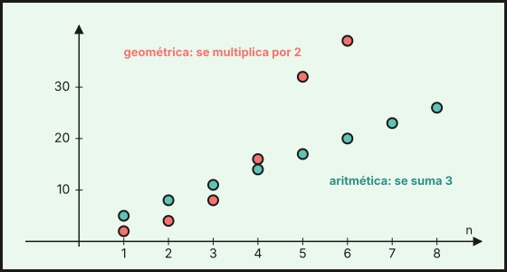

## 1. Sucesiones y patrones

Una **sucesión** es una lista ordenada de números, llamados **términos**: $a_1,\ a_2,\ a_3,\dots$ El subíndice indica la posición. Muchas sucesiones siguen una regla que se descubre observando el **patrón**.

Ejemplo: $3,\ 7,\ 11,\ 15,\ 19,\dots$ Cada término es el anterior más $4$.

- **Término general** $a_n$: fórmula que da cualquier término en función de su posición $n$. Para $2,\ 4,\ 6,\ 8,\dots$ es $a_n=2n$.
- **Forma recurrente**: cada término se calcula a partir de los anteriores. Para $1,\ 1,\ 2,\ 3,\ 5,\ 8,\dots$ (Fibonacci) es $a_n=a_{n-1}+a_{n-2}$.

Ejemplo: con $a_n=n^2-1$ los términos son $0,\ 3,\ 8,\ 15,\ 24,\dots$ y el décimo es $a_{10}=99$.

## 2. Progresiones aritméticas

En una **progresión aritmética** cada término se obtiene sumando al anterior una cantidad fija $d$, la **diferencia**: $a_n=a_{n-1}+d$.

$$a_n=a_1+(n-1)\cdot d$$

Ejemplo: $5,\ 8,\ 11,\ 14,\dots$ tiene $a_1=5$ y $d=3$, luego $a_n=5+3(n-1)=3n+2$ y el término $20$ es $a_{20}=62$.

- Si $d>0$ la progresión es creciente; si $d<0$, decreciente; si $d=0$, constante.
- También vale $a_n=a_k+(n-k)\cdot d$ para cualesquiera posiciones $n$ y $k$.

### Suma de los $n$ primeros términos

$$S_n=\frac{(a_1+a_n)\cdot n}{2}$$

La idea (de Gauss): sumando el primer y el último término, el segundo y el penúltimo, etc., todas las parejas dan lo mismo. Ejemplo: $1+2+3+\dots+100=\dfrac{(1+100)\cdot100}{2}=5\,050$.

Ejemplo: en un teatro, la primera fila tiene $12$ butacas y cada fila siguiente tiene $2$ más. La fila $15$ tiene $a_{15}=12+14\cdot2=40$ butacas, y en total hay $S_{15}=\dfrac{(12+40)\cdot15}{2}=390$.

## 3. Progresiones geométricas

En una **progresión geométrica** cada término se obtiene multiplicando el anterior por una cantidad fija $r$, la **razón**: $a_n=a_{n-1}\cdot r$.

$$a_n=a_1\cdot r^{\,n-1}$$

Ejemplo: $3,\ 6,\ 12,\ 24,\dots$ tiene $a_1=3$ y $r=2$, luego $a_n=3\cdot2^{n-1}$ y $a_8=3\cdot2^7=384$.

- Si $r>1$ los términos (positivos) crecen; si $0<r<1$ decrecen; si $r<0$ cambian de signo.

### Suma de los $n$ primeros términos

$$S_n=\frac{a_n\cdot r-a_1}{r-1}=\frac{a_1\,(r^n-1)}{r-1}\qquad(r\neq1)$$

Ejemplo: $S_6=3+6+12+24+48+96=\dfrac{3\,(2^6-1)}{2-1}=189$.

### Suma de infinitos términos (ampliación)

Si $|r|<1$, los términos se hacen tan pequeños que la suma de **todos** ellos es finita:

$$S=\frac{a_1}{1-r}$$

Ejemplo: $1+\dfrac12+\dfrac14+\dfrac18+\dots=\dfrac{1}{1-\frac12}=2$. Así se explica que $0{,}\overline{9}=0{,}9+0{,}09+0{,}009+\dots=\dfrac{0{,}9}{1-0{,}1}=1$.

::: {.callout-note}
## Interés compuesto
Un capital $C$ al $r\,\%$ anual crece en progresión geométrica de razón $1+\frac{r}{100}$. Tras $n$ años: $C_n=C\left(1+\dfrac{r}{100}\right)^n$. Con $2\,000$ € al $3\,\%$ durante $4$ años: $2\,000\cdot1{,}03^4\approx2\,251{,}02$ €.
:::

## 4. ¿Aritmética o geométrica?

| | Aritmética | Geométrica |
|---|---|---|
| Se pasa de un término al siguiente | sumando $d$ | multiplicando por $r$ |
| Se reconoce porque | $a_{n+1}-a_n$ es constante | $a_{n+1}:a_n$ es constante |
| Término general | $a_1+(n-1)d$ | $a_1\cdot r^{n-1}$ |

{fig-alt="Puntos de una progresión aritmética alineados y puntos de una geométrica que crecen cada vez más rápido" width="85%" fig-align="center"}

::: {.callout-warning}
## Cuidado
Una sucesión puede no ser ni una ni otra: $1,\ 4,\ 9,\ 16,\dots$ tiene diferencias $3,\ 5,\ 7,\dots$ y cocientes $4,\ \frac94,\ \frac{16}{9},\dots$ que no son constantes.
:::

::: {.callout-note}
## Hoja de cálculo
En una hoja de cálculo escribe $5$ en `A1` y `=A1+3` en `A2`; arrastra hacia abajo y obtienes una progresión aritmética de diferencia $3$. Con `=A1*2` tendrías una geométrica de razón $2$. La función `=SUMA(A1:A10)` da la suma de los diez primeros términos y sirve para comprobar la fórmula de $S_n$.
:::

::: {.callout-tip}
## Resumen rápido
- Aritmética: $a_n=a_1+(n-1)d$ y $S_n=\frac{(a_1+a_n)n}{2}$.
- Geométrica: $a_n=a_1r^{n-1}$ y $S_n=\frac{a_1(r^n-1)}{r-1}$; si $|r|<1$, $S_\infty=\frac{a_1}{1-r}$.
- Para clasificar una sucesión, mira diferencias (aritmética) o cocientes (geométrica).
:::

<!-- objetivos -->
## Debes saber hacer

- Hallar la regla de formación de una sucesión y calcular términos.
- Reconocer progresiones aritméticas y geométricas y obtener su término general.
- Calcular la suma de los $n$ primeros términos de una progresión aritmética o geométrica.
- Calcular la suma de infinitos términos de una progresión geométrica con $|r|<1$.
- Resolver problemas con progresiones (ahorro, crecimiento, interés compuesto).

::: {.callout-note collapse="true"}
## Saberes básicos del currículo
Saberes de la Orden de 30 de mayo de 2023 (BOJA nº 104) que se trabajan en este tema: MAT.3.D.1.1, MAT.3.A.4.4, MAT.3.D.2.1.
:::
