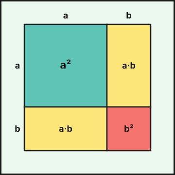

## 1. Del lenguaje cotidiano al lenguaje algebraico

El **álgebra** usa letras para representar cantidades desconocidas o que pueden variar. Una letra que puede tomar distintos valores es una **variable**.

| Lenguaje cotidiano | Lenguaje algebraico |
|---|---|
| El doble de un número | $2x$ |
| Un número aumentado en 5 | $x+5$ |
| El cuadrado de la suma de dos números | $(x+y)^2$ |
| La suma de los cuadrados de dos números | $x^2+y^2$ |
| Tres números consecutivos | $x,\ x+1,\ x+2$ |
| Un múltiplo de 3 | $3k$ |
| Precio con un $20\,\%$ de descuento | $0{,}8\,p$ |

Una **expresión algebraica** combina números, letras y operaciones. Su **valor numérico** se obtiene sustituyendo las letras: si $x=3$, entonces $2x^2-5x+1=18-15+1=4$.

## 2. Monomios y polinomios

Un **monomio** es el producto de un número (**coeficiente**) por una o varias letras con exponente natural (**parte literal**). Su **grado** es la suma de los exponentes: $-4x^3y$ tiene coeficiente $-4$ y grado $4$. Son **semejantes** los monomios con la misma parte literal, y solo estos se suman:

$$5x^2-3x^2+x^2=3x^2 \qquad 2x^2+3x\ \text{no se simplifica}$$

Un **polinomio** es una suma de monomios. Con una variable se ordena de mayor a menor grado:

$$P(x)=4x^3-2x^2+x-7$$

Su **grado** es el del término de mayor grado (aquí $3$); $-7$ es el **término independiente**. El **valor numérico** en $x=2$ es $P(2)=32-8+2-7=19$.

## 3. Operaciones con polinomios

**Suma y resta**: se suman o restan los coeficientes de los monomios semejantes.

$$(3x^2-x+5)-(x^2+4x-2)=2x^2-5x+7$$

**Producto**: se multiplica cada término de uno por cada término del otro y se reducen los semejantes.

$$(x-3)(2x^2+x-1)=2x^3+x^2-x-6x^2-3x+3=2x^3-5x^2-4x+3$$

**Potencias y paréntesis**: $(-2x)^3=-8x^3$ y $(x^2)^3=x^6$.

### División de polinomios

Se divide como los números: se divide el término de mayor grado del dividendo entre el del divisor, se multiplica y se resta. Se repite hasta que el resto tenga grado menor que el divisor.

$$\frac{x^3+2x^2-5x+1}{x-2}\ :\quad \text{cociente }x^2+4x+3,\quad\text{resto }7$$

Se comprueba con **dividendo = divisor $\cdot$ cociente + resto**: $(x-2)(x^2+4x+3)+7=x^3+2x^2-5x+1$.

::: {.callout-note}
## Resto y valor numérico
Al dividir $P(x)$ entre $x-a$, el resto es $P(a)$. Aquí $P(2)=8+8-10+1=7$. Si $P(a)=0$, $P(x)$ es divisible entre $x-a$ y $a$ es una **raíz**.
:::

## 4. Identidades notables

Son productos que conviene recordar:

$$(a+b)^2=a^2+2ab+b^2 \qquad (a-b)^2=a^2-2ab+b^2 \qquad (a+b)(a-b)=a^2-b^2$$

{fig-alt="Un cuadrado de lado a más b dividido en un cuadrado de lado a, un cuadrado de lado b y dos rectángulos de lados a y b" width="45%" fig-align="center"}

::: {.callout-warning}
## Error muy frecuente
$(a+b)^2\neq a^2+b^2$. Falta el **doble producto** $2ab$. Por ejemplo, $(3+4)^2=49$, pero $3^2+4^2=25$.
:::

Ejemplos: $(x+5)^2=x^2+10x+25$; $(2x-3)^2=4x^2-12x+9$; $(3x+2)(3x-2)=9x^2-4$.

## 5. Factorización

Factorizar es escribir un polinomio como producto de otros de menor grado.

- **Factor común**: $6x^3-9x^2=3x^2(2x-3)$.
- **Identidad notable** (leída al revés): $x^2-16=(x+4)(x-4)$ y $x^2+6x+9=(x+3)^2$.
- **Raíces**: si $a$ es raíz, aparece el factor $(x-a)$. Para $x^2-5x+6$ las raíces son $2$ y $3$, y $x^2-5x+6=(x-2)(x-3)$.

Factorizar permite simplificar **fracciones algebraicas**:

$$\frac{x^2-9}{x^2-3x}=\frac{(x+3)(x-3)}{x(x-3)}=\frac{x+3}{x}\qquad(x\neq0,\ x\neq3)$$

::: {.callout-tip}
## Resumen rápido
- Solo se suman monomios semejantes.
- $(a\pm b)^2=a^2\pm2ab+b^2$ y $(a+b)(a-b)=a^2-b^2$.
- Dividendo $=$ divisor $\cdot$ cociente $+$ resto. El resto de dividir entre $x-a$ es $P(a)$.
- Factorizar: factor común, identidades notables y raíces.
:::

<!-- objetivos -->
## Debes saber hacer

- Traducir enunciados al lenguaje algebraico y calcular el valor numérico de una expresión.
- Sumar, restar y multiplicar polinomios.
- Desarrollar y reconocer las identidades notables.
- Dividir polinomios y comprobar el resultado; relacionar el resto con el valor numérico.
- Factorizar sacando factor común, con identidades notables o por sus raíces.

::: {.callout-note collapse="true"}
## Saberes básicos del currículo
Saberes de la Orden de 30 de mayo de 2023 (BOJA nº 104) que se trabajan en este tema: MAT.3.D.2.1, MAT.3.D.2.2, MAT.3.D.3, MAT.3.D.4.2.
:::
