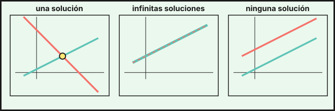

## 1. Ecuaciones lineales con dos incógnitas

Una ecuación como $2x+y=7$ tiene **infinitas soluciones**: cada una es una pareja $(x,y)$, por ejemplo $(1,5)$, $(2,3)$ o $(0,7)$. Al representarlas en el plano se obtiene una **recta**.

Un **sistema de dos ecuaciones lineales con dos incógnitas** busca las parejas que cumplen las dos a la vez:

$$\begin{cases}2x+y=7\\ x-y=-1\end{cases}$$

Su solución es $x=2$, $y=3$ (se comprueba: $4+3=7$ y $2-3=-1$).

## 2. Métodos de resolución

### Sustitución

Se despeja una incógnita en una ecuación y se sustituye en la otra. De $x-y=-1$ sale $x=y-1$; en la primera: $2(y-1)+y=7\Rightarrow3y=9\Rightarrow y=3$ y $x=2$.

### Igualación

Se despeja la **misma** incógnita en las dos ecuaciones y se igualan. De $y=7-2x$ y $y=x+1$ resulta $7-2x=x+1\Rightarrow x=2$ e $y=3$.

### Reducción

Se multiplican las ecuaciones por números adecuados para que una incógnita tenga coeficientes opuestos y al sumar desaparezca.

$$\begin{cases}3x+2y=12\\ 5x-4y=-2\end{cases}\xrightarrow{\ 2\cdot E_1\ }\begin{cases}6x+4y=24\\ 5x-4y=-2\end{cases}\xrightarrow{\ \text{sumando}\ }11x=22\Rightarrow x=2,\ y=3$$

::: {.callout-tip}
## ¿Cuál elegir?
Sustitución si alguna incógnita tiene coeficiente $1$ o $-1$; reducción si los coeficientes son más grandes; igualación si ya aparece despejada la misma incógnita en ambas.
:::

## 3. Interpretación gráfica y clasificación

Cada ecuación es una recta, y la solución del sistema son los puntos comunes:

| Posición de las rectas | Soluciones | Sistema |
|---|---|---|
| Se cortan en un punto | una | compatible determinado |
| Coinciden | infinitas | compatible indeterminado |
| Son paralelas | ninguna | incompatible |

{fig-alt="Tres recuadros: dos rectas que se cortan en un punto, dos rectas que coinciden y dos rectas paralelas" width="95%" fig-align="center"}

Para $\begin{cases}a_1x+b_1y=c_1\\a_2x+b_2y=c_2\end{cases}$ se compara $\dfrac{a_1}{a_2}$, $\dfrac{b_1}{b_2}$ y $\dfrac{c_1}{c_2}$:

- Si $\dfrac{a_1}{a_2}\neq\dfrac{b_1}{b_2}$: se cortan.
- Si $\dfrac{a_1}{a_2}=\dfrac{b_1}{b_2}=\dfrac{c_1}{c_2}$: coinciden.
- Si $\dfrac{a_1}{a_2}=\dfrac{b_1}{b_2}\neq\dfrac{c_1}{c_2}$: son paralelas.

Ejemplos: $\begin{cases}x+2y=4\\2x+4y=8\end{cases}$ es indeterminado (la segunda es el doble de la primera), y $\begin{cases}x+2y=4\\2x+4y=5\end{cases}$ es incompatible.

## 4. Sistemas no lineales sencillos

Cuando una ecuación es de segundo grado se despeja en la lineal y se sustituye.

$$\begin{cases}x+y=5\\ x\cdot y=6\end{cases}\Rightarrow y=5-x\Rightarrow x(5-x)=6\Rightarrow x^2-5x+6=0\Rightarrow x=2\text{ o }x=3$$

Las soluciones son $(2,3)$ y $(3,2)$.

## 5. Problemas con sistemas

1. Elige **dos incógnitas** y di qué representan.
2. Escribe **dos ecuaciones** con los datos.
3. Resuelve el sistema.
4. Comprueba que cumple el enunciado.

Ejemplo: en una cafetería, 2 cafés y 3 bollos cuestan $8{,}10$ €, y 3 cafés y 2 bollos cuestan $7{,}65$ €. ¿Cuánto cuesta cada cosa?

$$\begin{cases}2c+3b=8{,}10\\3c+2b=7{,}65\end{cases}\Rightarrow c=1{,}35\text{ euros},\quad b=1{,}80\text{ euros}$$

Comprobación: $2\cdot1{,}35+3\cdot1{,}80=2{,}70+5{,}40=8{,}10$ y $3\cdot1{,}35+2\cdot1{,}80=4{,}05+3{,}60=7{,}65$.

::: {.callout-tip}
## Resumen rápido
- Métodos: sustitución, igualación y reducción (dan el mismo resultado).
- Rectas que se cortan, coinciden o son paralelas $\Rightarrow$ una, infinitas o ninguna solución.
- Problemas: dos incógnitas, dos ecuaciones, resolver y comprobar.
:::

<!-- objetivos -->
## Debes saber hacer

- Resolver un sistema 2×2 por sustitución, igualación y reducción.
- Clasificar un sistema (una solución, infinitas o ninguna) y relacionarlo con la posición de las rectas.
- Resolver sistemas sencillos con una ecuación de segundo grado.
- Plantear y resolver problemas con sistemas de ecuaciones.

::: {.callout-note collapse="true"}
## Saberes básicos del currículo
Saberes de la Orden de 30 de mayo de 2023 (BOJA nº 104) que se trabajan en este tema: MAT.3.D.4.1, MAT.3.D.4.3, MAT.3.D.2.1, MAT.3.D.2.2.
:::
