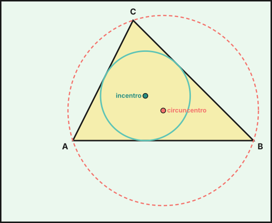

## 1. Teorema de Pitágoras

En un **triángulo rectángulo**, los lados que forman el ángulo recto son los **catetos** ($a$, $b$) y el lado opuesto es la **hipotenusa** ($c$), el mayor de los tres.

$$c^2=a^2+b^2$$

Se puede usar de tres formas:

- **Hipotenusa**: $c=\sqrt{a^2+b^2}$. Con catetos $6$ y $8$: $c=\sqrt{100}=10$.
- **Cateto**: $a=\sqrt{c^2-b^2}$. Con $c=13$ y $b=5$: $a=\sqrt{144}=12$.
- **Reconocer un triángulo rectángulo**: si $c^2=a^2+b^2$, es rectángulo. $(5,12,13)$ lo es; $(4,5,6)$ no, porque $16+25=41\neq36$. Las ternas como $(3,4,5)$ se llaman **ternas pitagóricas**.

### Aplicaciones

- **Diagonal de un rectángulo** de lados $a$ y $b$: $d=\sqrt{a^2+b^2}$. En una pantalla de $48$ por $27$ cm, $d\approx55{,}07$ cm.
- **Altura de un triángulo isósceles** de lados iguales $5$ y base $6$: $h=\sqrt{5^2-3^2}=4$.
- **Distancia entre dos puntos** $A(x_1,y_1)$ y $B(x_2,y_2)$: $d(A,B)=\sqrt{(x_2-x_1)^2+(y_2-y_1)^2}$. Entre $(1,2)$ y $(5,5)$: $\sqrt{16+9}=5$.

::: {.callout-note}
## La proporción cordobesa
En el arte y la arquitectura andalusí aparece la **proporción cordobesa**, la razón entre el radio de la circunferencia circunscrita al octógono regular y su lado: $c=\dfrac{R}{l}\approx1{,}3066$. Se relaciona con el teorema de Pitágoras. El número de oro es otra proporción famosa, $\varphi=\dfrac{1+\sqrt5}{2}\approx1{,}618$.
:::

## 2. Lugares geométricos

Un **lugar geométrico** es el conjunto de **todos** los puntos del plano que cumplen una propiedad.

| Lugar geométrico | Propiedad de sus puntos | Figura |
|---|---|---|
| **Circunferencia** de centro $O$ y radio $r$ | distan $r$ de $O$ | línea curva cerrada |
| **Mediatriz** de un segmento $AB$ | equidistan de $A$ y de $B$ | recta perpendicular por el punto medio |
| **Bisectriz** de un ángulo | equidistan de los dos lados | recta que divide el ángulo en dos iguales |
| **Paralelas** a una recta $r$ a distancia $d$ | distan $d$ de $r$ | dos rectas paralelas a $r$ |

### Puntos notables de un triángulo

- **Circuncentro**: cortan las tres mediatrices. Equidista de los vértices y es el centro de la circunferencia **circunscrita**.
- **Incentro**: cortan las tres bisectrices. Equidista de los lados y es el centro de la circunferencia **inscrita**.
- **Baricentro**: cortan las tres medianas. Está a $\frac23$ de cada vértice, y es el centro de gravedad.
- **Ortocentro**: cortan las tres alturas.

{fig-alt="Un triángulo con su circunferencia circunscrita que pasa por los tres vértices y su circunferencia inscrita tangente a los tres lados" width="55%" fig-align="center"}

Ejemplo: tres pueblos $A$, $B$ y $C$ quieren construir un centro de salud a la misma distancia de los tres. Debe estar en el **circuncentro** del triángulo $ABC$.

## 3. Perímetros y áreas de figuras planas

| Figura | Área | Perímetro |
|---|---|---|
| Cuadrado de lado $l$ | $l^2$ | $4l$ |
| Rectángulo $a\times b$ | $a\cdot b$ | $2a+2b$ |
| Triángulo (base $b$, altura $h$) | $\dfrac{b\cdot h}{2}$ | suma de los lados |
| Paralelogramo | $b\cdot h$ | $2(a+b)$ |
| Rombo (diagonales $D$, $d$) | $\dfrac{D\cdot d}{2}$ | $4l$ |
| Trapecio (bases $B$, $b$) | $\dfrac{(B+b)\cdot h}{2}$ | suma de los lados |
| Polígono regular (apotema $a$) | $\dfrac{P\cdot a}{2}$ | $P=n\cdot l$ |
| Círculo de radio $r$ | $\pi r^2$ | $2\pi r$ (longitud) |
| Sector circular de $n^\circ$ | $\dfrac{\pi r^2\, n}{360}$ | arco: $\dfrac{2\pi r\, n}{360}$ |
| Corona circular ($R$, $r$) | $\pi(R^2-r^2)$ | $2\pi(R+r)$ |

Ejemplos:

- **Hexágono regular** de lado $6$ cm. La apotema es $a=\sqrt{6^2-3^2}=\sqrt{27}\approx5{,}20$ cm, por lo que $A=\dfrac{36\cdot\sqrt{27}}{2}\approx93{,}53$ cm².
- **Sector circular** de $60^\circ$ y radio $9$ cm: $A=\dfrac{\pi\cdot81\cdot60}{360}\approx42{,}41$ cm².
- **Figuras compuestas**: se descomponen en figuras conocidas, sumando o restando áreas. Una pista de atletismo formada por un rectángulo $60\times30$ m y dos semicírculos de radio $15$ m tiene área $1\,800+\pi\cdot15^2\approx2\,506{,}86$ m².

::: {.callout-warning}
## Unidades
El área se mide en unidades **cuadradas** (m², cm²). Todas las medidas deben estar en la misma unidad antes de operar: $1$ m² $=10\,000$ cm².
:::

::: {.callout-tip}
## Resumen rápido
- Pitágoras: $c^2=a^2+b^2$ solo en triángulos rectángulos.
- Mediatriz: equidista de dos puntos. Bisectriz: equidista de dos rectas. Circunferencia: equidista de un punto.
- Circuncentro (mediatrices), incentro (bisectrices), baricentro (medianas), ortocentro (alturas).
- Polígono regular: $A=\frac{P\cdot a}{2}$. Círculo: $A=\pi r^2$, $L=2\pi r$.
:::

<!-- objetivos -->
## Debes saber hacer

- Aplicar el teorema de Pitágoras para hallar lados, diagonales y distancias entre puntos.
- Reconocer la circunferencia, la mediatriz y la bisectriz como lugares geométricos.
- Situar el circuncentro, el incentro, el baricentro y el ortocentro de un triángulo.
- Calcular perímetros y áreas de figuras planas, de sectores circulares y de figuras compuestas.

::: {.callout-note collapse="true"}
## Saberes básicos del currículo
Saberes de la Orden de 30 de mayo de 2023 (BOJA nº 104) que se trabajan en este tema: MAT.3.B.2.1, MAT.3.C.1.2, MAT.3.C.1.3, MAT.3.C.2, MAT.3.C.4.1.
:::
