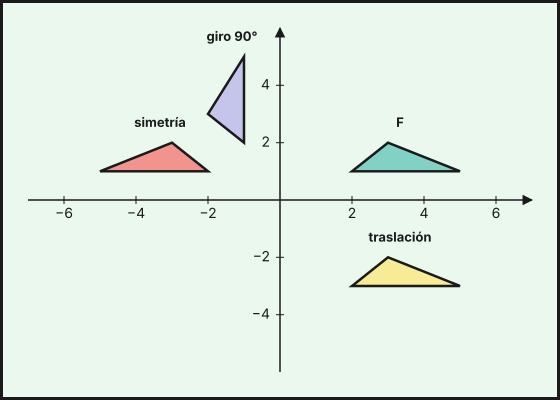
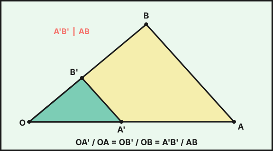

## 1. Transformaciones geométricas

Una **transformación** hace corresponder a cada punto $P$ del plano otro punto $P'$, su **imagen**. Los **movimientos** (isometrías) conservan la forma y el tamaño: longitudes, ángulos y áreas no cambian. Son la traslación, el giro y la simetría. La **semejanza** conserva la forma pero cambia el tamaño.

## 2. Traslaciones

Una **traslación** de vector $\vec v=(a,b)$ desplaza todos los puntos la misma distancia y en la misma dirección y sentido:

$$P(x,y)\longmapsto P'(x+a,\ y+b)$$

Ejemplo: la traslación de vector $\vec v=(3,-2)$ lleva $A(1,4)$ a $A'(4,2)$ y $B(-2,0)$ a $B'(1,-2)$. Todos los puntos y la figura completa se mueven igual, sin girar.

## 3. Giros

Un **giro** de centro $O$ y ángulo $\alpha$ hace girar cada punto un ángulo $\alpha$ alrededor de $O$ (en sentido contrario a las agujas del reloj si $\alpha>0$). Cumple $OP=OP'$.

Con centro en el origen:

| Giro | $P(x,y)\longmapsto P'$ |
|---|---|
| $90^\circ$ | $(-y,\ x)$ |
| $180^\circ$ | $(-x,\ -y)$ |
| $270^\circ$ | $(y,\ -x)$ |

Ejemplo: al girar $P(3,1)$ un ángulo de $90^\circ$ alrededor del origen resulta $P'(-1,3)$. El giro de $180^\circ$ se llama **simetría central**.

Una figura tiene **simetría de rotación** si coincide consigo misma al girarla un cierto ángulo. Un cuadrado, con $90^\circ$; un triángulo equilátero, con $120^\circ$; una estrella de cinco puntas, con $72^\circ$.

## 4. Simetrías axiales

La **simetría axial** respecto de una recta $e$ (eje) lleva cada punto $P$ a $P'$ de modo que $e$ es la **mediatriz** del segmento $PP'$.

- Respecto del eje $OX$: $(x,y)\longmapsto(x,-y)$.
- Respecto del eje $OY$: $(x,y)\longmapsto(-x,y)$.
- Respecto de la recta $y=x$: $(x,y)\longmapsto(y,x)$.

Ejemplo: el simétrico de $P(2,5)$ respecto del eje $OY$ es $P'(-2,5)$.

{fig-alt="Un triángulo en el plano cartesiano con tres imágenes: trasladado, simétrico respecto del eje vertical y girado noventa grados" width="70%" fig-align="center"}

::: {.callout-note}
## Mosaicos y arte andalusí
Los **mosaicos** de la Alhambra de Granada y de la Mezquita de Córdoba se construyen repitiendo una pieza mediante traslaciones, giros y simetrías. Sus patrones se clasifican según los movimientos que los dejan invariantes (los 17 **grupos de simetría** del plano), y los de la Alhambra son un ejemplo clásico para estudiarlos.
:::

## 5. Teorema de Tales y semejanza

**Teorema de Tales**: si dos rectas se cortan por rectas paralelas, los segmentos que determinan son proporcionales.

$$\frac{OA}{OA'}=\frac{OB}{OB'}=\frac{AB}{A'B'}$$

{fig-alt="Un triángulo grande y, dentro, otro triángulo pequeño con un lado paralelo al lado opuesto del grande" width="70%" fig-align="center"}

Ejemplo: una persona de $1{,}8$ m proyecta una sombra de $1{,}2$ m. En ese mismo momento, un árbol de altura $x$ proyecta una sombra de $7{,}2$ m: $\dfrac{x}{1{,}8}=\dfrac{7{,}2}{1{,}2}\Rightarrow x=10{,}8$ m.

Dos figuras son **semejantes** si tienen los ángulos iguales y los lados proporcionales. La razón entre lados correspondientes es la **razón de semejanza** $k$.

- Los **ángulos** no cambian.
- Las **longitudes** (lados, perímetros) se multiplican por $k$.
- Las **áreas** se multiplican por $k^2$.
- Los **volúmenes** se multiplican por $k^3$.

Ejemplo: dos triángulos semejantes con $k=3$. Si el pequeño tiene perímetro $12$ cm y área $10$ cm², el grande tiene perímetro $36$ cm y área $90$ cm².

### Criterios de semejanza de triángulos

Dos triángulos son semejantes si:

1. Tienen **dos ángulos** iguales.
2. Tienen los **tres lados** proporcionales.
3. Tienen **dos lados proporcionales** y el ángulo comprendido igual.

### Triángulos en posición de Tales y rectángulos

Dentro de un triángulo rectángulo con altura sobre la hipotenusa aparecen triángulos semejantes que dan el **teorema del cateto** ($a^2=c\cdot m$) y el **teorema de la altura** ($h^2=m\cdot n$).

## 6. Escalas

Una **escala** $1:E$ es la razón de semejanza entre el dibujo y la realidad. En un plano a escala $1:200$, un salón de $3{,}5$ cm por $2$ cm mide en la realidad $7$ m por $4$ m, y su superficie real es $7\cdot4=28$ m².

::: {.callout-warning}
## Áreas y volúmenes no escalan igual
Si las longitudes se multiplican por $k$, las áreas lo hacen por $k^2$ y los volúmenes por $k^3$. Una maqueta a escala $1:50$ tiene $\frac{1}{2\,500}$ del área y $\frac{1}{125\,000}$ del volumen.
:::

::: {.callout-note}
## GeoGebra
GeoGebra tiene las herramientas **Traslación**, **Rotación** y **Reflexión**: dibuja un polígono, aplícale cada movimiento y comprueba que longitudes y ángulos no cambian. Con **Homotecia** puedes comprobar cómo cambian las áreas con la razón de semejanza.
:::

::: {.callout-tip}
## Resumen rápido
- Movimientos: traslación $(x+a,y+b)$, giro, simetría. No cambian forma ni tamaño.
- Giro de $90^\circ$: $(x,y)\to(-y,x)$. Simetría respecto de $OY$: $(x,y)\to(-x,y)$.
- Semejanza de razón $k$: longitudes $\times k$, áreas $\times k^2$, volúmenes $\times k^3$.
- Tales: paralelas $\Rightarrow$ segmentos proporcionales.
:::

<!-- objetivos -->
## Debes saber hacer

- Aplicar una traslación, un giro o una simetría a un punto o a una figura y escribir sus coordenadas.
- Reconocer los movimientos y las simetrías en mosaicos y en el arte andalusí.
- Aplicar el teorema de Tales y los criterios de semejanza de triángulos.
- Usar escalas y la razón de semejanza: las longitudes se multiplican por $k$, las áreas por $k^2$ y los volúmenes por $k^3$.

::: {.callout-note collapse="true"}
## Saberes básicos del currículo
Saberes de la Orden de 30 de mayo de 2023 (BOJA nº 104) que se trabajan en este tema: MAT.3.C.3, MAT.3.C.1.2, MAT.3.C.4.2, MAT.3.F.3.3.
:::
