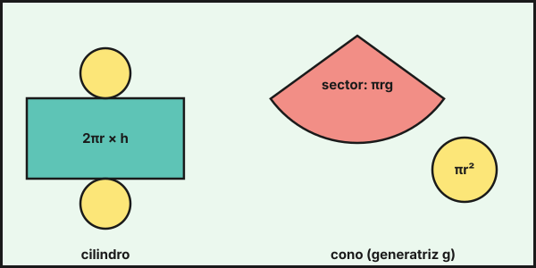

## 1. Poliedros

Un **poliedro** es un cuerpo limitado por polígonos llamados **caras**. Los lados de las caras son las **aristas** y los puntos donde se unen varias aristas, los **vértices**.

**Relación de Euler** (poliedros convexos): $C+V=A+2$. Un cubo tiene $6+8=12+2$.

### Poliedros regulares

Tienen todas las caras iguales y regulares. Solo hay cinco, los **sólidos platónicos**:

| Poliedro | Caras | Vértices | Aristas |
|---|---|---|---|
| Tetraedro | 4 triángulos | 4 | 6 |
| Cubo (hexaedro) | 6 cuadrados | 8 | 12 |
| Octaedro | 8 triángulos | 6 | 12 |
| Dodecaedro | 12 pentágonos | 20 | 30 |
| Icosaedro | 20 triángulos | 12 | 30 |

### Prismas y pirámides

- **Prisma**: dos bases iguales y paralelas y caras laterales que son paralelogramos (rectángulos en el prisma recto).
- **Pirámide**: una base poligonal y caras laterales triangulares que se unen en el **vértice**.

## 2. Áreas y volúmenes de poliedros

**Prisma recto** (base de área $A_b$ y perímetro $P_b$, altura $h$):

$$A_L=P_b\cdot h\qquad A_T=A_L+2A_b\qquad V=A_b\cdot h$$

**Pirámide regular** (apotema de la pirámide $a_p$):

$$A_L=\frac{P_b\cdot a_p}{2}\qquad A_T=A_L+A_b\qquad V=\frac13A_b\cdot h$$

La apotema $a_p$ de la pirámide, la altura $h$ y la apotema de la base $a_b$ forman un triángulo rectángulo: $a_p^2=h^2+a_b^2$.

Ejemplos:

- **Ortoedro** de $4\times3\times5$ cm: $V=60$ cm³, $A_T=2(12+20+15)=94$ cm², diagonal $d=\sqrt{4^2+3^2+5^2}=\sqrt{50}\approx7{,}07$ cm.
- **Pirámide regular** de base cuadrada de lado $6$ y altura $4$: $a_p=\sqrt{4^2+3^2}=5$; $A_L=\dfrac{24\cdot5}{2}=60$, $A_T=96$ y $V=\dfrac13\cdot36\cdot4=48$.

## 3. Cuerpos de revolución

Se generan al girar una figura plana alrededor de un eje.

| Cuerpo | Generado por | $A_L$ | $A_T$ | $V$ |
|---|---|---|---|---|
| **Cilindro** (radio $r$, altura $h$) | un rectángulo | $2\pi rh$ | $2\pi r(h+r)$ | $\pi r^2h$ |
| **Cono** (generatriz $g$) | un triángulo rectángulo | $\pi rg$ | $\pi r(g+r)$ | $\dfrac13\pi r^2h$ |
| **Esfera** (radio $r$) | un semicírculo | | $4\pi r^2$ | $\dfrac43\pi r^3$ |

En el cono, $g^2=r^2+h^2$.

Ejemplos:

- **Lata** (cilindro) de $r=3$ cm y $h=10$ cm: $V=90\pi\approx282{,}74$ cm³ $\approx0{,}28$ litros; $A_T=78\pi\approx245{,}04$ cm².
- **Cono** de $r=3$ y $h=4$: $g=5$, $A_T=24\pi\approx75{,}40$ y $V=12\pi\approx37{,}70$.
- **Esfera** de radio $5$ cm: $A=100\pi\approx314{,}16$ cm² y $V=\dfrac{500\pi}{3}\approx523{,}60$ cm³.

{fig-alt="Desarrollo plano de un cilindro formado por un rectángulo y dos círculos, y de un cono con un sector circular y un círculo" width="85%" fig-align="center"}

::: {.callout-note}
## Capacidad
$1$ dm³ $=1$ litro. Y $1$ m³ $=1\,000$ L, $1$ cm³ $=1$ mL. Una piscina de $8\times4\times1{,}5$ m tiene $48$ m³ $=48\,000$ L.
:::

## 4. Secciones, planos de simetría y coordenadas geográficas

- Una **sección plana** es la figura que resulta al cortar un cuerpo con un plano. Un cilindro cortado por un plano paralelo a la base da un círculo, y por un plano que contiene al eje, un rectángulo. Una esfera siempre da un círculo.
- Los cuerpos tienen **planos de simetría**: un cubo tiene 9 y un cilindro, infinitos que contienen al eje.
- En la esfera terrestre, un punto se localiza con la **longitud** (meridianos, de $0^\circ$ a $180^\circ$ al este u oeste del de Greenwich) y la **latitud** (paralelos, de $0^\circ$ a $90^\circ$ al norte o sur del ecuador).

## 5. Semejanza de cuerpos

Si dos cuerpos son semejantes con razón $k$, sus áreas están en razón $k^2$ y sus volúmenes en razón $k^3$. Un cono con la mitad de altura y de radio ($k=\frac12$) tiene $\frac14$ del área y $\frac18$ del volumen.

::: {.callout-warning}
## Unidades de volumen
Un volumen se mide en unidades **cúbicas**. Pasa todas las medidas a la misma unidad antes de calcular, y recuerda que $1$ m³ $=1\,000$ dm³ y $1$ dm³ $=1\,000$ cm³.
:::

::: {.callout-tip}
## Resumen rápido
- Euler: $C+V=A+2$.
- Prisma: $V=A_b\,h$. Pirámide y cono: $V=\frac13A_b\,h$.
- Cilindro: $V=\pi r^2h$. Esfera: $V=\frac43\pi r^3$ y $A=4\pi r^2$.
- Cono: $g^2=r^2+h^2$. Pirámide: $a_p^2=h^2+a_b^2$.
:::

<!-- objetivos -->
## Debes saber hacer

- Reconocer prismas, pirámides, cilindros, conos y esferas, y comprobar la relación de Euler.
- Calcular áreas laterales y totales de los cuerpos geométricos.
- Calcular volúmenes y pasarlos a capacidades (litros).
- Resolver problemas de la vida real con cuerpos geométricos.

::: {.callout-note collapse="true"}
## Saberes básicos del currículo
Saberes de la Orden de 30 de mayo de 2023 (BOJA nº 104) que se trabajan en este tema: MAT.3.B.2.1, MAT.3.B.2.2, MAT.3.C.1.1, MAT.3.B.1.
:::
