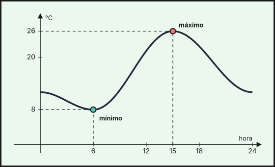

## 1. Concepto de función

Una **función** relaciona dos magnitudes de modo que a cada valor de la **variable independiente** $x$ le corresponde **un único** valor de la **variable dependiente** $y=f(x)$.

Se puede describir de cuatro maneras:

- **Enunciado**: "cada kilo de naranjas cuesta 1,80 €".
- **Tabla de valores**.
- **Expresión algebraica** (fórmula): $y=1{,}8\,x$.
- **Gráfica**: puntos $(x,y)$ en unos ejes de coordenadas.

| $x$ (kg) | 0 | 1 | 2 | 3 |
|---|---|---|---|---|
| $y$ (€) | 0 | 1,8 | 3,6 | 5,4 |

::: {.callout-note}
## ¿Es una función?
Una gráfica es de una función si **cualquier recta vertical la corta como mucho en un punto**. Una circunferencia no es la gráfica de una función: sus rectas verticales la cortan en dos puntos.
:::

## 2. Dominio y recorrido

- **Dominio**: valores de $x$ para los que la función está definida.
- **Recorrido** (imagen): valores de $y$ que toma.

Ejemplos:

- $f(x)=\dfrac{1}{x-2}$ no existe en $x=2$: dominio $\mathbb{R}\setminus\{2\}$.
- $f(x)=\sqrt{x-3}$ exige $x-3\geq0$: dominio $[3,+\infty)$ y recorrido $[0,+\infty)$.
- $f(x)=x^2$: dominio $\mathbb{R}$ y recorrido $[0,+\infty)$.

## 3. Características de una función

Se estudian sobre la gráfica:

| Característica | Qué es |
|---|---|
| **Puntos de corte** | con el eje $OX$ ($y=0$, los ceros) y con el eje $OY$ ($x=0$) |
| **Crecimiento** | crece si al aumentar $x$ aumenta $y$; decrece si disminuye; es constante si no cambia |
| **Máximo / mínimo relativo** | punto más alto / bajo en su entorno |
| **Continuidad** | se dibuja sin levantar el lápiz; si no, tiene **discontinuidades** (saltos, huecos, asíntotas) |
| **Simetría** | **par** si $f(-x)=f(x)$ (simétrica respecto del eje $OY$); **impar** si $f(-x)=-f(x)$ (simétrica respecto del origen) |
| **Periodicidad** | se repite cada cierto intervalo |
| **Tendencia** | a qué valor se acerca cuando $x$ crece mucho |

Ejemplo: $f(x)=x^2-4$. Cortes con $OX$: $x^2=4$, es decir, $x=\pm2$. Corte con $OY$: $f(0)=-4$. Es par. Decrece en $(-\infty,0)$, crece en $(0,+\infty)$ y tiene un **mínimo** en $(0,-4)$.

## 4. Tasa de variación

La **tasa de variación media** (T.V.M.) de $f$ en $[a,b]$ mide cuánto cambia $y$ por cada unidad que cambia $x$:

$$\text{T.V.M.}[a,b]=\frac{f(b)-f(a)}{b-a}$$

Si es positiva, la función crece de media en el intervalo; si es negativa, decrece. Para $f(x)=x^2$ en $[1,3]$: $\dfrac{9-1}{3-1}=4$. Para una recta, la T.V.M. es siempre la **pendiente**.

## 5. Interpretar gráficas

Ejemplo: la gráfica muestra la temperatura (en °C) de una ciudad a lo largo de un día.

{fig-alt="Gráfica de temperatura en función de la hora: baja hasta las 6 de la mañana, sube hasta las 15 horas y vuelve a bajar" width="75%" fig-align="center"}

- La temperatura **mínima** es de $8\,^\circ$C a las 6 h y la **máxima** de $26\,^\circ$C a las 15 h.
- Crece entre las 6 h y las 15 h y decrece de 0 a 6 h y de 15 a 24 h.
- La T.V.M. entre las 6 h y las 15 h es $\dfrac{26-8}{15-6}=2$ °C por hora.

::: {.callout-warning}
## Escalas de los ejes
Al leer una gráfica fíjate en la **escala** y en las **unidades** de los ejes. Una misma función parece más o menos pendiente según cómo se dibuje.
:::

::: {.callout-tip}
## Resumen rápido
- Función: a cada $x$ le corresponde un único $y$.
- Dominio: valores de $x$ posibles. Recorrido: valores de $y$ obtenidos.
- Cortes: $y=0$ con $OX$ y $x=0$ con $OY$.
- T.V.M.$[a,b]=\frac{f(b)-f(a)}{b-a}$.
:::

<!-- objetivos -->
## Debes saber hacer

- Reconocer si una correspondencia es una función y expresarla con tabla, fórmula o gráfica.
- Calcular el dominio y el recorrido de funciones sencillas.
- Hallar puntos de corte, crecimiento, extremos y simetría en una gráfica.
- Calcular e interpretar la tasa de variación media.
- Interpretar gráficas de situaciones reales.

::: {.callout-note collapse="true"}
## Saberes básicos del currículo
Saberes de la Orden de 30 de mayo de 2023 (BOJA nº 104) que se trabajan en este tema: MAT.3.D.5.1, MAT.3.D.5.3, MAT.3.D.3.
:::
