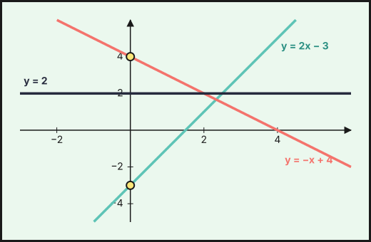
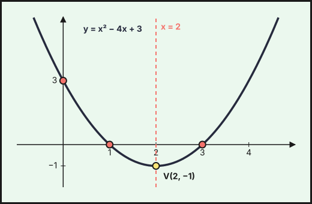

## 1. Función de proporcionalidad directa

$y=mx$ relaciona magnitudes directamente proporcionales. Su gráfica es una **recta que pasa por el origen**. La constante $m$ es la **pendiente**.

Ejemplo: un taxi cobra $1{,}20$ € por kilómetro: $y=1{,}2\,x$.

## 2. Función afín (lineal)

$$y=mx+n$$

- $m$ es la **pendiente**: cuánto sube (o baja) $y$ cuando $x$ aumenta una unidad.
- $n$ es la **ordenada en el origen**: el valor de $y$ cuando $x=0$ (corte con el eje $OY$).

| Pendiente | La recta es |
|---|---|
| $m>0$ | creciente |
| $m<0$ | decreciente |
| $m=0$ | horizontal ($y=n$, función constante) |

Para dibujarla basta una tabla con **dos puntos**. Para $y=2x-3$: si $x=0$, $y=-3$; si $x=2$, $y=1$.

{fig-alt="Tres rectas en el plano: una creciente que corta al eje vertical en menos tres, una decreciente que lo corta en cuatro y una horizontal en dos" width="70%" fig-align="center"}

### Ecuación de la recta

- Dada la **pendiente** $m$ y un punto $(x_0,y_0)$: $\ y-y_0=m(x-x_0)$.
- Dados **dos puntos** $(x_1,y_1)$ y $(x_2,y_2)$: $\ m=\dfrac{y_2-y_1}{x_2-x_1}$ y se sustituye uno de los puntos.
- Puntos de corte: con $OX$ se hace $y=0$; con $OY$, $x=0$.

Ejemplo: la recta por $A(1,3)$ y $B(3,9)$ tiene $m=\dfrac{9-3}{3-1}=3$, y $y-3=3(x-1)$, es decir, $y=3x$.

### Rectas paralelas y secantes

Dos rectas $y=m_1x+n_1$ e $y=m_2x+n_2$ son **paralelas** si $m_1=m_2$ y se **cortan** si $m_1\neq m_2$. El punto de corte se halla resolviendo el sistema. Ejemplo: $y=2x-3$ e $y=-x+4$ se cortan en $2x-3=-x+4\Rightarrow x=\frac73$, $y=\frac53$.

### Problemas

Ejemplo: una tarifa de móvil cuesta $12$ € fijos más $0{,}05$ € por minuto: $C(x)=12+0{,}05x$. Con $240$ minutos se pagan $24$ €. Otra tarifa cuesta $0{,}10$ € por minuto sin cuota: $D(x)=0{,}1x$. Las dos cuestan lo mismo si $12+0{,}05x=0{,}1x$, es decir, con $x=240$ minutos. A partir de ahí conviene la primera.

## 3. Función cuadrática

$$y=ax^2+bx+c\qquad(a\neq0)$$

Su gráfica es una **parábola**.

- Si $a>0$, está abierta hacia **arriba** (tiene un mínimo); si $a<0$, hacia **abajo** (tiene un máximo).
- El **vértice** está en $x_v=-\dfrac{b}{2a}$, y es el punto de mayor o menor valor. Su ordenada es $y_v=f(x_v)$.
- El **eje de simetría** es la recta vertical $x=x_v$.
- **Cortes con $OX$**: soluciones de $ax^2+bx+c=0$ (ninguno, uno o dos, según el discriminante).
- **Corte con $OY$**: $(0,c)$.

Ejemplo: $y=x^2-4x+3$. Vértice: $x_v=\dfrac{4}{2}=2$, $y_v=4-8+3=-1$, o sea $V(2,-1)$ (mínimo). Cortes con $OX$: $x^2-4x+3=0\Rightarrow x=1$ y $x=3$. Corte con $OY$: $(0,3)$. La función decrece en $(-\infty,2)$ y crece en $(2,+\infty)$.

{fig-alt="Parábola abierta hacia arriba con vértice en dos menos uno, cortes con el eje horizontal en uno y tres y con el vertical en tres" width="65%" fig-align="center"}

### Para dibujar una parábola

1. Calcula el vértice.
2. Calcula los cortes con los ejes.
3. Haz una tabla con algunos valores a ambos lados del vértice (la parábola es simétrica).
4. Une los puntos con una curva suave.

### Problemas de máximos y mínimos

Ejemplo: se lanza una pelota y su altura (m) es $h(t)=-5t^2+20t$ a los $t$ segundos. El máximo está en $t_v=\dfrac{-20}{2\cdot(-5)}=2$ s y vale $h(2)=-20+40=20$ m. Vuelve al suelo cuando $h=0$: $t=0$ o $t=4$ s.

::: {.callout-warning}
## Comprueba el contexto
Una solución puede no tener sentido: un tiempo no puede ser negativo, ni una longitud. Examina el dominio antes de dar el resultado.
:::

## 4. Comparar representaciones

Una misma relación puede darse por **enunciado**, **tabla**, **fórmula** o **gráfica**. Hay que saber pasar de una a otra:

- Una tabla es **lineal** si, al aumentar $x$ en pasos iguales, $y$ aumenta también en cantidades iguales.
- Una tabla es **cuadrática** si las diferencias de $y$ no son constantes pero las segundas diferencias sí lo son.

Ejemplo: con $y=x^2$ y $x=0,1,2,3,4$ se tiene $y=0,1,4,9,16$; las primeras diferencias son $1,3,5,7$ y las segundas, $2,2,2$.

::: {.callout-tip}
## Resumen rápido
- Recta: $y=mx+n$ (pendiente $m$, ordenada $n$). Paralelas: misma pendiente.
- Parábola: $y=ax^2+bx+c$; vértice en $x=-\frac{b}{2a}$.
- $a>0$: mínimo. $a<0$: máximo.
- Cortes: con $OX$, $y=0$; con $OY$, $x=0$.
:::
