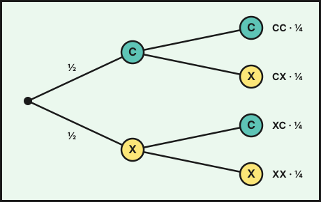

## 1. Experimentos aleatorios

Un fenómeno es **determinista** si se puede predecir su resultado (soltar una piedra, calentar agua a $100\,^\circ$C) y **aleatorio** si no (lanzar un dado, sacar una carta). Un **experimento aleatorio** puede repetirse en las mismas condiciones y su resultado depende del azar.

- **Espacio muestral** $E$: conjunto de todos los resultados posibles. En un dado, $E=\{1,2,3,4,5,6\}$.
- **Suceso**: subconjunto de $E$. "Sacar par" es $\{2,4,6\}$.
- **Suceso elemental**: un solo resultado. **Seguro**: es todo $E$. **Imposible**: $\emptyset$.
- **Suceso contrario** de $A$ ($A^C$): ocurre cuando no ocurre $A$.
- **Unión** $A\cup B$: ocurre $A$ o $B$ (o ambos). **Intersección** $A\cap B$: ocurren los dos. Dos sucesos son **incompatibles** si $A\cap B=\emptyset$.

## 2. Frecuencia relativa y probabilidad

Si repetimos un experimento $N$ veces y el suceso $A$ ocurre $f$ veces, su **frecuencia relativa** es $h=\dfrac{f}{N}$. Al aumentar $N$, la frecuencia relativa se estabiliza alrededor de un número: la **probabilidad** de $A$, $P(A)$ (**ley de los grandes números**).

Ejemplo: al lanzar una chincheta $500$ veces cae con la punta hacia arriba $185$ veces, luego $P(\text{punta arriba})\approx\dfrac{185}{500}=0{,}37$.

## 3. Regla de Laplace

Si todos los resultados elementales son **equiprobables**:

$$P(A)=\frac{\text{casos favorables}}{\text{casos posibles}}$$

Ejemplos:

- Dado: $P(\text{par})=\dfrac36=\dfrac12$ y $P(\text{múltiplo de }3)=\dfrac26=\dfrac13$.
- Baraja española ($40$ cartas): $P(\text{as})=\dfrac4{40}=\dfrac1{10}$ y $P(\text{oros})=\dfrac{10}{40}=\dfrac14$.
- Dos monedas: $E=\{CC,CX,XC,XX\}$ y $P(\text{una cara y una cruz})=\dfrac24=\dfrac12$.

::: {.callout-warning}
## Equiprobabilidad
Laplace solo vale si todos los casos son **igual de probables**. Con dos dados, la suma $7$ es más probable que la suma $2$, porque hay $6$ parejas que suman $7$ y solo $1$ que suma $2$.
:::

## 4. Propiedades de la probabilidad

- $0\leq P(A)\leq1$, con $P(\emptyset)=0$ y $P(E)=1$.
- **Suceso contrario**: $P(A^C)=1-P(A)$.
- **Unión**: $P(A\cup B)=P(A)+P(B)-P(A\cap B)$. Si son incompatibles, $P(A\cup B)=P(A)+P(B)$.

Ejemplo: en un dado, $A=\text{par}$, $B=\text{mayor que }4$: $P(A\cup B)=\dfrac36+\dfrac26-\dfrac16=\dfrac46=\dfrac23$ (la intersección es $\{6\}$).

## 5. Técnicas de recuento

Para contar casos posibles sin escribirlos todos:

- **Diagrama en árbol**: cada rama es una etapa del experimento.
- **Tabla de doble entrada**.
- **Principio de multiplicación**: si una elección tiene $m$ posibilidades y otra, $n$, juntas hay $m\cdot n$.

Ejemplo: un menú se compone de $3$ primeros y $4$ segundos: hay $3\cdot4=12$ menús distintos. Con $3$ cifras que pueden repetirse tomadas de $\{1,2,3,4,5\}$ se forman $5^3=125$ números; sin repetir, $5\cdot4\cdot3=60$.

{fig-alt="Un árbol con dos niveles; cada nivel tiene las ramas cara y cruz, dando los cuatro resultados cara-cara, cara-cruz, cruz-cara y cruz-cruz" width="55%" fig-align="center"}

### Experimentos compuestos

La probabilidad de un resultado de un experimento compuesto de **etapas independientes** es el producto de las probabilidades de cada rama. Si se lanza dos veces una moneda, $P(CC)=\dfrac12\cdot\dfrac12=\dfrac14$. En una bolsa con $3$ bolas rojas y $2$ azules, sacando $2$ con reemplazamiento, $P(\text{roja y roja})=\dfrac35\cdot\dfrac35=\dfrac9{25}$; **sin reemplazamiento** (la segunda extracción cambia), $P=\dfrac35\cdot\dfrac24=\dfrac3{10}$.

::: {.callout-tip}
## Resumen rápido
- Laplace: $P(A)=\frac{\text{favorables}}{\text{posibles}}$ (solo si son equiprobables).
- $P(A^C)=1-P(A)$ y $P(A\cup B)=P(A)+P(B)-P(A\cap B)$.
- Árbol: se multiplican las probabilidades a lo largo de las ramas.
- Con muchas repeticiones, la frecuencia relativa se acerca a la probabilidad.
:::
