Ejercicios de **Matemáticas Aplicadas a las Ciencias Sociales II** de la prueba de acceso a la universidad en Andalucía (PAU, antes PEvAU) de **2021 a 2026** cuyo tema principal es *programación lineal*: **34 ejercicios** de convocatorias ordinarias y extraordinarias y de sus reservas o suplentes. Repasa antes la [teoría](../../../apuntes/2-bachillerato-ccss/03-programacion-lineal/index.qmd), los [ejercicios del tema](../03-programacion-lineal/index.qmd) y las [actividades interactivas](../../../actividades/2-bachillerato-ccss/03-programacion-lineal/index.qmd).

Debajo de cada ejercicio hay tres desplegables, de menos a más ayuda: **Ayuda 1 · Recordatorio** (la teoría que necesitas, sin tocar los datos), **Ayuda 2 · Método** (los pasos a seguir) y la **resolución breve** con el resultado. Inténtalo con la menor ayuda posible.

## 2026

### Ordinaria 2026

::::: {.ebau-ej #ebau-2026-ord-1B}
**Ejercicio 1B** · Ordinaria 2026 · Bloque A · *(3 puntos)* · [Examen](../../../assets/pau-ccss/2026-ord/examen.pdf){target="_blank"}

Una empresa maderera fabrica tableros de dos tipos, DM y aglomerado, a partir de madera triturada. Para producir $1\ \text{m}^{2}$ de tablero DM se consumen $10\ \text{m}^{3}$ de madera triturada y se obtiene un beneficio de 10 €. Para producir $1\ \text{m}^{2}$ de tablero aglomerado se consumen $30\ \text{m}^{3}$ de madera triturada y se obtiene un beneficio de 20 €. La empresa puede fabricar diariamente como máximo $12\ \text{m}^{2}$ de tableros DM y $18\ \text{m}^{2}$ de tableros de aglomerado. Además, la capacidad total de la empresa limita la producción conjunta a $26\ \text{m}^{2}$ diarios y dispone de $600\ \text{m}^{3}$ de madera triturada al día. Determine cuántos metros cuadrados de cada tipo de tablero deben producirse diariamente para maximizar el beneficio total y calcule cuál es ese beneficio.

:::: {.callout-note collapse="true" appearance="simple"}
## Ayuda 1 · Recordatorio

**Programación lineal: planteamiento.**

Programación lineal: se optimiza una **función objetivo** $F(x,y)$ sujeta a **restricciones** lineales (desigualdades). Las condiciones de no negatividad $x\ge0,\ y\ge0$ suelen estar implícitas en el contexto.

**Programación lineal: región factible y óptimo.**

La región factible es la intersección de los semiplanos de las restricciones. Si está acotada, el óptimo de $F$ se alcanza en un **vértice** (o en todo un lado si la recta de nivel es paralela a él).
::::

:::: {.callout-note collapse="true" appearance="simple"}
## Ayuda 2 · Método

**Programación lineal: planteamiento.**

1. Define $x$ e $y$ (cantidad de cada producto, con unidades).
2. Escribe una desigualdad por cada limitación («como máximo» $\le$, «al menos» $\ge$) y la función objetivo (beneficio, coste, número de unidades…).
3. Ordena los datos en una tabla (recursos por unidad de producto) para no confundir coeficientes.

**Programación lineal: región factible y óptimo.**

1. Dibuja cada recta (dos puntos) y sombrea el semiplano que cumple la desigualdad probando el punto $(0,0)$.
2. Marca la región común y halla los vértices resolviendo los sistemas de dos rectas que se cortan en ellos.
3. Evalúa $F$ en cada vértice y elige el mayor (máximo) o el menor (mínimo).
4. Responde con el contexto: valores de $x$ e $y$, valor óptimo y, si lo piden, recursos sobrantes.
::::

:::: {.callout-tip collapse="true" appearance="simple"}
## Solución

Sean $x$ los m$^2$ de tablero DM e $y$ los de aglomerado. Restricciones: $x\le12$; $y\le18$; $x+y\le26$; madera $10x+30y\le600\iff x+3y\le60$; $x\ge0$, $y\ge0$. Beneficio: $B(x,y)=10x+20y$.

Vértices: $(0,0)$, $(0,18)$, $(6,18)$ (corte de $y=18$ con $x+3y=60$), $(9,17)$ (corte de $x+y=26$ con $x+3y=60$), $(12,14)$ (corte de $x=12$ con $x+y=26$) y $(12,0)$.

| Vértice | $(0,0)$ | $(0,18)$ | $(6,18)$ | $(9,17)$ | $(12,14)$ | $(12,0)$ |
|---|---|---|---|---|---|---|
| $B$ | $0$ | $360$ | $420$ | $430$ | $400$ | $120$ |

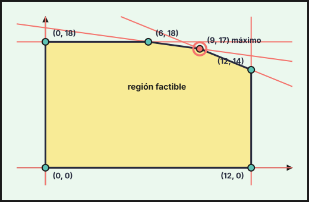{fig-alt="Región factible del ejercicio 1B (2026-ord), con sus vértices: (0, 0), (12, 0), (12, 14), (9, 17), (6, 18), (0, 18)" width="75%" fig-align="center"}

**Deben producirse $9$ m$^2$ de tablero DM y $17$ m$^2$ de aglomerado, con un beneficio máximo de $430$ €.**
::::
:::::

### Ordinaria · Suplente 1 2026

::::: {.ebau-ej #ebau-2026-ord-sup1-1}
**Ejercicio 1** · Ordinaria · Suplente 1 2026 · Bloque A · *(3 puntos)* · [Examen](../../../assets/pau-ccss/2026-ord-sup1/examen.pdf){target="_blank"}

Una empresa fabrica dos productos, $P_1$ y $P_2$, a partir de tres recursos productivos: mano de obra, energía y capital. La disponibilidad anual de energía y de capital son $3\,500$ unidades y $1\,300$ unidades respectivamente. Para poder optar a una ayuda del gobierno para el fomento del empleo, la empresa va a contratar, al menos, $4\,200$ horas anuales. Cada unidad de $P_1$ necesita para su fabricación 10 horas de mano de obra, 10 unidades de energía y 5 unidades de capital; siendo el precio de cada unidad de $P_1$ 800 euros. Cada unidad de $P_2$ necesita para su fabricación 20 horas de mano de obra y 5 unidades de energía; vendiéndose a 400 euros la unidad de $P_2$.

La empresa vende todo lo que produce y quiere maximizar sus ingresos anuales por la venta de los dos productos.

a) ¿Cuántas unidades de cada producto han de fabricarse anualmente para maximizar los ingresos? ¿Cuál es dicho ingreso óptimo? *(2,5 puntos)*

b) ¿Es posible alcanzar el máximo elaborando un único producto? *(0,5 puntos)*

:::: {.callout-note collapse="true" appearance="simple"}
## Ayuda 1 · Recordatorio

**Programación lineal: planteamiento.**

Programación lineal: se optimiza una **función objetivo** $F(x,y)$ sujeta a **restricciones** lineales (desigualdades). Las condiciones de no negatividad $x\ge0,\ y\ge0$ suelen estar implícitas en el contexto.

**Programación lineal: región factible y óptimo.**

La región factible es la intersección de los semiplanos de las restricciones. Si está acotada, el óptimo de $F$ se alcanza en un **vértice** (o en todo un lado si la recta de nivel es paralela a él).
::::

:::: {.callout-note collapse="true" appearance="simple"}
## Ayuda 2 · Método

**Programación lineal: planteamiento.**

1. Define $x$ e $y$ (cantidad de cada producto, con unidades).
2. Escribe una desigualdad por cada limitación («como máximo» $\le$, «al menos» $\ge$) y la función objetivo (beneficio, coste, número de unidades…).
3. Ordena los datos en una tabla (recursos por unidad de producto) para no confundir coeficientes.

**Programación lineal: región factible y óptimo.**

1. Dibuja cada recta (dos puntos) y sombrea el semiplano que cumple la desigualdad probando el punto $(0,0)$.
2. Marca la región común y halla los vértices resolviendo los sistemas de dos rectas que se cortan en ellos.
3. Evalúa $F$ en cada vértice y elige el mayor (máximo) o el menor (mínimo).
4. Responde con el contexto: valores de $x$ e $y$, valor óptimo y, si lo piden, recursos sobrantes.
::::

:::: {.callout-tip collapse="true" appearance="simple"}
## Solución

**a)** Sean $x$ las unidades de $P_1$ e $y$ las de $P_2$. Restricciones: energía $10x+5y\le3\,500\iff2x+y\le700$; capital $5x\le1\,300\iff x\le260$; mano de obra (ayuda) $10x+20y\ge4\,200\iff x+2y\ge420$; $x\ge0$, $y\ge0$. Ingresos: $I(x,y)=800x+400y$.

Vértices: $(0,210)$ (corte de $x=0$ con $x+2y=420$), $(0,700)$ (corte de $x=0$ con $2x+y=700$), $(260,180)$ (corte de $x=260$ con $2x+y=700$) y $(260,80)$ (corte de $x=260$ con $x+2y=420$).

| Vértice | $(0,210)$ | $(0,700)$ | $(260,180)$ | $(260,80)$ |
|---|---|---|---|---|
| $I$ | $84\,000$ | $280\,000$ | $280\,000$ | $240\,000$ |

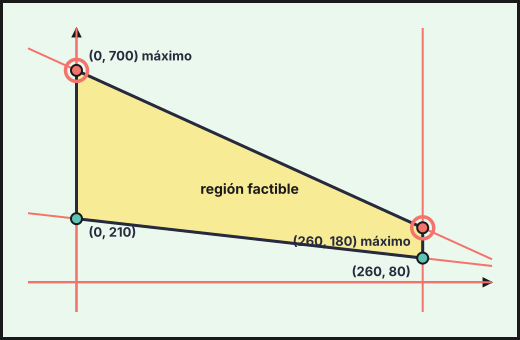{fig-alt="Región factible del ejercicio 1 (2026-ord-sup1), con sus vértices: (0, 210), (260, 80), (260, 180), (0, 700)" width="75%" fig-align="center"}

El máximo se alcanza en dos vértices, $(0,700)$ y $(260,180)$, porque $I=400(2x+y)$ y la recta de la energía $2x+y=700$ es paralela a las rectas de nivel: **el ingreso óptimo es de $280\,000$ € y se alcanza en todos los puntos del segmento que une $(0,700)$ y $(260,180)$** (por ejemplo, $260$ unidades de $P_1$ y $180$ de $P_2$, o $0$ de $P_1$ y $700$ de $P_2$).

**b)** **Sí:** fabricando solo $P_2$, $700$ unidades, se agota la energía ($5\cdot700=3\,500$), se cumplen las horas ($20\cdot700=14\,000\ge4\,200$) y el ingreso es $400\cdot700=280\,000$ €. (Fabricando solo $P_1$ no es posible: como mucho $260$ unidades y $208\,000$ €.)
::::
:::::

### Ordinaria · Suplente 2 2026

::::: {.ebau-ej #ebau-2026-ord-sup2-1B}
**Ejercicio 1B** · Ordinaria · Suplente 2 2026 · Bloque A · *(3 puntos)* · [Examen](../../../assets/pau-ccss/2026-ord-sup2/examen.pdf){target="_blank"}

Se considera la función $f(x,y)=2x+y$ cuando $(x,y)$ pertenece a la región factible delimitada por las inecuaciones:
$$4x+2y\ge5;\qquad2x+5y\le9;\qquad x+y\le3;\qquad y\ge0$$

a) Dibuje la región factible y obtenga sus vértices. *(1,5 puntos)*

b) Obtenga algún punto de la región factible con abscisa $x=1$. *(0,5 puntos)*

c) ¿Para qué valores de $x$ e $y$ se alcanza el máximo de la función $f$? ¿Cuánto vale dicho máximo? Análogamente para el mínimo. *(1 punto)*

:::: {.callout-note collapse="true" appearance="simple"}
## Ayuda 1 · Recordatorio

La región factible es la intersección de los semiplanos de las restricciones. Si está acotada, el óptimo de $F$ se alcanza en un **vértice** (o en todo un lado si la recta de nivel es paralela a él).
::::

:::: {.callout-note collapse="true" appearance="simple"}
## Ayuda 2 · Método

1. Dibuja cada recta (dos puntos) y sombrea el semiplano que cumple la desigualdad probando el punto $(0,0)$.
2. Marca la región común y halla los vértices resolviendo los sistemas de dos rectas que se cortan en ellos.
3. Evalúa $F$ en cada vértice y elige el mayor (máximo) o el menor (mínimo).
4. Responde con el contexto: valores de $x$ e $y$, valor óptimo y, si lo piden, recursos sobrantes.
::::

:::: {.callout-tip collapse="true" appearance="simple"}
## Solución

**a)** Rectas frontera: $4x+2y=5$, $2x+5y=9$, $x+y=3$ e $y=0$. Los vértices de la región factible son
$$\left(\tfrac{7}{16},\tfrac{13}{8}\right),\quad\left(\tfrac{5}{4},0\right),\quad(3,0),\quad(2,1),$$
con $\left(\tfrac{7}{16},\tfrac{13}{8}\right)$ el corte de $4x+2y=5$ con $2x+5y=9$, $\left(\tfrac{5}{4},0\right)$ el de $4x+2y=5$ con $y=0$, $(3,0)$ el de $x+y=3$ con $y=0$ y $(2,1)$ el de $x+y=3$ con $2x+5y=9$.

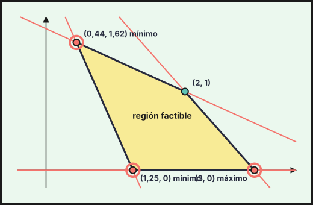{fig-alt="Región factible del ejercicio 1B (2026-ord-sup2), con sus vértices: (1,25, 0), (3, 0), (2, 1), (0,44, 1,62)" width="75%" fig-align="center"}

**b)** Con $x=1$: $4+2y\ge5\Rightarrow y\ge\dfrac{1}{2}$; $2+5y\le9\Rightarrow y\le\dfrac{7}{5}$; $1+y\le3\Rightarrow y\le2$. Por ejemplo, **$(1,1)$** pertenece a la región ($6\ge5$, $7\le9$, $2\le3$).

**c)** $f\left(\tfrac{7}{16},\tfrac{13}{8}\right)=\tfrac{5}{2}$, $f\left(\tfrac{5}{4},0\right)=\tfrac{5}{2}$, $f(3,0)=6$ y $f(2,1)=5$.

**Máximo $6$, en el punto $(3,0)$. Mínimo $\dfrac{5}{2}$, que se alcanza en $\left(\tfrac{7}{16},\tfrac{13}{8}\right)$ y en $\left(\tfrac{5}{4},0\right)$ y, por tanto, en todo el segmento que los une** ($f=2x+y$ es paralela a la recta $4x+2y=5$).
::::
:::::

### Extraordinaria · Suplente 1 2026

::::: {.ebau-ej #ebau-2026-ext-sup1-1}
**Ejercicio 1** · Extraordinaria · Suplente 1 2026 · Bloque A · *(3 puntos)* · [Examen](../../../assets/pau-ccss/2026-ext-sup1/examen.pdf){target="_blank"}

Una empresa comercializa dos especias a granel: orégano y pimienta. Para elaborar un kilo de orégano se requieren 2 horas de secado y 2 horas de envasado, mientras que para elaborar un kilo de pimienta se requieren 1 hora de secado y 5 horas de envasado. La empresa dispone de un horno para secado que funciona 24 horas al día de lunes a viernes. Para el envasado hay 4 empleados que trabajan 40 horas a la semana como máximo cada uno. La empresa tiene el compromiso contractual de producir a la semana al menos 35 kilogramos contabilizando ambas especies. El precio de venta del orégano es de 50 € el kilogramo y el de la pimienta es de 70 € el kilogramo. Sabiendo que el coste de producción de cada kilogramo de orégano y pimienta es de 5 € y 7 € respectivamente, ¿cuántos kilogramos de cada especie deben producirse semanalmente para obtener el máximo beneficio? ¿Cuál sería dicho beneficio?

:::: {.callout-note collapse="true" appearance="simple"}
## Ayuda 1 · Recordatorio

**Programación lineal: planteamiento.**

Programación lineal: se optimiza una **función objetivo** $F(x,y)$ sujeta a **restricciones** lineales (desigualdades). Las condiciones de no negatividad $x\ge0,\ y\ge0$ suelen estar implícitas en el contexto.

**Programación lineal: región factible y óptimo.**

La región factible es la intersección de los semiplanos de las restricciones. Si está acotada, el óptimo de $F$ se alcanza en un **vértice** (o en todo un lado si la recta de nivel es paralela a él).
::::

:::: {.callout-note collapse="true" appearance="simple"}
## Ayuda 2 · Método

**Programación lineal: planteamiento.**

1. Define $x$ e $y$ (cantidad de cada producto, con unidades).
2. Escribe una desigualdad por cada limitación («como máximo» $\le$, «al menos» $\ge$) y la función objetivo (beneficio, coste, número de unidades…).
3. Ordena los datos en una tabla (recursos por unidad de producto) para no confundir coeficientes.

**Programación lineal: región factible y óptimo.**

1. Dibuja cada recta (dos puntos) y sombrea el semiplano que cumple la desigualdad probando el punto $(0,0)$.
2. Marca la región común y halla los vértices resolviendo los sistemas de dos rectas que se cortan en ellos.
3. Evalúa $F$ en cada vértice y elige el mayor (máximo) o el menor (mínimo).
4. Responde con el contexto: valores de $x$ e $y$, valor óptimo y, si lo piden, recursos sobrantes.
::::

:::: {.callout-tip collapse="true" appearance="simple"}
## Solución

Sean $x$ los kg de orégano e $y$ los de pimienta por semana. Horno: $24\cdot5=120$ h. Envasado: $4\cdot40=160$ h. Restricciones: secado $2x+y\le120$; envasado $2x+5y\le160$; producción mínima $x+y\ge35$; $x\ge0$, $y\ge0$. Beneficio por kg: orégano $50-5=45$ €, pimienta $70-7=63$ €: $B(x,y)=45x+63y$.

Vértices: $(5,30)$ (corte de $x+y=35$ con $2x+5y=160$), $(35,0)$ (corte de $x+y=35$ con $y=0$), $(60,0)$ (corte de $2x+y=120$ con $y=0$) y $(55,10)$ (corte de $2x+y=120$ con $2x+5y=160$).

| Vértice | $(5,30)$ | $(35,0)$ | $(60,0)$ | $(55,10)$ |
|---|---|---|---|---|
| $B$ | $2\,115$ | $1\,575$ | $2\,700$ | $3\,105$ |

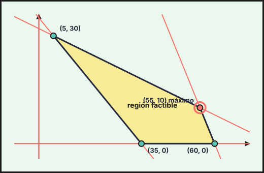{fig-alt="Región factible del ejercicio 1 (2026-ext-sup1), con sus vértices: (35, 0), (60, 0), (55, 10), (5, 30)" width="75%" fig-align="center"}

**Deben producirse 55 kg de orégano y 10 kg de pimienta a la semana, con un beneficio máximo de $3\,105$ €.**
::::
:::::

### Extraordinaria · Suplente 2 2026

::::: {.ebau-ej #ebau-2026-ext-sup2-1B}
**Ejercicio 1B** · Extraordinaria · Suplente 2 2026 · Bloque A · *(3 puntos)* · [Examen](../../../assets/pau-ccss/2026-ext-sup2/examen.pdf){target="_blank"}

Consideremos el recinto definido por las siguientes inecuaciones:
$$3x-4y\le6;\qquad x+y\le9;\qquad x+4y\le24;\qquad3x+2y\ge6;\qquad x\ge0$$

a) Represente gráficamente el recinto y calcule sus vértices. *(1,75 puntos)*

b) Indique razonadamente si los puntos $P(3;\,0{,}9)$ y $Q(1;\,5{,}9)$ pertenecen al recinto. *(0,5 puntos)*

c) Obtenga el valor máximo y mínimo de la función objetivo $F(x,y)=2x+3y-2$ en el recinto anterior, así como los puntos donde se alcanzan. *(0,75 puntos)*

:::: {.callout-note collapse="true" appearance="simple"}
## Ayuda 1 · Recordatorio

La región factible es la intersección de los semiplanos de las restricciones. Si está acotada, el óptimo de $F$ se alcanza en un **vértice** (o en todo un lado si la recta de nivel es paralela a él).
::::

:::: {.callout-note collapse="true" appearance="simple"}
## Ayuda 2 · Método

1. Dibuja cada recta (dos puntos) y sombrea el semiplano que cumple la desigualdad probando el punto $(0,0)$.
2. Marca la región común y halla los vértices resolviendo los sistemas de dos rectas que se cortan en ellos.
3. Evalúa $F$ en cada vértice y elige el mayor (máximo) o el menor (mínimo).
4. Responde con el contexto: valores de $x$ e $y$, valor óptimo y, si lo piden, recursos sobrantes.
::::

:::: {.callout-tip collapse="true" appearance="simple"}
## Solución

**a)** Rectas frontera: $3x-4y=6$, $x+y=9$, $x+4y=24$, $3x+2y=6$ y $x=0$. Los vértices del recinto son
$$(0,3),\quad(0,6),\quad(2,0),\quad(4,5),\quad(6,3),$$
donde $(0,3)$ es el corte de $x=0$ con $3x+2y=6$, $(0,6)$ el de $x=0$ con $x+4y=24$, $(4,5)$ el de $x+4y=24$ con $x+y=9$, $(6,3)$ el de $x+y=9$ con $3x-4y=6$ y $(2,0)$ el de $3x-4y=6$ con $3x+2y=6$.

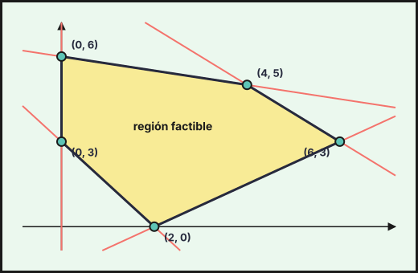{fig-alt="Región factible del ejercicio 1B (2026-ext-sup2), con sus vértices: (0, 3), (2, 0), (6, 3), (4, 5), (0, 6)" width="75%" fig-align="center"}

**b)** $P(3;0{,}9)$: $3\cdot3-4\cdot0{,}9=5{,}4\le6$; $3+0{,}9=3{,}9\le9$; $3+4\cdot0{,}9=6{,}6\le24$; $3\cdot3+2\cdot0{,}9=10{,}8\ge6$; $3\ge0$. **$P$ pertenece al recinto.**

$Q(1;5{,}9)$: $1+4\cdot5{,}9=24{,}6>24$, no cumple $x+4y\le24$. **$Q$ no pertenece al recinto.**

**c)** $F(0,3)=7$, $F(0,6)=16$, $F(2,0)=2$, $F(4,5)=21$, $F(6,3)=19$.

**Máximo $21$ en el punto $(4,5)$ y mínimo $2$ en el punto $(2,0)$.**
::::
:::::

## 2025

### Ordinaria · Modelo B 2025

::::: {.ebau-ej #ebau-2025-ord-b-2}
**Ejercicio 2** · Ordinaria · Modelo B 2025 · Bloque B · *(2,5 puntos)* · [Examen](../../../assets/pau-ccss/2025-ord-b/examen.pdf){target="_blank"}

Un agricultor cultiva dos tipos de lechuga: iceberg y romana. Por razones de demanda, en cada ciclo de cultivo, la cantidad de iceberg debe ser al menos la mitad de la de romana, pero no puede superar las 1500 unidades. Además, deben cultivarse en total entre 900 y 2400 lechugas. El cultivo de iceberg requiere 15 litros de agua por unidad, mientras que el de romana necesita 18 litros de agua por unidad. ¿Cuántas unidades de cada tipo de lechuga deben cultivarse para minimizar el consumo total de agua?

:::: {.callout-note collapse="true" appearance="simple"}
## Ayuda 1 · Recordatorio

**Programación lineal: planteamiento.**

Programación lineal: se optimiza una **función objetivo** $F(x,y)$ sujeta a **restricciones** lineales (desigualdades). Las condiciones de no negatividad $x\ge0,\ y\ge0$ suelen estar implícitas en el contexto.

**Programación lineal: región factible y óptimo.**

La región factible es la intersección de los semiplanos de las restricciones. Si está acotada, el óptimo de $F$ se alcanza en un **vértice** (o en todo un lado si la recta de nivel es paralela a él).
::::

:::: {.callout-note collapse="true" appearance="simple"}
## Ayuda 2 · Método

**Programación lineal: planteamiento.**

1. Define $x$ e $y$ (cantidad de cada producto, con unidades).
2. Escribe una desigualdad por cada limitación («como máximo» $\le$, «al menos» $\ge$) y la función objetivo (beneficio, coste, número de unidades…).
3. Ordena los datos en una tabla (recursos por unidad de producto) para no confundir coeficientes.

**Programación lineal: región factible y óptimo.**

1. Dibuja cada recta (dos puntos) y sombrea el semiplano que cumple la desigualdad probando el punto $(0,0)$.
2. Marca la región común y halla los vértices resolviendo los sistemas de dos rectas que se cortan en ellos.
3. Evalúa $F$ en cada vértice y elige el mayor (máximo) o el menor (mínimo).
4. Responde con el contexto: valores de $x$ e $y$, valor óptimo y, si lo piden, recursos sobrantes.
::::

:::: {.callout-tip collapse="true" appearance="simple"}
## Solución

Sean $x$ las unidades de iceberg e $y$ las de romana. Restricciones: $x\ge\dfrac y2$ (iceberg al menos la mitad que romana); $x\le1\,500$; $900\le x+y\le2\,400$; $y\ge0$. Consumo de agua (litros): $W(x,y)=15x+18y$.

Vértices: $(300,600)$ (corte de $y=2x$ con $x+y=900$), $(800,1600)$ (corte de $y=2x$ con $x+y=2\,400$), $(1\,500,900)$ (corte de $x=1\,500$ con $x+y=2\,400$), $(1\,500,0)$ y $(900,0)$.

| Vértice | $(300,600)$ | $(800,1\,600)$ | $(1\,500,900)$ | $(1\,500,0)$ | $(900,0)$ |
|---|---|---|---|---|---|
| $W$ | $15\,300$ | $40\,800$ | $38\,700$ | $22\,500$ | $13\,500$ |

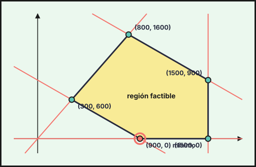{fig-alt="Región factible del ejercicio 2 (2025-ord-b), con sus vértices: (300, 600), (900, 0), (1500, 0), (1500, 900), (800, 1600)" width="75%" fig-align="center"}

**El consumo mínimo, $13\,500$ litros, se obtiene cultivando $900$ lechugas iceberg y ninguna romana.**
::::
:::::

### Ordinaria · Suplente 1 · Modelo A 2025

::::: {.ebau-ej #ebau-2025-ord-sup1-a-2}
**Ejercicio 2** · Ordinaria · Suplente 1 · Modelo A 2025 · Bloque A · *(2,5 puntos)* · [Examen](../../../assets/pau-ccss/2025-ord-sup1-a/examen.pdf){target="_blank"}

Una empresa de catering dispone semanalmente de 58 horas de cocina, 50 horas de empaquetado y $60\ \text{dm}^{3}$ de almacenamiento en cámaras frigoríficas para elaborar dos tipos de menús: *premium* y *estándar*. Ambos menús requieren tiempo, tanto de preparación como de empaquetado, y espacio de almacenamiento en frigoríficos. Concretamente, el menú *premium* requiere de 2 horas de cocina, 2 horas de empaquetado y ocupa $1\ \text{dm}^{3}$ en frigoríficos. Por su parte, el menú *estándar* requiere de 3 horas de cocina, 1 hora de empaquetado y ocupa $4\ \text{dm}^{3}$ en frigoríficos. El beneficio obtenido por cada menú *premium* es de $10{,}50$ € y por cada menú *estándar* es de $5{,}50$ €. La empresa sabe que venderá todos los menús producidos. Determine cuántos menús de cada tipo deben elaborarse semanalmente para maximizar el beneficio total y a cuánto asciende este beneficio.

:::: {.callout-note collapse="true" appearance="simple"}
## Ayuda 1 · Recordatorio

**Programación lineal: planteamiento.**

Programación lineal: se optimiza una **función objetivo** $F(x,y)$ sujeta a **restricciones** lineales (desigualdades). Las condiciones de no negatividad $x\ge0,\ y\ge0$ suelen estar implícitas en el contexto.

**Programación lineal: región factible y óptimo.**

La región factible es la intersección de los semiplanos de las restricciones. Si está acotada, el óptimo de $F$ se alcanza en un **vértice** (o en todo un lado si la recta de nivel es paralela a él).
::::

:::: {.callout-note collapse="true" appearance="simple"}
## Ayuda 2 · Método

**Programación lineal: planteamiento.**

1. Define $x$ e $y$ (cantidad de cada producto, con unidades).
2. Escribe una desigualdad por cada limitación («como máximo» $\le$, «al menos» $\ge$) y la función objetivo (beneficio, coste, número de unidades…).
3. Ordena los datos en una tabla (recursos por unidad de producto) para no confundir coeficientes.

**Programación lineal: región factible y óptimo.**

1. Dibuja cada recta (dos puntos) y sombrea el semiplano que cumple la desigualdad probando el punto $(0,0)$.
2. Marca la región común y halla los vértices resolviendo los sistemas de dos rectas que se cortan en ellos.
3. Evalúa $F$ en cada vértice y elige el mayor (máximo) o el menor (mínimo).
4. Responde con el contexto: valores de $x$ e $y$, valor óptimo y, si lo piden, recursos sobrantes.
::::

:::: {.callout-tip collapse="true" appearance="simple"}
## Solución

Sean $x$ los menús *premium* e $y$ los *estándar*. Restricciones: cocina $2x+3y\le58$; empaquetado $2x+y\le50$; almacenamiento $x+4y\le60$; $x\ge0$, $y\ge0$. Beneficio: $B(x,y)=10{,}5x+5{,}5y$.

Vértices: $(0,0)$, $(0,15)$, $\left(\dfrac{52}{5},\dfrac{62}{5}\right)$ (corte de $x+4y=60$ con $2x+3y=58$), $(23,4)$ (corte de $2x+3y=58$ con $2x+y=50$) y $(25,0)$.

| Vértice | $(0,0)$ | $(0,15)$ | $\left(\frac{52}{5},\frac{62}{5}\right)$ | $(23,4)$ | $(25,0)$ |
|---|---|---|---|---|---|
| $B$ | $0$ | $82{,}5$ | $177{,}4$ | $263{,}5$ | $262{,}5$ |

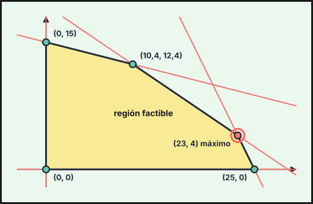{fig-alt="Región factible del ejercicio 2 (2025-ord-sup1-a), con sus vértices: (0, 0), (25, 0), (23, 4), (10,4, 12,4), (0, 15)" width="75%" fig-align="center"}

**Deben elaborarse 23 menús *premium* y 4 *estándar*, con un beneficio máximo de $263{,}50$ €.** (Almacenamiento usado: $23+16=39\le60$.)
::::
:::::

### Ordinaria · Suplente 1 · Modelo B 2025

::::: {.ebau-ej #ebau-2025-ord-sup1-b-2}
**Ejercicio 2** · Ordinaria · Suplente 1 · Modelo B 2025 · Bloque A · *(2,5 puntos)* · [Examen](../../../assets/pau-ccss/2025-ord-sup1-b/examen.pdf){target="_blank"}

Una agricultora vende en su tienda *online* frutas y hortalizas envasándolas en cajas de dos tipos diferentes. La caja «El regalo de la tierra» la vende a $19{,}75$ € y contiene 3 kg de frutas y $3{,}5$ kg de hortalizas. La caja «El tesoro de la huerta» contiene 2 kg de frutas y 4 kg de hortalizas y la vende a $18{,}50$ €. La agricultora dispone semanalmente de 210 kg de hortalizas y 150 kg de frutas. Debe vender al menos 12 cajas de «El regalo de la tierra» y no menos de 15 cajas de «El tesoro de la huerta». ¿Cuántas cajas de cada tipo debe vender a la semana para que el ingreso por la venta sea máximo? ¿A cuánto asciende este ingreso?

:::: {.callout-note collapse="true" appearance="simple"}
## Ayuda 1 · Recordatorio

**Programación lineal: planteamiento.**

Programación lineal: se optimiza una **función objetivo** $F(x,y)$ sujeta a **restricciones** lineales (desigualdades). Las condiciones de no negatividad $x\ge0,\ y\ge0$ suelen estar implícitas en el contexto.

**Programación lineal: región factible y óptimo.**

La región factible es la intersección de los semiplanos de las restricciones. Si está acotada, el óptimo de $F$ se alcanza en un **vértice** (o en todo un lado si la recta de nivel es paralela a él).
::::

:::: {.callout-note collapse="true" appearance="simple"}
## Ayuda 2 · Método

**Programación lineal: planteamiento.**

1. Define $x$ e $y$ (cantidad de cada producto, con unidades).
2. Escribe una desigualdad por cada limitación («como máximo» $\le$, «al menos» $\ge$) y la función objetivo (beneficio, coste, número de unidades…).
3. Ordena los datos en una tabla (recursos por unidad de producto) para no confundir coeficientes.

**Programación lineal: región factible y óptimo.**

1. Dibuja cada recta (dos puntos) y sombrea el semiplano que cumple la desigualdad probando el punto $(0,0)$.
2. Marca la región común y halla los vértices resolviendo los sistemas de dos rectas que se cortan en ellos.
3. Evalúa $F$ en cada vértice y elige el mayor (máximo) o el menor (mínimo).
4. Responde con el contexto: valores de $x$ e $y$, valor óptimo y, si lo piden, recursos sobrantes.
::::

:::: {.callout-tip collapse="true" appearance="simple"}
## Solución

Sean $x$ las cajas «El regalo de la tierra» e $y$ las de «El tesoro de la huerta». Restricciones: frutas $3x+2y\le150$; hortalizas $3{,}5x+4y\le210$; $x\ge12$; $y\ge15$. Ingreso: $I(x,y)=19{,}75x+18{,}5y$.

Vértices: $(12,15)$, $(12,42)$ (corte de $x=12$ con $3{,}5x+4y=210$), $(36,21)$ (corte de $3x+2y=150$ con $3{,}5x+4y=210$) y $(40,15)$ (corte de $3x+2y=150$ con $y=15$).

| Vértice | $(12,15)$ | $(12,42)$ | $(36,21)$ | $(40,15)$ |
|---|---|---|---|---|
| $I$ | $514{,}5$ | $1\,014$ | $1\,099{,}5$ | $1\,067{,}5$ |

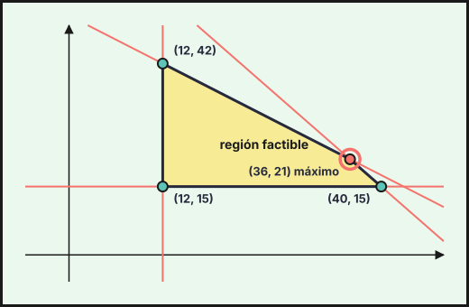{fig-alt="Región factible del ejercicio 2 (2025-ord-sup1-b), con sus vértices: (12, 15), (40, 15), (36, 21), (12, 42)" width="75%" fig-align="center"}

**Debe vender 36 cajas de «El regalo de la tierra» y 21 de «El tesoro de la huerta», con un ingreso máximo de $1\,099{,}50$ €.**
::::
:::::

### Ordinaria · Suplente 2 · Modelo A 2025

::::: {.ebau-ej #ebau-2025-ord-sup2-a-2}
**Ejercicio 2** · Ordinaria · Suplente 2 · Modelo A 2025 · Bloque A · *(2,5 puntos)* · [Examen](../../../assets/pau-ccss/2025-ord-sup2-a/examen.pdf){target="_blank"}

Un servicio técnico recibe un encargo para revisar lavadoras y frigoríficos de una empresa de apartahoteles. La revisión de cada lavadora requiere 100 minutos de trabajo, mientras que cada frigorífico requiere 50 minutos. El servicio técnico dispone de 26 horas y 40 minutos para hacer las revisiones. Por política de empresa, no se aceptan encargos de más de 12 lavadoras ni de más de 16 frigoríficos. Sabiendo que las revisiones se pagan a 50 € la hora, en ambos tipos de electrodomésticos, ¿cuántos electrodomésticos de cada clase debe revisar el servicio técnico para maximizar el ingreso con el encargo? ¿A cuánto asciende este ingreso máximo?

:::: {.callout-note collapse="true" appearance="simple"}
## Ayuda 1 · Recordatorio

**Programación lineal: planteamiento.**

Programación lineal: se optimiza una **función objetivo** $F(x,y)$ sujeta a **restricciones** lineales (desigualdades). Las condiciones de no negatividad $x\ge0,\ y\ge0$ suelen estar implícitas en el contexto.

**Programación lineal: región factible y óptimo.**

La región factible es la intersección de los semiplanos de las restricciones. Si está acotada, el óptimo de $F$ se alcanza en un **vértice** (o en todo un lado si la recta de nivel es paralela a él).
::::

:::: {.callout-note collapse="true" appearance="simple"}
## Ayuda 2 · Método

**Programación lineal: planteamiento.**

1. Define $x$ e $y$ (cantidad de cada producto, con unidades).
2. Escribe una desigualdad por cada limitación («como máximo» $\le$, «al menos» $\ge$) y la función objetivo (beneficio, coste, número de unidades…).
3. Ordena los datos en una tabla (recursos por unidad de producto) para no confundir coeficientes.

**Programación lineal: región factible y óptimo.**

1. Dibuja cada recta (dos puntos) y sombrea el semiplano que cumple la desigualdad probando el punto $(0,0)$.
2. Marca la región común y halla los vértices resolviendo los sistemas de dos rectas que se cortan en ellos.
3. Evalúa $F$ en cada vértice y elige el mayor (máximo) o el menor (mínimo).
4. Responde con el contexto: valores de $x$ e $y$, valor óptimo y, si lo piden, recursos sobrantes.
::::

:::: {.callout-tip collapse="true" appearance="simple"}
## Solución

Sean $x$ las lavadoras e $y$ los frigoríficos. El tiempo disponible es $26\ \text{h}\ 40\ \text{min}=1\,600$ min. Restricciones: $100x+50y\le1\,600\iff2x+y\le32$; $x\le12$; $y\le16$; $x\ge0$, $y\ge0$. Como se paga a $50$ €/h $=\dfrac{5}{6}$ €/min, el ingreso es $I(x,y)=\dfrac{5}{6}\left(100x+50y\right)=\dfrac{250}{3}x+\dfrac{125}{3}y$.

Vértices: $(0,0)$, $(12,0)$, $(12,8)$, $(8,16)$ y $(0,16)$.

| Vértice | $(0,0)$ | $(12,0)$ | $(12,8)$ | $(8,16)$ | $(0,16)$ |
|---|---|---|---|---|---|
| $I$ | $0$ | $1\,000$ | $1\,333{,}33$ | $1\,333{,}33$ | $666{,}67$ |

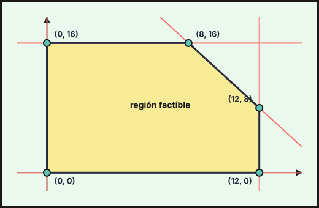{fig-alt="Región factible del ejercicio 2 (2025-ord-sup2-a), con sus vértices: (0, 0), (12, 0), (12, 8), (8, 16), (0, 16)" width="75%" fig-align="center"}

El máximo se alcanza en los dos vértices $(12,8)$ y $(8,16)$ y, por tanto, en todos los puntos del segmento $2x+y=32$ que los une (aquellos en que se agotan los $1\,600$ minutos).

**Ingreso máximo: $1\,333{,}33$ € (es decir, $\dfrac{4\,000}{3}$ €), por ejemplo revisando 12 lavadoras y 8 frigoríficos, u 8 lavadoras y 16 frigoríficos** (o cualquier combinación entera con $2x+y=32$, $8\le x\le12$: $(11,10)$, $(10,12)$, $(9,14)$).
::::
:::::

### Ordinaria · Suplente 2 · Modelo B 2025

::::: {.ebau-ej #ebau-2025-ord-sup2-b-2}
**Ejercicio 2** · Ordinaria · Suplente 2 · Modelo B 2025 · Bloque A · *(2,5 puntos)* · [Examen](../../../assets/pau-ccss/2025-ord-sup2-b/examen.pdf){target="_blank"}

Un fabricante produce mensualmente dos tipos de abonos ecológicos, $A$ y $B$, que vende en su totalidad, obteniendo unos beneficios de 15 y 10 euros por kilogramo (kg), respectivamente. La producción de abono del tipo $A$ no puede superar los 200 kg; el doble de la producción de $B$ menos el triple de la producción de $A$ es a lo sumo 100 kg. Además, la producción de $A$ más el doble de la producción de $B$ es como mucho de 500 kg. Obtenga las cantidades que este fabricante debe producir de sendos abonos para obtener el máximo beneficio e indique el valor de este beneficio.

:::: {.callout-note collapse="true" appearance="simple"}
## Ayuda 1 · Recordatorio

**Programación lineal: planteamiento.**

Programación lineal: se optimiza una **función objetivo** $F(x,y)$ sujeta a **restricciones** lineales (desigualdades). Las condiciones de no negatividad $x\ge0,\ y\ge0$ suelen estar implícitas en el contexto.

**Programación lineal: región factible y óptimo.**

La región factible es la intersección de los semiplanos de las restricciones. Si está acotada, el óptimo de $F$ se alcanza en un **vértice** (o en todo un lado si la recta de nivel es paralela a él).
::::

:::: {.callout-note collapse="true" appearance="simple"}
## Ayuda 2 · Método

**Programación lineal: planteamiento.**

1. Define $x$ e $y$ (cantidad de cada producto, con unidades).
2. Escribe una desigualdad por cada limitación («como máximo» $\le$, «al menos» $\ge$) y la función objetivo (beneficio, coste, número de unidades…).
3. Ordena los datos en una tabla (recursos por unidad de producto) para no confundir coeficientes.

**Programación lineal: región factible y óptimo.**

1. Dibuja cada recta (dos puntos) y sombrea el semiplano que cumple la desigualdad probando el punto $(0,0)$.
2. Marca la región común y halla los vértices resolviendo los sistemas de dos rectas que se cortan en ellos.
3. Evalúa $F$ en cada vértice y elige el mayor (máximo) o el menor (mínimo).
4. Responde con el contexto: valores de $x$ e $y$, valor óptimo y, si lo piden, recursos sobrantes.
::::

:::: {.callout-tip collapse="true" appearance="simple"}
## Solución

Sean $x$ los kg de abono $A$ e $y$ los de $B$. Restricciones: $x\le200$; $2y-3x\le100$; $x+2y\le500$; $x\ge0$, $y\ge0$. Beneficio: $B(x,y)=15x+10y$.

Vértices: $(0,0)$, $(0,50)$, $(100,200)$ (corte de $2y-3x=100$ con $x+2y=500$), $(200,150)$ (corte de $x=200$ con $x+2y=500$) y $(200,0)$.

| Vértice | $(0,0)$ | $(0,50)$ | $(100,200)$ | $(200,150)$ | $(200,0)$ |
|---|---|---|---|---|---|
| $B$ | $0$ | $500$ | $3\,500$ | $4\,500$ | $3\,000$ |

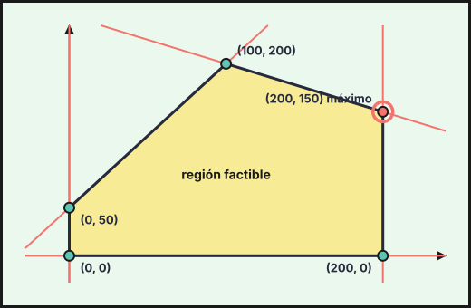{fig-alt="Región factible del ejercicio 2 (2025-ord-sup2-b), con sus vértices: (0, 50), (0, 0), (200, 0), (200, 150), (100, 200)" width="75%" fig-align="center"}

**Debe producir $200$ kg de abono $A$ y $150$ kg de abono $B$, con un beneficio máximo de $4\,500$ €.**
::::
:::::

## 2024

### Ordinaria · Modelo A 2024

::::: {.ebau-ej #ebau-2024-ord-a-2}
**Ejercicio 2** · Ordinaria · Modelo A 2024 · Bloque A · *(2,5 puntos)* · [Examen](../../../assets/pau-ccss/2024-ord-a/examen.pdf){target="_blank"}

Un agricultor posee una finca con un olivar intensivo de secano y desea transformar una parte de la misma en regadío, pero manteniendo un mínimo de 20 hectáreas de cultivo de secano. Para ello, anualmente dispone de $30\,000\ \text{m}^{3}$ de agua, de $5\,500$ kg de abono y de $3\,000$ kg de productos fitosanitarios. Cada hectárea de olivar de regadío necesita $1\,500\ \text{m}^{3}$ de agua, $110$ kg de abono y $80$ kg de productos fitosanitarios; mientras que cada hectárea de olivar de secano precisa de $100$ kg de abono y $50$ kg de productos fitosanitarios. Se sabe que la producción anual por hectárea es de $5\,000$ kg en secano y de $10\,000$ kg en regadío. Determine el número de hectáreas de olivar de secano y de regadío que el agricultor debe cultivar para maximizar su producción, así como la producción máxima esperada.

:::: {.callout-note collapse="true" appearance="simple"}
## Ayuda 1 · Recordatorio

**Programación lineal: planteamiento.**

Programación lineal: se optimiza una **función objetivo** $F(x,y)$ sujeta a **restricciones** lineales (desigualdades). Las condiciones de no negatividad $x\ge0,\ y\ge0$ suelen estar implícitas en el contexto.

**Programación lineal: región factible y óptimo.**

La región factible es la intersección de los semiplanos de las restricciones. Si está acotada, el óptimo de $F$ se alcanza en un **vértice** (o en todo un lado si la recta de nivel es paralela a él).
::::

:::: {.callout-note collapse="true" appearance="simple"}
## Ayuda 2 · Método

**Programación lineal: planteamiento.**

1. Define $x$ e $y$ (cantidad de cada producto, con unidades).
2. Escribe una desigualdad por cada limitación («como máximo» $\le$, «al menos» $\ge$) y la función objetivo (beneficio, coste, número de unidades…).
3. Ordena los datos en una tabla (recursos por unidad de producto) para no confundir coeficientes.

**Programación lineal: región factible y óptimo.**

1. Dibuja cada recta (dos puntos) y sombrea el semiplano que cumple la desigualdad probando el punto $(0,0)$.
2. Marca la región común y halla los vértices resolviendo los sistemas de dos rectas que se cortan en ellos.
3. Evalúa $F$ en cada vértice y elige el mayor (máximo) o el menor (mínimo).
4. Responde con el contexto: valores de $x$ e $y$, valor óptimo y, si lo piden, recursos sobrantes.
::::

:::: {.callout-tip collapse="true" appearance="simple"}
## Solución

Sean $x$ las hectáreas de secano e $y$ las de regadío. Restricciones: agua $1\,500y\le30\,000\iff y\le20$; abono $100x+110y\le5\,500$; fitosanitarios $50x+80y\le3\,000$; $x\ge20$; $y\ge0$. Producción (kg): $P(x,y)=5\,000x+10\,000y$.

Vértices: $(20,0)$, $(20,20)$, $(28,20)$ (corte de $y=20$ con $50x+80y=3\,000$), $(44,10)$ (corte de $50x+80y=3\,000$ con $100x+110y=5\,500$) y $(55,0)$.

| Vértice | $(20,0)$ | $(20,20)$ | $(28,20)$ | $(44,10)$ | $(55,0)$ |
|---|---|---|---|---|---|
| $P$ | $100\,000$ | $300\,000$ | $340\,000$ | $320\,000$ | $275\,000$ |

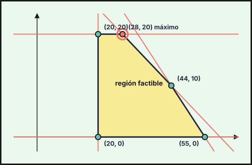{fig-alt="Región factible del ejercicio 2 (2024-ord-a), con sus vértices: (20, 0), (55, 0), (44, 10), (28, 20), (20, 20)" width="75%" fig-align="center"}

**Debe cultivar 28 hectáreas de secano y 20 de regadío, con una producción máxima de $340\,000$ kg.**
::::
:::::

### Ordinaria · Modelo B 2024

::::: {.ebau-ej #ebau-2024-ord-b-2}
**Ejercicio 2** · Ordinaria · Modelo B 2024 · Bloque A · *(2,5 puntos)* · [Examen](../../../assets/pau-ccss/2024-ord-b/examen.pdf){target="_blank"}

Una empresa tiene un presupuesto de $78\,000$ € para promocionar un producto y quiere contratar la emisión de anuncios por radio y televisión. El coste de emisión de un anuncio de radio es de $2\,400$ € y de un anuncio de televisión de $3\,600$ €. La empresa quiere que la diferencia entre el número de anuncios emitidos de cada tipo no sea mayor que 10 y que se emitan un mínimo de 10 anuncios en total. Si la emisión de un anuncio de radio llega a $34\,000$ personas y de un anuncio de televisión a $72\,000$ personas, ¿cuántas emisiones de cada tipo debe contratar para que la audiencia sea la mayor posible? ¿A cuánto ascendería dicha audiencia?

:::: {.callout-note collapse="true" appearance="simple"}
## Ayuda 1 · Recordatorio

**Programación lineal: planteamiento.**

Programación lineal: se optimiza una **función objetivo** $F(x,y)$ sujeta a **restricciones** lineales (desigualdades). Las condiciones de no negatividad $x\ge0,\ y\ge0$ suelen estar implícitas en el contexto.

**Programación lineal: región factible y óptimo.**

La región factible es la intersección de los semiplanos de las restricciones. Si está acotada, el óptimo de $F$ se alcanza en un **vértice** (o en todo un lado si la recta de nivel es paralela a él).
::::

:::: {.callout-note collapse="true" appearance="simple"}
## Ayuda 2 · Método

**Programación lineal: planteamiento.**

1. Define $x$ e $y$ (cantidad de cada producto, con unidades).
2. Escribe una desigualdad por cada limitación («como máximo» $\le$, «al menos» $\ge$) y la función objetivo (beneficio, coste, número de unidades…).
3. Ordena los datos en una tabla (recursos por unidad de producto) para no confundir coeficientes.

**Programación lineal: región factible y óptimo.**

1. Dibuja cada recta (dos puntos) y sombrea el semiplano que cumple la desigualdad probando el punto $(0,0)$.
2. Marca la región común y halla los vértices resolviendo los sistemas de dos rectas que se cortan en ellos.
3. Evalúa $F$ en cada vértice y elige el mayor (máximo) o el menor (mínimo).
4. Responde con el contexto: valores de $x$ e $y$, valor óptimo y, si lo piden, recursos sobrantes.
::::

:::: {.callout-tip collapse="true" appearance="simple"}
## Solución

Sean $x$ los anuncios de radio e $y$ los de televisión. Restricciones: presupuesto $2\,400x+3\,600y\le78\,000\iff2x+3y\le65$; diferencia $|x-y|\le10$ (es decir, $x-y\le10$ e $y-x\le10$); total $x+y\ge10$; $x\ge0$, $y\ge0$. Audiencia: $A(x,y)=34\,000x+72\,000y$.

Vértices: $(0,10)$, $(10,0)$, $(19,9)$ (corte de $x-y=10$ con $2x+3y=65$) y $(7,17)$ (corte de $y-x=10$ con $2x+3y=65$).

| Vértice | $(0,10)$ | $(10,0)$ | $(19,9)$ | $(7,17)$ |
|---|---|---|---|---|
| $A$ | $720\,000$ | $340\,000$ | $1\,294\,000$ | $1\,462\,000$ |

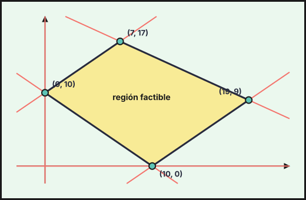{fig-alt="Región factible del ejercicio 2 (2024-ord-b), con sus vértices: (10, 0), (19, 9), (7, 17), (0, 10)" width="75%" fig-align="center"}

**Debe contratar 7 anuncios de radio y 17 de televisión, con una audiencia máxima de $1\,462\,000$ personas.**
::::
:::::

### Ordinaria · Reserva · Modelo A 2024

::::: {.ebau-ej #ebau-2024-ord-res-a-2}
**Ejercicio 2** · Ordinaria · Reserva · Modelo A 2024 · Bloque A · *(2,5 puntos)* · [Examen](../../../assets/pau-ccss/2024-ord-res-a/examen.pdf){target="_blank"}

Un centro de bricolaje, que almacena bidones de pintura de interior y de exterior, cuenta con una capacidad máxima de almacenaje de 160 bidones. Por una cuestión logística, en el almacén deben mantenerse al menos 60 bidones, siendo como mínimo 20 bidones de pintura interior. Además, el número de bidones de pintura exterior almacenados no podrá ser inferior al de pintura interior. Se sabe que el gasto diario por almacenar cada bidón de pintura interior es de $1{,}50$ € y por cada bidón de pintura exterior es de $0{,}90$ €. Calcule cuántos bidones de cada tipo se deben almacenar para que el gasto diario sea mínimo e indique cuánto supone ese gasto mínimo.

:::: {.callout-note collapse="true" appearance="simple"}
## Ayuda 1 · Recordatorio

**Programación lineal: planteamiento.**

Programación lineal: se optimiza una **función objetivo** $F(x,y)$ sujeta a **restricciones** lineales (desigualdades). Las condiciones de no negatividad $x\ge0,\ y\ge0$ suelen estar implícitas en el contexto.

**Programación lineal: región factible y óptimo.**

La región factible es la intersección de los semiplanos de las restricciones. Si está acotada, el óptimo de $F$ se alcanza en un **vértice** (o en todo un lado si la recta de nivel es paralela a él).
::::

:::: {.callout-note collapse="true" appearance="simple"}
## Ayuda 2 · Método

**Programación lineal: planteamiento.**

1. Define $x$ e $y$ (cantidad de cada producto, con unidades).
2. Escribe una desigualdad por cada limitación («como máximo» $\le$, «al menos» $\ge$) y la función objetivo (beneficio, coste, número de unidades…).
3. Ordena los datos en una tabla (recursos por unidad de producto) para no confundir coeficientes.

**Programación lineal: región factible y óptimo.**

1. Dibuja cada recta (dos puntos) y sombrea el semiplano que cumple la desigualdad probando el punto $(0,0)$.
2. Marca la región común y halla los vértices resolviendo los sistemas de dos rectas que se cortan en ellos.
3. Evalúa $F$ en cada vértice y elige el mayor (máximo) o el menor (mínimo).
4. Responde con el contexto: valores de $x$ e $y$, valor óptimo y, si lo piden, recursos sobrantes.
::::

:::: {.callout-tip collapse="true" appearance="simple"}
## Solución

Sean $x$ los bidones de pintura interior e $y$ los de exterior. Restricciones: $x+y\le160$; $x+y\ge60$; $x\ge20$; $y\ge x$. Gasto: $G(x,y)=1{,}5x+0{,}9y$.

Vértices: $(20,40)$ (corte de $x=20$ con $x+y=60$), $(20,140)$ (corte de $x=20$ con $x+y=160$), $(80,80)$ (corte de $y=x$ con $x+y=160$) y $(30,30)$ (corte de $y=x$ con $x+y=60$).

| Vértice | $(20,40)$ | $(20,140)$ | $(80,80)$ | $(30,30)$ |
|---|---|---|---|---|
| $G$ | $66$ | $156$ | $192$ | $72$ |

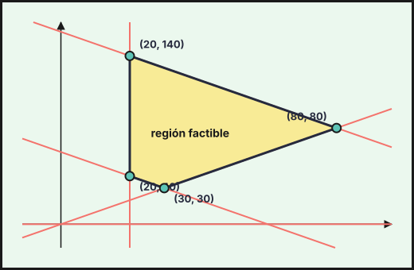{fig-alt="Región factible del ejercicio 2 (2024-ord-res-a), con sus vértices: (20, 40), (30, 30), (80, 80), (20, 140)" width="75%" fig-align="center"}

**Deben almacenarse 20 bidones de pintura interior y 40 de exterior, con un gasto diario mínimo de $66$ €.**
::::
:::::

### Ordinaria · Reserva · Modelo B 2024

::::: {.ebau-ej #ebau-2024-ord-res-b-2}
**Ejercicio 2** · Ordinaria · Reserva · Modelo B 2024 · Bloque A · *(2,5 puntos)* · [Examen](../../../assets/pau-ccss/2024-ord-res-b/examen.pdf){target="_blank"}

Un joyero desea fabricar dos tipos de pulseras, $A$ y $B$, y para ello dispone de $50$ g de oro, $40$ g de platino y $25$ g de plata. Para fabricar las del tipo $A$ necesita 1 g de oro y 2 g de platino, mientras que para las del tipo $B$ requiere 2 g de oro, 1 g de platino y 1 g de plata. Cada pulsera del tipo $A$ se vende por $150$ € y cada una del tipo $B$ por $200$ €. Si se vende toda la producción, ¿cuántas pulseras de cada tipo debe fabricar para maximizar los ingresos y a cuánto ascienden éstos? ¿Qué cantidad de cada metal sobrará cuando se fabrique el número de joyas que proporciona el máximo beneficio?

:::: {.callout-note collapse="true" appearance="simple"}
## Ayuda 1 · Recordatorio

**Programación lineal: planteamiento.**

Programación lineal: se optimiza una **función objetivo** $F(x,y)$ sujeta a **restricciones** lineales (desigualdades). Las condiciones de no negatividad $x\ge0,\ y\ge0$ suelen estar implícitas en el contexto.

**Programación lineal: región factible y óptimo.**

La región factible es la intersección de los semiplanos de las restricciones. Si está acotada, el óptimo de $F$ se alcanza en un **vértice** (o en todo un lado si la recta de nivel es paralela a él).
::::

:::: {.callout-note collapse="true" appearance="simple"}
## Ayuda 2 · Método

**Programación lineal: planteamiento.**

1. Define $x$ e $y$ (cantidad de cada producto, con unidades).
2. Escribe una desigualdad por cada limitación («como máximo» $\le$, «al menos» $\ge$) y la función objetivo (beneficio, coste, número de unidades…).
3. Ordena los datos en una tabla (recursos por unidad de producto) para no confundir coeficientes.

**Programación lineal: región factible y óptimo.**

1. Dibuja cada recta (dos puntos) y sombrea el semiplano que cumple la desigualdad probando el punto $(0,0)$.
2. Marca la región común y halla los vértices resolviendo los sistemas de dos rectas que se cortan en ellos.
3. Evalúa $F$ en cada vértice y elige el mayor (máximo) o el menor (mínimo).
4. Responde con el contexto: valores de $x$ e $y$, valor óptimo y, si lo piden, recursos sobrantes.
::::

:::: {.callout-tip collapse="true" appearance="simple"}
## Solución

Sean $x$ las pulseras de tipo $A$ e $y$ las de tipo $B$. Restricciones: oro $x+2y\le50$; platino $2x+y\le40$; plata $y\le25$; $x\ge0$, $y\ge0$. Ingresos: $I(x,y)=150x+200y$.

Vértices: $(0,0)$, $(0,25)$, $(10,20)$ (corte de $x+2y=50$ con $2x+y=40$) y $(20,0)$.

| Vértice | $(0,0)$ | $(0,25)$ | $(10,20)$ | $(20,0)$ |
|---|---|---|---|---|
| $I$ | $0$ | $5\,000$ | $5\,500$ | $3\,000$ |

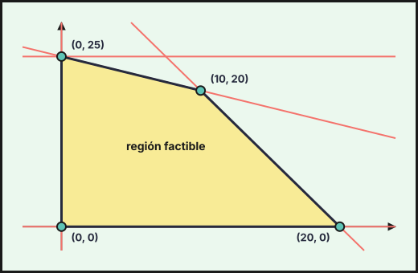{fig-alt="Región factible del ejercicio 2 (2024-ord-res-b), con sus vértices: (0, 0), (20, 0), (10, 20), (0, 25)" width="75%" fig-align="center"}

**Debe fabricar 10 pulseras del tipo $A$ y 20 del tipo $B$, con unos ingresos máximos de $5\,500$ €.**

Metales usados con $(10,20)$: oro $10+40=50$ g, platino $20+20=40$ g y plata $20$ g. **Sobran $0$ g de oro, $0$ g de platino y $5$ g de plata.**
::::
:::::

### Ordinaria · Suplente · Modelo A 2024

::::: {.ebau-ej #ebau-2024-ord-sup-a-2}
**Ejercicio 2** · Ordinaria · Suplente · Modelo A 2024 · Bloque A · *(2,5 puntos)* · [Examen](../../../assets/pau-ccss/2024-ord-sup-a/examen.pdf){target="_blank"}

A una tienda de decoración le han encargado decorar las mesas de un salón de celebraciones con centros florales y candelabros. En el salón se montan siempre entre 12 y 40 mesas. En cada mesa solo se puede colocar un centro floral o un candelabro y, además, el número de candelabros no puede ser superior a una tercera parte de los centros florales. Si el precio de cada centro floral es de 32 € y el de cada candelabro de 35 €, ¿cuántos artículos de cada tipo debe seleccionar la tienda para maximizar sus ingresos? ¿A cuánto ascenderán dichos ingresos?

:::: {.callout-note collapse="true" appearance="simple"}
## Ayuda 1 · Recordatorio

**Programación lineal: planteamiento.**

Programación lineal: se optimiza una **función objetivo** $F(x,y)$ sujeta a **restricciones** lineales (desigualdades). Las condiciones de no negatividad $x\ge0,\ y\ge0$ suelen estar implícitas en el contexto.

**Programación lineal: región factible y óptimo.**

La región factible es la intersección de los semiplanos de las restricciones. Si está acotada, el óptimo de $F$ se alcanza en un **vértice** (o en todo un lado si la recta de nivel es paralela a él).
::::

:::: {.callout-note collapse="true" appearance="simple"}
## Ayuda 2 · Método

**Programación lineal: planteamiento.**

1. Define $x$ e $y$ (cantidad de cada producto, con unidades).
2. Escribe una desigualdad por cada limitación («como máximo» $\le$, «al menos» $\ge$) y la función objetivo (beneficio, coste, número de unidades…).
3. Ordena los datos en una tabla (recursos por unidad de producto) para no confundir coeficientes.

**Programación lineal: región factible y óptimo.**

1. Dibuja cada recta (dos puntos) y sombrea el semiplano que cumple la desigualdad probando el punto $(0,0)$.
2. Marca la región común y halla los vértices resolviendo los sistemas de dos rectas que se cortan en ellos.
3. Evalúa $F$ en cada vértice y elige el mayor (máximo) o el menor (mínimo).
4. Responde con el contexto: valores de $x$ e $y$, valor óptimo y, si lo piden, recursos sobrantes.
::::

:::: {.callout-tip collapse="true" appearance="simple"}
## Solución

Sean $x$ los centros florales e $y$ los candelabros. Restricciones: $12\le x+y\le40$; $y\le\dfrac x3$; $x\ge0$, $y\ge0$. Ingresos: $I(x,y)=32x+35y$.

Vértices: $(12,0)$, $(40,0)$, $(30,10)$ (corte de $x+y=40$ con $x=3y$) y $(9,3)$ (corte de $x+y=12$ con $x=3y$).

| Vértice | $(12,0)$ | $(40,0)$ | $(30,10)$ | $(9,3)$ |
|---|---|---|---|---|
| $I$ | $384$ | $1\,280$ | $1\,310$ | $393$ |

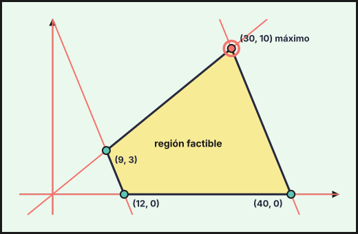{fig-alt="Región factible del ejercicio 2 (2024-ord-sup-a), con sus vértices: (9, 3), (12, 0), (40, 0), (30, 10)" width="75%" fig-align="center"}

**Debe seleccionar 30 centros florales y 10 candelabros, con unos ingresos de $1\,310$ €.**
::::
:::::

### Ordinaria · Suplente · Modelo B 2024

::::: {.ebau-ej #ebau-2024-ord-sup-b-2}
**Ejercicio 2** · Ordinaria · Suplente · Modelo B 2024 · Bloque A · *(2,5 puntos)* · [Examen](../../../assets/pau-ccss/2024-ord-sup-b/examen.pdf){target="_blank"}

Para un proyecto de software libre se dispone de 150 desarrolladores de Javascript y 120 de Python. Es necesario formar equipos de trabajo de dos tipos. El primer tipo estará compuesto por 2 desarrolladores de Javascript y 3 de Python, y el segundo tipo por 6 de Javascript y 4 de Python. Se requieren al menos 6 equipos del segundo tipo. Determine cuántos equipos de cada tipo se podrán formar para obtener el mayor número de equipos posible. En tal caso, ¿cuántos desarrolladores de Javascript y Python se utilizarán?

:::: {.callout-note collapse="true" appearance="simple"}
## Ayuda 1 · Recordatorio

**Programación lineal: planteamiento.**

Programación lineal: se optimiza una **función objetivo** $F(x,y)$ sujeta a **restricciones** lineales (desigualdades). Las condiciones de no negatividad $x\ge0,\ y\ge0$ suelen estar implícitas en el contexto.

**Programación lineal: región factible y óptimo.**

La región factible es la intersección de los semiplanos de las restricciones. Si está acotada, el óptimo de $F$ se alcanza en un **vértice** (o en todo un lado si la recta de nivel es paralela a él).
::::

:::: {.callout-note collapse="true" appearance="simple"}
## Ayuda 2 · Método

**Programación lineal: planteamiento.**

1. Define $x$ e $y$ (cantidad de cada producto, con unidades).
2. Escribe una desigualdad por cada limitación («como máximo» $\le$, «al menos» $\ge$) y la función objetivo (beneficio, coste, número de unidades…).
3. Ordena los datos en una tabla (recursos por unidad de producto) para no confundir coeficientes.

**Programación lineal: región factible y óptimo.**

1. Dibuja cada recta (dos puntos) y sombrea el semiplano que cumple la desigualdad probando el punto $(0,0)$.
2. Marca la región común y halla los vértices resolviendo los sistemas de dos rectas que se cortan en ellos.
3. Evalúa $F$ en cada vértice y elige el mayor (máximo) o el menor (mínimo).
4. Responde con el contexto: valores de $x$ e $y$, valor óptimo y, si lo piden, recursos sobrantes.
::::

:::: {.callout-tip collapse="true" appearance="simple"}
## Solución

Sean $x$ los equipos del primer tipo e $y$ los del segundo. Restricciones: Javascript $2x+6y\le150$; Python $3x+4y\le120$; $y\ge6$; $x\ge0$. Hay que maximizar el número de equipos: $F(x,y)=x+y$.

Vértices: $(0,6)$, $(0,25)$, $(12,21)$ (corte de $2x+6y=150$ con $3x+4y=120$) y $(32,6)$ (corte de $3x+4y=120$ con $y=6$).

| Vértice | $(0,6)$ | $(0,25)$ | $(12,21)$ | $(32,6)$ |
|---|---|---|---|---|
| $x+y$ | $6$ | $25$ | $33$ | $38$ |

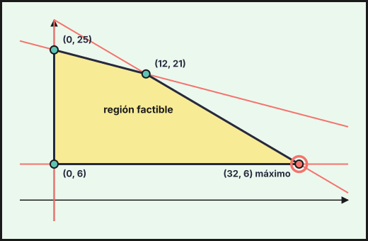{fig-alt="Región factible del ejercicio 2 (2024-ord-sup-b), con sus vértices: (0, 6), (32, 6), (12, 21), (0, 25)" width="75%" fig-align="center"}

**Se pueden formar 32 equipos del primer tipo y 6 del segundo (38 equipos).** Desarrolladores utilizados: Javascript $2\cdot32+6\cdot6=100$ y Python $3\cdot32+4\cdot6=120$.
::::
:::::

## 2023

### Ordinaria · Modelo A 2023

::::: {.ebau-ej #ebau-2023-ord-a-1}
**Ejercicio 1** · Ordinaria · Modelo A 2023 · Bloque A · *(2,5 puntos)* · [Examen](../../../assets/pau-ccss/2023-ord-a/examen.pdf){target="_blank"}

Sean la función $F(x,y)=5x-3y$ y la región del plano $R$ definida mediante las inecuaciones
$$2x-3y\le1;\qquad4x+y\le9;\qquad x+y\le5;\qquad9x-y\ge0;\qquad y\ge0$$

a) Dibuje la región $R$ y calcule sus vértices. *(1,3 puntos)*

b) Indique razonadamente si los puntos $A(2,2)$ y $B(1;3{,}5)$ pertenecen a la región $R$. *(0,5 puntos)*

c) Obtenga los puntos de la región $R$ donde $F$ alcanza el máximo y el mínimo y calcule sus correspondientes valores. *(0,7 puntos)*

:::: {.callout-note collapse="true" appearance="simple"}
## Ayuda 1 · Recordatorio

La región factible es la intersección de los semiplanos de las restricciones. Si está acotada, el óptimo de $F$ se alcanza en un **vértice** (o en todo un lado si la recta de nivel es paralela a él).
::::

:::: {.callout-note collapse="true" appearance="simple"}
## Ayuda 2 · Método

1. Dibuja cada recta (dos puntos) y sombrea el semiplano que cumple la desigualdad probando el punto $(0,0)$.
2. Marca la región común y halla los vértices resolviendo los sistemas de dos rectas que se cortan en ellos.
3. Evalúa $F$ en cada vértice y elige el mayor (máximo) o el menor (mínimo).
4. Responde con el contexto: valores de $x$ e $y$, valor óptimo y, si lo piden, recursos sobrantes.
::::

:::: {.callout-tip collapse="true" appearance="simple"}
## Solución

**a)** Rectas frontera: $2x-3y=1$, $4x+y=9$, $x+y=5$, $9x-y=0$ e $y=0$. Los vértices de la región $R$ son
$$(0,0),\quad\left(\tfrac{1}{2},0\right),\quad(2,1),\quad\left(\tfrac{4}{3},\tfrac{11}{3}\right),\quad\left(\tfrac{1}{2},\tfrac{9}{2}\right),$$
con $\left(\tfrac{1}{2},0\right)$ el corte de $2x-3y=1$ con $y=0$, $(2,1)$ el de $2x-3y=1$ con $4x+y=9$, $\left(\tfrac{4}{3},\tfrac{11}{3}\right)$ el de $4x+y=9$ con $x+y=5$ y $\left(\tfrac{1}{2},\tfrac{9}{2}\right)$ el de $x+y=5$ con $9x-y=0$.

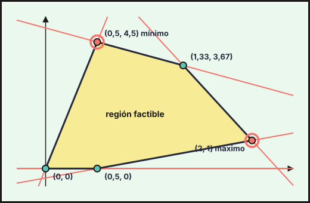{fig-alt="Región factible del ejercicio 1 (2023-ord-a), con sus vértices: (0, 0), (0,5, 0), (2, 1), (1,33, 3,67), (0,5, 4,5)" width="75%" fig-align="center"}

**b)** $A(2,2)$: $4x+y=4\cdot2+2=10>9$, no cumple $4x+y\le9$: **$A$ no pertenece a $R$.**

$B(1;3{,}5)$: $2-10{,}5=-8{,}5\le1$; $4+3{,}5=7{,}5\le9$; $1+3{,}5=4{,}5\le5$; $9-3{,}5=5{,}5\ge0$; $3{,}5\ge0$. Cumple todas: **$B$ pertenece a $R$.**

**c)** $F(0,0)=0$, $F\left(\tfrac{1}{2},0\right)=\tfrac{5}{2}$, $F(2,1)=7$, $F\left(\tfrac{4}{3},\tfrac{11}{3}\right)=-\tfrac{13}{3}$, $F\left(\tfrac{1}{2},\tfrac{9}{2}\right)=-11$.

**Máximo $7$ en $(2,1)$ y mínimo $-11$ en $\left(\tfrac{1}{2},\tfrac{9}{2}\right)$.**
::::
:::::

### Ordinaria · Modelo B 2023

::::: {.ebau-ej #ebau-2023-ord-b-2}
**Ejercicio 2** · Ordinaria · Modelo B 2023 · Bloque A · *(2,5 puntos)* · [Examen](../../../assets/pau-ccss/2023-ord-b/examen.pdf){target="_blank"}

Un artesano decide montar dos tipos de anillos utilizando dos tipos de piedras semipreciosas, una de mayor calidad que otra. Para montar uno de los anillos tarda 20 minutos y utiliza 1 de las piedras de mayor calidad y 2 de las de menor calidad. Para el otro tarda 50 minutos y utiliza 3 piedras de mayor calidad y 1 de menor calidad.

Semanalmente, el artesano dispone de 200 piedras de mayor calidad y 150 de menor calidad. Además, quiere trabajar al menos 1900 minutos a la semana.

Sabiendo que el primer tipo de anillo se vende a 21 €, el segundo a 50 € y que deben fabricarse al menos 20 anillos del primer tipo a la semana, determine cuántos anillos de cada tipo deben montarse para maximizar el valor de la venta. ¿A cuánto asciende dicho valor?

:::: {.callout-note collapse="true" appearance="simple"}
## Ayuda 1 · Recordatorio

**Programación lineal: planteamiento.**

Programación lineal: se optimiza una **función objetivo** $F(x,y)$ sujeta a **restricciones** lineales (desigualdades). Las condiciones de no negatividad $x\ge0,\ y\ge0$ suelen estar implícitas en el contexto.

**Programación lineal: región factible y óptimo.**

La región factible es la intersección de los semiplanos de las restricciones. Si está acotada, el óptimo de $F$ se alcanza en un **vértice** (o en todo un lado si la recta de nivel es paralela a él).
::::

:::: {.callout-note collapse="true" appearance="simple"}
## Ayuda 2 · Método

**Programación lineal: planteamiento.**

1. Define $x$ e $y$ (cantidad de cada producto, con unidades).
2. Escribe una desigualdad por cada limitación («como máximo» $\le$, «al menos» $\ge$) y la función objetivo (beneficio, coste, número de unidades…).
3. Ordena los datos en una tabla (recursos por unidad de producto) para no confundir coeficientes.

**Programación lineal: región factible y óptimo.**

1. Dibuja cada recta (dos puntos) y sombrea el semiplano que cumple la desigualdad probando el punto $(0,0)$.
2. Marca la región común y halla los vértices resolviendo los sistemas de dos rectas que se cortan en ellos.
3. Evalúa $F$ en cada vértice y elige el mayor (máximo) o el menor (mínimo).
4. Responde con el contexto: valores de $x$ e $y$, valor óptimo y, si lo piden, recursos sobrantes.
::::

:::: {.callout-tip collapse="true" appearance="simple"}
## Solución

Sean $x$ los anillos del primer tipo e $y$ los del segundo. Restricciones: piedras de mayor calidad $x+3y\le200$; de menor calidad $2x+y\le150$; tiempo $20x+50y\ge1900\iff2x+5y\ge190$; $x\ge20$; $y\ge0$. Valor de la venta: $V(x,y)=21x+50y$.

Vértices: $(20,30)$, $(20,60)$, $(50,50)$ (corte de $x+3y=200$ con $2x+y=150$) y $(70,10)$.

| Vértice | $(20,30)$ | $(20,60)$ | $(50,50)$ | $(70,10)$ |
|---|---|---|---|---|
| $V$ | $1\,920$ | $3\,420$ | $3\,550$ | $1\,970$ |

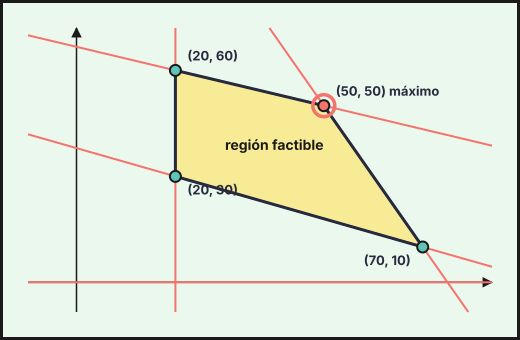{fig-alt="Región factible del ejercicio 2 (2023-ord-b), con sus vértices: (20, 30), (70, 10), (50, 50), (20, 60)" width="75%" fig-align="center"}

**Deben montarse 50 anillos de cada tipo, con un valor de venta de $3\,550$ €.**
::::
:::::

### Ordinaria · Reserva · Modelo A 2023

::::: {.ebau-ej #ebau-2023-ord-res-a-2}
**Ejercicio 2** · Ordinaria · Reserva · Modelo A 2023 · Bloque A · *(2,5 puntos)* · [Examen](../../../assets/pau-ccss/2023-ord-res-a/examen.pdf){target="_blank"}

Una empresa de material informático dispone de dos cadenas de fabricación, $A$ y $B$, en las que quiere aumentar su producción realizando horas extraordinarias.

En una hora extraordinaria de trabajo, la cadena $A$ prepara 15 portátiles y 6 tablets, y la cadena $B$ prepara 10 portátiles y 10 tablets. Los costes de producción por hora extraordinaria de $A$ y $B$ son de $300$ € y $600$ € respectivamente. La cadena $B$ puede realizar, como máximo, el triple de horas extraordinarias que la cadena $A$. Si para la próxima semana se debe producir adicionalmente un máximo de 360 portátiles y al menos 216 tablets, formule y resuelva el problema que permita la planificación de la empresa que minimice los costes de producción. ¿A cuánto ascienden dichos costes?

:::: {.callout-note collapse="true" appearance="simple"}
## Ayuda 1 · Recordatorio

**Programación lineal: planteamiento.**

Programación lineal: se optimiza una **función objetivo** $F(x,y)$ sujeta a **restricciones** lineales (desigualdades). Las condiciones de no negatividad $x\ge0,\ y\ge0$ suelen estar implícitas en el contexto.

**Programación lineal: región factible y óptimo.**

La región factible es la intersección de los semiplanos de las restricciones. Si está acotada, el óptimo de $F$ se alcanza en un **vértice** (o en todo un lado si la recta de nivel es paralela a él).
::::

:::: {.callout-note collapse="true" appearance="simple"}
## Ayuda 2 · Método

**Programación lineal: planteamiento.**

1. Define $x$ e $y$ (cantidad de cada producto, con unidades).
2. Escribe una desigualdad por cada limitación («como máximo» $\le$, «al menos» $\ge$) y la función objetivo (beneficio, coste, número de unidades…).
3. Ordena los datos en una tabla (recursos por unidad de producto) para no confundir coeficientes.

**Programación lineal: región factible y óptimo.**

1. Dibuja cada recta (dos puntos) y sombrea el semiplano que cumple la desigualdad probando el punto $(0,0)$.
2. Marca la región común y halla los vértices resolviendo los sistemas de dos rectas que se cortan en ellos.
3. Evalúa $F$ en cada vértice y elige el mayor (máximo) o el menor (mínimo).
4. Responde con el contexto: valores de $x$ e $y$, valor óptimo y, si lo piden, recursos sobrantes.
::::

:::: {.callout-tip collapse="true" appearance="simple"}
## Solución

Sean $x$ las horas extraordinarias de la cadena $A$ e $y$ las de la cadena $B$. Hay que **minimizar $C(x,y)=300x+600y$** sujeto a: portátiles $15x+10y\le360$; tablets $6x+10y\ge216$; $y\le3x$; $x\ge0$, $y\ge0$.

Vértices de la región factible: $(6,18)$ (corte de $y=3x$ con $6x+10y=216$), $(8,24)$ (corte de $y=3x$ con $15x+10y=360$) y $(16,12)$ (corte de $15x+10y=360$ con $6x+10y=216$).

| Vértice | $(6,18)$ | $(8,24)$ | $(16,12)$ |
|---|---|---|---|
| $C$ | $12\,600$ | $16\,800$ | $12\,000$ |

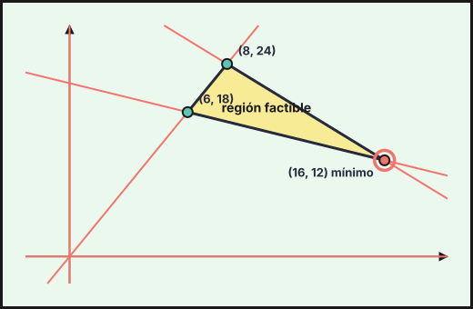{fig-alt="Región factible del ejercicio 2 (2023-ord-res-a), con sus vértices: (16, 12), (8, 24), (6, 18)" width="75%" fig-align="center"}

**El coste mínimo es de $12\,000$ €, con 16 horas extraordinarias en $A$ y 12 en $B$.**
::::
:::::

### Ordinaria · Reserva · Modelo B 2023

::::: {.ebau-ej #ebau-2023-ord-res-b-2}
**Ejercicio 2** · Ordinaria · Reserva · Modelo B 2023 · Bloque A · *(2,5 puntos)* · [Examen](../../../assets/pau-ccss/2023-ord-res-b/examen.pdf){target="_blank"}

Una compañía de transporte marítimo de mercancías dispone de dos barcos $B_1$ y $B_2$ para realizar una determinada ruta, durante un año, entre dos ciudades costeras europeas. El barco $B_1$ no puede realizar más de 14 viajes y debe realizar tantos viajes o más que el barco $B_2$. Entre los dos barcos deben realizar al menos 10 viajes y como mucho 24. La compañía obtiene unos beneficios de $15\,000$ € por cada viaje del barco $B_1$ y $17\,000$ € por cada viaje del barco $B_2$.

Halle el número de viajes que debe realizar cada barco para que el beneficio obtenido por la empresa sea máximo y obtenga dicho beneficio.

:::: {.callout-note collapse="true" appearance="simple"}
## Ayuda 1 · Recordatorio

**Programación lineal: planteamiento.**

Programación lineal: se optimiza una **función objetivo** $F(x,y)$ sujeta a **restricciones** lineales (desigualdades). Las condiciones de no negatividad $x\ge0,\ y\ge0$ suelen estar implícitas en el contexto.

**Programación lineal: región factible y óptimo.**

La región factible es la intersección de los semiplanos de las restricciones. Si está acotada, el óptimo de $F$ se alcanza en un **vértice** (o en todo un lado si la recta de nivel es paralela a él).
::::

:::: {.callout-note collapse="true" appearance="simple"}
## Ayuda 2 · Método

**Programación lineal: planteamiento.**

1. Define $x$ e $y$ (cantidad de cada producto, con unidades).
2. Escribe una desigualdad por cada limitación («como máximo» $\le$, «al menos» $\ge$) y la función objetivo (beneficio, coste, número de unidades…).
3. Ordena los datos en una tabla (recursos por unidad de producto) para no confundir coeficientes.

**Programación lineal: región factible y óptimo.**

1. Dibuja cada recta (dos puntos) y sombrea el semiplano que cumple la desigualdad probando el punto $(0,0)$.
2. Marca la región común y halla los vértices resolviendo los sistemas de dos rectas que se cortan en ellos.
3. Evalúa $F$ en cada vértice y elige el mayor (máximo) o el menor (mínimo).
4. Responde con el contexto: valores de $x$ e $y$, valor óptimo y, si lo piden, recursos sobrantes.
::::

:::: {.callout-tip collapse="true" appearance="simple"}
## Solución

Sean $x$ los viajes de $B_1$ e $y$ los de $B_2$. Restricciones: $x\le14$; $x\ge y$; $10\le x+y\le24$; $y\ge0$. Beneficio: $B(x,y)=15\,000x+17\,000y$.

Vértices: $(5,5)$, $(10,0)$, $(14,0)$, $(14,10)$ y $(12,12)$.

| Vértice | $(5,5)$ | $(10,0)$ | $(14,0)$ | $(14,10)$ | $(12,12)$ |
|---|---|---|---|---|---|
| $B$ | $160\,000$ | $150\,000$ | $210\,000$ | $380\,000$ | $384\,000$ |

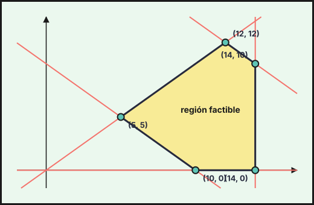{fig-alt="Región factible del ejercicio 2 (2023-ord-res-b), con sus vértices: (5, 5), (10, 0), (14, 0), (14, 10), (12, 12)" width="75%" fig-align="center"}

**Cada barco debe realizar 12 viajes, con un beneficio máximo de $384\,000$ €.**
::::
:::::

### Ordinaria · Suplente · Modelo A 2023

::::: {.ebau-ej #ebau-2023-ord-sup-a-1}
**Ejercicio 1** · Ordinaria · Suplente · Modelo A 2023 · Bloque A · *(2,5 puntos)* · [Examen](../../../assets/pau-ccss/2023-ord-sup-a/examen.pdf){target="_blank"}

El aforo de un campo de fútbol es de $10\,000$ personas. Según el reglamento establecido por la federación de fútbol, como máximo deben ponerse a la venta $3\,000$ entradas para los aficionados del equipo visitante y por cada aficionado visitante debe haber dos aficionados locales como mínimo y cuatro aficionados locales como máximo.

Si el precio de la entrada es de 50 € pero el aficionado local tiene un descuento del $20\,\%$, ¿cuántos aficionados locales y visitantes deben asistir para obtener el mayor importe con la venta de las entradas?

:::: {.callout-note collapse="true" appearance="simple"}
## Ayuda 1 · Recordatorio

**Programación lineal: planteamiento.**

Programación lineal: se optimiza una **función objetivo** $F(x,y)$ sujeta a **restricciones** lineales (desigualdades). Las condiciones de no negatividad $x\ge0,\ y\ge0$ suelen estar implícitas en el contexto.

**Programación lineal: región factible y óptimo.**

La región factible es la intersección de los semiplanos de las restricciones. Si está acotada, el óptimo de $F$ se alcanza en un **vértice** (o en todo un lado si la recta de nivel es paralela a él).
::::

:::: {.callout-note collapse="true" appearance="simple"}
## Ayuda 2 · Método

**Programación lineal: planteamiento.**

1. Define $x$ e $y$ (cantidad de cada producto, con unidades).
2. Escribe una desigualdad por cada limitación («como máximo» $\le$, «al menos» $\ge$) y la función objetivo (beneficio, coste, número de unidades…).
3. Ordena los datos en una tabla (recursos por unidad de producto) para no confundir coeficientes.

**Programación lineal: región factible y óptimo.**

1. Dibuja cada recta (dos puntos) y sombrea el semiplano que cumple la desigualdad probando el punto $(0,0)$.
2. Marca la región común y halla los vértices resolviendo los sistemas de dos rectas que se cortan en ellos.
3. Evalúa $F$ en cada vértice y elige el mayor (máximo) o el menor (mínimo).
4. Responde con el contexto: valores de $x$ e $y$, valor óptimo y, si lo piden, recursos sobrantes.
::::

:::: {.callout-tip collapse="true" appearance="simple"}
## Solución

Sean $x$ los aficionados locales e $y$ los visitantes. Restricciones: aforo $x+y\le10\,000$; visitantes $y\le3\,000$; al menos dos locales por visitante $x\ge2y$; como máximo cuatro $x\le4y$; $y\ge0$. Con el descuento, la entrada local cuesta $0{,}8\cdot50=40$ €. Importe: $I(x,y)=40x+50y$.

Vértices: $(0,0)$, $(6\,000,3\,000)$ (corte de $x=2y$ con $y=3\,000$), $(7\,000,3\,000)$ (corte de $x+y=10\,000$ con $y=3\,000$) y $(8\,000,2\,000)$ (corte de $x+y=10\,000$ con $x=4y$).

| Vértice | $(0,0)$ | $(6\,000,3\,000)$ | $(7\,000,3\,000)$ | $(8\,000,2\,000)$ |
|---|---|---|---|---|
| $I$ | $0$ | $390\,000$ | $430\,000$ | $420\,000$ |

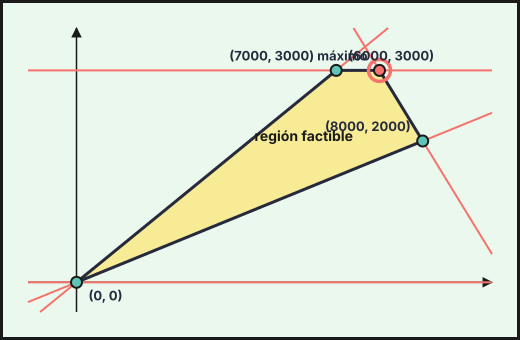{fig-alt="Región factible del ejercicio 1 (2023-ord-sup-a), con sus vértices: (0, 0), (8000, 2000), (7000, 3000), (6000, 3000)" width="75%" fig-align="center"}

**Deben asistir $7\,000$ aficionados locales y $3\,000$ visitantes, con un importe de $430\,000$ €.**
::::
:::::

### Ordinaria · Suplente · Modelo B 2023

::::: {.ebau-ej #ebau-2023-ord-sup-b-1}
**Ejercicio 1** · Ordinaria · Suplente · Modelo B 2023 · Bloque A · *(2,5 puntos)* · [Examen](../../../assets/pau-ccss/2023-ord-sup-b/examen.pdf){target="_blank"}

Una empresa de pinturas quiere elaborar botes de pintura de dos colores nuevos: Júpiter y Minerva. Para ello, dispone de $1000$ kg de pintura de color verde, $800$ kg de color morado y $300$ kg de color naranja. Para elaborar un bote de color Júpiter se necesitan $10$ kg de pintura verde, $5$ kg de morada y $5$ kg de naranja. Para elaborar un bote de color Minerva se necesitan $5$ kg de pintura verde y $5$ kg de morada. Sabiendo que se obtiene un beneficio de $30$ € por cada bote de pintura Júpiter y $20$ € por un bote de pintura Minerva, ¿cuántos botes de cada tipo deberá fabricar la empresa para obtener un beneficio máximo? ¿Cuál será el valor de ese beneficio?

:::: {.callout-note collapse="true" appearance="simple"}
## Ayuda 1 · Recordatorio

**Programación lineal: planteamiento.**

Programación lineal: se optimiza una **función objetivo** $F(x,y)$ sujeta a **restricciones** lineales (desigualdades). Las condiciones de no negatividad $x\ge0,\ y\ge0$ suelen estar implícitas en el contexto.

**Programación lineal: región factible y óptimo.**

La región factible es la intersección de los semiplanos de las restricciones. Si está acotada, el óptimo de $F$ se alcanza en un **vértice** (o en todo un lado si la recta de nivel es paralela a él).
::::

:::: {.callout-note collapse="true" appearance="simple"}
## Ayuda 2 · Método

**Programación lineal: planteamiento.**

1. Define $x$ e $y$ (cantidad de cada producto, con unidades).
2. Escribe una desigualdad por cada limitación («como máximo» $\le$, «al menos» $\ge$) y la función objetivo (beneficio, coste, número de unidades…).
3. Ordena los datos en una tabla (recursos por unidad de producto) para no confundir coeficientes.

**Programación lineal: región factible y óptimo.**

1. Dibuja cada recta (dos puntos) y sombrea el semiplano que cumple la desigualdad probando el punto $(0,0)$.
2. Marca la región común y halla los vértices resolviendo los sistemas de dos rectas que se cortan en ellos.
3. Evalúa $F$ en cada vértice y elige el mayor (máximo) o el menor (mínimo).
4. Responde con el contexto: valores de $x$ e $y$, valor óptimo y, si lo piden, recursos sobrantes.
::::

:::: {.callout-tip collapse="true" appearance="simple"}
## Solución

Sean $x$ los botes Júpiter e $y$ los Minerva. Restricciones: verde $10x+5y\le1\,000$; morado $5x+5y\le800$; naranja $5x\le300$ (solo lo usa Júpiter); $x\ge0$, $y\ge0$. Beneficio: $B(x,y)=30x+20y$.

Vértices: $(0,0)$, $(0,160)$, $(40,120)$ (corte de $10x+5y=1\,000$ con $5x+5y=800$), $(60,80)$ (corte de $x=60$ con $5x+5y=800$) y $(60,0)$.

| Vértice | $(0,0)$ | $(0,160)$ | $(40,120)$ | $(60,80)$ | $(60,0)$ |
|---|---|---|---|---|---|
| $B$ | $0$ | $3\,200$ | $3\,600$ | $3\,400$ | $1\,800$ |

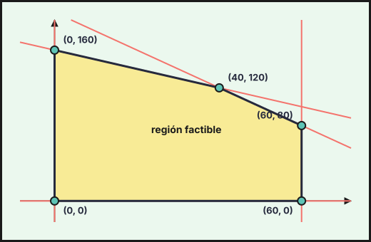{fig-alt="Región factible del ejercicio 1 (2023-ord-sup-b), con sus vértices: (0, 0), (60, 0), (60, 80), (40, 120), (0, 160)" width="75%" fig-align="center"}

**Debe fabricar 40 botes Júpiter y 120 Minerva, con un beneficio máximo de $3\,600$ €.**
::::
:::::

## 2022

### Ordinaria 2022

::::: {.ebau-ej #ebau-2022-ord-1}
**Ejercicio 1** · Ordinaria 2022 · Bloque A · *(2,5 puntos)* · [Examen](../../../assets/pau-ccss/2022-ord/examen.pdf){target="_blank"}

Una pastelería decide preparar dos tipos de cajas de pastelitos para regalar a los clientes en su inauguración. En total dispone de 120 piononos y 150 pestiños. En la caja del primer tipo habrá 3 piononos y 2 pestiños y en la del segundo tipo 4 piononos y 6 pestiños. Deben preparar al menos 9 cajas del segundo tipo.

Determine cuántas cajas de cada tipo deberá preparar para realizar el máximo número de regalos posible. En este caso, indique cuántos piononos y cuántos pestiños se utilizarán.

:::: {.callout-note collapse="true" appearance="simple"}
## Ayuda 1 · Recordatorio

**Programación lineal: planteamiento.**

Programación lineal: se optimiza una **función objetivo** $F(x,y)$ sujeta a **restricciones** lineales (desigualdades). Las condiciones de no negatividad $x\ge0,\ y\ge0$ suelen estar implícitas en el contexto.

**Programación lineal: región factible y óptimo.**

La región factible es la intersección de los semiplanos de las restricciones. Si está acotada, el óptimo de $F$ se alcanza en un **vértice** (o en todo un lado si la recta de nivel es paralela a él).
::::

:::: {.callout-note collapse="true" appearance="simple"}
## Ayuda 2 · Método

**Programación lineal: planteamiento.**

1. Define $x$ e $y$ (cantidad de cada producto, con unidades).
2. Escribe una desigualdad por cada limitación («como máximo» $\le$, «al menos» $\ge$) y la función objetivo (beneficio, coste, número de unidades…).
3. Ordena los datos en una tabla (recursos por unidad de producto) para no confundir coeficientes.

**Programación lineal: región factible y óptimo.**

1. Dibuja cada recta (dos puntos) y sombrea el semiplano que cumple la desigualdad probando el punto $(0,0)$.
2. Marca la región común y halla los vértices resolviendo los sistemas de dos rectas que se cortan en ellos.
3. Evalúa $F$ en cada vértice y elige el mayor (máximo) o el menor (mínimo).
4. Responde con el contexto: valores de $x$ e $y$, valor óptimo y, si lo piden, recursos sobrantes.
::::

:::: {.callout-tip collapse="true" appearance="simple"}
## Solución

1. **Incógnitas.** $x$ = cajas del primer tipo e $y$ = cajas del segundo.
2. **Restricciones.**
   - Piononos: $3x+4y\le120$.
   - Pestiños: $2x+6y\le150\iff x+3y\le75$.
   - Al menos 9 cajas del segundo tipo: $y\ge9$.
   - No negatividad: $x\ge0$.
3. **Función objetivo.** Un regalo es una caja, así que hay que maximizar el número de cajas, $F(x,y)=x+y$.
4. **Vértices:** $(0,9)$, $(0,25)$, $(12,21)$ (corte de $3x+4y=120$ con $x+3y=75$) y $(28,9)$ (corte de $3x+4y=120$ con $y=9$).
5. **Valor de $F$ en cada vértice:**

| Vértice | $(0,9)$ | $(0,25)$ | $(12,21)$ | $(28,9)$ |
|---|---|---|---|---|
| $x+y$ | $9$ | $25$ | $33$ | $37$ |

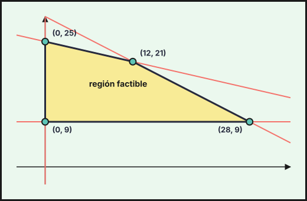{fig-alt="Región factible del ejercicio 1 (2022-ord), con sus vértices: (0, 9), (28, 9), (12, 21), (0, 25)" width="75%" fig-align="center"}

6. **Conclusión.** El máximo es $37$, en $(28,9)$. Piononos utilizados: $3\cdot28+4\cdot9=120$ (se agotan). Pestiños utilizados: $2\cdot28+6\cdot9=110$ (sobran $40$).

**Debe preparar 28 cajas del primer tipo y 9 del segundo (37 regalos).**
::::
:::::

### Ordinaria · Reserva 2022

::::: {.ebau-ej #ebau-2022-ord-res-2}
**Ejercicio 2** · Ordinaria · Reserva 2022 · Bloque A · *(2,5 puntos)* · [Examen](../../../assets/pau-ccss/2022-ord-res/examen.pdf){target="_blank"}

Una papelería quiere vender 400 cuadernos de vacaciones y 300 estuches de lápices de colores. Para ello ha preparado dos lotes de esos productos a precios especiales. Los lotes de tipo A contienen 2 cuadernos y 2 estuches; los lotes de tipo B contienen 3 cuadernos y 1 estuche. No es posible vender más de 100 lotes de tipo B. Cada lote de tipo A se vende a 35 € y cada lote de tipo B a 45 €. Calcule cuántos lotes de cada tipo debe vender la papelería para conseguir el máximo valor de ventas. ¿A cuánto asciende dicho valor?

:::: {.callout-note collapse="true" appearance="simple"}
## Ayuda 1 · Recordatorio

**Programación lineal: planteamiento.**

Programación lineal: se optimiza una **función objetivo** $F(x,y)$ sujeta a **restricciones** lineales (desigualdades). Las condiciones de no negatividad $x\ge0,\ y\ge0$ suelen estar implícitas en el contexto.

**Programación lineal: región factible y óptimo.**

La región factible es la intersección de los semiplanos de las restricciones. Si está acotada, el óptimo de $F$ se alcanza en un **vértice** (o en todo un lado si la recta de nivel es paralela a él).
::::

:::: {.callout-note collapse="true" appearance="simple"}
## Ayuda 2 · Método

**Programación lineal: planteamiento.**

1. Define $x$ e $y$ (cantidad de cada producto, con unidades).
2. Escribe una desigualdad por cada limitación («como máximo» $\le$, «al menos» $\ge$) y la función objetivo (beneficio, coste, número de unidades…).
3. Ordena los datos en una tabla (recursos por unidad de producto) para no confundir coeficientes.

**Programación lineal: región factible y óptimo.**

1. Dibuja cada recta (dos puntos) y sombrea el semiplano que cumple la desigualdad probando el punto $(0,0)$.
2. Marca la región común y halla los vértices resolviendo los sistemas de dos rectas que se cortan en ellos.
3. Evalúa $F$ en cada vértice y elige el mayor (máximo) o el menor (mínimo).
4. Responde con el contexto: valores de $x$ e $y$, valor óptimo y, si lo piden, recursos sobrantes.
::::

:::: {.callout-tip collapse="true" appearance="simple"}
## Solución

1. **Incógnitas.** $x$ = lotes de tipo A e $y$ = lotes de tipo B.
2. **Restricciones.**
   - Cuadernos: $2x+3y\le400$.
   - Estuches: $2x+y\le300$.
   - No más de 100 lotes de tipo B: $y\le100$.
   - No negatividad: $x\ge0$, $y\ge0$.
3. **Función objetivo.** Valor de las ventas: $V(x,y)=35x+45y$.
4. **Vértices:** $(0,0)$, $(0,100)$, $(50,100)$, $(125,50)$ (corte de $2x+3y=400$ con $2x+y=300$) y $(150,0)$.
5. **Valor de $V$ en cada vértice:**

| Vértice | $(0,0)$ | $(0,100)$ | $(50,100)$ | $(125,50)$ | $(150,0)$ |
|---|---|---|---|---|---|
| $V$ | $0$ | $4\,500$ | $6\,250$ | $6\,625$ | $5\,250$ |

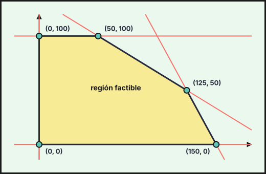{fig-alt="Región factible del ejercicio 2 (2022-ord-res), con sus vértices: (0, 0), (150, 0), (125, 50), (50, 100), (0, 100)" width="75%" fig-align="center"}

6. **Conclusión.** El máximo es $6\,625$, en $(125,50)$ (se agotan cuadernos y estuches).

**Debe vender 125 lotes de tipo A y 50 de tipo B, con un valor máximo de ventas de $6\,625$ €.**
::::
:::::

### Ordinaria · Suplente 2022

::::: {.ebau-ej #ebau-2022-ord-sup-1}
**Ejercicio 1** · Ordinaria · Suplente 2022 · Bloque A · *(2,5 puntos)* · [Examen](../../../assets/pau-ccss/2022-ord-sup/examen.pdf){target="_blank"}

Una fábrica de juguetes educativos produce juegos de ajedrez y dominó. Para fabricar un ajedrez se necesitan 2 kg de madera y 4 horas de trabajo, mientras que para fabricar un dominó se necesita 1 kg de madera y 1 hora de trabajo. Para que la producción sea rentable hay que hacer al día al menos 3 juegos y emplear como máximo 7 kg de madera y 9 horas de trabajo. Cada ajedrez se vende por 40 € y cada dominó por 15 €. ¿Cuántos juegos de ajedrez y dominó deben fabricarse diariamente para que la ganancia obtenida sea máxima? ¿Cuál será esa ganancia?

:::: {.callout-note collapse="true" appearance="simple"}
## Ayuda 1 · Recordatorio

**Programación lineal: planteamiento.**

Programación lineal: se optimiza una **función objetivo** $F(x,y)$ sujeta a **restricciones** lineales (desigualdades). Las condiciones de no negatividad $x\ge0,\ y\ge0$ suelen estar implícitas en el contexto.

**Programación lineal: región factible y óptimo.**

La región factible es la intersección de los semiplanos de las restricciones. Si está acotada, el óptimo de $F$ se alcanza en un **vértice** (o en todo un lado si la recta de nivel es paralela a él).
::::

:::: {.callout-note collapse="true" appearance="simple"}
## Ayuda 2 · Método

**Programación lineal: planteamiento.**

1. Define $x$ e $y$ (cantidad de cada producto, con unidades).
2. Escribe una desigualdad por cada limitación («como máximo» $\le$, «al menos» $\ge$) y la función objetivo (beneficio, coste, número de unidades…).
3. Ordena los datos en una tabla (recursos por unidad de producto) para no confundir coeficientes.

**Programación lineal: región factible y óptimo.**

1. Dibuja cada recta (dos puntos) y sombrea el semiplano que cumple la desigualdad probando el punto $(0,0)$.
2. Marca la región común y halla los vértices resolviendo los sistemas de dos rectas que se cortan en ellos.
3. Evalúa $F$ en cada vértice y elige el mayor (máximo) o el menor (mínimo).
4. Responde con el contexto: valores de $x$ e $y$, valor óptimo y, si lo piden, recursos sobrantes.
::::

:::: {.callout-tip collapse="true" appearance="simple"}
## Solución

1. **Incógnitas.** $x$ = ajedreces e $y$ = dominós fabricados al día.
2. **Restricciones.**
   - Al menos 3 juegos: $x+y\ge3$.
   - Madera, como máximo 7 kg: $2x+y\le7$.
   - Horas de trabajo, como máximo 9: $4x+y\le9$.
   - No negatividad: $x\ge0$, $y\ge0$.
3. **Función objetivo.** Ganancia: $G(x,y)=40x+15y$.
4. **Vértices:** $(0,3)$, $(0,7)$, $(1,5)$ (corte de $2x+y=7$ con $4x+y=9$) y $(2,1)$ (corte de $4x+y=9$ con $x+y=3$).
5. **Valor de $G$ en cada vértice:**

| Vértice | $(0,3)$ | $(0,7)$ | $(1,5)$ | $(2,1)$ |
|---|---|---|---|---|
| $G$ | $45$ | $105$ | $115$ | $95$ |

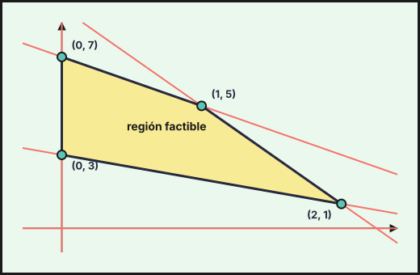{fig-alt="Región factible del ejercicio 1 (2022-ord-sup), con sus vértices: (0, 3), (2, 1), (1, 5), (0, 7)" width="75%" fig-align="center"}

6. **Conclusión.** El máximo es $115$, en $(1,5)$: se emplean $2\cdot1+5=7$ kg de madera y $4\cdot1+5=9$ horas (se agotan los dos recursos).

**Deben fabricarse 1 ajedrez y 5 dominós al día, con una ganancia máxima de $115$ €.**
::::
:::::

### Extraordinaria 2022

::::: {.ebau-ej #ebau-2022-ext-2}
**Ejercicio 2** · Extraordinaria 2022 · Bloque A · *(2,5 puntos)* · [Examen](../../../assets/pau-ccss/2022-ext/examen.pdf){target="_blank"}

Se considera el recinto definido por las siguientes inecuaciones:

$$y-2x\le7;\qquad-x+3y\le21;\qquad x+2y\le19;\qquad x+y\le14$$

a) Represente dicho recinto y determine sus vértices. *(1,4 puntos)*

b) Calcule los valores máximo y mínimo de la función $F(x,y)=x+4y$ en el recinto anterior, así como los puntos donde se alcanzan. *(0,6 puntos)*

c) ¿Podría tomar la función objetivo $F$ el valor 40 en algún punto de la región factible? ¿Y el valor 20? Justifique las respuestas. *(0,5 puntos)*

:::: {.callout-note collapse="true" appearance="simple"}
## Ayuda 1 · Recordatorio

La región factible es la intersección de los semiplanos de las restricciones. Si está acotada, el óptimo de $F$ se alcanza en un **vértice** (o en todo un lado si la recta de nivel es paralela a él).
::::

:::: {.callout-note collapse="true" appearance="simple"}
## Ayuda 2 · Método

1. Dibuja cada recta (dos puntos) y sombrea el semiplano que cumple la desigualdad probando el punto $(0,0)$.
2. Marca la región común y halla los vértices resolviendo los sistemas de dos rectas que se cortan en ellos.
3. Evalúa $F$ en cada vértice y elige el mayor (máximo) o el menor (mínimo).
4. Responde con el contexto: valores de $x$ e $y$, valor óptimo y, si lo piden, recursos sobrantes.
::::

:::: {.callout-tip collapse="true" appearance="simple"}
## Solución

(Se toma $x\ge0$, $y\ge0$, como es habitual en estos problemas: sin esas condiciones el recinto no estaría acotado y la función $F$ no tendría mínimo.)

**a) Recinto y vértices.**
1. Rectas frontera: $y=2x+7$, $-x+3y=21$, $x+2y=19$, $x+y=14$, $x=0$, $y=0$.
2. Se sombrea en cada una el semiplano que cumple la desigualdad y se toma la zona común.
3. Vértices del recinto:
$$(0,0),\quad(0,7),\quad(3,8),\quad(9,5),\quad(14,0),$$
donde $(0,7)$ es el corte de $x=0$ con $y=2x+7$ (que también está en $-x+3y=21$), $(3,8)$ el de $-x+3y=21$ con $x+2y=19$, $(9,5)$ el de $x+2y=19$ con $x+y=14$ y $(14,0)$ el de $x+y=14$ con $y=0$.

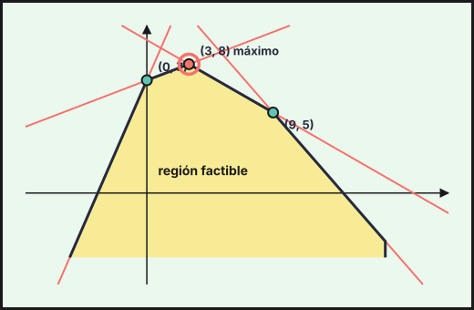{fig-alt="Región factible del ejercicio 2 (2022-ext), con sus vértices: (0, 0), (14, 0), (9, 5), (3, 8), (0, 7)" width="75%" fig-align="center"}

**b) Máximo y mínimo de $F(x,y)=x+4y$.**
1. Se evalúa $F$ en los vértices: $F(0,0)=0$, $F(0,7)=28$, $F(3,8)=35$, $F(9,5)=29$, $F(14,0)=14$.

**Máximo $35$ en $(3,8)$ y mínimo $0$ en $(0,0)$.**

**c) ¿Puede valer $40$? ¿Y $20$?**
1. $F$ es continua y la región es conexa y acotada, así que toma todos los valores entre su mínimo ($0$) y su máximo ($35$).
2. $40>35$: no puede alcanzarse.
3. $0\le20\le35$: sí, por ejemplo en el punto $(4,4)$ ($4+16=20$), que cumple las cuatro desigualdades.

**El valor $40$ no puede alcanzarse; el valor $20$ sí.**
::::
:::::

### Extraordinaria · Reserva 2022

::::: {.ebau-ej #ebau-2022-ext-res-2}
**Ejercicio 2** · Extraordinaria · Reserva 2022 · Bloque A · *(2,5 puntos)* · [Examen](../../../assets/pau-ccss/2022-ext-res/examen.pdf){target="_blank"}

Una sastrería dispone de $70\ \text{m}^{2}$ de tela de lino y de $150\ \text{m}^{2}$ de tela de algodón. En la confección de un traje se emplea $1\ \text{m}^{2}$ de tela de lino y $3\ \text{m}^{2}$ de tela de algodón, y en un vestido se necesitan $2\ \text{m}^{2}$ de tela de cada tipo. Se obtienen 60 euros de beneficio por cada traje y 70 euros por cada vestido. Determine el número de trajes y vestidos que se deben confeccionar para obtener el máximo beneficio, así como dicho beneficio máximo.

:::: {.callout-note collapse="true" appearance="simple"}
## Ayuda 1 · Recordatorio

**Programación lineal: planteamiento.**

Programación lineal: se optimiza una **función objetivo** $F(x,y)$ sujeta a **restricciones** lineales (desigualdades). Las condiciones de no negatividad $x\ge0,\ y\ge0$ suelen estar implícitas en el contexto.

**Programación lineal: región factible y óptimo.**

La región factible es la intersección de los semiplanos de las restricciones. Si está acotada, el óptimo de $F$ se alcanza en un **vértice** (o en todo un lado si la recta de nivel es paralela a él).
::::

:::: {.callout-note collapse="true" appearance="simple"}
## Ayuda 2 · Método

**Programación lineal: planteamiento.**

1. Define $x$ e $y$ (cantidad de cada producto, con unidades).
2. Escribe una desigualdad por cada limitación («como máximo» $\le$, «al menos» $\ge$) y la función objetivo (beneficio, coste, número de unidades…).
3. Ordena los datos en una tabla (recursos por unidad de producto) para no confundir coeficientes.

**Programación lineal: región factible y óptimo.**

1. Dibuja cada recta (dos puntos) y sombrea el semiplano que cumple la desigualdad probando el punto $(0,0)$.
2. Marca la región común y halla los vértices resolviendo los sistemas de dos rectas que se cortan en ellos.
3. Evalúa $F$ en cada vértice y elige el mayor (máximo) o el menor (mínimo).
4. Responde con el contexto: valores de $x$ e $y$, valor óptimo y, si lo piden, recursos sobrantes.
::::

:::: {.callout-tip collapse="true" appearance="simple"}
## Solución

1. **Incógnitas.** $x$ = trajes e $y$ = vestidos.
2. **Restricciones.**
   - Lino: $x+2y\le70$.
   - Algodón: $3x+2y\le150$.
   - No negatividad: $x\ge0$, $y\ge0$.
3. **Función objetivo.** Beneficio: $B(x,y)=60x+70y$.
4. **Vértices:** $(0,0)$, $(0,35)$, $(40,15)$ (corte de $x+2y=70$ con $3x+2y=150$) y $(50,0)$.
5. **Valor de $B$ en cada vértice:**

| Vértice | $(0,0)$ | $(0,35)$ | $(40,15)$ | $(50,0)$ |
|---|---|---|---|---|
| $B$ | $0$ | $2\,450$ | $3\,450$ | $3\,000$ |

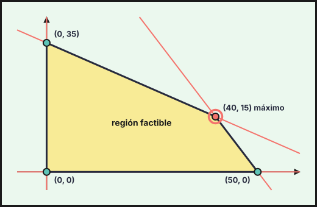{fig-alt="Región factible del ejercicio 2 (2022-ext-res), con sus vértices: (0, 0), (50, 0), (40, 15), (0, 35)" width="75%" fig-align="center"}

6. **Conclusión.** El máximo es $3\,450$, en $(40,15)$: se gastan $40+30=70$ m² de lino y $120+30=150$ m² de algodón (se agotan las dos telas).

**Hay que confeccionar 40 trajes y 15 vestidos, con un beneficio máximo de $3\,450$ €.**
::::
:::::

### Extraordinaria · Suplente 2022

::::: {.ebau-ej #ebau-2022-ext-sup-1}
**Ejercicio 1** · Extraordinaria · Suplente 2022 · Bloque A · *(2,5 puntos)* · [Examen](../../../assets/pau-ccss/2022-ext-sup/examen.pdf){target="_blank"}

Se considera el recinto definido por las siguientes inecuaciones:

$$x+2y\ge7;\qquad2x-y\le4;\qquad4x-y\ge1;\qquad3x+2y\le20$$

a) Represente dicho recinto y calcule sus vértices. *(2 puntos)*

b) Obtenga el valor máximo de la función $F(x,y)=x+3y$ en el recinto anterior, así como el punto donde se alcanza. *(0,5 puntos)*

:::: {.callout-note collapse="true" appearance="simple"}
## Ayuda 1 · Recordatorio

La región factible es la intersección de los semiplanos de las restricciones. Si está acotada, el óptimo de $F$ se alcanza en un **vértice** (o en todo un lado si la recta de nivel es paralela a él).
::::

:::: {.callout-note collapse="true" appearance="simple"}
## Ayuda 2 · Método

1. Dibuja cada recta (dos puntos) y sombrea el semiplano que cumple la desigualdad probando el punto $(0,0)$.
2. Marca la región común y halla los vértices resolviendo los sistemas de dos rectas que se cortan en ellos.
3. Evalúa $F$ en cada vértice y elige el mayor (máximo) o el menor (mínimo).
4. Responde con el contexto: valores de $x$ e $y$, valor óptimo y, si lo piden, recursos sobrantes.
::::

:::: {.callout-tip collapse="true" appearance="simple"}
## Solución

**a) Recinto y vértices.**
1. Rectas frontera: $x+2y=7$, $2x-y=4$, $4x-y=1$, $3x+2y=20$.
2. En cada una se sombrea el semiplano que cumple la desigualdad (se prueba un punto, por ejemplo $(3,3)$) y se toma la zona común.
3. Los vértices del recinto son
$$(1,3),\quad(2,7),\quad(3,2),\quad(4,4),$$
donde $(1,3)$ es el corte de $x+2y=7$ con $4x-y=1$, $(2,7)$ el de $4x-y=1$ con $3x+2y=20$, $(4,4)$ el de $3x+2y=20$ con $2x-y=4$ y $(3,2)$ el de $2x-y=4$ con $x+2y=7$.

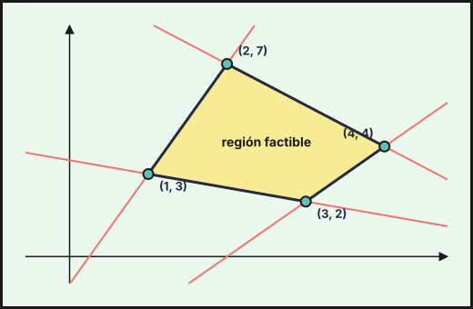{fig-alt="Región factible del ejercicio 1 (2022-ext-sup), con sus vértices: (1, 3), (3, 2), (4, 4), (2, 7)" width="75%" fig-align="center"}

**b) Máximo de $F(x,y)=x+3y$.**
1. Se evalúa $F$ en los vértices: $F(1,3)=10$, $F(2,7)=23$, $F(3,2)=9$ y $F(4,4)=16$.

**El máximo vale $23$ y se alcanza en el punto $(2,7)$.**
::::
:::::

## 2021

### Ordinaria 2021

::::: {.ebau-ej #ebau-2021-ord-1}
**Ejercicio 1** · Ordinaria 2021 · Bloque A · *(2,5 puntos)* · [Examen](../../../assets/pau-ccss/2021-ord/examen.pdf){target="_blank"}

Una empresa de recambios industriales produce dos tipos de baterías, $A$ y $B$. Su producción semanal debe ser de al menos 10 baterías en total y el número de baterías de tipo $B$ no puede superar en más de 10 unidades a las fabricadas de tipo $A$. Cada batería de tipo $A$ tiene unos gastos de producción de 150 euros y cada batería de tipo $B$ de 100 euros, disponiendo de un máximo de 6000 euros a la semana para el coste total de producción.

Si la empresa vende todo lo que produce y cada batería de tipo $A$ genera un beneficio de 130 euros y la de tipo $B$ de 140 euros, ¿cuántas baterías de cada tipo tendrán que producir a la semana para que el beneficio total sea máximo? ¿Cuál es ese beneficio?

:::: {.callout-note collapse="true" appearance="simple"}
## Ayuda 1 · Recordatorio

**Programación lineal: planteamiento.**

Programación lineal: se optimiza una **función objetivo** $F(x,y)$ sujeta a **restricciones** lineales (desigualdades). Las condiciones de no negatividad $x\ge0,\ y\ge0$ suelen estar implícitas en el contexto.

**Programación lineal: región factible y óptimo.**

La región factible es la intersección de los semiplanos de las restricciones. Si está acotada, el óptimo de $F$ se alcanza en un **vértice** (o en todo un lado si la recta de nivel es paralela a él).
::::

:::: {.callout-note collapse="true" appearance="simple"}
## Ayuda 2 · Método

**Programación lineal: planteamiento.**

1. Define $x$ e $y$ (cantidad de cada producto, con unidades).
2. Escribe una desigualdad por cada limitación («como máximo» $\le$, «al menos» $\ge$) y la función objetivo (beneficio, coste, número de unidades…).
3. Ordena los datos en una tabla (recursos por unidad de producto) para no confundir coeficientes.

**Programación lineal: región factible y óptimo.**

1. Dibuja cada recta (dos puntos) y sombrea el semiplano que cumple la desigualdad probando el punto $(0,0)$.
2. Marca la región común y halla los vértices resolviendo los sistemas de dos rectas que se cortan en ellos.
3. Evalúa $F$ en cada vértice y elige el mayor (máximo) o el menor (mínimo).
4. Responde con el contexto: valores de $x$ e $y$, valor óptimo y, si lo piden, recursos sobrantes.
::::

:::: {.callout-tip collapse="true" appearance="simple"}
## Solución

1. **Incógnitas.** $x$ = baterías de tipo $A$ e $y$ = baterías de tipo $B$ producidas a la semana.
2. **Restricciones.**
   - Al menos 10 baterías en total: $x+y\ge10$.
   - Las de tipo $B$ no superan en más de 10 a las de tipo $A$: $y\le x+10$.
   - Gastos de producción, como máximo $6000$ €: $150x+100y\le6000$, es decir, $3x+2y\le120$.
   - No negatividad: $x\ge0$, $y\ge0$.
3. **Función objetivo.** El beneficio es $B(x,y)=130x+140y$ (se vende todo lo que se produce).
4. **Vértices** de la región factible (cortes de dos fronteras): $(10,0)$ (de $y=0$ y $x+y=10$), $(40,0)$ (de $y=0$ y $3x+2y=120$), $(20,30)$ (de $y=x+10$ y $3x+2y=120$) y $(0,10)$ (de $x=0$ y $y=x+10$).
5. **Beneficio en cada vértice:**

| Vértice | $(10,0)$ | $(40,0)$ | $(20,30)$ | $(0,10)$ |
|---|---|---|---|---|
| $B$ | $1\,300$ | $5\,200$ | $6\,800$ | $1\,400$ |

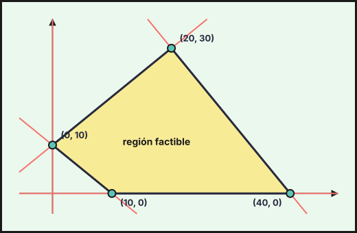{fig-alt="Región factible del ejercicio 1 (2021-ord), con sus vértices: (10, 0), (40, 0), (20, 30), (0, 10)" width="75%" fig-align="center"}

6. **Conclusión.** El máximo es $6\,800$, en $(20,30)$. Gasto: $150\cdot20+100\cdot30=6000$ € (se agota el presupuesto).

**Hay que producir 20 baterías de tipo $A$ y 30 de tipo $B$, con un beneficio máximo de $6\,800$ €.**
::::
:::::

### Ordinaria · Reserva 2021

::::: {.ebau-ej #ebau-2021-ord-res-1}
**Ejercicio 1** · Ordinaria · Reserva 2021 · Bloque A · *(2,5 puntos)* · [Examen](../../../assets/pau-ccss/2021-ord-res/examen.pdf){target="_blank"}

a) Una frutería vende dos tipos de surtidos de frutos rojos, $A$ y $B$. El surtido de tipo $A$ contiene 75 g de arándanos, 100 g de frambuesas y se vende a 2,40 euros, mientras que el de tipo $B$ contiene 75 g de arándanos, 50 g de frambuesas y se vende a 1,80 euros. La frutería dispone de un total de 3,75 kg de arándanos y 4 kg de frambuesas y el número de surtidos que vende del tipo $A$, siempre es menor o igual al doble de los del tipo $B$.

Formule, sin resolver, el problema que permite obtener el número de surtidos de cada tipo que debe vender para que el beneficio sea máximo. *(1 punto)*

b) Represente el recinto limitado por las siguientes restricciones, calculando sus vértices: *(1,5 puntos)*

$$x+4y\ge5\qquad x+2y\ge4\qquad 7x+5y\le35\qquad x\ge0$$

¿En qué punto de la región anterior la función $F(x,y)=2x+y$ alcanza el mínimo y cuál es dicho valor?

:::: {.callout-note collapse="true" appearance="simple"}
## Ayuda 1 · Recordatorio

**Programación lineal: planteamiento.**

Programación lineal: se optimiza una **función objetivo** $F(x,y)$ sujeta a **restricciones** lineales (desigualdades). Las condiciones de no negatividad $x\ge0,\ y\ge0$ suelen estar implícitas en el contexto.

**Programación lineal: región factible y óptimo.**

La región factible es la intersección de los semiplanos de las restricciones. Si está acotada, el óptimo de $F$ se alcanza en un **vértice** (o en todo un lado si la recta de nivel es paralela a él).
::::

:::: {.callout-note collapse="true" appearance="simple"}
## Ayuda 2 · Método

**Programación lineal: planteamiento.**

1. Define $x$ e $y$ (cantidad de cada producto, con unidades).
2. Escribe una desigualdad por cada limitación («como máximo» $\le$, «al menos» $\ge$) y la función objetivo (beneficio, coste, número de unidades…).
3. Ordena los datos en una tabla (recursos por unidad de producto) para no confundir coeficientes.

**Programación lineal: región factible y óptimo.**

1. Dibuja cada recta (dos puntos) y sombrea el semiplano que cumple la desigualdad probando el punto $(0,0)$.
2. Marca la región común y halla los vértices resolviendo los sistemas de dos rectas que se cortan en ellos.
3. Evalúa $F$ en cada vértice y elige el mayor (máximo) o el menor (mínimo).
4. Responde con el contexto: valores de $x$ e $y$, valor óptimo y, si lo piden, recursos sobrantes.
::::

:::: {.callout-tip collapse="true" appearance="simple"}
## Solución

**a) Formulación.**
1. **Incógnitas.** $x$ = número de surtidos de tipo $A$, $y$ = número de surtidos de tipo $B$.
2. **Función objetivo.** Cada $A$ se vende a 2,40 € y cada $B$ a 1,80 €: hay que **maximizar $F(x,y)=2{,}4x+1{,}8y$**.
3. **Restricciones** (pasando kilos a gramos: 3,75 kg $=3750$ g y 4 kg $=4000$ g):
   - arándanos: $75x+75y\le3750\iff x+y\le50$,
   - frambuesas: $100x+50y\le4000\iff2x+y\le80$,
   - los de tipo $A$ no superan el doble de los de tipo $B$: $x\le2y$,
   - no negatividad: $x\ge0$, $y\ge0$.

**b) Región y mínimo de $F(x,y)=2x+y$.**
1. Fronteras: $x+4y=5$, $x+2y=4$, $7x+5y=35$ y $x=0$. Con un punto de prueba se ve que la región queda por encima de las dos primeras rectas, bajo la tercera y a la derecha de $x=0$.
2. **Vértices** (cortes de dos fronteras): $(0,7)$ (de $x=0$ y $7x+5y=35$), $(0,2)$ (de $x=0$ y $x+2y=4$), $\left(3,\frac{1}{2}\right)$ (de $x+4y=5$ y $x+2y=4$) y $(5,0)$ (de $x+4y=5$ y $7x+5y=35$).
3. Se evalúa $F=2x+y$ en cada vértice:

| Vértice | $(0,7)$ | $(0,2)$ | $\left(3,\frac{1}{2}\right)$ | $(5,0)$ |
|---|---|---|---|---|
| $F=2x+y$ | $7$ | $2$ | $\frac{13}{2}$ | $10$ |

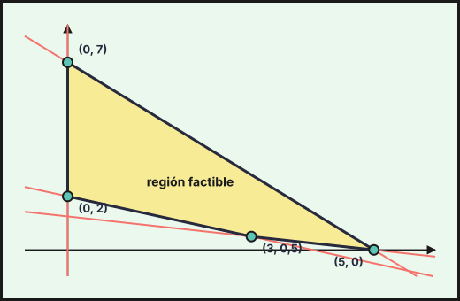{fig-alt="Región factible del ejercicio 1 (2021-ord-res), con sus vértices: (0, 2), (3, 0,5), (5, 0), (0, 7)" width="75%" fig-align="center"}

4. El menor valor es $2$.

**El mínimo se alcanza en el punto $(0,2)$ y vale $2$.**
::::
:::::

### Ordinaria · Suplente 2021

::::: {.ebau-ej #ebau-2021-ord-sup-2}
**Ejercicio 2** · Ordinaria · Suplente 2021 · Bloque A · *(2,5 puntos)* · [Examen](../../../assets/pau-ccss/2021-ord-sup/examen.pdf){target="_blank"}

Se consideran las siguientes inecuaciones:

$$5x-3y\ge-9\qquad x+y\le11\qquad 6x+y\le36\qquad x+2y\ge6$$

a) Represente la región factible definida por las inecuaciones anteriores y determine sus vértices. *(1,5 puntos)*

b) ¿Pertenece el punto $(5,7)$ a la región factible anterior? *(0,25 puntos)*

c) Calcule los valores máximo y mínimo de la función $F(x,y)=10x-6y$ en la región anterior y determine los puntos en los que se alcanzan. *(0,75 puntos)*

:::: {.callout-note collapse="true" appearance="simple"}
## Ayuda 1 · Recordatorio

La región factible es la intersección de los semiplanos de las restricciones. Si está acotada, el óptimo de $F$ se alcanza en un **vértice** (o en todo un lado si la recta de nivel es paralela a él).
::::

:::: {.callout-note collapse="true" appearance="simple"}
## Ayuda 2 · Método

1. Dibuja cada recta (dos puntos) y sombrea el semiplano que cumple la desigualdad probando el punto $(0,0)$.
2. Marca la región común y halla los vértices resolviendo los sistemas de dos rectas que se cortan en ellos.
3. Evalúa $F$ en cada vértice y elige el mayor (máximo) o el menor (mínimo).
4. Responde con el contexto: valores de $x$ e $y$, valor óptimo y, si lo piden, recursos sobrantes.
::::

:::: {.callout-tip collapse="true" appearance="simple"}
## Solución

**a) Región factible.**
1. Las rectas frontera son $5x-3y=-9$, $x+y=11$, $6x+y=36$ y $x+2y=6$. Con un punto de prueba (por ejemplo $(2,4)$) se comprueba qué lado cumple cada desigualdad.
2. Los vértices de la región factible son
$$(0,3),\quad(3,8),\quad(5,6),\quad(6,0),$$
que se obtienen cortando $x+2y=6$ con $x=0$, $5x-3y=-9$ con $x+y=11$, $x+y=11$ con $6x+y=36$ y $6x+y=36$ con $y=0$, respectivamente. (La región es el cuadrilátero de esos cuatro vértices.)

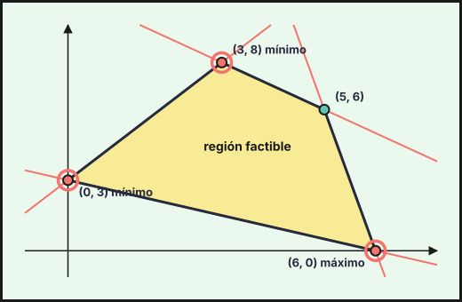{fig-alt="Región factible del ejercicio 2 (2021-ord-sup), con sus vértices: (0, 3), (6, 0), (5, 6), (3, 8)" width="75%" fig-align="center"}

**b) Pertenencia.** Se sustituye el punto en cada desigualdad. Para $(5,7)$: $5+7=12>11$, no cumple $x+y\le11$. **No pertenece a la región.**

**c) Máximo y mínimo de $F=10x-6y$.**
1. Se evalúa $F$ en los vértices: $F(0,3)=-18$, $F(3,8)=-18$, $F(5,6)=14$, $F(6,0)=60$.
2. El mayor valor es $60$ y el menor $-18$, que se repite en dos vértices.

**Máximo $60$ en $(6,0)$. Mínimo $-18$, que se alcanza en $(0,3)$ y en $(3,8)$ y, por tanto, en todos los puntos del segmento que los une** (porque $F=-18$ es la recta $5x-3y=-9$ multiplicada por 2, es decir, la recta de nivel es paralela a ese lado de la región).
::::
:::::

### Extraordinaria 2021

::::: {.ebau-ej #ebau-2021-ext-2}
**Ejercicio 2** · Extraordinaria 2021 · Bloque A · *(2,5 puntos)* · [Examen](../../../assets/pau-ccss/2021-ext/examen.pdf){target="_blank"}

Se consideran las siguientes inecuaciones:

$$5x-4y\le-19\qquad3x-4y\le-13\qquad x\ge-7\qquad-x-y\ge2$$

a) Represente la región factible definida por las inecuaciones anteriores y determine sus vértices. *(1,5 puntos)*

b) ¿Cuáles son los puntos en los que se alcanzan el mínimo y el máximo de la función $G(x,y)=-\dfrac{1}{5}x+\dfrac{5}{2}y$ en la citada región factible? ¿Cuál es su valor? *(0,5 puntos)*

c) Responda de forma razonada si la función $G(x,y)=-\dfrac{1}{5}x+\dfrac{5}{2}y$ puede alcanzar el valor $\dfrac{47}{3}$ en la región factible hallada. *(0,5 puntos)*

:::: {.callout-note collapse="true" appearance="simple"}
## Ayuda 1 · Recordatorio

La región factible es la intersección de los semiplanos de las restricciones. Si está acotada, el óptimo de $F$ se alcanza en un **vértice** (o en todo un lado si la recta de nivel es paralela a él).
::::

:::: {.callout-note collapse="true" appearance="simple"}
## Ayuda 2 · Método

1. Dibuja cada recta (dos puntos) y sombrea el semiplano que cumple la desigualdad probando el punto $(0,0)$.
2. Marca la región común y halla los vértices resolviendo los sistemas de dos rectas que se cortan en ellos.
3. Evalúa $F$ en cada vértice y elige el mayor (máximo) o el menor (mínimo).
4. Responde con el contexto: valores de $x$ e $y$, valor óptimo y, si lo piden, recursos sobrantes.
::::

:::: {.callout-tip collapse="true" appearance="simple"}
## Solución

**a) Región factible.**
1. Las inecuaciones se escriben como semiplanos; la última, $-x-y\ge2$, equivale a $x+y\le-2$. Las rectas frontera son $5x-4y=-19$, $3x-4y=-13$, $x=-7$ y $x+y=-2$.
2. Se comprueba cada semiplano con un punto de prueba y se halla su intersección: es el triángulo de vértices
$$(-7,-2),\quad(-7,5),\quad(-3,1).$$
3. Cada vértice es el corte de dos fronteras: $x=-7$ corta a $x+y=-2$ en $(-7,5)$ y a $3x-4y=-13$ en $(-7,-2)$; $5x-4y=-19$ y $3x-4y=-13$ se cortan en $(-3,1)$, que está también en $x+y=-2$.

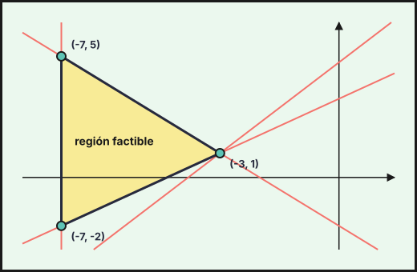{fig-alt="Región factible del ejercicio 2 (2021-ext), con sus vértices: (-7, -2), (-3, 1), (-7, 5)" width="75%" fig-align="center"}

**b) Máximo y mínimo de $G$.** Se evalúa $G(x,y)=-\dfrac15x+\dfrac52y$ en los vértices:
- $G(-7,-2)=\dfrac{7}{5}-5=-\dfrac{18}{5}$,
- $G(-7,5)=\dfrac{7}{5}+\dfrac{25}{2}=\dfrac{139}{10}$,
- $G(-3,1)=\dfrac{3}{5}+\dfrac{5}{2}=\dfrac{31}{10}$.

**Mínimo $-\dfrac{18}{5}$ en $(-7,-2)$ y máximo $\dfrac{139}{10}$ en $(-7,5)$.**

**c) ¿Puede valer $\dfrac{47}{3}$?** En la región (acotada) todos los valores de $G$ están entre su mínimo y su máximo. Como $\dfrac{47}{3}\approx15{,}67>\dfrac{139}{10}=13{,}9$, que es el máximo de $G$ en la región, **no puede alcanzar ese valor.**
::::
:::::

### Extraordinaria · Reserva 2021

::::: {.ebau-ej #ebau-2021-ext-res-1}
**Ejercicio 1** · Extraordinaria · Reserva 2021 · Bloque A · *(2,5 puntos)* · [Examen](../../../assets/pau-ccss/2021-ext-res/examen.pdf){target="_blank"}

La Agencia Espacial Europea contará con un presupuesto de 2,4 millones de euros para financiar misiones sobre Observación de la Tierra y para financiar programas de Transporte Espacial. Cada misión supone una inversión de 200 000 euros y cada programa, 100 000 euros. Teniendo en cuenta que en la decisión final deben superarse los 2 millones de euros de inversión y el número de misiones debe ser al menos 4, pero no más de la mitad del número de programas, ¿cuántas misiones y cuántos programas se deben llevar a cabo para obtener el máximo de la función $F(x,y)=0{,}6x+0{,}4y$, con $x$ misiones e $y$ programas?

:::: {.callout-note collapse="true" appearance="simple"}
## Ayuda 1 · Recordatorio

**Programación lineal: planteamiento.**

Programación lineal: se optimiza una **función objetivo** $F(x,y)$ sujeta a **restricciones** lineales (desigualdades). Las condiciones de no negatividad $x\ge0,\ y\ge0$ suelen estar implícitas en el contexto.

**Programación lineal: región factible y óptimo.**

La región factible es la intersección de los semiplanos de las restricciones. Si está acotada, el óptimo de $F$ se alcanza en un **vértice** (o en todo un lado si la recta de nivel es paralela a él).
::::

:::: {.callout-note collapse="true" appearance="simple"}
## Ayuda 2 · Método

**Programación lineal: planteamiento.**

1. Define $x$ e $y$ (cantidad de cada producto, con unidades).
2. Escribe una desigualdad por cada limitación («como máximo» $\le$, «al menos» $\ge$) y la función objetivo (beneficio, coste, número de unidades…).
3. Ordena los datos en una tabla (recursos por unidad de producto) para no confundir coeficientes.

**Programación lineal: región factible y óptimo.**

1. Dibuja cada recta (dos puntos) y sombrea el semiplano que cumple la desigualdad probando el punto $(0,0)$.
2. Marca la región común y halla los vértices resolviendo los sistemas de dos rectas que se cortan en ellos.
3. Evalúa $F$ en cada vértice y elige el mayor (máximo) o el menor (mínimo).
4. Responde con el contexto: valores de $x$ e $y$, valor óptimo y, si lo piden, recursos sobrantes.
::::

:::: {.callout-tip collapse="true" appearance="simple"}
## Solución

1. **Incógnitas.** $x$ = número de misiones, $y$ = número de programas. La inversión total, en millones de euros, es $0{,}2x+0{,}1y$ (200 000 € = $0{,}2$ millones por misión y 100 000 € = $0{,}1$ por programa).
2. **Restricciones.**
   - Presupuesto de $2{,}4$ millones: $0{,}2x+0{,}1y\le2{,}4\iff2x+y\le24$.
   - Hay que superar los 2 millones: $0{,}2x+0{,}1y\ge2\iff2x+y\ge20$.
   - Al menos 4 misiones: $x\ge4$.
   - Misiones no más de la mitad de los programas: $x\le\dfrac y2\iff2x\le y$.
3. **Región factible.** Es la zona del plano entre las rectas $2x+y=20$ y $2x+y=24$, a la derecha de $x=4$ y por encima de $y=2x$ (se comprueba cada semiplano con un punto de prueba).
4. **Vértices** (cortes de dos rectas de la frontera):
   - $x=4$ con $2x+y=20$: $(4,12)$.
   - $x=4$ con $2x+y=24$: $(4,16)$.
   - $y=2x$ con $2x+y=20$: $(5,10)$.
   - $y=2x$ con $2x+y=24$: $(6,12)$.
5. **Función objetivo** $F(x,y)=0{,}6x+0{,}4y$ en cada vértice:

| Vértice | $(4,12)$ | $(4,16)$ | $(5,10)$ | $(6,12)$ |
|---|---|---|---|---|
| $F=0{,}6x+0{,}4y$ | $7{,}2$ | $8{,}8$ | $7$ | $8{,}4$ |

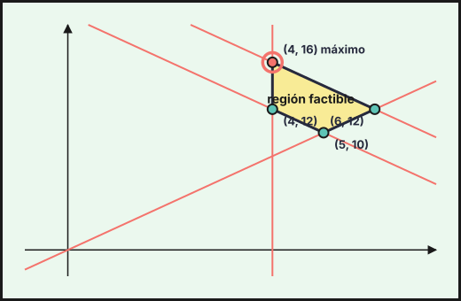{fig-alt="Región factible del ejercicio 1 (2021-ext-res), con sus vértices: (4, 12), (5, 10), (6, 12), (4, 16)" width="75%" fig-align="center"}

6. **Conclusión.** El máximo está en $(4,16)$.

**Hay que llevar a cabo 4 misiones y 16 programas, y el máximo de $F$ es $8{,}8$.** (Inversión: $0{,}2\cdot4+0{,}1\cdot16=2{,}4$ millones, todo el presupuesto.)
::::
:::::

### Extraordinaria · Suplente 2021

::::: {.ebau-ej #ebau-2021-ext-sup-1}
**Ejercicio 1** · Extraordinaria · Suplente 2021 · Bloque A · *(2,5 puntos)* · [Examen](../../../assets/pau-ccss/2021-ext-sup/examen.pdf){target="_blank"}

Un laboratorio farmacéutico tiene una línea de producción con dos medicamentos $A$ y $B$, con marca comercial y genérico respectivamente, de los cuales, entre los dos como máximo puede fabricar 10 unidades a la hora. Desde el punto de vista del rendimiento, se han de producir al menos 4 unidades por hora entre los dos y por motivos de política sanitaria, la producción de $A$ ha de ser como mucho 2 unidades más que la de $B$.

Cada unidad de tipo $A$ que vende le produce un beneficio de 60 euros, mientras que cada unidad de tipo $B$ le produce un beneficio de 25 euros. Si se vende todo lo que se produce, determine las unidades de cada medicamento que deberá fabricar por hora para maximizar su beneficio y obtenga el valor de dicho beneficio.

:::: {.callout-note collapse="true" appearance="simple"}
## Ayuda 1 · Recordatorio

**Programación lineal: planteamiento.**

Programación lineal: se optimiza una **función objetivo** $F(x,y)$ sujeta a **restricciones** lineales (desigualdades). Las condiciones de no negatividad $x\ge0,\ y\ge0$ suelen estar implícitas en el contexto.

**Programación lineal: región factible y óptimo.**

La región factible es la intersección de los semiplanos de las restricciones. Si está acotada, el óptimo de $F$ se alcanza en un **vértice** (o en todo un lado si la recta de nivel es paralela a él).
::::

:::: {.callout-note collapse="true" appearance="simple"}
## Ayuda 2 · Método

**Programación lineal: planteamiento.**

1. Define $x$ e $y$ (cantidad de cada producto, con unidades).
2. Escribe una desigualdad por cada limitación («como máximo» $\le$, «al menos» $\ge$) y la función objetivo (beneficio, coste, número de unidades…).
3. Ordena los datos en una tabla (recursos por unidad de producto) para no confundir coeficientes.

**Programación lineal: región factible y óptimo.**

1. Dibuja cada recta (dos puntos) y sombrea el semiplano que cumple la desigualdad probando el punto $(0,0)$.
2. Marca la región común y halla los vértices resolviendo los sistemas de dos rectas que se cortan en ellos.
3. Evalúa $F$ en cada vértice y elige el mayor (máximo) o el menor (mínimo).
4. Responde con el contexto: valores de $x$ e $y$, valor óptimo y, si lo piden, recursos sobrantes.
::::

:::: {.callout-tip collapse="true" appearance="simple"}
## Solución

1. **Incógnitas.** $x$ = unidades de $A$ por hora, $y$ = unidades de $B$ por hora.
2. **Restricciones.**
   - Como máximo 10 unidades entre las dos: $x+y\le10$.
   - Al menos 4 entre las dos: $x+y\ge4$.
   - $A$ como mucho 2 unidades más que $B$: $x\le y+2$, es decir, $x-y\le2$.
   - No negatividad: $x\ge0$, $y\ge0$.
3. **Función objetivo.** Beneficio $B(x,y)=60x+25y$.
4. **Vértices** de la región factible (cortes de rectas de la frontera): $(0,4)$ ($x=0$ con $x+y=4$), $(0,10)$ ($x=0$ con $x+y=10$), $(6,4)$ ($x+y=10$ con $x-y=2$) y $(3,1)$ ($x+y=4$ con $x-y=2$).
5. **Beneficio en cada vértice:**

| Vértice | $(0,4)$ | $(0,10)$ | $(6,4)$ | $(3,1)$ |
|---|---|---|---|---|
| $B$ | $100$ | $250$ | $460$ | $205$ |

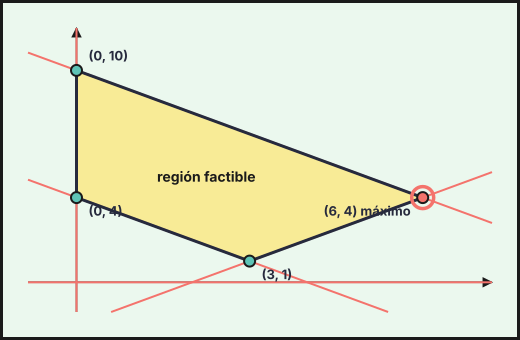{fig-alt="Región factible del ejercicio 1 (2021-ext-sup), con sus vértices: (0, 4), (3, 1), (6, 4), (0, 10)" width="75%" fig-align="center"}

6. **Conclusión.** El mayor valor es $460$, en $(6,4)$. Se cumple la limitación de $A$: $6\le4+2$.

**Debe fabricar 6 unidades de $A$ y 4 de $B$ por hora, con un beneficio máximo de $460$ €.**
::::
:::::

## También trabajan este tema

Ejercicios cuyo tema principal es otro pero en los que aparece este tema:

- [2025 Ordinaria · Modelo B, ejercicio 1](02-sistemas-ecuaciones-lineales.qmd#ebau-2025-ord-b-1) (tema principal: Sistemas de ecuaciones lineales)

---

*Enunciados: Prueba de Acceso y Admisión a la Universidad (PEvAU hasta 2024, PAU desde 2025), Matemáticas Aplicadas a las Ciencias Sociales II, Andalucía, Ceuta, Melilla y centros en Marruecos (Distrito Único Andaluz). Cada ejercicio enlaza al PDF oficial del examen completo. La clasificación por temas es propia y puede discutirse: los ejercicios mixtos figuran en su tema principal.*
