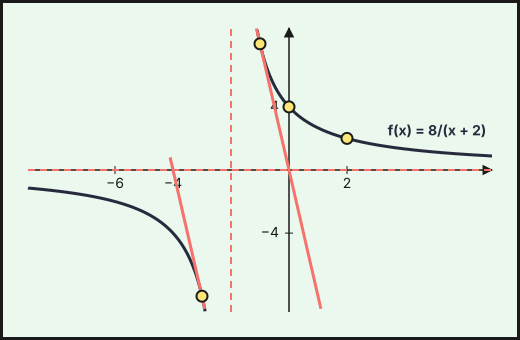
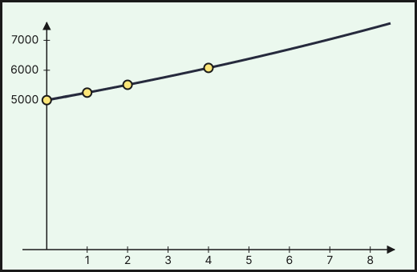
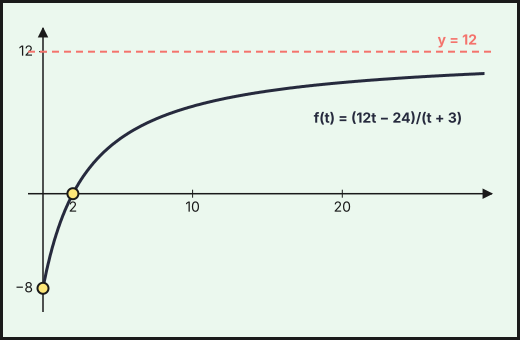
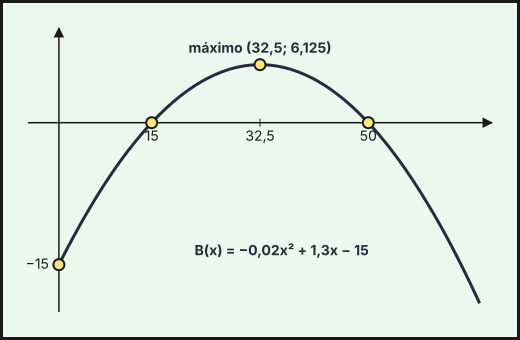
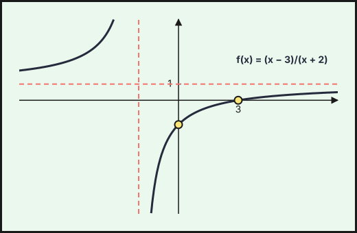

Ejercicios de **Matemáticas Aplicadas a las Ciencias Sociales II** de la prueba de acceso a la universidad en Andalucía (PAU, antes PEvAU) de **2021 a 2026** cuyo tema principal es *funciones*: **9 ejercicios** de convocatorias ordinarias y extraordinarias y de sus reservas o suplentes. Repasa antes la [teoría](../../../apuntes/2-bachillerato-ccss/04-funciones/index.qmd), los [ejercicios del tema](../04-funciones/index.qmd) y las [actividades interactivas](../../../actividades/2-bachillerato-ccss/04-funciones/index.qmd).

Debajo de cada ejercicio hay tres desplegables, de menos a más ayuda: **Ayuda 1 · Recordatorio** (la teoría que necesitas, sin tocar los datos), **Ayuda 2 · Método** (los pasos a seguir) y la **resolución breve** con el resultado. Inténtalo con la menor ayuda posible.

## 2026

### Ordinaria · Suplente 1 2026

::::: {.ebau-ej #ebau-2026-ord-sup1-2B}
**Ejercicio 2B** · Ordinaria · Suplente 1 2026 · Bloque B · *(3 puntos)* · [Examen](../../../assets/pau-ccss/2026-ord-sup1/examen.pdf){target="_blank"}

Se considera la función $f(x)=1-\dfrac{x-6}{2+x}$.

a) Halle su dominio y determine sus asíntotas. *(0,75 puntos)*

b) Estudie la monotonía y la curvatura, calculando los extremos relativos y los puntos de inflexión. *(1 punto)*

c) Represente gráficamente $f$. *(0,5 puntos)*

d) Determine la ecuación de la recta tangente a la gráfica de $f$ en todos aquellos puntos donde la pendiente de dicha recta vale $-8$. *(0,75 puntos)*

*Relacionado también con:* [Límites y continuidad](05-limites-continuidad.qmd), [Derivadas](06-derivadas.qmd), [Aplicaciones de la derivada](07-aplicaciones-derivada.qmd).

:::: {.callout-note collapse="true" appearance="simple"}
## Ayuda 1 · Recordatorio

**Dominio, cortes y simetrías.** Dominio: excluye los puntos donde se anula un denominador, el radicando de una raíz de índice par es negativo o el argumento de un logaritmo no es positivo. Cortes: con el eje $X$ se resuelve $f(x)=0$; con el eje $Y$ se calcula $f(0)$.

**Límites y asíntotas.** Asíntota vertical $x=a$: $\lim_{x\to a}f(x)=\pm\infty$. Horizontal $y=b$: $\lim_{x\to\pm\infty}f(x)=b$. Oblicua $y=mx+n$: $m=\lim\dfrac{f(x)}{x}$, $n=\lim\,(f(x)-mx)$. Indeterminaciones $\dfrac{0}{0}$ (factoriza o L'Hôpital), $\dfrac{\infty}{\infty}$ (mayor grado), $\infty-\infty$ (opera).

**Monotonía y extremos relativos.** $f'>0$ en un intervalo: creciente; $f'<0$: decreciente. Un extremo relativo en $x=a$ exige $f'(a)=0$; es mínimo si $f'$ pasa de $-$ a $+$ (o $f''(a)>0$) y máximo si pasa de $+$ a $-$ (o $f''(a)<0$).

**Curvatura y puntos de inflexión.** $f''>0$: convexa; $f''<0$: cóncava. Punto de inflexión en $x=a$: $f''(a)=0$ y $f''$ cambia de signo.

**Representar una función.** Una gráfica se construye con: dominio, cortes con los ejes, asíntotas, monotonía y extremos (con $f'$), curvatura y puntos de inflexión (con $f''$), y una tabla de valores. Convexa si $f''>0$ y cóncava si $f''<0$.
::::

:::: {.callout-note collapse="true" appearance="simple"}
## Ayuda 2 · Método

**Dominio, cortes y simetrías.** 1. Halla el dominio y escríbelo como unión de intervalos.
2. Calcula los cortes con los ejes.
3. Estudia el signo de $f$ entre los puntos que anulan $f$ o su denominador.

**Límites y asíntotas.** 1. Para asíntotas verticales, busca los puntos que anulan el denominador y calcula los límites laterales.
2. Para las horizontales, calcula el límite en $+\infty$ y en $-\infty$.
3. Si no hay horizontal en ese lado, prueba la oblicua.
4. Escribe las ecuaciones de las rectas.

**Monotonía y extremos relativos.** 1. Halla el dominio y calcula $f'(x)$.
2. Resuelve $f'(x)=0$ y localiza también los puntos donde $f'$ no existe.
3. Con esos puntos divide el dominio y estudia el signo de $f'$ en cada intervalo.
4. Escribe intervalos de crecimiento y decrecimiento, y los extremos con sus coordenadas $(a,f(a))$.

**Curvatura y puntos de inflexión.** 1. Calcula $f''(x)$ y resuelve $f''(x)=0$.
2. Estudia el signo de $f''$ en los intervalos que quedan.
3. Indica los intervalos de convexidad y concavidad, y las coordenadas de los puntos de inflexión.

**Representar una función.** 1. Dominio y cortes.
2. Asíntotas verticales, horizontales y oblicuas con límites.
3. Signo de $f'$: intervalos de crecimiento y extremos.
4. Signo de $f''$ si hace falta, y unos cuantos puntos.
5. Dibuja y comprueba que la gráfica respeta todos los datos anteriores.
::::

:::: {.callout-tip collapse="true" appearance="simple"}
## Solución

**a)** $f(x)=1-\dfrac{x-6}{x+2}=\dfrac{(x+2)-(x-6)}{x+2}=\dfrac{8}{x+2}$. **Dominio: $\mathbb R\setminus\{-2\}$.** Asíntotas: vertical $x=-2$ y horizontal $y=\displaystyle\lim_{x\to\pm\infty}\dfrac{8}{x+2}=0$.

**Asíntotas: $x=-2$ e $y=0$.**

**b)** $f'(x)=-\dfrac{8}{(x+2)^2}<0$: **$f$ es decreciente en $(-\infty,-2)$ y en $(-2,+\infty)$; no tiene extremos relativos.** $f''(x)=\dfrac{16}{(x+2)^3}$: **convexa en $(-2,+\infty)$ ($f''>0$) y cóncava en $(-\infty,-2)$ ($f''<0$); no tiene puntos de inflexión** (en $x=-2$ no está definida).

**c)** Hipérbola $y=\dfrac{8}{x+2}$ con asíntotas $x=-2$ e $y=0$: la rama derecha ($x>-2$) está por encima del eje, pasa por $(0,4)$ y $(2,2)$ y baja hacia $0$; la rama izquierda ($x<-2$) está por debajo del eje, pasa por $(-4,-4)$ y $(-6,-2)$.

**d)** $f'(x)=-8\iff\dfrac{8}{(x+2)^2}=8\iff(x+2)^2=1\iff x=-1$ o $x=-3$.

- $x=-1$: $f(-1)=8$; tangente $y-8=-8(x+1)$, es decir, **$y=-8x$.**
- $x=-3$: $f(-3)=-8$; tangente $y+8=-8(x+3)$, es decir, **$y=-8x-32$.**

{fig-alt="Hipérbola f(x)=8/(x+2) con asíntotas x=−2 e y=0 y las dos rectas tangentes de pendiente −8: y=−8x en (−1,8) e y=−8x−32 en (−3,−8)" width="75%" fig-align="center"}
::::
:::::

### Extraordinaria · Suplente 2 2026

::::: {.ebau-ej #ebau-2026-ext-sup2-2}
**Ejercicio 2** · Extraordinaria · Suplente 2 2026 · Bloque B · *(3 puntos)* · [Examen](../../../assets/pau-ccss/2026-ext-sup2/examen.pdf){target="_blank"}

Una nueva plataforma de streaming realiza una prueba de funcionamiento durante un trimestre (13 semanas). Se estima que el índice de aceptación de esta plataforma evolucionará de acuerdo con la función
$$I(t)=\frac{1}{100}\cdot2^{t};\qquad0\le t\le13$$
siendo $t$ el tiempo transcurrido (en semanas) desde su inicio.

a) Obtenga el intervalo en el que el índice va aumentando. *(0,75 puntos)*

b) ¿En cuántas semanas se obtendrá un índice de aceptación de $10{,}24$? *(0,75 puntos)*

c) Calcule la tasa de crecimiento instantánea transcurridas 5 semanas. *(0,75 puntos)*

d) ¿Es posible alcanzar un índice de aceptación de 90 durante el trimestre? *(0,75 puntos)*

*Relacionado también con:* [Derivadas](06-derivadas.qmd), [Aplicaciones de la derivada](07-aplicaciones-derivada.qmd).

:::: {.callout-note collapse="true" appearance="simple"}
## Ayuda 1 · Recordatorio

$f'>0$ en un intervalo: creciente; $f'<0$: decreciente. Un extremo relativo en $x=a$ exige $f'(a)=0$; es mínimo si $f'$ pasa de $-$ a $+$ (o $f''(a)>0$) y máximo si pasa de $+$ a $-$ (o $f''(a)<0$).
::::

:::: {.callout-note collapse="true" appearance="simple"}
## Ayuda 2 · Método

1. Halla el dominio y calcula $f'(x)$.
2. Resuelve $f'(x)=0$ y localiza también los puntos donde $f'$ no existe.
3. Con esos puntos divide el dominio y estudia el signo de $f'$ en cada intervalo.
4. Escribe intervalos de crecimiento y decrecimiento, y los extremos con sus coordenadas $(a,f(a))$.
::::

:::: {.callout-tip collapse="true" appearance="simple"}
## Solución

**a)** $I'(t)=\dfrac{\ln2}{100}\cdot2^t>0$ para todo $t$: **el índice aumenta en todo el intervalo $[0,13]$.**

**b)** $I(t)=10{,}24\iff\dfrac{2^t}{100}=10{,}24\iff2^t=1\,024=2^{10}\iff t=10$.

**Se obtendrá a las $10$ semanas.**

**c)** La tasa de crecimiento instantánea es $I'(5)=\dfrac{\ln2}{100}\cdot2^5=0{,}32\ln2\approx0{,}2218$.

**$I'(5)\approx0{,}22$ puntos de índice por semana.**

**d)** $I$ es creciente, luego su máximo en el trimestre está en $t=13$: $I(13)=\dfrac{2^{13}}{100}=\dfrac{8\,192}{100}=81{,}92<90$.

**No es posible alcanzar un índice de $90$ durante el trimestre** (el máximo es $81{,}92$).
::::
:::::

## 2025

### Ordinaria · Modelo B 2025

::::: {.ebau-ej #ebau-2025-ord-b-3}
**Ejercicio 3** · Ordinaria · Modelo B 2025 · Bloque B · *(2,5 puntos)* · [Examen](../../../assets/pau-ccss/2025-ord-b/examen.pdf){target="_blank"}

Trinidad, una persona ahorradora, deposita $5\,000$ € en un fondo de inversión y el capital final que obtiene cuando transcurren $t$ años viene dado por la siguiente función:
$$f(t)=\begin{cases}5\,000\cdot(1+0{,}05t)&0\le t\le1\\5\,000\cdot1{,}05^{t}&t>1\end{cases}$$

a) ¿Cuánto tiempo debe mantener invertido el dinero si el capital final que se obtiene es de $5\,931{,}10$ €? *(0,75 puntos)*

b) Calcule los intereses que obtiene Trinidad entre el año 2 y el año 4, si se conoce que los intereses que genera esta inversión entre el año $t_1$ y el año $t_2$ vienen dados por $I=f(t_2)-f(t_1)$. *(0,5 puntos)*

c) Estudie la continuidad y derivabilidad de la función $f$. *(0,75 puntos)*

d) Estudie la monotonía de la función $f$ y esboce su gráfica. *(0,5 puntos)*

*Relacionado también con:* [Límites y continuidad](05-limites-continuidad.qmd), [Derivadas](06-derivadas.qmd), [Aplicaciones de la derivada](07-aplicaciones-derivada.qmd).

:::: {.callout-note collapse="true" appearance="simple"}
## Ayuda 1 · Recordatorio

**Monotonía y extremos relativos.** $f'>0$ en un intervalo: creciente; $f'<0$: decreciente. Un extremo relativo en $x=a$ exige $f'(a)=0$; es mínimo si $f'$ pasa de $-$ a $+$ (o $f''(a)>0$) y máximo si pasa de $+$ a $-$ (o $f''(a)<0$).

**Representar una función.** Una gráfica se construye con: dominio, cortes con los ejes, asíntotas, monotonía y extremos (con $f'$), curvatura y puntos de inflexión (con $f''$), y una tabla de valores. Convexa si $f''>0$ y cóncava si $f''<0$.
::::

:::: {.callout-note collapse="true" appearance="simple"}
## Ayuda 2 · Método

**Monotonía y extremos relativos.** 1. Halla el dominio y calcula $f'(x)$.
2. Resuelve $f'(x)=0$ y localiza también los puntos donde $f'$ no existe.
3. Con esos puntos divide el dominio y estudia el signo de $f'$ en cada intervalo.
4. Escribe intervalos de crecimiento y decrecimiento, y los extremos con sus coordenadas $(a,f(a))$.

**Representar una función.** 1. Dominio y cortes.
2. Asíntotas verticales, horizontales y oblicuas con límites.
3. Signo de $f'$: intervalos de crecimiento y extremos.
4. Signo de $f''$ si hace falta, y unos cuantos puntos.
5. Dibuja y comprueba que la gráfica respeta todos los datos anteriores.
::::

:::: {.callout-tip collapse="true" appearance="simple"}
## Solución

**a)** En $0\le t\le1$ el capital es como máximo $5\,000\cdot1{,}05=5\,250<5\,931{,}10$, así que $t>1$: $5\,000\cdot1{,}05^t=5\,931{,}10\iff1{,}05^t=1{,}18622\iff t=\dfrac{\ln1{,}18622}{\ln1{,}05}\approx3{,}5$.

**Debe mantenerlo invertido unos $3{,}5$ años.**

**b)** $I=f(4)-f(2)=5\,000\cdot1{,}05^4-5\,000\cdot1{,}05^2=6\,077{,}53-5\,512{,}50=565{,}03$.

**Intereses: $565{,}03$ €.**

**c)** En $t=1$: $\displaystyle\lim_{t\to1^-}f=5\,000\cdot1{,}05=5\,250$ y $\displaystyle\lim_{t\to1^+}f=5\,000\cdot1{,}05=5\,250=f(1)$: **continua.** Derivadas: $f'(t)=250$ si $0<t<1$ y $f'(t)=5\,000\cdot1{,}05^t\ln1{,}05$ si $t>1$. En $t=1$: $f'(1^-)=250$ y $f'(1^+)=5\,250\ln1{,}05\approx256{,}15$. **No derivable en $t=1$.**

**$f$ es continua en $[0,+\infty)$ y derivable en $[0,+\infty)\setminus\{1\}$.**

**d)** $f'(t)>0$ en ambos tramos: **$f$ es creciente en $[0,+\infty)$.** Gráfica: segmento de recta de $(0,5\,000)$ a $(1,5\,250)$ y, a partir de ahí, curva exponencial creciente y convexa que pasa por $(2,5\,512{,}5)$ y $(4,6\,077{,}5)$.

{fig-alt="Capital f(t): segmento de recta de 5000 a 5250 en el primer año y, después, curva exponencial 5000·1,05^t creciente" width="75%" fig-align="center"}
::::
:::::

### Ordinaria · Suplente 1 · Modelo B 2025

::::: {.ebau-ej #ebau-2025-ord-sup1-b-3}
**Ejercicio 3** · Ordinaria · Suplente 1 · Modelo B 2025 · Bloque B · *(2,5 puntos)* · [Examen](../../../assets/pau-ccss/2025-ord-sup1-b/examen.pdf){target="_blank"}

Un grupo de emprendedores valora crear una empresa y, para ello, ha encargado un estudio de mercado en el que se estima que los beneficios para los próximos 10 años, en millones de euros, vendrán dados por la función:
$$B(t)=\frac{3t}{t+2}-1;\qquad0\le t\le10$$
donde $t$ representa los años transcurridos desde la apertura de la empresa.

a) ¿En qué intervalo de tiempo la empresa no tendrá beneficios? *(0,5 puntos)*

b) ¿En qué momento se alcanza el máximo beneficio y a cuánto asciende su valor? *(0,75 puntos)*

c) ¿Cuánto tiempo ha de pasar para que la empresa obtenga un beneficio de $800\,000$ €? *(0,75 puntos)*

d) Si la función de beneficios se mantuviera y transcurrieran los años de manera indefinida, ¿a qué valor tendería el beneficio de la empresa? *(0,5 puntos)*

*Relacionado también con:* [Límites y continuidad](05-limites-continuidad.qmd), [Derivadas](06-derivadas.qmd), [Aplicaciones de la derivada](07-aplicaciones-derivada.qmd).

:::: {.callout-note collapse="true" appearance="simple"}
## Ayuda 1 · Recordatorio

**Monotonía y extremos relativos.** $f'>0$ en un intervalo: creciente; $f'<0$: decreciente. Un extremo relativo en $x=a$ exige $f'(a)=0$; es mínimo si $f'$ pasa de $-$ a $+$ (o $f''(a)>0$) y máximo si pasa de $+$ a $-$ (o $f''(a)<0$).

**Representar una función.** Una gráfica se construye con: dominio, cortes con los ejes, asíntotas, monotonía y extremos (con $f'$), curvatura y puntos de inflexión (con $f''$), y una tabla de valores. Convexa si $f''>0$ y cóncava si $f''<0$.
::::

:::: {.callout-note collapse="true" appearance="simple"}
## Ayuda 2 · Método

**Monotonía y extremos relativos.** 1. Halla el dominio y calcula $f'(x)$.
2. Resuelve $f'(x)=0$ y localiza también los puntos donde $f'$ no existe.
3. Con esos puntos divide el dominio y estudia el signo de $f'$ en cada intervalo.
4. Escribe intervalos de crecimiento y decrecimiento, y los extremos con sus coordenadas $(a,f(a))$.

**Representar una función.** 1. Dominio y cortes.
2. Asíntotas verticales, horizontales y oblicuas con límites.
3. Signo de $f'$: intervalos de crecimiento y extremos.
4. Signo de $f''$ si hace falta, y unos cuantos puntos.
5. Dibuja y comprueba que la gráfica respeta todos los datos anteriores.
::::

:::: {.callout-tip collapse="true" appearance="simple"}
## Solución

**a)** $B(t)=\dfrac{3t-(t+2)}{t+2}=\dfrac{2t-2}{t+2}$, que es negativa para $t<1$, nula en $t=1$ y positiva para $t>1$.

**No tiene beneficios en el intervalo $[0,1]$** (pérdidas hasta el año $1$ y beneficio nulo en $t=1$).

**b)** $B'(t)=\dfrac{3(t+2)-3t}{(t+2)^2}=\dfrac{6}{(t+2)^2}>0$: $B$ es creciente, luego el máximo está en el extremo $t=10$: $B(10)=\dfrac{30}{12}-1=\dfrac{3}{2}$.

**El máximo beneficio se alcanza a los $10$ años y asciende a $1{,}5$ millones de euros.**

**c)** $B(t)=0{,}8\iff\dfrac{3t}{t+2}=1{,}8\iff3t=1{,}8t+3{,}6\iff1{,}2t=3{,}6\iff t=3$.

**Han de pasar $3$ años.**

**d)** $\displaystyle\lim_{t\to+\infty}B(t)=\lim_{t\to+\infty}\left(\frac{3t}{t+2}-1\right)=3-1=2$.

**El beneficio tendería a $2$ millones de euros** (asíntota horizontal $y=2$).
::::
:::::

### Ordinaria · Suplente 2 · Modelo B 2025

::::: {.ebau-ej #ebau-2025-ord-sup2-b-3}
**Ejercicio 3** · Ordinaria · Suplente 2 · Modelo B 2025 · Bloque B · *(2,5 puntos)* · [Examen](../../../assets/pau-ccss/2025-ord-sup2-b/examen.pdf){target="_blank"}

El Cesio 137 es un elemento radioactivo que se usa, entre otros, para tratamientos de radioterapia. La cantidad (en mg) de Cesio 137 que queda en el lugar de almacenamiento, transcurrido un número de años $t$, viene dada por la función:
$$f(t)=10\cdot\left(\frac{1}{2}\right)^{t/30};\qquad t\ge0$$

a) Calcule los años que deben pasar para que la cantidad de Cesio 137 que quede en el almacén sea la mitad de la que había al inicio. *(0,5 puntos)*

b) Calcule la ecuación de la recta tangente a la gráfica de la función $f$, en el punto de abscisa $t=10$. *(1,25 puntos)*

c) Indique si la función tiene asíntotas horizontales y verticales. En caso afirmativo, calcúlelas. *(0,75 puntos)*

*Relacionado también con:* [Límites y continuidad](05-limites-continuidad.qmd), [Derivadas](06-derivadas.qmd).

:::: {.callout-note collapse="true" appearance="simple"}
## Ayuda 1 · Recordatorio

**Límites y asíntotas.** Asíntota vertical $x=a$: $\lim_{x\to a}f(x)=\pm\infty$. Horizontal $y=b$: $\lim_{x\to\pm\infty}f(x)=b$. Oblicua $y=mx+n$: $m=\lim\dfrac{f(x)}{x}$, $n=\lim\,(f(x)-mx)$. Indeterminaciones $\dfrac{0}{0}$ (factoriza o L'Hôpital), $\dfrac{\infty}{\infty}$ (mayor grado), $\infty-\infty$ (opera).

**Representar una función.** Una gráfica se construye con: dominio, cortes con los ejes, asíntotas, monotonía y extremos (con $f'$), curvatura y puntos de inflexión (con $f''$), y una tabla de valores. Convexa si $f''>0$ y cóncava si $f''<0$.
::::

:::: {.callout-note collapse="true" appearance="simple"}
## Ayuda 2 · Método

**Límites y asíntotas.** 1. Para asíntotas verticales, busca los puntos que anulan el denominador y calcula los límites laterales.
2. Para las horizontales, calcula el límite en $+\infty$ y en $-\infty$.
3. Si no hay horizontal en ese lado, prueba la oblicua.
4. Escribe las ecuaciones de las rectas.

**Representar una función.** 1. Dominio y cortes.
2. Asíntotas verticales, horizontales y oblicuas con límites.
3. Signo de $f'$: intervalos de crecimiento y extremos.
4. Signo de $f''$ si hace falta, y unos cuantos puntos.
5. Dibuja y comprueba que la gráfica respeta todos los datos anteriores.
::::

:::: {.callout-tip collapse="true" appearance="simple"}
## Solución

**a)** $f(t)=5\iff10\left(\dfrac{1}{2}\right)^{t/30}=5\iff\left(\dfrac{1}{2}\right)^{t/30}=\dfrac{1}{2}\iff\dfrac{t}{30}=1$.

**Deben pasar $30$ años.**

**b)** $f(10)=10\cdot2^{-1/3}\approx7{,}937$. $f'(t)=10\left(\dfrac{1}{2}\right)^{t/30}\cdot\dfrac{\ln(1/2)}{30}=-\dfrac{\ln2}{3}\cdot2^{-t/30}$, luego $f'(10)=-\dfrac{\ln2}{3}\cdot2^{-1/3}\approx-0{,}1834$.

Tangente: $y-7{,}937=-0{,}1834\,(t-10)$.

**$y=-0{,}1834\,t+9{,}771$** (es decir, $y=10\cdot2^{-1/3}-\dfrac{\ln2}{3}\,2^{-1/3}(t-10)$).

**c)** $\displaystyle\lim_{t\to+\infty}10\left(\frac{1}{2}\right)^{t/30}=0$: **asíntota horizontal $y=0$.** La función está definida y es continua para todo $t\ge0$: **no tiene asíntotas verticales.**
::::
:::::

## 2024

### Ordinaria · Suplente · Modelo B 2024

::::: {.ebau-ej #ebau-2024-ord-sup-b-3}
**Ejercicio 3** · Ordinaria · Suplente · Modelo B 2024 · Bloque B · *(2,5 puntos)* · [Examen](../../../assets/pau-ccss/2024-ord-sup-b/examen.pdf){target="_blank"}

Se considera la función $f(x)=1-\dfrac{4}{3+x}$.

a) Halle el dominio de $f$ y los puntos de corte de su gráfica con los ejes de coordenadas. *(0,75 puntos)*

b) Calcule las asíntotas de la función $f$. *(0,5 puntos)*

c) Obtenga los puntos donde la recta tangente a la gráfica de $f$ tiene pendiente $1$. *(0,75 puntos)*

d) Estudie la curvatura de la función $f$. *(0,5 puntos)*

*Relacionado también con:* [Límites y continuidad](05-limites-continuidad.qmd), [Derivadas](06-derivadas.qmd), [Aplicaciones de la derivada](07-aplicaciones-derivada.qmd).

:::: {.callout-note collapse="true" appearance="simple"}
## Ayuda 1 · Recordatorio

**Dominio, cortes y simetrías.** Dominio: excluye los puntos donde se anula un denominador, el radicando de una raíz de índice par es negativo o el argumento de un logaritmo no es positivo. Cortes: con el eje $X$ se resuelve $f(x)=0$; con el eje $Y$ se calcula $f(0)$.

**Límites y asíntotas.** Asíntota vertical $x=a$: $\lim_{x\to a}f(x)=\pm\infty$. Horizontal $y=b$: $\lim_{x\to\pm\infty}f(x)=b$. Oblicua $y=mx+n$: $m=\lim\dfrac{f(x)}{x}$, $n=\lim\,(f(x)-mx)$. Indeterminaciones $\dfrac{0}{0}$ (factoriza o L'Hôpital), $\dfrac{\infty}{\infty}$ (mayor grado), $\infty-\infty$ (opera).

**Curvatura y puntos de inflexión.** $f''>0$: convexa; $f''<0$: cóncava. Punto de inflexión en $x=a$: $f''(a)=0$ y $f''$ cambia de signo.

**Representar una función.** Una gráfica se construye con: dominio, cortes con los ejes, asíntotas, monotonía y extremos (con $f'$), curvatura y puntos de inflexión (con $f''$), y una tabla de valores. Convexa si $f''>0$ y cóncava si $f''<0$.
::::

:::: {.callout-note collapse="true" appearance="simple"}
## Ayuda 2 · Método

**Dominio, cortes y simetrías.** 1. Halla el dominio y escríbelo como unión de intervalos.
2. Calcula los cortes con los ejes.
3. Estudia el signo de $f$ entre los puntos que anulan $f$ o su denominador.

**Límites y asíntotas.** 1. Para asíntotas verticales, busca los puntos que anulan el denominador y calcula los límites laterales.
2. Para las horizontales, calcula el límite en $+\infty$ y en $-\infty$.
3. Si no hay horizontal en ese lado, prueba la oblicua.
4. Escribe las ecuaciones de las rectas.

**Curvatura y puntos de inflexión.** 1. Calcula $f''(x)$ y resuelve $f''(x)=0$.
2. Estudia el signo de $f''$ en los intervalos que quedan.
3. Indica los intervalos de convexidad y concavidad, y las coordenadas de los puntos de inflexión.

**Representar una función.** 1. Dominio y cortes.
2. Asíntotas verticales, horizontales y oblicuas con límites.
3. Signo de $f'$: intervalos de crecimiento y extremos.
4. Signo de $f''$ si hace falta, y unos cuantos puntos.
5. Dibuja y comprueba que la gráfica respeta todos los datos anteriores.
::::

:::: {.callout-tip collapse="true" appearance="simple"}
## Solución

**a)** Dominio: $\mathbb R\setminus\{-3\}$. Con $OX$: $f(x)=0\iff\dfrac{4}{3+x}=1\iff x=1$, punto $(1,0)$. Con $OY$: $f(0)=1-\dfrac{4}{3}=-\dfrac{1}{3}$, punto $\left(0,-\dfrac{1}{3}\right)$.

**b)** Vertical: $x=-3$ (el denominador se anula: $\displaystyle\lim_{x\to-3^-}f=+\infty$ y $\displaystyle\lim_{x\to-3^+}f=-\infty$). Horizontal: $\displaystyle\lim_{x\to\pm\infty}f(x)=1$.

**Asíntotas: $x=-3$ e $y=1$.**

**c)** $f'(x)=\dfrac{4}{(3+x)^2}=1\iff(3+x)^2=4\iff3+x=\pm2\iff x=-1$ o $x=-5$.

**Puntos: $f(-1)=1-\dfrac{4}{2}=-1$, es decir $(-1,-1)$, y $f(-5)=1-\dfrac{4}{-2}=3$, es decir $(-5,3)$.**

**d)** $f''(x)=-\dfrac{8}{(3+x)^3}$. Si $x>-3$, $f''<0$: **cóncava en $(-3,+\infty)$.** Si $x<-3$, $f''>0$: **convexa en $(-\infty,-3)$.** No hay puntos de inflexión ($x=-3$ no está en el dominio).
::::
:::::

## 2023

### Ordinaria · Modelo B 2023

::::: {.ebau-ej #ebau-2023-ord-b-4}
**Ejercicio 4** · Ordinaria · Modelo B 2023 · Bloque B · *(2,5 puntos)* · [Examen](../../../assets/pau-ccss/2023-ord-b/examen.pdf){target="_blank"}

Sea la función $f(t)=\dfrac{12t-24}{t+3};\quad t\ge0$.

a) Represente gráficamente la función $f$, determinando los puntos de corte con los ejes coordenados y las ecuaciones de las asíntotas, y estudiando la monotonía y la curvatura de $f$. *(1,5 puntos)*

b) Si la función $f$ representa los beneficios de una empresa, en millones de euros, donde $t$ indica los años de vida de la empresa:

b-1) ¿A partir de qué año la empresa deja de tener pérdidas? Justifique la respuesta. *(0,5 puntos)*

b-2) A medida que pasan los años, ¿están limitados los beneficios? En caso afirmativo, ¿cuál es su límite y por qué? *(0,5 puntos)*

*Relacionado también con:* [Derivadas](06-derivadas.qmd), [Aplicaciones de la derivada](07-aplicaciones-derivada.qmd).

:::: {.callout-note collapse="true" appearance="simple"}
## Ayuda 1 · Recordatorio

**Dominio, cortes y simetrías.** Dominio: excluye los puntos donde se anula un denominador, el radicando de una raíz de índice par es negativo o el argumento de un logaritmo no es positivo. Cortes: con el eje $X$ se resuelve $f(x)=0$; con el eje $Y$ se calcula $f(0)$.

**Límites y asíntotas.** Asíntota vertical $x=a$: $\lim_{x\to a}f(x)=\pm\infty$. Horizontal $y=b$: $\lim_{x\to\pm\infty}f(x)=b$. Oblicua $y=mx+n$: $m=\lim\dfrac{f(x)}{x}$, $n=\lim\,(f(x)-mx)$. Indeterminaciones $\dfrac{0}{0}$ (factoriza o L'Hôpital), $\dfrac{\infty}{\infty}$ (mayor grado), $\infty-\infty$ (opera).

**Monotonía y extremos relativos.** $f'>0$ en un intervalo: creciente; $f'<0$: decreciente. Un extremo relativo en $x=a$ exige $f'(a)=0$; es mínimo si $f'$ pasa de $-$ a $+$ (o $f''(a)>0$) y máximo si pasa de $+$ a $-$ (o $f''(a)<0$).

**Curvatura y puntos de inflexión.** $f''>0$: convexa; $f''<0$: cóncava. Punto de inflexión en $x=a$: $f''(a)=0$ y $f''$ cambia de signo.

**Representar una función.** Una gráfica se construye con: dominio, cortes con los ejes, asíntotas, monotonía y extremos (con $f'$), curvatura y puntos de inflexión (con $f''$), y una tabla de valores. Convexa si $f''>0$ y cóncava si $f''<0$.
::::

:::: {.callout-note collapse="true" appearance="simple"}
## Ayuda 2 · Método

**Dominio, cortes y simetrías.** 1. Halla el dominio y escríbelo como unión de intervalos.
2. Calcula los cortes con los ejes.
3. Estudia el signo de $f$ entre los puntos que anulan $f$ o su denominador.

**Límites y asíntotas.** 1. Para asíntotas verticales, busca los puntos que anulan el denominador y calcula los límites laterales.
2. Para las horizontales, calcula el límite en $+\infty$ y en $-\infty$.
3. Si no hay horizontal en ese lado, prueba la oblicua.
4. Escribe las ecuaciones de las rectas.

**Monotonía y extremos relativos.** 1. Halla el dominio y calcula $f'(x)$.
2. Resuelve $f'(x)=0$ y localiza también los puntos donde $f'$ no existe.
3. Con esos puntos divide el dominio y estudia el signo de $f'$ en cada intervalo.
4. Escribe intervalos de crecimiento y decrecimiento, y los extremos con sus coordenadas $(a,f(a))$.

**Curvatura y puntos de inflexión.** 1. Calcula $f''(x)$ y resuelve $f''(x)=0$.
2. Estudia el signo de $f''$ en los intervalos que quedan.
3. Indica los intervalos de convexidad y concavidad, y las coordenadas de los puntos de inflexión.

**Representar una función.** 1. Dominio y cortes.
2. Asíntotas verticales, horizontales y oblicuas con límites.
3. Signo de $f'$: intervalos de crecimiento y extremos.
4. Signo de $f''$ si hace falta, y unos cuantos puntos.
5. Dibuja y comprueba que la gráfica respeta todos los datos anteriores.
::::

:::: {.callout-tip collapse="true" appearance="simple"}
## Solución

**a)** Cortes: con el eje $OX$, $12t-24=0\Rightarrow t=2$, punto $(2,0)$; con el eje $OY$, $f(0)=-8$, punto $(0,-8)$. Asíntotas: vertical $t=-3$ (fuera del dominio $t\ge0$) y horizontal $y=\displaystyle\lim_{t\to+\infty}f(t)=12$.

$f'(t)=\dfrac{12(t+3)-(12t-24)}{(t+3)^2}=\dfrac{60}{(t+3)^2}>0$: **$f$ es creciente.** $f''(t)=-\dfrac{120}{(t+3)^3}<0$: **$f$ es cóncava.**

Gráfica: arco creciente y cóncavo que parte de $(0,-8)$, corta el eje en $(2,0)$ y se acerca por debajo a la recta $y=12$.

{fig-alt="Curva creciente y cóncava f(t)=(12t−24)/(t+3) para t≥0: parte de (0,−8), corta al eje en (2,0) y tiende a la asíntota y=12" width="75%" fig-align="center"}

**b-1)** $f(t)>0\iff t>2$: **la empresa deja de tener pérdidas a partir del año 2** (en $t=2$ el beneficio es nulo).

**b-2)** **Sí están limitados:** $f$ es creciente y $\displaystyle\lim_{t\to+\infty}f(t)=12$, luego los beneficios se acercan a $12$ millones de euros sin llegar a alcanzarlos (la recta $y=12$ es asíntota horizontal).
::::
:::::

## 2022

### Extraordinaria 2022

::::: {.ebau-ej #ebau-2022-ext-4}
**Ejercicio 4** · Extraordinaria 2022 · Bloque B · *(2,5 puntos)* · [Examen](../../../assets/pau-ccss/2022-ext/examen.pdf){target="_blank"}

El beneficio, en miles de euros, que se obtiene en una pequeña finca familiar por la venta de aceitunas, en miles de kilogramos, viene dado por la siguiente función:
$$B(x)=-0{,}02x^{2}+1{,}3x-15,\qquad x\ge0$$

a) Represente la función beneficio y calcule los puntos de corte con el eje $OX$. *(0,75 puntos)*

b) ¿Para qué valores de $x$ la finca no tiene pérdidas? *(0,5 puntos)*

c) ¿Para qué número de kilogramos el beneficio será máximo? ¿Cuánto vale dicho beneficio? *(0,5 puntos)*

d) ¿Cuántos kilogramos debe vender para obtener un beneficio de 5000 €? *(0,75 puntos)*

*Relacionado también con:* [Aplicaciones de la derivada](07-aplicaciones-derivada.qmd).

:::: {.callout-note collapse="true" appearance="simple"}
## Ayuda 1 · Recordatorio

**Dominio, cortes y simetrías.** Dominio: excluye los puntos donde se anula un denominador, el radicando de una raíz de índice par es negativo o el argumento de un logaritmo no es positivo. Cortes: con el eje $X$ se resuelve $f(x)=0$; con el eje $Y$ se calcula $f(0)$.

**Monotonía y extremos relativos.** $f'>0$ en un intervalo: creciente; $f'<0$: decreciente. Un extremo relativo en $x=a$ exige $f'(a)=0$; es mínimo si $f'$ pasa de $-$ a $+$ (o $f''(a)>0$) y máximo si pasa de $+$ a $-$ (o $f''(a)<0$).

**Representar una función.** Una gráfica se construye con: dominio, cortes con los ejes, asíntotas, monotonía y extremos (con $f'$), curvatura y puntos de inflexión (con $f''$), y una tabla de valores. Convexa si $f''>0$ y cóncava si $f''<0$.
::::

:::: {.callout-note collapse="true" appearance="simple"}
## Ayuda 2 · Método

**Dominio, cortes y simetrías.** 1. Halla el dominio y escríbelo como unión de intervalos.
2. Calcula los cortes con los ejes.
3. Estudia el signo de $f$ entre los puntos que anulan $f$ o su denominador.

**Monotonía y extremos relativos.** 1. Halla el dominio y calcula $f'(x)$.
2. Resuelve $f'(x)=0$ y localiza también los puntos donde $f'$ no existe.
3. Con esos puntos divide el dominio y estudia el signo de $f'$ en cada intervalo.
4. Escribe intervalos de crecimiento y decrecimiento, y los extremos con sus coordenadas $(a,f(a))$.

**Representar una función.** 1. Dominio y cortes.
2. Asíntotas verticales, horizontales y oblicuas con límites.
3. Signo de $f'$: intervalos de crecimiento y extremos.
4. Signo de $f''$ si hace falta, y unos cuantos puntos.
5. Dibuja y comprueba que la gráfica respeta todos los datos anteriores.
::::

:::: {.callout-tip collapse="true" appearance="simple"}
## Solución

**a)** $B(x)=-0{,}02x^2+1{,}3x-15=-0{,}02(x-15)(x-50)$: parábola abierta hacia abajo, vértice en $x=32{,}5$, que corta al eje $OY$ en $(0,-15)$ y al eje $OX$ en $x=15$ y $x=50$.

{fig-alt="Parábola de beneficio B(x)=−0,02x²+1,3x−15 con cortes en x=15 y x=50 y máximo en (32,5; 6,125)" width="75%" fig-align="center"}

**Puntos de corte con $OX$: $(15,0)$ y $(50,0)$.**

**b)** $B(x)\ge0\iff15\le x\le50$. **No tiene pérdidas si vende entre 15 y 50 mil kilogramos.**

**c)** $B'(x)=-0{,}04x+1{,}3=0\Rightarrow x=32{,}5$ y $B''<0$: máximo. $B(32{,}5)=6{,}125$.

**El beneficio máximo se obtiene con $32{,}5$ mil kg ($32\,500$ kg) y vale $6{,}125$ mil euros ($6\,125$ €).**

**d)** $5000$ € son $5$ mil euros: $-0{,}02x^2+1{,}3x-15=5\iff x^2-65x+1000=0\iff x=\dfrac{65\pm15}{2}$.

**Debe vender $25$ mil kg o $40$ mil kg ($25\,000$ o $40\,000$ kg).**
::::
:::::

### Extraordinaria · Reserva 2022

::::: {.ebau-ej #ebau-2022-ext-res-4}
**Ejercicio 4** · Extraordinaria · Reserva 2022 · Bloque B · *(2,5 puntos)* · [Examen](../../../assets/pau-ccss/2022-ext-res/examen.pdf){target="_blank"}

Se considera la función $f(x)=\dfrac{x-3}{x+2}$.

a) Determine el dominio de la función y estudie su monotonía y curvatura. *(1 punto)*

b) Calcule las ecuaciones de las asíntotas de $f$ si existen. Calcule los puntos de corte de la gráfica de $f$ con los ejes de coordenadas. *(1 punto)*

c) Represente la gráfica de la función $f$. *(0,5 puntos)*

*Relacionado también con:* [Derivadas](06-derivadas.qmd), [Aplicaciones de la derivada](07-aplicaciones-derivada.qmd).

:::: {.callout-note collapse="true" appearance="simple"}
## Ayuda 1 · Recordatorio

**Dominio, cortes y simetrías.** Dominio: excluye los puntos donde se anula un denominador, el radicando de una raíz de índice par es negativo o el argumento de un logaritmo no es positivo. Cortes: con el eje $X$ se resuelve $f(x)=0$; con el eje $Y$ se calcula $f(0)$.

**Límites y asíntotas.** Asíntota vertical $x=a$: $\lim_{x\to a}f(x)=\pm\infty$. Horizontal $y=b$: $\lim_{x\to\pm\infty}f(x)=b$. Oblicua $y=mx+n$: $m=\lim\dfrac{f(x)}{x}$, $n=\lim\,(f(x)-mx)$. Indeterminaciones $\dfrac{0}{0}$ (factoriza o L'Hôpital), $\dfrac{\infty}{\infty}$ (mayor grado), $\infty-\infty$ (opera).

**Monotonía y extremos relativos.** $f'>0$ en un intervalo: creciente; $f'<0$: decreciente. Un extremo relativo en $x=a$ exige $f'(a)=0$; es mínimo si $f'$ pasa de $-$ a $+$ (o $f''(a)>0$) y máximo si pasa de $+$ a $-$ (o $f''(a)<0$).

**Curvatura y puntos de inflexión.** $f''>0$: convexa; $f''<0$: cóncava. Punto de inflexión en $x=a$: $f''(a)=0$ y $f''$ cambia de signo.

**Representar una función.** Una gráfica se construye con: dominio, cortes con los ejes, asíntotas, monotonía y extremos (con $f'$), curvatura y puntos de inflexión (con $f''$), y una tabla de valores. Convexa si $f''>0$ y cóncava si $f''<0$.
::::

:::: {.callout-note collapse="true" appearance="simple"}
## Ayuda 2 · Método

**Dominio, cortes y simetrías.** 1. Halla el dominio y escríbelo como unión de intervalos.
2. Calcula los cortes con los ejes.
3. Estudia el signo de $f$ entre los puntos que anulan $f$ o su denominador.

**Límites y asíntotas.** 1. Para asíntotas verticales, busca los puntos que anulan el denominador y calcula los límites laterales.
2. Para las horizontales, calcula el límite en $+\infty$ y en $-\infty$.
3. Si no hay horizontal en ese lado, prueba la oblicua.
4. Escribe las ecuaciones de las rectas.

**Monotonía y extremos relativos.** 1. Halla el dominio y calcula $f'(x)$.
2. Resuelve $f'(x)=0$ y localiza también los puntos donde $f'$ no existe.
3. Con esos puntos divide el dominio y estudia el signo de $f'$ en cada intervalo.
4. Escribe intervalos de crecimiento y decrecimiento, y los extremos con sus coordenadas $(a,f(a))$.

**Curvatura y puntos de inflexión.** 1. Calcula $f''(x)$ y resuelve $f''(x)=0$.
2. Estudia el signo de $f''$ en los intervalos que quedan.
3. Indica los intervalos de convexidad y concavidad, y las coordenadas de los puntos de inflexión.

**Representar una función.** 1. Dominio y cortes.
2. Asíntotas verticales, horizontales y oblicuas con límites.
3. Signo de $f'$: intervalos de crecimiento y extremos.
4. Signo de $f''$ si hace falta, y unos cuantos puntos.
5. Dibuja y comprueba que la gráfica respeta todos los datos anteriores.
::::

:::: {.callout-tip collapse="true" appearance="simple"}
## Solución

**a)** Dominio: $\mathbb R\setminus\{-2\}$. $f'(x)=\dfrac{(x+2)-(x-3)}{(x+2)^2}=\dfrac{5}{(x+2)^2}>0$: **$f$ es creciente en $(-\infty,-2)$ y en $(-2,+\infty)$** (sin extremos). $f''(x)=-\dfrac{10}{(x+2)^3}$: **$f$ es convexa en $(-\infty,-2)$ ($f''>0$) y cóncava en $(-2,+\infty)$ ($f''<0$)**.

**b)** Asíntota vertical: $\displaystyle\lim_{x\to-2^\pm}f=\mp\infty$ (numerador $-5$), luego **$x=-2$**. Asíntota horizontal: $\displaystyle\lim_{x\to\pm\infty}f=1$, luego **$y=1$**. Cortes: con $OX$, $f=0\Rightarrow x=3$, punto $(3,0)$; con $OY$, $f(0)=-\dfrac{3}{2}$, punto $\left(0,-\dfrac{3}{2}\right)$.

**c)** Hipérbola con asíntotas $x=-2$ e $y=1$: la rama de la derecha ($x>-2$) pasa por $\left(0,-\dfrac{3}{2}\right)$ y por $(3,0)$, y tiende a $-\infty$ junto a $x=-2$ y a $1$ por debajo cuando $x\to+\infty$; la rama de la izquierda ($x<-2$) queda por encima de $y=1$ (por ejemplo $f(-3)=6$), baja hacia $1$ cuando $x\to-\infty$ y sube a $+\infty$ junto a $x=-2$.

{fig-alt="Hipérbola f(x)=(x−3)/(x+2) con asíntotas x=−2 e y=1; corta a los ejes en (3,0) y (0,−3/2)" width="75%" fig-align="center"}
::::
:::::

## También trabajan este tema

Ejercicios cuyo tema principal es otro pero en los que aparece este tema:

- [2026 Ordinaria · Suplente 2, ejercicio 2](07-aplicaciones-derivada.qmd#ebau-2026-ord-sup2-2) (tema principal: Aplicaciones de la derivada)
- [2026 Extraordinaria, ejercicio 2B](07-aplicaciones-derivada.qmd#ebau-2026-ext-2B) (tema principal: Aplicaciones de la derivada)
- [2026 Extraordinaria · Suplente 1, ejercicio 2A](05-limites-continuidad.qmd#ebau-2026-ext-sup1-2A) (tema principal: Límites y continuidad)
- [2026 Extraordinaria · Suplente 1, ejercicio 2B](05-limites-continuidad.qmd#ebau-2026-ext-sup1-2B) (tema principal: Límites y continuidad)
- [2025 Ordinaria · Modelo A, ejercicio 2](07-aplicaciones-derivada.qmd#ebau-2025-ord-a-2) (tema principal: Aplicaciones de la derivada)
- [2025 Ordinaria · Suplente 2 · Modelo A, ejercicio 3](07-aplicaciones-derivada.qmd#ebau-2025-ord-sup2-a-3) (tema principal: Aplicaciones de la derivada)
- [2024 Ordinaria · Suplente · Modelo A, ejercicio 3](08-integrales.qmd#ebau-2024-ord-sup-a-3) (tema principal: Integrales)
- [2023 Ordinaria · Modelo A, ejercicio 3](07-aplicaciones-derivada.qmd#ebau-2023-ord-a-3) (tema principal: Aplicaciones de la derivada)
- [2023 Ordinaria · Modelo B, ejercicio 3](08-integrales.qmd#ebau-2023-ord-b-3) (tema principal: Integrales)
- [2023 Ordinaria · Reserva · Modelo B, ejercicio 4](05-limites-continuidad.qmd#ebau-2023-ord-res-b-4) (tema principal: Límites y continuidad)
- [2023 Ordinaria · Suplente · Modelo B, ejercicio 4](07-aplicaciones-derivada.qmd#ebau-2023-ord-sup-b-4) (tema principal: Aplicaciones de la derivada)
- [2022 Ordinaria · Suplente, ejercicio 3](07-aplicaciones-derivada.qmd#ebau-2022-ord-sup-3) (tema principal: Aplicaciones de la derivada)
- [2022 Extraordinaria, ejercicio 3](07-aplicaciones-derivada.qmd#ebau-2022-ext-3) (tema principal: Aplicaciones de la derivada)
- [2022 Extraordinaria · Suplente, ejercicio 3](07-aplicaciones-derivada.qmd#ebau-2022-ext-sup-3) (tema principal: Aplicaciones de la derivada)
- [2021 Ordinaria, ejercicio 3](07-aplicaciones-derivada.qmd#ebau-2021-ord-3) (tema principal: Aplicaciones de la derivada)
- [2021 Ordinaria, ejercicio 4](06-derivadas.qmd#ebau-2021-ord-4) (tema principal: Derivadas)

---

*Enunciados: Prueba de Acceso y Admisión a la Universidad (PEvAU hasta 2024, PAU desde 2025), Matemáticas Aplicadas a las Ciencias Sociales II, Andalucía, Ceuta, Melilla y centros en Marruecos (Distrito Único Andaluz). Cada ejercicio enlaza al PDF oficial del examen completo. La clasificación por temas es propia y puede discutirse: los ejercicios mixtos figuran en su tema principal.*
