Ejercicios de **Matemáticas Aplicadas a las Ciencias Sociales II** de la prueba de acceso a la universidad en Andalucía (PAU, antes PEvAU) de **2021 a 2026** cuyo tema principal es *límites y continuidad*: **30 ejercicios** de convocatorias ordinarias y extraordinarias y de sus reservas o suplentes. Repasa antes la [teoría](../../../apuntes/2-bachillerato-ccss/05-limites-continuidad/index.qmd), los [ejercicios del tema](../05-limites-continuidad/index.qmd) y las [actividades interactivas](../../../actividades/2-bachillerato-ccss/05-limites-continuidad/index.qmd).

Debajo de cada ejercicio hay tres desplegables, de menos a más ayuda: **Ayuda 1 · Recordatorio** (la teoría que necesitas, sin tocar los datos), **Ayuda 2 · Método** (los pasos a seguir) y la **resolución breve** con el resultado. Inténtalo con la menor ayuda posible.

## 2026

### Ordinaria 2026

::::: {.ebau-ej #ebau-2026-ord-2}
**Ejercicio 2** · Ordinaria 2026 · Bloque B · *(3 puntos)* · [Examen](../../../assets/pau-ccss/2026-ord/examen.pdf){target="_blank"}

Se considera la función
$$f(x)=\begin{cases}\dfrac{x^{2}}{20}&\text{si }0\le x<20\\a+bx&\text{si }20\le x<50\\36-\dfrac{x^{2}}{100}&\text{si }50\le x\le60\end{cases}$$
siendo $a$ y $b$ números reales.

a) Determine los valores de $a$ y $b$ para que la función $f$ sea continua en todo su dominio. *(0,75 puntos)*

b) Para $a=26$ y $b=-\dfrac{3}{10}$:

i) Calcule los extremos relativos de $f$. *(0,75 puntos)*

ii) Represente gráficamente $f$. *(0,5 puntos)*

iii) Calcule el área del recinto acotado limitado por el eje $OX$ y la gráfica de la función $f$. *(1 punto)*

*Relacionado también con:* [Derivadas](06-derivadas.qmd), [Aplicaciones de la derivada](07-aplicaciones-derivada.qmd), [Integrales](08-integrales.qmd).

:::: {.callout-note collapse="true" appearance="simple"}
## Ayuda 1 · Recordatorio

**Continuidad.**

$f$ es continua en $a$ si $\lim_{x\to a^-}f(x)=\lim_{x\to a^+}f(x)=f(a)$. Las funciones elementales son continuas en su dominio; en una función a trozos solo hay que vigilar los puntos de cambio.

**Monotonía y extremos relativos.**

$f'>0$ en un intervalo: creciente; $f'<0$: decreciente. Un extremo relativo en $x=a$ exige $f'(a)=0$; es mínimo si $f'$ pasa de $-$ a $+$ (o $f''(a)>0$) y máximo si pasa de $+$ a $-$ (o $f''(a)<0$).

**Hallar parámetros de una función.**

Cada dato del enunciado da una ecuación: pasa por $(a,b)\Rightarrow f(a)=b$; extremo en $x=a\Rightarrow f'(a)=0$; pendiente $m$ en $x=a\Rightarrow f'(a)=m$; inflexión en $x=a\Rightarrow f''(a)=0$; área o integral dada $\Rightarrow$ igualar la integral.

**Área de un recinto.**

Área entre $y=f(x)$ y el eje $X$: $\int_a^b|f(x)|\,dx$, partiendo en los puntos donde $f$ cambia de signo. Área entre dos curvas: $\int_a^b\left(f(x)-g(x)\right)dx$ con $f\ge g$. Los límites de integración son las abscisas de corte.

**Representar una función.**

Una gráfica se construye con: dominio, cortes con los ejes, asíntotas, monotonía y extremos (con $f'$), curvatura y puntos de inflexión (con $f''$), y una tabla de valores. Convexa si $f''>0$ y cóncava si $f''<0$.
::::

:::: {.callout-note collapse="true" appearance="simple"}
## Ayuda 2 · Método

**Continuidad.**

1. Localiza los puntos problemáticos (cambios de trozo, ceros de denominadores).
2. Calcula los dos límites laterales y $f(a)$.
3. Iguálalos: si hay parámetros, obtienes una ecuación para cada punto.
4. Concluye indicando el tipo de discontinuidad si no es continua (evitable o de salto).

**Monotonía y extremos relativos.**

1. Halla el dominio y calcula $f'(x)$.
2. Resuelve $f'(x)=0$ y localiza también los puntos donde $f'$ no existe.
3. Con esos puntos divide el dominio y estudia el signo de $f'$ en cada intervalo.
4. Escribe intervalos de crecimiento y decrecimiento, y los extremos con sus coordenadas $(a,f(a))$.

**Hallar parámetros de una función.**

1. Lista los datos y escribe una ecuación por cada uno.
2. Resuelve el sistema (suele ser lineal en los parámetros).
3. Comprueba que la función resultante cumple todo, y que el extremo es del tipo pedido.

**Área de un recinto.**

1. Haz un esbozo del recinto.
2. Calcula los puntos de corte (resolviendo $f=g$ o $f=0$): son los límites.
3. Decide qué función va por encima en cada tramo; si se cruzan, parte la integral.
4. Aplica Barrow y da el área en $\text{u}^2$, siempre positiva.

**Representar una función.**

1. Dominio y cortes.
2. Asíntotas verticales, horizontales y oblicuas con límites.
3. Signo de $f'$: intervalos de crecimiento y extremos.
4. Signo de $f''$ si hace falta, y unos cuantos puntos.
5. Dibuja y comprueba que la gráfica respeta todos los datos anteriores.
::::

:::: {.callout-tip collapse="true" appearance="simple"}
## Solución

**a) Continuidad.**
1. En $x=20$: $\dfrac{20^2}{20}=20$ debe valer $a+20b$.
2. En $x=50$: $a+50b$ debe valer $36-\dfrac{50^2}{100}=11$.
3. Se restan las dos ecuaciones: $30b=-9\Rightarrow b=-\dfrac{3}{10}$ y, entonces, $a=20+6=26$.

**$a=26$ y $b=-\dfrac{3}{10}$.**

**b) i) Extremos relativos.**
1. Derivada por trozos: $f'(x)=\dfrac{x}{10}$ en $(0,20)$, $f'(x)=-\dfrac{3}{10}$ en $(20,50)$ y $f'(x)=-\dfrac{x}{50}$ en $(50,60)$.
2. En $(0,20)$ $f$ crece y en el resto decrece. En $x=20$ pasa de crecer a decrecer (no es derivable allí: $f'(20^-)=2\neq f'(20^+)=-0{,}3$).
3. En $x=50$ la función sigue decreciendo ($f'<0$ a ambos lados): no hay extremo.

**Máximo relativo en $(20,20)$; no hay mínimos relativos** (los valores $f(0)=0$ y $f(60)=0$ son mínimos en los extremos del dominio).

**ii) Gráfica.**
1. Arco de parábola convexa $y=\dfrac{x^2}{20}$ desde $(0,0)$ hasta el pico $(20,20)$.
2. Segmento de recta decreciente desde $(20,20)$ hasta $(50,11)$.
3. Arco de parábola cóncava (parte de $y=36-\dfrac{x^2}{100}$) desde $(50,11)$ hasta $(60,0)$.

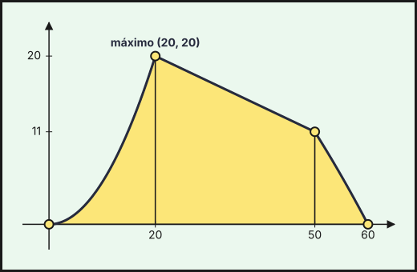{fig-alt="Gráfica de f: parábola x²/20 hasta el pico (20,20), recta decreciente hasta (50,11) y parábola 36−x²/100 hasta (60,0); sombreada el área bajo la curva" width="75%" fig-align="center"}

**iii) Área.**
1. $f\ge0$ en $[0,60]$, así que el área es la integral de los tres trozos.
2. Barrow en cada uno:
$$A=\int_0^{20}\frac{x^2}{20}dx+\int_{20}^{50}\left(26-\frac{3x}{10}\right)dx+\int_{50}^{60}\left(36-\frac{x^2}{100}\right)dx=\frac{400}{3}+465+\frac{170}{3}=655.$$

**$A=655\ \text{u}^2$**
::::
:::::

### Ordinaria · Suplente 1 2026

::::: {.ebau-ej #ebau-2026-ord-sup1-2A}
**Ejercicio 2A** · Ordinaria · Suplente 1 2026 · Bloque B · *(3 puntos)* · [Examen](../../../assets/pau-ccss/2026-ord-sup1/examen.pdf){target="_blank"}

Sea $f$ la función definida por
$$f(x)=\begin{cases}x^{3}+ax^{2}+9x&\text{si }x<3\\\dfrac{bx+18}{x+1}&\text{si }x\ge3\end{cases}$$
siendo $a$ y $b$ números reales.

a) Determine los valores de $a$ y $b$ para que $f$ sea continua en su dominio y su gráfica pase por el punto $(2,2)$. *(1 punto)*

b) Para $a=b=-6$:

i) Determine las asíntotas de $f$, en el caso de que existan. *(0,5 puntos)*

ii) Estudie la monotonía de $f$ y calcule sus extremos relativos. *(0,75 puntos)*

iii) Esboce la gráfica de $f$. *(0,75 puntos)*

*Relacionado también con:* [Derivadas](06-derivadas.qmd), [Aplicaciones de la derivada](07-aplicaciones-derivada.qmd).

:::: {.callout-note collapse="true" appearance="simple"}
## Ayuda 1 · Recordatorio

**Continuidad.**

$f$ es continua en $a$ si $\lim_{x\to a^-}f(x)=\lim_{x\to a^+}f(x)=f(a)$. Las funciones elementales son continuas en su dominio; en una función a trozos solo hay que vigilar los puntos de cambio.

**Límites y asíntotas.**

Asíntota vertical $x=a$: $\lim_{x\to a}f(x)=\pm\infty$. Horizontal $y=b$: $\lim_{x\to\pm\infty}f(x)=b$. Oblicua $y=mx+n$: $m=\lim\dfrac{f(x)}{x}$, $n=\lim\,(f(x)-mx)$. Indeterminaciones $\dfrac{0}{0}$ (factoriza o L'Hôpital), $\dfrac{\infty}{\infty}$ (mayor grado), $\infty-\infty$ (opera).

**Monotonía y extremos relativos.**

$f'>0$ en un intervalo: creciente; $f'<0$: decreciente. Un extremo relativo en $x=a$ exige $f'(a)=0$; es mínimo si $f'$ pasa de $-$ a $+$ (o $f''(a)>0$) y máximo si pasa de $+$ a $-$ (o $f''(a)<0$).

**Hallar parámetros de una función.**

Cada dato del enunciado da una ecuación: pasa por $(a,b)\Rightarrow f(a)=b$; extremo en $x=a\Rightarrow f'(a)=0$; pendiente $m$ en $x=a\Rightarrow f'(a)=m$; inflexión en $x=a\Rightarrow f''(a)=0$; área o integral dada $\Rightarrow$ igualar la integral.

**Representar una función.**

Una gráfica se construye con: dominio, cortes con los ejes, asíntotas, monotonía y extremos (con $f'$), curvatura y puntos de inflexión (con $f''$), y una tabla de valores. Convexa si $f''>0$ y cóncava si $f''<0$.
::::

:::: {.callout-note collapse="true" appearance="simple"}
## Ayuda 2 · Método

**Continuidad.**

1. Localiza los puntos problemáticos (cambios de trozo, ceros de denominadores).
2. Calcula los dos límites laterales y $f(a)$.
3. Iguálalos: si hay parámetros, obtienes una ecuación para cada punto.
4. Concluye indicando el tipo de discontinuidad si no es continua (evitable o de salto).

**Límites y asíntotas.**

1. Para asíntotas verticales, busca los puntos que anulan el denominador y calcula los límites laterales.
2. Para las horizontales, calcula el límite en $+\infty$ y en $-\infty$.
3. Si no hay horizontal en ese lado, prueba la oblicua.
4. Escribe las ecuaciones de las rectas.

**Monotonía y extremos relativos.**

1. Halla el dominio y calcula $f'(x)$.
2. Resuelve $f'(x)=0$ y localiza también los puntos donde $f'$ no existe.
3. Con esos puntos divide el dominio y estudia el signo de $f'$ en cada intervalo.
4. Escribe intervalos de crecimiento y decrecimiento, y los extremos con sus coordenadas $(a,f(a))$.

**Hallar parámetros de una función.**

1. Lista los datos y escribe una ecuación por cada uno.
2. Resuelve el sistema (suele ser lineal en los parámetros).
3. Comprueba que la función resultante cumple todo, y que el extremo es del tipo pedido.

**Representar una función.**

1. Dominio y cortes.
2. Asíntotas verticales, horizontales y oblicuas con límites.
3. Signo de $f'$: intervalos de crecimiento y extremos.
4. Signo de $f''$ si hace falta, y unos cuantos puntos.
5. Dibuja y comprueba que la gráfica respeta todos los datos anteriores.
::::

:::: {.callout-tip collapse="true" appearance="simple"}
## Solución

**a) Parámetros $a$ y $b$.**
1. Pasa por $(2,2)$ con $x=2<3$: $f(2)=8+4a+18=2\Rightarrow4a=-24\Rightarrow a=-6$.
2. Continuidad en $x=3$: por la izquierda, $\displaystyle\lim_{x\to3^-}f=27+9a+27=54-54=0$; por la derecha, $f(3)=\dfrac{3b+18}{4}$.
3. Se igualan: $3b+18=0\Rightarrow b=-6$.

**$a=-6$ y $b=-6$.**

**b) i) Asíntotas** (con $a=b=-6$: $f(x)=x^3-6x^2+9x$ si $x<3$ y $f(x)=\dfrac{-6x+18}{x+1}$ si $x\ge3$).
1. Verticales: no hay ($x=-1$ no está en el tramo $x\ge3$ y el tramo cúbico no tiene).
2. Horizontal por la derecha: $\displaystyle\lim_{x\to+\infty}\dfrac{-6x+18}{x+1}=-6$.
3. En $-\infty$ el tramo cúbico no tiene asíntotas.

**Asíntota horizontal $y=-6$ (por la derecha); no hay verticales ni oblicuas.**

**ii) Monotonía y extremos.**
1. Si $x<3$: $f'(x)=3x^2-12x+9=3(x-1)(x-3)$, con $f'>0$ en $(-\infty,1)$ y $f'<0$ en $(1,3)$.
2. Si $x>3$: $f'(x)=\dfrac{-6(x+1)-(-6x+18)}{(x+1)^2}=\dfrac{-24}{(x+1)^2}<0$.
3. En $x=3$ es $f(3)=0$ y la función sigue decreciendo a ambos lados ($f'(3^-)=0$, $f'(3^+)=-\tfrac{3}{2}$): no hay extremo.

**$f$ crece en $(-\infty,1)$ y decrece en $(1,+\infty)$. Máximo relativo en $(1,4)$; no hay mínimos relativos.**

**iii) Esbozo.**
1. Cúbica $y=x(x-3)^2$ viniendo de $-\infty$: corta al eje en $(0,0)$, sube hasta el máximo $(1,4)$ y baja hasta tocar el eje en $(3,0)$.
2. A partir de ahí continúa descendiendo como la hipérbola $y=\dfrac{-6x+18}{x+1}$ (pasa por $\left(5,-2\right)$), acercándose por encima a $y=-6$.

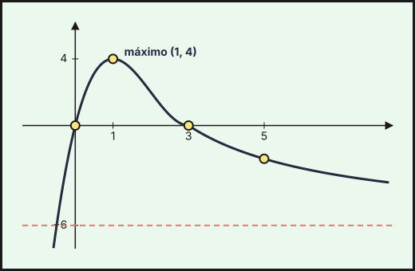{fig-alt="Gráfica de f para a=b=−6: cúbica con máximo (1,4) que toca al eje X en (3,0) y, desde ahí, rama de hipérbola decreciente con asíntota horizontal y=−6" width="75%" fig-align="center"}
::::
:::::

### Extraordinaria · Suplente 1 2026

::::: {.ebau-ej #ebau-2026-ext-sup1-2A}
**Ejercicio 2A** · Extraordinaria · Suplente 1 2026 · Bloque B · *(3 puntos)* · [Examen](../../../assets/pau-ccss/2026-ext-sup1/examen.pdf){target="_blank"}

a) Calcule los valores de $a$ y $b$ para que la función
$$f(x)=\begin{cases}\dfrac{x-a}{x-1}&\text{si }x\le0\\x^{2}+bx+3&\text{si }x>0\end{cases}$$
sea continua y derivable en $x=0$. *(1 punto)*

b) Dada la función $g(x)=\dfrac{x-3}{x-1}$, calcule las asíntotas, los puntos de corte con los ejes, estudie la monotonía y esboce la gráfica de la función. *(1,25 puntos)*

c) Calcule el área del recinto acotado limitado por el eje de abscisas y la gráfica de la función $h(x)=x^{2}-x-6$. *(0,75 puntos)*

*Relacionado también con:* [Funciones](04-funciones.qmd), [Integrales](08-integrales.qmd).

:::: {.callout-note collapse="true" appearance="simple"}
## Ayuda 1 · Recordatorio

**Continuidad.**

$f$ es continua en $a$ si $\lim_{x\to a^-}f(x)=\lim_{x\to a^+}f(x)=f(a)$. Las funciones elementales son continuas en su dominio; en una función a trozos solo hay que vigilar los puntos de cambio.

**Derivabilidad.**

$f$ derivable en $a$ si es continua en $a$ y las derivadas laterales coinciden: $f'(a^-)=f'(a^+)$. Derivable implica continua, pero no al revés.

**Límites y asíntotas.**

Asíntota vertical $x=a$: $\lim_{x\to a}f(x)=\pm\infty$. Horizontal $y=b$: $\lim_{x\to\pm\infty}f(x)=b$. Oblicua $y=mx+n$: $m=\lim\dfrac{f(x)}{x}$, $n=\lim\,(f(x)-mx)$. Indeterminaciones $\dfrac{0}{0}$ (factoriza o L'Hôpital), $\dfrac{\infty}{\infty}$ (mayor grado), $\infty-\infty$ (opera).

**Monotonía y extremos relativos.**

$f'>0$ en un intervalo: creciente; $f'<0$: decreciente. Un extremo relativo en $x=a$ exige $f'(a)=0$; es mínimo si $f'$ pasa de $-$ a $+$ (o $f''(a)>0$) y máximo si pasa de $+$ a $-$ (o $f''(a)<0$).

**Dominio, cortes y simetrías.**

Dominio: excluye los puntos donde se anula un denominador, el radicando de una raíz de índice par es negativo o el argumento de un logaritmo no es positivo. Cortes: con el eje $X$ se resuelve $f(x)=0$; con el eje $Y$ se calcula $f(0)$.

**Hallar parámetros de una función.**

Cada dato del enunciado da una ecuación: pasa por $(a,b)\Rightarrow f(a)=b$; extremo en $x=a\Rightarrow f'(a)=0$; pendiente $m$ en $x=a\Rightarrow f'(a)=m$; inflexión en $x=a\Rightarrow f''(a)=0$; área o integral dada $\Rightarrow$ igualar la integral.

**Área de un recinto.**

Área entre $y=f(x)$ y el eje $X$: $\int_a^b|f(x)|\,dx$, partiendo en los puntos donde $f$ cambia de signo. Área entre dos curvas: $\int_a^b\left(f(x)-g(x)\right)dx$ con $f\ge g$. Los límites de integración son las abscisas de corte.

**Representar una función.**

Una gráfica se construye con: dominio, cortes con los ejes, asíntotas, monotonía y extremos (con $f'$), curvatura y puntos de inflexión (con $f''$), y una tabla de valores. Convexa si $f''>0$ y cóncava si $f''<0$.
::::

:::: {.callout-note collapse="true" appearance="simple"}
## Ayuda 2 · Método

**Continuidad.**

1. Localiza los puntos problemáticos (cambios de trozo, ceros de denominadores).
2. Calcula los dos límites laterales y $f(a)$.
3. Iguálalos: si hay parámetros, obtienes una ecuación para cada punto.
4. Concluye indicando el tipo de discontinuidad si no es continua (evitable o de salto).

**Derivabilidad.**

1. Impón primero la continuidad en el punto de cambio.
2. Deriva cada trozo y evalúa en el punto, por la izquierda y por la derecha.
3. Iguala las derivadas: segunda ecuación para los parámetros.
4. Resuelve el sistema y comprueba.

**Límites y asíntotas.**

1. Para asíntotas verticales, busca los puntos que anulan el denominador y calcula los límites laterales.
2. Para las horizontales, calcula el límite en $+\infty$ y en $-\infty$.
3. Si no hay horizontal en ese lado, prueba la oblicua.
4. Escribe las ecuaciones de las rectas.

**Monotonía y extremos relativos.**

1. Halla el dominio y calcula $f'(x)$.
2. Resuelve $f'(x)=0$ y localiza también los puntos donde $f'$ no existe.
3. Con esos puntos divide el dominio y estudia el signo de $f'$ en cada intervalo.
4. Escribe intervalos de crecimiento y decrecimiento, y los extremos con sus coordenadas $(a,f(a))$.

**Dominio, cortes y simetrías.**

1. Halla el dominio y escríbelo como unión de intervalos.
2. Calcula los cortes con los ejes.
3. Estudia el signo de $f$ entre los puntos que anulan $f$ o su denominador.

**Hallar parámetros de una función.**

1. Lista los datos y escribe una ecuación por cada uno.
2. Resuelve el sistema (suele ser lineal en los parámetros).
3. Comprueba que la función resultante cumple todo, y que el extremo es del tipo pedido.

**Área de un recinto.**

1. Haz un esbozo del recinto.
2. Calcula los puntos de corte (resolviendo $f=g$ o $f=0$): son los límites.
3. Decide qué función va por encima en cada tramo; si se cruzan, parte la integral.
4. Aplica Barrow y da el área en $\text{u}^2$, siempre positiva.

**Representar una función.**

1. Dominio y cortes.
2. Asíntotas verticales, horizontales y oblicuas con límites.
3. Signo de $f'$: intervalos de crecimiento y extremos.
4. Signo de $f''$ si hace falta, y unos cuantos puntos.
5. Dibuja y comprueba que la gráfica respeta todos los datos anteriores.
::::

:::: {.callout-tip collapse="true" appearance="simple"}
## Solución

**a) Parámetros $a$ y $b$.**
1. Continuidad en $x=0$: por la izquierda, $f(0)=\dfrac{-a}{-1}=a$; por la derecha, $\displaystyle\lim_{x\to0^+}f=3$. Así $a=3$.
2. Derivada por la izquierda: para $x<0$, $f'(x)=\dfrac{(x-1)-(x-a)}{(x-1)^2}=\dfrac{a-1}{(x-1)^2}$, con $f'(0^-)=a-1=2$.
3. Derivada por la derecha: para $x>0$, $f'(x)=2x+b$, con $f'(0^+)=b$.
4. Derivabilidad: deben coincidir, $b=2$.

**$a=3$ y $b=2$.**

**b) Estudio de $g(x)=\dfrac{x-3}{x-1}$.**
1. **Asíntota vertical:** $x=1$, porque $\displaystyle\lim_{x\to1^\pm}g=\dfrac{-2}{0^\pm}=\mp\infty$.
2. **Asíntota horizontal:** $y=\displaystyle\lim_{x\to\pm\infty}\dfrac{x-3}{x-1}=1$.
3. **Cortes con los ejes:** con $OX$, $x=3$, punto $(3,0)$; con $OY$, $g(0)=3$, punto $(0,3)$.
4. **Monotonía:** $g'(x)=\dfrac{(x-1)-(x-3)}{(x-1)^2}=\dfrac{2}{(x-1)^2}>0$: **$g$ es creciente en $(-\infty,1)$ y en $(1,+\infty)$** (sin extremos).
5. **Gráfica:** hipérbola con asíntotas $x=1$ e $y=1$.
   - Rama izquierda ($x<1$): pasa por $(0,3)$, sube a $+\infty$ junto a $x=1$ y baja hacia $1$ por encima cuando $x\to-\infty$.
   - Rama derecha ($x>1$): viene de $-\infty$ junto a $x=1$, pasa por $(3,0)$ y se acerca a $1$ por debajo cuando $x\to+\infty$.

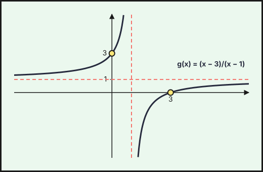{fig-alt="Hipérbola creciente g(x)=(x−3)/(x−1) con asíntota vertical en la abscisa 1 y horizontal en la ordenada 1; corta a los ejes en (3,0) y (0,3)" width="75%" fig-align="center"}

**c) Área.**
1. Se factoriza: $h(x)=(x-3)(x+2)$ corta al eje $OX$ en $x=-2$ y $x=3$.
2. Es una parábola abierta hacia arriba: $h\le0$ entre las raíces, así que el área es el valor absoluto de la integral.
3. Barrow:
$$A=\left|\int_{-2}^{3}\left(x^2-x-6\right)dx\right|=\left|\left[\frac{x^3}{3}-\frac{x^2}{2}-6x\right]_{-2}^{3}\right|=\left|-\frac{27}{2}-\frac{22}{3}\right|=\frac{125}{6}.$$

**$A=\dfrac{125}{6}\ \text{u}^2$**
::::
:::::

::::: {.ebau-ej #ebau-2026-ext-sup1-2B}
**Ejercicio 2B** · Extraordinaria · Suplente 1 2026 · Bloque B · *(3 puntos)* · [Examen](../../../assets/pau-ccss/2026-ext-sup1/examen.pdf){target="_blank"}

Sea $f$ la función definida por
$$f(x)=\begin{cases}x^{3}-3x+2&\text{si }0<x\le3\\\dfrac{10}{a-x}&\text{si }x>3\end{cases}$$
siendo $a$ un número real.

a) Determine el valor de $a$ para el que $f$ es continua en $x=3$. *(0,5 puntos)*

b) Para $a=4$:

i) Determine las ecuaciones de las asíntotas de $f$, si existen. *(1 punto)*

ii) Estudie la derivabilidad y monotonía de $f$. *(1,5 puntos)*

*Relacionado también con:* [Funciones](04-funciones.qmd), [Derivadas](06-derivadas.qmd), [Aplicaciones de la derivada](07-aplicaciones-derivada.qmd).

:::: {.callout-note collapse="true" appearance="simple"}
## Ayuda 1 · Recordatorio

**Continuidad.**

$f$ es continua en $a$ si $\lim_{x\to a^-}f(x)=\lim_{x\to a^+}f(x)=f(a)$. Las funciones elementales son continuas en su dominio; en una función a trozos solo hay que vigilar los puntos de cambio.

**Límites y asíntotas.**

Asíntota vertical $x=a$: $\lim_{x\to a}f(x)=\pm\infty$. Horizontal $y=b$: $\lim_{x\to\pm\infty}f(x)=b$. Oblicua $y=mx+n$: $m=\lim\dfrac{f(x)}{x}$, $n=\lim\,(f(x)-mx)$. Indeterminaciones $\dfrac{0}{0}$ (factoriza o L'Hôpital), $\dfrac{\infty}{\infty}$ (mayor grado), $\infty-\infty$ (opera).

**Monotonía y extremos relativos.**

$f'>0$ en un intervalo: creciente; $f'<0$: decreciente. Un extremo relativo en $x=a$ exige $f'(a)=0$; es mínimo si $f'$ pasa de $-$ a $+$ (o $f''(a)>0$) y máximo si pasa de $+$ a $-$ (o $f''(a)<0$).

**Hallar parámetros de una función.**

Cada dato del enunciado da una ecuación: pasa por $(a,b)\Rightarrow f(a)=b$; extremo en $x=a\Rightarrow f'(a)=0$; pendiente $m$ en $x=a\Rightarrow f'(a)=m$; inflexión en $x=a\Rightarrow f''(a)=0$; área o integral dada $\Rightarrow$ igualar la integral.
::::

:::: {.callout-note collapse="true" appearance="simple"}
## Ayuda 2 · Método

**Continuidad.**

1. Localiza los puntos problemáticos (cambios de trozo, ceros de denominadores).
2. Calcula los dos límites laterales y $f(a)$.
3. Iguálalos: si hay parámetros, obtienes una ecuación para cada punto.
4. Concluye indicando el tipo de discontinuidad si no es continua (evitable o de salto).

**Límites y asíntotas.**

1. Para asíntotas verticales, busca los puntos que anulan el denominador y calcula los límites laterales.
2. Para las horizontales, calcula el límite en $+\infty$ y en $-\infty$.
3. Si no hay horizontal en ese lado, prueba la oblicua.
4. Escribe las ecuaciones de las rectas.

**Monotonía y extremos relativos.**

1. Halla el dominio y calcula $f'(x)$.
2. Resuelve $f'(x)=0$ y localiza también los puntos donde $f'$ no existe.
3. Con esos puntos divide el dominio y estudia el signo de $f'$ en cada intervalo.
4. Escribe intervalos de crecimiento y decrecimiento, y los extremos con sus coordenadas $(a,f(a))$.

**Hallar parámetros de una función.**

1. Lista los datos y escribe una ecuación por cada uno.
2. Resuelve el sistema (suele ser lineal en los parámetros).
3. Comprueba que la función resultante cumple todo, y que el extremo es del tipo pedido.
::::

:::: {.callout-tip collapse="true" appearance="simple"}
## Solución

**a) Continuidad en $x=3$.**
1. Por la izquierda: $\displaystyle\lim_{x\to3^-}\left(x^3-3x+2\right)=27-9+2=20$.
2. Por la derecha: $\displaystyle\lim_{x\to3^+}\dfrac{10}{a-x}=\dfrac{10}{a-3}$.
3. Se igualan: $\dfrac{10}{a-3}=20\Rightarrow a-3=\dfrac{1}{2}$.

**$a=\dfrac{7}{2}$.**

**b) Estudio para $a=4$:** $f(x)=x^3-3x+2$ si $0<x\le3$ y $f(x)=\dfrac{10}{4-x}$ si $x>3$.

**i) Asíntotas.**
1. Vertical: $x=4$ (en el tramo $x>3$), con $\displaystyle\lim_{x\to4^-}f=+\infty$ y $\displaystyle\lim_{x\to4^+}f=-\infty$.
2. Horizontal: $\displaystyle\lim_{x\to+\infty}\dfrac{10}{4-x}=0$, es decir, $y=0$.

**Asíntotas: $x=4$ e $y=0$.**

**ii) Derivabilidad y monotonía.**
1. En $x=3$: $\displaystyle\lim_{x\to3^+}f=\dfrac{10}{1}=10\neq f(3)=20$. **No es continua en $x=3$** (salto) y, por tanto, no es derivable allí.
2. En $x=4$ no está definida.
3. Es derivable en $(0,3)\cup(3,4)\cup(4,+\infty)$.
4. Monotonía en $(0,3)$: $f'(x)=3x^2-3=3(x-1)(x+1)$, con $f'<0$ en $(0,1)$ y $f'>0$ en $(1,3)$.
5. Monotonía en $x>3$: $f'(x)=\dfrac{10}{(4-x)^2}>0$.

**$f$ decrece en $(0,1)$ y crece en $(1,3)$, en $(3,4)$ y en $(4,+\infty)$. Mínimo relativo en $(1,0)$; máximo relativo en $(3,20)$** (porque a su derecha la función toma valores cercanos a $10<20$).
::::
:::::

## 2025

### Ordinaria · Suplente 1 · Modelo A 2025

::::: {.ebau-ej #ebau-2025-ord-sup1-a-3}
**Ejercicio 3** · Ordinaria · Suplente 1 · Modelo A 2025 · Bloque B · *(2,5 puntos)* · [Examen](../../../assets/pau-ccss/2025-ord-sup1-a/examen.pdf){target="_blank"}

a) Se considera la función
$$f(x)=\begin{cases}a\cdot e^{x+1}&x\le-1\\x^{2}-2&-1<x<2\\b\cdot\log(12-x)&2\le x<12\end{cases}$$
siendo $a$ y $b$ números reales. Determine los valores de $a$ y $b$ para que la función $f$ sea continua en su dominio. *(1,2 puntos)*

b) Represente el recinto acotado, limitado por la recta $y=-x+3$ y la parábola $y=-x^{2}+5$. Calcule el área del recinto. *(1,3 puntos)*

*Relacionado también con:* [Derivadas](06-derivadas.qmd), [Integrales](08-integrales.qmd).

:::: {.callout-note collapse="true" appearance="simple"}
## Ayuda 1 · Recordatorio

**Continuidad.**

$f$ es continua en $a$ si $\lim_{x\to a^-}f(x)=\lim_{x\to a^+}f(x)=f(a)$. Las funciones elementales son continuas en su dominio; en una función a trozos solo hay que vigilar los puntos de cambio.

**Hallar parámetros de una función.**

Cada dato del enunciado da una ecuación: pasa por $(a,b)\Rightarrow f(a)=b$; extremo en $x=a\Rightarrow f'(a)=0$; pendiente $m$ en $x=a\Rightarrow f'(a)=m$; inflexión en $x=a\Rightarrow f''(a)=0$; área o integral dada $\Rightarrow$ igualar la integral.

**Área de un recinto.**

Área entre $y=f(x)$ y el eje $X$: $\int_a^b|f(x)|\,dx$, partiendo en los puntos donde $f$ cambia de signo. Área entre dos curvas: $\int_a^b\left(f(x)-g(x)\right)dx$ con $f\ge g$. Los límites de integración son las abscisas de corte.

**Representar una función.**

Una gráfica se construye con: dominio, cortes con los ejes, asíntotas, monotonía y extremos (con $f'$), curvatura y puntos de inflexión (con $f''$), y una tabla de valores. Convexa si $f''>0$ y cóncava si $f''<0$.
::::

:::: {.callout-note collapse="true" appearance="simple"}
## Ayuda 2 · Método

**Continuidad.**

1. Localiza los puntos problemáticos (cambios de trozo, ceros de denominadores).
2. Calcula los dos límites laterales y $f(a)$.
3. Iguálalos: si hay parámetros, obtienes una ecuación para cada punto.
4. Concluye indicando el tipo de discontinuidad si no es continua (evitable o de salto).

**Hallar parámetros de una función.**

1. Lista los datos y escribe una ecuación por cada uno.
2. Resuelve el sistema (suele ser lineal en los parámetros).
3. Comprueba que la función resultante cumple todo, y que el extremo es del tipo pedido.

**Área de un recinto.**

1. Haz un esbozo del recinto.
2. Calcula los puntos de corte (resolviendo $f=g$ o $f=0$): son los límites.
3. Decide qué función va por encima en cada tramo; si se cruzan, parte la integral.
4. Aplica Barrow y da el área en $\text{u}^2$, siempre positiva.

**Representar una función.**

1. Dominio y cortes.
2. Asíntotas verticales, horizontales y oblicuas con límites.
3. Signo de $f'$: intervalos de crecimiento y extremos.
4. Signo de $f''$ si hace falta, y unos cuantos puntos.
5. Dibuja y comprueba que la gráfica respeta todos los datos anteriores.
::::

:::: {.callout-tip collapse="true" appearance="simple"}
## Solución

**a) Continuidad.** Cada trozo es continuo en su intervalo; solo hay que estudiar $x=-1$ y $x=2$.
1. En $x=-1$: $\displaystyle\lim_{x\to-1^-}ae^{x+1}=a$ y $\displaystyle\lim_{x\to-1^+}\left(x^2-2\right)=-1$. Deben coincidir: $a=-1$.
2. En $x=2$: $\displaystyle\lim_{x\to2^-}\left(x^2-2\right)=2$ y $f(2)=b\log(12-2)=b\log10=b$ (logaritmo decimal). Deben coincidir: $b=2$.

**$a=-1$ y $b=2$.**

**b) Recinto y área.**
1. Puntos de corte: $-x+3=-x^2+5\iff x^2-x-2=0\iff x=-1$ o $x=2$, en los puntos $(-1,4)$ y $(2,1)$.
2. En $[-1,2]$ la parábola (de vértice $(0,5)$, abierta hacia abajo) queda por encima de la recta.
3. Barrow, integrando «arriba menos abajo»:
$$A=\int_{-1}^{2}\left[\left(-x^2+5\right)-\left(-x+3\right)\right]dx=\int_{-1}^{2}\left(-x^2+x+2\right)dx=\left[-\frac{x^3}{3}+\frac{x^2}{2}+2x\right]_{-1}^{2}=\frac{10}{3}-\left(-\frac{7}{6}\right)=\frac{9}{2}.$$

**$A=\dfrac{9}{2}\ \text{u}^2$**

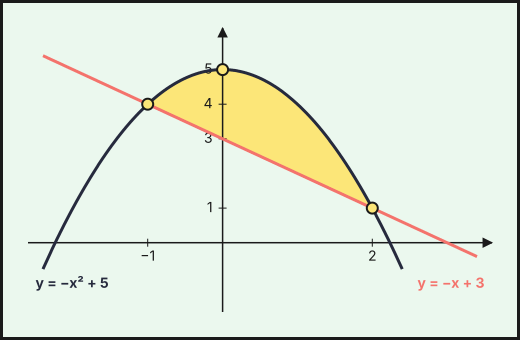{fig-alt="Recinto acotado entre la parábola y=−x²+5 y la recta y=−x+3, que se cortan en (−1,4) y (2,1)" width="75%" fig-align="center"}
::::
:::::

### Ordinaria · Suplente 2 · Modelo A 2025

::::: {.ebau-ej #ebau-2025-ord-sup2-a-4}
**Ejercicio 4** · Ordinaria · Suplente 2 · Modelo A 2025 · Bloque B · *(2,5 puntos)* · [Examen](../../../assets/pau-ccss/2025-ord-sup2-a/examen.pdf){target="_blank"}

Se considera la función
$$f(x)=\begin{cases}10+\dfrac{5x}{2}&x\le-2\\x^{2}+1&-2<x<2\\10-\dfrac{5x}{2}&x\ge2\end{cases}$$

a) Estudie la continuidad y derivabilidad de $f$ en el punto de abscisa $x=-2$. *(0,5 puntos)*

b) Calcule la ecuación de la recta tangente a la gráfica de la función $f$ con pendiente $-1$. *(0,75 puntos)*

c) Represente la región del plano acotada superiormente por la gráfica de $f$ e inferiormente por el eje de abscisas. Calcule el área de dicha región. *(1,25 puntos)*

*Relacionado también con:* [Derivadas](06-derivadas.qmd), [Integrales](08-integrales.qmd).

:::: {.callout-note collapse="true" appearance="simple"}
## Ayuda 1 · Recordatorio

**Continuidad.**

$f$ es continua en $a$ si $\lim_{x\to a^-}f(x)=\lim_{x\to a^+}f(x)=f(a)$. Las funciones elementales son continuas en su dominio; en una función a trozos solo hay que vigilar los puntos de cambio.

**Recta tangente.**

Tangente a la gráfica de $f$ en $x=a$: $y-f(a)=f'(a)\,(x-a)$. La pendiente es $f'(a)$. Tangente horizontal: $f'(a)=0$. Rectas paralelas tienen la misma pendiente; perpendiculares, $m\cdot m'=-1$.

**Área de un recinto.**

Área entre $y=f(x)$ y el eje $X$: $\int_a^b|f(x)|\,dx$, partiendo en los puntos donde $f$ cambia de signo. Área entre dos curvas: $\int_a^b\left(f(x)-g(x)\right)dx$ con $f\ge g$. Los límites de integración son las abscisas de corte.

**Representar una función.**

Una gráfica se construye con: dominio, cortes con los ejes, asíntotas, monotonía y extremos (con $f'$), curvatura y puntos de inflexión (con $f''$), y una tabla de valores. Convexa si $f''>0$ y cóncava si $f''<0$.
::::

:::: {.callout-note collapse="true" appearance="simple"}
## Ayuda 2 · Método

**Continuidad.**

1. Localiza los puntos problemáticos (cambios de trozo, ceros de denominadores).
2. Calcula los dos límites laterales y $f(a)$.
3. Iguálalos: si hay parámetros, obtienes una ecuación para cada punto.
4. Concluye indicando el tipo de discontinuidad si no es continua (evitable o de salto).

**Recta tangente.**

1. Calcula $f(a)$ (el punto) y $f'(x)$.
2. Evalúa $f'(a)$ (la pendiente).
3. Sustituye en la ecuación punto-pendiente.
4. Si el punto no es dato, obtén $a$ de la condición del enunciado (pendiente dada, tangente horizontal…).

**Área de un recinto.**

1. Haz un esbozo del recinto.
2. Calcula los puntos de corte (resolviendo $f=g$ o $f=0$): son los límites.
3. Decide qué función va por encima en cada tramo; si se cruzan, parte la integral.
4. Aplica Barrow y da el área en $\text{u}^2$, siempre positiva.

**Representar una función.**

1. Dominio y cortes.
2. Asíntotas verticales, horizontales y oblicuas con límites.
3. Signo de $f'$: intervalos de crecimiento y extremos.
4. Signo de $f''$ si hace falta, y unos cuantos puntos.
5. Dibuja y comprueba que la gráfica respeta todos los datos anteriores.
::::

:::: {.callout-tip collapse="true" appearance="simple"}
## Solución

**a) Continuidad y derivabilidad en $x=-2$.**
1. Continuidad: $\displaystyle\lim_{x\to-2^-}\left(10+\frac{5x}{2}\right)=5$ y $\displaystyle\lim_{x\to-2^+}\left(x^2+1\right)=5=f(-2)$: **continua.**
2. Derivadas: $f'(x)=\dfrac{5}{2}$ si $x<-2$ y $f'(x)=2x$ si $-2<x<2$.
3. En $x=-2$: $f'(-2^-)=\dfrac{5}{2}\neq f'(-2^+)=-4$: **no derivable en $x=-2$.**

**b) Recta tangente de pendiente $-1$.**
1. Los tramos laterales tienen pendientes $\pm\dfrac{5}{2}$, así que el punto está en el tramo central: $f'(x)=2x=-1\Rightarrow x=-\dfrac{1}{2}$, que está en $(-2,2)$ (válido).
2. $f\left(-\dfrac{1}{2}\right)=\dfrac{5}{4}$.
3. Tangente: $y-\dfrac{5}{4}=-\left(x+\dfrac{1}{2}\right)$.

**$y=-x+\dfrac{3}{4}$.**

**c) Región y área.**
1. $f\ge0$ en $[-4,4]$ ($10+\frac{5x}{2}=0$ en $x=-4$ y $10-\frac{5x}{2}=0$ en $x=4$); fuera de ese intervalo $f<0$. La región acotada va de $x=-4$ a $x=4$.
2. Es una «tienda» con vértices $(-4,0)$, $(-2,5)$, $(2,5)$ y $(4,0)$ cuyo techo central es la parábola $y=x^2+1$.
3. Se suman las tres integrales:
$$A=\int_{-4}^{-2}\left(10+\frac{5x}{2}\right)dx+\int_{-2}^{2}\left(x^2+1\right)dx+\int_2^4\left(10-\frac{5x}{2}\right)dx=5+\frac{28}{3}+5=\frac{58}{3}.$$

**$A=\dfrac{58}{3}\ \text{u}^2$**

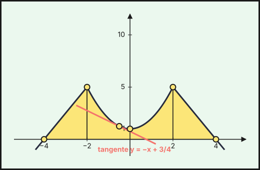{fig-alt="Gráfica de f: dos rectas y un arco de parábola x²+1 entre ellas, formando una tienda sobre el eje X de x=−4 a x=4; recta tangente y=−x+3/4 en x=−1/2" width="75%" fig-align="center"}
::::
:::::

## 2024

### Ordinaria · Modelo A 2024

::::: {.ebau-ej #ebau-2024-ord-a-4}
**Ejercicio 4** · Ordinaria · Modelo A 2024 · Bloque B · *(2,5 puntos)* · [Examen](../../../assets/pau-ccss/2024-ord-a/examen.pdf){target="_blank"}

La velocidad media del viento en la zona de Sierra Nevada, prevista para cierto día, viene dada por la función $v(t)$ expresada en km/h, donde $t$ es el tiempo expresado en horas:
$$v(t)=\begin{cases}t^{2}-8t+60&\text{si }0\le t\le10\\-t^{2}+32t-140&\text{si }10<t\le24\end{cases}$$

a) Compruebe que la función $v$ es continua y derivable. *(0,75 puntos)*

b) Represente gráficamente la función, estudiando previamente la monotonía y calculando los extremos absolutos. *(1 punto)*

c) La Agencia Estatal de Meteorología emite avisos de alerta por vientos siguiendo el código de colores: naranja para vientos entre $100$ y $140$ km/h, y rojo para vientos de más de $140$ km/h. Según la previsión, indique si se debe emitir alguna alerta naranja en Sierra Nevada ese día y durante qué horas estaría activa. ¿Se emitiría alerta roja? *(0,75 puntos)*

*Relacionado también con:* [Derivadas](06-derivadas.qmd), [Aplicaciones de la derivada](07-aplicaciones-derivada.qmd).

:::: {.callout-note collapse="true" appearance="simple"}
## Ayuda 1 · Recordatorio

**Continuidad.**

$f$ es continua en $a$ si $\lim_{x\to a^-}f(x)=\lim_{x\to a^+}f(x)=f(a)$. Las funciones elementales son continuas en su dominio; en una función a trozos solo hay que vigilar los puntos de cambio.

**Derivabilidad.**

$f$ derivable en $a$ si es continua en $a$ y las derivadas laterales coinciden: $f'(a^-)=f'(a^+)$. Derivable implica continua, pero no al revés.

**Monotonía y extremos relativos.**

$f'>0$ en un intervalo: creciente; $f'<0$: decreciente. Un extremo relativo en $x=a$ exige $f'(a)=0$; es mínimo si $f'$ pasa de $-$ a $+$ (o $f''(a)>0$) y máximo si pasa de $+$ a $-$ (o $f''(a)<0$).

**Representar una función.**

Una gráfica se construye con: dominio, cortes con los ejes, asíntotas, monotonía y extremos (con $f'$), curvatura y puntos de inflexión (con $f''$), y una tabla de valores. Convexa si $f''>0$ y cóncava si $f''<0$.
::::

:::: {.callout-note collapse="true" appearance="simple"}
## Ayuda 2 · Método

**Continuidad.**

1. Localiza los puntos problemáticos (cambios de trozo, ceros de denominadores).
2. Calcula los dos límites laterales y $f(a)$.
3. Iguálalos: si hay parámetros, obtienes una ecuación para cada punto.
4. Concluye indicando el tipo de discontinuidad si no es continua (evitable o de salto).

**Derivabilidad.**

1. Impón primero la continuidad en el punto de cambio.
2. Deriva cada trozo y evalúa en el punto, por la izquierda y por la derecha.
3. Iguala las derivadas: segunda ecuación para los parámetros.
4. Resuelve el sistema y comprueba.

**Monotonía y extremos relativos.**

1. Halla el dominio y calcula $f'(x)$.
2. Resuelve $f'(x)=0$ y localiza también los puntos donde $f'$ no existe.
3. Con esos puntos divide el dominio y estudia el signo de $f'$ en cada intervalo.
4. Escribe intervalos de crecimiento y decrecimiento, y los extremos con sus coordenadas $(a,f(a))$.

**Representar una función.**

1. Dominio y cortes.
2. Asíntotas verticales, horizontales y oblicuas con límites.
3. Signo de $f'$: intervalos de crecimiento y extremos.
4. Signo de $f''$ si hace falta, y unos cuantos puntos.
5. Dibuja y comprueba que la gráfica respeta todos los datos anteriores.
::::

:::: {.callout-tip collapse="true" appearance="simple"}
## Solución

**a) Continuidad y derivabilidad.** Cada tramo es un polinomio, así que solo hay que estudiar $t=10$.
1. Continuidad: por la izquierda, $10^2-80+60=80$; por la derecha, $-100+320-140=80$. Coinciden: **continua.**
2. Derivadas: $v'(t)=2t-8$ si $t<10$ y $v'(t)=-2t+32$ si $t>10$.
3. En $t=10$: $v'(10^-)=12=v'(10^+)$: **derivable.**

**b) Monotonía, extremos absolutos y gráfica.**
1. Puntos críticos: $v'(t)=2t-8=0\Rightarrow t=4$ en el primer tramo y $v'(t)=-2t+32=0\Rightarrow t=16$ en el segundo.
2. Signo de $v'$:
   - $(0,4)$: $v'<0$, **decrece**.
   - $(4,16)$: $v'>0$, **crece** (en $(4,10)$ por el primer tramo y en $(10,16)$ por el segundo).
   - $(16,24)$: $v'<0$, **decrece**.
3. Valores: $v(0)=60$, $v(4)=44$, $v(10)=80$, $v(16)=116$, $v(24)=52$.
4. Extremos absolutos: se comparan los puntos críticos y los extremos del intervalo.

**Mínimo absoluto $44$ km/h en $t=4$ y máximo absoluto $116$ km/h en $t=16$.**

5. Gráfica: arco de parábola convexa desde $(0,60)$ hasta el mínimo $(4,44)$, sube hasta $(10,80)$, continúa hasta el máximo $(16,116)$ y baja hasta $(24,52)$.

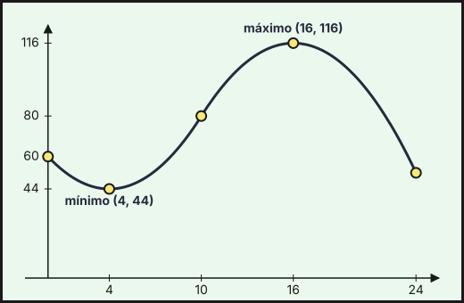{fig-alt="Velocidad del viento v(t): baja de 60 a 44 km/h en t=4, sube hasta el máximo 116 km/h en t=16 y baja a 52 km/h en t=24" width="75%" fig-align="center"}

**c) Alertas.**
1. Alerta naranja si $100\le v\le140$. En el primer tramo, $v\le80$ en $[0,10]$: no hay alerta.
2. En el segundo tramo: $-t^2+32t-140\ge100\iff t^2-32t+240\le0\iff12\le t\le20$.
3. El máximo del día es $116$, menor que $140$.

**Se emitiría alerta naranja entre las $12$ h y las $20$ h (8 horas). No se emitiría alerta roja**, porque el máximo es $116<140$.
::::
:::::

### Ordinaria · Modelo B 2024

::::: {.ebau-ej #ebau-2024-ord-b-3}
**Ejercicio 3** · Ordinaria · Modelo B 2024 · Bloque B · *(2,5 puntos)* · [Examen](../../../assets/pau-ccss/2024-ord-b/examen.pdf){target="_blank"}

Dada la función $f(x)=\dfrac{2x-6}{2-x}$:

a) Estudie la continuidad y derivabilidad de dicha función. Calcule sus asíntotas. *(0,75 puntos)*

b) Estudie los intervalos de crecimiento y decrecimiento, así como la existencia de extremos relativos. *(0,75 puntos)*

c) Halle los puntos de corte con los ejes de coordenadas y represente gráficamente la función. *(1 punto)*

*Relacionado también con:* [Derivadas](06-derivadas.qmd), [Aplicaciones de la derivada](07-aplicaciones-derivada.qmd).

:::: {.callout-note collapse="true" appearance="simple"}
## Ayuda 1 · Recordatorio

**Continuidad.**

$f$ es continua en $a$ si $\lim_{x\to a^-}f(x)=\lim_{x\to a^+}f(x)=f(a)$. Las funciones elementales son continuas en su dominio; en una función a trozos solo hay que vigilar los puntos de cambio.

**Límites y asíntotas.**

Asíntota vertical $x=a$: $\lim_{x\to a}f(x)=\pm\infty$. Horizontal $y=b$: $\lim_{x\to\pm\infty}f(x)=b$. Oblicua $y=mx+n$: $m=\lim\dfrac{f(x)}{x}$, $n=\lim\,(f(x)-mx)$. Indeterminaciones $\dfrac{0}{0}$ (factoriza o L'Hôpital), $\dfrac{\infty}{\infty}$ (mayor grado), $\infty-\infty$ (opera).

**Monotonía y extremos relativos.**

$f'>0$ en un intervalo: creciente; $f'<0$: decreciente. Un extremo relativo en $x=a$ exige $f'(a)=0$; es mínimo si $f'$ pasa de $-$ a $+$ (o $f''(a)>0$) y máximo si pasa de $+$ a $-$ (o $f''(a)<0$).

**Dominio, cortes y simetrías.**

Dominio: excluye los puntos donde se anula un denominador, el radicando de una raíz de índice par es negativo o el argumento de un logaritmo no es positivo. Cortes: con el eje $X$ se resuelve $f(x)=0$; con el eje $Y$ se calcula $f(0)$.

**Representar una función.**

Una gráfica se construye con: dominio, cortes con los ejes, asíntotas, monotonía y extremos (con $f'$), curvatura y puntos de inflexión (con $f''$), y una tabla de valores. Convexa si $f''>0$ y cóncava si $f''<0$.
::::

:::: {.callout-note collapse="true" appearance="simple"}
## Ayuda 2 · Método

**Continuidad.**

1. Localiza los puntos problemáticos (cambios de trozo, ceros de denominadores).
2. Calcula los dos límites laterales y $f(a)$.
3. Iguálalos: si hay parámetros, obtienes una ecuación para cada punto.
4. Concluye indicando el tipo de discontinuidad si no es continua (evitable o de salto).

**Límites y asíntotas.**

1. Para asíntotas verticales, busca los puntos que anulan el denominador y calcula los límites laterales.
2. Para las horizontales, calcula el límite en $+\infty$ y en $-\infty$.
3. Si no hay horizontal en ese lado, prueba la oblicua.
4. Escribe las ecuaciones de las rectas.

**Monotonía y extremos relativos.**

1. Halla el dominio y calcula $f'(x)$.
2. Resuelve $f'(x)=0$ y localiza también los puntos donde $f'$ no existe.
3. Con esos puntos divide el dominio y estudia el signo de $f'$ en cada intervalo.
4. Escribe intervalos de crecimiento y decrecimiento, y los extremos con sus coordenadas $(a,f(a))$.

**Dominio, cortes y simetrías.**

1. Halla el dominio y escríbelo como unión de intervalos.
2. Calcula los cortes con los ejes.
3. Estudia el signo de $f$ entre los puntos que anulan $f$ o su denominador.

**Representar una función.**

1. Dominio y cortes.
2. Asíntotas verticales, horizontales y oblicuas con límites.
3. Signo de $f'$: intervalos de crecimiento y extremos.
4. Signo de $f''$ si hace falta, y unos cuantos puntos.
5. Dibuja y comprueba que la gráfica respeta todos los datos anteriores.
::::

:::: {.callout-tip collapse="true" appearance="simple"}
## Solución

**a) Continuidad, derivabilidad y asíntotas.**
1. Dominio: $\mathbb R\setminus\{2\}$ (el denominador se anula en $x=2$). Es un cociente de polinomios: **continua y derivable en todo su dominio.**
2. Asíntota vertical $x=2$: el numerador tiende a $-2$ y $2-x$ tiende a $0^+$ por la izquierda y a $0^-$ por la derecha, luego $\displaystyle\lim_{x\to2^-}f=-\infty$ y $\displaystyle\lim_{x\to2^+}f=+\infty$.
3. Asíntota horizontal: $y=\displaystyle\lim_{x\to\pm\infty}\frac{2x-6}{2-x}=-2$.

**$x=2$ (vertical) e $y=-2$ (horizontal).**

**b) Monotonía y extremos.**
1. Derivada: $f'(x)=\dfrac{2(2-x)+(2x-6)}{(2-x)^2}=\dfrac{-2}{(2-x)^2}$.
2. Es negativa para todo $x\neq2$.

**$f$ es decreciente en $(-\infty,2)$ y en $(2,+\infty)$ y no tiene extremos relativos.**

**c) Cortes y gráfica.**
1. Con $OX$: $2x-6=0\Rightarrow x=3$, punto $(3,0)$.
2. Con $OY$: $f(0)=-3$, punto $(0,-3)$.
3. Es una hipérbola con asíntotas $x=2$ e $y=-2$. Rama izquierda ($x<2$): pasa por $(0,-3)$ y $(1,-4)$, baja hacia $-\infty$ junto a $x=2$ y tiende a $-2$ por debajo cuando $x\to-\infty$.
4. Rama derecha ($x>2$): viene de $+\infty$ junto a $x=2$, pasa por $(3,0)$ y tiende a $-2$ por encima cuando $x\to+\infty$.

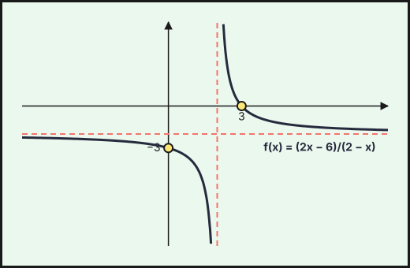{fig-alt="Hipérbola decreciente f(x)=(2x−6)/(2−x) con asíntota vertical en la abscisa 2 y horizontal en la ordenada −2; corta a los ejes en (3,0) y (0,−3)" width="75%" fig-align="center"}
::::
:::::

::::: {.ebau-ej #ebau-2024-ord-b-4}
**Ejercicio 4** · Ordinaria · Modelo B 2024 · Bloque B · *(2,5 puntos)* · [Examen](../../../assets/pau-ccss/2024-ord-b/examen.pdf){target="_blank"}

Se considera la función
$$f(x)=\begin{cases}-x^{2}+4x+3&\text{si }x<4\\2x-5&\text{si }x\ge4\end{cases}$$

a) Estudie su continuidad y derivabilidad. *(0,75 puntos)*

b) Estudie su monotonía y calcule sus extremos relativos. *(0,75 puntos)*

c) Represente la región del plano limitada por la gráfica de $f$, las rectas $x=3$, $x=5$ y el eje de abscisas. Calcule su área. *(1 punto)*

*Relacionado también con:* [Derivadas](06-derivadas.qmd), [Aplicaciones de la derivada](07-aplicaciones-derivada.qmd), [Integrales](08-integrales.qmd).

:::: {.callout-note collapse="true" appearance="simple"}
## Ayuda 1 · Recordatorio

**Continuidad.**

$f$ es continua en $a$ si $\lim_{x\to a^-}f(x)=\lim_{x\to a^+}f(x)=f(a)$. Las funciones elementales son continuas en su dominio; en una función a trozos solo hay que vigilar los puntos de cambio.

**Monotonía y extremos relativos.**

$f'>0$ en un intervalo: creciente; $f'<0$: decreciente. Un extremo relativo en $x=a$ exige $f'(a)=0$; es mínimo si $f'$ pasa de $-$ a $+$ (o $f''(a)>0$) y máximo si pasa de $+$ a $-$ (o $f''(a)<0$).

**Área de un recinto.**

Área entre $y=f(x)$ y el eje $X$: $\int_a^b|f(x)|\,dx$, partiendo en los puntos donde $f$ cambia de signo. Área entre dos curvas: $\int_a^b\left(f(x)-g(x)\right)dx$ con $f\ge g$. Los límites de integración son las abscisas de corte.

**Representar una función.**

Una gráfica se construye con: dominio, cortes con los ejes, asíntotas, monotonía y extremos (con $f'$), curvatura y puntos de inflexión (con $f''$), y una tabla de valores. Convexa si $f''>0$ y cóncava si $f''<0$.
::::

:::: {.callout-note collapse="true" appearance="simple"}
## Ayuda 2 · Método

**Continuidad.**

1. Localiza los puntos problemáticos (cambios de trozo, ceros de denominadores).
2. Calcula los dos límites laterales y $f(a)$.
3. Iguálalos: si hay parámetros, obtienes una ecuación para cada punto.
4. Concluye indicando el tipo de discontinuidad si no es continua (evitable o de salto).

**Monotonía y extremos relativos.**

1. Halla el dominio y calcula $f'(x)$.
2. Resuelve $f'(x)=0$ y localiza también los puntos donde $f'$ no existe.
3. Con esos puntos divide el dominio y estudia el signo de $f'$ en cada intervalo.
4. Escribe intervalos de crecimiento y decrecimiento, y los extremos con sus coordenadas $(a,f(a))$.

**Área de un recinto.**

1. Haz un esbozo del recinto.
2. Calcula los puntos de corte (resolviendo $f=g$ o $f=0$): son los límites.
3. Decide qué función va por encima en cada tramo; si se cruzan, parte la integral.
4. Aplica Barrow y da el área en $\text{u}^2$, siempre positiva.

**Representar una función.**

1. Dominio y cortes.
2. Asíntotas verticales, horizontales y oblicuas con límites.
3. Signo de $f'$: intervalos de crecimiento y extremos.
4. Signo de $f''$ si hace falta, y unos cuantos puntos.
5. Dibuja y comprueba que la gráfica respeta todos los datos anteriores.
::::

:::: {.callout-tip collapse="true" appearance="simple"}
## Solución

**a) Continuidad y derivabilidad.** Cada trozo es un polinomio; solo hay que estudiar $x=4$.
1. Continuidad: por la izquierda, $-16+16+3=3$; por la derecha, $2\cdot4-5=3$: **continua.**
2. Derivadas: $f'(x)=-2x+4$ si $x<4$ y $f'(x)=2$ si $x>4$.
3. En $x=4$: $f'(4^-)=-4\neq f'(4^+)=2$: no derivable (punto anguloso).

**$f$ es continua en $\mathbb R$ y derivable en $\mathbb R\setminus\{4\}$.**

**b) Monotonía y extremos.**
1. Si $x<4$: $f'(x)=-2x+4=0\Rightarrow x=2$, con $f'>0$ en $(-\infty,2)$ y $f'<0$ en $(2,4)$.
2. Si $x>4$: $f'=2>0$.
3. En $x=4$ la función pasa de decrecer a crecer, aunque no sea derivable.

**$f$ crece en $(-\infty,2)\cup(4,+\infty)$ y decrece en $(2,4)$. Máximo relativo en $(2,7)$ y mínimo relativo en $(4,3)$.**

**c) Región y área.**
1. En $[3,5]$, $f>0$ (en $x=3$ vale $6$ y en $x=4$ vale $3$), así que el área es la integral directa.
2. La región es un trozo de parábola entre $x=3$ y $x=4$ seguido de un trozo de recta entre $x=4$ y $x=5$:
$$A=\int_3^4\left(-x^2+4x+3\right)dx+\int_4^5(2x-5)\,dx=\left[-\frac{x^3}{3}+2x^2+3x\right]_3^4+\left[x^2-5x\right]_4^5=\frac{14}{3}+4=\frac{26}{3}.$$

**$A=\dfrac{26}{3}\ \text{u}^2$**

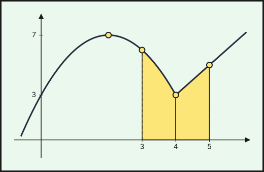{fig-alt="Gráfica de f: parábola −x²+4x+3 con máximo (2,7) hasta x=4 y recta 2x−5 desde (4,3); sombreado entre x=3 y x=5" width="75%" fig-align="center"}
::::
:::::

### Ordinaria · Reserva · Modelo A 2024

::::: {.ebau-ej #ebau-2024-ord-res-a-4}
**Ejercicio 4** · Ordinaria · Reserva · Modelo A 2024 · Bloque B · *(2,5 puntos)* · [Examen](../../../assets/pau-ccss/2024-ord-res-a/examen.pdf){target="_blank"}

Se considera la función $f(x)=\begin{cases}3+e^{x}&\text{si }x<1\\x^{2}+ax+2&\text{si }x\ge1\end{cases}$

a) Determine el valor de $a$ para que la función $f$ sea continua en $\mathbb R$. Para ese valor de $a$, ¿es $f$ derivable? *(1 punto)*

b) Para $a=-3$, calcule la recta tangente a la gráfica de $f$ en el punto de abscisa $x=0$. *(0,5 puntos)*

c) Para $a=-3$, represente la región limitada por la gráfica de $f$, las rectas $x=2$, $x=4$ y el eje de abscisas. Calcule el área de dicha región. *(1 punto)*

*Relacionado también con:* [Derivadas](06-derivadas.qmd), [Integrales](08-integrales.qmd).

:::: {.callout-note collapse="true" appearance="simple"}
## Ayuda 1 · Recordatorio

**Continuidad.**

$f$ es continua en $a$ si $\lim_{x\to a^-}f(x)=\lim_{x\to a^+}f(x)=f(a)$. Las funciones elementales son continuas en su dominio; en una función a trozos solo hay que vigilar los puntos de cambio.

**Derivabilidad.**

$f$ derivable en $a$ si es continua en $a$ y las derivadas laterales coinciden: $f'(a^-)=f'(a^+)$. Derivable implica continua, pero no al revés.

**Recta tangente.**

Tangente a la gráfica de $f$ en $x=a$: $y-f(a)=f'(a)\,(x-a)$. La pendiente es $f'(a)$. Tangente horizontal: $f'(a)=0$. Rectas paralelas tienen la misma pendiente; perpendiculares, $m\cdot m'=-1$.

**Hallar parámetros de una función.**

Cada dato del enunciado da una ecuación: pasa por $(a,b)\Rightarrow f(a)=b$; extremo en $x=a\Rightarrow f'(a)=0$; pendiente $m$ en $x=a\Rightarrow f'(a)=m$; inflexión en $x=a\Rightarrow f''(a)=0$; área o integral dada $\Rightarrow$ igualar la integral.

**Área de un recinto.**

Área entre $y=f(x)$ y el eje $X$: $\int_a^b|f(x)|\,dx$, partiendo en los puntos donde $f$ cambia de signo. Área entre dos curvas: $\int_a^b\left(f(x)-g(x)\right)dx$ con $f\ge g$. Los límites de integración son las abscisas de corte.

**Representar una función.**

Una gráfica se construye con: dominio, cortes con los ejes, asíntotas, monotonía y extremos (con $f'$), curvatura y puntos de inflexión (con $f''$), y una tabla de valores. Convexa si $f''>0$ y cóncava si $f''<0$.
::::

:::: {.callout-note collapse="true" appearance="simple"}
## Ayuda 2 · Método

**Continuidad.**

1. Localiza los puntos problemáticos (cambios de trozo, ceros de denominadores).
2. Calcula los dos límites laterales y $f(a)$.
3. Iguálalos: si hay parámetros, obtienes una ecuación para cada punto.
4. Concluye indicando el tipo de discontinuidad si no es continua (evitable o de salto).

**Derivabilidad.**

1. Impón primero la continuidad en el punto de cambio.
2. Deriva cada trozo y evalúa en el punto, por la izquierda y por la derecha.
3. Iguala las derivadas: segunda ecuación para los parámetros.
4. Resuelve el sistema y comprueba.

**Recta tangente.**

1. Calcula $f(a)$ (el punto) y $f'(x)$.
2. Evalúa $f'(a)$ (la pendiente).
3. Sustituye en la ecuación punto-pendiente.
4. Si el punto no es dato, obtén $a$ de la condición del enunciado (pendiente dada, tangente horizontal…).

**Hallar parámetros de una función.**

1. Lista los datos y escribe una ecuación por cada uno.
2. Resuelve el sistema (suele ser lineal en los parámetros).
3. Comprueba que la función resultante cumple todo, y que el extremo es del tipo pedido.

**Área de un recinto.**

1. Haz un esbozo del recinto.
2. Calcula los puntos de corte (resolviendo $f=g$ o $f=0$): son los límites.
3. Decide qué función va por encima en cada tramo; si se cruzan, parte la integral.
4. Aplica Barrow y da el área en $\text{u}^2$, siempre positiva.

**Representar una función.**

1. Dominio y cortes.
2. Asíntotas verticales, horizontales y oblicuas con límites.
3. Signo de $f'$: intervalos de crecimiento y extremos.
4. Signo de $f''$ si hace falta, y unos cuantos puntos.
5. Dibuja y comprueba que la gráfica respeta todos los datos anteriores.
::::

:::: {.callout-tip collapse="true" appearance="simple"}
## Solución

**a) Continuidad y derivabilidad.**
1. Continuidad en $x=1$: por la izquierda, $3+e$; por la derecha, $1+a+2=3+a$. Así $3+e=3+a$ y **$a=e$.**
2. Derivadas: $f'(x)=e^x$ si $x<1$ y $f'(x)=2x+a$ si $x>1$.
3. En $x=1$: $f'(1^-)=e$ y $f'(1^+)=2+a=2+e$. Como $e\neq2+e$: **$f$ no es derivable en $x=1$.**

**b) Recta tangente en $x=0$** (con $a=-3$).
1. Cerca de $x=0$ la función es $f(x)=3+e^x$: $f(0)=4$ y $f'(0)=e^0=1$.
2. Recta: $y-4=1\cdot(x-0)$.

**$y=x+4$.**

**c) Región y área** (con $a=-3$).
1. Para $x\ge1$: $f(x)=x^2-3x+2=(x-1)(x-2)$, parábola que corta al eje $OX$ en $x=1$ y $x=2$ y que es positiva para $x>2$.
2. En $[2,4]$, $f\ge0$. Barrow:
$$A=\int_2^4\left(x^2-3x+2\right)dx=\left[\frac{x^3}{3}-\frac{3x^2}{2}+2x\right]_2^4=\frac{16}{3}-\frac{2}{3}=\frac{14}{3}.$$

**$A=\dfrac{14}{3}\ \text{u}^2$**

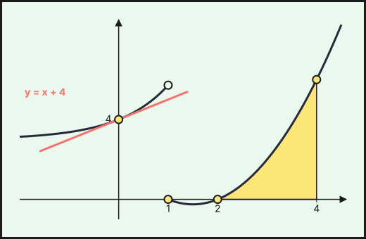{fig-alt="Gráfica de f para a=−3: 3+eˣ hasta x=1 (con salto) y parábola x²−3x+2 desde x=1; recta tangente y=x+4 en x=0 y recinto sombreado entre x=2 y x=4" width="75%" fig-align="center"}
::::
:::::

### Ordinaria · Reserva · Modelo B 2024

::::: {.ebau-ej #ebau-2024-ord-res-b-3}
**Ejercicio 3** · Ordinaria · Reserva · Modelo B 2024 · Bloque B · *(2,5 puntos)* · [Examen](../../../assets/pau-ccss/2024-ord-res-b/examen.pdf){target="_blank"}

Se considera la función
$$f(x)=\begin{cases}x^{2}+ax-1&\text{si }x\le1\\\dfrac{b}{x}&\text{si }1<x\le3\\\dfrac{x-1}{3}&\text{si }x>3\end{cases}$$
con $a$ y $b$ números reales.

a) Determine los valores de $a$ y $b$ para que $f$ sea continua. Para dichos valores, estudie la derivabilidad de $f$. *(1,5 puntos)*

b) Para $a=5$ y $b=2$, represente el recinto limitado por la gráfica de $f$, las rectas $x=2$, $x=4$ y el eje $OX$. Calcule su área. *(1 punto)*

*Relacionado también con:* [Derivadas](06-derivadas.qmd), [Integrales](08-integrales.qmd).

:::: {.callout-note collapse="true" appearance="simple"}
## Ayuda 1 · Recordatorio

**Continuidad.**

$f$ es continua en $a$ si $\lim_{x\to a^-}f(x)=\lim_{x\to a^+}f(x)=f(a)$. Las funciones elementales son continuas en su dominio; en una función a trozos solo hay que vigilar los puntos de cambio.

**Hallar parámetros de una función.**

Cada dato del enunciado da una ecuación: pasa por $(a,b)\Rightarrow f(a)=b$; extremo en $x=a\Rightarrow f'(a)=0$; pendiente $m$ en $x=a\Rightarrow f'(a)=m$; inflexión en $x=a\Rightarrow f''(a)=0$; área o integral dada $\Rightarrow$ igualar la integral.

**Área de un recinto.**

Área entre $y=f(x)$ y el eje $X$: $\int_a^b|f(x)|\,dx$, partiendo en los puntos donde $f$ cambia de signo. Área entre dos curvas: $\int_a^b\left(f(x)-g(x)\right)dx$ con $f\ge g$. Los límites de integración son las abscisas de corte.

**Representar una función.**

Una gráfica se construye con: dominio, cortes con los ejes, asíntotas, monotonía y extremos (con $f'$), curvatura y puntos de inflexión (con $f''$), y una tabla de valores. Convexa si $f''>0$ y cóncava si $f''<0$.
::::

:::: {.callout-note collapse="true" appearance="simple"}
## Ayuda 2 · Método

**Continuidad.**

1. Localiza los puntos problemáticos (cambios de trozo, ceros de denominadores).
2. Calcula los dos límites laterales y $f(a)$.
3. Iguálalos: si hay parámetros, obtienes una ecuación para cada punto.
4. Concluye indicando el tipo de discontinuidad si no es continua (evitable o de salto).

**Hallar parámetros de una función.**

1. Lista los datos y escribe una ecuación por cada uno.
2. Resuelve el sistema (suele ser lineal en los parámetros).
3. Comprueba que la función resultante cumple todo, y que el extremo es del tipo pedido.

**Área de un recinto.**

1. Haz un esbozo del recinto.
2. Calcula los puntos de corte (resolviendo $f=g$ o $f=0$): son los límites.
3. Decide qué función va por encima en cada tramo; si se cruzan, parte la integral.
4. Aplica Barrow y da el área en $\text{u}^2$, siempre positiva.

**Representar una función.**

1. Dominio y cortes.
2. Asíntotas verticales, horizontales y oblicuas con límites.
3. Signo de $f'$: intervalos de crecimiento y extremos.
4. Signo de $f''$ si hace falta, y unos cuantos puntos.
5. Dibuja y comprueba que la gráfica respeta todos los datos anteriores.
::::

:::: {.callout-tip collapse="true" appearance="simple"}
## Solución

**a) Parámetros y derivabilidad.**
1. Continuidad en $x=1$: $\displaystyle\lim_{x\to1^-}f=1+a-1=a$ y $\displaystyle\lim_{x\to1^+}f=b$; luego $a=b$.
2. Continuidad en $x=3$: $\dfrac b3$ (por la izquierda) y $\dfrac{3-1}{3}=\dfrac{2}{3}$ (por la derecha); luego $b=2$.
3. Entonces $a=b=2$.

**$a=b=2$.**

4. Derivadas: $f'(x)=2x+2$ si $x<1$, $f'(x)=-\dfrac{2}{x^2}$ si $1<x<3$ y $f'(x)=\dfrac{1}{3}$ si $x>3$.
5. En $x=1$: $f'(1^-)=4\neq f'(1^+)=-2$.
6. En $x=3$: $f'(3^-)=-\dfrac{2}{9}\neq f'(3^+)=\dfrac{1}{3}$.

**$f$ es derivable en $\mathbb R\setminus\{1,3\}$.**

**b) Recinto y área** (con $a=5$ y $b=2$).
1. Entre $x=2$ y $x=4$ solo intervienen los dos últimos trozos (el valor de $a$ no influye).
2. En $[2,3]$, $f(x)=\dfrac2x$ (hipérbola decreciente de $(2,1)$ a $\left(3,\dfrac{2}{3}\right)$); en $(3,4]$, $f(x)=\dfrac{x-1}{3}$ (recta de $\left(3,\dfrac{2}{3}\right)$ a $(4,1)$). Ambas son positivas.

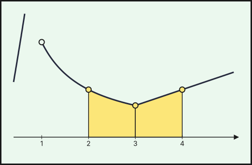{fig-alt="Gráfica de f para a=5 y b=2 entre x=1 y x=5: hipérbola 2/x hasta x=3 y recta (x−1)/3 desde (3,2/3); recinto sombreado entre x=2 y x=4" width="75%" fig-align="center"}

3. Área, integral por tramos:
$$A=\int_2^3\frac2x\,dx+\int_3^4\frac{x-1}{3}\,dx=2\ln\frac{3}{2}+\left[\frac{(x-1)^2}{6}\right]_3^4=2\ln\frac{3}{2}+\frac{9-4}{6}=2\ln\frac{3}{2}+\frac{5}{6}.$$

**$A=2\ln\dfrac{3}{2}+\dfrac{5}{6}\approx1{,}644\ \text{u}^2$**
::::
:::::

::::: {.ebau-ej #ebau-2024-ord-res-b-4}
**Ejercicio 4** · Ordinaria · Reserva · Modelo B 2024 · Bloque B · *(2,5 puntos)* · [Examen](../../../assets/pau-ccss/2024-ord-res-b/examen.pdf){target="_blank"}

Se considera la función
$$f(x)=\begin{cases}-\dfrac{1}{2}x^{2}+x+1&\text{si }x\le2\\\dfrac{1}{x-1}&\text{si }x>2\end{cases}$$

a) Estudie la continuidad, derivabilidad y monotonía de $f$. Represente gráficamente dicha función. *(1,5 puntos)*

b) Calcule el área del recinto limitado por la gráfica de $f$, las rectas $x=0$, $x=4$ y el eje $OX$. *(1 punto)*

*Relacionado también con:* [Aplicaciones de la derivada](07-aplicaciones-derivada.qmd), [Integrales](08-integrales.qmd).

:::: {.callout-note collapse="true" appearance="simple"}
## Ayuda 1 · Recordatorio

**Continuidad.**

$f$ es continua en $a$ si $\lim_{x\to a^-}f(x)=\lim_{x\to a^+}f(x)=f(a)$. Las funciones elementales son continuas en su dominio; en una función a trozos solo hay que vigilar los puntos de cambio.

**Monotonía y extremos relativos.**

$f'>0$ en un intervalo: creciente; $f'<0$: decreciente. Un extremo relativo en $x=a$ exige $f'(a)=0$; es mínimo si $f'$ pasa de $-$ a $+$ (o $f''(a)>0$) y máximo si pasa de $+$ a $-$ (o $f''(a)<0$).

**Área de un recinto.**

Área entre $y=f(x)$ y el eje $X$: $\int_a^b|f(x)|\,dx$, partiendo en los puntos donde $f$ cambia de signo. Área entre dos curvas: $\int_a^b\left(f(x)-g(x)\right)dx$ con $f\ge g$. Los límites de integración son las abscisas de corte.

**Representar una función.**

Una gráfica se construye con: dominio, cortes con los ejes, asíntotas, monotonía y extremos (con $f'$), curvatura y puntos de inflexión (con $f''$), y una tabla de valores. Convexa si $f''>0$ y cóncava si $f''<0$.
::::

:::: {.callout-note collapse="true" appearance="simple"}
## Ayuda 2 · Método

**Continuidad.**

1. Localiza los puntos problemáticos (cambios de trozo, ceros de denominadores).
2. Calcula los dos límites laterales y $f(a)$.
3. Iguálalos: si hay parámetros, obtienes una ecuación para cada punto.
4. Concluye indicando el tipo de discontinuidad si no es continua (evitable o de salto).

**Monotonía y extremos relativos.**

1. Halla el dominio y calcula $f'(x)$.
2. Resuelve $f'(x)=0$ y localiza también los puntos donde $f'$ no existe.
3. Con esos puntos divide el dominio y estudia el signo de $f'$ en cada intervalo.
4. Escribe intervalos de crecimiento y decrecimiento, y los extremos con sus coordenadas $(a,f(a))$.

**Área de un recinto.**

1. Haz un esbozo del recinto.
2. Calcula los puntos de corte (resolviendo $f=g$ o $f=0$): son los límites.
3. Decide qué función va por encima en cada tramo; si se cruzan, parte la integral.
4. Aplica Barrow y da el área en $\text{u}^2$, siempre positiva.

**Representar una función.**

1. Dominio y cortes.
2. Asíntotas verticales, horizontales y oblicuas con límites.
3. Signo de $f'$: intervalos de crecimiento y extremos.
4. Signo de $f''$ si hace falta, y unos cuantos puntos.
5. Dibuja y comprueba que la gráfica respeta todos los datos anteriores.
::::

:::: {.callout-tip collapse="true" appearance="simple"}
## Solución

**a) Continuidad, derivabilidad, monotonía y gráfica.**
1. Continuidad en $x=2$: $-2+2+1=1$ y $\dfrac{1}{2-1}=1$; cada tramo es continuo en su intervalo: **continua.**
2. Derivadas: $f'(x)=1-x$ si $x<2$ y $f'(x)=-\dfrac{1}{(x-1)^2}$ si $x>2$.
3. En $x=2$: $f'(2^-)=-1=f'(2^+)$: **derivable.**

**$f$ es continua y derivable en $\mathbb R$.**

4. Monotonía: $f'>0$ en $(-\infty,1)$ y $f'<0$ en $(1,2)$ y en $(2,+\infty)$.

**$f$ crece en $(-\infty,1)$ y decrece en $(1,+\infty)$, con máximo en $\left(1,\dfrac{3}{2}\right)$.**

5. Gráfica: arco de parábola abierta hacia abajo con vértice $\left(1,\dfrac{3}{2}\right)$, que pasa por $(0,1)$ y llega a $(2,1)$; a partir de ahí, la rama de hipérbola $y=\dfrac{1}{x-1}$ decreciente, con asíntota horizontal $y=0$ (pasa por $\left(3,\dfrac{1}{2}\right)$).

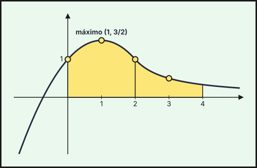{fig-alt="Gráfica de f: parábola con máximo (1, 3/2) hasta (2,1) y hipérbola 1/(x−1) decreciente desde ahí; recinto sombreado entre x=0 y x=4" width="75%" fig-align="center"}

**b) Área.**
1. En $[0,4]$, $f>0$.
2. Se integra por tramos (la expresión cambia en $x=2$):
$$A=\int_0^2\left(-\frac{x^2}{2}+x+1\right)dx+\int_2^4\frac{dx}{x-1}=\left[-\frac{x^3}{6}+\frac{x^2}{2}+x\right]_0^2+\left[\ln(x-1)\right]_2^4=\frac{8}{3}+\ln3.$$

**$A=\dfrac{8}{3}+\ln3\approx3{,}765\ \text{u}^2$**
::::
:::::

### Ordinaria · Suplente · Modelo A 2024

::::: {.ebau-ej #ebau-2024-ord-sup-a-4}
**Ejercicio 4** · Ordinaria · Suplente · Modelo A 2024 · Bloque B · *(2,5 puntos)* · [Examen](../../../assets/pau-ccss/2024-ord-sup-a/examen.pdf){target="_blank"}

Se consideran las funciones
$$f(x)=\begin{cases}2-x^{2}&\text{si }-1\le x\le1\\(x-2)^{2}&\text{si }1<x\le3\end{cases}\qquad;\qquad g(x)=1\quad\text{si }-1\le x\le3$$

a) Estudie la continuidad y la derivabilidad de $f$ y $g$ en sus dominios. *(1 punto)*

b) Represente el recinto limitado por las gráficas de ambas funciones y calcule su área. *(1,5 puntos)*

*Relacionado también con:* [Derivadas](06-derivadas.qmd), [Integrales](08-integrales.qmd).

:::: {.callout-note collapse="true" appearance="simple"}
## Ayuda 1 · Recordatorio

**Continuidad.**

$f$ es continua en $a$ si $\lim_{x\to a^-}f(x)=\lim_{x\to a^+}f(x)=f(a)$. Las funciones elementales son continuas en su dominio; en una función a trozos solo hay que vigilar los puntos de cambio.

**Área de un recinto.**

Área entre $y=f(x)$ y el eje $X$: $\int_a^b|f(x)|\,dx$, partiendo en los puntos donde $f$ cambia de signo. Área entre dos curvas: $\int_a^b\left(f(x)-g(x)\right)dx$ con $f\ge g$. Los límites de integración son las abscisas de corte.

**Representar una función.**

Una gráfica se construye con: dominio, cortes con los ejes, asíntotas, monotonía y extremos (con $f'$), curvatura y puntos de inflexión (con $f''$), y una tabla de valores. Convexa si $f''>0$ y cóncava si $f''<0$.
::::

:::: {.callout-note collapse="true" appearance="simple"}
## Ayuda 2 · Método

**Continuidad.**

1. Localiza los puntos problemáticos (cambios de trozo, ceros de denominadores).
2. Calcula los dos límites laterales y $f(a)$.
3. Iguálalos: si hay parámetros, obtienes una ecuación para cada punto.
4. Concluye indicando el tipo de discontinuidad si no es continua (evitable o de salto).

**Área de un recinto.**

1. Haz un esbozo del recinto.
2. Calcula los puntos de corte (resolviendo $f=g$ o $f=0$): son los límites.
3. Decide qué función va por encima en cada tramo; si se cruzan, parte la integral.
4. Aplica Barrow y da el área en $\text{u}^2$, siempre positiva.

**Representar una función.**

1. Dominio y cortes.
2. Asíntotas verticales, horizontales y oblicuas con límites.
3. Signo de $f'$: intervalos de crecimiento y extremos.
4. Signo de $f''$ si hace falta, y unos cuantos puntos.
5. Dibuja y comprueba que la gráfica respeta todos los datos anteriores.
::::

:::: {.callout-tip collapse="true" appearance="simple"}
## Solución

**a) Continuidad y derivabilidad.**
1. $g(x)=1$ es constante: **continua y derivable en $[-1,3]$.**
2. Para $f$, solo hay que estudiar $x=1$: $\displaystyle\lim_{x\to1^-}\left(2-x^2\right)=1$ y $f(1)=(1-2)^2=1$: **continua.**
3. Derivadas: $f'(x)=-2x$ si $-1<x<1$ y $f'(x)=2(x-2)$ si $1<x<3$.
4. En $x=1$: $f'(1^-)=-2=f'(1^+)$: **derivable.**

**$f$ es continua y derivable en $[-1,3]$ (en el interior del intervalo; en los extremos solo hay derivadas laterales).**

**b) Recinto y área.**
1. Cortes de $f$ con $g$: $2-x^2=1$ en $[-1,1]$ da $x=\pm1$; $(x-2)^2=1$ en $(1,3]$ da $x=3$ (y en $x=1$ también). Es decir, $x=-1$, $x=1$ y $x=3$.
2. En $[-1,1]$ la parábola $2-x^2$ queda sobre la recta $y=1$ (vale $2$ en $x=0$); en $[1,3]$ la parábola $(x-2)^2$ queda bajo la recta (vale $0$ en $x=2$).
3. En cada tramo se resta la función de abajo a la de arriba:
$$A=\int_{-1}^{1}\left(2-x^2-1\right)dx+\int_1^3\left(1-(x-2)^2\right)dx=\left[x-\frac{x^3}{3}\right]_{-1}^{1}+\left[x-\frac{(x-2)^3}{3}\right]_1^3=\frac{4}{3}+\frac{4}{3}=\frac{8}{3}.$$

**$A=\dfrac{8}{3}\ \text{u}^2$**

![Recinto entre f (parábolas 2−x² en [−1,1] y (x−2)² en [1,3]) y la recta g(x)=1, con cortes en x=−1, 1 y 3](fig/2024-ord-sup-a-e4.svg){fig-alt="Recinto entre f (parábolas 2−x² en [−1,1] y (x−2)² en [1,3]) y la recta g(x)=1, con cortes en x=−1, 1 y 3" width="75%" fig-align="center"}
::::
:::::

### Ordinaria · Suplente · Modelo B 2024

::::: {.ebau-ej #ebau-2024-ord-sup-b-4}
**Ejercicio 4** · Ordinaria · Suplente · Modelo B 2024 · Bloque B · *(2,5 puntos)* · [Examen](../../../assets/pau-ccss/2024-ord-sup-b/examen.pdf){target="_blank"}

Se considera la función
$$f(x)=\begin{cases}-x^{2}+2x&\text{si }x<2\\x^{2}-2x&\text{si }x\ge2\end{cases}$$

a) Estudie la continuidad y derivabilidad de $f$. *(1 punto)*

b) Represente el recinto limitado por las rectas $y=2x$, $x=-1$, $x=1$ y la gráfica de $f$. Calcule su área. *(1,5 puntos)*

*Relacionado también con:* [Derivadas](06-derivadas.qmd), [Integrales](08-integrales.qmd).

:::: {.callout-note collapse="true" appearance="simple"}
## Ayuda 1 · Recordatorio

**Continuidad.**

$f$ es continua en $a$ si $\lim_{x\to a^-}f(x)=\lim_{x\to a^+}f(x)=f(a)$. Las funciones elementales son continuas en su dominio; en una función a trozos solo hay que vigilar los puntos de cambio.

**Área de un recinto.**

Área entre $y=f(x)$ y el eje $X$: $\int_a^b|f(x)|\,dx$, partiendo en los puntos donde $f$ cambia de signo. Área entre dos curvas: $\int_a^b\left(f(x)-g(x)\right)dx$ con $f\ge g$. Los límites de integración son las abscisas de corte.

**Representar una función.**

Una gráfica se construye con: dominio, cortes con los ejes, asíntotas, monotonía y extremos (con $f'$), curvatura y puntos de inflexión (con $f''$), y una tabla de valores. Convexa si $f''>0$ y cóncava si $f''<0$.
::::

:::: {.callout-note collapse="true" appearance="simple"}
## Ayuda 2 · Método

**Continuidad.**

1. Localiza los puntos problemáticos (cambios de trozo, ceros de denominadores).
2. Calcula los dos límites laterales y $f(a)$.
3. Iguálalos: si hay parámetros, obtienes una ecuación para cada punto.
4. Concluye indicando el tipo de discontinuidad si no es continua (evitable o de salto).

**Área de un recinto.**

1. Haz un esbozo del recinto.
2. Calcula los puntos de corte (resolviendo $f=g$ o $f=0$): son los límites.
3. Decide qué función va por encima en cada tramo; si se cruzan, parte la integral.
4. Aplica Barrow y da el área en $\text{u}^2$, siempre positiva.

**Representar una función.**

1. Dominio y cortes.
2. Asíntotas verticales, horizontales y oblicuas con límites.
3. Signo de $f'$: intervalos de crecimiento y extremos.
4. Signo de $f''$ si hace falta, y unos cuantos puntos.
5. Dibuja y comprueba que la gráfica respeta todos los datos anteriores.
::::

:::: {.callout-tip collapse="true" appearance="simple"}
## Solución

**a) Continuidad y derivabilidad.** Cada trozo es un polinomio; solo hay que estudiar $x=2$.
1. Continuidad: $\displaystyle\lim_{x\to2^-}\left(-x^2+2x\right)=0$ y $f(2)=4-4=0$: **continua.**
2. Derivadas: $f'(x)=-2x+2$ si $x<2$ y $f'(x)=2x-2$ si $x>2$.
3. En $x=2$: $f'(2^-)=-2\neq f'(2^+)=2$: no derivable (punto anguloso).

**$f$ es continua en $\mathbb R$ y derivable en $\mathbb R\setminus\{2\}$.**

**b) Recinto y área.**
1. En $[-1,1]$, $f(x)=-x^2+2x$ (parábola abierta hacia abajo con vértice $(1,1)$).
2. La recta $y=2x$ y la parábola se cortan donde $-x^2+2x=2x\iff x=0$ (en ese punto son tangentes).
3. Como $2x-\left(-x^2+2x\right)=x^2\ge0$, la recta queda por encima de la parábola en todo el intervalo $[-1,1]$.
4. Área: integral de la función de arriba menos la de abajo:
$$A=\int_{-1}^{1}\left[2x-\left(-x^2+2x\right)\right]dx=\int_{-1}^{1}x^2\,dx=\left[\frac{x^3}{3}\right]_{-1}^{1}=\frac{2}{3}.$$

**$A=\dfrac{2}{3}\ \text{u}^2$**

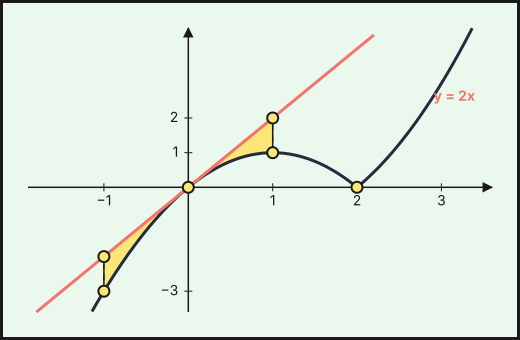{fig-alt="Recinto entre la recta y=2x y la parábola −x²+2x entre x=−1 y x=1, tangentes en el origen; la gráfica de f continúa con x²−2x desde x=2" width="75%" fig-align="center"}
::::
:::::

## 2023

### Ordinaria · Reserva · Modelo A 2023

::::: {.ebau-ej #ebau-2023-ord-res-a-4}
**Ejercicio 4** · Ordinaria · Reserva · Modelo A 2023 · Bloque B · *(2,5 puntos)* · [Examen](../../../assets/pau-ccss/2023-ord-res-a/examen.pdf){target="_blank"}

Se considera la función
$$f(x)=\begin{cases}x^{3}+2x^{2}-3&x\le1\\1+\dfrac{1}{x-2}&x>1\end{cases}$$

a) Estudie la continuidad de $f$. Si la función no es continua en algún punto, indique el tipo de discontinuidad que presenta. *(1 punto)*

b) Estudie la derivabilidad de $f$. *(0,75 puntos)*

c) Determine las asíntotas de $f$. *(0,75 puntos)*

*Relacionado también con:* [Derivadas](06-derivadas.qmd).

:::: {.callout-note collapse="true" appearance="simple"}
## Ayuda 1 · Recordatorio

**Continuidad.**

$f$ es continua en $a$ si $\lim_{x\to a^-}f(x)=\lim_{x\to a^+}f(x)=f(a)$. Las funciones elementales son continuas en su dominio; en una función a trozos solo hay que vigilar los puntos de cambio.

**Límites y asíntotas.**

Asíntota vertical $x=a$: $\lim_{x\to a}f(x)=\pm\infty$. Horizontal $y=b$: $\lim_{x\to\pm\infty}f(x)=b$. Oblicua $y=mx+n$: $m=\lim\dfrac{f(x)}{x}$, $n=\lim\,(f(x)-mx)$. Indeterminaciones $\dfrac{0}{0}$ (factoriza o L'Hôpital), $\dfrac{\infty}{\infty}$ (mayor grado), $\infty-\infty$ (opera).
::::

:::: {.callout-note collapse="true" appearance="simple"}
## Ayuda 2 · Método

**Continuidad.**

1. Localiza los puntos problemáticos (cambios de trozo, ceros de denominadores).
2. Calcula los dos límites laterales y $f(a)$.
3. Iguálalos: si hay parámetros, obtienes una ecuación para cada punto.
4. Concluye indicando el tipo de discontinuidad si no es continua (evitable o de salto).

**Límites y asíntotas.**

1. Para asíntotas verticales, busca los puntos que anulan el denominador y calcula los límites laterales.
2. Para las horizontales, calcula el límite en $+\infty$ y en $-\infty$.
3. Si no hay horizontal en ese lado, prueba la oblicua.
4. Escribe las ecuaciones de las rectas.
::::

:::: {.callout-tip collapse="true" appearance="simple"}
## Solución

**a) Continuidad.**
1. El dominio es $\mathbb R\setminus\{2\}$ (el segundo tramo no está definido en $x=2$). Cada tramo es continuo en su intervalo.
2. En $x=1$: $f(1)=1+2-3=0$ y $\displaystyle\lim_{x\to1^+}\left(1+\frac{1}{x-2}\right)=1-1=0$: **continua en $x=1$.**
3. En $x=2$ hay $\displaystyle\lim_{x\to2^\pm}\frac{1}{x-2}=\pm\infty$: **discontinuidad de salto infinito (asintótica) en $x=2$.**

**$f$ es continua en $\mathbb R\setminus\{2\}$.**

**b) Derivabilidad.**
1. Derivadas por tramos: $f'(x)=3x^2+4x$ si $x<1$ y $f'(x)=-\dfrac{1}{(x-2)^2}$ si $x>1$.
2. En $x=1$: $f'(1^-)=7\neq f'(1^+)=-1$. Las derivadas laterales no coinciden.

**$f$ es derivable en $\mathbb R\setminus\{1,2\}$** y no lo es en $x=1$.

**c) Asíntotas.**
1. Vertical: $\displaystyle\lim_{x\to2^+}f=+\infty$, así que **$x=2$** es asíntota vertical.
2. Horizontal en $+\infty$: $\displaystyle\lim_{x\to+\infty}f=1$, luego **$y=1$** es asíntota horizontal.
3. En $-\infty$ el tramo cúbico no tiene asíntotas.
::::
:::::

### Ordinaria · Reserva · Modelo B 2023

::::: {.ebau-ej #ebau-2023-ord-res-b-4}
**Ejercicio 4** · Ordinaria · Reserva · Modelo B 2023 · Bloque B · *(2,5 puntos)* · [Examen](../../../assets/pau-ccss/2023-ord-res-b/examen.pdf){target="_blank"}

La temperatura en el interior de un equipo de refrigeración durante un día que sufrió un corte de energía viene dada por la función $f$ expresada en grados centígrados y el tiempo $t$ en horas:
$$f(t)=\begin{cases}-9&0\le t\le1\\-t^{2}+12t-20&1<t<11\\-9&11\le t\le24\end{cases}$$

a) Estudie la continuidad de $f$. *(0,75 puntos)*

b) Represente gráficamente la función $f$. *(0,75 puntos)*

c) Conteste razonadamente a qué hora se produjo el corte de energía y cuánto duró dicho corte. *(0,5 puntos)*

d) El equipo de refrigeración se utiliza para conservar suelos y vacunas. Los suelos se estropean si se alcanzan temperaturas de $20\,^\circ\text{C}$ en algún momento. Las vacunas se estropean si están por encima de $0\,^\circ\text{C}$ durante más de seis horas. Razone si alguno de esos productos se estropeó ese día. *(0,5 puntos)*

*Relacionado también con:* [Funciones](04-funciones.qmd), [Aplicaciones de la derivada](07-aplicaciones-derivada.qmd).

:::: {.callout-note collapse="true" appearance="simple"}
## Ayuda 1 · Recordatorio

**Continuidad.**

$f$ es continua en $a$ si $\lim_{x\to a^-}f(x)=\lim_{x\to a^+}f(x)=f(a)$. Las funciones elementales son continuas en su dominio; en una función a trozos solo hay que vigilar los puntos de cambio.

**Representar una función.**

Una gráfica se construye con: dominio, cortes con los ejes, asíntotas, monotonía y extremos (con $f'$), curvatura y puntos de inflexión (con $f''$), y una tabla de valores. Convexa si $f''>0$ y cóncava si $f''<0$.
::::

:::: {.callout-note collapse="true" appearance="simple"}
## Ayuda 2 · Método

**Continuidad.**

1. Localiza los puntos problemáticos (cambios de trozo, ceros de denominadores).
2. Calcula los dos límites laterales y $f(a)$.
3. Iguálalos: si hay parámetros, obtienes una ecuación para cada punto.
4. Concluye indicando el tipo de discontinuidad si no es continua (evitable o de salto).

**Representar una función.**

1. Dominio y cortes.
2. Asíntotas verticales, horizontales y oblicuas con límites.
3. Signo de $f'$: intervalos de crecimiento y extremos.
4. Signo de $f''$ si hace falta, y unos cuantos puntos.
5. Dibuja y comprueba que la gráfica respeta todos los datos anteriores.
::::

:::: {.callout-tip collapse="true" appearance="simple"}
## Solución

**a) Continuidad.**
1. Cada tramo es continuo en su intervalo (constantes y polinomio). Solo hay que mirar $t=1$ y $t=11$.
2. En $t=1$: $-1+12-20=-9=f(1)$.
3. En $t=11$: $-121+132-20=-9=f(11)$.

**$f$ es continua en todo su dominio $[0,24]$.**

**b) Gráfica.**
1. Es la recta constante $y=-9$ en $[0,1]$ y en $[11,24]$.
2. Entre $t=1$ y $t=11$ es un arco de parábola abierta hacia abajo con máximo en $t=6$: $f(6)=-36+72-20=16$.
3. Corta al eje $OX$ en $t=2$ y $t=10$.

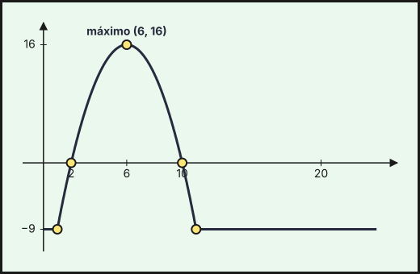{fig-alt="Temperatura f(t): constante −9 °C hasta la hora 1, arco de parábola con máximo 16 °C en t=6 entre las horas 1 y 11, y de nuevo −9 °C hasta t=24" width="75%" fig-align="center"}

**c) Corte de energía.**
1. Con el equipo funcionando, la temperatura es constante ($-9\,^\circ$C).
2. Cuando se produce el corte la temperatura empieza a subir, y el equipo vuelve a $-9\,^\circ$C cuando se restablece la energía.

**El corte empezó a la $1$ ($t=1$) y terminó a las $11$ ($t=11$); duró $10$ horas.**

**d) ¿Se estropeó algo?**
1. Suelos (se estropean al llegar a $20\,^\circ$C): el máximo de $f$ es $f(6)=16<20$. **Los suelos no se estropean.**
2. Vacunas (se estropean si están por encima de $0\,^\circ$C más de seis horas): $f(t)>0\iff-t^2+12t-20>0\iff2<t<10$.
3. La temperatura está por encima de $0\,^\circ$C durante $10-2=8$ horas, más de seis: **las vacunas sí se estropean.**
::::
:::::

### Ordinaria · Suplente · Modelo A 2023

::::: {.ebau-ej #ebau-2023-ord-sup-a-3}
**Ejercicio 3** · Ordinaria · Suplente · Modelo A 2023 · Bloque B · *(2,5 puntos)* · [Examen](../../../assets/pau-ccss/2023-ord-sup-a/examen.pdf){target="_blank"}

a) Se considera la función
$$f(x)=\begin{cases}ax^{2}+bx+6&x\le2{,}5\\-1{,}4x+7&x>2{,}5\end{cases}$$
con $a$ y $b$ números reales. Calcule el valor de los parámetros $a$ y $b$ para que la función sea continua y tenga un máximo en $x=1$. *(1,5 puntos)*

b) Represente gráficamente la función $g(x)=-2x^{2}+2x+4$ y calcule el área de la región acotada, limitada por la gráfica de dicha función y el eje de abscisas. *(1 punto)*

*Relacionado también con:* [Aplicaciones de la derivada](07-aplicaciones-derivada.qmd), [Integrales](08-integrales.qmd).

:::: {.callout-note collapse="true" appearance="simple"}
## Ayuda 1 · Recordatorio

**Continuidad.**

$f$ es continua en $a$ si $\lim_{x\to a^-}f(x)=\lim_{x\to a^+}f(x)=f(a)$. Las funciones elementales son continuas en su dominio; en una función a trozos solo hay que vigilar los puntos de cambio.

**Hallar parámetros de una función.**

Cada dato del enunciado da una ecuación: pasa por $(a,b)\Rightarrow f(a)=b$; extremo en $x=a\Rightarrow f'(a)=0$; pendiente $m$ en $x=a\Rightarrow f'(a)=m$; inflexión en $x=a\Rightarrow f''(a)=0$; área o integral dada $\Rightarrow$ igualar la integral.

**Área de un recinto.**

Área entre $y=f(x)$ y el eje $X$: $\int_a^b|f(x)|\,dx$, partiendo en los puntos donde $f$ cambia de signo. Área entre dos curvas: $\int_a^b\left(f(x)-g(x)\right)dx$ con $f\ge g$. Los límites de integración son las abscisas de corte.

**Representar una función.**

Una gráfica se construye con: dominio, cortes con los ejes, asíntotas, monotonía y extremos (con $f'$), curvatura y puntos de inflexión (con $f''$), y una tabla de valores. Convexa si $f''>0$ y cóncava si $f''<0$.
::::

:::: {.callout-note collapse="true" appearance="simple"}
## Ayuda 2 · Método

**Continuidad.**

1. Localiza los puntos problemáticos (cambios de trozo, ceros de denominadores).
2. Calcula los dos límites laterales y $f(a)$.
3. Iguálalos: si hay parámetros, obtienes una ecuación para cada punto.
4. Concluye indicando el tipo de discontinuidad si no es continua (evitable o de salto).

**Hallar parámetros de una función.**

1. Lista los datos y escribe una ecuación por cada uno.
2. Resuelve el sistema (suele ser lineal en los parámetros).
3. Comprueba que la función resultante cumple todo, y que el extremo es del tipo pedido.

**Área de un recinto.**

1. Haz un esbozo del recinto.
2. Calcula los puntos de corte (resolviendo $f=g$ o $f=0$): son los límites.
3. Decide qué función va por encima en cada tramo; si se cruzan, parte la integral.
4. Aplica Barrow y da el área en $\text{u}^2$, siempre positiva.

**Representar una función.**

1. Dominio y cortes.
2. Asíntotas verticales, horizontales y oblicuas con límites.
3. Signo de $f'$: intervalos de crecimiento y extremos.
4. Signo de $f''$ si hace falta, y unos cuantos puntos.
5. Dibuja y comprueba que la gráfica respeta todos los datos anteriores.
::::

:::: {.callout-tip collapse="true" appearance="simple"}
## Solución

**a) Parámetros $a$ y $b$.**
1. Continuidad en $x=2{,}5$: $6{,}25a+2{,}5b+6=-1{,}4\cdot2{,}5+7=3{,}5$, es decir, $6{,}25a+2{,}5b=-2{,}5$.
2. Máximo en $x=1$ (está en el primer tramo): $f'(x)=2ax+b$ y $f'(1)=2a+b=0\Rightarrow b=-2a$.
3. Se sustituye: $6{,}25a-5a=1{,}25a=-2{,}5\Rightarrow a=-2$ y $b=4$.

**$a=-2$ y $b=4$.** (Comprobación: $f(x)=-2x^2+4x+6$ tiene un máximo en $x=1$, $f(1)=8$, y $f''=-4<0$.)

**b) Gráfica y área de $g(x)=-2x^2+2x+4$.**
1. Se factoriza: $g(x)=-2(x-2)(x+1)$, parábola abierta hacia abajo.
2. Corta al eje $OX$ en $x=-1$ y $x=2$, al eje $OY$ en $(0,4)$, y su vértice es $\left(\dfrac{1}{2},\dfrac{9}{2}\right)$.

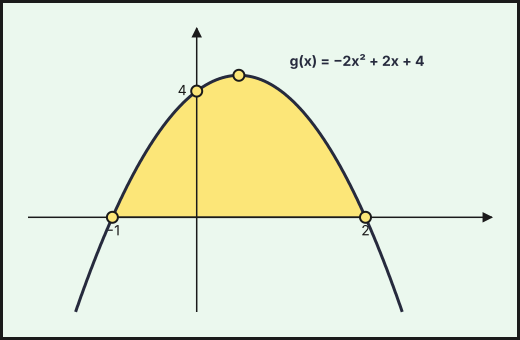{fig-alt="Parábola g(x)=−2x²+2x+4 con vértice (1/2, 9/2) y cortes con el eje X en x=−1 y x=2; recinto sombreado entre ambas raíces" width="75%" fig-align="center"}

3. El recinto acotado está entre las raíces, donde $g\ge0$. Barrow:
$$A=\int_{-1}^{2}\left(-2x^2+2x+4\right)dx=\left[-\frac{2x^3}{3}+x^2+4x\right]_{-1}^{2}=\frac{20}{3}-\left(-\frac{7}{3}\right)=9.$$

**$A=9\ \text{u}^2$**
::::
:::::

::::: {.ebau-ej #ebau-2023-ord-sup-a-4}
**Ejercicio 4** · Ordinaria · Suplente · Modelo A 2023 · Bloque B · *(2,5 puntos)* · [Examen](../../../assets/pau-ccss/2023-ord-sup-a/examen.pdf){target="_blank"}

Se considera la función $f(x)=\begin{cases}\dfrac{x^{2}}{3}&0\le x\le2\\\dfrac{4}{x+1}&x>2\end{cases}$

a) Estudie la continuidad y derivabilidad de la función $f$. *(1,25 puntos)*

b) Determine los intervalos de crecimiento y decrecimiento, el máximo de la función y represente gráficamente la función $f$. *(1,25 puntos)*

*Relacionado también con:* [Derivadas](06-derivadas.qmd), [Aplicaciones de la derivada](07-aplicaciones-derivada.qmd).

:::: {.callout-note collapse="true" appearance="simple"}
## Ayuda 1 · Recordatorio

**Continuidad.**

$f$ es continua en $a$ si $\lim_{x\to a^-}f(x)=\lim_{x\to a^+}f(x)=f(a)$. Las funciones elementales son continuas en su dominio; en una función a trozos solo hay que vigilar los puntos de cambio.

**Monotonía y extremos relativos.**

$f'>0$ en un intervalo: creciente; $f'<0$: decreciente. Un extremo relativo en $x=a$ exige $f'(a)=0$; es mínimo si $f'$ pasa de $-$ a $+$ (o $f''(a)>0$) y máximo si pasa de $+$ a $-$ (o $f''(a)<0$).

**Representar una función.**

Una gráfica se construye con: dominio, cortes con los ejes, asíntotas, monotonía y extremos (con $f'$), curvatura y puntos de inflexión (con $f''$), y una tabla de valores. Convexa si $f''>0$ y cóncava si $f''<0$.
::::

:::: {.callout-note collapse="true" appearance="simple"}
## Ayuda 2 · Método

**Continuidad.**

1. Localiza los puntos problemáticos (cambios de trozo, ceros de denominadores).
2. Calcula los dos límites laterales y $f(a)$.
3. Iguálalos: si hay parámetros, obtienes una ecuación para cada punto.
4. Concluye indicando el tipo de discontinuidad si no es continua (evitable o de salto).

**Monotonía y extremos relativos.**

1. Halla el dominio y calcula $f'(x)$.
2. Resuelve $f'(x)=0$ y localiza también los puntos donde $f'$ no existe.
3. Con esos puntos divide el dominio y estudia el signo de $f'$ en cada intervalo.
4. Escribe intervalos de crecimiento y decrecimiento, y los extremos con sus coordenadas $(a,f(a))$.

**Representar una función.**

1. Dominio y cortes.
2. Asíntotas verticales, horizontales y oblicuas con límites.
3. Signo de $f'$: intervalos de crecimiento y extremos.
4. Signo de $f''$ si hace falta, y unos cuantos puntos.
5. Dibuja y comprueba que la gráfica respeta todos los datos anteriores.
::::

:::: {.callout-tip collapse="true" appearance="simple"}
## Solución

**a) Continuidad y derivabilidad.**
1. En $x=2$: $\dfrac{2^2}{3}=\dfrac{4}{3}$ y $\dfrac{4}{2+1}=\dfrac{4}{3}$: **continua en $x=2$.**
2. Dentro de cada tramo es continua (el segundo no anula el denominador para $x>2$): **$f$ es continua en $[0,+\infty)$.**
3. Derivadas por tramos: $f'(x)=\dfrac{2x}{3}$ si $0<x<2$ y $f'(x)=-\dfrac{4}{(x+1)^2}$ si $x>2$.
4. En $x=2$: $f'(2^-)=\dfrac{4}{3}\neq f'(2^+)=-\dfrac{4}{9}$: **no es derivable en $x=2$** (sí en $(0,2)\cup(2,+\infty)$).

**b) Monotonía, máximo y gráfica.**
1. $f'>0$ en $(0,2)$ y $f'<0$ en $(2,+\infty)$.
2. **$f$ crece en $(0,2)$ y decrece en $(2,+\infty)$; máximo en $\left(2,\dfrac{4}{3}\right)$.**
3. Gráfica: arco de parábola $y=\dfrac{x^2}{3}$ desde $(0,0)$ hasta el pico $\left(2,\dfrac{4}{3}\right)$, y desde ahí la rama de hipérbola $y=\dfrac{4}{x+1}$ decreciente, con asíntota horizontal $y=0$ (pasa por $(3,1)$).

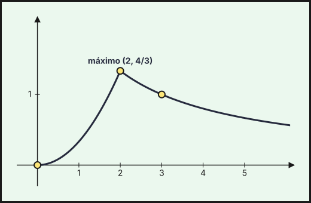{fig-alt="Gráfica de f: parábola x²/3 creciente hasta el máximo (2, 4/3) e hipérbola 4/(x+1) decreciente desde ese punto" width="75%" fig-align="center"}
::::
:::::

### Ordinaria · Suplente · Modelo B 2023

::::: {.ebau-ej #ebau-2023-ord-sup-b-3}
**Ejercicio 3** · Ordinaria · Suplente · Modelo B 2023 · Bloque B · *(2,5 puntos)* · [Examen](../../../assets/pau-ccss/2023-ord-sup-b/examen.pdf){target="_blank"}

Se considera la función
$$f(x)=\begin{cases}x^{2}-4x+4&x<3\\-x+4&x\ge3\end{cases}$$

a) Estudie la continuidad y derivabilidad de la función $f$ en todos los puntos de su dominio. *(1,25 puntos)*

b) Represente gráficamente $f$. *(0,5 puntos)*

c) Calcule el área de la región limitada por la gráfica de $f$, el eje de abscisas y las rectas $x=2$ y $x=4$. *(0,75 puntos)*

*Relacionado también con:* [Derivadas](06-derivadas.qmd), [Integrales](08-integrales.qmd).

:::: {.callout-note collapse="true" appearance="simple"}
## Ayuda 1 · Recordatorio

**Continuidad.**

$f$ es continua en $a$ si $\lim_{x\to a^-}f(x)=\lim_{x\to a^+}f(x)=f(a)$. Las funciones elementales son continuas en su dominio; en una función a trozos solo hay que vigilar los puntos de cambio.

**Área de un recinto.**

Área entre $y=f(x)$ y el eje $X$: $\int_a^b|f(x)|\,dx$, partiendo en los puntos donde $f$ cambia de signo. Área entre dos curvas: $\int_a^b\left(f(x)-g(x)\right)dx$ con $f\ge g$. Los límites de integración son las abscisas de corte.

**Representar una función.**

Una gráfica se construye con: dominio, cortes con los ejes, asíntotas, monotonía y extremos (con $f'$), curvatura y puntos de inflexión (con $f''$), y una tabla de valores. Convexa si $f''>0$ y cóncava si $f''<0$.
::::

:::: {.callout-note collapse="true" appearance="simple"}
## Ayuda 2 · Método

**Continuidad.**

1. Localiza los puntos problemáticos (cambios de trozo, ceros de denominadores).
2. Calcula los dos límites laterales y $f(a)$.
3. Iguálalos: si hay parámetros, obtienes una ecuación para cada punto.
4. Concluye indicando el tipo de discontinuidad si no es continua (evitable o de salto).

**Área de un recinto.**

1. Haz un esbozo del recinto.
2. Calcula los puntos de corte (resolviendo $f=g$ o $f=0$): son los límites.
3. Decide qué función va por encima en cada tramo; si se cruzan, parte la integral.
4. Aplica Barrow y da el área en $\text{u}^2$, siempre positiva.

**Representar una función.**

1. Dominio y cortes.
2. Asíntotas verticales, horizontales y oblicuas con límites.
3. Signo de $f'$: intervalos de crecimiento y extremos.
4. Signo de $f''$ si hace falta, y unos cuantos puntos.
5. Dibuja y comprueba que la gráfica respeta todos los datos anteriores.
::::

:::: {.callout-tip collapse="true" appearance="simple"}
## Solución

**a) Continuidad y derivabilidad.**
1. Cada tramo es un polinomio, continuo y derivable en su intervalo. Solo hay que estudiar $x=3$.
2. Continuidad en $x=3$: $\displaystyle\lim_{x\to3^-}\left(x^2-4x+4\right)=1$ y $f(3)=-3+4=1$: **continua.**
3. Derivadas: $f'(x)=2x-4$ si $x<3$ y $f'(x)=-1$ si $x>3$, con $f'(3^-)=2\neq f'(3^+)=-1$.

**$f$ es continua en $\mathbb R$ y derivable en $\mathbb R\setminus\{3\}$.**

**b) Gráfica.**
1. Para $x<3$: parábola $y=(x-2)^2$ de vértice $(2,0)$ (pasa por $(0,4)$ y $(3,1)$).
2. Para $x\ge3$: semirrecta $y=-x+4$ desde $(3,1)$ (corta al eje $OX$ en $(4,0)$ y sigue hacia abajo).

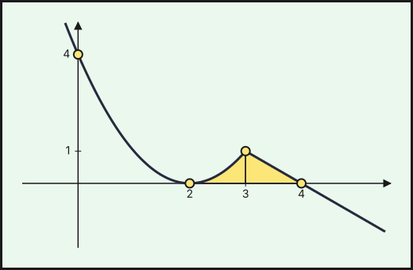{fig-alt="Gráfica de f: parábola (x−2)² hasta x=3 y recta −x+4 desde x=3, continua en (3,1) pero con pico; recinto sombreado entre x=2 y x=4" width="75%" fig-align="center"}

**c) Área entre $x=2$ y $x=4$.**
1. En $[2,4]$, $f\ge0$, así que el área es la integral. Se parte en $x=3$.
2. Barrow en cada trozo:
$$A=\int_2^3(x-2)^2dx+\int_3^4(-x+4)\,dx=\left[\frac{(x-2)^3}{3}\right]_2^3+\left[-\frac{x^2}{2}+4x\right]_3^4=\frac{1}{3}+\frac{1}{2}=\frac{5}{6}.$$

**$A=\dfrac{5}{6}\ \text{u}^2$**
::::
:::::

## 2022

### Ordinaria 2022

::::: {.ebau-ej #ebau-2022-ord-4}
**Ejercicio 4** · Ordinaria 2022 · Bloque B · *(2,5 puntos)* · [Examen](../../../assets/pau-ccss/2022-ord/examen.pdf){target="_blank"}

a) Se considera la función $f(x)=\begin{cases}6x-3&x\le1\\ax^{2}+bx+2&x>1\end{cases}$ con $a$ y $b$ números reales. Determine los valores de $a$ y $b$ para que $f$ sea continua y derivable en todo su dominio. *(1,25 puntos)*

b) Calcule el área del recinto acotado, limitado por el eje $OX$ y la gráfica de la función $g(x)=-2x^{2}+8x-6$. *(1,25 puntos)*

*Relacionado también con:* [Derivadas](06-derivadas.qmd), [Integrales](08-integrales.qmd).

:::: {.callout-note collapse="true" appearance="simple"}
## Ayuda 1 · Recordatorio

**Continuidad.**

$f$ es continua en $a$ si $\lim_{x\to a^-}f(x)=\lim_{x\to a^+}f(x)=f(a)$. Las funciones elementales son continuas en su dominio; en una función a trozos solo hay que vigilar los puntos de cambio.

**Derivabilidad.**

$f$ derivable en $a$ si es continua en $a$ y las derivadas laterales coinciden: $f'(a^-)=f'(a^+)$. Derivable implica continua, pero no al revés.

**Hallar parámetros de una función.**

Cada dato del enunciado da una ecuación: pasa por $(a,b)\Rightarrow f(a)=b$; extremo en $x=a\Rightarrow f'(a)=0$; pendiente $m$ en $x=a\Rightarrow f'(a)=m$; inflexión en $x=a\Rightarrow f''(a)=0$; área o integral dada $\Rightarrow$ igualar la integral.

**Área de un recinto.**

Área entre $y=f(x)$ y el eje $X$: $\int_a^b|f(x)|\,dx$, partiendo en los puntos donde $f$ cambia de signo. Área entre dos curvas: $\int_a^b\left(f(x)-g(x)\right)dx$ con $f\ge g$. Los límites de integración son las abscisas de corte.

**Representar una función.**

Una gráfica se construye con: dominio, cortes con los ejes, asíntotas, monotonía y extremos (con $f'$), curvatura y puntos de inflexión (con $f''$), y una tabla de valores. Convexa si $f''>0$ y cóncava si $f''<0$.
::::

:::: {.callout-note collapse="true" appearance="simple"}
## Ayuda 2 · Método

**Continuidad.**

1. Localiza los puntos problemáticos (cambios de trozo, ceros de denominadores).
2. Calcula los dos límites laterales y $f(a)$.
3. Iguálalos: si hay parámetros, obtienes una ecuación para cada punto.
4. Concluye indicando el tipo de discontinuidad si no es continua (evitable o de salto).

**Derivabilidad.**

1. Impón primero la continuidad en el punto de cambio.
2. Deriva cada trozo y evalúa en el punto, por la izquierda y por la derecha.
3. Iguala las derivadas: segunda ecuación para los parámetros.
4. Resuelve el sistema y comprueba.

**Hallar parámetros de una función.**

1. Lista los datos y escribe una ecuación por cada uno.
2. Resuelve el sistema (suele ser lineal en los parámetros).
3. Comprueba que la función resultante cumple todo, y que el extremo es del tipo pedido.

**Área de un recinto.**

1. Haz un esbozo del recinto.
2. Calcula los puntos de corte (resolviendo $f=g$ o $f=0$): son los límites.
3. Decide qué función va por encima en cada tramo; si se cruzan, parte la integral.
4. Aplica Barrow y da el área en $\text{u}^2$, siempre positiva.

**Representar una función.**

1. Dominio y cortes.
2. Asíntotas verticales, horizontales y oblicuas con límites.
3. Signo de $f'$: intervalos de crecimiento y extremos.
4. Signo de $f''$ si hace falta, y unos cuantos puntos.
5. Dibuja y comprueba que la gráfica respeta todos los datos anteriores.
::::

:::: {.callout-tip collapse="true" appearance="simple"}
## Solución

**a) Parámetros.**
1. Continuidad en $x=1$: los dos trozos deben coincidir. Por la izquierda, $6\cdot1-3=3$; por la derecha, $a+b+2$. Así $a+b+2=3\Rightarrow a+b=1$.
2. Derivabilidad: $f'(x)=6$ si $x<1$ y $f'(x)=2ax+b$ si $x>1$. Deben coincidir en $x=1$: $2a+b=6$.
3. Se resta la primera ecuación de la segunda: $a=5$ y, entonces, $b=-4$.

**$a=5$ y $b=-4$.**

**b) Área.**
1. Se factoriza: $g(x)=-2(x-1)(x-3)$ corta al eje $OX$ en $x=1$ y $x=3$.
2. Es una parábola abierta hacia abajo, luego $g\ge0$ entre las raíces.
3. Barrow:
$$A=\int_1^3\left(-2x^2+8x-6\right)dx=\left[-\frac{2x^3}{3}+4x^2-6x\right]_1^3=0-\left(-\frac{8}{3}\right)=\frac{8}{3}.$$

**$A=\dfrac{8}{3}\ \text{u}^2$**
::::
:::::

### Ordinaria · Reserva 2022

::::: {.ebau-ej #ebau-2022-ord-res-3}
**Ejercicio 3** · Ordinaria · Reserva 2022 · Bloque B · *(2,5 puntos)* · [Examen](../../../assets/pau-ccss/2022-ord-res/examen.pdf){target="_blank"}

Se considera la función
$$f(x)=\begin{cases}4x^{2}+16x+17&x<-1\\\dfrac{1}{3}(10-5x)&-1\le x\le2\\\dfrac{3}{2}&x>2\end{cases}$$

a) Estudie la continuidad y derivabilidad de $f$. *(1,25 puntos)*

b) Represente gráficamente la función $f$. *(0,5 puntos)*

c) Calcule el área de la región limitada por la gráfica de $f$ y el eje de abscisas entre $x=-2$ y $x=2$. *(0,75 puntos)*

*Relacionado también con:* [Integrales](08-integrales.qmd).

:::: {.callout-note collapse="true" appearance="simple"}
## Ayuda 1 · Recordatorio

**Continuidad.**

$f$ es continua en $a$ si $\lim_{x\to a^-}f(x)=\lim_{x\to a^+}f(x)=f(a)$. Las funciones elementales son continuas en su dominio; en una función a trozos solo hay que vigilar los puntos de cambio.

**Área de un recinto.**

Área entre $y=f(x)$ y el eje $X$: $\int_a^b|f(x)|\,dx$, partiendo en los puntos donde $f$ cambia de signo. Área entre dos curvas: $\int_a^b\left(f(x)-g(x)\right)dx$ con $f\ge g$. Los límites de integración son las abscisas de corte.

**Representar una función.**

Una gráfica se construye con: dominio, cortes con los ejes, asíntotas, monotonía y extremos (con $f'$), curvatura y puntos de inflexión (con $f''$), y una tabla de valores. Convexa si $f''>0$ y cóncava si $f''<0$.
::::

:::: {.callout-note collapse="true" appearance="simple"}
## Ayuda 2 · Método

**Continuidad.**

1. Localiza los puntos problemáticos (cambios de trozo, ceros de denominadores).
2. Calcula los dos límites laterales y $f(a)$.
3. Iguálalos: si hay parámetros, obtienes una ecuación para cada punto.
4. Concluye indicando el tipo de discontinuidad si no es continua (evitable o de salto).

**Área de un recinto.**

1. Haz un esbozo del recinto.
2. Calcula los puntos de corte (resolviendo $f=g$ o $f=0$): son los límites.
3. Decide qué función va por encima en cada tramo; si se cruzan, parte la integral.
4. Aplica Barrow y da el área en $\text{u}^2$, siempre positiva.

**Representar una función.**

1. Dominio y cortes.
2. Asíntotas verticales, horizontales y oblicuas con límites.
3. Signo de $f'$: intervalos de crecimiento y extremos.
4. Signo de $f''$ si hace falta, y unos cuantos puntos.
5. Dibuja y comprueba que la gráfica respeta todos los datos anteriores.
::::

:::: {.callout-tip collapse="true" appearance="simple"}
## Solución

**a) Continuidad y derivabilidad.** Cada trozo es continuo y derivable en su intervalo abierto; solo hay que estudiar $x=-1$ y $x=2$.
1. En $x=-1$: $\displaystyle\lim_{x\to-1^-}f=4-16+17=5$ y $f(-1)=\dfrac{1}{3}(10+5)=5$: **continua.**
2. Derivadas laterales en $x=-1$: $f'(-1^-)=8x+16=8$ y $f'(-1^+)=-\dfrac{5}{3}$. No coinciden: **no derivable en $x=-1$** (punto anguloso).
3. En $x=2$: $f(2)=\dfrac{1}{3}(10-10)=0$ y $\displaystyle\lim_{x\to2^+}f=\dfrac{3}{2}$: **discontinuidad de salto finito**, luego tampoco es derivable.

**$f$ es continua en $\mathbb R\setminus\{2\}$ y derivable en $\mathbb R\setminus\{-1,2\}$.**

**b) Gráfica.**
1. Para $x<-1$: parábola $y=4x^2+16x+17$ (vértice $(-2,1)$, pasa por $(-1,5)$).
2. Para $-1\le x\le2$: segmento de recta de $(-1,5)$ a $(2,0)$.
3. Para $x>2$: recta horizontal $y=\dfrac{3}{2}$, con el punto «abierto» en $\left(2,\dfrac{3}{2}\right)$.

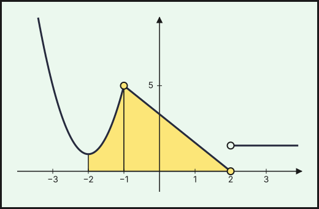{fig-alt="Gráfica de f: parábola 4x²+16x+17 hasta x=−1, segmento de (−1,5) a (2,0) y recta horizontal y=3/2 desde x=2 (salto en x=2); recinto sombreado entre x=−2 y x=2" width="75%" fig-align="center"}

**c) Área entre $x=-2$ y $x=2$.**
1. En $[-2,2]$, $f\ge0$: la parábola no corta al eje ($4x^2+16x+17$ no se anula, $\Delta<0$) y el segmento llega a $0$ en $x=2$.
2. Se parte la integral en los dos trozos de ese intervalo:
$$A=\int_{-2}^{-1}\left(4x^2+16x+17\right)dx+\int_{-1}^{2}\frac{10-5x}{3}\,dx=\frac{7}{3}+\frac{15}{2}=\frac{59}{6}.$$

**$A=\dfrac{59}{6}\ \text{u}^2$**
::::
:::::

### Ordinaria · Suplente 2022

::::: {.ebau-ej #ebau-2022-ord-sup-4}
**Ejercicio 4** · Ordinaria · Suplente 2022 · Bloque B · *(2,5 puntos)* · [Examen](../../../assets/pau-ccss/2022-ord-sup/examen.pdf){target="_blank"}

Se considera la función $f(x)=\begin{cases}ax^{2}+bx+1&\text{si }x\le1\\\dfrac2x&\text{si }x>1\end{cases}$, con $a$ y $b$ números reales.

a) ¿Para qué valores de $a$ y $b$ la función es continua y derivable en $x=1$? *(1 punto)*

b) Para $a=-3$ y $b=4$, calcule los extremos relativos de $f$. *(0,75 puntos)*

c) Para $a=-2$ y $b=3$, calcule el valor de la integral $\displaystyle\int_{-1}^{3}f(x)\,dx$. *(0,75 puntos)*

*Relacionado también con:* [Derivadas](06-derivadas.qmd), [Aplicaciones de la derivada](07-aplicaciones-derivada.qmd), [Integrales](08-integrales.qmd).

:::: {.callout-note collapse="true" appearance="simple"}
## Ayuda 1 · Recordatorio

**Continuidad.**

$f$ es continua en $a$ si $\lim_{x\to a^-}f(x)=\lim_{x\to a^+}f(x)=f(a)$. Las funciones elementales son continuas en su dominio; en una función a trozos solo hay que vigilar los puntos de cambio.

**Derivabilidad.**

$f$ derivable en $a$ si es continua en $a$ y las derivadas laterales coinciden: $f'(a^-)=f'(a^+)$. Derivable implica continua, pero no al revés.

**Monotonía y extremos relativos.**

$f'>0$ en un intervalo: creciente; $f'<0$: decreciente. Un extremo relativo en $x=a$ exige $f'(a)=0$; es mínimo si $f'$ pasa de $-$ a $+$ (o $f''(a)>0$) y máximo si pasa de $+$ a $-$ (o $f''(a)<0$).

**Hallar parámetros de una función.**

Cada dato del enunciado da una ecuación: pasa por $(a,b)\Rightarrow f(a)=b$; extremo en $x=a\Rightarrow f'(a)=0$; pendiente $m$ en $x=a\Rightarrow f'(a)=m$; inflexión en $x=a\Rightarrow f''(a)=0$; área o integral dada $\Rightarrow$ igualar la integral.

**Integral definida (regla de Barrow).**

Regla de Barrow: $\int_a^b f(x)\,dx=F(b)-F(a)$, con $F$ una primitiva de $f$. Si $f\ge0$ en $[a,b]$, la integral es el área bajo la curva; si $f\le0$, es el área cambiada de signo.
::::

:::: {.callout-note collapse="true" appearance="simple"}
## Ayuda 2 · Método

**Continuidad.**

1. Localiza los puntos problemáticos (cambios de trozo, ceros de denominadores).
2. Calcula los dos límites laterales y $f(a)$.
3. Iguálalos: si hay parámetros, obtienes una ecuación para cada punto.
4. Concluye indicando el tipo de discontinuidad si no es continua (evitable o de salto).

**Derivabilidad.**

1. Impón primero la continuidad en el punto de cambio.
2. Deriva cada trozo y evalúa en el punto, por la izquierda y por la derecha.
3. Iguala las derivadas: segunda ecuación para los parámetros.
4. Resuelve el sistema y comprueba.

**Monotonía y extremos relativos.**

1. Halla el dominio y calcula $f'(x)$.
2. Resuelve $f'(x)=0$ y localiza también los puntos donde $f'$ no existe.
3. Con esos puntos divide el dominio y estudia el signo de $f'$ en cada intervalo.
4. Escribe intervalos de crecimiento y decrecimiento, y los extremos con sus coordenadas $(a,f(a))$.

**Hallar parámetros de una función.**

1. Lista los datos y escribe una ecuación por cada uno.
2. Resuelve el sistema (suele ser lineal en los parámetros).
3. Comprueba que la función resultante cumple todo, y que el extremo es del tipo pedido.

**Integral definida (regla de Barrow).**

1. Halla una primitiva $F$.
2. Evalúa $F(b)-F(a)$ cuidando los signos y las fracciones.
3. Interpreta el signo del resultado.
::::

:::: {.callout-tip collapse="true" appearance="simple"}
## Solución

**a) Continuidad y derivabilidad en $x=1$.**
1. Continuidad: $f(1)=a+b+1$ debe coincidir con el límite por la derecha, $\dfrac{2}{1}=2$. Así $a+b=1$.
2. Derivabilidad: $f'(x)=2ax+b$ si $x<1$ y $f'(x)=-\dfrac{2}{x^2}$ si $x>1$. En $x=1$ deben coincidir: $2a+b=-2$.
3. Se restan las dos ecuaciones: $a=-3$ y, entonces, $b=4$.

**$a=-3$ y $b=4$.**

**b) Extremos relativos** (con $a=-3$, $b=4$).
1. Si $x\le1$: $f(x)=-3x^2+4x+1$ y $f'(x)=-6x+4=0\Rightarrow x=\dfrac{2}{3}$.
2. $f''=-6<0$: es un máximo, con $f\left(\dfrac{2}{3}\right)=\dfrac{7}{3}$.
3. Si $x>1$: $f'(x)=-\dfrac{2}{x^2}<0$, siempre decreciente, sin extremos.
4. En $x=1$ la función es derivable con $f'(1)=-2<0$, así que tampoco hay extremo allí.

**Máximo relativo en $\left(\dfrac{2}{3},\dfrac{7}{3}\right)$; no hay mínimos relativos.**

**c) Integral** (con $a=-2$, $b=3$).
1. Se parte en el punto donde cambia la expresión, $x=1$.
2. Se integra cada trozo con Barrow:
$$\int_{-1}^{3}f=\int_{-1}^{1}\left(-2x^2+3x+1\right)dx+\int_1^3\frac2x\,dx=\left[-\frac{2x^3}{3}+\frac{3x^2}{2}+x\right]_{-1}^{1}+\left[2\ln x\right]_1^3=\frac{2}{3}+2\ln3.$$

**$\displaystyle\int_{-1}^{3}f(x)\,dx=\dfrac{2}{3}+2\ln3\approx2{,}864$**
::::
:::::

### Extraordinaria · Reserva 2022

::::: {.ebau-ej #ebau-2022-ext-res-3}
**Ejercicio 3** · Extraordinaria · Reserva 2022 · Bloque B · *(2,5 puntos)* · [Examen](../../../assets/pau-ccss/2022-ext-res/examen.pdf){target="_blank"}

Se considera la función
$$f(x)=\begin{cases}a(x+1)^{2}&-3\le x\le1\\\dfrac{bx^{2}}{2}+2&1<x\le2\end{cases}$$
con $a$ y $b$ números reales.

a) Determine los valores de $a$ y $b$ para que $f$ sea continua y derivable. *(1,25 puntos)*

b) Para $a=1$ y $b=2$, esboce la gráfica de la función $f$ y calcule el área del recinto limitado por la gráfica de $f$, el eje $OX$ y las rectas $x=-2$ y $x=1$. *(1,25 puntos)*

*Relacionado también con:* [Derivadas](06-derivadas.qmd), [Integrales](08-integrales.qmd).

:::: {.callout-note collapse="true" appearance="simple"}
## Ayuda 1 · Recordatorio

**Continuidad.**

$f$ es continua en $a$ si $\lim_{x\to a^-}f(x)=\lim_{x\to a^+}f(x)=f(a)$. Las funciones elementales son continuas en su dominio; en una función a trozos solo hay que vigilar los puntos de cambio.

**Derivabilidad.**

$f$ derivable en $a$ si es continua en $a$ y las derivadas laterales coinciden: $f'(a^-)=f'(a^+)$. Derivable implica continua, pero no al revés.

**Hallar parámetros de una función.**

Cada dato del enunciado da una ecuación: pasa por $(a,b)\Rightarrow f(a)=b$; extremo en $x=a\Rightarrow f'(a)=0$; pendiente $m$ en $x=a\Rightarrow f'(a)=m$; inflexión en $x=a\Rightarrow f''(a)=0$; área o integral dada $\Rightarrow$ igualar la integral.

**Área de un recinto.**

Área entre $y=f(x)$ y el eje $X$: $\int_a^b|f(x)|\,dx$, partiendo en los puntos donde $f$ cambia de signo. Área entre dos curvas: $\int_a^b\left(f(x)-g(x)\right)dx$ con $f\ge g$. Los límites de integración son las abscisas de corte.

**Representar una función.**

Una gráfica se construye con: dominio, cortes con los ejes, asíntotas, monotonía y extremos (con $f'$), curvatura y puntos de inflexión (con $f''$), y una tabla de valores. Convexa si $f''>0$ y cóncava si $f''<0$.
::::

:::: {.callout-note collapse="true" appearance="simple"}
## Ayuda 2 · Método

**Continuidad.**

1. Localiza los puntos problemáticos (cambios de trozo, ceros de denominadores).
2. Calcula los dos límites laterales y $f(a)$.
3. Iguálalos: si hay parámetros, obtienes una ecuación para cada punto.
4. Concluye indicando el tipo de discontinuidad si no es continua (evitable o de salto).

**Derivabilidad.**

1. Impón primero la continuidad en el punto de cambio.
2. Deriva cada trozo y evalúa en el punto, por la izquierda y por la derecha.
3. Iguala las derivadas: segunda ecuación para los parámetros.
4. Resuelve el sistema y comprueba.

**Hallar parámetros de una función.**

1. Lista los datos y escribe una ecuación por cada uno.
2. Resuelve el sistema (suele ser lineal en los parámetros).
3. Comprueba que la función resultante cumple todo, y que el extremo es del tipo pedido.

**Área de un recinto.**

1. Haz un esbozo del recinto.
2. Calcula los puntos de corte (resolviendo $f=g$ o $f=0$): son los límites.
3. Decide qué función va por encima en cada tramo; si se cruzan, parte la integral.
4. Aplica Barrow y da el área en $\text{u}^2$, siempre positiva.

**Representar una función.**

1. Dominio y cortes.
2. Asíntotas verticales, horizontales y oblicuas con límites.
3. Signo de $f'$: intervalos de crecimiento y extremos.
4. Signo de $f''$ si hace falta, y unos cuantos puntos.
5. Dibuja y comprueba que la gráfica respeta todos los datos anteriores.
::::

:::: {.callout-tip collapse="true" appearance="simple"}
## Solución

**a) Parámetros $a$ y $b$.**
1. Continuidad en $x=1$: por la izquierda, $a(1+1)^2=4a$; por la derecha, $\dfrac b2+2$. Así $4a=\dfrac b2+2$.
2. Derivabilidad: $f'(x)=2a(x+1)$ si $x<1$ y $f'(x)=bx$ si $x>1$. En $x=1$ deben coincidir: $4a=b$.
3. Se sustituye $b=4a$ en la primera: $4a=2a+2\Rightarrow a=1$ y $b=4$.

**$a=1$ y $b=4$.**

**b) Gráfica y área** (con $a=1$ y $b=2$).
1. En $[-3,1]$: $f(x)=(x+1)^2$, arco de parábola de vértice $(-1,0)$ que pasa por $(-3,4)$, $(0,1)$ y $(1,4)$.
2. En $(1,2]$: $f(x)=x^2+2$, arco de parábola que empieza, «abierto», en $(1,3)$ y llega a $(2,6)$.
3. Hay un salto en $x=1$ (de $4$ a $3$), porque con estos valores $f$ no es continua.

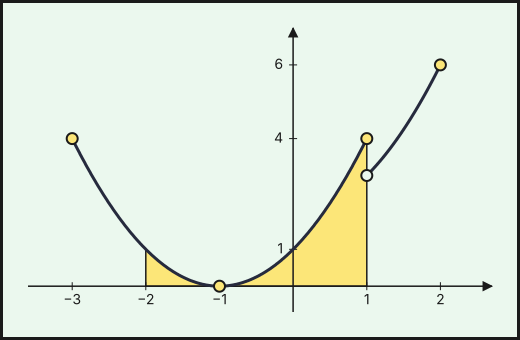{fig-alt="Gráfica de f con (a, b) = (1, 2): parábola (x+1)² hasta x=1 y x²+2 desde x=1, con salto de 4 a 3; recinto sombreado entre x=−2 y x=1" width="75%" fig-align="center"}

4. Entre $x=-2$ y $x=1$ solo interviene el primer trozo y $f\ge0$ (es un cuadrado). Barrow:
$$A=\int_{-2}^{1}(x+1)^2dx=\left[\frac{(x+1)^3}{3}\right]_{-2}^{1}=\frac{8}{3}-\left(-\frac{1}{3}\right)=3.$$

**$A=3\ \text{u}^2$**
::::
:::::

### Extraordinaria · Suplente 2022

::::: {.ebau-ej #ebau-2022-ext-sup-4}
**Ejercicio 4** · Extraordinaria · Suplente 2022 · Bloque B · *(2,5 puntos)* · [Examen](../../../assets/pau-ccss/2022-ext-sup/examen.pdf){target="_blank"}

Se considera la función $f(x)=\begin{cases}ax^{2}+bx+2&\text{si }x\le1\\\dfrac{4}{x+1}&\text{si }x>1\end{cases}$ con $a$ y $b$ números reales.

a) Calcule $a$ y $b$ para que la función $f$ sea continua y derivable. *(1 punto)*

b) Para $a=-1$ y $b=1$, realice un esbozo de la gráfica de la función $f$. *(0,75 puntos)*

c) Para $a=-1$ y $b=1$, halle el área del recinto acotado, limitado por la gráfica de $f$, la recta $x=1$ y el eje $OX$. *(0,75 puntos)*

*Relacionado también con:* [Derivadas](06-derivadas.qmd), [Integrales](08-integrales.qmd).

:::: {.callout-note collapse="true" appearance="simple"}
## Ayuda 1 · Recordatorio

**Continuidad.**

$f$ es continua en $a$ si $\lim_{x\to a^-}f(x)=\lim_{x\to a^+}f(x)=f(a)$. Las funciones elementales son continuas en su dominio; en una función a trozos solo hay que vigilar los puntos de cambio.

**Derivabilidad.**

$f$ derivable en $a$ si es continua en $a$ y las derivadas laterales coinciden: $f'(a^-)=f'(a^+)$. Derivable implica continua, pero no al revés.

**Hallar parámetros de una función.**

Cada dato del enunciado da una ecuación: pasa por $(a,b)\Rightarrow f(a)=b$; extremo en $x=a\Rightarrow f'(a)=0$; pendiente $m$ en $x=a\Rightarrow f'(a)=m$; inflexión en $x=a\Rightarrow f''(a)=0$; área o integral dada $\Rightarrow$ igualar la integral.

**Área de un recinto.**

Área entre $y=f(x)$ y el eje $X$: $\int_a^b|f(x)|\,dx$, partiendo en los puntos donde $f$ cambia de signo. Área entre dos curvas: $\int_a^b\left(f(x)-g(x)\right)dx$ con $f\ge g$. Los límites de integración son las abscisas de corte.

**Representar una función.**

Una gráfica se construye con: dominio, cortes con los ejes, asíntotas, monotonía y extremos (con $f'$), curvatura y puntos de inflexión (con $f''$), y una tabla de valores. Convexa si $f''>0$ y cóncava si $f''<0$.
::::

:::: {.callout-note collapse="true" appearance="simple"}
## Ayuda 2 · Método

**Continuidad.**

1. Localiza los puntos problemáticos (cambios de trozo, ceros de denominadores).
2. Calcula los dos límites laterales y $f(a)$.
3. Iguálalos: si hay parámetros, obtienes una ecuación para cada punto.
4. Concluye indicando el tipo de discontinuidad si no es continua (evitable o de salto).

**Derivabilidad.**

1. Impón primero la continuidad en el punto de cambio.
2. Deriva cada trozo y evalúa en el punto, por la izquierda y por la derecha.
3. Iguala las derivadas: segunda ecuación para los parámetros.
4. Resuelve el sistema y comprueba.

**Hallar parámetros de una función.**

1. Lista los datos y escribe una ecuación por cada uno.
2. Resuelve el sistema (suele ser lineal en los parámetros).
3. Comprueba que la función resultante cumple todo, y que el extremo es del tipo pedido.

**Área de un recinto.**

1. Haz un esbozo del recinto.
2. Calcula los puntos de corte (resolviendo $f=g$ o $f=0$): son los límites.
3. Decide qué función va por encima en cada tramo; si se cruzan, parte la integral.
4. Aplica Barrow y da el área en $\text{u}^2$, siempre positiva.

**Representar una función.**

1. Dominio y cortes.
2. Asíntotas verticales, horizontales y oblicuas con límites.
3. Signo de $f'$: intervalos de crecimiento y extremos.
4. Signo de $f''$ si hace falta, y unos cuantos puntos.
5. Dibuja y comprueba que la gráfica respeta todos los datos anteriores.
::::

:::: {.callout-tip collapse="true" appearance="simple"}
## Solución

**a) Parámetros $a$ y $b$.**
1. Continuidad en $x=1$: $a+b+2=\dfrac{4}{2}=2\Rightarrow a+b=0$.
2. Derivabilidad: $f'(x)=2ax+b$ si $x<1$ y $f'(x)=-\dfrac{4}{(x+1)^2}$ si $x>1$. En $x=1$: $2a+b=-1$.
3. Se restan las dos ecuaciones: $a=-1$ y, entonces, $b=1$.

**$a=-1$ y $b=1$.**

**b) Esbozo** (con $a=-1$ y $b=1$).
1. Para $x\le1$: $f(x)=-x^2+x+2=-(x-2)(x+1)$, parábola abierta hacia abajo con vértice $\left(\dfrac{1}{2},\dfrac{9}{4}\right)$. Corta al eje $OX$ en $x=-1$ y $x=2$ (aunque solo hasta $x=1$), al eje $OY$ en $(0,2)$ y llega a $(1,2)$.
2. Para $x>1$: $f(x)=\dfrac{4}{x+1}$, hipérbola decreciente desde $(1,2)$, con asíntota horizontal $y=0$.
3. La función es continua y suave en $x=1$.

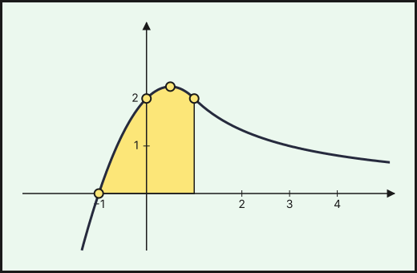{fig-alt="Gráfica de f con (a, b) = (−1, 1): parábola −x²+x+2 hasta x=1 e hipérbola 4/(x+1) desde x=1; recinto sombreado entre x=−1 y x=1" width="75%" fig-align="center"}

**c) Área.**
1. El recinto acotado va de $x=-1$ (donde $f$ corta al eje $OX$) a $x=1$ (la recta dada), con $f\ge0$.
2. Barrow:
$$A=\int_{-1}^{1}\left(-x^2+x+2\right)dx=\left[-\frac{x^3}{3}+\frac{x^2}{2}+2x\right]_{-1}^{1}=\frac{13}{6}-\left(-\frac{7}{6}\right)=\frac{10}{3}.$$

**$A=\dfrac{10}{3}\ \text{u}^2$**
::::
:::::

## 2021

### Ordinaria · Reserva 2021

::::: {.ebau-ej #ebau-2021-ord-res-3}
**Ejercicio 3** · Ordinaria · Reserva 2021 · Bloque B · *(2,5 puntos)* · [Examen](../../../assets/pau-ccss/2021-ord-res/examen.pdf){target="_blank"}

Se considera la función
$$f(x)=\begin{cases}-2x+2a&\text{si }-4\le x\le-2\\-2x^{2}-4a&\text{si }-2<x\le2\\-8x+b&\text{si }2<x\le3\end{cases}$$

a) Calcule los valores $a$ y $b$ para que la función sea continua en su dominio. Para esos valores, ¿es $f$ derivable? *(1 punto)*

b) Para $a=-2$ y $b=16$, estudie la monotonía de la función $f$ y calcule sus extremos relativos y absolutos. *(0,8 puntos)*

c) Para $a=-2$ y $b=16$, calcule el área del recinto limitado por la gráfica de $f$, el eje $OX$ y las rectas $x=-2$ y $x=2$. *(0,7 puntos)*

*Relacionado también con:* [Derivadas](06-derivadas.qmd), [Aplicaciones de la derivada](07-aplicaciones-derivada.qmd), [Integrales](08-integrales.qmd).

:::: {.callout-note collapse="true" appearance="simple"}
## Ayuda 1 · Recordatorio

**Continuidad.**

$f$ es continua en $a$ si $\lim_{x\to a^-}f(x)=\lim_{x\to a^+}f(x)=f(a)$. Las funciones elementales son continuas en su dominio; en una función a trozos solo hay que vigilar los puntos de cambio.

**Derivabilidad.**

$f$ derivable en $a$ si es continua en $a$ y las derivadas laterales coinciden: $f'(a^-)=f'(a^+)$. Derivable implica continua, pero no al revés.

**Monotonía y extremos relativos.**

$f'>0$ en un intervalo: creciente; $f'<0$: decreciente. Un extremo relativo en $x=a$ exige $f'(a)=0$; es mínimo si $f'$ pasa de $-$ a $+$ (o $f''(a)>0$) y máximo si pasa de $+$ a $-$ (o $f''(a)<0$).

**Hallar parámetros de una función.**

Cada dato del enunciado da una ecuación: pasa por $(a,b)\Rightarrow f(a)=b$; extremo en $x=a\Rightarrow f'(a)=0$; pendiente $m$ en $x=a\Rightarrow f'(a)=m$; inflexión en $x=a\Rightarrow f''(a)=0$; área o integral dada $\Rightarrow$ igualar la integral.

**Área de un recinto.**

Área entre $y=f(x)$ y el eje $X$: $\int_a^b|f(x)|\,dx$, partiendo en los puntos donde $f$ cambia de signo. Área entre dos curvas: $\int_a^b\left(f(x)-g(x)\right)dx$ con $f\ge g$. Los límites de integración son las abscisas de corte.

**Representar una función.**

Una gráfica se construye con: dominio, cortes con los ejes, asíntotas, monotonía y extremos (con $f'$), curvatura y puntos de inflexión (con $f''$), y una tabla de valores. Convexa si $f''>0$ y cóncava si $f''<0$.
::::

:::: {.callout-note collapse="true" appearance="simple"}
## Ayuda 2 · Método

**Continuidad.**

1. Localiza los puntos problemáticos (cambios de trozo, ceros de denominadores).
2. Calcula los dos límites laterales y $f(a)$.
3. Iguálalos: si hay parámetros, obtienes una ecuación para cada punto.
4. Concluye indicando el tipo de discontinuidad si no es continua (evitable o de salto).

**Derivabilidad.**

1. Impón primero la continuidad en el punto de cambio.
2. Deriva cada trozo y evalúa en el punto, por la izquierda y por la derecha.
3. Iguala las derivadas: segunda ecuación para los parámetros.
4. Resuelve el sistema y comprueba.

**Monotonía y extremos relativos.**

1. Halla el dominio y calcula $f'(x)$.
2. Resuelve $f'(x)=0$ y localiza también los puntos donde $f'$ no existe.
3. Con esos puntos divide el dominio y estudia el signo de $f'$ en cada intervalo.
4. Escribe intervalos de crecimiento y decrecimiento, y los extremos con sus coordenadas $(a,f(a))$.

**Hallar parámetros de una función.**

1. Lista los datos y escribe una ecuación por cada uno.
2. Resuelve el sistema (suele ser lineal en los parámetros).
3. Comprueba que la función resultante cumple todo, y que el extremo es del tipo pedido.

**Área de un recinto.**

1. Haz un esbozo del recinto.
2. Calcula los puntos de corte (resolviendo $f=g$ o $f=0$): son los límites.
3. Decide qué función va por encima en cada tramo; si se cruzan, parte la integral.
4. Aplica Barrow y da el área en $\text{u}^2$, siempre positiva.

**Representar una función.**

1. Dominio y cortes.
2. Asíntotas verticales, horizontales y oblicuas con límites.
3. Signo de $f'$: intervalos de crecimiento y extremos.
4. Signo de $f''$ si hace falta, y unos cuantos puntos.
5. Dibuja y comprueba que la gráfica respeta todos los datos anteriores.
::::

:::: {.callout-tip collapse="true" appearance="simple"}
## Solución

**a) Continuidad y derivabilidad.**
1. Cada rama es un polinomio. Hay que igualar los valores de las dos ramas en los puntos de cambio, $x=-2$ y $x=2$.
2. En $x=-2$: $-2(-2)+2a=4+2a$ y $-2(-2)^2-4a=-8-4a$; igualando, $6a=-12$, **$a=-2$**.
3. En $x=2$: $-2\cdot2^2-4a=-8-4a$ y $-8\cdot2+b=-16+b$; con $a=-2$ queda $0=-16+b$, **$b=16$**.
4. **Derivabilidad.** $f'(x)=-2$ si $-4<x<-2$, $f'(x)=-4x$ si $-2<x<2$, $f'(x)=-8$ si $2<x<3$. En $x=-2$: $f'(-2^-)=-2\neq f'(-2^+)=8$. En $x=2$: $f'(2^-)=-8=f'(2^+)$.

**$f$ no es derivable en $x=-2$ y sí lo es en $x=2$** (y en el resto de su dominio).

**b) Monotonía y extremos** (con $a=-2$, $b=16$).
1. La función queda $f(x)=-2x-4$ en $[-4,-2]$, $f(x)=-2x^2+8$ en $(-2,2]$ y $f(x)=-8x+16$ en $(2,3]$.
2. Signo de $f'$ en cada tramo:
   - $[-4,-2]$: $f'=-2<0$, **decrece**.
   - $(-2,0)$: $f'=-4x>0$, **crece**; $(0,2)$: $f'<0$, **decrece**.
   - $(2,3]$: $f'=-8<0$, **decrece**.
3. **Extremos relativos:** mínimo relativo en $(-2,0)$ (pasa de decrecer a crecer) y máximo relativo en $(0,8)$.
4. **Extremos absolutos:** se comparan con los valores en los extremos del intervalo, $f(-4)=4$ y $f(3)=-8$.

**Máximo absoluto $8$ en $x=0$ y mínimo absoluto $-8$ en $x=3$.**

**c) Área.**
1. En $[-2,2]$, $f(x)=-2x^2+8\ge0$ (es una parábola que corta al eje en $\pm2$), luego el área es la integral.
2. Barrow:
$$A=\int_{-2}^{2}\left(-2x^2+8\right)dx=\left[-\frac{2x^3}{3}+8x\right]_{-2}^{2}=\frac{32}{3}+\frac{32}{3}=\frac{64}{3}.$$

**$A=\dfrac{64}{3}\ \text{u}^2$**
::::
:::::

### Ordinaria · Suplente 2021

::::: {.ebau-ej #ebau-2021-ord-sup-3}
**Ejercicio 3** · Ordinaria · Suplente 2021 · Bloque B · *(2,5 puntos)* · [Examen](../../../assets/pau-ccss/2021-ord-sup/examen.pdf){target="_blank"}

Se considera la función
$$f(x)=\begin{cases}\dfrac1x&\text{si }x\le-1\\-3x^{2}+4&\text{si }-1<x<1\\2x-1&\text{si }x\ge1\end{cases}$$

a) Estudie la continuidad y derivabilidad de la función $f$ en todo su dominio. *(1 punto)*

b) Represente gráficamente la función $f$. *(0,8 puntos)*

c) Calcule el área de la región limitada por la gráfica de la función $f$, el eje de abscisas y las rectas $x=0$ y $x=3$. *(0,7 puntos)*

*Relacionado también con:* [Derivadas](06-derivadas.qmd), [Integrales](08-integrales.qmd).

:::: {.callout-note collapse="true" appearance="simple"}
## Ayuda 1 · Recordatorio

**Continuidad.**

$f$ es continua en $a$ si $\lim_{x\to a^-}f(x)=\lim_{x\to a^+}f(x)=f(a)$. Las funciones elementales son continuas en su dominio; en una función a trozos solo hay que vigilar los puntos de cambio.

**Área de un recinto.**

Área entre $y=f(x)$ y el eje $X$: $\int_a^b|f(x)|\,dx$, partiendo en los puntos donde $f$ cambia de signo. Área entre dos curvas: $\int_a^b\left(f(x)-g(x)\right)dx$ con $f\ge g$. Los límites de integración son las abscisas de corte.

**Representar una función.**

Una gráfica se construye con: dominio, cortes con los ejes, asíntotas, monotonía y extremos (con $f'$), curvatura y puntos de inflexión (con $f''$), y una tabla de valores. Convexa si $f''>0$ y cóncava si $f''<0$.
::::

:::: {.callout-note collapse="true" appearance="simple"}
## Ayuda 2 · Método

**Continuidad.**

1. Localiza los puntos problemáticos (cambios de trozo, ceros de denominadores).
2. Calcula los dos límites laterales y $f(a)$.
3. Iguálalos: si hay parámetros, obtienes una ecuación para cada punto.
4. Concluye indicando el tipo de discontinuidad si no es continua (evitable o de salto).

**Área de un recinto.**

1. Haz un esbozo del recinto.
2. Calcula los puntos de corte (resolviendo $f=g$ o $f=0$): son los límites.
3. Decide qué función va por encima en cada tramo; si se cruzan, parte la integral.
4. Aplica Barrow y da el área en $\text{u}^2$, siempre positiva.

**Representar una función.**

1. Dominio y cortes.
2. Asíntotas verticales, horizontales y oblicuas con límites.
3. Signo de $f'$: intervalos de crecimiento y extremos.
4. Signo de $f''$ si hace falta, y unos cuantos puntos.
5. Dibuja y comprueba que la gráfica respeta todos los datos anteriores.
::::

:::: {.callout-tip collapse="true" appearance="simple"}
## Solución

**a) Continuidad y derivabilidad.** Cada tramo es continuo en su intervalo; se estudian los puntos de cambio, $x=-1$ y $x=1$.
- En $x=-1$: $\displaystyle\lim_{x\to-1^-}\frac1x=-1$ y $\displaystyle\lim_{x\to-1^+}\left(-3x^2+4\right)=1$. Distintos: **discontinuidad de salto finito en $x=-1$.**
- En $x=1$: $\displaystyle\lim_{x\to1^-}\left(-3x^2+4\right)=1$, $\displaystyle\lim_{x\to1^+}(2x-1)=1$ y $f(1)=1$: **continua en $x=1$.**
- En el resto es continua ($\dfrac1x$ solo falla en $x=0$, que no está en su tramo).

**Derivabilidad.** $f'(x)=-\dfrac{1}{x^2}$ si $x<-1$, $f'(x)=-6x$ si $-1<x<1$, $f'(x)=2$ si $x>1$. En $x=1$: $f'(1^-)=-6\neq f'(1^+)=2$: **no derivable en $x=1$** (en $x=-1$ no puede serlo porque no es continua).

**$f$ es continua en $\mathbb R\setminus\{-1\}$ y derivable en $\mathbb R\setminus\{-1,1\}$.**

**b) Gráfica.**
1. Primer tramo: hipérbola $y=\dfrac1x$ (con $x\le-1$), que parte de $0^-$ y llega a $(-1,-1)$ (punto relleno).
2. Segundo tramo: arco de parábola $y=-3x^2+4$ en $(-1,1)$, de vértice $(0,4)$, con los extremos «abiertos» en $(-1,1)$ y $(1,1)$.
3. Tercer tramo: semirrecta $y=2x-1$ desde $(1,1)$ hacia arriba (pasa por $(2,3)$).

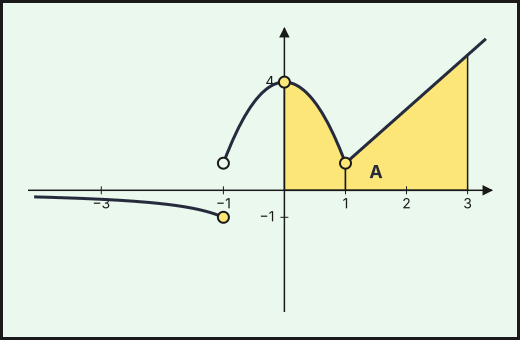{fig-alt="Gráfica de f: hipérbola 1/x para x≤−1, parábola −3x²+4 en (−1,1) y recta 2x−1 para x≥1; salto en x=−1 y recinto sombreado entre x=0 y x=3" width="75%" fig-align="center"}

**c) Área entre $x=0$ y $x=3$.**
1. En $[0,3]$ la función es positiva: $-3x^2+4\ge1$ en $[0,1]$ y $2x-1\ge1$ en $[1,3]$, así que el área es la integral.
2. Se parte en $x=1$, donde cambia la expresión:
$$A=\int_0^1\left(-3x^2+4\right)dx+\int_1^3(2x-1)\,dx=\left[-x^3+4x\right]_0^1+\left[x^2-x\right]_1^3=3+6=9.$$

**$A=9\ \text{u}^2$**
::::
:::::

### Extraordinaria 2021

::::: {.ebau-ej #ebau-2021-ext-3}
**Ejercicio 3** · Extraordinaria 2021 · Bloque B · *(2,5 puntos)* · [Examen](../../../assets/pau-ccss/2021-ext/examen.pdf){target="_blank"}

Se considera la función $f(x)=\begin{cases}2^{x+1}&\text{si }x<0\\x^{2}-2x&\text{si }x\ge0\end{cases}$

a) Estudie la continuidad y derivabilidad de la función $f$ en su dominio. *(1 punto)*

b) Estudie la monotonía de la función $f$ y calcule el mínimo. *(0,8 puntos)*

c) Calcule $\displaystyle\int_{-2}^{2}f(x)\,dx$. *(0,7 puntos)*

*Relacionado también con:* [Derivadas](06-derivadas.qmd), [Aplicaciones de la derivada](07-aplicaciones-derivada.qmd), [Integrales](08-integrales.qmd).

:::: {.callout-note collapse="true" appearance="simple"}
## Ayuda 1 · Recordatorio

**Continuidad.**

$f$ es continua en $a$ si $\lim_{x\to a^-}f(x)=\lim_{x\to a^+}f(x)=f(a)$. Las funciones elementales son continuas en su dominio; en una función a trozos solo hay que vigilar los puntos de cambio.

**Monotonía y extremos relativos.**

$f'>0$ en un intervalo: creciente; $f'<0$: decreciente. Un extremo relativo en $x=a$ exige $f'(a)=0$; es mínimo si $f'$ pasa de $-$ a $+$ (o $f''(a)>0$) y máximo si pasa de $+$ a $-$ (o $f''(a)<0$).

**Integral definida (regla de Barrow).**

Regla de Barrow: $\int_a^b f(x)\,dx=F(b)-F(a)$, con $F$ una primitiva de $f$. Si $f\ge0$ en $[a,b]$, la integral es el área bajo la curva; si $f\le0$, es el área cambiada de signo.
::::

:::: {.callout-note collapse="true" appearance="simple"}
## Ayuda 2 · Método

**Continuidad.**

1. Localiza los puntos problemáticos (cambios de trozo, ceros de denominadores).
2. Calcula los dos límites laterales y $f(a)$.
3. Iguálalos: si hay parámetros, obtienes una ecuación para cada punto.
4. Concluye indicando el tipo de discontinuidad si no es continua (evitable o de salto).

**Monotonía y extremos relativos.**

1. Halla el dominio y calcula $f'(x)$.
2. Resuelve $f'(x)=0$ y localiza también los puntos donde $f'$ no existe.
3. Con esos puntos divide el dominio y estudia el signo de $f'$ en cada intervalo.
4. Escribe intervalos de crecimiento y decrecimiento, y los extremos con sus coordenadas $(a,f(a))$.

**Integral definida (regla de Barrow).**

1. Halla una primitiva $F$.
2. Evalúa $F(b)-F(a)$ cuidando los signos y las fracciones.
3. Interpreta el signo del resultado.
::::

:::: {.callout-tip collapse="true" appearance="simple"}
## Solución

**a) Continuidad y derivabilidad.**
1. Para $x\neq0$ cada rama es continua y derivable (exponencial y polinomio): $f'(x)=2^{x+1}\ln2$ si $x<0$ y $f'(x)=2x-2$ si $x>0$.
2. En $x=0$: $\displaystyle\lim_{x\to0^-}2^{x+1}=2$ y $\displaystyle\lim_{x\to0^+}\left(x^2-2x\right)=0=f(0)$. Los límites laterales son distintos: **discontinuidad de salto finito en $x=0$**, y por tanto no es derivable en $x=0$.

**$f$ es continua y derivable en $\mathbb R\setminus\{0\}$.**

**b) Monotonía y mínimo.**
1. Si $x<0$, $f'(x)=2^{x+1}\ln2>0$: **crece en $(-\infty,0)$.**
2. Si $x>0$, $f'(x)=2(x-1)$, que se anula en $x=1$: **decrece en $(0,1)$ y crece en $(1,+\infty)$.**
3. En $x=1$ hay un mínimo relativo, $f(1)=-1$. Es el **mínimo** de la función, pues $f>0$ para $x<0$ y $f\ge-1$ para $x\ge0$: **$(1,-1)$.**

**c) Integral.**
1. La expresión cambia en $x=0$: se integra por tramos.
2. Primitiva de $2^{x+1}$: $\dfrac{2^{x+1}}{\ln2}$.
$$\int_{-2}^{2}f=\int_{-2}^{0}2^{x+1}dx+\int_0^2\left(x^2-2x\right)dx=\left[\frac{2^{x+1}}{\ln2}\right]_{-2}^{0}+\left[\frac{x^3}{3}-x^2\right]_0^2=\frac{2-\frac{1}{2}}{\ln2}+\left(\frac{8}{3}-4\right)=\frac{3}{2\ln2}-\frac{4}{3}\approx0{,}8307.$$
::::
:::::

::::: {.ebau-ej #ebau-2021-ext-4}
**Ejercicio 4** · Extraordinaria 2021 · Bloque B · *(2,5 puntos)* · [Examen](../../../assets/pau-ccss/2021-ext/examen.pdf){target="_blank"}

El número de diagnosticados de COVID-19 por PCR en Andalucía, medido en miles de personas, se aproxima por la siguiente función:

$$f(t)=\begin{cases}-t^{2}+2t-0{,}3&\text{si }0{,}2\le t\le1{,}8\\0{,}1\,t-0{,}12&\text{si }1{,}8<t\le5\\-0{,}5\,t^{2}+8{,}3\,t-28{,}62&\text{si }5<t\le10\end{cases}$$

donde $t$ es el tiempo, medido en meses, a partir del inicio de conteo en el mes de marzo de 2020.

a) Estudie la continuidad y derivabilidad de la función $f$ en su dominio. *(1,5 puntos)*

b) ¿En qué instante o instantes es máximo el número de diagnosticados? ¿Cuál es ese número? *(1 punto)*

*Relacionado también con:* [Derivadas](06-derivadas.qmd), [Aplicaciones de la derivada](07-aplicaciones-derivada.qmd).

:::: {.callout-note collapse="true" appearance="simple"}
## Ayuda 1 · Recordatorio

$f$ es continua en $a$ si $\lim_{x\to a^-}f(x)=\lim_{x\to a^+}f(x)=f(a)$. Las funciones elementales son continuas en su dominio; en una función a trozos solo hay que vigilar los puntos de cambio.
::::

:::: {.callout-note collapse="true" appearance="simple"}
## Ayuda 2 · Método

1. Localiza los puntos problemáticos (cambios de trozo, ceros de denominadores).
2. Calcula los dos límites laterales y $f(a)$.
3. Iguálalos: si hay parámetros, obtienes una ecuación para cada punto.
4. Concluye indicando el tipo de discontinuidad si no es continua (evitable o de salto).
::::

:::: {.callout-tip collapse="true" appearance="simple"}
## Solución

**a) Continuidad.** Las tres ramas son polinomios; solo hay que mirar $t=1{,}8$ y $t=5$ (se evalúan las dos ramas en cada punto).
- En $t=1{,}8$: $-1{,}8^2+2\cdot1{,}8-0{,}3=0{,}06$ y $0{,}1\cdot1{,}8-0{,}12=0{,}06$.
- En $t=5$: $0{,}1\cdot5-0{,}12=0{,}38$ y $-0{,}5\cdot25+8{,}3\cdot5-28{,}62=0{,}38$.

**Es continua en todo su dominio.**

**Derivabilidad.** Se deriva cada rama: $f'(t)=-2t+2$ en $(0{,}2;1{,}8)$, $f'(t)=0{,}1$ en $(1{,}8;5)$ y $f'(t)=-t+8{,}3$ en $(5;10)$. Se comparan las derivadas laterales:
- En $t=1{,}8$: $f'(1{,}8^-)=-1{,}6\neq f'(1{,}8^+)=0{,}1$.
- En $t=5$: $f'(5^-)=0{,}1\neq f'(5^+)=3{,}3$.

**No es derivable en $t=1{,}8$ ni en $t=5$** (sí en el resto de su dominio).

**b) Máximo.**
1. Primer tramo: $f'(t)=0\Rightarrow t=1$, con $f$ creciente antes y decreciente después: máximo local $f(1)=0{,}7$.
2. Segundo tramo: $f'=0{,}1>0$, creciente.
3. Tercer tramo: $f'(t)=0\Rightarrow t=8{,}3$, y $f$ crece antes y decrece después, con $f(8{,}3)=5{,}825$.
4. Se comparan con los valores en los extremos: $f(10)=4{,}38$ y $f(0{,}2)=0{,}06$.

**El máximo se alcanza a los $8{,}3$ meses, con $5{,}825$ miles de diagnosticados (5 825 personas).**
::::
:::::

### Extraordinaria · Reserva 2021

::::: {.ebau-ej #ebau-2021-ext-res-3}
**Ejercicio 3** · Extraordinaria · Reserva 2021 · Bloque B · *(2,5 puntos)* · [Examen](../../../assets/pau-ccss/2021-ext-res/examen.pdf){target="_blank"}

Se considera la función $f(x)=\begin{cases}ax+b&\text{si }x<1\\x^{2}-bx+a&\text{si }x\ge1\end{cases}$

a) Halle el valor de $b$ para que $f$ sea continua en $\mathbb R$. *(0,5 puntos)*

b) Para $b=\dfrac{1}{2}$, halle el valor de $a$ para que $f$ sea derivable en $\mathbb R$. *(0,5 puntos)*

c) Para $a<0$ y $b=\dfrac{1}{2}$, estudie el crecimiento y halle las abscisas de los extremos de la función $f$. *(0,7 puntos)*

d) Para $a=0$ y $b=\dfrac{1}{2}$, represente la región del plano delimitada por la gráfica de $f$, el eje de abscisas y las rectas $x=0$ y $x=2$. Calcule el área de dicha región. *(0,8 puntos)*

*Relacionado también con:* [Derivadas](06-derivadas.qmd), [Aplicaciones de la derivada](07-aplicaciones-derivada.qmd), [Integrales](08-integrales.qmd).

:::: {.callout-note collapse="true" appearance="simple"}
## Ayuda 1 · Recordatorio

**Continuidad.**

$f$ es continua en $a$ si $\lim_{x\to a^-}f(x)=\lim_{x\to a^+}f(x)=f(a)$. Las funciones elementales son continuas en su dominio; en una función a trozos solo hay que vigilar los puntos de cambio.

**Derivabilidad.**

$f$ derivable en $a$ si es continua en $a$ y las derivadas laterales coinciden: $f'(a^-)=f'(a^+)$. Derivable implica continua, pero no al revés.

**Monotonía y extremos relativos.**

$f'>0$ en un intervalo: creciente; $f'<0$: decreciente. Un extremo relativo en $x=a$ exige $f'(a)=0$; es mínimo si $f'$ pasa de $-$ a $+$ (o $f''(a)>0$) y máximo si pasa de $+$ a $-$ (o $f''(a)<0$).

**Hallar parámetros de una función.**

Cada dato del enunciado da una ecuación: pasa por $(a,b)\Rightarrow f(a)=b$; extremo en $x=a\Rightarrow f'(a)=0$; pendiente $m$ en $x=a\Rightarrow f'(a)=m$; inflexión en $x=a\Rightarrow f''(a)=0$; área o integral dada $\Rightarrow$ igualar la integral.

**Área de un recinto.**

Área entre $y=f(x)$ y el eje $X$: $\int_a^b|f(x)|\,dx$, partiendo en los puntos donde $f$ cambia de signo. Área entre dos curvas: $\int_a^b\left(f(x)-g(x)\right)dx$ con $f\ge g$. Los límites de integración son las abscisas de corte.

**Representar una función.**

Una gráfica se construye con: dominio, cortes con los ejes, asíntotas, monotonía y extremos (con $f'$), curvatura y puntos de inflexión (con $f''$), y una tabla de valores. Convexa si $f''>0$ y cóncava si $f''<0$.
::::

:::: {.callout-note collapse="true" appearance="simple"}
## Ayuda 2 · Método

**Continuidad.**

1. Localiza los puntos problemáticos (cambios de trozo, ceros de denominadores).
2. Calcula los dos límites laterales y $f(a)$.
3. Iguálalos: si hay parámetros, obtienes una ecuación para cada punto.
4. Concluye indicando el tipo de discontinuidad si no es continua (evitable o de salto).

**Derivabilidad.**

1. Impón primero la continuidad en el punto de cambio.
2. Deriva cada trozo y evalúa en el punto, por la izquierda y por la derecha.
3. Iguala las derivadas: segunda ecuación para los parámetros.
4. Resuelve el sistema y comprueba.

**Monotonía y extremos relativos.**

1. Halla el dominio y calcula $f'(x)$.
2. Resuelve $f'(x)=0$ y localiza también los puntos donde $f'$ no existe.
3. Con esos puntos divide el dominio y estudia el signo de $f'$ en cada intervalo.
4. Escribe intervalos de crecimiento y decrecimiento, y los extremos con sus coordenadas $(a,f(a))$.

**Hallar parámetros de una función.**

1. Lista los datos y escribe una ecuación por cada uno.
2. Resuelve el sistema (suele ser lineal en los parámetros).
3. Comprueba que la función resultante cumple todo, y que el extremo es del tipo pedido.

**Área de un recinto.**

1. Haz un esbozo del recinto.
2. Calcula los puntos de corte (resolviendo $f=g$ o $f=0$): son los límites.
3. Decide qué función va por encima en cada tramo; si se cruzan, parte la integral.
4. Aplica Barrow y da el área en $\text{u}^2$, siempre positiva.

**Representar una función.**

1. Dominio y cortes.
2. Asíntotas verticales, horizontales y oblicuas con límites.
3. Signo de $f'$: intervalos de crecimiento y extremos.
4. Signo de $f''$ si hace falta, y unos cuantos puntos.
5. Dibuja y comprueba que la gráfica respeta todos los datos anteriores.
::::

:::: {.callout-tip collapse="true" appearance="simple"}
## Solución

**a) Continuidad en $x=1$.**
1. Las dos ramas son polinomios, continuos en su zona; solo hay que vigilar $x=1$.
2. Límite por la izquierda: $\displaystyle\lim_{x\to1^-}f=a+b$. Límite por la derecha, igual a $f(1)$: $\displaystyle\lim_{x\to1^+}f=f(1)=1-b+a$.
3. Se igualan: $a+b=1-b+a$, luego $b=1-b$.

**$b=\dfrac{1}{2}$.**

**b) Derivabilidad en $x=1$** (con $b=\dfrac{1}{2}$, que ya da continuidad).
1. Se deriva cada rama: $f'(x)=a$ si $x<1$ y $f'(x)=2x-\dfrac{1}{2}$ si $x>1$.
2. Las derivadas laterales en $x=1$ deben coincidir: $a=2\cdot1-\dfrac{1}{2}$.

**$a=\dfrac{3}{2}$.**

**c) Crecimiento con $a<0$ y $b=\dfrac{1}{2}$.**
1. Si $x<1$: $f'(x)=a<0$, **$f$ decrece en $(-\infty,1)$**.
2. Si $x>1$: $f'(x)=2x-\dfrac{1}{2}>0$ (pues $2x>2$), **$f$ crece en $(1,+\infty)$**.
3. En $x=1$ pasa de decrecer a crecer (y $f$ es continua): hay un **mínimo en la abscisa $x=1$**. No hay máximos.

**d) Área con $a=0$ y $b=\dfrac{1}{2}$.**
1. La función queda $f(x)=\dfrac{1}{2}$ si $x<1$ (recta horizontal) y $f(x)=x^2-\dfrac x2$ si $x\ge1$ (parábola desde $(1,\tfrac{1}{2})$, que pasa por $(2,3)$). Es positiva en $[0,2]$, así que no hay que partir por cambios de signo.
2. Se integra tramo a tramo, porque la expresión cambia en $x=1$:
$$A=\int_0^1\frac{1}{2}\,dx+\int_1^2\left(x^2-\frac x2\right)dx=\frac{1}{2}+\left[\frac{x^3}{3}-\frac{x^2}{4}\right]_1^2=\frac{1}{2}+\frac{5}{3}-\frac{1}{12}=\frac{25}{12}.$$
3. Comprobación del segundo tramo: $\left(\dfrac83-1\right)-\left(\dfrac13-\dfrac14\right)=\dfrac53-\dfrac1{12}$.

**$A=\dfrac{25}{12}\ \text{u}^2$**

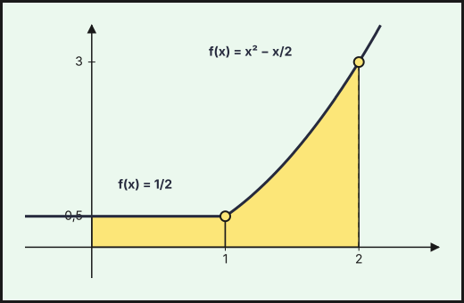{fig-alt="Gráfica de f con (a, b) = (0, 1/2): tramo horizontal y=1/2 hasta x=1 y parábola x²−x/2 desde x=1; recinto sombreado entre x=0 y x=2" width="75%" fig-align="center"}
::::
:::::

### Extraordinaria · Suplente 2021

::::: {.ebau-ej #ebau-2021-ext-sup-3}
**Ejercicio 3** · Extraordinaria · Suplente 2021 · Bloque B · *(2,5 puntos)* · [Examen](../../../assets/pau-ccss/2021-ext-sup/examen.pdf){target="_blank"}

Se considera la función $f(x)=\begin{cases}(x+1)^{2}&\text{si }-2\le x<0\\(x-1)^{2}&\text{si }0\le x\le2\end{cases}$

a) Estudie la continuidad y derivabilidad de la función $f$ en todo su dominio. *(1 punto)*

b) Calcule los extremos de la función $f$. *(0,7 puntos)*

c) Represente el recinto que encierra la gráfica de $f$, las rectas $x=-1$, $x=1$ y el eje $OX$. Calcule el área de dicho recinto. *(0,8 puntos)*

*Relacionado también con:* [Derivadas](06-derivadas.qmd), [Aplicaciones de la derivada](07-aplicaciones-derivada.qmd), [Integrales](08-integrales.qmd).

:::: {.callout-note collapse="true" appearance="simple"}
## Ayuda 1 · Recordatorio

**Continuidad.**

$f$ es continua en $a$ si $\lim_{x\to a^-}f(x)=\lim_{x\to a^+}f(x)=f(a)$. Las funciones elementales son continuas en su dominio; en una función a trozos solo hay que vigilar los puntos de cambio.

**Monotonía y extremos relativos.**

$f'>0$ en un intervalo: creciente; $f'<0$: decreciente. Un extremo relativo en $x=a$ exige $f'(a)=0$; es mínimo si $f'$ pasa de $-$ a $+$ (o $f''(a)>0$) y máximo si pasa de $+$ a $-$ (o $f''(a)<0$).

**Área de un recinto.**

Área entre $y=f(x)$ y el eje $X$: $\int_a^b|f(x)|\,dx$, partiendo en los puntos donde $f$ cambia de signo. Área entre dos curvas: $\int_a^b\left(f(x)-g(x)\right)dx$ con $f\ge g$. Los límites de integración son las abscisas de corte.

**Representar una función.**

Una gráfica se construye con: dominio, cortes con los ejes, asíntotas, monotonía y extremos (con $f'$), curvatura y puntos de inflexión (con $f''$), y una tabla de valores. Convexa si $f''>0$ y cóncava si $f''<0$.
::::

:::: {.callout-note collapse="true" appearance="simple"}
## Ayuda 2 · Método

**Continuidad.**

1. Localiza los puntos problemáticos (cambios de trozo, ceros de denominadores).
2. Calcula los dos límites laterales y $f(a)$.
3. Iguálalos: si hay parámetros, obtienes una ecuación para cada punto.
4. Concluye indicando el tipo de discontinuidad si no es continua (evitable o de salto).

**Monotonía y extremos relativos.**

1. Halla el dominio y calcula $f'(x)$.
2. Resuelve $f'(x)=0$ y localiza también los puntos donde $f'$ no existe.
3. Con esos puntos divide el dominio y estudia el signo de $f'$ en cada intervalo.
4. Escribe intervalos de crecimiento y decrecimiento, y los extremos con sus coordenadas $(a,f(a))$.

**Área de un recinto.**

1. Haz un esbozo del recinto.
2. Calcula los puntos de corte (resolviendo $f=g$ o $f=0$): son los límites.
3. Decide qué función va por encima en cada tramo; si se cruzan, parte la integral.
4. Aplica Barrow y da el área en $\text{u}^2$, siempre positiva.

**Representar una función.**

1. Dominio y cortes.
2. Asíntotas verticales, horizontales y oblicuas con límites.
3. Signo de $f'$: intervalos de crecimiento y extremos.
4. Signo de $f''$ si hace falta, y unos cuantos puntos.
5. Dibuja y comprueba que la gráfica respeta todos los datos anteriores.
::::

:::: {.callout-tip collapse="true" appearance="simple"}
## Solución

**a) Continuidad y derivabilidad.**
1. Cada rama es un polinomio (continuo y derivable en su intervalo); solo hay que estudiar $x=0$, donde cambia la expresión.
2. Continuidad en $x=0$: $\displaystyle\lim_{x\to0^-}(x+1)^2=1$ y $f(0)=(0-1)^2=1=\lim_{x\to0^+}(x-1)^2$: **continua.**
3. Derivadas: $f'(x)=2(x+1)$ si $-2<x<0$ y $f'(x)=2(x-1)$ si $0<x<2$. Laterales: $f'(0^-)=2\neq f'(0^+)=-2$ (hay un «pico»).

**$f$ es continua en $[-2,2]$ y derivable en $(-2,2)\setminus\{0\}$** (no derivable en $x=0$).

**b) Extremos.**
1. $f'=0$ en $x=-1$ y $x=1$ (los vértices de las parábolas); en $x=0$ no existe $f'$ y también hay que mirarlo.
2. Se calculan los valores en los puntos críticos y en los extremos del intervalo: $f(-2)=1$, $f(-1)=0$, $f(0)=1$, $f(1)=0$, $f(2)=1$.

![Gráfica de f: dos arcos de parábola, (x+1)² en [−2,0) y (x−1)² en [0,2], con forma de W; recinto sombreado entre x=−1 y x=1](fig/2021-ext-sup-e3.svg){fig-alt="Gráfica de f: dos arcos de parábola, (x+1)² en [−2,0) y (x−1)² en [0,2], con forma de W; recinto sombreado entre x=−1 y x=1" width="75%" fig-align="center"}

3. Como $f\ge0$ y vale $0$ en $x=\pm1$, esos son mínimos; en $x=0$, $f'$ pasa de $+$ a $-$, luego es máximo relativo.

**Mínimos (absolutos y relativos) $(-1,0)$ y $(1,0)$; máximo relativo $(0,1)$; máximo absoluto $1$, que se alcanza en $x=-2$, $x=0$ y $x=2$.**

**c) Área.**
1. La gráfica son dos arcos de parábola «en forma de W» con mínimos en $(-1,0)$ y $(1,0)$ y pico en $(0,1)$. El recinto entre $x=-1$ y $x=1$ queda sobre el eje $OX$ ($f\ge0$).
2. Se integra por tramos (la expresión cambia en $x=0$):
$$A=\int_{-1}^{0}(x+1)^2dx+\int_0^1(x-1)^2dx=\left[\frac{(x+1)^3}{3}\right]_{-1}^{0}+\left[\frac{(x-1)^3}{3}\right]_0^1=\frac{1}{3}+\frac{1}{3}=\frac{2}{3}.$$

**$A=\dfrac{2}{3}\ \text{u}^2$**
::::
:::::

## También trabajan este tema

Ejercicios cuyo tema principal es otro pero en los que aparece este tema:

- [2026 Ordinaria · Suplente 1, ejercicio 2B](04-funciones.qmd#ebau-2026-ord-sup1-2B) (tema principal: Funciones)
- [2026 Ordinaria · Suplente 2, ejercicio 2](07-aplicaciones-derivada.qmd#ebau-2026-ord-sup2-2) (tema principal: Aplicaciones de la derivada)
- [2025 Ordinaria · Modelo A, ejercicio 2](07-aplicaciones-derivada.qmd#ebau-2025-ord-a-2) (tema principal: Aplicaciones de la derivada)
- [2025 Ordinaria · Modelo A, ejercicio 3](07-aplicaciones-derivada.qmd#ebau-2025-ord-a-3) (tema principal: Aplicaciones de la derivada)
- [2025 Ordinaria · Modelo B, ejercicio 3](04-funciones.qmd#ebau-2025-ord-b-3) (tema principal: Funciones)
- [2025 Ordinaria · Suplente 1 · Modelo A, ejercicio 4](07-aplicaciones-derivada.qmd#ebau-2025-ord-sup1-a-4) (tema principal: Aplicaciones de la derivada)
- [2025 Ordinaria · Suplente 1 · Modelo B, ejercicio 3](04-funciones.qmd#ebau-2025-ord-sup1-b-3) (tema principal: Funciones)
- [2025 Ordinaria · Suplente 2 · Modelo B, ejercicio 3](04-funciones.qmd#ebau-2025-ord-sup2-b-3) (tema principal: Funciones)
- [2024 Ordinaria · Suplente · Modelo B, ejercicio 3](04-funciones.qmd#ebau-2024-ord-sup-b-3) (tema principal: Funciones)

---

*Enunciados: Prueba de Acceso y Admisión a la Universidad (PEvAU hasta 2024, PAU desde 2025), Matemáticas Aplicadas a las Ciencias Sociales II, Andalucía, Ceuta, Melilla y centros en Marruecos (Distrito Único Andaluz). Cada ejercicio enlaza al PDF oficial del examen completo. La clasificación por temas es propia y puede discutirse: los ejercicios mixtos figuran en su tema principal.*
