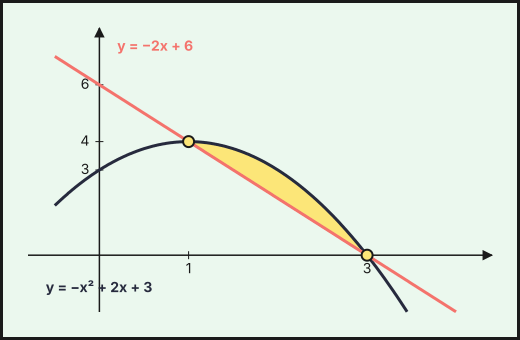
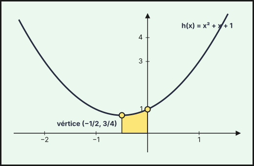

Ejercicios de **Matemáticas Aplicadas a las Ciencias Sociales II** de la prueba de acceso a la universidad en Andalucía (PAU, antes PEvAU) de **2021 a 2026** cuyo tema principal es *derivadas*: **6 ejercicios** de convocatorias ordinarias y extraordinarias y de sus reservas o suplentes. Repasa antes la [teoría](../../../apuntes/2-bachillerato-ccss/06-derivadas/index.qmd), los [ejercicios del tema](../06-derivadas/index.qmd) y las [actividades interactivas](../../../actividades/2-bachillerato-ccss/06-derivadas/index.qmd).

Debajo de cada ejercicio hay tres desplegables, de menos a más ayuda: **Ayuda 1 · Recordatorio** (la teoría que necesitas, sin tocar los datos), **Ayuda 2 · Método** (los pasos a seguir) y la **resolución breve** con el resultado. Inténtalo con la menor ayuda posible.

## 2024

### Ordinaria · Modelo A 2024

::::: {.ebau-ej #ebau-2024-ord-a-3}
**Ejercicio 3** · Ordinaria · Modelo A 2024 · Bloque B · *(2,5 puntos)* · [Examen](../../../assets/pau-ccss/2024-ord-a/examen.pdf){target="_blank"}

a) Calcule la derivada de las funciones siguientes: *(1,5 puntos)*

$$f(x)=\left(x^{2}+2\right)^{3}\cdot e^{-2x}\qquad\qquad g(x)=\frac{\ln\left(1-x^{3}\right)}{\left(1-2x^{2}\right)^{2}}$$

b) Halle los valores de $a$ y $b$ para que sea horizontal la recta tangente a la gráfica de la función $h(x)=x^{3}+ax^{2}+3x+b$ en el punto $P(1,2)$. *(1 punto)*

*Relacionado también con:* [Aplicaciones de la derivada](07-aplicaciones-derivada.qmd).

:::: {.callout-note collapse="true" appearance="simple"}
## Ayuda 1 · Recordatorio

**Reglas de derivación.**

$(u\pm v)'=u'\pm v'$; $(u\cdot v)'=u'v+uv'$; $\left(\dfrac{u}{v}\right)'=\dfrac{u'v-uv'}{v^2}$; regla de la cadena $(f\circ g)'=f'(g)\cdot g'$. Básicas: $(x^n)'=nx^{n-1}$, $(e^{u})'=u'e^{u}$, $(\ln u)'=\dfrac{u'}{u}$.

**Recta tangente.**

Tangente a la gráfica de $f$ en $x=a$: $y-f(a)=f'(a)\,(x-a)$. La pendiente es $f'(a)$. Tangente horizontal: $f'(a)=0$. Rectas paralelas tienen la misma pendiente; perpendiculares, $m\cdot m'=-1$.

**Hallar parámetros de una función.**

Cada dato del enunciado da una ecuación: pasa por $(a,b)\Rightarrow f(a)=b$; extremo en $x=a\Rightarrow f'(a)=0$; pendiente $m$ en $x=a\Rightarrow f'(a)=m$; inflexión en $x=a\Rightarrow f''(a)=0$; área o integral dada $\Rightarrow$ igualar la integral.

**Representar una función.**

Una gráfica se construye con: dominio, cortes con los ejes, asíntotas, monotonía y extremos (con $f'$), curvatura y puntos de inflexión (con $f''$), y una tabla de valores. Convexa si $f''>0$ y cóncava si $f''<0$.
::::

:::: {.callout-note collapse="true" appearance="simple"}
## Ayuda 2 · Método

**Reglas de derivación.**

1. Identifica la estructura: ¿suma, producto, cociente o función compuesta? Empieza por la operación «de fuera».
2. Aplica la regla y simplifica (saca factor común).
3. Comprueba un valor numérico si tienes dudas.

**Recta tangente.**

1. Calcula $f(a)$ (el punto) y $f'(x)$.
2. Evalúa $f'(a)$ (la pendiente).
3. Sustituye en la ecuación punto-pendiente.
4. Si el punto no es dato, obtén $a$ de la condición del enunciado (pendiente dada, tangente horizontal…).

**Hallar parámetros de una función.**

1. Lista los datos y escribe una ecuación por cada uno.
2. Resuelve el sistema (suele ser lineal en los parámetros).
3. Comprueba que la función resultante cumple todo, y que el extremo es del tipo pedido.

**Representar una función.**

1. Dominio y cortes.
2. Asíntotas verticales, horizontales y oblicuas con límites.
3. Signo de $f'$: intervalos de crecimiento y extremos.
4. Signo de $f''$ si hace falta, y unos cuantos puntos.
5. Dibuja y comprueba que la gráfica respeta todos los datos anteriores.
::::

:::: {.callout-tip collapse="true" appearance="simple"}
## Solución

**a) Derivadas.**
1. $f$ es un producto, $(uv)'=u'v+uv'$, con $u=\left(x^2+2\right)^3$ (derivada por la regla de la cadena: $3\left(x^2+2\right)^2\cdot2x$) y $v=e^{-2x}$ (derivada $-2e^{-2x}$):
$$f'(x)=3\left(x^2+2\right)^2\cdot2x\,e^{-2x}-2\left(x^2+2\right)^3e^{-2x}=2\left(x^2+2\right)^2e^{-2x}\left(3x-x^2-2\right).$$
2. $g$ es un cociente, $\left(\dfrac{u}{v}\right)'=\dfrac{u'v-uv'}{v^2}$, con $u=\ln\left(1-x^3\right)$ (derivada $\dfrac{-3x^2}{1-x^3}$) y $v=\left(1-2x^2\right)^2$ (derivada $2\left(1-2x^2\right)(-4x)$):
$$g'(x)=\dfrac{\dfrac{-3x^2}{1-x^3}\left(1-2x^2\right)^2-\ln\left(1-x^3\right)\cdot2\left(1-2x^2\right)(-4x)}{\left(1-2x^2\right)^4}=\dfrac{\dfrac{-3x^2}{1-x^3}\left(1-2x^2\right)+8x\ln\left(1-x^3\right)}{\left(1-2x^2\right)^3}.$$
   (se simplifica un factor $1-2x^2$ del numerador y del denominador).

**b) Tangente horizontal en $P(1,2)$.**
1. Derivada: $h'(x)=3x^2+2ax+3$.
2. Tangente horizontal en $x=1$ significa pendiente $0$: $h'(1)=3+2a+3=0\Rightarrow a=-3$.
3. $P(1,2)$ está en la gráfica: $h(1)=1+a+3+b=2\Rightarrow1-3+3+b=2\Rightarrow b=1$.

**$a=-3$ y $b=1$.**
::::
:::::

## 2023

### Ordinaria · Reserva · Modelo A 2023

::::: {.ebau-ej #ebau-2023-ord-res-a-3}
**Ejercicio 3** · Ordinaria · Reserva · Modelo A 2023 · Bloque B · *(2,5 puntos)* · [Examen](../../../assets/pau-ccss/2023-ord-res-a/examen.pdf){target="_blank"}

a) Calcule la ecuación de la recta tangente a la gráfica de cada una de las siguientes funciones en el punto de abscisa $x=0$: *(1,5 puntos)*

$$f(x)=\frac{3x^{2}+5x-2}{-3x+7}\qquad\qquad g(x)=\ln\left(\frac{1}{3x+1}\right)$$

b) Calcule las integrales definidas siguientes: *(1 punto)*

$$\int_{-2}^{-1}\frac{5}{3x^{4}}\,dx\qquad\qquad\int_{-3}^{0}\frac{e^{x/3}}{5}\,dx$$

*Relacionado también con:* [Integrales](08-integrales.qmd).

:::: {.callout-note collapse="true" appearance="simple"}
## Ayuda 1 · Recordatorio

**Recta tangente.**

Tangente a la gráfica de $f$ en $x=a$: $y-f(a)=f'(a)\,(x-a)$. La pendiente es $f'(a)$. Tangente horizontal: $f'(a)=0$. Rectas paralelas tienen la misma pendiente; perpendiculares, $m\cdot m'=-1$.

**Integral definida (regla de Barrow).**

Regla de Barrow: $\int_a^b f(x)\,dx=F(b)-F(a)$, con $F$ una primitiva de $f$. Si $f\ge0$ en $[a,b]$, la integral es el área bajo la curva; si $f\le0$, es el área cambiada de signo.

**Representar una función.**

Una gráfica se construye con: dominio, cortes con los ejes, asíntotas, monotonía y extremos (con $f'$), curvatura y puntos de inflexión (con $f''$), y una tabla de valores. Convexa si $f''>0$ y cóncava si $f''<0$.
::::

:::: {.callout-note collapse="true" appearance="simple"}
## Ayuda 2 · Método

**Recta tangente.**

1. Calcula $f(a)$ (el punto) y $f'(x)$.
2. Evalúa $f'(a)$ (la pendiente).
3. Sustituye en la ecuación punto-pendiente.
4. Si el punto no es dato, obtén $a$ de la condición del enunciado (pendiente dada, tangente horizontal…).

**Integral definida (regla de Barrow).**

1. Halla una primitiva $F$.
2. Evalúa $F(b)-F(a)$ cuidando los signos y las fracciones.
3. Interpreta el signo del resultado.

**Representar una función.**

1. Dominio y cortes.
2. Asíntotas verticales, horizontales y oblicuas con límites.
3. Signo de $f'$: intervalos de crecimiento y extremos.
4. Signo de $f''$ si hace falta, y unos cuantos puntos.
5. Dibuja y comprueba que la gráfica respeta todos los datos anteriores.
::::

:::: {.callout-tip collapse="true" appearance="simple"}
## Solución

**a) Rectas tangentes en $x=0$.** Se usa $y-f(0)=f'(0)\,x$.

*Función $f$.*
1. Valor: $f(0)=-\dfrac{2}{7}$.
2. Derivada (cociente): $f'(x)=\dfrac{(6x+5)(-3x+7)+3\left(3x^2+5x-2\right)}{(-3x+7)^2}$.
3. Pendiente: $f'(0)=\dfrac{35-6}{49}=\dfrac{29}{49}$.
4. Tangente: $y+\dfrac{2}{7}=\dfrac{29}{49}x$.

**$y=\dfrac{29}{49}x-\dfrac{2}{7}$.**

*Función $g$.*
1. Se simplifica con las propiedades de los logaritmos: $g(x)=-\ln(3x+1)$.
2. Valor: $g(0)=0$. Derivada: $g'(x)=-\dfrac{3}{3x+1}$, con $g'(0)=-3$.

**$y=-3x$.**

**b) Integrales definidas.**
1. Primera, con una potencia: $\displaystyle\int_{-2}^{-1}\frac{5}{3x^4}\,dx=\frac{5}{3}\left[-\frac{1}{3x^3}\right]_{-2}^{-1}=\frac{5}{3}\left(\frac{1}{3}-\frac{1}{24}\right)=\frac{35}{72}.$
2. Segunda, con una exponencial: $\displaystyle\int_{-3}^{0}\frac{e^{x/3}}{5}\,dx=\frac{3}{5}\left[e^{x/3}\right]_{-3}^{0}=\frac{3}{5}\left(1-e^{-1}\right)=\frac{3}{5}-\frac{3}{5e}.$
::::
:::::

### Ordinaria · Reserva · Modelo B 2023

::::: {.ebau-ej #ebau-2023-ord-res-b-3}
**Ejercicio 3** · Ordinaria · Reserva · Modelo B 2023 · Bloque B · *(2,5 puntos)* · [Examen](../../../assets/pau-ccss/2023-ord-res-b/examen.pdf){target="_blank"}

a) Calcule las derivadas de las siguientes funciones: *(1,5 puntos)*

$$f(x)=\left(-7+x^{2}\right)^{3}\cdot e^{5-x}\qquad\qquad g(x)=\frac{\ln\left(x^{4}-2x^{2}\right)}{8-x^{3}}$$

b) Represente gráficamente la región acotada comprendida entre la recta $y=-2x+6$ y la parábola $y=-x^{2}+2x+3$ y calcule su área. *(1 punto)*

*Relacionado también con:* [Integrales](08-integrales.qmd).

:::: {.callout-note collapse="true" appearance="simple"}
## Ayuda 1 · Recordatorio

**Reglas de derivación.**

$(u\pm v)'=u'\pm v'$; $(u\cdot v)'=u'v+uv'$; $\left(\dfrac{u}{v}\right)'=\dfrac{u'v-uv'}{v^2}$; regla de la cadena $(f\circ g)'=f'(g)\cdot g'$. Básicas: $(x^n)'=nx^{n-1}$, $(e^{u})'=u'e^{u}$, $(\ln u)'=\dfrac{u'}{u}$.

**Área de un recinto.**

Área entre $y=f(x)$ y el eje $X$: $\int_a^b|f(x)|\,dx$, partiendo en los puntos donde $f$ cambia de signo. Área entre dos curvas: $\int_a^b\left(f(x)-g(x)\right)dx$ con $f\ge g$. Los límites de integración son las abscisas de corte.

**Representar una función.**

Una gráfica se construye con: dominio, cortes con los ejes, asíntotas, monotonía y extremos (con $f'$), curvatura y puntos de inflexión (con $f''$), y una tabla de valores. Convexa si $f''>0$ y cóncava si $f''<0$.
::::

:::: {.callout-note collapse="true" appearance="simple"}
## Ayuda 2 · Método

**Reglas de derivación.**

1. Identifica la estructura: ¿suma, producto, cociente o función compuesta? Empieza por la operación «de fuera».
2. Aplica la regla y simplifica (saca factor común).
3. Comprueba un valor numérico si tienes dudas.

**Área de un recinto.**

1. Haz un esbozo del recinto.
2. Calcula los puntos de corte (resolviendo $f=g$ o $f=0$): son los límites.
3. Decide qué función va por encima en cada tramo; si se cruzan, parte la integral.
4. Aplica Barrow y da el área en $\text{u}^2$, siempre positiva.

**Representar una función.**

1. Dominio y cortes.
2. Asíntotas verticales, horizontales y oblicuas con límites.
3. Signo de $f'$: intervalos de crecimiento y extremos.
4. Signo de $f''$ si hace falta, y unos cuantos puntos.
5. Dibuja y comprueba que la gráfica respeta todos los datos anteriores.
::::

:::: {.callout-tip collapse="true" appearance="simple"}
## Solución

**a) Derivadas.**
1. $f$ es un producto, $(uv)'=u'v+uv'$, con $u=\left(x^2-7\right)^3$ (cadena: $3\left(x^2-7\right)^2\cdot2x$) y $v=e^{5-x}$ (derivada $-e^{5-x}$):
$$f'(x)=3\left(x^2-7\right)^2\cdot2x\cdot e^{5-x}-\left(x^2-7\right)^3e^{5-x}=\left(x^2-7\right)^2e^{5-x}\left(6x-x^2+7\right).$$
2. $g$ es un cociente, $\left(\dfrac{u}{v}\right)'=\dfrac{u'v-uv'}{v^2}$, con $u=\ln\left(x^4-2x^2\right)$ ($u'=\dfrac{4x^3-4x}{x^4-2x^2}$) y $v=8-x^3$ ($v'=-3x^2$):
$$g'(x)=\dfrac{\dfrac{4x^3-4x}{x^4-2x^2}\left(8-x^3\right)+3x^2\ln\left(x^4-2x^2\right)}{\left(8-x^3\right)^2}.$$

**b) Región y área.**
1. Cortes: $-x^2+2x+3=-2x+6\iff x^2-4x+3=0\iff x=1$ o $x=3$, en los puntos $(1,4)$ y $(3,0)$.
2. En $[1,3]$ la parábola (vértice $(1,4)$, abierta hacia abajo) queda por encima de la recta.
3. Área (parábola menos recta), con Barrow:
$$A=\int_1^3\left[\left(-x^2+2x+3\right)-\left(-2x+6\right)\right]dx=\int_1^3\left(-x^2+4x-3\right)dx=\left[-\frac{x^3}{3}+2x^2-3x\right]_1^3=0-\left(-\frac{4}{3}\right)=\frac{4}{3}.$$

**$A=\dfrac{4}{3}\ \text{u}^2$**

{fig-alt="Región acotada entre la recta y=−2x+6 y la parábola y=−x²+2x+3, que se cortan en (1,4) y (3,0)" width="75%" fig-align="center"}
::::
:::::

## 2022

### Ordinaria · Reserva 2022

::::: {.ebau-ej #ebau-2022-ord-res-4}
**Ejercicio 4** · Ordinaria · Reserva 2022 · Bloque B · *(2,5 puntos)* · [Examen](../../../assets/pau-ccss/2022-ord-res/examen.pdf){target="_blank"}

Se considera la función $f(x)=3x^{3}-6x^{2}+5$.

a) Obtenga las ecuaciones de las rectas tangentes a $f$ que sean paralelas a la recta de ecuación $y=-3x+1$. *(1,5 puntos)*

b) Calcule la función $F$ que verifique que $F'(x)=f(x)$ y $F(2)=4$. *(1 punto)*

*Relacionado también con:* [Integrales](08-integrales.qmd).

:::: {.callout-note collapse="true" appearance="simple"}
## Ayuda 1 · Recordatorio

**Recta tangente.**

Tangente a la gráfica de $f$ en $x=a$: $y-f(a)=f'(a)\,(x-a)$. La pendiente es $f'(a)$. Tangente horizontal: $f'(a)=0$. Rectas paralelas tienen la misma pendiente; perpendiculares, $m\cdot m'=-1$.

**Primitivas.**

$\int x^n\,dx=\dfrac{x^{n+1}}{n+1}+C\ (n\neq-1)$; $\int\dfrac{1}{x}\,dx=\ln|x|+C$; $\int e^{kx}\,dx=\dfrac{e^{kx}}{k}+C$; $\int\dfrac{u'}{u}\,dx=\ln|u|+C$. Linealidad: $\int(af+bg)=a\int f+b\int g$. Para $F(x)$ con $F(a)=b$ se usa la constante $C$.
::::

:::: {.callout-note collapse="true" appearance="simple"}
## Ayuda 2 · Método

**Recta tangente.**

1. Calcula $f(a)$ (el punto) y $f'(x)$.
2. Evalúa $f'(a)$ (la pendiente).
3. Sustituye en la ecuación punto-pendiente.
4. Si el punto no es dato, obtén $a$ de la condición del enunciado (pendiente dada, tangente horizontal…).

**Primitivas.**

1. Reescribe el integrando como suma de potencias (separa fracciones, pasa raíces a exponente fraccionario).
2. Integra término a término.
3. Si piden una primitiva concreta, impón la condición $F(a)=b$ para hallar $C$.
4. Deriva el resultado para comprobarlo.
::::

:::: {.callout-tip collapse="true" appearance="simple"}
## Solución

**a) Rectas tangentes paralelas a $y=-3x+1$.**
1. Rectas paralelas tienen la misma pendiente: $f'(x_0)=-3$.
2. Derivada: $f'(x)=9x^2-12x$. Se resuelve $f'(x)=-3\iff3x^2-4x+1=0\iff x=1$ o $x=\dfrac{1}{3}$.
3. Para cada punto se usa $y-f(x_0)=f'(x_0)(x-x_0)$:
   - $x=1$: $f(1)=2$ y tangente $y-2=-3(x-1)$, **$y=-3x+5$**.
   - $x=\dfrac{1}{3}$: $f\left(\frac{1}{3}\right)=\dfrac{40}{9}$ y tangente $y-\dfrac{40}{9}=-3\left(x-\dfrac{1}{3}\right)$, **$y=-3x+\dfrac{49}{9}$**.

**b) Primitiva con condición.**
1. Se integra: $F(x)=\displaystyle\int\left(3x^3-6x^2+5\right)dx=\frac{3x^4}{4}-2x^3+5x+K$.
2. Se impone $F(2)=4$: $F(2)=12-16+10+K=4$, de donde $K=-2$.

**$F(x)=\dfrac{3x^4}{4}-2x^3+5x-2$.**
::::
:::::

## 2021

### Ordinaria 2021

::::: {.ebau-ej #ebau-2021-ord-4}
**Ejercicio 4** · Ordinaria 2021 · Bloque B · *(2,5 puntos)* · [Examen](../../../assets/pau-ccss/2021-ord/examen.pdf){target="_blank"}

a) Calcule la derivada de las siguientes funciones: *(1 punto)*

$$f(x)=\ln\left(\frac{x-1}{x+1}\right)\qquad\qquad g(x)=x^{3}\cdot e^{2x^{2}}$$

b) Represente gráficamente la parábola $h(x)=x^{2}+x+1$, indicando el vértice y los puntos de corte con los ejes coordenados. *(0,7 puntos)*

c) Calcule el área del recinto limitado por la gráfica de $h(x)=x^{2}+x+1$, el eje de abscisas y las rectas $x=-\dfrac{1}{2}$ y $x=0$. *(0,8 puntos)*

*Relacionado también con:* [Funciones](04-funciones.qmd), [Integrales](08-integrales.qmd).

:::: {.callout-note collapse="true" appearance="simple"}
## Ayuda 1 · Recordatorio

**Reglas de derivación.**

$(u\pm v)'=u'\pm v'$; $(u\cdot v)'=u'v+uv'$; $\left(\dfrac{u}{v}\right)'=\dfrac{u'v-uv'}{v^2}$; regla de la cadena $(f\circ g)'=f'(g)\cdot g'$. Básicas: $(x^n)'=nx^{n-1}$, $(e^{u})'=u'e^{u}$, $(\ln u)'=\dfrac{u'}{u}$.

**Dominio, cortes y simetrías.**

Dominio: excluye los puntos donde se anula un denominador, el radicando de una raíz de índice par es negativo o el argumento de un logaritmo no es positivo. Cortes: con el eje $X$ se resuelve $f(x)=0$; con el eje $Y$ se calcula $f(0)$.

**Área de un recinto.**

Área entre $y=f(x)$ y el eje $X$: $\int_a^b|f(x)|\,dx$, partiendo en los puntos donde $f$ cambia de signo. Área entre dos curvas: $\int_a^b\left(f(x)-g(x)\right)dx$ con $f\ge g$. Los límites de integración son las abscisas de corte.

**Representar una función.**

Una gráfica se construye con: dominio, cortes con los ejes, asíntotas, monotonía y extremos (con $f'$), curvatura y puntos de inflexión (con $f''$), y una tabla de valores. Convexa si $f''>0$ y cóncava si $f''<0$.
::::

:::: {.callout-note collapse="true" appearance="simple"}
## Ayuda 2 · Método

**Reglas de derivación.**

1. Identifica la estructura: ¿suma, producto, cociente o función compuesta? Empieza por la operación «de fuera».
2. Aplica la regla y simplifica (saca factor común).
3. Comprueba un valor numérico si tienes dudas.

**Dominio, cortes y simetrías.**

1. Halla el dominio y escríbelo como unión de intervalos.
2. Calcula los cortes con los ejes.
3. Estudia el signo de $f$ entre los puntos que anulan $f$ o su denominador.

**Área de un recinto.**

1. Haz un esbozo del recinto.
2. Calcula los puntos de corte (resolviendo $f=g$ o $f=0$): son los límites.
3. Decide qué función va por encima en cada tramo; si se cruzan, parte la integral.
4. Aplica Barrow y da el área en $\text{u}^2$, siempre positiva.

**Representar una función.**

1. Dominio y cortes.
2. Asíntotas verticales, horizontales y oblicuas con límites.
3. Signo de $f'$: intervalos de crecimiento y extremos.
4. Signo de $f''$ si hace falta, y unos cuantos puntos.
5. Dibuja y comprueba que la gráfica respeta todos los datos anteriores.
::::

:::: {.callout-tip collapse="true" appearance="simple"}
## Solución

**a) Derivadas.**
1. Para $f$, conviene aplicar antes las propiedades de los logaritmos: $f(x)=\ln(x-1)-\ln(x+1)$, y se deriva cada término:
$$f'(x)=\dfrac{1}{x-1}-\dfrac{1}{x+1}=\dfrac{2}{x^2-1}.$$
2. $g$ es un producto, $(uv)'=u'v+uv'$, con $u=x^3$ y $v=e^{2x^2}$ (derivada $4x\,e^{2x^2}$, por la regla de la cadena):
$$g'(x)=3x^2e^{2x^2}+x^3\cdot4x\,e^{2x^2}=x^2e^{2x^2}\left(3+4x^2\right).$$

**b) Parábola $h(x)=x^2+x+1$.**
1. **Vértice:** $h'(x)=2x+1=0\Rightarrow x=-\dfrac{1}{2}$, con $h\!\left(-\tfrac12\right)=\dfrac34$: **vértice $\left(-\dfrac{1}{2},\dfrac{3}{4}\right)$**.
2. **Cortes:** con el eje $OX$ no corta ($\Delta=1-4=-3<0$); con el eje $OY$ corta en $(0,1)$.
3. Es una parábola abierta hacia arriba, simétrica respecto de $x=-\dfrac{1}{2}$, que pasa también por $(-1,1)$.

{fig-alt="Parábola h(x)=x²+x+1 con vértice (−1/2, 3/4), sin cortes con el eje X y corte con el eje Y en (0,1); sombreada entre x=−1/2 y x=0" width="75%" fig-align="center"}

**c) Área.**
1. $h>0$ siempre (la parábola queda sobre el eje $OX$), así que el área es la integral entre $-\tfrac12$ y $0$.
2. Barrow:
$$\int_{-1/2}^{0}\left(x^2+x+1\right)dx=\left[\frac{x^3}{3}+\frac{x^2}{2}+x\right]_{-1/2}^{0}=0-\left(-\frac{1}{24}+\frac{1}{8}-\frac{1}{2}\right)=\frac{5}{12}.$$

**$A=\dfrac{5}{12}\ \text{u}^2$**
::::
:::::

### Ordinaria · Reserva 2021

::::: {.ebau-ej #ebau-2021-ord-res-4}
**Ejercicio 4** · Ordinaria · Reserva 2021 · Bloque B · *(2,5 puntos)* · [Examen](../../../assets/pau-ccss/2021-ord-res/examen.pdf){target="_blank"}

a) Calcule la derivada de las siguientes funciones: *(1 punto)*

$$f(x)=\left(5x^{3}+4x-2\right)^{4}\cdot\ln\left(2x^{5}-4x^{3}+x\right)\qquad\qquad g(x)=\frac{e^{3x^{2}-5x}}{\left(6x^{2}+2\right)^{3}}$$

b) Halle la función $h(x)$, sabiendo que su derivada es $h'(x)=4x^{3}+x^{2}-4x-1$ y que $h(2)=\dfrac{11}{3}$. *(1,5 puntos)*

*Relacionado también con:* [Integrales](08-integrales.qmd).

:::: {.callout-note collapse="true" appearance="simple"}
## Ayuda 1 · Recordatorio

**Reglas de derivación.**

$(u\pm v)'=u'\pm v'$; $(u\cdot v)'=u'v+uv'$; $\left(\dfrac{u}{v}\right)'=\dfrac{u'v-uv'}{v^2}$; regla de la cadena $(f\circ g)'=f'(g)\cdot g'$. Básicas: $(x^n)'=nx^{n-1}$, $(e^{u})'=u'e^{u}$, $(\ln u)'=\dfrac{u'}{u}$.

**Primitivas.**

$\int x^n\,dx=\dfrac{x^{n+1}}{n+1}+C\ (n\neq-1)$; $\int\dfrac{1}{x}\,dx=\ln|x|+C$; $\int e^{kx}\,dx=\dfrac{e^{kx}}{k}+C$; $\int\dfrac{u'}{u}\,dx=\ln|u|+C$. Linealidad: $\int(af+bg)=a\int f+b\int g$. Para $F(x)$ con $F(a)=b$ se usa la constante $C$.
::::

:::: {.callout-note collapse="true" appearance="simple"}
## Ayuda 2 · Método

**Reglas de derivación.**

1. Identifica la estructura: ¿suma, producto, cociente o función compuesta? Empieza por la operación «de fuera».
2. Aplica la regla y simplifica (saca factor común).
3. Comprueba un valor numérico si tienes dudas.

**Primitivas.**

1. Reescribe el integrando como suma de potencias (separa fracciones, pasa raíces a exponente fraccionario).
2. Integra término a término.
3. Si piden una primitiva concreta, impón la condición $F(a)=b$ para hallar $C$.
4. Deriva el resultado para comprobarlo.
::::

:::: {.callout-tip collapse="true" appearance="simple"}
## Solución

**a) Derivadas.**
1. $f$ es un producto de una potencia por un logaritmo: $(uv)'=u'v+uv'$, con $u=\left(5x^3+4x-2\right)^4$ (cadena) y $v=\ln\left(2x^5-4x^3+x\right)$ (cuya derivada es $\dfrac{\text{derivada del argumento}}{\text{argumento}}$):

$f'(x)=4\left(5x^3+4x-2\right)^3\left(15x^2+4\right)\ln\left(2x^5-4x^3+x\right)+\left(5x^3+4x-2\right)^4\dfrac{10x^4-12x^2+1}{2x^5-4x^3+x}.$

2. $g$ es un cociente: $\left(\dfrac uv\right)'=\dfrac{u'v-uv'}{v^2}$, con $u=e^{3x^2-5x}$ y $v=\left(6x^2+2\right)^3$. Se simplifica sacando factor común $e^{3x^2-5x}\left(6x^2+2\right)^2$:

$g'(x)=\dfrac{e^{3x^2-5x}(6x-5)\left(6x^2+2\right)^3-e^{3x^2-5x}\cdot3\left(6x^2+2\right)^2\cdot12x}{\left(6x^2+2\right)^6}=\dfrac{e^{3x^2-5x}\left(36x^3-30x^2-24x-10\right)}{\left(6x^2+2\right)^4}.$

**b) Función $h$ a partir de $h'$.**
1. $h$ es una primitiva de $h'$: $h(x)=\displaystyle\int\left(4x^3+x^2-4x-1\right)dx=x^4+\frac{x^3}{3}-2x^2-x+C$.
2. Se impone $h(2)=\dfrac{11}{3}$: $16+\dfrac{8}{3}-8-2+C=\dfrac{11}{3}$, de donde $C=-5$.

**$h(x)=x^4+\dfrac{x^3}{3}-2x^2-x-5$.**
::::
:::::

## También trabajan este tema

Ejercicios cuyo tema principal es otro pero en los que aparece este tema:

- [2026 Ordinaria, ejercicio 2](05-limites-continuidad.qmd#ebau-2026-ord-2) (tema principal: Límites y continuidad)
- [2026 Ordinaria · Suplente 1, ejercicio 2A](05-limites-continuidad.qmd#ebau-2026-ord-sup1-2A) (tema principal: Límites y continuidad)
- [2026 Ordinaria · Suplente 1, ejercicio 2B](04-funciones.qmd#ebau-2026-ord-sup1-2B) (tema principal: Funciones)
- [2026 Extraordinaria · Suplente 1, ejercicio 2B](05-limites-continuidad.qmd#ebau-2026-ext-sup1-2B) (tema principal: Límites y continuidad)
- [2026 Extraordinaria · Suplente 2, ejercicio 2](04-funciones.qmd#ebau-2026-ext-sup2-2) (tema principal: Funciones)
- [2025 Ordinaria · Modelo B, ejercicio 3](04-funciones.qmd#ebau-2025-ord-b-3) (tema principal: Funciones)
- [2025 Ordinaria · Suplente 1 · Modelo A, ejercicio 3](05-limites-continuidad.qmd#ebau-2025-ord-sup1-a-3) (tema principal: Límites y continuidad)
- [2025 Ordinaria · Suplente 1 · Modelo A, ejercicio 4](07-aplicaciones-derivada.qmd#ebau-2025-ord-sup1-a-4) (tema principal: Aplicaciones de la derivada)
- [2025 Ordinaria · Suplente 1 · Modelo B, ejercicio 3](04-funciones.qmd#ebau-2025-ord-sup1-b-3) (tema principal: Funciones)
- [2025 Ordinaria · Suplente 2 · Modelo A, ejercicio 3](07-aplicaciones-derivada.qmd#ebau-2025-ord-sup2-a-3) (tema principal: Aplicaciones de la derivada)
- [2025 Ordinaria · Suplente 2 · Modelo A, ejercicio 4](05-limites-continuidad.qmd#ebau-2025-ord-sup2-a-4) (tema principal: Límites y continuidad)
- [2025 Ordinaria · Suplente 2 · Modelo B, ejercicio 3](04-funciones.qmd#ebau-2025-ord-sup2-b-3) (tema principal: Funciones)
- [2024 Ordinaria · Modelo A, ejercicio 4](05-limites-continuidad.qmd#ebau-2024-ord-a-4) (tema principal: Límites y continuidad)
- [2024 Ordinaria · Modelo B, ejercicio 3](05-limites-continuidad.qmd#ebau-2024-ord-b-3) (tema principal: Límites y continuidad)
- [2024 Ordinaria · Modelo B, ejercicio 4](05-limites-continuidad.qmd#ebau-2024-ord-b-4) (tema principal: Límites y continuidad)
- [2024 Ordinaria · Reserva · Modelo A, ejercicio 3](08-integrales.qmd#ebau-2024-ord-res-a-3) (tema principal: Integrales)
- [2024 Ordinaria · Reserva · Modelo A, ejercicio 4](05-limites-continuidad.qmd#ebau-2024-ord-res-a-4) (tema principal: Límites y continuidad)
- [2024 Ordinaria · Reserva · Modelo B, ejercicio 3](05-limites-continuidad.qmd#ebau-2024-ord-res-b-3) (tema principal: Límites y continuidad)
- [2024 Ordinaria · Suplente · Modelo A, ejercicio 4](05-limites-continuidad.qmd#ebau-2024-ord-sup-a-4) (tema principal: Límites y continuidad)
- [2024 Ordinaria · Suplente · Modelo B, ejercicio 3](04-funciones.qmd#ebau-2024-ord-sup-b-3) (tema principal: Funciones)
- [2024 Ordinaria · Suplente · Modelo B, ejercicio 4](05-limites-continuidad.qmd#ebau-2024-ord-sup-b-4) (tema principal: Límites y continuidad)
- [2023 Ordinaria · Modelo B, ejercicio 4](04-funciones.qmd#ebau-2023-ord-b-4) (tema principal: Funciones)
- [2023 Ordinaria · Reserva · Modelo A, ejercicio 4](05-limites-continuidad.qmd#ebau-2023-ord-res-a-4) (tema principal: Límites y continuidad)
- [2023 Ordinaria · Suplente · Modelo A, ejercicio 4](05-limites-continuidad.qmd#ebau-2023-ord-sup-a-4) (tema principal: Límites y continuidad)
- [2023 Ordinaria · Suplente · Modelo B, ejercicio 3](05-limites-continuidad.qmd#ebau-2023-ord-sup-b-3) (tema principal: Límites y continuidad)
- [2022 Ordinaria, ejercicio 3](07-aplicaciones-derivada.qmd#ebau-2022-ord-3) (tema principal: Aplicaciones de la derivada)
- [2022 Ordinaria, ejercicio 4](05-limites-continuidad.qmd#ebau-2022-ord-4) (tema principal: Límites y continuidad)
- [2022 Ordinaria · Suplente, ejercicio 4](05-limites-continuidad.qmd#ebau-2022-ord-sup-4) (tema principal: Límites y continuidad)
- [2022 Extraordinaria · Reserva, ejercicio 3](05-limites-continuidad.qmd#ebau-2022-ext-res-3) (tema principal: Límites y continuidad)
- [2022 Extraordinaria · Reserva, ejercicio 4](04-funciones.qmd#ebau-2022-ext-res-4) (tema principal: Funciones)
- [2022 Extraordinaria · Suplente, ejercicio 4](05-limites-continuidad.qmd#ebau-2022-ext-sup-4) (tema principal: Límites y continuidad)
- [2021 Ordinaria · Reserva, ejercicio 3](05-limites-continuidad.qmd#ebau-2021-ord-res-3) (tema principal: Límites y continuidad)
- [2021 Ordinaria · Suplente, ejercicio 3](05-limites-continuidad.qmd#ebau-2021-ord-sup-3) (tema principal: Límites y continuidad)
- [2021 Ordinaria · Suplente, ejercicio 4](07-aplicaciones-derivada.qmd#ebau-2021-ord-sup-4) (tema principal: Aplicaciones de la derivada)
- [2021 Extraordinaria, ejercicio 3](05-limites-continuidad.qmd#ebau-2021-ext-3) (tema principal: Límites y continuidad)
- [2021 Extraordinaria, ejercicio 4](05-limites-continuidad.qmd#ebau-2021-ext-4) (tema principal: Límites y continuidad)
- [2021 Extraordinaria · Reserva, ejercicio 3](05-limites-continuidad.qmd#ebau-2021-ext-res-3) (tema principal: Límites y continuidad)
- [2021 Extraordinaria · Suplente, ejercicio 3](05-limites-continuidad.qmd#ebau-2021-ext-sup-3) (tema principal: Límites y continuidad)
- [2021 Extraordinaria · Suplente, ejercicio 4](07-aplicaciones-derivada.qmd#ebau-2021-ext-sup-4) (tema principal: Aplicaciones de la derivada)

---

*Enunciados: Prueba de Acceso y Admisión a la Universidad (PEvAU hasta 2024, PAU desde 2025), Matemáticas Aplicadas a las Ciencias Sociales II, Andalucía, Ceuta, Melilla y centros en Marruecos (Distrito Único Andaluz). Cada ejercicio enlaza al PDF oficial del examen completo. La clasificación por temas es propia y puede discutirse: los ejercicios mixtos figuran en su tema principal.*
