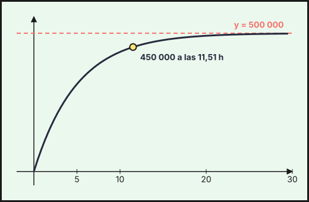
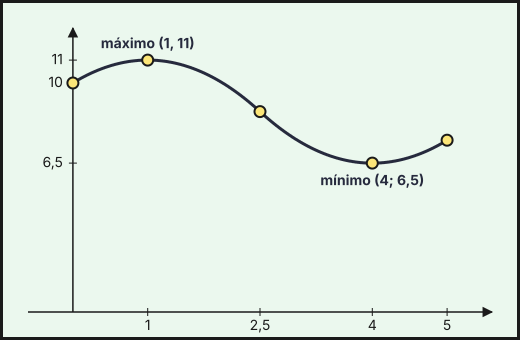
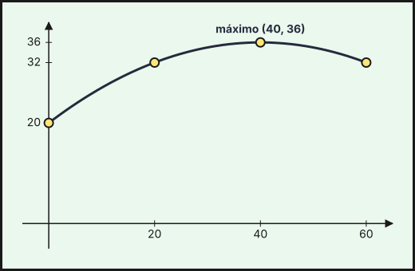
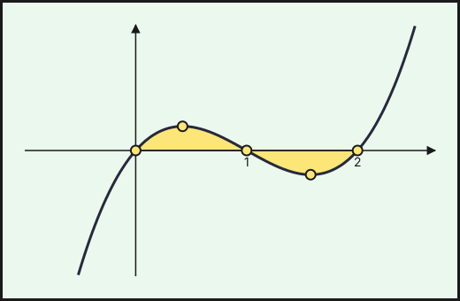
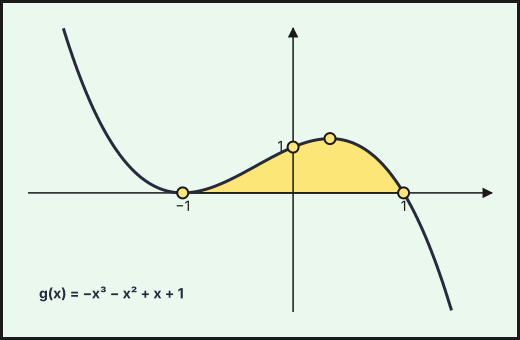
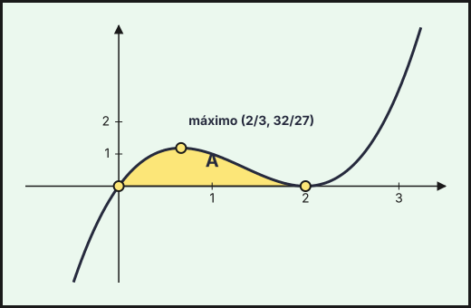
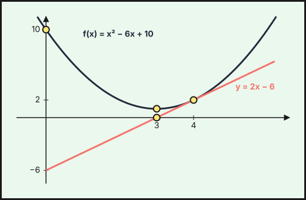
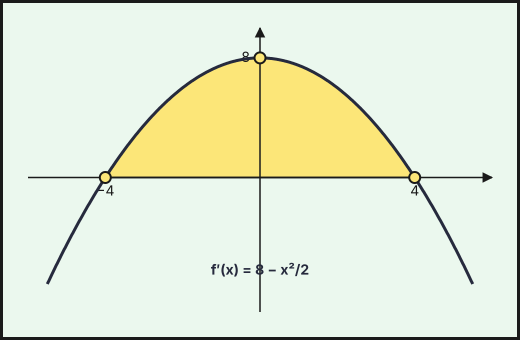

Ejercicios de **Matemáticas Aplicadas a las Ciencias Sociales II** de la prueba de acceso a la universidad en Andalucía (PAU, antes PEvAU) de **2021 a 2026** cuyo tema principal es *aplicaciones de la derivada*: **19 ejercicios** de convocatorias ordinarias y extraordinarias y de sus reservas o suplentes. Repasa antes la [teoría](../../../apuntes/2-bachillerato-ccss/07-aplicaciones-derivada/index.qmd), los [ejercicios del tema](../07-aplicaciones-derivada/index.qmd) y las [actividades interactivas](../../../actividades/2-bachillerato-ccss/07-aplicaciones-derivada/index.qmd).

Debajo de cada ejercicio hay tres desplegables, de menos a más ayuda: **Ayuda 1 · Recordatorio** (la teoría que necesitas, sin tocar los datos), **Ayuda 2 · Método** (los pasos a seguir) y la **resolución breve** con el resultado. Inténtalo con la menor ayuda posible.

## 2026

### Ordinaria · Suplente 2 2026

::::: {.ebau-ej #ebau-2026-ord-sup2-2}
**Ejercicio 2** · Ordinaria · Suplente 2 2026 · Bloque B · *(3 puntos)* · [Examen](../../../assets/pau-ccss/2026-ord-sup2/examen.pdf){target="_blank"}

El peso en kilogramos (kg) de una persona que inicia un determinado régimen alimenticio viene dado por la función:
$$P(t)=75-\frac{15t}{t+120};\qquad t\ge0$$
siendo $t$ el tiempo, en días, que lleva haciendo la dieta.

a) Compruebe que, si la persona sigue de manera continuada el régimen alimenticio, irá reduciendo peso paulatinamente. ¿Cuál es el peso mínimo que podría llegar a alcanzar si pudiera seguir la dieta indefinidamente? *(1 punto)*

b) ¿Cuántos días debe hacer de régimen para llegar a un peso de $64$ kg? *(0,75 puntos)*

c) El índice de masa corporal viene dado por la función $i(t)=\dfrac{P(t)}{h^{2}}$, siendo $h$ la estatura, en metros, de la persona. Se considera que la persona tiene sobrepeso si el índice de masa corporal es superior a $25\ \text{kg}/\text{m}^{2}$. Si la persona mide $1{,}68$ m, determine si ha tenido sobrepeso durante la dieta, y en caso afirmativo, calcule los días que han de transcurrir para dejar de tenerlo. *(1,25 puntos)*

*Relacionado también con:* [Funciones](04-funciones.qmd), [Límites y continuidad](05-limites-continuidad.qmd).

:::: {.callout-note collapse="true" appearance="simple"}
## Ayuda 1 · Recordatorio

**Continuidad.**

$f$ es continua en $a$ si $\lim_{x\to a^-}f(x)=\lim_{x\to a^+}f(x)=f(a)$. Las funciones elementales son continuas en su dominio; en una función a trozos solo hay que vigilar los puntos de cambio.

**Optimización (máximo y mínimo en un contexto).**

El óptimo de una función derivable en un intervalo se busca entre los puntos con $f'(x)=0$ y los extremos del intervalo. Se confirma el tipo con el signo de $f'$ o con $f''$.
::::

:::: {.callout-note collapse="true" appearance="simple"}
## Ayuda 2 · Método

**Continuidad.**

1. Localiza los puntos problemáticos (cambios de trozo, ceros de denominadores).
2. Calcula los dos límites laterales y $f(a)$.
3. Iguálalos: si hay parámetros, obtienes una ecuación para cada punto.
4. Concluye indicando el tipo de discontinuidad si no es continua (evitable o de salto).

**Optimización (máximo y mínimo en un contexto).**

1. Escribe la función a optimizar con una sola variable (usa la condición del enunciado para eliminar la otra).
2. Fija el dominio que tiene sentido en el contexto.
3. Resuelve $f'(x)=0$ y comprueba que es máximo o mínimo.
4. Responde con unidades y en palabras: ¿en qué valor se alcanza y cuánto vale?
::::

:::: {.callout-tip collapse="true" appearance="simple"}
## Solución

**a)** $P'(t)=-\dfrac{15(t+120)-15t}{(t+120)^2}=-\dfrac{1\,800}{(t+120)^2}<0$ para todo $t\ge0$: **el peso es decreciente, la persona va perdiendo peso.** Además, $\displaystyle\lim_{t\to+\infty}P(t)=75-15=60$.

**El peso mínimo al que podría llegar es de $60$ kg** (se acerca a él sin alcanzarlo).

**b)** $P(t)=64\iff\dfrac{15t}{t+120}=11\iff15t=11t+1\,320\iff t=330$.

**Debe hacer régimen $330$ días.**

**c)** $h^2=1{,}68^2=2{,}8224$ y $i(t)>25\iff P(t)>25\cdot2{,}8224=70{,}56$. Al inicio, $P(0)=75$ e $i(0)=\dfrac{75}{2{,}8224}=26{,}57>25$: **sí tenía sobrepeso.** Deja de tenerlo cuando $P(t)=70{,}56$:
$$75-\frac{15t}{t+120}=70{,}56\iff\frac{15t}{t+120}=4{,}44\iff10{,}56t=532{,}8\iff t=\frac{532{,}8}{10{,}56}=50{,}45.$$
**Han de transcurrir unos $50{,}45$ días** (es decir, a partir del día $51$ deja de tener sobrepeso).
::::
:::::

### Extraordinaria 2026

::::: {.ebau-ej #ebau-2026-ext-2A}
**Ejercicio 2A** · Extraordinaria 2026 · Bloque B · *(3 puntos)* · [Examen](../../../assets/pau-ccss/2026-ext/examen.pdf){target="_blank"}

Los ingresos (en miles de euros) de una empresa que opera en mercados financieros en los últimos años vienen dados por la función
$$f(t)=-t^{3}+\frac{21}{2}t^{2}-30t+80;\qquad1\le t\le6$$
siendo $t$ el tiempo medido en años.

a) Determine los intervalos de tiempo en los que los ingresos aumentaron y los intervalos en los que disminuyeron. *(0,75 puntos)*

b) Calcule los momentos en los que la empresa obtuvo el mayor y el menor ingreso, así como los valores correspondientes. *(0,75 puntos)*

c) Estudie la evolución de los ingresos de la empresa, obteniendo sus puntos de inflexión, realizando su gráfica e interpretándola. *(1,5 puntos)*

:::: {.callout-note collapse="true" appearance="simple"}
## Ayuda 1 · Recordatorio

**Curvatura y puntos de inflexión.**

$f''>0$: convexa; $f''<0$: cóncava. Punto de inflexión en $x=a$: $f''(a)=0$ y $f''$ cambia de signo.

**Optimización (máximo y mínimo en un contexto).**

El óptimo de una función derivable en un intervalo se busca entre los puntos con $f'(x)=0$ y los extremos del intervalo. Se confirma el tipo con el signo de $f'$ o con $f''$.

**Representar una función.**

Una gráfica se construye con: dominio, cortes con los ejes, asíntotas, monotonía y extremos (con $f'$), curvatura y puntos de inflexión (con $f''$), y una tabla de valores. Convexa si $f''>0$ y cóncava si $f''<0$.
::::

:::: {.callout-note collapse="true" appearance="simple"}
## Ayuda 2 · Método

**Curvatura y puntos de inflexión.**

1. Calcula $f''(x)$ y resuelve $f''(x)=0$.
2. Estudia el signo de $f''$ en los intervalos que quedan.
3. Indica los intervalos de convexidad y concavidad, y las coordenadas de los puntos de inflexión.

**Optimización (máximo y mínimo en un contexto).**

1. Escribe la función a optimizar con una sola variable (usa la condición del enunciado para eliminar la otra).
2. Fija el dominio que tiene sentido en el contexto.
3. Resuelve $f'(x)=0$ y comprueba que es máximo o mínimo.
4. Responde con unidades y en palabras: ¿en qué valor se alcanza y cuánto vale?

**Representar una función.**

1. Dominio y cortes.
2. Asíntotas verticales, horizontales y oblicuas con límites.
3. Signo de $f'$: intervalos de crecimiento y extremos.
4. Signo de $f''$ si hace falta, y unos cuantos puntos.
5. Dibuja y comprueba que la gráfica respeta todos los datos anteriores.
::::

:::: {.callout-tip collapse="true" appearance="simple"}
## Solución

**a)** $f'(t)=-3t^2+21t-30=-3(t-2)(t-5)$, que se anula en $t=2$ y $t=5$.

- $f'<0$ en $(1,2)$: **los ingresos disminuyeron.**
- $f'>0$ en $(2,5)$: **los ingresos aumentaron.**
- $f'<0$ en $(5,6)$: **los ingresos disminuyeron.**

**b)** Valores: $f(1)=59{,}5$, $f(2)=54$, $f(5)=67{,}5$ y $f(6)=62$.

**El mayor ingreso, $67{,}5$ mil euros, se obtuvo a los $5$ años; el menor, $54$ mil euros, a los $2$ años.**

**c)** $f''(t)=-6t+21=0\Rightarrow t=\dfrac{7}{2}=3{,}5$, con $f''>0$ en $(1;3{,}5)$ (convexa) y $f''<0$ en $(3{,}5;6)$ (cóncava): **punto de inflexión en $\left(\dfrac{7}{2},\dfrac{243}{4}\right)=(3{,}5;\ 60{,}75)$.**

Gráfica: parte de $(1;59{,}5)$, desciende hasta el mínimo $(2,54)$, asciende pasando por el punto de inflexión $(3{,}5;60{,}75)$ hasta el máximo $(5;67{,}5)$ y vuelve a descender hasta $(6,62)$.

**Interpretación:** tras un descenso inicial hasta el segundo año, los ingresos crecen entre los años $2$ y $5$; el crecimiento es más rápido en el punto de inflexión ($t=3{,}5$, donde $f'(3{,}5)=6{,}75$ mil euros por año es la máxima velocidad de aumento) y se frena después hasta el máximo del año $5$; desde ahí los ingresos vuelven a caer.
::::
:::::

::::: {.ebau-ej #ebau-2026-ext-2B}
**Ejercicio 2B** · Extraordinaria 2026 · Bloque B · *(3 puntos)* · [Examen](../../../assets/pau-ccss/2026-ext/examen.pdf){target="_blank"}

El coste en euros de producción de $x$ toneladas de un determinado producto en una factoría es
$$C(x)=0{,}2x^{2}+40x+5000$$
El ingreso por venta es de 150 euros por tonelada. Se vende todo lo que se produce.

a) Calcule la función $B(x)$ que expresa el beneficio obtenido al vender $x$ toneladas del producto. *(0,25 puntos)*

b) Halle la cantidad de toneladas de producto que debe venderse para maximizar el beneficio. Obtenga dicho beneficio. *(1 punto)*

c) Obtenga el beneficio cuando no hay producción y calcule para qué valores de la producción el beneficio es positivo. ¿Para qué producción se obtiene un beneficio de $4000$ €? *(1,25 puntos)*

d) Estudie cuándo los beneficios van aumentando y cuándo van disminuyendo. *(0,5 puntos)*

*Relacionado también con:* [Funciones](04-funciones.qmd).

:::: {.callout-note collapse="true" appearance="simple"}
## Ayuda 1 · Recordatorio

El óptimo de una función derivable en un intervalo se busca entre los puntos con $f'(x)=0$ y los extremos del intervalo. Se confirma el tipo con el signo de $f'$ o con $f''$.
::::

:::: {.callout-note collapse="true" appearance="simple"}
## Ayuda 2 · Método

1. Escribe la función a optimizar con una sola variable (usa la condición del enunciado para eliminar la otra).
2. Fija el dominio que tiene sentido en el contexto.
3. Resuelve $f'(x)=0$ y comprueba que es máximo o mínimo.
4. Responde con unidades y en palabras: ¿en qué valor se alcanza y cuánto vale?
::::

:::: {.callout-tip collapse="true" appearance="simple"}
## Solución

**a)** $B(x)=150x-\left(0{,}2x^2+40x+5\,000\right)=-0{,}2x^2+110x-5\,000$.

**b)** $B'(x)=-0{,}4x+110=0\Rightarrow x=275$ y $B''=-0{,}4<0$: máximo. $B(275)=-0{,}2\cdot75\,625+30\,250-5\,000=10\,125$.

**Deben venderse $275$ toneladas, con un beneficio máximo de $10\,125$ €.**

**c)** Sin producción: $B(0)=-5\,000$ (**pérdidas de $5\,000$ €**, los costes fijos). $B(x)>0\iff-0{,}2x^2+110x-5\,000>0\iff x^2-550x+25\,000<0\iff50<x<500$: **el beneficio es positivo si se producen entre $50$ y $500$ toneladas.**

$B(x)=4\,000\iff-0{,}2x^2+110x-9\,000=0\iff x^2-550x+45\,000=0\iff x=\dfrac{550\pm350}{2}$: **con $100$ o con $450$ toneladas.**

**d)** $B'(x)=-0{,}4x+110>0\iff x<275$: **los beneficios aumentan para $x<275$ toneladas y disminuyen para $x>275$.**
::::
:::::

## 2025

### Ordinaria · Modelo A 2025

::::: {.ebau-ej #ebau-2025-ord-a-2}
**Ejercicio 2** · Ordinaria · Modelo A 2025 · Bloque B · *(2,5 puntos)* · [Examen](../../../assets/pau-ccss/2025-ord-a/examen.pdf){target="_blank"}

Un periódico digital ha publicado una noticia de última hora. El número de personas que han visto la noticia $t$ horas después de su lanzamiento viene modelado por la función:
$$N(t)=500\,000\cdot\left(1-e^{-0{,}2t}\right);\quad t>0$$

a) Estudie la monotonía y curvatura de la función $N$. *(0,8 puntos)*

b) Represente gráficamente la función $N$ y describa su tendencia a lo largo del tiempo. *(0,7 puntos)*

c) ¿Cuánto tiempo ha debido de pasar para que la noticia haya sido vista por $450\,000$ personas? *(0,5 puntos)*

d) La velocidad de difusión de la noticia (número de personas por hora que han visto la publicación) es $N'(t)$. ¿Qué conclusión se obtiene al comparar $N'(t)$ en los instantes $t=1$ y $t=10$? *(0,5 puntos)*

*Relacionado también con:* [Funciones](04-funciones.qmd), [Límites y continuidad](05-limites-continuidad.qmd).

:::: {.callout-note collapse="true" appearance="simple"}
## Ayuda 1 · Recordatorio

**Monotonía y extremos relativos.**

$f'>0$ en un intervalo: creciente; $f'<0$: decreciente. Un extremo relativo en $x=a$ exige $f'(a)=0$; es mínimo si $f'$ pasa de $-$ a $+$ (o $f''(a)>0$) y máximo si pasa de $+$ a $-$ (o $f''(a)<0$).

**Curvatura y puntos de inflexión.**

$f''>0$: convexa; $f''<0$: cóncava. Punto de inflexión en $x=a$: $f''(a)=0$ y $f''$ cambia de signo.

**Representar una función.**

Una gráfica se construye con: dominio, cortes con los ejes, asíntotas, monotonía y extremos (con $f'$), curvatura y puntos de inflexión (con $f''$), y una tabla de valores. Convexa si $f''>0$ y cóncava si $f''<0$.
::::

:::: {.callout-note collapse="true" appearance="simple"}
## Ayuda 2 · Método

**Monotonía y extremos relativos.**

1. Halla el dominio y calcula $f'(x)$.
2. Resuelve $f'(x)=0$ y localiza también los puntos donde $f'$ no existe.
3. Con esos puntos divide el dominio y estudia el signo de $f'$ en cada intervalo.
4. Escribe intervalos de crecimiento y decrecimiento, y los extremos con sus coordenadas $(a,f(a))$.

**Curvatura y puntos de inflexión.**

1. Calcula $f''(x)$ y resuelve $f''(x)=0$.
2. Estudia el signo de $f''$ en los intervalos que quedan.
3. Indica los intervalos de convexidad y concavidad, y las coordenadas de los puntos de inflexión.

**Representar una función.**

1. Dominio y cortes.
2. Asíntotas verticales, horizontales y oblicuas con límites.
3. Signo de $f'$: intervalos de crecimiento y extremos.
4. Signo de $f''$ si hace falta, y unos cuantos puntos.
5. Dibuja y comprueba que la gráfica respeta todos los datos anteriores.
::::

:::: {.callout-tip collapse="true" appearance="simple"}
## Solución

**a)** $N'(t)=500\,000\cdot0{,}2\,e^{-0{,}2t}=100\,000\,e^{-0{,}2t}>0$: **$N$ es creciente.** $N''(t)=-20\,000\,e^{-0{,}2t}<0$: **$N$ es cóncava.**

**b)** $N(0)=0$ (no incluido, pues $t>0$) y $N$ crece cada vez más despacio. Como $\displaystyle\lim_{t\to+\infty}N(t)=500\,000$, la gráfica tiene la asíntota horizontal $y=500\,000$ y se acerca a ella por debajo.

{fig-alt="Curva creciente y cóncava N(t)=500000(1−e^(−0,2t)) que parte de 0 y tiende a la asíntota horizontal y=500000" width="75%" fig-align="center"}

**La noticia es vista cada vez por más personas, pero con un ritmo que decrece; el número de personas tiende a $500\,000$ sin llegar a alcanzarlo.**

**c)** $N(t)=450\,000\iff1-e^{-0{,}2t}=0{,}9\iff e^{-0{,}2t}=0{,}1\iff-0{,}2t=\ln0{,}1\iff t=\dfrac{\ln10}{0{,}2}=5\ln10\approx11{,}51$.

**Han debido pasar unas $11{,}51$ horas** (11 horas y 31 minutos).

**d)** $N'(1)=100\,000\,e^{-0{,}2}\approx81\,873$ y $N'(10)=100\,000\,e^{-2}\approx13\,534$ personas por hora.

**La velocidad de difusión disminuye con el tiempo:** a la hora la noticia la ven $\approx81\,873$ personas por hora y a las $10$ horas solo $\approx13\,534$, unas $6$ veces menos.
::::
:::::

::::: {.ebau-ej #ebau-2025-ord-a-3}
**Ejercicio 3** · Ordinaria · Modelo A 2025 · Bloque B · *(2,5 puntos)* · [Examen](../../../assets/pau-ccss/2025-ord-a/examen.pdf){target="_blank"}

A un paciente con diabetes se le monitoriza durante un día completo, suministrándole un medicamento a mediodía para observar su reacción. La función que aproxima la cantidad de glucosa en sangre (mg/dl) del paciente, en cada instante $t$ (horas), es:
$$f(t)=\begin{cases}\dfrac{5}{6}\left(\dfrac{t^{3}}{3}-12t^{2}+108t+108\right)&0\le t\le12\\t^{2}-40t+546&12<t\le24\end{cases}$$

a) Halle en qué periodos de tiempo el nivel de glucosa va aumentando. *(0,75 puntos)*

b) ¿En qué momentos del día el paciente tiene los niveles más alto y más bajo de glucosa en sangre y a cuánto ascienden? *(1 punto)*

c) ¿En qué momentos, después del mediodía, el paciente tiene $155$ mg/dl? *(0,75 puntos)*

*Relacionado también con:* [Límites y continuidad](05-limites-continuidad.qmd).

:::: {.callout-note collapse="true" appearance="simple"}
## Ayuda 1 · Recordatorio

**Monotonía y extremos relativos.**

$f'>0$ en un intervalo: creciente; $f'<0$: decreciente. Un extremo relativo en $x=a$ exige $f'(a)=0$; es mínimo si $f'$ pasa de $-$ a $+$ (o $f''(a)>0$) y máximo si pasa de $+$ a $-$ (o $f''(a)<0$).

**Optimización (máximo y mínimo en un contexto).**

El óptimo de una función derivable en un intervalo se busca entre los puntos con $f'(x)=0$ y los extremos del intervalo. Se confirma el tipo con el signo de $f'$ o con $f''$.
::::

:::: {.callout-note collapse="true" appearance="simple"}
## Ayuda 2 · Método

**Monotonía y extremos relativos.**

1. Halla el dominio y calcula $f'(x)$.
2. Resuelve $f'(x)=0$ y localiza también los puntos donde $f'$ no existe.
3. Con esos puntos divide el dominio y estudia el signo de $f'$ en cada intervalo.
4. Escribe intervalos de crecimiento y decrecimiento, y los extremos con sus coordenadas $(a,f(a))$.

**Optimización (máximo y mínimo en un contexto).**

1. Escribe la función a optimizar con una sola variable (usa la condición del enunciado para eliminar la otra).
2. Fija el dominio que tiene sentido en el contexto.
3. Resuelve $f'(x)=0$ y comprueba que es máximo o mínimo.
4. Responde con unidades y en palabras: ¿en qué valor se alcanza y cuánto vale?
::::

:::: {.callout-tip collapse="true" appearance="simple"}
## Solución

**a)** En $0\le t\le12$: $f'(t)=\dfrac{5}{6}\left(t^2-24t+108\right)=\dfrac{5}{6}(t-6)(t-18)$, con $f'>0$ en $(0,6)$ y $f'<0$ en $(6,12)$. En $12<t\le24$: $f'(t)=2t-40$, con $f'<0$ en $(12,20)$ y $f'>0$ en $(20,24)$.

**El nivel de glucosa aumenta de las $0$ a las $6$ h y de las $20$ a las $24$ h.** (Es continua en $t=12$: $f(12)=210$.)

**b)** Valores en los puntos críticos y extremos: $f(0)=90$, $f(6)=330$, $f(12)=210$, $f(20)=146$, $f(24)=162$.

**El nivel más alto, $330$ mg/dl, se da a las $6$ h; el más bajo, $90$ mg/dl, a las $0$ h (al empezar el día).** (El mínimo relativo de la tarde es $146$ mg/dl a las $20$ h.)

**c)** Después del mediodía: $t^2-40t+546=155\iff t^2-40t+391=0\iff t=\dfrac{40\pm6}{2}$.

**A las $17$ h y a las $23$ h.**
::::
:::::

### Ordinaria · Suplente 1 · Modelo A 2025

::::: {.ebau-ej #ebau-2025-ord-sup1-a-4}
**Ejercicio 4** · Ordinaria · Suplente 1 · Modelo A 2025 · Bloque B · *(2,5 puntos)* · [Examen](../../../assets/pau-ccss/2025-ord-sup1-a/examen.pdf){target="_blank"}

El nivel de concentración de un alumno universitario durante un examen viene dado por la siguiente función:
$$f(t)=\begin{cases}-t^{2}+2t+10&0\le t\le2{,}5\\t^{2}+at+b&2{,}5<t\le5\end{cases}$$
donde $t$ es el tiempo en horas y $a$ y $b$ números reales.

a) ¿Con qué nivel de concentración el alumno comienza el examen? Determine los valores de $a$ y $b$ para que la función $f$ sea continua y derivable en $t=2{,}5$. *(1,25 puntos)*

b) Para $a=-8$ y $b=22{,}5$, esboce la gráfica de la función $f$, estudiando previamente la monotonía y calculando en qué momentos se alcanzan los niveles máximo y mínimo de concentración. *(1,25 puntos)*

*Relacionado también con:* [Límites y continuidad](05-limites-continuidad.qmd), [Derivadas](06-derivadas.qmd).

:::: {.callout-note collapse="true" appearance="simple"}
## Ayuda 1 · Recordatorio

**Continuidad.**

$f$ es continua en $a$ si $\lim_{x\to a^-}f(x)=\lim_{x\to a^+}f(x)=f(a)$. Las funciones elementales son continuas en su dominio; en una función a trozos solo hay que vigilar los puntos de cambio.

**Derivabilidad.**

$f$ derivable en $a$ si es continua en $a$ y las derivadas laterales coinciden: $f'(a^-)=f'(a^+)$. Derivable implica continua, pero no al revés.

**Monotonía y extremos relativos.**

$f'>0$ en un intervalo: creciente; $f'<0$: decreciente. Un extremo relativo en $x=a$ exige $f'(a)=0$; es mínimo si $f'$ pasa de $-$ a $+$ (o $f''(a)>0$) y máximo si pasa de $+$ a $-$ (o $f''(a)<0$).

**Hallar parámetros de una función.**

Cada dato del enunciado da una ecuación: pasa por $(a,b)\Rightarrow f(a)=b$; extremo en $x=a\Rightarrow f'(a)=0$; pendiente $m$ en $x=a\Rightarrow f'(a)=m$; inflexión en $x=a\Rightarrow f''(a)=0$; área o integral dada $\Rightarrow$ igualar la integral.

**Representar una función.**

Una gráfica se construye con: dominio, cortes con los ejes, asíntotas, monotonía y extremos (con $f'$), curvatura y puntos de inflexión (con $f''$), y una tabla de valores. Convexa si $f''>0$ y cóncava si $f''<0$.
::::

:::: {.callout-note collapse="true" appearance="simple"}
## Ayuda 2 · Método

**Continuidad.**

1. Localiza los puntos problemáticos (cambios de trozo, ceros de denominadores).
2. Calcula los dos límites laterales y $f(a)$.
3. Iguálalos: si hay parámetros, obtienes una ecuación para cada punto.
4. Concluye indicando el tipo de discontinuidad si no es continua (evitable o de salto).

**Derivabilidad.**

1. Impón primero la continuidad en el punto de cambio.
2. Deriva cada trozo y evalúa en el punto, por la izquierda y por la derecha.
3. Iguala las derivadas: segunda ecuación para los parámetros.
4. Resuelve el sistema y comprueba.

**Monotonía y extremos relativos.**

1. Halla el dominio y calcula $f'(x)$.
2. Resuelve $f'(x)=0$ y localiza también los puntos donde $f'$ no existe.
3. Con esos puntos divide el dominio y estudia el signo de $f'$ en cada intervalo.
4. Escribe intervalos de crecimiento y decrecimiento, y los extremos con sus coordenadas $(a,f(a))$.

**Hallar parámetros de una función.**

1. Lista los datos y escribe una ecuación por cada uno.
2. Resuelve el sistema (suele ser lineal en los parámetros).
3. Comprueba que la función resultante cumple todo, y que el extremo es del tipo pedido.

**Representar una función.**

1. Dominio y cortes.
2. Asíntotas verticales, horizontales y oblicuas con límites.
3. Signo de $f'$: intervalos de crecimiento y extremos.
4. Signo de $f''$ si hace falta, y unos cuantos puntos.
5. Dibuja y comprueba que la gráfica respeta todos los datos anteriores.
::::

:::: {.callout-tip collapse="true" appearance="simple"}
## Solución

**a)** El nivel inicial es $f(0)=10$.

Continuidad en $t=2{,}5$: $-2{,}5^2+2\cdot2{,}5+10=8{,}75$ y $2{,}5^2+2{,}5a+b=6{,}25+2{,}5a+b$; luego $6{,}25+2{,}5a+b=8{,}75$. Derivabilidad: $f'(t)=-2t+2$ si $t<2{,}5$ y $f'(t)=2t+a$ si $t>2{,}5$; en $t=2{,}5$: $-3=5+a\Rightarrow a=-8$. Entonces $6{,}25-20+b=8{,}75\Rightarrow b=22{,}5$.

**Comienza con nivel $10$; $a=-8$ y $b=22{,}5$.**

**b)** Tramo 1: $f'(t)=-2t+2=0\Rightarrow t=1$; crece en $(0,1)$ y decrece en $(1,2{,}5)$, con $f(1)=11$. Tramo 2: $f(t)=t^2-8t+22{,}5$, $f'(t)=2t-8=0\Rightarrow t=4$; decrece en $(2{,}5;4)$ y crece en $(4,5)$, con $f(4)=6{,}5$. Valores: $f(0)=10$, $f(2{,}5)=8{,}75$, $f(5)=7{,}5$.

**Concentración máxima $11$ a la hora $t=1$ y mínima $6{,}5$ a las $4$ horas.** Gráfica: sube desde $(0,10)$ hasta el máximo $(1,11)$, baja hasta el mínimo $(4;6{,}5)$ (pasando por $(2{,}5;8{,}75)$ sin pico) y sube hasta $(5;7{,}5)$.

{fig-alt="Concentración f(t): sube de 10 a 11 en t=1, baja hasta el mínimo 6,5 en t=4 y sube a 7,5 en t=5; la gráfica es continua y suave en t=2,5" width="75%" fig-align="center"}
::::
:::::

### Ordinaria · Suplente 1 · Modelo B 2025

::::: {.ebau-ej #ebau-2025-ord-sup1-b-4}
**Ejercicio 4** · Ordinaria · Suplente 1 · Modelo B 2025 · Bloque B · *(2,5 puntos)* · [Examen](../../../assets/pau-ccss/2025-ord-sup1-b/examen.pdf){target="_blank"}

Las ventas de un producto (en miles de euros), en los 6 primeros años desde que se lanzó una campaña de publicidad, evolucionan de acuerdo con la siguiente función:
$$V(t)=4t^{3}-24t^{2}+36t+100;\qquad0\le t\le6$$
siendo $t$ el tiempo transcurrido en años.

a) Estudie el crecimiento y decrecimiento de las ventas a lo largo de los 6 años. Calcule los extremos. *(1,25 puntos)*

b) Represente gráficamente la función $V$. *(0,5 puntos)*

c) Calcule el área de la región limitada por la gráfica de $V$, la recta $t=6$ y los ejes de coordenadas. *(0,75 puntos)*

*Relacionado también con:* [Integrales](08-integrales.qmd).

:::: {.callout-note collapse="true" appearance="simple"}
## Ayuda 1 · Recordatorio

**Monotonía y extremos relativos.**

$f'>0$ en un intervalo: creciente; $f'<0$: decreciente. Un extremo relativo en $x=a$ exige $f'(a)=0$; es mínimo si $f'$ pasa de $-$ a $+$ (o $f''(a)>0$) y máximo si pasa de $+$ a $-$ (o $f''(a)<0$).

**Área de un recinto.**

Área entre $y=f(x)$ y el eje $X$: $\int_a^b|f(x)|\,dx$, partiendo en los puntos donde $f$ cambia de signo. Área entre dos curvas: $\int_a^b\left(f(x)-g(x)\right)dx$ con $f\ge g$. Los límites de integración son las abscisas de corte.

**Representar una función.**

Una gráfica se construye con: dominio, cortes con los ejes, asíntotas, monotonía y extremos (con $f'$), curvatura y puntos de inflexión (con $f''$), y una tabla de valores. Convexa si $f''>0$ y cóncava si $f''<0$.
::::

:::: {.callout-note collapse="true" appearance="simple"}
## Ayuda 2 · Método

**Monotonía y extremos relativos.**

1. Halla el dominio y calcula $f'(x)$.
2. Resuelve $f'(x)=0$ y localiza también los puntos donde $f'$ no existe.
3. Con esos puntos divide el dominio y estudia el signo de $f'$ en cada intervalo.
4. Escribe intervalos de crecimiento y decrecimiento, y los extremos con sus coordenadas $(a,f(a))$.

**Área de un recinto.**

1. Haz un esbozo del recinto.
2. Calcula los puntos de corte (resolviendo $f=g$ o $f=0$): son los límites.
3. Decide qué función va por encima en cada tramo; si se cruzan, parte la integral.
4. Aplica Barrow y da el área en $\text{u}^2$, siempre positiva.

**Representar una función.**

1. Dominio y cortes.
2. Asíntotas verticales, horizontales y oblicuas con límites.
3. Signo de $f'$: intervalos de crecimiento y extremos.
4. Signo de $f''$ si hace falta, y unos cuantos puntos.
5. Dibuja y comprueba que la gráfica respeta todos los datos anteriores.
::::

:::: {.callout-tip collapse="true" appearance="simple"}
## Solución

**a)** $V'(t)=12t^2-48t+36=12(t-1)(t-3)$.

- $V'>0$ en $(0,1)$ y en $(3,6)$: **las ventas crecen.**
- $V'<0$ en $(1,3)$: **las ventas decrecen.**

Valores: $V(0)=100$, $V(1)=116$, $V(3)=100$, $V(6)=316$. **Máximo relativo en $(1,116)$ y mínimo relativo en $(3,100)$.** En el intervalo $[0,6]$: **máximo absoluto $316$ en $t=6$ y mínimo absoluto $100$ (en $t=0$ y en $t=3$).**

**b)** Cúbica que parte de $(0,100)$, sube hasta el máximo $(1,116)$, baja hasta el mínimo $(3,100)$ y vuelve a subir hasta $(6,316)$.

**c)** $V>0$ en $[0,6]$:
$$A=\int_0^6\left(4t^3-24t^2+36t+100\right)dt=\left[t^4-8t^3+18t^2+100t\right]_0^6=1\,296-1\,728+648+600=816.$$
**$A=816$ u$^2$** (miles de euros por año).

![Ventas V(t) en [0,6]: parte de 100, máximo relativo 116 en t=1, mínimo relativo 100 en t=3 y llega a 316 en t=6; sombreada el área bajo la curva](fig/2025-ord-sup1-b-e4.svg){fig-alt="Ventas V(t) en [0,6]: parte de 100, máximo relativo 116 en t=1, mínimo relativo 100 en t=3 y llega a 316 en t=6; sombreada el área bajo la curva" width="75%" fig-align="center"}
::::
:::::

### Ordinaria · Suplente 2 · Modelo A 2025

::::: {.ebau-ej #ebau-2025-ord-sup2-a-3}
**Ejercicio 3** · Ordinaria · Suplente 2 · Modelo A 2025 · Bloque B · *(2,5 puntos)* · [Examen](../../../assets/pau-ccss/2025-ord-sup2-a/examen.pdf){target="_blank"}

a) El índice de audiencia de un programa de radio se puede modelizar por una función del tipo:
$$f(t)=at^{2}+bt+c,\qquad t\in[0,60]$$
donde $t$ es el tiempo medido en minutos y $a,b,c\in\mathbb R$. Se sabe que cuando comienza el programa el índice de audiencia es 20 puntos y que a los 40 minutos se alcanza el máximo índice de audiencia, que es 36 puntos. Determine $a,b$ y $c$ y represente gráficamente la función obtenida. *(1,5 puntos)*

b) Calcule la derivada de las siguientes funciones: *(1 punto)*

$$g(x)=\ln\left(\frac{x^{2}-1}{x^{2}+1}\right)\qquad\qquad h(x)=(2x-1)\,e^{x^{2}-x}$$

*Relacionado también con:* [Funciones](04-funciones.qmd), [Derivadas](06-derivadas.qmd).

:::: {.callout-note collapse="true" appearance="simple"}
## Ayuda 1 · Recordatorio

**Optimización (máximo y mínimo en un contexto).**

El óptimo de una función derivable en un intervalo se busca entre los puntos con $f'(x)=0$ y los extremos del intervalo. Se confirma el tipo con el signo de $f'$ o con $f''$.

**Representar una función.**

Una gráfica se construye con: dominio, cortes con los ejes, asíntotas, monotonía y extremos (con $f'$), curvatura y puntos de inflexión (con $f''$), y una tabla de valores. Convexa si $f''>0$ y cóncava si $f''<0$.
::::

:::: {.callout-note collapse="true" appearance="simple"}
## Ayuda 2 · Método

**Optimización (máximo y mínimo en un contexto).**

1. Escribe la función a optimizar con una sola variable (usa la condición del enunciado para eliminar la otra).
2. Fija el dominio que tiene sentido en el contexto.
3. Resuelve $f'(x)=0$ y comprueba que es máximo o mínimo.
4. Responde con unidades y en palabras: ¿en qué valor se alcanza y cuánto vale?

**Representar una función.**

1. Dominio y cortes.
2. Asíntotas verticales, horizontales y oblicuas con límites.
3. Signo de $f'$: intervalos de crecimiento y extremos.
4. Signo de $f''$ si hace falta, y unos cuantos puntos.
5. Dibuja y comprueba que la gráfica respeta todos los datos anteriores.
::::

:::: {.callout-tip collapse="true" appearance="simple"}
## Solución

**a)** $f(0)=c=20$. El máximo en $t=40$ exige $f'(40)=2a\cdot40+b=0\Rightarrow b=-80a$, y $f(40)=1\,600a+40b+c=36$: $1\,600a-3\,200a+20=36\Rightarrow-1\,600a=16\Rightarrow a=-0{,}01$ y $b=0{,}8$.

**$a=-0{,}01$, $b=0{,}8$, $c=20$:** $f(t)=-0{,}01t^2+0{,}8t+20$.

Gráfica: arco de parábola abierta hacia abajo que parte de $(0,20)$, crece hasta el máximo $(40,36)$ y decrece hasta $(60,32)$ (pasa por $(20,32)$, simétrico de $(60,32)$ respecto de $t=40$).

{fig-alt="Índice de audiencia f(t)=−0,01t²+0,8t+20: parte de 20, alcanza el máximo 36 a los 40 minutos y baja a 32 en t=60" width="75%" fig-align="center"}

**b)** $g'(x)=\dfrac{2x}{x^2-1}-\dfrac{2x}{x^2+1}=\dfrac{2x\left(x^2+1\right)-2x\left(x^2-1\right)}{x^4-1}=\dfrac{4x}{x^4-1}$.

$h'(x)=2e^{x^2-x}+(2x-1)(2x-1)e^{x^2-x}=e^{x^2-x}\left[(2x-1)^2+2\right]=e^{x^2-x}\left(4x^2-4x+3\right)$.
::::
:::::

## 2023

### Ordinaria · Modelo A 2023

::::: {.ebau-ej #ebau-2023-ord-a-3}
**Ejercicio 3** · Ordinaria · Modelo A 2023 · Bloque B · *(2,5 puntos)* · [Examen](../../../assets/pau-ccss/2023-ord-a/examen.pdf){target="_blank"}

Se considera la función $f(x)=x^{3}-3x^{2}+2x$.

a) Halle los puntos de corte con los ejes, los intervalos de crecimiento y decrecimiento, los extremos relativos de $f$ y su curvatura. *(1 punto)*

b) Represente gráficamente la función $f$. *(0,5 puntos)*

c) Calcule el área del recinto acotado, limitado por la gráfica de $f$ y el eje de abscisas. *(1 punto)*

*Relacionado también con:* [Funciones](04-funciones.qmd), [Integrales](08-integrales.qmd).

:::: {.callout-note collapse="true" appearance="simple"}
## Ayuda 1 · Recordatorio

**Monotonía y extremos relativos.**

$f'>0$ en un intervalo: creciente; $f'<0$: decreciente. Un extremo relativo en $x=a$ exige $f'(a)=0$; es mínimo si $f'$ pasa de $-$ a $+$ (o $f''(a)>0$) y máximo si pasa de $+$ a $-$ (o $f''(a)<0$).

**Curvatura y puntos de inflexión.**

$f''>0$: convexa; $f''<0$: cóncava. Punto de inflexión en $x=a$: $f''(a)=0$ y $f''$ cambia de signo.

**Dominio, cortes y simetrías.**

Dominio: excluye los puntos donde se anula un denominador, el radicando de una raíz de índice par es negativo o el argumento de un logaritmo no es positivo. Cortes: con el eje $X$ se resuelve $f(x)=0$; con el eje $Y$ se calcula $f(0)$.

**Área de un recinto.**

Área entre $y=f(x)$ y el eje $X$: $\int_a^b|f(x)|\,dx$, partiendo en los puntos donde $f$ cambia de signo. Área entre dos curvas: $\int_a^b\left(f(x)-g(x)\right)dx$ con $f\ge g$. Los límites de integración son las abscisas de corte.

**Representar una función.**

Una gráfica se construye con: dominio, cortes con los ejes, asíntotas, monotonía y extremos (con $f'$), curvatura y puntos de inflexión (con $f''$), y una tabla de valores. Convexa si $f''>0$ y cóncava si $f''<0$.
::::

:::: {.callout-note collapse="true" appearance="simple"}
## Ayuda 2 · Método

**Monotonía y extremos relativos.**

1. Halla el dominio y calcula $f'(x)$.
2. Resuelve $f'(x)=0$ y localiza también los puntos donde $f'$ no existe.
3. Con esos puntos divide el dominio y estudia el signo de $f'$ en cada intervalo.
4. Escribe intervalos de crecimiento y decrecimiento, y los extremos con sus coordenadas $(a,f(a))$.

**Curvatura y puntos de inflexión.**

1. Calcula $f''(x)$ y resuelve $f''(x)=0$.
2. Estudia el signo de $f''$ en los intervalos que quedan.
3. Indica los intervalos de convexidad y concavidad, y las coordenadas de los puntos de inflexión.

**Dominio, cortes y simetrías.**

1. Halla el dominio y escríbelo como unión de intervalos.
2. Calcula los cortes con los ejes.
3. Estudia el signo de $f$ entre los puntos que anulan $f$ o su denominador.

**Área de un recinto.**

1. Haz un esbozo del recinto.
2. Calcula los puntos de corte (resolviendo $f=g$ o $f=0$): son los límites.
3. Decide qué función va por encima en cada tramo; si se cruzan, parte la integral.
4. Aplica Barrow y da el área en $\text{u}^2$, siempre positiva.

**Representar una función.**

1. Dominio y cortes.
2. Asíntotas verticales, horizontales y oblicuas con límites.
3. Signo de $f'$: intervalos de crecimiento y extremos.
4. Signo de $f''$ si hace falta, y unos cuantos puntos.
5. Dibuja y comprueba que la gráfica respeta todos los datos anteriores.
::::

:::: {.callout-tip collapse="true" appearance="simple"}
## Solución

$f(x)=x(x-1)(x-2)$.

**a)** Cortes: con $OY$ en $(0,0)$; con $OX$ en $(0,0)$, $(1,0)$ y $(2,0)$. $f'(x)=3x^2-6x+2=0\Rightarrow x=1\pm\dfrac{\sqrt3}{3}$.

- $f'>0$ en $\left(-\infty,1-\frac{\sqrt3}{3}\right)$ y en $\left(1+\frac{\sqrt3}{3},+\infty\right)$: **crece**.
- $f'<0$ en $\left(1-\frac{\sqrt3}{3},1+\frac{\sqrt3}{3}\right)$: **decrece**.

**Máximo relativo en $\left(1-\dfrac{\sqrt3}{3},\dfrac{2\sqrt3}{9}\right)$ y mínimo relativo en $\left(1+\dfrac{\sqrt3}{3},-\dfrac{2\sqrt3}{9}\right)$.** Curvatura: $f''(x)=6x-6$; **cóncava en $(-\infty,1)$ ($f''<0$) y convexa en $(1,+\infty)$ ($f''>0$)**, con punto de inflexión en $(1,0)$.

**b)** Cúbica que viene de $-\infty$, corta al eje en $(0,0)$, sube hasta el máximo ($\approx(0{,}42;\,0{,}38)$), baja pasando por $(1,0)$ (punto de inflexión) hasta el mínimo ($\approx(1{,}58;\,-0{,}38)$), y vuelve a subir cortando el eje en $(2,0)$ hacia $+\infty$.

**c)** Entre $0$ y $1$, $f\ge0$; entre $1$ y $2$, $f\le0$:
$$\int_0^1f=\left[\frac{x^4}{4}-x^3+x^2\right]_0^1=\frac{1}{4},\qquad\int_1^2f=-\frac{1}{4}.$$
$$A=\frac{1}{4}+\left|-\frac{1}{4}\right|=\frac{1}{2}.$$
**$A=\dfrac{1}{2}\ \text{u}^2$**

{fig-alt="Gráfica de f(x)=x³−3x²+2x: cortes en x=0, 1, 2, máximo en x=1−√3/3 y mínimo en x=1+√3/3; recinto sombreado entre la curva y el eje X de 0 a 2" width="75%" fig-align="center"}
::::
:::::

::::: {.ebau-ej #ebau-2023-ord-a-4}
**Ejercicio 4** · Ordinaria · Modelo A 2023 · Bloque B · *(2,5 puntos)* · [Examen](../../../assets/pau-ccss/2023-ord-a/examen.pdf){target="_blank"}

Se desea analizar el valor de las acciones de una empresa en un día. La función $v(t)$ nos indica el valor, en euros, de cada acción de la empresa en función del tiempo $t$, medido en horas, a partir de la hora de apertura del mercado. De la función $v(t)$ se conoce que su variación instantánea es
$$v'(t)=t^{2}-5t+6,\qquad t\in[0,6]$$

a) Determine los intervalos de crecimiento y decrecimiento de la función $v$. *(0,75 puntos)*

b) Si en el momento de la apertura del mercado se conoce que $v(0)=10$, halle la función $v$. *(0,75 puntos)*

c) Si un inversor compró $3000$ de estas acciones en el instante $t=2$ y posteriormente las vendió en el instante $t=4$, indique a cuánto ascendió la ganancia o la pérdida que obtuvo el inversor con esta gestión. *(0,5 puntos)*

d) ¿En qué momentos debería haber realizado este inversor las gestiones de compra y de venta para que la ganancia hubiese sido máxima? Justifique su respuesta. *(0,5 puntos)*

*Relacionado también con:* [Integrales](08-integrales.qmd).

:::: {.callout-note collapse="true" appearance="simple"}
## Ayuda 1 · Recordatorio

**Monotonía y extremos relativos.**

$f'>0$ en un intervalo: creciente; $f'<0$: decreciente. Un extremo relativo en $x=a$ exige $f'(a)=0$; es mínimo si $f'$ pasa de $-$ a $+$ (o $f''(a)>0$) y máximo si pasa de $+$ a $-$ (o $f''(a)<0$).

**Hallar parámetros de una función.**

Cada dato del enunciado da una ecuación: pasa por $(a,b)\Rightarrow f(a)=b$; extremo en $x=a\Rightarrow f'(a)=0$; pendiente $m$ en $x=a\Rightarrow f'(a)=m$; inflexión en $x=a\Rightarrow f''(a)=0$; área o integral dada $\Rightarrow$ igualar la integral.
::::

:::: {.callout-note collapse="true" appearance="simple"}
## Ayuda 2 · Método

**Monotonía y extremos relativos.**

1. Halla el dominio y calcula $f'(x)$.
2. Resuelve $f'(x)=0$ y localiza también los puntos donde $f'$ no existe.
3. Con esos puntos divide el dominio y estudia el signo de $f'$ en cada intervalo.
4. Escribe intervalos de crecimiento y decrecimiento, y los extremos con sus coordenadas $(a,f(a))$.

**Hallar parámetros de una función.**

1. Lista los datos y escribe una ecuación por cada uno.
2. Resuelve el sistema (suele ser lineal en los parámetros).
3. Comprueba que la función resultante cumple todo, y que el extremo es del tipo pedido.
::::

:::: {.callout-tip collapse="true" appearance="simple"}
## Solución

**a)** $v'(t)=t^2-5t+6=(t-2)(t-3)$. **$v$ crece en $(0,2)\cup(3,6)$ y decrece en $(2,3)$.**

**b)** $v(t)=\displaystyle\int\left(t^2-5t+6\right)dt=\frac{t^3}{3}-\frac{5t^2}{2}+6t+K$ y $v(0)=10$, así que $K=10$.

**$v(t)=\dfrac{t^3}{3}-\dfrac{5t^2}{2}+6t+10$.**

**c)** $v(2)=\dfrac{8}{3}-10+12+10=\dfrac{44}{3}$ y $v(4)=\dfrac{64}{3}-40+24+10=\dfrac{46}{3}$. Ganancia por acción: $\dfrac{46}{3}-\dfrac{44}{3}=\dfrac{2}{3}$ €. Con $3000$ acciones: $3000\cdot\dfrac{2}{3}=2000$.

**Ganó $2\,000$ €.**

**d)** Valores en los puntos críticos y extremos: $v(0)=10$, $v(2)=\dfrac{44}{3}\approx14{,}67$, $v(3)=\dfrac{29}{2}=14{,}5$, $v(6)=28$. La ganancia por acción es $v(t_2)-v(t_1)$ con $t_1<t_2$, y se hace máxima comprando en el mínimo y vendiendo en el máximo posteriores: $v(6)-v(0)=18$ €, mayor que cualquier otra combinación (por ejemplo, $v(6)-v(3)=13{,}5$).

**Debería haber comprado en la apertura ($t=0$) y vendido al final ($t=6$), con una ganancia de $18$ € por acción.**
::::
:::::

### Ordinaria · Suplente · Modelo B 2023

::::: {.ebau-ej #ebau-2023-ord-sup-b-4}
**Ejercicio 4** · Ordinaria · Suplente · Modelo B 2023 · Bloque B · *(2,5 puntos)* · [Examen](../../../assets/pau-ccss/2023-ord-sup-b/examen.pdf){target="_blank"}

La función $B(t)=-t^{2}+21t-20$ con $0\le t\le15$ representa el beneficio, en miles de euros, de una empresa en función de los años, $t$.

a) Si la función $I(t)=-t^{2}+48t$ representa los ingresos de esta empresa, en miles de euros, para el mismo intervalo de tiempo, ¿cuál es la función de gastos de dicha empresa? ¿Cuáles son los gastos iniciales? *(0,5 puntos)*

b) Calcule el momento a partir del cual el beneficio fue positivo. *(0,5 puntos)*

c) Calcule en qué momento el beneficio fue máximo y el valor del mismo. *(0,75 puntos)*

d) Represente gráficamente la función beneficio. *(0,75 puntos)*

*Relacionado también con:* [Funciones](04-funciones.qmd).

:::: {.callout-note collapse="true" appearance="simple"}
## Ayuda 1 · Recordatorio

**Optimización (máximo y mínimo en un contexto).**

El óptimo de una función derivable en un intervalo se busca entre los puntos con $f'(x)=0$ y los extremos del intervalo. Se confirma el tipo con el signo de $f'$ o con $f''$.

**Representar una función.**

Una gráfica se construye con: dominio, cortes con los ejes, asíntotas, monotonía y extremos (con $f'$), curvatura y puntos de inflexión (con $f''$), y una tabla de valores. Convexa si $f''>0$ y cóncava si $f''<0$.
::::

:::: {.callout-note collapse="true" appearance="simple"}
## Ayuda 2 · Método

**Optimización (máximo y mínimo en un contexto).**

1. Escribe la función a optimizar con una sola variable (usa la condición del enunciado para eliminar la otra).
2. Fija el dominio que tiene sentido en el contexto.
3. Resuelve $f'(x)=0$ y comprueba que es máximo o mínimo.
4. Responde con unidades y en palabras: ¿en qué valor se alcanza y cuánto vale?

**Representar una función.**

1. Dominio y cortes.
2. Asíntotas verticales, horizontales y oblicuas con límites.
3. Signo de $f'$: intervalos de crecimiento y extremos.
4. Signo de $f''$ si hace falta, y unos cuantos puntos.
5. Dibuja y comprueba que la gráfica respeta todos los datos anteriores.
::::

:::: {.callout-tip collapse="true" appearance="simple"}
## Solución

**a)** Beneficio $=$ ingresos $-$ gastos, luego $G(t)=I(t)-B(t)=-t^2+48t-\left(-t^2+21t-20\right)=27t+20$.

**La función de gastos es $G(t)=27t+20$ y los gastos iniciales son $G(0)=20$ mil euros ($20\,000$ €).**

**b)** $B(t)=-(t-1)(t-20)>0\iff1<t<20$. En el intervalo $[0,15]$: **el beneficio es positivo a partir del año $1$** ($t>1$).

**c)** $B'(t)=-2t+21=0\Rightarrow t=10{,}5$ y $B''<0$: máximo. $B(10{,}5)=-110{,}25+220{,}5-20=90{,}25$.

**El beneficio máximo se alcanza a los $10{,}5$ años y vale $90{,}25$ mil euros ($90\,250$ €).**

**d)** Parábola abierta hacia abajo con vértice $(10{,}5;\ 90{,}25)$, que arranca en $(0,-20)$, corta al eje $OX$ en $t=1$ y llega a $t=15$ con $B(15)=70$.

![Parábola de beneficio B(t)=−t²+21t−20 en [0,15]: parte de −20, corta al eje en t=1, alcanza el máximo 90,25 en t=10,5 y llega a 70 en t=15](fig/2023-ord-sup-b-e4.svg){fig-alt="Parábola de beneficio B(t)=−t²+21t−20 en [0,15]: parte de −20, corta al eje en t=1, alcanza el máximo 90,25 en t=10,5 y llega a 70 en t=15" width="75%" fig-align="center"}
::::
:::::

## 2022

### Ordinaria 2022

::::: {.ebau-ej #ebau-2022-ord-3}
**Ejercicio 3** · Ordinaria 2022 · Bloque B · *(2,5 puntos)* · [Examen](../../../assets/pau-ccss/2022-ord/examen.pdf){target="_blank"}

a) Se considera la función $f(x)=x^{3}+ax^{2}+bx+c$, con $a,b$ y $c$ números reales. Calcule los valores $a,b$ y $c$, sabiendo que la gráfica de $f$ posee un extremo relativo en el punto de abscisa $x=3$ y que la pendiente de la recta tangente a la gráfica de $f$ en el punto $P(0,18)$ es $-3$. *(1,25 puntos)*

b) Calcule el área del recinto acotado, limitado por la gráfica de la función $g(x)=x^{3}-4x^{2}-3x+18$ y el eje de abscisas. *(1,25 puntos)*

*Relacionado también con:* [Derivadas](06-derivadas.qmd), [Integrales](08-integrales.qmd).

:::: {.callout-note collapse="true" appearance="simple"}
## Ayuda 1 · Recordatorio

**Recta tangente.**

Tangente a la gráfica de $f$ en $x=a$: $y-f(a)=f'(a)\,(x-a)$. La pendiente es $f'(a)$. Tangente horizontal: $f'(a)=0$. Rectas paralelas tienen la misma pendiente; perpendiculares, $m\cdot m'=-1$.

**Monotonía y extremos relativos.**

$f'>0$ en un intervalo: creciente; $f'<0$: decreciente. Un extremo relativo en $x=a$ exige $f'(a)=0$; es mínimo si $f'$ pasa de $-$ a $+$ (o $f''(a)>0$) y máximo si pasa de $+$ a $-$ (o $f''(a)<0$).

**Hallar parámetros de una función.**

Cada dato del enunciado da una ecuación: pasa por $(a,b)\Rightarrow f(a)=b$; extremo en $x=a\Rightarrow f'(a)=0$; pendiente $m$ en $x=a\Rightarrow f'(a)=m$; inflexión en $x=a\Rightarrow f''(a)=0$; área o integral dada $\Rightarrow$ igualar la integral.

**Área de un recinto.**

Área entre $y=f(x)$ y el eje $X$: $\int_a^b|f(x)|\,dx$, partiendo en los puntos donde $f$ cambia de signo. Área entre dos curvas: $\int_a^b\left(f(x)-g(x)\right)dx$ con $f\ge g$. Los límites de integración son las abscisas de corte.

**Representar una función.**

Una gráfica se construye con: dominio, cortes con los ejes, asíntotas, monotonía y extremos (con $f'$), curvatura y puntos de inflexión (con $f''$), y una tabla de valores. Convexa si $f''>0$ y cóncava si $f''<0$.
::::

:::: {.callout-note collapse="true" appearance="simple"}
## Ayuda 2 · Método

**Recta tangente.**

1. Calcula $f(a)$ (el punto) y $f'(x)$.
2. Evalúa $f'(a)$ (la pendiente).
3. Sustituye en la ecuación punto-pendiente.
4. Si el punto no es dato, obtén $a$ de la condición del enunciado (pendiente dada, tangente horizontal…).

**Monotonía y extremos relativos.**

1. Halla el dominio y calcula $f'(x)$.
2. Resuelve $f'(x)=0$ y localiza también los puntos donde $f'$ no existe.
3. Con esos puntos divide el dominio y estudia el signo de $f'$ en cada intervalo.
4. Escribe intervalos de crecimiento y decrecimiento, y los extremos con sus coordenadas $(a,f(a))$.

**Hallar parámetros de una función.**

1. Lista los datos y escribe una ecuación por cada uno.
2. Resuelve el sistema (suele ser lineal en los parámetros).
3. Comprueba que la función resultante cumple todo, y que el extremo es del tipo pedido.

**Área de un recinto.**

1. Haz un esbozo del recinto.
2. Calcula los puntos de corte (resolviendo $f=g$ o $f=0$): son los límites.
3. Decide qué función va por encima en cada tramo; si se cruzan, parte la integral.
4. Aplica Barrow y da el área en $\text{u}^2$, siempre positiva.

**Representar una función.**

1. Dominio y cortes.
2. Asíntotas verticales, horizontales y oblicuas con límites.
3. Signo de $f'$: intervalos de crecimiento y extremos.
4. Signo de $f''$ si hace falta, y unos cuantos puntos.
5. Dibuja y comprueba que la gráfica respeta todos los datos anteriores.
::::

:::: {.callout-tip collapse="true" appearance="simple"}
## Solución

**a)** $f'(x)=3x^2+2ax+b$. $f(0)=c=18$; la pendiente en $P$ es $f'(0)=b=-3$; el extremo en $x=3$: $f'(3)=27+6a+b=0\Rightarrow27+6a-3=0\Rightarrow a=-4$.

**$a=-4$, $b=-3$, $c=18$**, es decir, $f(x)=x^3-4x^2-3x+18$ (que es la función $g$ del apartado siguiente).

**b)** $g(x)=(x-3)^2(x+2)$ se anula en $x=-2$ y $x=3$ (doble), y $g\ge0$ en $[-2,3]$:
$$A=\int_{-2}^{3}\left(x^3-4x^2-3x+18\right)dx=\left[\frac{x^4}{4}-\frac{4x^3}{3}-\frac{3x^2}{2}+18x\right]_{-2}^{3}=\frac{99}{4}-\left(-\frac{82}{3}\right)=\frac{625}{12}.$$
**$A=\dfrac{625}{12}\ \text{u}^2\approx52{,}08\ \text{u}^2$**
::::
:::::

### Ordinaria · Suplente 2022

::::: {.ebau-ej #ebau-2022-ord-sup-3}
**Ejercicio 3** · Ordinaria · Suplente 2022 · Bloque B · *(2,5 puntos)* · [Examen](../../../assets/pau-ccss/2022-ord-sup/examen.pdf){target="_blank"}

Una empresa de fumigación sabe que los beneficios, en miles de euros, que obtiene en función de las hectáreas que le encargan fumigar mensualmente viene dada por la expresión
$$B(x)=-x^{2}+16x-48$$
Además, por problemas de personal, la empresa no puede fumigar más de 10 hectáreas al mes.

a) ¿Cuántas hectáreas tiene que fumigar al mes para que la empresa tenga beneficios? *(0,75 puntos)*

b) ¿Cuántas hectáreas tiene que fumigar para obtener el máximo beneficio mensual? ¿A cuánto asciende dicho beneficio? *(0,75 puntos)*

c) Si un mes ha obtenido un beneficio de 7000 €, ¿cuántas hectáreas ha fumigado? *(1 punto)*

*Relacionado también con:* [Funciones](04-funciones.qmd).

:::: {.callout-note collapse="true" appearance="simple"}
## Ayuda 1 · Recordatorio

**Optimización (máximo y mínimo en un contexto).**

El óptimo de una función derivable en un intervalo se busca entre los puntos con $f'(x)=0$ y los extremos del intervalo. Se confirma el tipo con el signo de $f'$ o con $f''$.

**Área de un recinto.**

Área entre $y=f(x)$ y el eje $X$: $\int_a^b|f(x)|\,dx$, partiendo en los puntos donde $f$ cambia de signo. Área entre dos curvas: $\int_a^b\left(f(x)-g(x)\right)dx$ con $f\ge g$. Los límites de integración son las abscisas de corte.
::::

:::: {.callout-note collapse="true" appearance="simple"}
## Ayuda 2 · Método

**Optimización (máximo y mínimo en un contexto).**

1. Escribe la función a optimizar con una sola variable (usa la condición del enunciado para eliminar la otra).
2. Fija el dominio que tiene sentido en el contexto.
3. Resuelve $f'(x)=0$ y comprueba que es máximo o mínimo.
4. Responde con unidades y en palabras: ¿en qué valor se alcanza y cuánto vale?

**Área de un recinto.**

1. Haz un esbozo del recinto.
2. Calcula los puntos de corte (resolviendo $f=g$ o $f=0$): son los límites.
3. Decide qué función va por encima en cada tramo; si se cruzan, parte la integral.
4. Aplica Barrow y da el área en $\text{u}^2$, siempre positiva.
::::

:::: {.callout-tip collapse="true" appearance="simple"}
## Solución

**a)** $B(x)=-(x-4)(x-12)>0\iff4<x<12$. Con $x\le10$: **hay beneficios si fumiga más de 4 y hasta 10 hectáreas** ($4<x\le10$).

**b)** $B'(x)=-2x+16=0\Rightarrow x=8$ y $B''<0$: máximo. $B(8)=-64+128-48=16$. **Debe fumigar 8 hectáreas y el beneficio máximo es de 16 mil euros ($16\,000$ €).**

**c)** $B(x)=7\iff-x^2+16x-48=7\iff x^2-16x+55=0\iff x=5$ o $x=11$. Como $x\le10$, **ha fumigado 5 hectáreas.**
::::
:::::

### Extraordinaria 2022

::::: {.ebau-ej #ebau-2022-ext-3}
**Ejercicio 3** · Extraordinaria 2022 · Bloque B · *(2,5 puntos)* · [Examen](../../../assets/pau-ccss/2022-ext/examen.pdf){target="_blank"}

a) Se considera la función $f(x)=x^{3}+bx^{2}+cx-1$ donde $b$ y $c$ son números reales. Determine el valor de $b$ y $c$ para que la función $f$ presente un extremo en el punto de abscisa $x=\dfrac{1}{3}$ y además la gráfica de la función $f$ pase por el punto $(-2,-3)$. *(1 punto)*

b) Dada la función $g(x)=-x^{3}-x^{2}+x+1$, realice el esbozo de su gráfica, estudiando los puntos de corte con los ejes coordenados y su monotonía. Determine el área del recinto acotado, limitado por la gráfica de la función $g$ y el eje de abscisas. *(1,5 puntos)*

*Relacionado también con:* [Funciones](04-funciones.qmd), [Integrales](08-integrales.qmd).

:::: {.callout-note collapse="true" appearance="simple"}
## Ayuda 1 · Recordatorio

**Monotonía y extremos relativos.**

$f'>0$ en un intervalo: creciente; $f'<0$: decreciente. Un extremo relativo en $x=a$ exige $f'(a)=0$; es mínimo si $f'$ pasa de $-$ a $+$ (o $f''(a)>0$) y máximo si pasa de $+$ a $-$ (o $f''(a)<0$).

**Dominio, cortes y simetrías.**

Dominio: excluye los puntos donde se anula un denominador, el radicando de una raíz de índice par es negativo o el argumento de un logaritmo no es positivo. Cortes: con el eje $X$ se resuelve $f(x)=0$; con el eje $Y$ se calcula $f(0)$.

**Hallar parámetros de una función.**

Cada dato del enunciado da una ecuación: pasa por $(a,b)\Rightarrow f(a)=b$; extremo en $x=a\Rightarrow f'(a)=0$; pendiente $m$ en $x=a\Rightarrow f'(a)=m$; inflexión en $x=a\Rightarrow f''(a)=0$; área o integral dada $\Rightarrow$ igualar la integral.

**Área de un recinto.**

Área entre $y=f(x)$ y el eje $X$: $\int_a^b|f(x)|\,dx$, partiendo en los puntos donde $f$ cambia de signo. Área entre dos curvas: $\int_a^b\left(f(x)-g(x)\right)dx$ con $f\ge g$. Los límites de integración son las abscisas de corte.

**Representar una función.**

Una gráfica se construye con: dominio, cortes con los ejes, asíntotas, monotonía y extremos (con $f'$), curvatura y puntos de inflexión (con $f''$), y una tabla de valores. Convexa si $f''>0$ y cóncava si $f''<0$.
::::

:::: {.callout-note collapse="true" appearance="simple"}
## Ayuda 2 · Método

**Monotonía y extremos relativos.**

1. Halla el dominio y calcula $f'(x)$.
2. Resuelve $f'(x)=0$ y localiza también los puntos donde $f'$ no existe.
3. Con esos puntos divide el dominio y estudia el signo de $f'$ en cada intervalo.
4. Escribe intervalos de crecimiento y decrecimiento, y los extremos con sus coordenadas $(a,f(a))$.

**Dominio, cortes y simetrías.**

1. Halla el dominio y escríbelo como unión de intervalos.
2. Calcula los cortes con los ejes.
3. Estudia el signo de $f$ entre los puntos que anulan $f$ o su denominador.

**Hallar parámetros de una función.**

1. Lista los datos y escribe una ecuación por cada uno.
2. Resuelve el sistema (suele ser lineal en los parámetros).
3. Comprueba que la función resultante cumple todo, y que el extremo es del tipo pedido.

**Área de un recinto.**

1. Haz un esbozo del recinto.
2. Calcula los puntos de corte (resolviendo $f=g$ o $f=0$): son los límites.
3. Decide qué función va por encima en cada tramo; si se cruzan, parte la integral.
4. Aplica Barrow y da el área en $\text{u}^2$, siempre positiva.

**Representar una función.**

1. Dominio y cortes.
2. Asíntotas verticales, horizontales y oblicuas con límites.
3. Signo de $f'$: intervalos de crecimiento y extremos.
4. Signo de $f''$ si hace falta, y unos cuantos puntos.
5. Dibuja y comprueba que la gráfica respeta todos los datos anteriores.
::::

:::: {.callout-tip collapse="true" appearance="simple"}
## Solución

**a)** $f'(x)=3x^2+2bx+c$. Extremo en $x=\dfrac{1}{3}$: $f'\left(\dfrac{1}{3}\right)=\dfrac{1}{3}+\dfrac{2b}{3}+c=0$. Pasa por $(-2,-3)$: $-8+4b-2c-1=-3\Rightarrow2b-c=3$. Sumando $c=-\dfrac{1}{3}-\dfrac{2b}{3}$ en la segunda: $2b+\dfrac{1}{3}+\dfrac{2b}{3}=3$, es decir, $\dfrac{8b}{3}=\dfrac{8}{3}$.

**$b=1$ y $c=-1$.**

**b)** $g(x)=-(x-1)(x+1)^2$. Cortes: con $OX$ en $x=-1$ (doble, tangente al eje) y $x=1$; con $OY$ en $(0,1)$. $g'(x)=-3x^2-2x+1=-(3x-1)(x+1)$:

- $g'<0$ en $(-\infty,-1)$: decrece.
- $g'>0$ en $\left(-1,\dfrac{1}{3}\right)$: crece.
- $g'<0$ en $\left(\dfrac{1}{3},+\infty\right)$: decrece.

Mínimo relativo en $(-1,0)$ y máximo relativo en $\left(\dfrac{1}{3},\dfrac{32}{27}\right)$. La gráfica viene de $+\infty$, toca el eje en $(-1,0)$, sube hasta el máximo, pasa por $(0,1)$ y cruza el eje en $(1,0)$ hacia $-\infty$.

{fig-alt="Gráfica de g(x)=−x³−x²+x+1: tangente al eje X en (−1,0), máximo en (1/3, 32/27) y corte con el eje X en (1,0); recinto sombreado entre x=−1 y x=1" width="75%" fig-align="center"}

El recinto acotado va de $x=-1$ a $x=1$, con $g\ge0$:
$$A=\int_{-1}^{1}\left(-x^3-x^2+x+1\right)dx=\left[-\frac{x^4}{4}-\frac{x^3}{3}+\frac{x^2}{2}+x\right]_{-1}^{1}=\frac{11}{12}-\left(-\frac{5}{12}\right)=\frac{4}{3}.$$
**$A=\dfrac{4}{3}\ \text{u}^2$**
::::
:::::

### Extraordinaria · Suplente 2022

::::: {.ebau-ej #ebau-2022-ext-sup-3}
**Ejercicio 3** · Extraordinaria · Suplente 2022 · Bloque B · *(2,5 puntos)* · [Examen](../../../assets/pau-ccss/2022-ext-sup/examen.pdf){target="_blank"}

Los ingresos ($I$) y costes ($C$) de una discoteca, en miles de euros, en función del número de horas diarias que permanece abierta, vienen dados por las funciones:
$$I(x)=x^{3}-x,\qquad C(x)=x^{3}-x^{2}+6$$
respectivamente. Sabiendo que la licencia del ayuntamiento no permite que este tipo de local permanezca abierto más de 8 horas diarias, halle:

a) La función beneficio en función del número de horas diarias que la discoteca permanece abierta. *(0,5 puntos)*

b) El número de horas que debe permanecer abierta para obtener beneficios. *(0,5 puntos)*

c) En qué momento se tienen las mayores pérdidas y a cuánto ascienden. *(0,75 puntos)*

d) El tiempo que debe permanecer abierta para obtener el máximo beneficio y a cuánto asciende. *(0,75 puntos)*

*Relacionado también con:* [Funciones](04-funciones.qmd).

:::: {.callout-note collapse="true" appearance="simple"}
## Ayuda 1 · Recordatorio

El óptimo de una función derivable en un intervalo se busca entre los puntos con $f'(x)=0$ y los extremos del intervalo. Se confirma el tipo con el signo de $f'$ o con $f''$.
::::

:::: {.callout-note collapse="true" appearance="simple"}
## Ayuda 2 · Método

1. Escribe la función a optimizar con una sola variable (usa la condición del enunciado para eliminar la otra).
2. Fija el dominio que tiene sentido en el contexto.
3. Resuelve $f'(x)=0$ y comprueba que es máximo o mínimo.
4. Responde con unidades y en palabras: ¿en qué valor se alcanza y cuánto vale?
::::

:::: {.callout-tip collapse="true" appearance="simple"}
## Solución

**a)** Beneficio $=$ ingresos $-$ costes: $B(x)=I(x)-C(x)=x^3-x-x^3+x^2-6=x^2-x-6$, con $0\le x\le8$.

**b)** $B(x)=(x-3)(x+2)>0\iff x>3$ (pues $x\ge0$). **Obtiene beneficios si está abierta más de 3 horas y hasta 8 horas** ($3<x\le8$).

**c)** $B'(x)=2x-1=0\Rightarrow x=\dfrac{1}{2}$, con $B''=2>0$: mínimo. $B\left(\dfrac{1}{2}\right)=\dfrac{1}{4}-\dfrac{1}{2}-6=-\dfrac{25}{4}$. En el extremo $B(0)=-6$.

**Las mayores pérdidas se tienen a las $0{,}5$ horas (media hora) y ascienden a $6{,}25$ mil euros ($6\,250$ €).**

**d)** $B$ es creciente para $x>\dfrac{1}{2}$, luego el máximo está en el extremo $x=8$: $B(8)=64-8-6=50$.

**Debe permanecer abierta 8 horas, con un beneficio máximo de $50$ mil euros ($50\,000$ €).**
::::
:::::

## 2021

### Ordinaria 2021

::::: {.ebau-ej #ebau-2021-ord-3}
**Ejercicio 3** · Ordinaria 2021 · Bloque B · *(2,5 puntos)* · [Examen](../../../assets/pau-ccss/2021-ord/examen.pdf){target="_blank"}

Se considera la función $f(x)=x^{3}-4x^{2}+4x$.

a) Estudie su monotonía y calcule sus extremos. *(1 punto)*

b) Represente gráficamente la función. *(0,5 puntos)*

c) Calcule $\displaystyle\int f(x)\,dx$. *(0,5 puntos)*

d) Calcule el área del recinto acotado limitado por la gráfica de $f$ y el eje de abscisas. *(0,5 puntos)*

*Relacionado también con:* [Funciones](04-funciones.qmd), [Integrales](08-integrales.qmd).

:::: {.callout-note collapse="true" appearance="simple"}
## Ayuda 1 · Recordatorio

**Monotonía y extremos relativos.**

$f'>0$ en un intervalo: creciente; $f'<0$: decreciente. Un extremo relativo en $x=a$ exige $f'(a)=0$; es mínimo si $f'$ pasa de $-$ a $+$ (o $f''(a)>0$) y máximo si pasa de $+$ a $-$ (o $f''(a)<0$).

**Primitivas.**

$\int x^n\,dx=\dfrac{x^{n+1}}{n+1}+C\ (n\neq-1)$; $\int\dfrac{1}{x}\,dx=\ln|x|+C$; $\int e^{kx}\,dx=\dfrac{e^{kx}}{k}+C$; $\int\dfrac{u'}{u}\,dx=\ln|u|+C$. Linealidad: $\int(af+bg)=a\int f+b\int g$. Para $F(x)$ con $F(a)=b$ se usa la constante $C$.

**Área de un recinto.**

Área entre $y=f(x)$ y el eje $X$: $\int_a^b|f(x)|\,dx$, partiendo en los puntos donde $f$ cambia de signo. Área entre dos curvas: $\int_a^b\left(f(x)-g(x)\right)dx$ con $f\ge g$. Los límites de integración son las abscisas de corte.

**Representar una función.**

Una gráfica se construye con: dominio, cortes con los ejes, asíntotas, monotonía y extremos (con $f'$), curvatura y puntos de inflexión (con $f''$), y una tabla de valores. Convexa si $f''>0$ y cóncava si $f''<0$.
::::

:::: {.callout-note collapse="true" appearance="simple"}
## Ayuda 2 · Método

**Monotonía y extremos relativos.**

1. Halla el dominio y calcula $f'(x)$.
2. Resuelve $f'(x)=0$ y localiza también los puntos donde $f'$ no existe.
3. Con esos puntos divide el dominio y estudia el signo de $f'$ en cada intervalo.
4. Escribe intervalos de crecimiento y decrecimiento, y los extremos con sus coordenadas $(a,f(a))$.

**Primitivas.**

1. Reescribe el integrando como suma de potencias (separa fracciones, pasa raíces a exponente fraccionario).
2. Integra término a término.
3. Si piden una primitiva concreta, impón la condición $F(a)=b$ para hallar $C$.
4. Deriva el resultado para comprobarlo.

**Área de un recinto.**

1. Haz un esbozo del recinto.
2. Calcula los puntos de corte (resolviendo $f=g$ o $f=0$): son los límites.
3. Decide qué función va por encima en cada tramo; si se cruzan, parte la integral.
4. Aplica Barrow y da el área en $\text{u}^2$, siempre positiva.

**Representar una función.**

1. Dominio y cortes.
2. Asíntotas verticales, horizontales y oblicuas con límites.
3. Signo de $f'$: intervalos de crecimiento y extremos.
4. Signo de $f''$ si hace falta, y unos cuantos puntos.
5. Dibuja y comprueba que la gráfica respeta todos los datos anteriores.
::::

:::: {.callout-tip collapse="true" appearance="simple"}
## Solución

**a) Monotonía y extremos.**
1. Derivada: $f'(x)=3x^2-8x+4=(3x-2)(x-2)$, que se anula en $x=\dfrac{2}{3}$ y $x=2$.
2. Signo de $f'$ en los tres intervalos: **$f$ crece en $\left(-\infty,\dfrac{2}{3}\right)$ y en $(2,+\infty)$; decrece en $\left(\dfrac{2}{3},2\right)$.**
3. Tipo de extremo con la segunda derivada $f''(x)=6x-8$: $f''\!\left(\frac{2}{3}\right)=-4<0$ y $f''(2)=4>0$.

**Máximo relativo en $\left(\dfrac{2}{3},\dfrac{32}{27}\right)$ y mínimo relativo en $(2,0)$.**

**b) Gráfica.**
1. Se factoriza: $f(x)=x(x-2)^2$. Corta a los ejes en $(0,0)$ y es tangente al eje de abscisas en $(2,0)$ (raíz doble).
2. Parte de $-\infty$ (cuando $x\to-\infty$), pasa por el origen, sube hasta el máximo $\left(\frac{2}{3},\frac{32}{27}\right)$, baja hasta el mínimo $(2,0)$ y vuelve a crecer hacia $+\infty$.

**c) Primitiva.** Se integra término a término:
$$\int f(x)\,dx=\frac{x^4}{4}-\frac{4x^3}{3}+2x^2+C.$$

**d) Área.**
1. El recinto acotado está entre las raíces $x=0$ y $x=2$, donde $f\ge0$.
2. Barrow:
$$A=\int_0^2f(x)\,dx=\left[\frac{x^4}{4}-\frac{4x^3}{3}+2x^2\right]_0^2=4-\frac{32}{3}+8=\frac{4}{3}.$$

**$A=\dfrac{4}{3}\ \text{u}^2$**

{fig-alt="Gráfica de f(x)=x³−4x²+4x: pasa por el origen, máximo en (2/3, 32/27), tangente al eje X en (2,0); recinto sombreado entre x=0 y x=2" width="75%" fig-align="center"}
::::
:::::

### Ordinaria · Suplente 2021

::::: {.ebau-ej #ebau-2021-ord-sup-4}
**Ejercicio 4** · Ordinaria · Suplente 2021 · Bloque B · *(2,5 puntos)* · [Examen](../../../assets/pau-ccss/2021-ord-sup/examen.pdf){target="_blank"}

Una fábrica estima que sus costes de producción, expresados en miles de euros, vienen dados por la función $f(x)=x^{2}-6x+10$, donde $x$ es la cantidad semanal a producir expresada en miles de kilogramos.

a) ¿Cuál debe ser la producción semanal para que el coste sea mínimo? ¿Cuál es dicho coste? *(1 punto)*

b) Calcule la recta tangente a la función de costes en el punto de abscisa $x=4$. Represente gráficamente la función de costes y la recta tangente hallada. *(1,5 puntos)*

*Relacionado también con:* [Derivadas](06-derivadas.qmd).

:::: {.callout-note collapse="true" appearance="simple"}
## Ayuda 1 · Recordatorio

**Recta tangente.**

Tangente a la gráfica de $f$ en $x=a$: $y-f(a)=f'(a)\,(x-a)$. La pendiente es $f'(a)$. Tangente horizontal: $f'(a)=0$. Rectas paralelas tienen la misma pendiente; perpendiculares, $m\cdot m'=-1$.

**Optimización (máximo y mínimo en un contexto).**

El óptimo de una función derivable en un intervalo se busca entre los puntos con $f'(x)=0$ y los extremos del intervalo. Se confirma el tipo con el signo de $f'$ o con $f''$.

**Representar una función.**

Una gráfica se construye con: dominio, cortes con los ejes, asíntotas, monotonía y extremos (con $f'$), curvatura y puntos de inflexión (con $f''$), y una tabla de valores. Convexa si $f''>0$ y cóncava si $f''<0$.
::::

:::: {.callout-note collapse="true" appearance="simple"}
## Ayuda 2 · Método

**Recta tangente.**

1. Calcula $f(a)$ (el punto) y $f'(x)$.
2. Evalúa $f'(a)$ (la pendiente).
3. Sustituye en la ecuación punto-pendiente.
4. Si el punto no es dato, obtén $a$ de la condición del enunciado (pendiente dada, tangente horizontal…).

**Optimización (máximo y mínimo en un contexto).**

1. Escribe la función a optimizar con una sola variable (usa la condición del enunciado para eliminar la otra).
2. Fija el dominio que tiene sentido en el contexto.
3. Resuelve $f'(x)=0$ y comprueba que es máximo o mínimo.
4. Responde con unidades y en palabras: ¿en qué valor se alcanza y cuánto vale?

**Representar una función.**

1. Dominio y cortes.
2. Asíntotas verticales, horizontales y oblicuas con límites.
3. Signo de $f'$: intervalos de crecimiento y extremos.
4. Signo de $f''$ si hace falta, y unos cuantos puntos.
5. Dibuja y comprueba que la gráfica respeta todos los datos anteriores.
::::

:::: {.callout-tip collapse="true" appearance="simple"}
## Solución

**a) Coste mínimo.**
1. Se deriva e iguala a cero: $f'(x)=2x-6=0\Rightarrow x=3$.
2. Segunda derivada: $f''(x)=2>0$, luego es un **mínimo**.
3. Coste en ese punto: $f(3)=9-18+10=1$.

**El coste es mínimo con una producción de $3$ mil kg ($3\,000$ kg) y vale $1$ mil euros ($1\,000$ €).**

**b) Tangente en $x=4$.**
1. Punto: $f(4)=16-24+10=2$.
2. Pendiente: $f'(4)=2\cdot4-6=2$.
3. Recta punto-pendiente: $y-2=2(x-4)$.

**$y=2x-6$.**

4. **Gráfica.** La parábola tiene vértice $(3,1)$ y está abierta hacia arriba; corta al eje $OY$ en $(0,10)$ y no corta al eje $OX$ porque $\Delta=36-40<0$; pasa por $(2,2)$ y $(4,2)$. La recta $y=2x-6$ la toca en $(4,2)$ y corta al eje $OX$ en $(3,0)$.

{fig-alt="Parábola de costes f(x)=x²−6x+10 con vértice (3,1) y su recta tangente y=2x−6 en el punto (4,2)" width="75%" fig-align="center"}
::::
:::::

### Extraordinaria · Reserva 2021

::::: {.ebau-ej #ebau-2021-ext-res-4}
**Ejercicio 4** · Extraordinaria · Reserva 2021 · Bloque B · *(2,5 puntos)* · [Examen](../../../assets/pau-ccss/2021-ext-res/examen.pdf){target="_blank"}

La cotización en bolsa de una empresa en un determinado día viene expresada, en euros, por la función $c(t)$, con $t\in[0,24]$, medido en horas.

La variación instantánea de esta función es la derivada de $c$, que viene dada por $c'(t)=0{,}03t^{2}-0{,}9t+6$, con $t\in(0,24)$.

a) Estudie los intervalos en los que la función $c$ es creciente. *(1,25 puntos)*

b) Analice los puntos críticos de la función $c$, indicando en cuáles se alcanza el máximo y el mínimo relativos. *(0,5 puntos)*

c) Halle la expresión analítica de la función $c$, sabiendo que la cotización en bolsa de la empresa era de 50 euros en el instante inicial. *(0,75 puntos)*

*Relacionado también con:* [Integrales](08-integrales.qmd).

:::: {.callout-note collapse="true" appearance="simple"}
## Ayuda 1 · Recordatorio

$f'>0$ en un intervalo: creciente; $f'<0$: decreciente. Un extremo relativo en $x=a$ exige $f'(a)=0$; es mínimo si $f'$ pasa de $-$ a $+$ (o $f''(a)>0$) y máximo si pasa de $+$ a $-$ (o $f''(a)<0$).
::::

:::: {.callout-note collapse="true" appearance="simple"}
## Ayuda 2 · Método

1. Halla el dominio y calcula $f'(x)$.
2. Resuelve $f'(x)=0$ y localiza también los puntos donde $f'$ no existe.
3. Con esos puntos divide el dominio y estudia el signo de $f'$ en cada intervalo.
4. Escribe intervalos de crecimiento y decrecimiento, y los extremos con sus coordenadas $(a,f(a))$.
::::

:::: {.callout-tip collapse="true" appearance="simple"}
## Solución

**a) Crecimiento.** $c$ crece donde $c'>0$.
1. Se resuelve $c'(t)=0$: $0{,}03t^2-0{,}9t+6=0\iff t^2-30t+200=0\iff t=10$ o $t=20$.
2. Se estudia el signo de $c'$ en los tres intervalos en que esos puntos dividen $(0,24)$ (con un valor de prueba en cada uno):
   - $c'>0$ en $(0,10)$.
   - $c'<0$ en $(10,20)$.
   - $c'>0$ en $(20,24)$.

**$c$ es creciente en $(0,10)\cup(20,24)$** (y decreciente en $(10,20)$). La cotización sube hasta las 10 h, baja hasta las 20 h y vuelve a subir hasta el cierre.

**b) Puntos críticos.**
1. Son los que anulan $c'$: $t=10$ y $t=20$.
2. En $t=10$, $c'$ pasa de $+$ a $-$: **máximo relativo en $t=10$**.
3. En $t=20$, $c'$ pasa de $-$ a $+$: **mínimo relativo en $t=20$**.

**c) Recuperar $c$.**
1. $c$ es una primitiva de $c'$: $c(t)=\displaystyle\int\left(0{,}03t^2-0{,}9t+6\right)dt=0{,}01t^3-0{,}45t^2+6t+K$.
2. La condición inicial $c(0)=50$ da $K=50$.

**$c(t)=0{,}01t^3-0{,}45t^2+6t+50$.**
::::
:::::

### Extraordinaria · Suplente 2021

::::: {.ebau-ej #ebau-2021-ext-sup-4}
**Ejercicio 4** · Extraordinaria · Suplente 2021 · Bloque B · *(2,5 puntos)* · [Examen](../../../assets/pau-ccss/2021-ext-sup/examen.pdf){target="_blank"}

a) Sea $f$ una función de la que sabemos que la gráfica de su derivada, $f'$, es una parábola con vértice en el punto $(0,8)$ que corta al eje de abscisas en los puntos $(-4,0)$ y $(4,0)$. *(2 puntos)*

1. Dibuje la gráfica de $f'$.
2. A partir de dicha gráfica, halle los intervalos de crecimiento y decrecimiento de $f$, así como las abscisas de los extremos relativos de $f$.
3. Sabiendo que la gráfica de $f$ pasa por el origen de coordenadas, calcule la recta tangente a la gráfica de $f$ en el punto de abscisa $x=0$.

b) Calcule la derivada de la función $g(x)=\left(-3+x^{2}\right)\cdot e^{2x-1}$. *(0,5 puntos)*

*Relacionado también con:* [Derivadas](06-derivadas.qmd), [Integrales](08-integrales.qmd).

:::: {.callout-note collapse="true" appearance="simple"}
## Ayuda 1 · Recordatorio

**Recta tangente.**

Tangente a la gráfica de $f$ en $x=a$: $y-f(a)=f'(a)\,(x-a)$. La pendiente es $f'(a)$. Tangente horizontal: $f'(a)=0$. Rectas paralelas tienen la misma pendiente; perpendiculares, $m\cdot m'=-1$.

**Monotonía y extremos relativos.**

$f'>0$ en un intervalo: creciente; $f'<0$: decreciente. Un extremo relativo en $x=a$ exige $f'(a)=0$; es mínimo si $f'$ pasa de $-$ a $+$ (o $f''(a)>0$) y máximo si pasa de $+$ a $-$ (o $f''(a)<0$).

**Primitivas.**

$\int x^n\,dx=\dfrac{x^{n+1}}{n+1}+C\ (n\neq-1)$; $\int\dfrac{1}{x}\,dx=\ln|x|+C$; $\int e^{kx}\,dx=\dfrac{e^{kx}}{k}+C$; $\int\dfrac{u'}{u}\,dx=\ln|u|+C$. Linealidad: $\int(af+bg)=a\int f+b\int g$. Para $F(x)$ con $F(a)=b$ se usa la constante $C$.

**Representar una función.**

Una gráfica se construye con: dominio, cortes con los ejes, asíntotas, monotonía y extremos (con $f'$), curvatura y puntos de inflexión (con $f''$), y una tabla de valores. Convexa si $f''>0$ y cóncava si $f''<0$.
::::

:::: {.callout-note collapse="true" appearance="simple"}
## Ayuda 2 · Método

**Recta tangente.**

1. Calcula $f(a)$ (el punto) y $f'(x)$.
2. Evalúa $f'(a)$ (la pendiente).
3. Sustituye en la ecuación punto-pendiente.
4. Si el punto no es dato, obtén $a$ de la condición del enunciado (pendiente dada, tangente horizontal…).

**Monotonía y extremos relativos.**

1. Halla el dominio y calcula $f'(x)$.
2. Resuelve $f'(x)=0$ y localiza también los puntos donde $f'$ no existe.
3. Con esos puntos divide el dominio y estudia el signo de $f'$ en cada intervalo.
4. Escribe intervalos de crecimiento y decrecimiento, y los extremos con sus coordenadas $(a,f(a))$.

**Primitivas.**

1. Reescribe el integrando como suma de potencias (separa fracciones, pasa raíces a exponente fraccionario).
2. Integra término a término.
3. Si piden una primitiva concreta, impón la condición $F(a)=b$ para hallar $C$.
4. Deriva el resultado para comprobarlo.

**Representar una función.**

1. Dominio y cortes.
2. Asíntotas verticales, horizontales y oblicuas con límites.
3. Signo de $f'$: intervalos de crecimiento y extremos.
4. Signo de $f''$ si hace falta, y unos cuantos puntos.
5. Dibuja y comprueba que la gráfica respeta todos los datos anteriores.
::::

:::: {.callout-tip collapse="true" appearance="simple"}
## Solución

**a)**
1. **Expresión de $f'$.** Una parábola con vértice $(0,8)$ y raíces $\pm4$ es $f'(x)=k\left(x^2-16\right)$ con $f'(0)=-16k=8$, luego $f'(x)=8-\dfrac{x^2}{2}$ (comprobación: $f'(4)=8-8=0$).

{fig-alt="Gráfica de f′: parábola abierta hacia abajo con vértice (0,8) que corta al eje X en (−4,0) y (4,0); f′>0 entre −4 y 4" width="75%" fig-align="center"}

2. **Gráfica de $f'$:** parábola abierta hacia abajo, con máximo $(0,8)$, que corta al eje $OX$ en $(-4,0)$ y $(4,0)$.
3. **Monotonía de $f$.** El signo de $f'$ da el crecimiento de $f$: $f'>0$ en $(-4,4)$ y $f'<0$ en $(-\infty,-4)\cup(4,+\infty)$. **$f$ crece en $(-4,4)$ y decrece en $(-\infty,-4)\cup(4,+\infty)$; mínimo relativo en $x=-4$ y máximo relativo en $x=4$.**
4. **Tangente en $x=0$.** $f(0)=0$ (pasa por el origen) y $f'(0)=8$: $y-0=8(x-0)$. **$y=8x$.**

**b)**
1. Es un producto: $(uv)'=u'v+uv'$ con $u=x^2-3$ y $v=e^{2x-1}$ (cuya derivada, por la regla de la cadena, es $2e^{2x-1}$).
2. $g'(x)=2x\,e^{2x-1}+\left(x^2-3\right)\cdot2e^{2x-1}=e^{2x-1}\left(2x^2+2x-6\right).$
::::
:::::

## También trabajan este tema

Ejercicios cuyo tema principal es otro pero en los que aparece este tema:

- [2026 Ordinaria, ejercicio 2](05-limites-continuidad.qmd#ebau-2026-ord-2) (tema principal: Límites y continuidad)
- [2026 Ordinaria · Suplente 1, ejercicio 2A](05-limites-continuidad.qmd#ebau-2026-ord-sup1-2A) (tema principal: Límites y continuidad)
- [2026 Ordinaria · Suplente 1, ejercicio 2B](04-funciones.qmd#ebau-2026-ord-sup1-2B) (tema principal: Funciones)
- [2026 Extraordinaria · Suplente 1, ejercicio 2B](05-limites-continuidad.qmd#ebau-2026-ext-sup1-2B) (tema principal: Límites y continuidad)
- [2026 Extraordinaria · Suplente 2, ejercicio 2](04-funciones.qmd#ebau-2026-ext-sup2-2) (tema principal: Funciones)
- [2025 Ordinaria · Modelo B, ejercicio 3](04-funciones.qmd#ebau-2025-ord-b-3) (tema principal: Funciones)
- [2025 Ordinaria · Suplente 1 · Modelo B, ejercicio 3](04-funciones.qmd#ebau-2025-ord-sup1-b-3) (tema principal: Funciones)
- [2024 Ordinaria · Modelo A, ejercicio 3](06-derivadas.qmd#ebau-2024-ord-a-3) (tema principal: Derivadas)
- [2024 Ordinaria · Modelo A, ejercicio 4](05-limites-continuidad.qmd#ebau-2024-ord-a-4) (tema principal: Límites y continuidad)
- [2024 Ordinaria · Modelo B, ejercicio 3](05-limites-continuidad.qmd#ebau-2024-ord-b-3) (tema principal: Límites y continuidad)
- [2024 Ordinaria · Modelo B, ejercicio 4](05-limites-continuidad.qmd#ebau-2024-ord-b-4) (tema principal: Límites y continuidad)
- [2024 Ordinaria · Reserva · Modelo B, ejercicio 4](05-limites-continuidad.qmd#ebau-2024-ord-res-b-4) (tema principal: Límites y continuidad)
- [2024 Ordinaria · Suplente · Modelo B, ejercicio 3](04-funciones.qmd#ebau-2024-ord-sup-b-3) (tema principal: Funciones)
- [2023 Ordinaria · Modelo B, ejercicio 4](04-funciones.qmd#ebau-2023-ord-b-4) (tema principal: Funciones)
- [2023 Ordinaria · Reserva · Modelo B, ejercicio 4](05-limites-continuidad.qmd#ebau-2023-ord-res-b-4) (tema principal: Límites y continuidad)
- [2023 Ordinaria · Suplente · Modelo A, ejercicio 3](05-limites-continuidad.qmd#ebau-2023-ord-sup-a-3) (tema principal: Límites y continuidad)
- [2023 Ordinaria · Suplente · Modelo A, ejercicio 4](05-limites-continuidad.qmd#ebau-2023-ord-sup-a-4) (tema principal: Límites y continuidad)
- [2022 Ordinaria · Suplente, ejercicio 4](05-limites-continuidad.qmd#ebau-2022-ord-sup-4) (tema principal: Límites y continuidad)
- [2022 Extraordinaria, ejercicio 4](04-funciones.qmd#ebau-2022-ext-4) (tema principal: Funciones)
- [2022 Extraordinaria · Reserva, ejercicio 4](04-funciones.qmd#ebau-2022-ext-res-4) (tema principal: Funciones)
- [2021 Ordinaria · Reserva, ejercicio 3](05-limites-continuidad.qmd#ebau-2021-ord-res-3) (tema principal: Límites y continuidad)
- [2021 Extraordinaria, ejercicio 3](05-limites-continuidad.qmd#ebau-2021-ext-3) (tema principal: Límites y continuidad)
- [2021 Extraordinaria, ejercicio 4](05-limites-continuidad.qmd#ebau-2021-ext-4) (tema principal: Límites y continuidad)
- [2021 Extraordinaria · Reserva, ejercicio 3](05-limites-continuidad.qmd#ebau-2021-ext-res-3) (tema principal: Límites y continuidad)
- [2021 Extraordinaria · Suplente, ejercicio 3](05-limites-continuidad.qmd#ebau-2021-ext-sup-3) (tema principal: Límites y continuidad)

---

*Enunciados: Prueba de Acceso y Admisión a la Universidad (PEvAU hasta 2024, PAU desde 2025), Matemáticas Aplicadas a las Ciencias Sociales II, Andalucía, Ceuta, Melilla y centros en Marruecos (Distrito Único Andaluz). Cada ejercicio enlaza al PDF oficial del examen completo. La clasificación por temas es propia y puede discutirse: los ejercicios mixtos figuran en su tema principal.*
