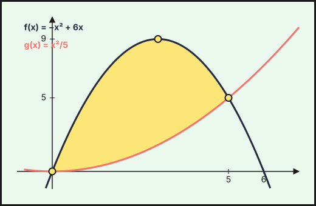
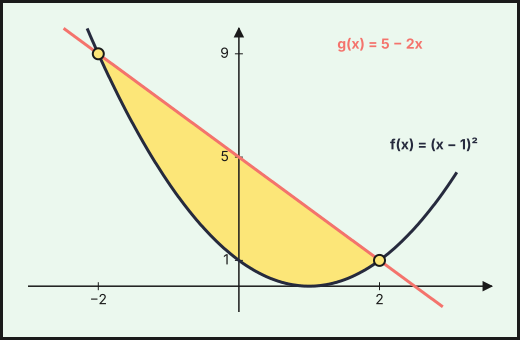

Ejercicios de **Matemáticas Aplicadas a las Ciencias Sociales II** de la prueba de acceso a la universidad en Andalucía (PAU, antes PEvAU) de **2021 a 2026** cuyo tema principal es *integrales*: **3 ejercicios** de convocatorias ordinarias y extraordinarias y de sus reservas o suplentes. Repasa antes la [teoría](../../../apuntes/2-bachillerato-ccss/08-integrales/index.qmd), los [ejercicios del tema](../08-integrales/index.qmd) y las [actividades interactivas](../../../actividades/2-bachillerato-ccss/08-integrales/index.qmd).

Debajo de cada ejercicio hay una **resolución breve** plegada, con los pasos clave y el resultado: inténtalo antes de abrirla.

## 2024

### Ordinaria · Reserva · Modelo A 2024

::::: {.ebau-ej #ebau-2024-ord-res-a-3}
**Ejercicio 3** · Ordinaria · Reserva · Modelo A 2024 · Bloque B · *(2,5 puntos)* · [Examen](../../../assets/pau-ccss/2024-ord-res-a/examen.pdf){target="_blank"}

Se desea analizar la evolución de la población de una localidad. Se conoce que la función $f$ aproxima el número de habitantes que tiene la población para cada tiempo $t$, medido en meses, con $t\in[0,60]$. El crecimiento de esta población viene dado por la siguiente expresión:
$$f'(t)=400+30\sqrt t$$
También se sabe que la población en la actualidad, $t=0$, es de $90\,000$ habitantes.

a) ¿Cuál será la población dentro de $9$ meses? *(1,25 puntos)*

b) Calcule $\displaystyle\int_9^{16}f'(t)\,dt$ e interprete el resultado. *(0,75 puntos)*

c) Si se entrega una ayuda de 150 € por cada nuevo habitante durante los tres primeros años, calcule la cuantía total aproximada de la ayuda que recibirá la localidad. *(0,5 puntos)*

*Relacionado también con:* [Derivadas](06-derivadas.qmd).

:::: {.callout-tip collapse="true" appearance="simple"}
## Solución

**a)** $f(t)=\displaystyle\int\left(400+30\sqrt t\right)dt=400t+20t^{3/2}+K$ y $f(0)=90\,000$, luego $K=90\,000$: $f(t)=90\,000+400t+20t\sqrt t$.

$f(9)=90\,000+3\,600+20\cdot27=94\,140$.

**Dentro de 9 meses habrá $94\,140$ habitantes.**

**b)** $\displaystyle\int_9^{16}f'(t)\,dt=f(16)-f(9)=(90\,000+6\,400+1\,280)-94\,140=97\,680-94\,140=3\,540$.

**Es el aumento de población entre el mes $9$ y el mes $16$: la localidad gana $3\,540$ habitantes.**

**c)** Tres años son $36$ meses. $f(36)-f(0)=400\cdot36+20\cdot216=14\,400+4\,320=18\,720$ nuevos habitantes.

**Ayuda: $18\,720\cdot150=2\,808\,000$ €.**
::::
:::::

### Ordinaria · Suplente · Modelo A 2024

::::: {.ebau-ej #ebau-2024-ord-sup-a-3}
**Ejercicio 3** · Ordinaria · Suplente · Modelo A 2024 · Bloque B · *(2,5 puntos)* · [Examen](../../../assets/pau-ccss/2024-ord-sup-a/examen.pdf){target="_blank"}

La superficie de ampliación de un parque de atracciones, en decámetros cuadrados, coincide con el área de la región delimitada por las gráficas de las funciones $f(x)=-x^{2}+6x$ y $g(x)=\dfrac{x^{2}}{5}$.

a) Represente gráficamente la superficie de ampliación del parque de atracciones. *(1 punto)*

b) Si el coste para acondicionar el nuevo suelo es de $75\ €/\text{m}^{2}$, calcule el área de ampliación del parque y el coste total del acondicionamiento. *(1,5 puntos)*

*Relacionado también con:* [Funciones](04-funciones.qmd).

:::: {.callout-tip collapse="true" appearance="simple"}
## Solución

**a)** $f(x)=-x(x-6)$ es una parábola abierta hacia abajo con vértice $(3,9)$ que corta al eje $OX$ en $x=0$ y $x=6$; $g(x)=\dfrac{x^2}{5}$ es una parábola abierta hacia arriba con vértice en el origen. Se cortan donde $-x^2+6x=\dfrac{x^2}{5}\iff6x=\dfrac{6}{5}x^2\iff x=0$ o $x=5$, en los puntos $(0,0)$ y $(5,5)$. La superficie es la región entre ambas, con $f$ por encima de $g$.

{fig-alt="Superficie de ampliación: región entre las parábolas f(x)=−x²+6x y g(x)=x²/5, que se cortan en (0,0) y (5,5)" width="75%" fig-align="center"}

**b)** $A=\displaystyle\int_0^5\left(-x^2+6x-\frac{x^2}{5}\right)dx=\int_0^5\left(-\frac{6}{5}x^2+6x\right)dx=\left[-\frac{2x^3}{5}+3x^2\right]_0^5=-50+75=25$.

**El área es de $25$ dam$^2$, es decir, $2\,500$ m$^2$ ($1$ dam$^2=100$ m$^2$).** Coste: $2\,500\cdot75=187\,500$ €.
::::
:::::

## 2023

### Ordinaria · Modelo B 2023

::::: {.ebau-ej #ebau-2023-ord-b-3}
**Ejercicio 3** · Ordinaria · Modelo B 2023 · Bloque B · *(2,5 puntos)* · [Examen](../../../assets/pau-ccss/2023-ord-b/examen.pdf){target="_blank"}

El área quemada de la región plana de la cubierta de plástico de un invernadero, coincide con el área de la región acotada delimitada por las gráficas de las funciones $f(x)=(x-1)^{2}$ y $g(x)=5-2x$ donde $x$ está expresado en metros.

a) Represente gráficamente la zona deteriorada. *(1 punto)*

b) Para reparar la región quemada, se ha de utilizar plástico cuyo coste es de 15 euros por metro cuadrado. Si en el trabajo de reparación se desperdicia la tercera parte del plástico adquirido, ¿cuánto costará el plástico comprado? *(1,5 puntos)*

*Relacionado también con:* [Funciones](04-funciones.qmd).

:::: {.callout-tip collapse="true" appearance="simple"}
## Solución

**a)** Las gráficas se cortan donde $(x-1)^2=5-2x\iff x^2=4\iff x=\pm2$, en los puntos $(-2,9)$ y $(2,1)$. La zona deteriorada es el recinto entre la parábola $y=(x-1)^2$ (vértice $(1,0)$) y la recta $y=5-2x$ (que pasa por $\left(0,5\right)$ y $\left(\tfrac{5}{2},0\right)$), con la recta por encima de la parábola, para $-2\le x\le2$.

{fig-alt="Zona deteriorada: región entre la parábola f(x)=(x−1)² y la recta g(x)=5−2x, que se cortan en (−2,9) y (2,1)" width="75%" fig-align="center"}

**b)** Área quemada:
$$A=\int_{-2}^{2}\left[(5-2x)-(x-1)^2\right]dx=\int_{-2}^{2}\left(4-x^2\right)dx=\left[4x-\frac{x^3}{3}\right]_{-2}^{2}=\frac{32}{3}\ \text{m}^2.$$
Si se desperdicia la tercera parte del plástico comprado, lo aprovechado es $\dfrac{2}{3}$ de lo comprado: $\dfrac{2}{3}C=\dfrac{32}{3}\Rightarrow C=16\ \text{m}^2$.

**Coste: $16\cdot15=240$ €.**
::::
:::::

## También trabajan este tema

Ejercicios cuyo tema principal es otro pero en los que aparece este tema:

- [2026 Ordinaria, ejercicio 2](05-limites-continuidad.qmd#ebau-2026-ord-2) (tema principal: Límites y continuidad)
- [2026 Extraordinaria · Suplente 1, ejercicio 2A](05-limites-continuidad.qmd#ebau-2026-ext-sup1-2A) (tema principal: Límites y continuidad)
- [2025 Ordinaria · Suplente 1 · Modelo A, ejercicio 3](05-limites-continuidad.qmd#ebau-2025-ord-sup1-a-3) (tema principal: Límites y continuidad)
- [2025 Ordinaria · Suplente 1 · Modelo B, ejercicio 4](07-aplicaciones-derivada.qmd#ebau-2025-ord-sup1-b-4) (tema principal: Aplicaciones de la derivada)
- [2025 Ordinaria · Suplente 2 · Modelo A, ejercicio 4](05-limites-continuidad.qmd#ebau-2025-ord-sup2-a-4) (tema principal: Límites y continuidad)
- [2024 Ordinaria · Modelo B, ejercicio 4](05-limites-continuidad.qmd#ebau-2024-ord-b-4) (tema principal: Límites y continuidad)
- [2024 Ordinaria · Reserva · Modelo A, ejercicio 4](05-limites-continuidad.qmd#ebau-2024-ord-res-a-4) (tema principal: Límites y continuidad)
- [2024 Ordinaria · Reserva · Modelo B, ejercicio 3](05-limites-continuidad.qmd#ebau-2024-ord-res-b-3) (tema principal: Límites y continuidad)
- [2024 Ordinaria · Reserva · Modelo B, ejercicio 4](05-limites-continuidad.qmd#ebau-2024-ord-res-b-4) (tema principal: Límites y continuidad)
- [2024 Ordinaria · Suplente · Modelo A, ejercicio 4](05-limites-continuidad.qmd#ebau-2024-ord-sup-a-4) (tema principal: Límites y continuidad)
- [2024 Ordinaria · Suplente · Modelo B, ejercicio 4](05-limites-continuidad.qmd#ebau-2024-ord-sup-b-4) (tema principal: Límites y continuidad)
- [2023 Ordinaria · Modelo A, ejercicio 3](07-aplicaciones-derivada.qmd#ebau-2023-ord-a-3) (tema principal: Aplicaciones de la derivada)
- [2023 Ordinaria · Modelo A, ejercicio 4](07-aplicaciones-derivada.qmd#ebau-2023-ord-a-4) (tema principal: Aplicaciones de la derivada)
- [2023 Ordinaria · Reserva · Modelo A, ejercicio 3](06-derivadas.qmd#ebau-2023-ord-res-a-3) (tema principal: Derivadas)
- [2023 Ordinaria · Reserva · Modelo B, ejercicio 3](06-derivadas.qmd#ebau-2023-ord-res-b-3) (tema principal: Derivadas)
- [2023 Ordinaria · Suplente · Modelo A, ejercicio 3](05-limites-continuidad.qmd#ebau-2023-ord-sup-a-3) (tema principal: Límites y continuidad)
- [2023 Ordinaria · Suplente · Modelo B, ejercicio 3](05-limites-continuidad.qmd#ebau-2023-ord-sup-b-3) (tema principal: Límites y continuidad)
- [2022 Ordinaria, ejercicio 3](07-aplicaciones-derivada.qmd#ebau-2022-ord-3) (tema principal: Aplicaciones de la derivada)
- [2022 Ordinaria, ejercicio 4](05-limites-continuidad.qmd#ebau-2022-ord-4) (tema principal: Límites y continuidad)
- [2022 Ordinaria · Reserva, ejercicio 3](05-limites-continuidad.qmd#ebau-2022-ord-res-3) (tema principal: Límites y continuidad)
- [2022 Ordinaria · Reserva, ejercicio 4](06-derivadas.qmd#ebau-2022-ord-res-4) (tema principal: Derivadas)
- [2022 Ordinaria · Suplente, ejercicio 4](05-limites-continuidad.qmd#ebau-2022-ord-sup-4) (tema principal: Límites y continuidad)
- [2022 Extraordinaria, ejercicio 3](07-aplicaciones-derivada.qmd#ebau-2022-ext-3) (tema principal: Aplicaciones de la derivada)
- [2022 Extraordinaria · Reserva, ejercicio 3](05-limites-continuidad.qmd#ebau-2022-ext-res-3) (tema principal: Límites y continuidad)
- [2022 Extraordinaria · Suplente, ejercicio 4](05-limites-continuidad.qmd#ebau-2022-ext-sup-4) (tema principal: Límites y continuidad)
- [2021 Ordinaria, ejercicio 3](07-aplicaciones-derivada.qmd#ebau-2021-ord-3) (tema principal: Aplicaciones de la derivada)
- [2021 Ordinaria, ejercicio 4](06-derivadas.qmd#ebau-2021-ord-4) (tema principal: Derivadas)
- [2021 Ordinaria · Reserva, ejercicio 3](05-limites-continuidad.qmd#ebau-2021-ord-res-3) (tema principal: Límites y continuidad)
- [2021 Ordinaria · Reserva, ejercicio 4](06-derivadas.qmd#ebau-2021-ord-res-4) (tema principal: Derivadas)
- [2021 Ordinaria · Suplente, ejercicio 3](05-limites-continuidad.qmd#ebau-2021-ord-sup-3) (tema principal: Límites y continuidad)
- [2021 Extraordinaria, ejercicio 3](05-limites-continuidad.qmd#ebau-2021-ext-3) (tema principal: Límites y continuidad)
- [2021 Extraordinaria · Reserva, ejercicio 3](05-limites-continuidad.qmd#ebau-2021-ext-res-3) (tema principal: Límites y continuidad)
- [2021 Extraordinaria · Reserva, ejercicio 4](07-aplicaciones-derivada.qmd#ebau-2021-ext-res-4) (tema principal: Aplicaciones de la derivada)
- [2021 Extraordinaria · Suplente, ejercicio 3](05-limites-continuidad.qmd#ebau-2021-ext-sup-3) (tema principal: Límites y continuidad)
- [2021 Extraordinaria · Suplente, ejercicio 4](07-aplicaciones-derivada.qmd#ebau-2021-ext-sup-4) (tema principal: Aplicaciones de la derivada)

---

*Enunciados: Prueba de Acceso y Admisión a la Universidad (PEvAU hasta 2024, PAU desde 2025), Matemáticas Aplicadas a las Ciencias Sociales II, Andalucía, Ceuta, Melilla y centros en Marruecos (Distrito Único Andaluz). Cada ejercicio enlaza al PDF oficial del examen completo. La clasificación por temas es propia y puede discutirse: los ejercicios mixtos figuran en su tema principal.*
