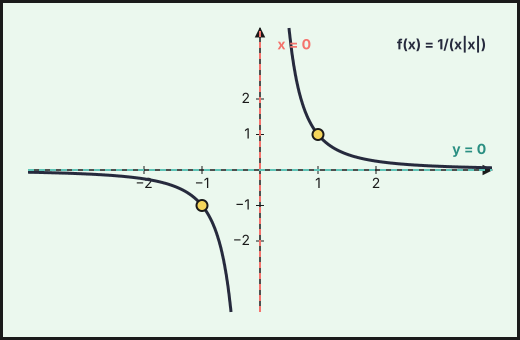
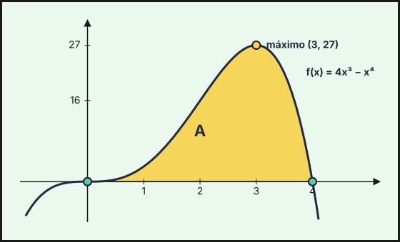

Ejercicios de **Matemáticas II** de la prueba de acceso a la universidad en Andalucía (PAU, antes PEvAU) de **2021 a 2026** cuyo tema principal es *aplicaciones de la derivada*: **37 ejercicios** de convocatorias ordinarias, extraordinarias y de sus reservas o suplentes. Repasa antes la [teoría](../../../apuntes/2-bachillerato-ciencias/08-aplicaciones-derivada/index.qmd), los [ejercicios del tema](../08-aplicaciones-derivada/index.qmd) y las [actividades interactivas](../../../actividades/2-bachillerato-ciencias/08-aplicaciones-derivada/index.qmd).

Debajo de cada ejercicio hay una **resolución breve** plegada, con los pasos clave y el resultado: inténtalo antes de abrirla.

## 2026

### Ordinaria 2026

::::: {.ebau-ej #ebau-2026-ord-1}
**Ejercicio 1** · Ordinaria 2026 · Parte obligatoria · *(2,5 puntos)* · [PDF del examen](https://www.ebaumatematicas.com/wp-content/uploads/2026/06/2oBachCC_EBAU_Andalucia_2026-Ordinaria.pdf){target="_blank"}

Una ventana tiene forma de rectángulo y está coronada por un semicírculo. Sabiendo que el perímetro de la ventana mide 8 metros, halla las dimensiones de la ventana que permitan la mayor entrada de luz.

:::: {.callout-tip collapse="true" appearance="simple"}
## Solución

Sea $r$ el radio del semicírculo (anchura $2r$) y $h$ la altura del rectángulo. Perímetro: $2r+2h+\pi r=8\Rightarrow h=\dfrac{8-(2+\pi)r}{2}$.

Luz (área): $A(r)=2rh+\dfrac{\pi r^2}{2}=8r-2r^2-\dfrac{\pi r^2}{2}$.

$A'(r)=8-(4+\pi)r=0\Rightarrow r=\dfrac{8}{4+\pi}$, y $A''=-(4+\pi)<0$ (máximo). Entonces $h=\dfrac{8}{4+\pi}$ (también $h=r$).

**Anchura $\dfrac{16}{4+\pi}\approx2{,}24$ m y altura del rectángulo $\dfrac{8}{4+\pi}\approx1{,}12$ m.**
::::
:::::

### Ordinaria · Suplente 1 2026

::::: {.ebau-ej #ebau-2026-ord-sup1-1}
**Ejercicio 1** · Ordinaria · Suplente 1 2026 · Parte obligatoria · *(2,5 puntos)* · [PDF del examen](https://www.ebaumatematicas.com/wp-content/uploads/2026/06/2oBachCC_EBAU_Andalucia_2026-Ordinaria_Suplente.pdf){target="_blank"}

La producción de gas en una refinería, medida en metros cúbicos, viene dada por la función $f(t)=7+e^{-(t-4)^{2}}$, donde $t$ representa el tiempo medido en segundos.

a) Razona que la producción de gas varía siempre entre 7 y 8 metros cúbicos. ¿Se producen 7 metros cúbicos de gas en algún momento concreto? *(2 puntos)*

b) Justifica que la producción de gas se estabiliza con el paso del tiempo. *(0,5 puntos)*

*Relacionado también con:* [Límites y continuidad](06-limites-continuidad.qmd).

:::: {.callout-tip collapse="true" appearance="simple"}
## Solución

**a)** Como $-(t-4)^2\le0$, se tiene $0<e^{-(t-4)^2}\le1$, luego $7<f(t)\le8$: la producción está siempre entre 7 y 8 m$^3$. El máximo, 8 m$^3$, se alcanza en $t=4$ s. **Nunca llega a ser exactamente 7**, porque $e^{-(t-4)^2}>0$ siempre (no se anula para ningún $t$).

**b)** $\displaystyle\lim_{t\to\infty}f(t)=7+\lim_{t\to\infty}e^{-(t-4)^2}=7+0$. **Se estabiliza en 7 m$^3$.**
::::
:::::

### Ordinaria · Suplente 2 2026

::::: {.ebau-ej #ebau-2026-ord-sup2-1}
**Ejercicio 1** · Ordinaria · Suplente 2 2026 · Parte obligatoria · *(2,5 puntos)* · [PDF del examen](https://www.ebaumatematicas.com/wp-content/uploads/2026/06/2oBachCC_EBAU_Andalucia_2026-Ordinaria_Suplente2.pdf){target="_blank"}

La potencia de pérdida $P(t)$ (en vatios) en una máquina, debido a la fricción, depende del tiempo de uso $t$ (en años) según la función $P(t)=\dfrac{4t}{1+t^{2}}$ siendo $t\ge 0$.

a) Calcula en qué momento la potencia de pérdida es máxima. *(1,25 puntos)*

b) La energía total perdida en los $t$ primeros años viene dada por la expresión $E(t)=\displaystyle\int_{0}^{t}P(x)\,dx$ (vatios por año). Calcula la energía total perdida en los tres primeros años. *(1,25 puntos)*

*Relacionado también con:* [Integrales](09-integrales.qmd).

:::: {.callout-tip collapse="true" appearance="simple"}
## Solución

**a)** $P'(t)=\dfrac{4(1+t^2)-4t\cdot2t}{(1+t^2)^2}=\dfrac{4(1-t^2)}{(1+t^2)^2}$. Se anula en $t=1$ ($t\ge0$); $P'>0$ si $t<1$ y $P'<0$ si $t>1$, luego es un máximo.

**Máxima potencia de pérdida al cabo de 1 año ($P(1)=2$ W).**

**b)** $E(3)=\displaystyle\int_0^3\dfrac{4x}{1+x^2}dx=\big[2\ln(1+x^2)\big]_0^3=2\ln10$.

**$E(3)=2\ln10\approx4{,}61$.**
::::
:::::

### Extraordinaria · Suplente 1 2026

::::: {.ebau-ej #ebau-2026-ext-sup1-1}
**Ejercicio 1** · Extraordinaria · Suplente 1 2026 · Parte obligatoria · *(2,5 puntos)* · [PDF del examen](https://www.ebaumatematicas.com/wp-content/uploads/2026/09/2oBachCC_EBAU_Andalucia_2026-Extraordinaria_Suplente1.pdf){target="_blank"}

Un jardinero quiere vallar un campo rectangular que tiene un lado junto a un camino. La valla del lado del camino cuesta 80 euros por metro y el precio de la valla de los tres lados restantes es de 10 euros por metro. Halla las dimensiones del campo de mayor área que puede cercarse con 28800 euros. ¿Qué área tiene el campo?

:::: {.callout-tip collapse="true" appearance="simple"}
## Solución

Sean $x$ el lado junto al camino (y su opuesto) e $y$ los otros dos lados. Coste: $80x+10x+20y=28800$, luego $y=1440-4{,}5x$.

Área: $A(x)=x\,y=1440x-4{,}5x^2$. $A'(x)=1440-9x=0\Rightarrow x=160$, y $A''=-9<0$ (máximo).

Entonces $y=1440-720=720$.

**Dimensiones: 160 m (lado del camino) por 720 m; área máxima $=115\,200\ \text{m}^2$.**
::::
:::::

::::: {.ebau-ej #ebau-2026-ext-sup1-2}
**Ejercicio 2** · Extraordinaria · Suplente 1 2026 · Parte obligatoria · *(2,5 puntos)* · [PDF del examen](https://www.ebaumatematicas.com/wp-content/uploads/2026/09/2oBachCC_EBAU_Andalucia_2026-Extraordinaria_Suplente1.pdf){target="_blank"}

Considera la función $f:[0,\pi]\to\mathbb{R}$ definida por $f(x)=a\operatorname{sen}(x)+\cos(bx)$. Determina $a$ y $b$ ($0<b<3$), sabiendo que $x=\dfrac{\pi}{2}$ es un punto crítico de $f$ y que $\displaystyle\int_{0}^{\pi}f(x)\,dx=4$.

*Relacionado también con:* [Integrales](09-integrales.qmd).

:::: {.callout-tip collapse="true" appearance="simple"}
## Solución

$f'(x)=a\cos x-b\operatorname{sen}(bx)$. Punto crítico en $\pi/2$: $f'(\pi/2)=-b\operatorname{sen}(b\pi/2)=0$. Como $0<b<3$, hace falta $b\pi/2=\pi$, es decir **$b=2$**.

Integral: $\displaystyle\int_0^\pi\big(a\operatorname{sen}x+\cos 2x\big)dx=\Big[-a\cos x+\tfrac{\operatorname{sen}2x}{2}\Big]_0^\pi=2a=4$.

**$a=2$, $b=2$.**
::::
:::::

### Extraordinaria · Suplente 2 2026

::::: {.ebau-ej #ebau-2026-ext-sup2-1}
**Ejercicio 1** · Extraordinaria · Suplente 2 2026 · Parte obligatoria · *(2,5 puntos)* · [PDF del examen](https://www.ebaumatematicas.com/wp-content/uploads/2026/09/2oBachCC_EBAU_Andalucia_2026-Extraordinaria_Suplente2.pdf){target="_blank"}

En un jardín botánico se desea crear un recinto floral con forma de triángulo rectángulo. Por la disposición del recinto y las características del terreno, la hipotenusa ha de medir 20 metros. ¿Qué longitudes han de tener los catetos del triángulo rectángulo para que su área sea lo mayor posible y cuál es el valor de esta área?

:::: {.callout-tip collapse="true" appearance="simple"}
## Solución

Catetos $x,y$ con $x^2+y^2=400$, así $y=\sqrt{400-x^2}$ y el área es $A(x)=\tfrac12x\sqrt{400-x^2}$. Basta maximizar $A^2=\tfrac14\,(400x^2-x^4)$:
$(400x^2-x^4)'=800x-4x^3=0\Rightarrow x^2=200$, $x=10\sqrt2$ (máximo; el área vale 0 en los extremos $x=0$ y $x=20$).

Entonces $y=\sqrt{200}=10\sqrt2$.

**Catetos: $10\sqrt2\approx14{,}14$ m cada uno; área máxima $=\tfrac12\cdot200=100\ \text{m}^2$.**
::::
:::::

## 2025

### Ordinaria 2025

::::: {.ebau-ej #ebau-2025-ord-3}
**Ejercicio 3** · Ordinaria 2025 · Bloque optativo 1 · *(2,5 puntos)* · [PDF del examen](https://www.ebaumatematicas.com/wp-content/uploads/2025/06/2oBachCC_EBAU_Andalucia_2025-Ordinaria.pdf){target="_blank"}

Sea la función $f:(0,+\infty)\to\mathbb{R}$ definida por $f(x)=a+\dfrac{\ln(x)}{x^{2}}$.

a) Calcula $a$ para que $y=1$ sea una asíntota horizontal de la gráfica de $f$. *(1 punto)*

b) Para $a=0$, calcula los intervalos de crecimiento y de decrecimiento de $f$. Estudia y halla los extremos relativos de $f$ (abscisas donde se obtienen y valores que se alcanzan). *(1,5 puntos)*

*Relacionado también con:* [Límites y continuidad](06-limites-continuidad.qmd).

:::: {.callout-tip collapse="true" appearance="simple"}
## Solución

**a)** $\displaystyle\lim_{x\to+\infty}\frac{\ln x}{x^2}=0$, luego la asíntota horizontal es $y=a$. **$a=1$.**

**b)** Con $a=0$: $f'(x)=\dfrac{x-2x\ln x}{x^4}=\dfrac{1-2\ln x}{x^3}$, que se anula en $x=\sqrt e$.

- $f'>0$ en $(0,\sqrt e)$: **crece**.
- $f'<0$ en $(\sqrt e,+\infty)$: **decrece**.

**Máximo relativo en $x=\sqrt e$, de valor $f(\sqrt e)=\dfrac{1}{2e}$.** No hay mínimos relativos.
::::
:::::

### Ordinaria · Suplente 1 2025

::::: {.ebau-ej #ebau-2025-ord-sup1-1}
**Ejercicio 1** · Ordinaria · Suplente 1 2025 · Parte obligatoria · *(2,5 puntos)* · [PDF del examen](https://www.ebaumatematicas.com/wp-content/uploads/2025/06/2oBachCC_EBAU_Andalucia_2025-Ordinaria_Suplente.pdf){target="_blank"}

Considera la función $f:\mathbb{R}\to\mathbb{R}$ definida por $f(x)=(x-1)e^{x}$.

a) Determina la ecuación de la recta tangente y la ecuación de la recta normal a la gráfica de $f$ en el punto de inflexión. *(1,5 puntos)*

b) Estudia y calcula las asíntotas de la función. *(1 punto)*

*Relacionado también con:* [Derivadas](07-derivadas.qmd), [Límites y continuidad](06-limites-continuidad.qmd).

:::: {.callout-tip collapse="true" appearance="simple"}
## Solución

**a)** $f'(x)=xe^{x}$, $f''(x)=(x+1)e^{x}$. $f''$ cambia de signo en $x=-1$: punto de inflexión $\left(-1,-\dfrac2e\right)$. Pendiente $f'(-1)=-\dfrac1e$.

Tangente: $y+\dfrac2e=-\dfrac1e(x+1)$, es decir **$y=-\dfrac{x}{e}-\dfrac3e$**.

Normal (pendiente $e$): $y+\dfrac2e=e(x+1)$, es decir **$y=ex+e-\dfrac2e$**.

**b)** No hay asíntotas verticales (es continua en $\mathbb R$). En $-\infty$: $\lim(x-1)e^{x}=0$, así que **$y=0$ es asíntota horizontal en $-\infty$**. En $+\infty$ el límite es $+\infty$ y $f(x)/x\to+\infty$, luego **no hay asíntota horizontal ni oblicua en $+\infty$**.
::::
:::::

### Ordinaria · Suplente 2 2025

::::: {.ebau-ej #ebau-2025-ord-sup2-1}
**Ejercicio 1** · Ordinaria · Suplente 2 2025 · Parte obligatoria · *(2,5 puntos)* · [PDF del examen](https://www.ebaumatematicas.com/wp-content/uploads/2025/07/2oBachCC_EBAU_Andalucia_2025-Ordinaria_Suplente2-1.pdf){target="_blank"}

Sea $f:[0,2]\to\mathbb{R}$ la función definida por

$$f(x)=\begin{cases}1-e^{x} & \text{si } 0\le x<1\\2x-1-e & \text{si } 1\le x\le 2\end{cases}$$

a) Estudia la derivabilidad de $f$. *(1 punto)*

b) Halla los extremos absolutos de $f$ (abscisas donde se obtienen y valores que se alcanzan). *(1,5 puntos)*

*Relacionado también con:* [Derivadas](07-derivadas.qmd).

:::: {.callout-tip collapse="true" appearance="simple"}
## Solución

**a)** En cada tramo $f$ es derivable. En $x=1$: $f(1^-)=1-e$ y $f(1)=2-1-e=1-e$, luego es continua. Derivadas laterales: $f'(1^-)=-e$ (de $f'=-e^{x}$) y $f'(1^+)=2$. Como son distintas, **$f$ es derivable en $[0,2]\setminus\{1\}$ y no es derivable en $x=1$.**

**b)** En $[0,1)$, $f'=-e^{x}<0$: decrece de $f(0)=0$ hasta $1-e$. En $[1,2]$, $f'=2>0$: crece de $f(1)=1-e$ hasta $f(2)=3-e\approx0{,}28$.

**Mínimo absoluto en $x=1$, valor $1-e$. Máximo absoluto en $x=2$, valor $3-e$** (mayor que $f(0)=0$).
::::
:::::

### Extraordinaria · Suplente 1 2025

::::: {.ebau-ej #ebau-2025-ext-sup1-2}
**Ejercicio 2** · Extraordinaria · Suplente 1 2025 · Bloque optativo 1 · *(2,5 puntos)* · [PDF del examen](https://www.ebaumatematicas.com/wp-content/uploads/2025/07/2oBachCC_EBAU_Andalucia_2025-Extraordinaria_Suplente.pdf){target="_blank"}

Considera la función $f:(-1,1)\to\mathbb{R}$ definida por $f(x)=\dfrac{1}{(1-|x|)^{2}}$.

a) Estudia la continuidad y derivabilidad de la función $f$. *(1,25 puntos)*

b) Halla, si existen, sus extremos absolutos (abscisas donde se obtienen y valores que se alcanzan). *(1,25 puntos)*

*Relacionado también con:* [Límites y continuidad](06-limites-continuidad.qmd), [Derivadas](07-derivadas.qmd).

:::: {.callout-tip collapse="true" appearance="simple"}
## Solución

**a)** Para $x\ge0$, $f(x)=\dfrac{1}{(1-x)^2}$ y para $x<0$, $f(x)=\dfrac{1}{(1+x)^2}$. Son continuas en cada rama (el denominador no se anula en $(-1,1)$) y en $x=0$ ambos límites laterales valen $1=f(0)$. **$f$ es continua en $(-1,1)$.**

Derivadas: $f'(x)=\dfrac{2}{(1-x)^3}$ si $x>0$ y $f'(x)=-\dfrac{2}{(1+x)^3}$ si $x<0$. Como $f'(0^+)=2\neq-2=f'(0^-)$, **$f$ es derivable en $(-1,1)\setminus\{0\}$ y no lo es en $x=0$.**

**b)** $f'<0$ en $(-1,0)$ y $f'>0$ en $(0,1)$. **Mínimo absoluto en $x=0$, de valor $f(0)=1$.** No hay máximo absoluto porque $f(x)\to+\infty$ cuando $x\to\pm1$.
::::
:::::

### Extraordinaria · Suplente 2 2025

::::: {.ebau-ej #ebau-2025-ext-sup2-2}
**Ejercicio 2** · Extraordinaria · Suplente 2 2025 · Bloque optativo 1 · *(2,5 puntos)* · [PDF del examen](https://www.ebaumatematicas.com/wp-content/uploads/2025/07/2oBachCC_EBAU_Andalucia_2025-Extraordinaria_Suplente2.pdf){target="_blank"}

Un náufrago se encuentra en una isla situada en el punto de coordenadas $(2,0)$ de un plano. Se sabe que un ferry navega en el mismo plano siempre en la trayectoria dada por la gráfica de la función $f(x)=\sqrt{x+1}$. ¿Hacia qué punto de la trayectoria debe nadar el náufrago para recorrer la menor distancia posible? Calcula dicha distancia.

:::: {.callout-tip collapse="true" appearance="simple"}
## Solución

Un punto de la trayectoria es $(x,\sqrt{x+1})$, con $x\ge-1$. El cuadrado de la distancia a $(2,0)$ es
$$d^2(x)=(x-2)^2+x+1,\qquad (d^2)'=2(x-2)+1=0\Rightarrow x=\tfrac32.$$
Como $(d^2)''=2>0$, es un mínimo.

Punto: **$\left(\dfrac32,\dfrac{\sqrt{10}}{2}\right)$**. Distancia: $d=\sqrt{\tfrac14+\tfrac52}=\mathbf{\dfrac{\sqrt{11}}{2}}\approx1{,}66$.
::::
:::::

## 2024

### Ordinaria · Reserva 2024

::::: {.ebau-ej #ebau-2024-ord-res-1}
**Ejercicio 1** · Ordinaria · Reserva 2024 · Bloque A · *(2,5 puntos)* · [PDF del examen](https://www.ebaumatematicas.com/wp-content/uploads/2025/02/2oBachCC_EBAU_Andalucia_2024-Ordinaria_Reserva.pdf){target="_blank"}

Sea la función $f:\mathbb{R}\to\mathbb{R}$ definida por $f(x)=(x^{2}+1)e^{x}$.

a) Calcula los intervalos de crecimiento y de decrecimiento de $f$. *(1 punto)*

b) Determina los intervalos de concavidad y de convexidad de $f$ y los puntos de inflexión de su gráfica (abscisas donde se obtienen y valores que alcanzan). *(1,5 puntos)*

:::: {.callout-tip collapse="true" appearance="simple"}
## Solución

$f'(x)=(2x+x^2+1)e^x=(x+1)^2e^x$ y $f''(x)=(x+1)(x+3)e^x$.

**a)** $f'(x)\ge0$ para todo $x$ y sólo se anula en $x=-1$: **$f$ es creciente en todo $\mathbb{R}$** (nunca decrece; en $x=-1$ hay tangente horizontal sin extremo).

**b)** $f''=0$ en $x=-3$ y $x=-1$. Signo: $+$ en $(-\infty,-3)$, $-$ en $(-3,-1)$, $+$ en $(-1,+\infty)$.

**Convexa en $(-\infty,-3)\cup(-1,+\infty)$; cóncava en $(-3,-1)$.** Puntos de inflexión: **$\left(-3,\,10e^{-3}\right)$ y $\left(-1,\,2e^{-1}\right)$.**
::::
:::::

### Ordinaria · Suplente 2024

::::: {.ebau-ej #ebau-2024-ord-sup-2}
**Ejercicio 2** · Ordinaria · Suplente 2024 · Bloque A · *(2,5 puntos)* · [PDF del examen](https://www.ebaumatematicas.com/wp-content/uploads/2024/06/2oBachCC_EBAU_Andalucia_2024-Ordinaria_Suplente.pdf){target="_blank"}

Considera la función $f:\mathbb{R}\to\mathbb{R}$ definida por $f(x)=\operatorname{arctg}(x+\pi)$, donde $\operatorname{arctg}$ denota la función arcotangente.

a) Calcula los intervalos de concavidad y convexidad de $f$. Estudia y halla, si existen, los puntos de inflexión de $f$ (abscisas donde se obtienen y valores que se alcanzan). *(1,5 puntos)*

b) Calcula $\displaystyle\lim_{x\to-\pi}\dfrac{\operatorname{arctg}(x+\pi)}{\operatorname{sen}(x)}$. *(1 punto)*

*Relacionado también con:* [Límites y continuidad](06-limites-continuidad.qmd).

:::: {.callout-tip collapse="true" appearance="simple"}
## Solución

**a)** $f'(x)=\dfrac1{1+(x+\pi)^2}$ y $f''(x)=\dfrac{-2(x+\pi)}{\left(1+(x+\pi)^2\right)^2}$, que se anula sólo en $x=-\pi$.

$f''>0$ si $x<-\pi$ y $f''<0$ si $x>-\pi$: **convexa en $(-\infty,-\pi)$ y cóncava en $(-\pi,+\infty)$; punto de inflexión en $x=-\pi$, con $f(-\pi)=\operatorname{arctg}0=0$**, es decir en $(-\pi,0)$.

**b)** Es $\dfrac00$. Por L'Hôpital:

$$\lim_{x\to-\pi}\frac{\operatorname{arctg}(x+\pi)}{\operatorname{sen}x}=\lim_{x\to-\pi}\frac{1/(1+(x+\pi)^2)}{\cos x}=\frac{1}{\cos(-\pi)}=\mathbf{-1}.$$
::::
:::::

### Extraordinaria 2024

::::: {.ebau-ej #ebau-2024-ext-2}
**Ejercicio 2** · Extraordinaria 2024 · Bloque A · *(2,5 puntos)* · [PDF del examen](https://www.ebaumatematicas.com/wp-content/uploads/2024/10/2oBachCC_EBAU_Andalucia_2024-Extraordinaria.pdf){target="_blank"}

Sea la función $f:\mathbb{R}\to\mathbb{R}$ dada por $f(x)=\left(x-\dfrac12\right)e^{-x^{2}}$.

a) Determina los intervalos de crecimiento y de decrecimiento de $f$. *(1,5 puntos)*

b) Halla los extremos absolutos de $f$ (abscisas donde se obtienen y valores que se alcanzan). *(1 punto)*

:::: {.callout-tip collapse="true" appearance="simple"}
## Solución

$f'(x)=e^{-x^2}\big(1-2x(x-\tfrac12)\big)=e^{-x^2}(-2x^2+x+1)=-(2x+1)(x-1)e^{-x^2}$, que se anula en $x=-\tfrac12$ y $x=1$.

**a)** Signo de $f'$: $<0$ en $(-\infty,-\tfrac12)$, $>0$ en $(-\tfrac12,1)$, $<0$ en $(1,+\infty)$.

**Decrece en $(-\infty,-\frac12)\cup(1,+\infty)$ y crece en $(-\frac12,1)$.**

**b)** Mínimo relativo en $x=-\tfrac12$: $f(-\tfrac12)=-e^{-1/4}$. Máximo relativo en $x=1$: $f(1)=\dfrac1{2e}$. Como $\lim_{x\to\pm\infty}f(x)=0$, y $f(-\tfrac12)<0<f(1)$, son absolutos:

**mínimo absoluto $-e^{-1/4}$ en $x=-\frac12$; máximo absoluto $\dfrac1{2e}$ en $x=1$.**
::::
:::::

### Extraordinaria · Reserva 2024

::::: {.ebau-ej #ebau-2024-ext-res-1}
**Ejercicio 1** · Extraordinaria · Reserva 2024 · Bloque A · *(2,5 puntos)* · [PDF del examen](https://www.ebaumatematicas.com/wp-content/uploads/2025/02/2oBachCC_EBAU_Andalucia_2024-Extraordinaria_Reserva.pdf){target="_blank"}

De entre todos los rectángulos de área 25 cm², determina las dimensiones de aquel en el que el producto de las longitudes de sus dos diagonales sea el menor posible.

:::: {.callout-tip collapse="true" appearance="simple"}
## Solución

Rectángulo de lados $x$ e $y=25/x$. Las dos diagonales miden lo mismo, $d=\sqrt{x^2+y^2}$, así que el producto es $d^2=x^2+\dfrac{625}{x^2}$.

$$g(x)=x^2+\frac{625}{x^2},\qquad g'(x)=2x-\frac{1250}{x^3}=0\ \Rightarrow\ x^4=625\ \Rightarrow\ x=5.$$

$g'<0$ si $x<5$ y $g'>0$ si $x>5$, luego es un mínimo. Entonces $y=5$.

**El rectángulo es un cuadrado de $5\times5$ cm** (producto de diagonales mínimo: $50$ cm²).
::::
:::::

### Extraordinaria · Suplente 2024

::::: {.ebau-ej #ebau-2024-ext-sup-1}
**Ejercicio 1** · Extraordinaria · Suplente 2024 · Bloque A · *(2,5 puntos)* · [PDF del examen](https://www.ebaumatematicas.com/wp-content/uploads/2025/02/2oBachCC_EBAU_Andalucia_2024-Extraordinaria_Suplente.pdf){target="_blank"}

Sea la función $f:(0,+\infty)\to\mathbb{R}$, definida por $f(x)=\ln\left(\dfrac{x^{2}+1}{x}\right)$, donde $\ln$ denota el logaritmo neperiano.

a) Calcula los intervalos de crecimiento y de decrecimiento. *(1 punto)*

b) Estudia y halla los extremos relativos y absolutos de $f$ (abscisas donde se obtienen y valores que alcanzan). *(1,5 puntos)*

:::: {.callout-tip collapse="true" appearance="simple"}
## Solución

$f(x)=\ln g(x)$ con $g(x)=\dfrac{x^2+1}{x}=x+\dfrac1x>0$ en $(0,+\infty)$. Como $\ln$ es creciente, $f$ y $g$ tienen el mismo crecimiento.

$$f'(x)=\frac{g'(x)}{g(x)}=\frac{1-\frac1{x^2}}{x+\frac1x}=\frac{x^2-1}{x(x^2+1)}.$$

**a)** $f'<0$ en $(0,1)$ y $f'>0$ en $(1,+\infty)$: **decrece en $(0,1)$ y crece en $(1,+\infty)$.**

**b)** Mínimo relativo en $x=1$, con $f(1)=\ln2$. Como $\lim_{x\to0^+}f=+\infty$ y $\lim_{x\to+\infty}f=+\infty$, ese mínimo es absoluto. **Mínimo absoluto en $x=1$, valor $\ln2$; no hay máximo (ni relativo ni absoluto).**
::::
:::::

## 2023

### Ordinaria 2023

::::: {.ebau-ej #ebau-2023-ord-1}
**Ejercicio 1** · Ordinaria 2023 · Bloque A · *(2,5 puntos)* · [PDF del examen](https://www.ebaumatematicas.com/wp-content/uploads/2023/10/2oBachCC_EBAU_Andalucia_2023-Ordinaria.pdf){target="_blank"}

Considera la función $f:\mathbb{R}\to\mathbb{R}$ definida por $f(x)=\dfrac{1}{e^{x}+e^{-x}}$.

a) Estudia y halla los máximos y mínimos absolutos de $f$ (abscisas donde se obtienen y valores que se alcanzan). *(1,5 puntos)*

b) Calcula $\displaystyle\lim_{x\to+\infty}\left(x^{2}f(x)\right)$. *(1 punto)*

*Relacionado también con:* [Límites y continuidad](06-limites-continuidad.qmd).

:::: {.callout-tip collapse="true" appearance="simple"}
## Solución

**a)** $f(x)=\dfrac1{e^{x}+e^{-x}}$ es positiva y par. $f'(x)=-\dfrac{e^{x}-e^{-x}}{(e^{x}+e^{-x})^{2}}=0\iff e^{x}=e^{-x}\iff x=0$.

$f'>0$ para $x<0$ y $f'<0$ para $x>0$: máximo en $x=0$. Como $f(x)\to0$ en $\pm\infty$ y $f>0$, el $0$ no se alcanza.

**Máximo absoluto en $x=0$, de valor $\dfrac12$; no hay mínimo absoluto.**

**b)** $\displaystyle\lim_{x\to+\infty}\dfrac{x^{2}}{e^{x}+e^{-x}}=0$, pues la exponencial domina a la potencia (L'Hôpital dos veces).

**Límite $=0$.**
::::
:::::

::::: {.ebau-ej #ebau-2023-ord-2}
**Ejercicio 2** · Ordinaria 2023 · Bloque A · *(2,5 puntos)* · [PDF del examen](https://www.ebaumatematicas.com/wp-content/uploads/2023/10/2oBachCC_EBAU_Andalucia_2023-Ordinaria.pdf){target="_blank"}

Sea la función $f:[-2,2]\longrightarrow\mathbb{R}$, definida por $f(x)=x^{3}-2x+5$.

a) Determina las abscisas de los puntos, si existen, en los que la pendiente de la recta tangente coincide con la pendiente de la recta que pasa por los puntos $(-2,f(-2))$ y $(2,f(2))$. *(1,5 puntos)*

b) Determina la ecuación de la recta tangente y la ecuación de la recta normal a la gráfica de $f$ en el punto de inflexión. *(1 punto)*

*Relacionado también con:* [Derivadas](07-derivadas.qmd).

:::: {.callout-tip collapse="true" appearance="simple"}
## Solución

**a)** Pendiente de la secante: $\dfrac{f(2)-f(-2)}{4}=\dfrac{9-1}{4}=2$. $f'(x)=3x^{2}-2=2\Rightarrow x^{2}=\dfrac43$.

**$x=\pm\dfrac{2\sqrt3}3$** (ambos en $[-2,2]$).

**b)** $f''(x)=6x=0\Rightarrow x=0$: punto de inflexión $(0,5)$, con $f'(0)=-2$.

**Tangente: $y=-2x+5$. Normal: $y=\dfrac12x+5$.**
::::
:::::

### Ordinaria · Reserva 2023

::::: {.ebau-ej #ebau-2023-ord-res-1}
**Ejercicio 1** · Ordinaria · Reserva 2023 · Bloque A · *(2,5 puntos)* · [PDF del examen](https://www.ebaumatematicas.com/wp-content/uploads/2023/10/2oBachCC_EBAU_Andalucia_2023-Ordinaria-Reserva.pdf){target="_blank"}

Determina las longitudes de los lados de un rectángulo de área máxima que está inscrito en una semicircunferencia de 6 cm de radio, teniendo uno de sus lados sobre el diámetro de ella.

:::: {.callout-tip collapse="true" appearance="simple"}
## Solución

Sea $x$ la distancia del centro a un extremo de la base: base $2x$, altura $\sqrt{36-x^{2}}$ (vértice superior en la circunferencia).

$A(x)=2x\sqrt{36-x^{2}}$. $A'(x)=\dfrac{2(36-2x^{2})}{\sqrt{36-x^{2}}}=0\Rightarrow x=3\sqrt2$ (es máximo: $A(0)=A(6)=0$).

**Base $6\sqrt2\approx8{,}49$ cm y altura $3\sqrt2\approx4{,}24$ cm** (área $36\ \text{cm}^2$).
::::
:::::

### Ordinaria · Suplente 2023

::::: {.ebau-ej #ebau-2023-ord-sup-1}
**Ejercicio 1** · Ordinaria · Suplente 2023 · Bloque A · *(2,5 puntos)* · [PDF del examen](https://www.ebaumatematicas.com/wp-content/uploads/2023/10/2oBachCC_EBAU_Andalucia_2023-Ordinaria-Suplente.pdf){target="_blank"}

De entre todos los rectángulos de diagonal 10 cm (cada una), calcula las dimensiones del que tiene mayor área.

:::: {.callout-tip collapse="true" appearance="simple"}
## Solución

Lados $x$ e $y$ con $x^{2}+y^{2}=100$; $A=xy=x\sqrt{100-x^{2}}$.

$A'(x)=\dfrac{100-2x^{2}}{\sqrt{100-x^{2}}}=0\Rightarrow x=5\sqrt2$, y entonces $y=5\sqrt2$ (máximo, pues $A=0$ en los extremos).

**Es un cuadrado de lado $5\sqrt2\approx7{,}07$ cm** (área $50\ \text{cm}^2$).
::::
:::::

::::: {.ebau-ej #ebau-2023-ord-sup-2}
**Ejercicio 2** · Ordinaria · Suplente 2023 · Bloque A · *(2,5 puntos)* · [PDF del examen](https://www.ebaumatematicas.com/wp-content/uploads/2023/10/2oBachCC_EBAU_Andalucia_2023-Ordinaria-Suplente.pdf){target="_blank"}

Considera la función $f(x)=\dfrac{1}{x|x|}$, para $x\neq 0$.

a) Calcula los intervalos de concavidad y de convexidad de $f$, así como los puntos de inflexión de su gráfica, si existen. *(1 punto)*

b) Estudia y calcula las asíntotas de la función. Esboza su gráfica. *(1,5 puntos)*

*Relacionado también con:* [Límites y continuidad](06-limites-continuidad.qmd).

:::: {.callout-tip collapse="true" appearance="simple"}
## Solución

$f(x)=\dfrac1{x^{2}}$ si $x>0$ y $f(x)=-\dfrac1{x^{2}}$ si $x<0$.

**a)** $f''(x)=\dfrac6{x^{4}}$ si $x>0$; $f''(x)=-\dfrac6{x^{4}}$ si $x<0$.

**Convexa en $(0,+\infty)$, cóncava en $(-\infty,0)$. No hay puntos de inflexión** ($x=0$ no está en el dominio).

**b)** 
- Vertical: $\displaystyle\lim_{x\to0^+}f=+\infty$, $\displaystyle\lim_{x\to0^-}f=-\infty$: **$x=0$**.
- Horizontal: $\displaystyle\lim_{x\to\pm\infty}f=0$: **$y=0$** (en ambos lados).

Gráfica: función impar, decreciente en cada rama. Para $x>0$ es la rama de $1/x^{2}$ (primer cuadrante) y para $x<0$ su simétrica respecto al origen (tercer cuadrante), ambas pegadas a los ejes.

{fig-alt="Gráfica de f(x)=1/(x|x|): asíntota vertical x=0 y horizontal y=0, positiva a la derecha y negativa a la izquierda" width="75%" fig-align="center"}
::::
:::::

### Extraordinaria 2023

::::: {.ebau-ej #ebau-2023-ext-1}
**Ejercicio 1** · Extraordinaria 2023 · Bloque A · *(2,5 puntos)* · [PDF del examen](https://www.ebaumatematicas.com/wp-content/uploads/2023/10/2oBachCC_EBAU_Andalucia_2023-Extraordinaria.pdf){target="_blank"}

Sea la función $f:[-2,2\pi]\longrightarrow\mathbb{R}$, definida por $f(x)=\begin{cases}5x+1 & \text{si } -2\le x\le 0\\ e^{x}\cos(x) & \text{si } 0<x\le 2\pi\end{cases}$

a) Halla los extremos relativos y absolutos de $f$ (abscisas donde se obtienen y valores que se alcanzan). *(2 puntos)*

b) Determina la ecuación de la recta tangente a la gráfica de $f$ en el punto de abscisa $x=\dfrac{\pi}{2}$. *(0,5 puntos)*

*Relacionado también con:* [Derivadas](07-derivadas.qmd).

:::: {.callout-tip collapse="true" appearance="simple"}
## Solución

**a)** $f$ es continua en $x=0$ ($f(0^-)=1=f(0^+)$).

En $[-2,0]$: $f'=5>0$ (creciente). En $(0,2\pi]$: $f'(x)=e^{x}(\cos x-\operatorname{sen}x)=0\iff x=\dfrac\pi4,\ \dfrac{5\pi}4$.

- $f'>0$ en $(0,\pi/4)$, $f'<0$ en $(\pi/4,5\pi/4)$, $f'>0$ en $(5\pi/4,2\pi)$.
- Máximo relativo en $x=\dfrac\pi4$: $f=\dfrac{\sqrt2}{2}e^{\pi/4}\approx1{,}55$.
- Mínimo relativo en $x=\dfrac{5\pi}4$: $f=-\dfrac{\sqrt2}{2}e^{5\pi/4}\approx-35{,}89$.
- En los extremos: $f(-2)=-9$ y $f(2\pi)=e^{2\pi}\approx535{,}49$.

**Máximo absoluto en $x=2\pi$ (valor $e^{2\pi}$); mínimo absoluto en $x=\dfrac{5\pi}4$ (valor $-\dfrac{\sqrt2}{2}e^{5\pi/4}$).**

**b)** $f(\pi/2)=0$ y $f'(\pi/2)=-e^{\pi/2}$.

**Recta tangente: $y=-e^{\pi/2}\left(x-\dfrac\pi2\right)$.**
::::
:::::

::::: {.ebau-ej #ebau-2023-ext-2}
**Ejercicio 2** · Extraordinaria 2023 · Bloque A · *(2,5 puntos)* · [PDF del examen](https://www.ebaumatematicas.com/wp-content/uploads/2023/10/2oBachCC_EBAU_Andalucia_2023-Extraordinaria.pdf){target="_blank"}

Sea $f:(0,+\infty)\to\mathbb{R}$ la función definida por $f(x)=x\left(\ln(x)\right)^{2}$ ($\ln$ denota la función logaritmo neperiano).

a) Calcula, si existen, sus extremos relativos (abscisas donde se obtienen y valores que se alcanzan). *(1,25 puntos)*

b) Calcula, si existen, sus extremos absolutos (abscisas donde se obtienen y valores que se alcanzan). *(1,25 puntos)*

:::: {.callout-tip collapse="true" appearance="simple"}
## Solución

$f'(x)=\ln^{2}x+2\ln x=\ln x\,(\ln x+2)=0\Rightarrow x=1,\ x=e^{-2}$. Además $f''(x)=\dfrac{2(\ln x+1)}{x}$.

**a)** $f''(e^{-2})=-2e^{2}<0$: **máximo relativo en $x=e^{-2}$, valor $4e^{-2}$**. $f''(1)=2>0$: **mínimo relativo en $x=1$, valor $0$**.

**b)** $f(x)\ge0$ y $f(1)=0$: **mínimo absoluto en $x=1$ (valor 0)**. Como $\displaystyle\lim_{x\to+\infty}f(x)=+\infty$, **no hay máximo absoluto**.
::::
:::::

### Extraordinaria · Reserva 2023

::::: {.ebau-ej #ebau-2023-ext-res-1}
**Ejercicio 1** · Extraordinaria · Reserva 2023 · Bloque A · *(2,5 puntos)* · [PDF del examen](https://www.ebaumatematicas.com/wp-content/uploads/2023/10/2oBachCC_EBAU_Andalucia_2023-Extraordinaria-Reserva.pdf){target="_blank"}

Halla dos números mayores o iguales que 0, cuya suma sea 1, y el producto de uno de ellos por la raíz cuadrada del otro sea máximo.

:::: {.callout-tip collapse="true" appearance="simple"}
## Solución

Sean los números $x$ e $y=1-x$ con $x\in[0,1]$. Hay que maximizar $f(x)=x\sqrt{1-x}$.

$f'(x)=\sqrt{1-x}-\dfrac{x}{2\sqrt{1-x}}=\dfrac{2-3x}{2\sqrt{1-x}}=0\Rightarrow x=\dfrac23$.

$f'>0$ a la izquierda y $f'<0$ a la derecha, luego es un máximo (en los extremos $f(0)=f(1)=0$).

**Los números son $\dfrac23$ y $\dfrac13$** (el máximo es $f(2/3)=\dfrac{2\sqrt3}{9}$).
::::
:::::

### Extraordinaria · Suplente 2023

::::: {.ebau-ej #ebau-2023-ext-sup-2}
**Ejercicio 2** · Extraordinaria · Suplente 2023 · Bloque A · *(2,5 puntos)* · [PDF del examen](https://www.ebaumatematicas.com/wp-content/uploads/2023/10/2oBachCC_EBAU_Andalucia_2023-Extraordinaria-Suplente.pdf){target="_blank"}

En una fábrica de pinturas, las latas que se utilizan para envasar la pintura tienen forma cilíndrica y una capacidad de 20 litros. Halla las dimensiones del cilindro, con tapas, para que la chapa empleada en su construcción sea mínima.

:::: {.callout-tip collapse="true" appearance="simple"}
## Solución

Capacidad $20\ \text{L}=20\ \text{dm}^3$: $\pi r^{2}h=20\Rightarrow h=\dfrac{20}{\pi r^{2}}$.

Superficie: $S(r)=2\pi r^{2}+2\pi rh=2\pi r^{2}+\dfrac{40}{r}$.

$S'(r)=4\pi r-\dfrac{40}{r^{2}}=0\Rightarrow r^{3}=\dfrac{10}{\pi}$. Como $S''>0$, es un mínimo.

**$r=\sqrt[3]{10/\pi}\approx1{,}47\ \text{dm}$ y $h=2r\approx2{,}94\ \text{dm}$** (altura igual al diámetro).
::::
:::::

## 2022

### Ordinaria 2022

::::: {.ebau-ej #ebau-2022-ord-2}
**Ejercicio 2** · Ordinaria 2022 · Bloque A · *(2,5 puntos)* · [PDF del examen](https://www.ebaumatematicas.com/wp-content/uploads/2022/10/2oBachCC_EBAU_Andalucia_2022-Ordinaria.pdf){target="_blank"}

De entre todos los rectángulos con lados paralelos a los ejes de coordenadas, determina las dimensiones de aquel de área máxima que puede inscribirse en la región limitada por las gráficas de las funciones $f,g:\mathbb{R}\to\mathbb{R}$, definidas por $f(x)=4-\dfrac{x^{2}}{3}$ y $g(x)=\dfrac{x^{2}}{6}-2$.

:::: {.callout-tip collapse="true" appearance="simple"}
## Solución

Las gráficas se cortan en $4-\tfrac{x^2}3=\tfrac{x^2}6-2\Rightarrow x^2=12$. El rectángulo, por simetría, con vértices en $x=\pm x$ sobre $g$ (abajo) y sobre $f$ (arriba) tiene base $2x$ y altura $f(x)-g(x)=6-\tfrac{x^2}{2}$:
$$A(x)=2x\left(6-\tfrac{x^2}2\right)=12x-x^3,\qquad A'=12-3x^2=0\Rightarrow x=2\ (<\sqrt{12}),$$
$A''(2)<0$ (máximo).

**Base $4$ y altura $4$ (cuadrado de lado 4, área 16 u$^2$).**
::::
:::::

### Ordinaria · Reserva 2022

::::: {.ebau-ej #ebau-2022-ord-res-1}
**Ejercicio 1** · Ordinaria · Reserva 2022 · Bloque A · *(2,5 puntos)* · [PDF del examen](https://www.ebaumatematicas.com/wp-content/uploads/2022/10/2oBachCC_EBAU_Andalucia_2022-Ordinaria_Reserva.pdf){target="_blank"}

Sea $f$ la función continua definida por

$$f(x)=\begin{cases}\dfrac{x^{2}+1}{x-1} & \text{si } x\le 0\\[2mm]\dfrac{ax+b}{(x+1)^{2}} & \text{si } x>0\end{cases}$$

a) Determina $a$ y $b$ sabiendo que $f$ tiene un extremo relativo en el punto de abscisa $x=2$. *(1,5 puntos)*

b) Para $a=2$ y $b=-1$, estudia la derivabilidad de $f$. *(1 punto)*

*Relacionado también con:* [Límites y continuidad](06-limites-continuidad.qmd), [Derivadas](07-derivadas.qmd).

:::: {.callout-tip collapse="true" appearance="simple"}
## Solución

**a)** Continuidad en $x=0$: $f(0)=\dfrac{1}{-1}=-1$ y $\lim_{x\to0^+}f=b$, luego $b=-1$ (en $x=0$ la rama derecha da $b$).
Además $f'(x)=\dfrac{-ax+a-2b}{(x+1)^3}$ para $x>0$, y $f'(2)=0\Rightarrow -2a+a-2b=0\Rightarrow a=-2b=2$.

**$a=2$, $b=-1$.**

**b)** Para $x<0$: $f'(x)=\dfrac{x^2-2x-1}{(x-1)^2}$, $f'(0^-)=-1$. Para $x>0$: $f'(x)=\dfrac{-2x+4}{(x+1)^3}$, $f'(0^+)=4$.
Las derivadas laterales en $0$ no coinciden.

**$f$ es derivable en $\mathbb{R}\setminus\{0\}$ y no lo es en $x=0$.**
::::
:::::

::::: {.ebau-ej #ebau-2022-ord-res-2}
**Ejercicio 2** · Ordinaria · Reserva 2022 · Bloque A · *(2,5 puntos)* · [PDF del examen](https://www.ebaumatematicas.com/wp-content/uploads/2022/10/2oBachCC_EBAU_Andalucia_2022-Ordinaria_Reserva.pdf){target="_blank"}

Se quiere cercar un trozo de terreno como el de la figura, de modo que el área del recinto central rectangular sea de $\dfrac{200}{\pi}$ metros cuadrados. Sabiendo que el coste de la cerca que se puede poner en los tramos rectos es de 10 euros por metro lineal, y en los tramos circulares de 20 euros por metro lineal, calcula las dimensiones $a$ y $b$ del terreno para las que se minimiza el coste del cercado.

*(La figura muestra un rectángulo de lados $a$ (horizontal) y $b$ (vertical) con un semicírculo de diámetro $b$ añadido en cada uno de los lados verticales.)*

:::: {.callout-tip collapse="true" appearance="simple"}
## Solución

Con $ab=\dfrac{200}{\pi}$, $a=\dfrac{200}{\pi b}$. Tramos rectos: dos lados de longitud $a$ (10 €/m); tramos circulares: dos semicírculos de diámetro $b$, longitud total $\pi b$ (20 €/m):
$$C(b)=20a+20\pi b=\frac{4000}{\pi b}+20\pi b.$$
$C'(b)=-\dfrac{4000}{\pi b^2}+20\pi=0\Rightarrow b^2=\dfrac{200}{\pi^2}$, y $C''>0$ (mínimo).

**$b=\dfrac{10\sqrt2}{\pi}\approx4{,}5$ m y $a=10\sqrt2\approx14{,}1$ m.**
::::
:::::

### Ordinaria · Suplente 2022

::::: {.ebau-ej #ebau-2022-ord-sup-2}
**Ejercicio 2** · Ordinaria · Suplente 2022 · Bloque A · *(2,5 puntos)* · [PDF del examen](https://www.ebaumatematicas.com/wp-content/uploads/2022/10/2oBachCC_EBAU_Andalucia_2022-Ordinaria_Suplente.pdf){target="_blank"}

Considera la función $f:\mathbb{R}\to\mathbb{R}$ definida por $f(x)=\ln(x^{2}+1)$ (donde $\ln$ denota la función logaritmo neperiano).

a) Determina los intervalos de crecimiento y de decrecimiento de $f$. *(1 punto)*

b) Determina los intervalos de convexidad y de concavidad de $f$ y los puntos de inflexión de su gráfica. *(1,5 puntos)*

:::: {.callout-tip collapse="true" appearance="simple"}
## Solución

$f'(x)=\dfrac{2x}{x^2+1}$, $f''(x)=\dfrac{2(1-x^2)}{(x^2+1)^2}$.

**a)** $f'<0$ si $x<0$ y $f'>0$ si $x>0$.

**Decreciente en $(-\infty,0)$; creciente en $(0,+\infty)$.**

**b)** $f''>0$ si $|x|<1$ y $f''<0$ si $|x|>1$.

**Convexa en $(-1,1)$; cóncava en $(-\infty,-1)\cup(1,+\infty)$; puntos de inflexión en $(-1,\ln2)$ y $(1,\ln2)$.**
::::
:::::

### Extraordinaria 2022

::::: {.ebau-ej #ebau-2022-ext-2}
**Ejercicio 2** · Extraordinaria 2022 · Bloque A · *(2,5 puntos)* · [PDF del examen](https://www.ebaumatematicas.com/wp-content/uploads/2022/10/2oBachCC_EBAU_Andalucia_2022-Extraordinaria.pdf){target="_blank"}

Calcula los vértices y el área del rectángulo de área máxima inscrito en el recinto limitado por la gráfica de la función $f:\mathbb{R}\to\mathbb{R}$ definida por $f(x)=-x^{2}+12$ y el eje de abscisas, y que tiene su base sobre dicho eje.

:::: {.callout-tip collapse="true" appearance="simple"}
## Solución

El recinto es la región bajo $y=12-x^2$ sobre el eje, con raíces $x=\pm\sqrt{12}$. Un rectángulo con base en el eje, simétrico respecto del eje $Y$, tiene vértices $(\pm x,0)$ y $(\pm x,12-x^2)$:
$$A(x)=2x(12-x^2)=24x-2x^3,\qquad A'(x)=24-6x^2=0\Rightarrow x=2,$$
y $A''(2)=-24<0$ (máximo).

**Vértices $(-2,0)$, $(2,0)$, $(2,8)$, $(-2,8)$; área máxima $32$ u$^2$.**
::::
:::::

### Extraordinaria · Reserva 2022

::::: {.ebau-ej #ebau-2022-ext-res-2}
**Ejercicio 2** · Extraordinaria · Reserva 2022 · Bloque A · *(2,5 puntos)* · [PDF del examen](https://www.ebaumatematicas.com/wp-content/uploads/2022/10/2oBachCC_EBAU_Andalucia_2022-Extraordinaria_Reserva.pdf){target="_blank"}

Sea $f:[0,2\pi]\to\mathbb{R}$ la función definida por $f(x)=e^{x}\left(\cos(x)+\operatorname{sen}(x)\right)$.

a) Halla los extremos absolutos de $f$ (abscisas donde se obtienen y valores que se alcanzan). *(2 puntos)*

b) Determina la ecuación de la recta tangente y la ecuación de la recta normal a la gráfica de $f$ en el punto de abscisa $x=\tfrac{3\pi}{2}$. *(0,5 puntos)*

*Relacionado también con:* [Derivadas](07-derivadas.qmd).

:::: {.callout-tip collapse="true" appearance="simple"}
## Solución

$f'(x)=e^{x}(\cos x+\operatorname{sen}x)+e^{x}(-\operatorname{sen}x+\cos x)=2e^{x}\cos x$.

**a)** $f'=0$ en $x=\tfrac{\pi}{2}$ y $x=\tfrac{3\pi}{2}$. Se comparan los valores en los puntos críticos y en los extremos:
$f(0)=1$, $f(\tfrac{\pi}{2})=e^{\pi/2}\approx 4{,}81$, $f(\tfrac{3\pi}{2})=-e^{3\pi/2}\approx-111{,}3$, $f(2\pi)=e^{2\pi}\approx 535{,}5$.

**Máximo absoluto en $x=2\pi$, de valor $e^{2\pi}$; mínimo absoluto en $x=\tfrac{3\pi}{2}$, de valor $-e^{3\pi/2}$.**

**b)** $f(\tfrac{3\pi}{2})=-e^{3\pi/2}$ y $f'(\tfrac{3\pi}{2})=0$ (tangente horizontal).

**Tangente: $y=-e^{3\pi/2}$. Normal: $x=\tfrac{3\pi}{2}$.**
::::
:::::

## 2021

### Ordinaria 2021

::::: {.ebau-ej #ebau-2021-ord-3}
**Ejercicio 3** · Ordinaria 2021 · Bloque A · *(2,5 puntos)* · [PDF del examen](https://www.ebaumatematicas.com/wp-content/uploads/2022/07/2oBachCC_EBAU_Andalucia_2021-Ordinaria.pdf){target="_blank"}

Considera la función $f:\mathbb{R}\to\mathbb{R}$ definida por $f(x)=4x^{3}-x^{4}$.

a) Determina los intervalos de crecimiento y de decrecimiento de $f$. *(1 punto)*

b) Esboza la gráfica de $f$ y calcula el área del recinto limitado por dicha gráfica y el eje de abscisas. *(1,5 puntos)*

*Relacionado también con:* [Integrales](09-integrales.qmd).

:::: {.callout-tip collapse="true" appearance="simple"}
## Solución

**a)** $f'(x)=12x^2-4x^3=4x^2(3-x)$: positiva si $x<3$ ($x\neq0$) y negativa si $x>3$.

**Crece en $(-\infty,3)$ y decrece en $(3,+\infty)$**; máximo relativo en $x=3$, con $f(3)=27$ (en $x=0$ hay punto de inflexión de tangente horizontal).

**b)** $f(x)=x^3(4-x)$ corta al eje en $x=0$ (con tangente horizontal) y $x=4$; es $\ge0$ en $[0,4]$. La gráfica sube con un punto de inflexión en $(0,0)$, tiene el máximo en $(3,27)$ y baja pasando por $(4,0)$; otro punto de inflexión en $x=2$.

{fig-alt="Gráfica de f(x)=4x³−x⁴: cortes en x=0 y x=4, máximo en (3,27) y recinto sombreado entre la curva y el eje X" width="75%" fig-align="center"}

$$A=\int_0^4(4x^3-x^4)\,dx=\left[x^4-\frac{x^5}{5}\right]_0^4=256-\frac{1024}{5}.$$

**$A=\dfrac{256}{5}\ \text{u}^2$**
::::
:::::

### Ordinaria · Reserva 2021

::::: {.ebau-ej #ebau-2021-ord-res-3}
**Ejercicio 3** · Ordinaria · Reserva 2021 · Bloque A · *(2,5 puntos)* · [PDF del examen](https://www.ebaumatematicas.com/wp-content/uploads/2022/08/2oBachCC_EBAU_Andalucia_2021-Ordinaria_RESERVA_Modelo4.pdf){target="_blank"}

Considera la función $f:(0,+\infty)\to\mathbb{R}$ definida por $f(x)=\left(\ln(x)\right)^{2}$ ($\ln$ denota la función logaritmo neperiano).

a) Determina los intervalos de crecimiento y de decrecimiento de $f$, así como sus extremos relativos (abscisas donde se obtienen y valores que se alcanzan). *(1 punto)*

b) Calcula el área de la región limitada por la gráfica de la función $f$ y las rectas $y=0$, $x=1$, $x=e$. *(1,5 puntos)*

*Relacionado también con:* [Integrales](09-integrales.qmd).

:::: {.callout-tip collapse="true" appearance="simple"}
## Solución

**a)** $f'(x)=\dfrac{2\ln x}{x}$: negativa si $0<x<1$, positiva si $x>1$.

**Decrece en $(0,1)$ y crece en $(1,+\infty)$; mínimo relativo en $x=1$ con valor $f(1)=0$.**

**b)** $f\ge0$. Por partes (dos veces), una primitiva es $x\ln^2x-2x\ln x+2x$:

$$A=\bigl[x\ln^2x-2x\ln x+2x\bigr]_1^e=(e-2e+2e)-2=e-2.$$

**$A=e-2\approx0{,}718\ \text{u}^2$**
::::
:::::

### Extraordinaria 2021

::::: {.ebau-ej #ebau-2021-ext-2}
**Ejercicio 2** · Extraordinaria 2021 · Bloque A · *(2,5 puntos)* · [PDF del examen](https://www.ebaumatematicas.com/wp-content/uploads/2022/07/2oBachCC_EBAU_Andalucia_2021-Extraordinaria.pdf){target="_blank"}

Halla $a>0$ y $b>0$ sabiendo que la gráfica de la función $f:\mathbb{R}\to\mathbb{R}$ dada por $f(x)=\dfrac{bx^{2}}{1+ax^{4}}$ tiene en el punto $(1,2)$ un punto crítico.

*Relacionado también con:* [Derivadas](07-derivadas.qmd).

:::: {.callout-tip collapse="true" appearance="simple"}
## Solución

Condiciones: $f(1)=\dfrac{b}{1+a}=2\Rightarrow b=2+2a$ y $f'(1)=0$.

$f'(x)=\dfrac{2bx(1+ax^4)-4abx^5}{(1+ax^4)^2}=\dfrac{2bx(1-ax^4)}{(1+ax^4)^2}$, y $f'(1)=0\Rightarrow 1-a=0\Rightarrow a=1$ (pues $b>0$). Entonces $b=4$.

**$a=1,\ b=4$**
::::
:::::

::::: {.ebau-ej #ebau-2021-ext-3}
**Ejercicio 3** · Extraordinaria 2021 · Bloque A · *(2,5 puntos)* · [PDF del examen](https://www.ebaumatematicas.com/wp-content/uploads/2022/07/2oBachCC_EBAU_Andalucia_2021-Extraordinaria.pdf){target="_blank"}

Considera la función $f:\mathbb{R}\to\mathbb{R}$ definida por

$$f(x)=1+\int_{0}^{x}t\,e^{t}\,dt.$$

Determina los intervalos de concavidad y de convexidad de $f$ y sus puntos de inflexión (abscisas donde se obtienen y valores que se alcanzan).

*Relacionado también con:* [Integrales](09-integrales.qmd).

:::: {.callout-tip collapse="true" appearance="simple"}
## Solución

$f'(x)=xe^x$ (teorema fundamental del cálculo), luego $f''(x)=(x+1)e^x$.

$f''<0$ si $x<-1$ y $f''>0$ si $x>-1$.

**Cóncava en $(-\infty,-1)$, convexa en $(-1,+\infty)$; punto de inflexión en $x=-1$.**

Valor: $f(-1)=1+\bigl[(t-1)e^t\bigr]_0^{-1}=1+(-2e^{-1}+1)=$ **$2-\dfrac2e$**.
::::
:::::

### Extraordinaria · Reserva 2021

::::: {.ebau-ej #ebau-2021-ext-res-1}
**Ejercicio 1** · Extraordinaria · Reserva 2021 · Bloque A · *(2,5 puntos)* · [PDF del examen](https://www.ebaumatematicas.com/wp-content/uploads/2022/08/2oBachCC_EBAU_Andalucia_2021-Extraordinaria_RESERVA_Modelo2.pdf){target="_blank"}

Calcula $a$, $b$, $c$ y $d$ sabiendo que la gráfica de la función $f:\mathbb{R}\to\mathbb{R}$ definida por $f(x)=ax^{3}+bx^{2}+cx+d$ tiene un punto de inflexión en $(0,4)$ y su recta normal en el punto $(1,8)$ es paralela al eje de ordenadas.

*Relacionado también con:* [Derivadas](07-derivadas.qmd).

:::: {.callout-tip collapse="true" appearance="simple"}
## Solución

Punto de inflexión en $(0,4)$: $f(0)=4\Rightarrow d=4$ y $f''(0)=2b=0\Rightarrow b=0$.

Normal vertical (paralela al eje de ordenadas) en $(1,8)$ significa tangente horizontal: $f'(1)=3a+c=0$. Además $f(1)=a+c+4=8\Rightarrow a+c=4$.

Resolviendo: $a=-2$, $c=6$.

**$a=-2,\; b=0,\; c=6,\; d=4$**, es decir, $f(x)=-2x^3+6x+4$.
::::
:::::

### Extraordinaria · Suplente 2021

::::: {.ebau-ej #ebau-2021-ext-sup-3}
**Ejercicio 3** · Extraordinaria · Suplente 2021 · Bloque A · *(2,5 puntos)* · [PDF del examen](https://www.ebaumatematicas.com/wp-content/uploads/2022/08/2oBachCC_EBAU_Andalucia_2021-Extraordinaria_SUPLENTE_Modelo1.pdf){target="_blank"}

Considera la función $f:\mathbb{R}\to\mathbb{R}$ definida por $f(x)=x^{2}+|x-1|$.

a) Determina los intervalos de crecimiento y de decrecimiento de $f$. *(1,25 puntos)*

b) Calcula $\displaystyle\int_{0}^{2}f(x)\,dx$. *(1,25 puntos)*

*Relacionado también con:* [Integrales](09-integrales.qmd).

:::: {.callout-tip collapse="true" appearance="simple"}
## Solución

$f(x)=\begin{cases}x^2-x+1&x<1\\x^2+x-1&x\ge1\end{cases}$, con $f'(x)=2x-1$ si $x<1$ y $f'(x)=2x+1$ si $x>1$.

**a)** Para $x<1$, $f'=0$ en $x=\frac12$ (negativa a su izquierda, positiva a su derecha); para $x>1$, $f'>0$.

**Decrece en $\left(-\infty,\tfrac12\right)$ y crece en $\left(\tfrac12,+\infty\right)$** (mínimo relativo en $x=\frac12$).

**b)** $\displaystyle\int_0^2f=\int_0^1(x^2-x+1)\,dx+\int_1^2(x^2+x-1)\,dx=\frac56+\frac{17}{6}$.

**$\dfrac{11}{3}$**
::::
:::::

## También trabajan este tema

Ejercicios cuyo tema principal es otro pero en los que aparece este tema:

- [2026 Extraordinaria, ejercicio 2](07-derivadas.qmd#ebau-2026-ext-2) (tema principal: Derivadas)
- [2025 Extraordinaria · Suplente 1, ejercicio 3](07-derivadas.qmd#ebau-2025-ext-sup1-3) (tema principal: Derivadas)
- [2025 Extraordinaria · Suplente 2, ejercicio 3](07-derivadas.qmd#ebau-2025-ext-sup2-3) (tema principal: Derivadas)
- [2024 Ordinaria, ejercicio 1](07-derivadas.qmd#ebau-2024-ord-1) (tema principal: Derivadas)
- [2023 Extraordinaria · Reserva, ejercicio 3](09-integrales.qmd#ebau-2023-ext-res-3) (tema principal: Integrales)
- [2022 Ordinaria · Suplente, ejercicio 3](09-integrales.qmd#ebau-2022-ord-sup-3) (tema principal: Integrales)
- [2021 Ordinaria · Reserva, ejercicio 2](07-derivadas.qmd#ebau-2021-ord-res-2) (tema principal: Derivadas)
- [2021 Ordinaria · Suplente, ejercicio 2](06-limites-continuidad.qmd#ebau-2021-ord-sup-2) (tema principal: Límites y continuidad)
- [2021 Extraordinaria · Reserva, ejercicio 2](06-limites-continuidad.qmd#ebau-2021-ext-res-2) (tema principal: Límites y continuidad)

---

*Enunciados: Prueba de Acceso y Admisión a la Universidad (PEvAU hasta 2024, PAU desde 2025), Matemáticas II, Andalucía, Ceuta, Melilla y centros en Marruecos (Distrito Único Andaluz). Cada ejercicio enlaza al PDF del examen completo. La clasificación por temas es propia y puede discutirse: los ejercicios mixtos figuran en su tema principal.*
