Ejercicios de **Matemáticas II** de la prueba de acceso a la universidad en Andalucía (PAU, antes PEvAU) de **2021 a 2026** cuyo tema principal es *integrales*: **55 ejercicios** de convocatorias ordinarias, extraordinarias y de sus reservas o suplentes. Repasa antes la [teoría](../../../apuntes/2-bachillerato-ciencias/09-integrales/index.qmd), los [ejercicios del tema](../09-integrales/index.qmd) y las [actividades interactivas](../../../actividades/2-bachillerato-ciencias/09-integrales/index.qmd).

Debajo de cada ejercicio hay tres desplegables, de menos a más ayuda: **Ayuda 1 · Recordatorio** (la teoría que necesitas, sin tocar los datos), **Ayuda 2 · Método** (los pasos a seguir) y la **solución** paso a paso con el resultado. Inténtalo con la menor ayuda posible.

## 2026

### Ordinaria 2026

::::: {.ebau-ej #ebau-2026-ord-4-1}
**Ejercicio 4.1** · Ordinaria 2026 · Bloque optativo 2 · *(2,5 puntos)* · [Examen](../../../assets/pau/2026-ord/examen.pdf){target="_blank"}

Dada la función $f:\mathbb{R}\to\mathbb{R}$ definida por $f(x)=\dfrac{8e^{x}-4e^{2x}}{1+e^{x}}$, halla la primitiva de $f$ cuya gráfica tiene por tangente a la recta $y=2x+12\ln(2)$ en el punto de abscisa $x=0$. (Sugerencia: puedes hacer el cambio $e^{x}=t$).

*Relacionado también con:* [Derivadas](07-derivadas.qmd).

:::: {.callout-note collapse="true" appearance="simple"}
## Ayuda 1 · Recordatorio

**Integrales: cambio de variable, partes y fracciones simples.**

**Cambio de variable:** $t=g(x)$, $dt=g'(x)\,dx$. **Por partes:** $\int u\,dv=u\,v-\int v\,du$ (regla ALPES: arcos, logaritmos, polinomios, exponenciales, senos). **Racionales:** si el grado del numerador es mayor o igual que el del denominador, se divide; después se descompone en fracciones simples $\dfrac{A}{x-a}+\dfrac{B}{x-b}$.

**Integral definida (regla de Barrow).**

Regla de Barrow: $\int_a^b f(x)\,dx=F(b)-F(a)$, con $F$ una primitiva de $f$. Si $f\ge0$ en $[a,b]$, la integral es el área bajo la curva; si $f\le0$, es el área cambiada de signo.

**Primitivas inmediatas.**

$\int x^n\,dx=\dfrac{x^{n+1}}{n+1}+C\ (n\neq-1)$; $\int\dfrac{1}{x}\,dx=\ln|x|+C$; $\int e^{kx}\,dx=\dfrac{e^{kx}}{k}+C$; $\int\dfrac{u'}{u}\,dx=\ln|u|+C$; $\int\sin x\,dx=-\cos x+C$; $\int\cos x\,dx=\sin x+C$. Linealidad: $\int(af+bg)=a\int f+b\int g$. Para $F(x)$ con $F(a)=b$ se usa la constante $C$.

**Reglas de derivación.**

$(u\pm v)'=u'\pm v'$; $(u\cdot v)'=u'v+uv'$; $\left(\dfrac{u}{v}\right)'=\dfrac{u'v-uv'}{v^2}$; regla de la cadena $(f\circ g)'=f'(g)\cdot g'$. Básicas: $(x^n)'=nx^{n-1}$, $(e^{u})'=u'e^{u}$, $(\ln u)'=\dfrac{u'}{u}$.
::::

:::: {.callout-note collapse="true" appearance="simple"}
## Ayuda 2 · Método

**Integrales: cambio de variable, partes y fracciones simples.**

1. Decide el método: ¿hay una función y su derivada (cambio de variable)?, ¿un producto de tipos distintos (partes)?, ¿un cociente de polinomios (fracciones simples)?
2. Aplica el método y simplifica; si es por partes, elige $u$ y $dv$ y repite si es necesario.
3. Deshaz el cambio y añade $+C$.
4. Si es definida, cambia los límites con la variable o deshaz el cambio antes de aplicar Barrow.
5. Comprueba derivando.

**Integral definida (regla de Barrow).**

1. Halla una primitiva $F$.
2. Evalúa $F(b)-F(a)$ cuidando los signos y las fracciones.
3. Interpreta el signo del resultado.

**Primitivas inmediatas.**

1. Reescribe el integrando como suma de potencias (separa fracciones, pasa raíces a exponente fraccionario).
2. Integra término a término.
3. Si piden una primitiva concreta, impón la condición $F(a)=b$ para hallar $C$.
4. Deriva el resultado para comprobarlo.

**Reglas de derivación.**

1. Identifica la estructura: ¿suma, producto, cociente o función compuesta? Empieza por la operación «de fuera».
2. Aplica la regla y simplifica (saca factor común).
3. Comprueba un valor numérico si tienes dudas.
::::

:::: {.callout-tip collapse="true" appearance="simple"}
## Solución

**Primitivas de $f$.**
1. Cambio de variable (la sugerencia): $t=e^x$, de donde $dx=\dfrac{dt}{t}$.
2. Se sustituye y se simplifica (el factor $t$ del numerador cancela el del denominador):
$$\int\dfrac{8e^x-4e^{2x}}{1+e^x}dx=\int\dfrac{8-4t}{1+t}dt.$$
3. Se divide: $\dfrac{8-4t}{1+t}=-4+\dfrac{12}{1+t}$, así que
$$\int\dfrac{8-4t}{1+t}dt=\int\left(-4+\dfrac{12}{1+t}\right)dt=-4t+12\ln(1+t)+C.$$
4. Se deshace el cambio: $F(x)=-4e^x+12\ln(1+e^x)+C$.

**Condición de la tangente.**
1. La recta $y=2x+12\ln2$ pasa por el punto de abscisa $x=0$ con $y=12\ln2$: $F(0)=12\ln2$. Además, su pendiente debe ser $F'(0)=f(0)=2$, y coincide con la pendiente de la recta.
2. Se calcula: $F(0)=-4+12\ln2+C=12\ln2$, luego $C=4$.

**$F(x)=-4e^x+12\ln(1+e^x)+4$.**
::::
:::::

### Ordinaria · Suplente 1 2026

::::: {.ebau-ej #ebau-2026-ord-sup1-3-2}
**Ejercicio 3.2** · Ordinaria · Suplente 1 2026 · Bloque optativo 1 · *(2,5 puntos)* · [Examen](../../../assets/pau/2026-ord-sup1/examen.pdf){target="_blank"}

Considera la función $f:[-2,2]\to\mathbb{R}$ definida por $f(x)=\dfrac{x}{|x|+1}$.

a) Calcula $\displaystyle\int_{0}^{2}f(x)\,dx$. *(1,5 puntos)*

b) Estudia la simetría de la función $f$ y deduce de ella el valor de $\displaystyle\int_{-2}^{2}f(x)\,dx$. *(1 punto)*

:::: {.callout-note collapse="true" appearance="simple"}
## Ayuda 1 · Recordatorio

**Integrales: cambio de variable, partes y fracciones simples.**

**Cambio de variable:** $t=g(x)$, $dt=g'(x)\,dx$. **Por partes:** $\int u\,dv=u\,v-\int v\,du$ (regla ALPES: arcos, logaritmos, polinomios, exponenciales, senos). **Racionales:** si el grado del numerador es mayor o igual que el del denominador, se divide; después se descompone en fracciones simples $\dfrac{A}{x-a}+\dfrac{B}{x-b}$.

**Integral definida (regla de Barrow).**

Regla de Barrow: $\int_a^b f(x)\,dx=F(b)-F(a)$, con $F$ una primitiva de $f$. Si $f\ge0$ en $[a,b]$, la integral es el área bajo la curva; si $f\le0$, es el área cambiada de signo.

**Primitivas inmediatas.**

$\int x^n\,dx=\dfrac{x^{n+1}}{n+1}+C\ (n\neq-1)$; $\int\dfrac{1}{x}\,dx=\ln|x|+C$; $\int e^{kx}\,dx=\dfrac{e^{kx}}{k}+C$; $\int\dfrac{u'}{u}\,dx=\ln|u|+C$; $\int\sin x\,dx=-\cos x+C$; $\int\cos x\,dx=\sin x+C$. Linealidad: $\int(af+bg)=a\int f+b\int g$. Para $F(x)$ con $F(a)=b$ se usa la constante $C$.
::::

:::: {.callout-note collapse="true" appearance="simple"}
## Ayuda 2 · Método

**Integrales: cambio de variable, partes y fracciones simples.**

1. Decide el método: ¿hay una función y su derivada (cambio de variable)?, ¿un producto de tipos distintos (partes)?, ¿un cociente de polinomios (fracciones simples)?
2. Aplica el método y simplifica; si es por partes, elige $u$ y $dv$ y repite si es necesario.
3. Deshaz el cambio y añade $+C$.
4. Si es definida, cambia los límites con la variable o deshaz el cambio antes de aplicar Barrow.
5. Comprueba derivando.

**Integral definida (regla de Barrow).**

1. Halla una primitiva $F$.
2. Evalúa $F(b)-F(a)$ cuidando los signos y las fracciones.
3. Interpreta el signo del resultado.

**Primitivas inmediatas.**

1. Reescribe el integrando como suma de potencias (separa fracciones, pasa raíces a exponente fraccionario).
2. Integra término a término.
3. Si piden una primitiva concreta, impón la condición $F(a)=b$ para hallar $C$.
4. Deriva el resultado para comprobarlo.
::::

:::: {.callout-tip collapse="true" appearance="simple"}
## Solución

**a) Integral entre $0$ y $2$.**
1. En $[0,2]$, $|x|=x$ y $f(x)=\dfrac{x}{x+1}=1-\dfrac{1}{x+1}$.
2. Se integra y se aplica Barrow:
$$\int_0^2f=\big[x-\ln(x+1)\big]_0^2=(2-\ln3)-(0-\ln1).$$

**$2-\ln3$.**

**b) Simetría y integral entre $-2$ y $2$.**
1. $f(-x)=\dfrac{-x}{|-x|+1}=\dfrac{-x}{|x|+1}=-f(x)$: **$f$ es impar** (simétrica respecto al origen).
2. En un intervalo simétrico, el área de $0$ a $2$ (positiva) se compensa con la de $-2$ a $0$ (negativa).

Por tanto $\displaystyle\int_{-2}^2f(x)\,dx=\mathbf{0}$.
::::
:::::

### Extraordinaria 2026

::::: {.ebau-ej #ebau-2026-ext-1}
**Ejercicio 1** · Extraordinaria 2026 · Parte obligatoria · *(2,5 puntos)* · [Examen](../../../assets/pau/2026-ext/examen.pdf){target="_blank"}

La velocidad de crecimiento de la población de peces en un lago al cabo del tiempo, $t$ en años, viene dada por $P'(t)=20\,t\,e^{-t/10}$, siendo $P(t)$ la población de peces. Sabiendo que la población inicial es de 1000 peces, calcula cuántos tendrá el lago transcurridos 10 años.

:::: {.callout-note collapse="true" appearance="simple"}
## Ayuda 1 · Recordatorio

$\int x^n\,dx=\dfrac{x^{n+1}}{n+1}+C\ (n\neq-1)$; $\int\dfrac{1}{x}\,dx=\ln|x|+C$; $\int e^{kx}\,dx=\dfrac{e^{kx}}{k}+C$; $\int\dfrac{u'}{u}\,dx=\ln|u|+C$; $\int\sin x\,dx=-\cos x+C$; $\int\cos x\,dx=\sin x+C$. Linealidad: $\int(af+bg)=a\int f+b\int g$. Para $F(x)$ con $F(a)=b$ se usa la constante $C$.
::::

:::: {.callout-note collapse="true" appearance="simple"}
## Ayuda 2 · Método

1. Reescribe el integrando como suma de potencias (separa fracciones, pasa raíces a exponente fraccionario).
2. Integra término a término.
3. Si piden una primitiva concreta, impón la condición $F(a)=b$ para hallar $C$.
4. Deriva el resultado para comprobarlo.
::::

:::: {.callout-tip collapse="true" appearance="simple"}
## Solución

**Población a partir de su velocidad de crecimiento.**
1. $P'(t)$ es la velocidad, así que $P(t)=P(0)+\displaystyle\int_0^tP'(s)\,ds$, con $P(0)=1000$:
$$P(t)=1000+\displaystyle\int_0^t20s\,e^{-s/10}ds.$$
2. Primitiva por partes: $u=s$, $dv=e^{-s/10}ds$, de donde $du=ds$ y $v=-10e^{-s/10}$:
$$\int s\,e^{-s/10}ds=-10s\,e^{-s/10}+10\int e^{-s/10}ds=-10s\,e^{-s/10}-100\,e^{-s/10}.$$
3. Barrow entre $0$ y $10$ (se evalúa $-10s\,e^{-s/10}-100e^{-s/10}$ en $10$ y en $0$):
$$\displaystyle\int_0^{10}20s\,e^{-s/10}ds=20\Big[-10s\,e^{-s/10}-100e^{-s/10}\Big]_0^{10}=20\big(100-200e^{-1}\big)=2000-\dfrac{4000}{e}.$$
4. Se suma la población inicial: $P(10)=3000-\dfrac{4000}{e}\approx1528{,}5$.

**Al cabo de 10 años habrá unos 1528 peces.**
::::
:::::

### Extraordinaria · Suplente 2 2026

::::: {.ebau-ej #ebau-2026-ext-sup2-3-2}
**Ejercicio 3.2** · Extraordinaria · Suplente 2 2026 · Bloque optativo 1 · *(2,5 puntos)* · [Examen](../../../assets/pau/2026-ext-sup2/examen.pdf){target="_blank"}

Considera la función $f:[-\pi,\pi]\to\mathbb{R}$ definida por $f(x)=x^{2}\cos(x)$.

a) Calcula $\displaystyle\int_{0}^{\pi}f(x)\,dx$. *(2 puntos)*

b) Estudia la simetría de la función $f$ y deduce de ella la relación que existe entre $\displaystyle\int_{0}^{\pi}f(x)\,dx$ y $\displaystyle\int_{-\pi}^{\pi}f(x)\,dx$. *(0,5 puntos)*

:::: {.callout-note collapse="true" appearance="simple"}
## Ayuda 1 · Recordatorio

**Integrales: cambio de variable, partes y fracciones simples.**

**Cambio de variable:** $t=g(x)$, $dt=g'(x)\,dx$. **Por partes:** $\int u\,dv=u\,v-\int v\,du$ (regla ALPES: arcos, logaritmos, polinomios, exponenciales, senos). **Racionales:** si el grado del numerador es mayor o igual que el del denominador, se divide; después se descompone en fracciones simples $\dfrac{A}{x-a}+\dfrac{B}{x-b}$.

**Integral definida (regla de Barrow).**

Regla de Barrow: $\int_a^b f(x)\,dx=F(b)-F(a)$, con $F$ una primitiva de $f$. Si $f\ge0$ en $[a,b]$, la integral es el área bajo la curva; si $f\le0$, es el área cambiada de signo.

**Primitivas inmediatas.**

$\int x^n\,dx=\dfrac{x^{n+1}}{n+1}+C\ (n\neq-1)$; $\int\dfrac{1}{x}\,dx=\ln|x|+C$; $\int e^{kx}\,dx=\dfrac{e^{kx}}{k}+C$; $\int\dfrac{u'}{u}\,dx=\ln|u|+C$; $\int\sin x\,dx=-\cos x+C$; $\int\cos x\,dx=\sin x+C$. Linealidad: $\int(af+bg)=a\int f+b\int g$. Para $F(x)$ con $F(a)=b$ se usa la constante $C$.
::::

:::: {.callout-note collapse="true" appearance="simple"}
## Ayuda 2 · Método

**Integrales: cambio de variable, partes y fracciones simples.**

1. Decide el método: ¿hay una función y su derivada (cambio de variable)?, ¿un producto de tipos distintos (partes)?, ¿un cociente de polinomios (fracciones simples)?
2. Aplica el método y simplifica; si es por partes, elige $u$ y $dv$ y repite si es necesario.
3. Deshaz el cambio y añade $+C$.
4. Si es definida, cambia los límites con la variable o deshaz el cambio antes de aplicar Barrow.
5. Comprueba derivando.

**Integral definida (regla de Barrow).**

1. Halla una primitiva $F$.
2. Evalúa $F(b)-F(a)$ cuidando los signos y las fracciones.
3. Interpreta el signo del resultado.

**Primitivas inmediatas.**

1. Reescribe el integrando como suma de potencias (separa fracciones, pasa raíces a exponente fraccionario).
2. Integra término a término.
3. Si piden una primitiva concreta, impón la condición $F(a)=b$ para hallar $C$.
4. Deriva el resultado para comprobarlo.
::::

:::: {.callout-tip collapse="true" appearance="simple"}
## Solución

**a) Integral entre $0$ y $\pi$.**
1. Se integra por partes. Primera vez: $u=x^2$, $dv=\cos x\,dx$, luego $\int x^2\cos x\,dx=x^2\operatorname{sen}x-\int2x\operatorname{sen}x\,dx$.
2. Segunda vez: $u=2x$, $dv=\operatorname{sen}x\,dx$, luego $\int2x\operatorname{sen}x\,dx=-2x\cos x+2\operatorname{sen}x$.
3. Se juntan: $\displaystyle\int x^2\cos x\,dx=x^2\operatorname{sen}x+2x\cos x-2\operatorname{sen}x$.
4. Barrow:
$$\displaystyle\int_0^\pi x^2\cos x\,dx=\big[x^2\operatorname{sen}x+2x\cos x-2\operatorname{sen}x\big]_0^\pi=-2\pi.$$

**Resultado: $-2\pi$.**

**b) Simetría.**
1. $f(-x)=(-x)^2\cos(-x)=x^2\cos x=f(x)$: $f$ es **par** (simétrica respecto al eje $OY$).
2. En un intervalo simétrico, la integral de una función par es el doble de la de la mitad positiva:
$$\int_{-\pi}^{\pi}f=2\int_0^\pi f=-4\pi.$$
::::
:::::

## 2025

### Ordinaria 2025

::::: {.ebau-ej #ebau-2025-ord-6}
**Ejercicio 6** · Ordinaria 2025 · Bloque optativo 3 · *(2,5 puntos)* · [Examen A](../../../assets/pau/2025-ord/examen-a.pdf){target="_blank"} · [Examen B](../../../assets/pau/2025-ord/examen-b.pdf){target="_blank"}

Halla la función $f:(0,+\infty)\to\mathbb{R}$ que pasa por los puntos $(2,e-2-2\ln(2))$ y $(1,0)$, y verifica que $f''(x)=e^{x-1}-\dfrac{1}{x}$.

:::: {.callout-note collapse="true" appearance="simple"}
## Ayuda 1 · Recordatorio

**Cambio de variable:** $t=g(x)$, $dt=g'(x)\,dx$. **Por partes:** $\int u\,dv=u\,v-\int v\,du$ (regla ALPES: arcos, logaritmos, polinomios, exponenciales, senos). **Racionales:** si el grado del numerador es mayor o igual que el del denominador, se divide; después se descompone en fracciones simples $\dfrac{A}{x-a}+\dfrac{B}{x-b}$.
::::

:::: {.callout-note collapse="true" appearance="simple"}
## Ayuda 2 · Método

1. Decide el método: ¿hay una función y su derivada (cambio de variable)?, ¿un producto de tipos distintos (partes)?, ¿un cociente de polinomios (fracciones simples)?
2. Aplica el método y simplifica; si es por partes, elige $u$ y $dv$ y repite si es necesario.
3. Deshaz el cambio y añade $+C$.
4. Si es definida, cambia los límites con la variable o deshaz el cambio antes de aplicar Barrow.
5. Comprueba derivando.
::::

:::: {.callout-tip collapse="true" appearance="simple"}
## Solución

**Planteamiento.** Hay que hallar $f$ integrando dos veces y usar los dos puntos para fijar las constantes.
1. Primera integración: $f'(x)=\displaystyle\int\left(e^{x-1}-\frac1x\right)dx=e^{x-1}-\ln x+C_1$.
2. Segunda integración: $\displaystyle\int\ln x\,dx=x\ln x-x$ (por partes), luego
$$f(x)=e^{x-1}-x\ln x+x+C_1x+C_2.$$
3. Pasa por $(1,0)$: $f(1)=1+1+C_1+C_2=0\Rightarrow C_1+C_2=-2$.
4. Pasa por $(2,e-2-2\ln2)$: $e-2\ln2+2+2C_1+C_2=e-2-2\ln2\Rightarrow2C_1+C_2=-4$.
5. Restando la ecuación del paso 3 de la del paso 4: $C_1=-2$ y, entonces, $C_2=0$.

**$f(x)=e^{x-1}-x\ln x-x$.**
::::
:::::

### Ordinaria · Suplente 1 2025

::::: {.ebau-ej #ebau-2025-ord-sup1-2}
**Ejercicio 2** · Ordinaria · Suplente 1 2025 · Bloque optativo 1 · *(2,5 puntos)* · [Examen A](../../../assets/pau/2025-ord-sup1/examen-a.pdf){target="_blank"} · [Examen B](../../../assets/pau/2025-ord-sup1/examen-b.pdf){target="_blank"}

Sea la función $f:\mathbb{R}\to\mathbb{R}$ definida por $f(x)=(x-1)^{2}$.

a) Esboza el recinto acotado y limitado por la gráfica de $f$ y la recta $y=a$ con $a>0$. *(0,75 puntos)*

b) Calcula $a>0$ para que el área del recinto acotado y limitado por la gráfica de $f$ y la recta $y=a$ sea $\dfrac43$ unidades cuadradas. *(1,75 puntos)*

:::: {.callout-note collapse="true" appearance="simple"}
## Ayuda 1 · Recordatorio

**Área de un recinto.**

Área entre $y=f(x)$ y el eje $X$: $\int_a^b|f(x)|\,dx$, partiendo en los puntos donde $f$ cambia de signo. Área entre dos curvas: $\int_a^b\left(f(x)-g(x)\right)dx$ con $f\ge g$. Los límites de integración son las abscisas de corte.

**Integral definida (regla de Barrow).**

Regla de Barrow: $\int_a^b f(x)\,dx=F(b)-F(a)$, con $F$ una primitiva de $f$. Si $f\ge0$ en $[a,b]$, la integral es el área bajo la curva; si $f\le0$, es el área cambiada de signo.

**Primitivas inmediatas.**

$\int x^n\,dx=\dfrac{x^{n+1}}{n+1}+C\ (n\neq-1)$; $\int\dfrac{1}{x}\,dx=\ln|x|+C$; $\int e^{kx}\,dx=\dfrac{e^{kx}}{k}+C$; $\int\dfrac{u'}{u}\,dx=\ln|u|+C$; $\int\sin x\,dx=-\cos x+C$; $\int\cos x\,dx=\sin x+C$. Linealidad: $\int(af+bg)=a\int f+b\int g$. Para $F(x)$ con $F(a)=b$ se usa la constante $C$.

**Representar una función.**

Una gráfica se construye con: dominio, cortes con los ejes, asíntotas, monotonía y extremos (con $f'$), curvatura y puntos de inflexión (con $f''$), y una tabla de valores. Convexa si $f''>0$ y cóncava si $f''<0$.
::::

:::: {.callout-note collapse="true" appearance="simple"}
## Ayuda 2 · Método

**Área de un recinto.**

1. Haz un esbozo del recinto.
2. Calcula los puntos de corte (resolviendo $f=g$ o $f=0$): son los límites.
3. Decide qué función va por encima en cada tramo; si se cruzan, parte la integral.
4. Aplica Barrow y da el área en $\text{u}^2$, siempre positiva.

**Integral definida (regla de Barrow).**

1. Halla una primitiva $F$.
2. Evalúa $F(b)-F(a)$ cuidando los signos y las fracciones.
3. Interpreta el signo del resultado.

**Primitivas inmediatas.**

1. Reescribe el integrando como suma de potencias (separa fracciones, pasa raíces a exponente fraccionario).
2. Integra término a término.
3. Si piden una primitiva concreta, impón la condición $F(a)=b$ para hallar $C$.
4. Deriva el resultado para comprobarlo.

**Representar una función.**

1. Dominio y cortes.
2. Asíntotas verticales, horizontales y oblicuas con límites.
3. Signo de $f'$: intervalos de crecimiento y extremos.
4. Signo de $f''$ si hace falta, y unos cuantos puntos.
5. Dibuja y comprueba que la gráfica respeta todos los datos anteriores.
::::

:::: {.callout-tip collapse="true" appearance="simple"}
## Solución

**a) Recinto.**
1. $f(x)=(x-1)^2$ es una parábola de vértice $(1,0)$ abierta hacia arriba.
2. La recta horizontal $y=a$ la corta en $x=1\pm\sqrt a$ (de $(x-1)^2=a$).
3. El recinto acotado es el segmento parabólico entre ambos puntos: por encima de la parábola y por debajo de la recta.

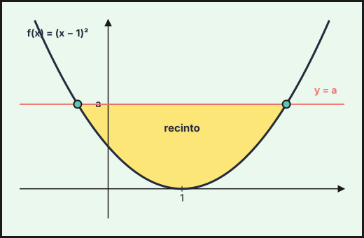{fig-alt="Recinto limitado por la parábola f(x)=(x−1)² y la recta y=a (a>0), con los cortes en x=1±√a" width="75%" fig-align="center"}

**b) Valor de $a$.**
1. Se traslada el recinto con $t=x-1$: ahora la parábola es $t^2$ y los límites son $-\sqrt a$ y $\sqrt a$.
2. Área (recta menos parábola), con simetría respecto de $t=0$:
$$A=\int_{-\sqrt a}^{\sqrt a}\big(a-t^2\big)dt=2\left[at-\frac{t^3}{3}\right]_0^{\sqrt a}=\frac43a^{3/2}.$$
3. Se iguala al área dada: $\dfrac43a^{3/2}=\dfrac43\Rightarrow a^{3/2}=1$.

**$a=1$.**
::::
:::::

::::: {.ebau-ej #ebau-2025-ord-sup1-3}
**Ejercicio 3** · Ordinaria · Suplente 1 2025 · Bloque optativo 1 · *(2,5 puntos)* · [Examen A](../../../assets/pau/2025-ord-sup1/examen-a.pdf){target="_blank"} · [Examen B](../../../assets/pau/2025-ord-sup1/examen-b.pdf){target="_blank"}

Considera la función

$$f(x)=\begin{cases}x\operatorname{sen}(2x) & \text{si } x\le 0\\\cos(\pi x)-1 & \text{si } x>0\end{cases}$$

Calcula $\displaystyle\int_{-\pi/4}^{1}f(x)\,dx$.

:::: {.callout-note collapse="true" appearance="simple"}
## Ayuda 1 · Recordatorio

**Integrales: cambio de variable, partes y fracciones simples.**

**Cambio de variable:** $t=g(x)$, $dt=g'(x)\,dx$. **Por partes:** $\int u\,dv=u\,v-\int v\,du$ (regla ALPES: arcos, logaritmos, polinomios, exponenciales, senos). **Racionales:** si el grado del numerador es mayor o igual que el del denominador, se divide; después se descompone en fracciones simples $\dfrac{A}{x-a}+\dfrac{B}{x-b}$.

**Integral definida (regla de Barrow).**

Regla de Barrow: $\int_a^b f(x)\,dx=F(b)-F(a)$, con $F$ una primitiva de $f$. Si $f\ge0$ en $[a,b]$, la integral es el área bajo la curva; si $f\le0$, es el área cambiada de signo.

**Primitivas inmediatas.**

$\int x^n\,dx=\dfrac{x^{n+1}}{n+1}+C\ (n\neq-1)$; $\int\dfrac{1}{x}\,dx=\ln|x|+C$; $\int e^{kx}\,dx=\dfrac{e^{kx}}{k}+C$; $\int\dfrac{u'}{u}\,dx=\ln|u|+C$; $\int\sin x\,dx=-\cos x+C$; $\int\cos x\,dx=\sin x+C$. Linealidad: $\int(af+bg)=a\int f+b\int g$. Para $F(x)$ con $F(a)=b$ se usa la constante $C$.
::::

:::: {.callout-note collapse="true" appearance="simple"}
## Ayuda 2 · Método

**Integrales: cambio de variable, partes y fracciones simples.**

1. Decide el método: ¿hay una función y su derivada (cambio de variable)?, ¿un producto de tipos distintos (partes)?, ¿un cociente de polinomios (fracciones simples)?
2. Aplica el método y simplifica; si es por partes, elige $u$ y $dv$ y repite si es necesario.
3. Deshaz el cambio y añade $+C$.
4. Si es definida, cambia los límites con la variable o deshaz el cambio antes de aplicar Barrow.
5. Comprueba derivando.

**Integral definida (regla de Barrow).**

1. Halla una primitiva $F$.
2. Evalúa $F(b)-F(a)$ cuidando los signos y las fracciones.
3. Interpreta el signo del resultado.

**Primitivas inmediatas.**

1. Reescribe el integrando como suma de potencias (separa fracciones, pasa raíces a exponente fraccionario).
2. Integra término a término.
3. Si piden una primitiva concreta, impón la condición $F(a)=b$ para hallar $C$.
4. Deriva el resultado para comprobarlo.
::::

:::: {.callout-tip collapse="true" appearance="simple"}
## Solución

**Planteamiento.** Se parte la integral en $x=0$, donde cambia la expresión de $f$.

1. **Tramo $x\le0$** (por partes, con $u=x$ y $dv=\operatorname{sen}(2x)\,dx$):
$$\int_{-\pi/4}^{0}x\operatorname{sen}(2x)dx=\Big[-\dfrac{x\cos2x}{2}+\dfrac{\operatorname{sen}2x}{4}\Big]_{-\pi/4}^{0}=0-\Big(0-\dfrac14\Big)=\dfrac14.$$
(En $-\pi/4$: $\cos\left(-\dfrac\pi2\right)=0$ y $\operatorname{sen}\left(-\dfrac\pi2\right)=-1$.)
2. **Tramo $x>0$:**
$$\int_0^1(\cos\pi x-1)dx=\Big[\dfrac{\operatorname{sen}\pi x}{\pi}-x\Big]_0^1=-1.$$
3. **Suma:**
$$\int_{-\pi/4}^1f=\frac14-1=\mathbf{-\frac34}.$$

*Interpretación:* es una integral con signo; en el tramo $x>0$ la función es negativa y su parte negativa pesa más que el tramo positivo.
::::
:::::

### Ordinaria · Suplente 2 2025

::::: {.ebau-ej #ebau-2025-ord-sup2-2}
**Ejercicio 2** · Ordinaria · Suplente 2 2025 · Bloque optativo 1 · *(2,5 puntos)* · [Examen A](../../../assets/pau/2025-ord-sup2/examen-a.pdf){target="_blank"} · [Examen B](../../../assets/pau/2025-ord-sup2/examen-b.pdf){target="_blank"}

Calcula $\displaystyle\int_{\sqrt{3}}^{2}\dfrac{4x}{x^{4}-6x^{2}+10}\,dx$. (Sugerencia: efectúa el cambio de variable $t=x^{2}-3$).

:::: {.callout-note collapse="true" appearance="simple"}
## Ayuda 1 · Recordatorio

**Integrales: cambio de variable, partes y fracciones simples.**

**Cambio de variable:** $t=g(x)$, $dt=g'(x)\,dx$. **Por partes:** $\int u\,dv=u\,v-\int v\,du$ (regla ALPES: arcos, logaritmos, polinomios, exponenciales, senos). **Racionales:** si el grado del numerador es mayor o igual que el del denominador, se divide; después se descompone en fracciones simples $\dfrac{A}{x-a}+\dfrac{B}{x-b}$.

**Integral definida (regla de Barrow).**

Regla de Barrow: $\int_a^b f(x)\,dx=F(b)-F(a)$, con $F$ una primitiva de $f$. Si $f\ge0$ en $[a,b]$, la integral es el área bajo la curva; si $f\le0$, es el área cambiada de signo.
::::

:::: {.callout-note collapse="true" appearance="simple"}
## Ayuda 2 · Método

**Integrales: cambio de variable, partes y fracciones simples.**

1. Decide el método: ¿hay una función y su derivada (cambio de variable)?, ¿un producto de tipos distintos (partes)?, ¿un cociente de polinomios (fracciones simples)?
2. Aplica el método y simplifica; si es por partes, elige $u$ y $dv$ y repite si es necesario.
3. Deshaz el cambio y añade $+C$.
4. Si es definida, cambia los límites con la variable o deshaz el cambio antes de aplicar Barrow.
5. Comprueba derivando.

**Integral definida (regla de Barrow).**

1. Halla una primitiva $F$.
2. Evalúa $F(b)-F(a)$ cuidando los signos y las fracciones.
3. Interpreta el signo del resultado.
::::

:::: {.callout-tip collapse="true" appearance="simple"}
## Solución

**Cambio de variable.**
1. Se toma $t=x^2-3$: $dt=2x\,dx$, luego $4x\,dx=2\,dt$.
2. El denominador queda como una suma de cuadrados: $x^4-6x^2+10=(x^2-3)^2+1=t^2+1$.
3. Límites: $x=\sqrt3\to t=0$ y $x=2\to t=1$.
4. Se integra (arcotangente):
$$\int_0^1\frac{2\,dt}{t^2+1}=2\big[\operatorname{arctg}t\big]_0^1=2\cdot\frac\pi4=\mathbf{\frac\pi2}.$$
::::
:::::

::::: {.ebau-ej #ebau-2025-ord-sup2-3}
**Ejercicio 3** · Ordinaria · Suplente 2 2025 · Bloque optativo 1 · *(2,5 puntos)* · [Examen A](../../../assets/pau/2025-ord-sup2/examen-a.pdf){target="_blank"} · [Examen B](../../../assets/pau/2025-ord-sup2/examen-b.pdf){target="_blank"}

Sean las funciones $f,g:\mathbb{R}\to\mathbb{R}$ definidas por $f(x)=x^{3}-x$ y $g(x)=-x^{2}+1$.

a) Halla los puntos de corte (abscisas donde se obtienen y valores que se alcanzan) de las gráficas de $f$ y $g$. Realiza un esbozo del recinto acotado y limitado por dichas gráficas. *(1 punto)*

b) Calcula el área del recinto acotado y limitado por las gráficas de $f$ y $g$. *(1,5 puntos)*

:::: {.callout-note collapse="true" appearance="simple"}
## Ayuda 1 · Recordatorio

**Área de un recinto.**

Área entre $y=f(x)$ y el eje $X$: $\int_a^b|f(x)|\,dx$, partiendo en los puntos donde $f$ cambia de signo. Área entre dos curvas: $\int_a^b\left(f(x)-g(x)\right)dx$ con $f\ge g$. Los límites de integración son las abscisas de corte.

**Integral definida (regla de Barrow).**

Regla de Barrow: $\int_a^b f(x)\,dx=F(b)-F(a)$, con $F$ una primitiva de $f$. Si $f\ge0$ en $[a,b]$, la integral es el área bajo la curva; si $f\le0$, es el área cambiada de signo.

**Primitivas inmediatas.**

$\int x^n\,dx=\dfrac{x^{n+1}}{n+1}+C\ (n\neq-1)$; $\int\dfrac{1}{x}\,dx=\ln|x|+C$; $\int e^{kx}\,dx=\dfrac{e^{kx}}{k}+C$; $\int\dfrac{u'}{u}\,dx=\ln|u|+C$; $\int\sin x\,dx=-\cos x+C$; $\int\cos x\,dx=\sin x+C$. Linealidad: $\int(af+bg)=a\int f+b\int g$. Para $F(x)$ con $F(a)=b$ se usa la constante $C$.

**Representar una función.**

Una gráfica se construye con: dominio, cortes con los ejes, asíntotas, monotonía y extremos (con $f'$), curvatura y puntos de inflexión (con $f''$), y una tabla de valores. Convexa si $f''>0$ y cóncava si $f''<0$.
::::

:::: {.callout-note collapse="true" appearance="simple"}
## Ayuda 2 · Método

**Área de un recinto.**

1. Haz un esbozo del recinto.
2. Calcula los puntos de corte (resolviendo $f=g$ o $f=0$): son los límites.
3. Decide qué función va por encima en cada tramo; si se cruzan, parte la integral.
4. Aplica Barrow y da el área en $\text{u}^2$, siempre positiva.

**Integral definida (regla de Barrow).**

1. Halla una primitiva $F$.
2. Evalúa $F(b)-F(a)$ cuidando los signos y las fracciones.
3. Interpreta el signo del resultado.

**Primitivas inmediatas.**

1. Reescribe el integrando como suma de potencias (separa fracciones, pasa raíces a exponente fraccionario).
2. Integra término a término.
3. Si piden una primitiva concreta, impón la condición $F(a)=b$ para hallar $C$.
4. Deriva el resultado para comprobarlo.

**Representar una función.**

1. Dominio y cortes.
2. Asíntotas verticales, horizontales y oblicuas con límites.
3. Signo de $f'$: intervalos de crecimiento y extremos.
4. Signo de $f''$ si hace falta, y unos cuantos puntos.
5. Dibuja y comprueba que la gráfica respeta todos los datos anteriores.
::::

:::: {.callout-tip collapse="true" appearance="simple"}
## Solución

**a) Puntos de corte y esbozo.**
1. Se igualan: $x^3-x=-x^2+1\Rightarrow x^3+x^2-x-1=0$.
2. Se factoriza: $x^3+x^2-x-1=(x+1)^2(x-1)=0$.
3. Cortes en $x=-1$ (raíz doble: las gráficas son tangentes) y $x=1$. En ambos $f=g=0$.

**Puntos $(-1,0)$ y $(1,0)$.**

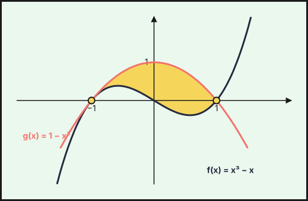{fig-alt="Recinto entre f(x)=x³−x y g(x)=1−x², que se cortan en (−1,0) (tangentes) y (1,0)" width="75%" fig-align="center"}

4. Esbozo: $g$ es una parábola con vértice $(0,1)$ y cortes con $OX$ en $\pm1$; $f$ es una cúbica que pasa por $(-1,0)$, $(0,0)$ y $(1,0)$ (máximo local en $x=-1/\sqrt3$). En $(-1,1)$ la parábola queda por encima de la cúbica.

**b) Área.**
1. En $[-1,1]$, $g\ge f$ (se comprueba en $x=0$: $g(0)=1>f(0)=0$), y $g-f=-(x-1)(x+1)^2\ge0$.
2. La integral de la diferencia es:
$$A=\int_{-1}^{1}(-x^3-x^2+x+1)\,dx=2\int_0^1(-x^2+1)\,dx=2\cdot\frac23=\mathbf{\frac43}\ u^2.$$
(Los términos impares $-x^3$ y $x$ se anulan por la simetría del intervalo.)
::::
:::::

### Extraordinaria 2025

::::: {.ebau-ej #ebau-2025-ext-2}
**Ejercicio 2** · Extraordinaria 2025 · Bloque optativo 1 · *(2,5 puntos)* · [PDF del examen](https://www.ebaumatematicas.com/wp-content/uploads/2025/07/2oBachCC_EBAU_Andalucia_2025-Extraordinaria.pdf){target="_blank"}

Considera la función $f:\mathbb{R}\to\mathbb{R}$ definida por $f(x)=\dfrac{1}{x^{2}+2x+2}$. Calcula una primitiva de $f$ cuya gráfica pase por el punto $\left(0,\dfrac{\pi}{4}\right)$.

:::: {.callout-note collapse="true" appearance="simple"}
## Ayuda 1 · Recordatorio

**Integral definida (regla de Barrow).**

Regla de Barrow: $\int_a^b f(x)\,dx=F(b)-F(a)$, con $F$ una primitiva de $f$. Si $f\ge0$ en $[a,b]$, la integral es el área bajo la curva; si $f\le0$, es el área cambiada de signo.

**Primitivas inmediatas.**

$\int x^n\,dx=\dfrac{x^{n+1}}{n+1}+C\ (n\neq-1)$; $\int\dfrac{1}{x}\,dx=\ln|x|+C$; $\int e^{kx}\,dx=\dfrac{e^{kx}}{k}+C$; $\int\dfrac{u'}{u}\,dx=\ln|u|+C$; $\int\sin x\,dx=-\cos x+C$; $\int\cos x\,dx=\sin x+C$. Linealidad: $\int(af+bg)=a\int f+b\int g$. Para $F(x)$ con $F(a)=b$ se usa la constante $C$.
::::

:::: {.callout-note collapse="true" appearance="simple"}
## Ayuda 2 · Método

**Integral definida (regla de Barrow).**

1. Halla una primitiva $F$.
2. Evalúa $F(b)-F(a)$ cuidando los signos y las fracciones.
3. Interpreta el signo del resultado.

**Primitivas inmediatas.**

1. Reescribe el integrando como suma de potencias (separa fracciones, pasa raíces a exponente fraccionario).
2. Integra término a término.
3. Si piden una primitiva concreta, impón la condición $F(a)=b$ para hallar $C$.
4. Deriva el resultado para comprobarlo.
::::

:::: {.callout-tip collapse="true" appearance="simple"}
## Solución

**Planteamiento.** El denominador no tiene raíces reales, así que se completa el cuadrado y se obtiene una arcotangente.
1. Completando cuadrados: $x^2+2x+2=(x+1)^2+1$.
2. Primitivas:
$$F(x)=\int\frac{dx}{(x+1)^2+1}=\operatorname{arctg}(x+1)+C.$$
3. Condición $F(0)=\dfrac\pi4$: $F(0)=\operatorname{arctg}1+C=\dfrac\pi4+C=\dfrac\pi4\Rightarrow C=0$.

**$F(x)=\operatorname{arctg}(x+1)$.**
::::
:::::

::::: {.ebau-ej #ebau-2025-ext-3}
**Ejercicio 3** · Extraordinaria 2025 · Bloque optativo 1 · *(2,5 puntos)* · [PDF del examen](https://www.ebaumatematicas.com/wp-content/uploads/2025/07/2oBachCC_EBAU_Andalucia_2025-Extraordinaria.pdf){target="_blank"}

Calcula el valor de $k$ para que $\displaystyle\int_{1}^{3}e^{x-k}(x-2)\,dx=2$.

:::: {.callout-note collapse="true" appearance="simple"}
## Ayuda 1 · Recordatorio

**Integrales: cambio de variable, partes y fracciones simples.**

**Cambio de variable:** $t=g(x)$, $dt=g'(x)\,dx$. **Por partes:** $\int u\,dv=u\,v-\int v\,du$ (regla ALPES: arcos, logaritmos, polinomios, exponenciales, senos). **Racionales:** si el grado del numerador es mayor o igual que el del denominador, se divide; después se descompone en fracciones simples $\dfrac{A}{x-a}+\dfrac{B}{x-b}$.

**Integral definida (regla de Barrow).**

Regla de Barrow: $\int_a^b f(x)\,dx=F(b)-F(a)$, con $F$ una primitiva de $f$. Si $f\ge0$ en $[a,b]$, la integral es el área bajo la curva; si $f\le0$, es el área cambiada de signo.

**Hallar parámetros de una función.**

Cada dato del enunciado da una ecuación: pasa por $(a,b)\Rightarrow f(a)=b$; extremo en $x=a\Rightarrow f'(a)=0$; pendiente $m$ en $x=a\Rightarrow f'(a)=m$; inflexión en $x=a\Rightarrow f''(a)=0$; área o integral dada $\Rightarrow$ igualar la integral.
::::

:::: {.callout-note collapse="true" appearance="simple"}
## Ayuda 2 · Método

**Integrales: cambio de variable, partes y fracciones simples.**

1. Decide el método: ¿hay una función y su derivada (cambio de variable)?, ¿un producto de tipos distintos (partes)?, ¿un cociente de polinomios (fracciones simples)?
2. Aplica el método y simplifica; si es por partes, elige $u$ y $dv$ y repite si es necesario.
3. Deshaz el cambio y añade $+C$.
4. Si es definida, cambia los límites con la variable o deshaz el cambio antes de aplicar Barrow.
5. Comprueba derivando.

**Integral definida (regla de Barrow).**

1. Halla una primitiva $F$.
2. Evalúa $F(b)-F(a)$ cuidando los signos y las fracciones.
3. Interpreta el signo del resultado.

**Hallar parámetros de una función.**

1. Lista los datos y escribe una ecuación por cada uno.
2. Resuelve el sistema (suele ser lineal en los parámetros).
3. Comprueba que la función resultante cumple todo, y que el extremo es del tipo pedido.
::::

:::: {.callout-tip collapse="true" appearance="simple"}
## Solución

**Planteamiento.** Se integra por partes y se impone el valor de la integral definida.
1. Se saca el factor constante: $e^{x-k}=e^{-k}e^{x}$.
2. Por partes con $u=x-2$ y $dv=e^{x}dx$ (luego $du=dx$ y $v=e^{x}$):
$$\int e^{x-k}(x-2)\,dx=e^{-k}\big[(x-2)e^{x}-e^{x}\big]=e^{-k}(x-3)e^{x}.$$
3. Barrow entre $1$ y $3$:
$$\int_1^3=e^{-k}\big[0-(-2e)\big]=2e^{1-k}.$$
4. Se iguala a $2$: $2e^{1-k}=2\Rightarrow e^{1-k}=1\Rightarrow1-k=0$.

**$k=1$.**
::::
:::::

### Extraordinaria · Suplente 1 2025

::::: {.ebau-ej #ebau-2025-ext-sup1-1}
**Ejercicio 1** · Extraordinaria · Suplente 1 2025 · Parte obligatoria · *(2,5 puntos)* · [PDF del examen](https://www.ebaumatematicas.com/wp-content/uploads/2025/07/2oBachCC_EBAU_Andalucia_2025-Extraordinaria_Suplente.pdf){target="_blank"}

Sea $f:\mathbb{R}\to\mathbb{R}$ la función definida por $f(x)=\dfrac{x^{3}+1}{x^{2}+1}$. Calcula una primitiva de $f$ cuya gráfica pase por el punto $(0,5)$.

:::: {.callout-note collapse="true" appearance="simple"}
## Ayuda 1 · Recordatorio

**Integral definida (regla de Barrow).**

Regla de Barrow: $\int_a^b f(x)\,dx=F(b)-F(a)$, con $F$ una primitiva de $f$. Si $f\ge0$ en $[a,b]$, la integral es el área bajo la curva; si $f\le0$, es el área cambiada de signo.

**Primitivas inmediatas.**

$\int x^n\,dx=\dfrac{x^{n+1}}{n+1}+C\ (n\neq-1)$; $\int\dfrac{1}{x}\,dx=\ln|x|+C$; $\int e^{kx}\,dx=\dfrac{e^{kx}}{k}+C$; $\int\dfrac{u'}{u}\,dx=\ln|u|+C$; $\int\sin x\,dx=-\cos x+C$; $\int\cos x\,dx=\sin x+C$. Linealidad: $\int(af+bg)=a\int f+b\int g$. Para $F(x)$ con $F(a)=b$ se usa la constante $C$.
::::

:::: {.callout-note collapse="true" appearance="simple"}
## Ayuda 2 · Método

**Integral definida (regla de Barrow).**

1. Halla una primitiva $F$.
2. Evalúa $F(b)-F(a)$ cuidando los signos y las fracciones.
3. Interpreta el signo del resultado.

**Primitivas inmediatas.**

1. Reescribe el integrando como suma de potencias (separa fracciones, pasa raíces a exponente fraccionario).
2. Integra término a término.
3. Si piden una primitiva concreta, impón la condición $F(a)=b$ para hallar $C$.
4. Deriva el resultado para comprobarlo.
::::

:::: {.callout-tip collapse="true" appearance="simple"}
## Solución

**Planteamiento.** El grado del numerador es mayor que el del denominador: primero se divide y después se integra.
1. División: $x^3+1=x(x^2+1)-x+1$, luego
$$\frac{x^3+1}{x^2+1}=x-\frac{x-1}{x^2+1}=x-\frac{x}{x^2+1}+\frac{1}{x^2+1}.$$
2. Primitivas (inmediatas: potencia, logaritmo y arcotangente):
$$F(x)=\int f=\frac{x^2}{2}-\frac12\ln(x^2+1)+\operatorname{arctg}x+C.$$
3. Condición $F(0)=5$: $F(0)=0-0+0+C=C=5$.

**$F(x)=\dfrac{x^2}{2}-\dfrac12\ln(x^2+1)+\operatorname{arctg}x+5$.**
::::
:::::

### Extraordinaria · Suplente 2 2025

::::: {.ebau-ej #ebau-2025-ext-sup2-6}
**Ejercicio 6** · Extraordinaria · Suplente 2 2025 · Bloque optativo 3 · *(2,5 puntos)* · [PDF del examen](https://www.ebaumatematicas.com/wp-content/uploads/2025/07/2oBachCC_EBAU_Andalucia_2025-Extraordinaria_Suplente2.pdf){target="_blank"}

Considera las funciones $f,g:\mathbb{R}\to\mathbb{R}$ definidas por $f(x)=-e^{x}$ y $g(x)=-e^{-x}$.

a) Esboza las gráficas de dichas funciones. *(1 punto)*

b) Calcula la suma de las áreas de los recintos acotados y limitados por las gráficas de dichas funciones y las rectas $x=-1$ y $x=1$. *(1,5 puntos)*

:::: {.callout-note collapse="true" appearance="simple"}
## Ayuda 1 · Recordatorio

**Área de un recinto.**

Área entre $y=f(x)$ y el eje $X$: $\int_a^b|f(x)|\,dx$, partiendo en los puntos donde $f$ cambia de signo. Área entre dos curvas: $\int_a^b\left(f(x)-g(x)\right)dx$ con $f\ge g$. Los límites de integración son las abscisas de corte.

**Integrales: cambio de variable, partes y fracciones simples.**

**Cambio de variable:** $t=g(x)$, $dt=g'(x)\,dx$. **Por partes:** $\int u\,dv=u\,v-\int v\,du$ (regla ALPES: arcos, logaritmos, polinomios, exponenciales, senos). **Racionales:** si el grado del numerador es mayor o igual que el del denominador, se divide; después se descompone en fracciones simples $\dfrac{A}{x-a}+\dfrac{B}{x-b}$.

**Integral definida (regla de Barrow).**

Regla de Barrow: $\int_a^b f(x)\,dx=F(b)-F(a)$, con $F$ una primitiva de $f$. Si $f\ge0$ en $[a,b]$, la integral es el área bajo la curva; si $f\le0$, es el área cambiada de signo.

**Primitivas inmediatas.**

$\int x^n\,dx=\dfrac{x^{n+1}}{n+1}+C\ (n\neq-1)$; $\int\dfrac{1}{x}\,dx=\ln|x|+C$; $\int e^{kx}\,dx=\dfrac{e^{kx}}{k}+C$; $\int\dfrac{u'}{u}\,dx=\ln|u|+C$; $\int\sin x\,dx=-\cos x+C$; $\int\cos x\,dx=\sin x+C$. Linealidad: $\int(af+bg)=a\int f+b\int g$. Para $F(x)$ con $F(a)=b$ se usa la constante $C$.
::::

:::: {.callout-note collapse="true" appearance="simple"}
## Ayuda 2 · Método

**Área de un recinto.**

1. Haz un esbozo del recinto.
2. Calcula los puntos de corte (resolviendo $f=g$ o $f=0$): son los límites.
3. Decide qué función va por encima en cada tramo; si se cruzan, parte la integral.
4. Aplica Barrow y da el área en $\text{u}^2$, siempre positiva.

**Integrales: cambio de variable, partes y fracciones simples.**

1. Decide el método: ¿hay una función y su derivada (cambio de variable)?, ¿un producto de tipos distintos (partes)?, ¿un cociente de polinomios (fracciones simples)?
2. Aplica el método y simplifica; si es por partes, elige $u$ y $dv$ y repite si es necesario.
3. Deshaz el cambio y añade $+C$.
4. Si es definida, cambia los límites con la variable o deshaz el cambio antes de aplicar Barrow.
5. Comprueba derivando.

**Integral definida (regla de Barrow).**

1. Halla una primitiva $F$.
2. Evalúa $F(b)-F(a)$ cuidando los signos y las fracciones.
3. Interpreta el signo del resultado.

**Primitivas inmediatas.**

1. Reescribe el integrando como suma de potencias (separa fracciones, pasa raíces a exponente fraccionario).
2. Integra término a término.
3. Si piden una primitiva concreta, impón la condición $F(a)=b$ para hallar $C$.
4. Deriva el resultado para comprobarlo.
::::

:::: {.callout-tip collapse="true" appearance="simple"}
## Solución

**a) Gráficas.**
1. $f=-e^x$ es creciente y negativa, y tiende a $0$ en $-\infty$.
2. $g=-e^{-x}$ es decreciente y negativa, y tiende a $0$ en $+\infty$.
3. Ambas pasan por $(0,-1)$ (único corte entre ellas) y quedan por debajo del eje $OX$ (asíntota $y=0$).
4. $g$ queda por encima de $f$ para $x>0$ y por debajo para $x<0$.

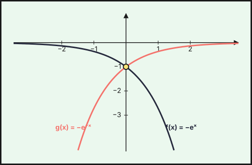{fig-alt="Gráficas de f(x)=−eˣ y g(x)=−e⁻ˣ, simétricas respecto del eje Y y con asíntota y=0" width="75%" fig-align="center"}

**b) Suma de las áreas.**
1. Las gráficas se cortan en $x=0$ y se piden dos recintos: entre $x=-1$ y $0$ y entre $0$ y $1$.
2. Son simétricos respecto del eje $OY$ (cada función es el reflejo de la otra), así que tienen la misma área.
3. En $[0,1]$, $g\ge f$ (pues $-e^{-x}\ge-e^{x}$ si $x\ge0$), luego el área es $\int_0^1(g-f)$ y la suma de las dos áreas es el doble:
$$A=2\int_0^1\big(-e^{-x}+e^{x}\big)dx=2\big[e^{x}+e^{-x}\big]_0^1=\mathbf{2\left(e+\dfrac1e-2\right)}\approx2{,}17\ u^2.$$
::::
:::::

## 2024

### Ordinaria 2024

::::: {.ebau-ej #ebau-2024-ord-3}
**Ejercicio 3** · Ordinaria 2024 · Bloque B · *(2,5 puntos)* · [Examen A](../../../assets/pau/2024-ord/examen-a.pdf){target="_blank"} · [Examen B](../../../assets/pau/2024-ord/examen-b.pdf){target="_blank"}

Considera la función $f$ definida por $f(x)=\dfrac{x^{3}+2}{x^{2}-1}$, para $x\neq -1$, $x\neq 1$. Calcula una primitiva de $f$ cuya gráfica pase por el punto $(0,1)$.

:::: {.callout-note collapse="true" appearance="simple"}
## Ayuda 1 · Recordatorio

**Integral definida (regla de Barrow).**

Regla de Barrow: $\int_a^b f(x)\,dx=F(b)-F(a)$, con $F$ una primitiva de $f$. Si $f\ge0$ en $[a,b]$, la integral es el área bajo la curva; si $f\le0$, es el área cambiada de signo.

**Primitivas inmediatas.**

$\int x^n\,dx=\dfrac{x^{n+1}}{n+1}+C\ (n\neq-1)$; $\int\dfrac{1}{x}\,dx=\ln|x|+C$; $\int e^{kx}\,dx=\dfrac{e^{kx}}{k}+C$; $\int\dfrac{u'}{u}\,dx=\ln|u|+C$; $\int\sin x\,dx=-\cos x+C$; $\int\cos x\,dx=\sin x+C$. Linealidad: $\int(af+bg)=a\int f+b\int g$. Para $F(x)$ con $F(a)=b$ se usa la constante $C$.
::::

:::: {.callout-note collapse="true" appearance="simple"}
## Ayuda 2 · Método

**Integral definida (regla de Barrow).**

1. Halla una primitiva $F$.
2. Evalúa $F(b)-F(a)$ cuidando los signos y las fracciones.
3. Interpreta el signo del resultado.

**Primitivas inmediatas.**

1. Reescribe el integrando como suma de potencias (separa fracciones, pasa raíces a exponente fraccionario).
2. Integra término a término.
3. Si piden una primitiva concreta, impón la condición $F(a)=b$ para hallar $C$.
4. Deriva el resultado para comprobarlo.
::::

:::: {.callout-tip collapse="true" appearance="simple"}
## Solución

**Primitiva con condición.**
1. El grado del numerador (3) supera al del denominador (2): se divide. $\dfrac{x^3+2}{x^2-1}=x+\dfrac{x+2}{x^2-1}$.
2. Se descompone en fracciones simples: $\dfrac{x+2}{(x-1)(x+1)}=\dfrac{3/2}{x-1}-\dfrac{1/2}{x+1}$ (comprobación: en $x=1$ el numerador vale $3$, entre $x+1=2$ da $\tfrac32$; en $x=-1$ vale $1$, entre $x-1=-2$ da $-\tfrac12$).
3. Se integra término a término: $F(x)=\dfrac{x^2}2+\dfrac32\ln|x-1|-\dfrac12\ln|x+1|+C$.
4. La condición $F(0)=1$ se aplica en el intervalo $(-1,1)$, que contiene a $x=0$: $F(0)=0+\tfrac32\ln1-\tfrac12\ln1+C=C=1$.

$$\mathbf{F(x)=\frac{x^2}2+\frac32\ln|x-1|-\frac12\ln|x+1|+1}$$
::::
:::::

::::: {.ebau-ej #ebau-2024-ord-4}
**Ejercicio 4** · Ordinaria 2024 · Bloque B · *(2,5 puntos)* · [Examen A](../../../assets/pau/2024-ord/examen-a.pdf){target="_blank"} · [Examen B](../../../assets/pau/2024-ord/examen-b.pdf){target="_blank"}

Halla la función $f:\mathbb{R}\to\mathbb{R}$ tal que $f''(x)=x\cos(x)$ y cuya gráfica pasa por los puntos $\left(0,\dfrac{\pi}{2}\right)$ y $(\pi,2\pi)$.

:::: {.callout-note collapse="true" appearance="simple"}
## Ayuda 1 · Recordatorio

**Cambio de variable:** $t=g(x)$, $dt=g'(x)\,dx$. **Por partes:** $\int u\,dv=u\,v-\int v\,du$ (regla ALPES: arcos, logaritmos, polinomios, exponenciales, senos). **Racionales:** si el grado del numerador es mayor o igual que el del denominador, se divide; después se descompone en fracciones simples $\dfrac{A}{x-a}+\dfrac{B}{x-b}$.
::::

:::: {.callout-note collapse="true" appearance="simple"}
## Ayuda 2 · Método

1. Decide el método: ¿hay una función y su derivada (cambio de variable)?, ¿un producto de tipos distintos (partes)?, ¿un cociente de polinomios (fracciones simples)?
2. Aplica el método y simplifica; si es por partes, elige $u$ y $dv$ y repite si es necesario.
3. Deshaz el cambio y añade $+C$.
4. Si es definida, cambia los límites con la variable o deshaz el cambio antes de aplicar Barrow.
5. Comprueba derivando.
::::

:::: {.callout-tip collapse="true" appearance="simple"}
## Solución

**Función a partir de su segunda derivada.**
1. Se integra una vez, por partes ($u=x$, $dv=\cos x\,dx$): $f'(x)=\int x\cos x\,dx=x\operatorname{sen}x+\cos x+C_1$.
2. Se integra otra vez. Como $\int x\operatorname{sen}x\,dx=-x\cos x+\operatorname{sen}x$ (otra vez por partes) y $\int\cos x\,dx=\operatorname{sen}x$:
$$f(x)=\int(x\operatorname{sen}x+\cos x)\,dx+C_1x=-x\cos x+2\operatorname{sen}x+C_1x+C_2.$$
3. Primer punto, $f(0)=\dfrac\pi2$: $f(0)=C_2=\dfrac\pi2$.
4. Segundo punto, $f(\pi)=2\pi$: $f(\pi)=\pi+C_1\pi+\dfrac\pi2=2\pi\Rightarrow C_1=\dfrac12$.

$$\mathbf{f(x)=-x\cos x+2\operatorname{sen}x+\frac x2+\frac\pi2}$$
::::
:::::

### Ordinaria · Reserva 2024

::::: {.ebau-ej #ebau-2024-ord-res-3}
**Ejercicio 3** · Ordinaria · Reserva 2024 · Bloque B · *(2,5 puntos)* · [Examen A](../../../assets/pau/2024-ord-res/examen-a.pdf){target="_blank"} · [Examen B](../../../assets/pau/2024-ord-res/examen-b.pdf){target="_blank"}

Considera la función $f:\mathbb{R}\to\mathbb{R}$ definida por $f(x)=x^{3}-6x^{2}+8x$.

a) Calcula los puntos de corte de la gráfica de $f$ con los ejes de coordenadas y esboza dicha gráfica. *(1 punto)*

b) Calcula la suma de las áreas de los recintos acotados y limitados por la gráfica de $f$ y el eje de abscisas. *(1,5 puntos)*

:::: {.callout-note collapse="true" appearance="simple"}
## Ayuda 1 · Recordatorio

**Área de un recinto.**

Área entre $y=f(x)$ y el eje $X$: $\int_a^b|f(x)|\,dx$, partiendo en los puntos donde $f$ cambia de signo. Área entre dos curvas: $\int_a^b\left(f(x)-g(x)\right)dx$ con $f\ge g$. Los límites de integración son las abscisas de corte.

**Integral definida (regla de Barrow).**

Regla de Barrow: $\int_a^b f(x)\,dx=F(b)-F(a)$, con $F$ una primitiva de $f$. Si $f\ge0$ en $[a,b]$, la integral es el área bajo la curva; si $f\le0$, es el área cambiada de signo.

**Primitivas inmediatas.**

$\int x^n\,dx=\dfrac{x^{n+1}}{n+1}+C\ (n\neq-1)$; $\int\dfrac{1}{x}\,dx=\ln|x|+C$; $\int e^{kx}\,dx=\dfrac{e^{kx}}{k}+C$; $\int\dfrac{u'}{u}\,dx=\ln|u|+C$; $\int\sin x\,dx=-\cos x+C$; $\int\cos x\,dx=\sin x+C$. Linealidad: $\int(af+bg)=a\int f+b\int g$. Para $F(x)$ con $F(a)=b$ se usa la constante $C$.

**Representar una función.**

Una gráfica se construye con: dominio, cortes con los ejes, asíntotas, monotonía y extremos (con $f'$), curvatura y puntos de inflexión (con $f''$), y una tabla de valores. Convexa si $f''>0$ y cóncava si $f''<0$.
::::

:::: {.callout-note collapse="true" appearance="simple"}
## Ayuda 2 · Método

**Área de un recinto.**

1. Haz un esbozo del recinto.
2. Calcula los puntos de corte (resolviendo $f=g$ o $f=0$): son los límites.
3. Decide qué función va por encima en cada tramo; si se cruzan, parte la integral.
4. Aplica Barrow y da el área en $\text{u}^2$, siempre positiva.

**Integral definida (regla de Barrow).**

1. Halla una primitiva $F$.
2. Evalúa $F(b)-F(a)$ cuidando los signos y las fracciones.
3. Interpreta el signo del resultado.

**Primitivas inmediatas.**

1. Reescribe el integrando como suma de potencias (separa fracciones, pasa raíces a exponente fraccionario).
2. Integra término a término.
3. Si piden una primitiva concreta, impón la condición $F(a)=b$ para hallar $C$.
4. Deriva el resultado para comprobarlo.

**Representar una función.**

1. Dominio y cortes.
2. Asíntotas verticales, horizontales y oblicuas con límites.
3. Signo de $f'$: intervalos de crecimiento y extremos.
4. Signo de $f''$ si hace falta, y unos cuantos puntos.
5. Dibuja y comprueba que la gráfica respeta todos los datos anteriores.
::::

:::: {.callout-tip collapse="true" appearance="simple"}
## Solución

**a) Cortes y esbozo.**
1. Se factoriza: $f(x)=x(x-2)(x-4)$.
2. **Cortes con el eje $OX$: $(0,0)$, $(2,0)$, $(4,0)$; con el eje $OY$: $(0,0)$** (porque $f(0)=0$).
3. Extremos: $f'(x)=3x^2-12x+8=0\Rightarrow x=2\pm\dfrac{2}{\sqrt3}$.
4. Forma: cúbica con $f\to-\infty$ a la izquierda y $+\infty$ a la derecha; $f>0$ en $(0,2)$ (máximo local en $x=2-\tfrac{2}{\sqrt3}\approx0{,}85$) y $f<0$ en $(2,4)$ (mínimo local en $x=2+\tfrac{2}{\sqrt3}\approx3{,}15$).

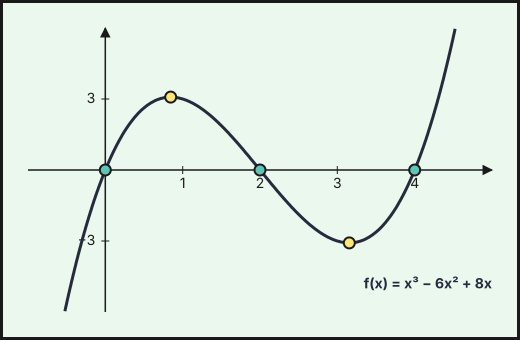{fig-alt="Gráfica de f(x)=x³−6x²+8x con cortes en x=0, 2 y 4 y sus extremos relativos" width="75%" fig-align="center"}

**b) Suma de las áreas.**
1. Hay dos recintos acotados: de $x=0$ a $x=2$ (sobre el eje) y de $x=2$ a $x=4$ (bajo el eje).
2. Primitiva: $F(x)=\dfrac{x^4}{4}-2x^3+4x^2$.
3. Barrow en cada tramo: $\int_0^2f=F(2)-F(0)=4$ y $\int_2^4f=F(4)-F(2)=0-4=-4$.
4. El área es siempre positiva, así que se toma el valor absoluto de cada tramo:

$$A=|4|+|-4|=\mathbf{8\ u^2}.$$

*Observación:* la integral de $0$ a $4$ vale $0$ (los dos recintos se compensan), pero el área total no.
::::
:::::

::::: {.ebau-ej #ebau-2024-ord-res-4}
**Ejercicio 4** · Ordinaria · Reserva 2024 · Bloque B · *(2,5 puntos)* · [Examen A](../../../assets/pau/2024-ord-res/examen-a.pdf){target="_blank"} · [Examen B](../../../assets/pau/2024-ord-res/examen-b.pdf){target="_blank"}

Calcula $\displaystyle\int\dfrac{e^{3x}-1}{e^{x}-3}\,dx$. (Sugerencia: efectúa el cambio de variable $t=e^{x}$.)

:::: {.callout-note collapse="true" appearance="simple"}
## Ayuda 1 · Recordatorio

**Integrales: cambio de variable, partes y fracciones simples.**

**Cambio de variable:** $t=g(x)$, $dt=g'(x)\,dx$. **Por partes:** $\int u\,dv=u\,v-\int v\,du$ (regla ALPES: arcos, logaritmos, polinomios, exponenciales, senos). **Racionales:** si el grado del numerador es mayor o igual que el del denominador, se divide; después se descompone en fracciones simples $\dfrac{A}{x-a}+\dfrac{B}{x-b}$.

**Primitivas inmediatas.**

$\int x^n\,dx=\dfrac{x^{n+1}}{n+1}+C\ (n\neq-1)$; $\int\dfrac{1}{x}\,dx=\ln|x|+C$; $\int e^{kx}\,dx=\dfrac{e^{kx}}{k}+C$; $\int\dfrac{u'}{u}\,dx=\ln|u|+C$; $\int\sin x\,dx=-\cos x+C$; $\int\cos x\,dx=\sin x+C$. Linealidad: $\int(af+bg)=a\int f+b\int g$. Para $F(x)$ con $F(a)=b$ se usa la constante $C$.
::::

:::: {.callout-note collapse="true" appearance="simple"}
## Ayuda 2 · Método

**Integrales: cambio de variable, partes y fracciones simples.**

1. Decide el método: ¿hay una función y su derivada (cambio de variable)?, ¿un producto de tipos distintos (partes)?, ¿un cociente de polinomios (fracciones simples)?
2. Aplica el método y simplifica; si es por partes, elige $u$ y $dv$ y repite si es necesario.
3. Deshaz el cambio y añade $+C$.
4. Si es definida, cambia los límites con la variable o deshaz el cambio antes de aplicar Barrow.
5. Comprueba derivando.

**Primitivas inmediatas.**

1. Reescribe el integrando como suma de potencias (separa fracciones, pasa raíces a exponente fraccionario).
2. Integra término a término.
3. Si piden una primitiva concreta, impón la condición $F(a)=b$ para hallar $C$.
4. Deriva el resultado para comprobarlo.
::::

:::: {.callout-tip collapse="true" appearance="simple"}
## Solución

**Cambio de variable.**
1. Con $t=e^x$: $dx=\dfrac{dt}{t}$.
2. La integral queda racional: $\displaystyle\int\frac{t^3-1}{t(t-3)}\,dt$.
3. Se divide (grado del numerador mayor): $\dfrac{t^3-1}{t(t-3)}=t+3+\dfrac{9t-1}{t(t-3)}$.
4. Fracciones simples: $\dfrac{9t-1}{t(t-3)}=\dfrac{1/3}{t}+\dfrac{26/3}{t-3}$.
5. Se integra y se deshace el cambio ($t=e^x$, $\ln t=x$):

$$\mathbf{\int\frac{e^{3x}-1}{e^x-3}\,dx=\frac{e^{2x}}2+3e^x+\frac x3+\frac{26}3\ln|e^x-3|+C}$$
::::
:::::

### Ordinaria · Suplente 2024

::::: {.ebau-ej #ebau-2024-ord-sup-3}
**Ejercicio 3** · Ordinaria · Suplente 2024 · Bloque B · *(2,5 puntos)* · [Examen A](../../../assets/pau/2024-ord-sup/examen-a.pdf){target="_blank"} · [Examen B](../../../assets/pau/2024-ord-sup/examen-b.pdf){target="_blank"}

Halla la función $f:(2,+\infty)\to\mathbb{R}$ que pasa por el punto $(3,-4\ln 5)$ y verifica $f'(x)=\dfrac{3x^{2}+4x+12}{x^{2}-4}$, donde $\ln$ denota la función logaritmo neperiano.

:::: {.callout-note collapse="true" appearance="simple"}
## Ayuda 1 · Recordatorio

**Cambio de variable:** $t=g(x)$, $dt=g'(x)\,dx$. **Por partes:** $\int u\,dv=u\,v-\int v\,du$ (regla ALPES: arcos, logaritmos, polinomios, exponenciales, senos). **Racionales:** si el grado del numerador es mayor o igual que el del denominador, se divide; después se descompone en fracciones simples $\dfrac{A}{x-a}+\dfrac{B}{x-b}$.
::::

:::: {.callout-note collapse="true" appearance="simple"}
## Ayuda 2 · Método

1. Decide el método: ¿hay una función y su derivada (cambio de variable)?, ¿un producto de tipos distintos (partes)?, ¿un cociente de polinomios (fracciones simples)?
2. Aplica el método y simplifica; si es por partes, elige $u$ y $dv$ y repite si es necesario.
3. Deshaz el cambio y añade $+C$.
4. Si es definida, cambia los límites con la variable o deshaz el cambio antes de aplicar Barrow.
5. Comprueba derivando.
::::

:::: {.callout-tip collapse="true" appearance="simple"}
## Solución

**Función a partir de su derivada.**
1. El grado del numerador es igual al del denominador: se divide. $\dfrac{3x^2+4x+12}{x^2-4}=3+\dfrac{4x+24}{x^2-4}$.
2. Fracciones simples con $x^2-4=(x-2)(x+2)$: $\dfrac{4x+24}{(x-2)(x+2)}=\dfrac{8}{x-2}-\dfrac{4}{x+2}$ (en $x=2$ el numerador vale $32$, entre $4$ da $8$; en $x=-2$ vale $16$, entre $-4$ da $-4$).
3. En $(2,+\infty)$ los argumentos son positivos: $f(x)=3x+8\ln(x-2)-4\ln(x+2)+C$.
4. Condición $f(3)=-4\ln5$: $9+0-4\ln5+C=-4\ln5$ (pues $\ln1=0$), de donde $C=-9$.

$$\mathbf{f(x)=3x-9+8\ln(x-2)-4\ln(x+2)}$$
::::
:::::

::::: {.ebau-ej #ebau-2024-ord-sup-4}
**Ejercicio 4** · Ordinaria · Suplente 2024 · Bloque B · *(2,5 puntos)* · [Examen A](../../../assets/pau/2024-ord-sup/examen-a.pdf){target="_blank"} · [Examen B](../../../assets/pau/2024-ord-sup/examen-b.pdf){target="_blank"}

Sea $f:\mathbb{R}\to\mathbb{R}$ la función definida por $f(x)=(x^{2}-3x+5)e^{x}$. Halla una primitiva de $f$ cuya gráfica pase por el punto $(0,5)$.

:::: {.callout-note collapse="true" appearance="simple"}
## Ayuda 1 · Recordatorio

**Integrales: cambio de variable, partes y fracciones simples.**

**Cambio de variable:** $t=g(x)$, $dt=g'(x)\,dx$. **Por partes:** $\int u\,dv=u\,v-\int v\,du$ (regla ALPES: arcos, logaritmos, polinomios, exponenciales, senos). **Racionales:** si el grado del numerador es mayor o igual que el del denominador, se divide; después se descompone en fracciones simples $\dfrac{A}{x-a}+\dfrac{B}{x-b}$.

**Integral definida (regla de Barrow).**

Regla de Barrow: $\int_a^b f(x)\,dx=F(b)-F(a)$, con $F$ una primitiva de $f$. Si $f\ge0$ en $[a,b]$, la integral es el área bajo la curva; si $f\le0$, es el área cambiada de signo.

**Primitivas inmediatas.**

$\int x^n\,dx=\dfrac{x^{n+1}}{n+1}+C\ (n\neq-1)$; $\int\dfrac{1}{x}\,dx=\ln|x|+C$; $\int e^{kx}\,dx=\dfrac{e^{kx}}{k}+C$; $\int\dfrac{u'}{u}\,dx=\ln|u|+C$; $\int\sin x\,dx=-\cos x+C$; $\int\cos x\,dx=\sin x+C$. Linealidad: $\int(af+bg)=a\int f+b\int g$. Para $F(x)$ con $F(a)=b$ se usa la constante $C$.
::::

:::: {.callout-note collapse="true" appearance="simple"}
## Ayuda 2 · Método

**Integrales: cambio de variable, partes y fracciones simples.**

1. Decide el método: ¿hay una función y su derivada (cambio de variable)?, ¿un producto de tipos distintos (partes)?, ¿un cociente de polinomios (fracciones simples)?
2. Aplica el método y simplifica; si es por partes, elige $u$ y $dv$ y repite si es necesario.
3. Deshaz el cambio y añade $+C$.
4. Si es definida, cambia los límites con la variable o deshaz el cambio antes de aplicar Barrow.
5. Comprueba derivando.

**Integral definida (regla de Barrow).**

1. Halla una primitiva $F$.
2. Evalúa $F(b)-F(a)$ cuidando los signos y las fracciones.
3. Interpreta el signo del resultado.

**Primitivas inmediatas.**

1. Reescribe el integrando como suma de potencias (separa fracciones, pasa raíces a exponente fraccionario).
2. Integra término a término.
3. Si piden una primitiva concreta, impón la condición $F(a)=b$ para hallar $C$.
4. Deriva el resultado para comprobarlo.
::::

:::: {.callout-tip collapse="true" appearance="simple"}
## Solución

**Primitiva con condición.** Se busca $F$ de la forma $(x^2+px+q)e^x$ (el integrando es un polinomio por $e^x$, y esa forma se conserva al integrar).
1. Se deriva: $F'=\big(x^2+(p+2)x+(p+q)\big)e^x$.
2. Se iguala a $(x^2-3x+5)e^x$: $p+2=-3$ y $p+q=5$, luego $p=-5$ y $q=10$. (El mismo resultado sale integrando por partes dos veces.)
3. Primitiva general: $F(x)=(x^2-5x+10)e^x+C$.
4. Condición $F(0)=5$: $10+C=5\Rightarrow C=-5$.

$$\mathbf{F(x)=(x^2-5x+10)e^x-5}$$
::::
:::::

### Extraordinaria 2024

::::: {.ebau-ej #ebau-2024-ext-3}
**Ejercicio 3** · Extraordinaria 2024 · Bloque B · *(2,5 puntos)* · [PDF del examen](https://www.ebaumatematicas.com/wp-content/uploads/2024/10/2oBachCC_EBAU_Andalucia_2024-Extraordinaria.pdf){target="_blank"}

Sean $f,g:\mathbb{R}\to\mathbb{R}$ las funciones definidas por $f(x)=-x^{2}+7$ y $g(x)=|x^{2}-1|$.

a) Halla los puntos de intersección de las gráficas de $f$ y $g$. Realiza un esbozo del recinto acotado y limitado por dichas gráficas. *(1 punto)*

b) Calcula el área de dicho recinto. *(1,5 puntos)*

:::: {.callout-note collapse="true" appearance="simple"}
## Ayuda 1 · Recordatorio

**Área de un recinto.**

Área entre $y=f(x)$ y el eje $X$: $\int_a^b|f(x)|\,dx$, partiendo en los puntos donde $f$ cambia de signo. Área entre dos curvas: $\int_a^b\left(f(x)-g(x)\right)dx$ con $f\ge g$. Los límites de integración son las abscisas de corte.

**Integral definida (regla de Barrow).**

Regla de Barrow: $\int_a^b f(x)\,dx=F(b)-F(a)$, con $F$ una primitiva de $f$. Si $f\ge0$ en $[a,b]$, la integral es el área bajo la curva; si $f\le0$, es el área cambiada de signo.

**Primitivas inmediatas.**

$\int x^n\,dx=\dfrac{x^{n+1}}{n+1}+C\ (n\neq-1)$; $\int\dfrac{1}{x}\,dx=\ln|x|+C$; $\int e^{kx}\,dx=\dfrac{e^{kx}}{k}+C$; $\int\dfrac{u'}{u}\,dx=\ln|u|+C$; $\int\sin x\,dx=-\cos x+C$; $\int\cos x\,dx=\sin x+C$. Linealidad: $\int(af+bg)=a\int f+b\int g$. Para $F(x)$ con $F(a)=b$ se usa la constante $C$.

**Representar una función.**

Una gráfica se construye con: dominio, cortes con los ejes, asíntotas, monotonía y extremos (con $f'$), curvatura y puntos de inflexión (con $f''$), y una tabla de valores. Convexa si $f''>0$ y cóncava si $f''<0$.
::::

:::: {.callout-note collapse="true" appearance="simple"}
## Ayuda 2 · Método

**Área de un recinto.**

1. Haz un esbozo del recinto.
2. Calcula los puntos de corte (resolviendo $f=g$ o $f=0$): son los límites.
3. Decide qué función va por encima en cada tramo; si se cruzan, parte la integral.
4. Aplica Barrow y da el área en $\text{u}^2$, siempre positiva.

**Integral definida (regla de Barrow).**

1. Halla una primitiva $F$.
2. Evalúa $F(b)-F(a)$ cuidando los signos y las fracciones.
3. Interpreta el signo del resultado.

**Primitivas inmediatas.**

1. Reescribe el integrando como suma de potencias (separa fracciones, pasa raíces a exponente fraccionario).
2. Integra término a término.
3. Si piden una primitiva concreta, impón la condición $F(a)=b$ para hallar $C$.
4. Deriva el resultado para comprobarlo.

**Representar una función.**

1. Dominio y cortes.
2. Asíntotas verticales, horizontales y oblicuas con límites.
3. Signo de $f'$: intervalos de crecimiento y extremos.
4. Signo de $f''$ si hace falta, y unos cuantos puntos.
5. Dibuja y comprueba que la gráfica respeta todos los datos anteriores.
::::

:::: {.callout-tip collapse="true" appearance="simple"}
## Solución

**a) Puntos de corte y esbozo.**
1. Se igualan las funciones. Si $|x|\ge1$, $g(x)=x^2-1$: $7-x^2=x^2-1\Rightarrow x=\pm2$.
2. Si $|x|<1$, $g(x)=1-x^2$: $7-x^2=1-x^2$ es imposible.
3. Ordenadas: $f(\pm2)=3$.

**Puntos de corte: $(-2,3)$ y $(2,3)$.**

4. Esbozo: parábola invertida de vértice $(0,7)$ por encima de la gráfica de $g$ (una «W» con mínimos $0$ en $x=\pm1$, máximo local $1$ en $x=0$ y ramas hacia arriba), entre $x=-2$ y $x=2$.

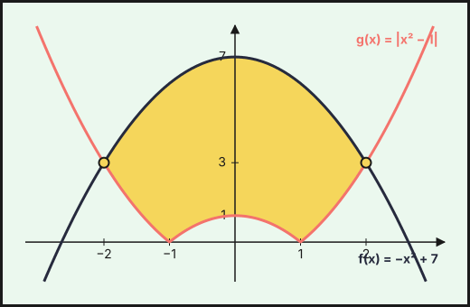{fig-alt="Recinto entre f(x)=−x²+7 y g(x)=|x²−1|, con cortes en (±2,3)" width="75%" fig-align="center"}

**b) Área.**
1. En $[-2,2]$, $f\ge g$. El recinto es simétrico respecto del eje $OY$: se calcula la mitad ($x\ge0$) y se duplica.
2. En $[0,2]$, $g$ cambia de expresión en $x=1$: $g=1-x^2$ en $[0,1]$ y $g=x^2-1$ en $[1,2]$.
3. Integrales: $\int_0^2(7-x^2)\,dx=\dfrac{34}{3}$, $\int_0^1(1-x^2)\,dx=\dfrac23$ y $\int_1^2(x^2-1)\,dx=\dfrac43$.
4. Área:
$$A=2\left[\int_0^2(7-x^2)\,dx-\int_0^1(1-x^2)\,dx-\int_1^2(x^2-1)\,dx\right]=2\left[\frac{34}{3}-\frac23-\frac43\right]=\mathbf{\frac{56}{3}\ u^2}.$$
::::
:::::

::::: {.ebau-ej #ebau-2024-ext-4}
**Ejercicio 4** · Extraordinaria 2024 · Bloque B · *(2,5 puntos)* · [PDF del examen](https://www.ebaumatematicas.com/wp-content/uploads/2024/10/2oBachCC_EBAU_Andalucia_2024-Extraordinaria.pdf){target="_blank"}

Halla $\displaystyle\int_{0}^{\pi/2}e^{x}\cos(x)\,dx$.

:::: {.callout-note collapse="true" appearance="simple"}
## Ayuda 1 · Recordatorio

**Integrales: cambio de variable, partes y fracciones simples.**

**Cambio de variable:** $t=g(x)$, $dt=g'(x)\,dx$. **Por partes:** $\int u\,dv=u\,v-\int v\,du$ (regla ALPES: arcos, logaritmos, polinomios, exponenciales, senos). **Racionales:** si el grado del numerador es mayor o igual que el del denominador, se divide; después se descompone en fracciones simples $\dfrac{A}{x-a}+\dfrac{B}{x-b}$.

**Integral definida (regla de Barrow).**

Regla de Barrow: $\int_a^b f(x)\,dx=F(b)-F(a)$, con $F$ una primitiva de $f$. Si $f\ge0$ en $[a,b]$, la integral es el área bajo la curva; si $f\le0$, es el área cambiada de signo.
::::

:::: {.callout-note collapse="true" appearance="simple"}
## Ayuda 2 · Método

**Integrales: cambio de variable, partes y fracciones simples.**

1. Decide el método: ¿hay una función y su derivada (cambio de variable)?, ¿un producto de tipos distintos (partes)?, ¿un cociente de polinomios (fracciones simples)?
2. Aplica el método y simplifica; si es por partes, elige $u$ y $dv$ y repite si es necesario.
3. Deshaz el cambio y añade $+C$.
4. Si es definida, cambia los límites con la variable o deshaz el cambio antes de aplicar Barrow.
5. Comprueba derivando.

**Integral definida (regla de Barrow).**

1. Halla una primitiva $F$.
2. Evalúa $F(b)-F(a)$ cuidando los signos y las fracciones.
3. Interpreta el signo del resultado.
::::

:::: {.callout-tip collapse="true" appearance="simple"}
## Solución

**Integral definida por partes.**
1. $\int e^x\cos x\,dx$ es cíclica: se hace por partes dos veces y reaparece la misma integral, que se despeja. El resultado es $\int e^x\cos x\,dx=\dfrac{e^x(\operatorname{sen}x+\cos x)}{2}$.
2. Se aplica Barrow de $0$ a $\pi/2$ con $\operatorname{sen}\frac\pi2=1$ y $\cos\frac\pi2=0$:
$$\int_0^{\pi/2}e^x\cos x\,dx=\frac{e^{\pi/2}(1+0)-(0+1)}{2}=\mathbf{\frac{e^{\pi/2}-1}{2}}.$$
::::
:::::

### Extraordinaria · Reserva 2024

::::: {.ebau-ej #ebau-2024-ext-res-3}
**Ejercicio 3** · Extraordinaria · Reserva 2024 · Bloque B · *(2,5 puntos)* · [PDF del examen](https://www.ebaumatematicas.com/wp-content/uploads/2025/02/2oBachCC_EBAU_Andalucia_2024-Extraordinaria_Reserva.pdf){target="_blank"}

Considera la función

$$f(x)=\begin{cases}1-e^{x} & \text{si } x\le 0\\ x\cos(x) & \text{si } x>0\end{cases}$$

Calcula $\displaystyle\int_{-\pi}^{\pi}f(x)\,dx$.

:::: {.callout-note collapse="true" appearance="simple"}
## Ayuda 1 · Recordatorio

**Integrales: cambio de variable, partes y fracciones simples.**

**Cambio de variable:** $t=g(x)$, $dt=g'(x)\,dx$. **Por partes:** $\int u\,dv=u\,v-\int v\,du$ (regla ALPES: arcos, logaritmos, polinomios, exponenciales, senos). **Racionales:** si el grado del numerador es mayor o igual que el del denominador, se divide; después se descompone en fracciones simples $\dfrac{A}{x-a}+\dfrac{B}{x-b}$.

**Integral definida (regla de Barrow).**

Regla de Barrow: $\int_a^b f(x)\,dx=F(b)-F(a)$, con $F$ una primitiva de $f$. Si $f\ge0$ en $[a,b]$, la integral es el área bajo la curva; si $f\le0$, es el área cambiada de signo.

**Primitivas inmediatas.**

$\int x^n\,dx=\dfrac{x^{n+1}}{n+1}+C\ (n\neq-1)$; $\int\dfrac{1}{x}\,dx=\ln|x|+C$; $\int e^{kx}\,dx=\dfrac{e^{kx}}{k}+C$; $\int\dfrac{u'}{u}\,dx=\ln|u|+C$; $\int\sin x\,dx=-\cos x+C$; $\int\cos x\,dx=\sin x+C$. Linealidad: $\int(af+bg)=a\int f+b\int g$. Para $F(x)$ con $F(a)=b$ se usa la constante $C$.
::::

:::: {.callout-note collapse="true" appearance="simple"}
## Ayuda 2 · Método

**Integrales: cambio de variable, partes y fracciones simples.**

1. Decide el método: ¿hay una función y su derivada (cambio de variable)?, ¿un producto de tipos distintos (partes)?, ¿un cociente de polinomios (fracciones simples)?
2. Aplica el método y simplifica; si es por partes, elige $u$ y $dv$ y repite si es necesario.
3. Deshaz el cambio y añade $+C$.
4. Si es definida, cambia los límites con la variable o deshaz el cambio antes de aplicar Barrow.
5. Comprueba derivando.

**Integral definida (regla de Barrow).**

1. Halla una primitiva $F$.
2. Evalúa $F(b)-F(a)$ cuidando los signos y las fracciones.
3. Interpreta el signo del resultado.

**Primitivas inmediatas.**

1. Reescribe el integrando como suma de potencias (separa fracciones, pasa raíces a exponente fraccionario).
2. Integra término a término.
3. Si piden una primitiva concreta, impón la condición $F(a)=b$ para hallar $C$.
4. Deriva el resultado para comprobarlo.
::::

:::: {.callout-tip collapse="true" appearance="simple"}
## Solución

**Integral de una función a trozos.**
1. Se parte en el punto de cambio, $x=0$: $\int_{-\pi}^{\pi}f=\int_{-\pi}^{0}(1-e^x)\,dx+\int_0^{\pi}x\cos x\,dx$.
2. Primer trozo:
$$\int_{-\pi}^{0}(1-e^x)\,dx=\Big[x-e^x\Big]_{-\pi}^{0}=-1-(-\pi-e^{-\pi})=\pi-1+e^{-\pi}.$$
3. Segundo trozo, por partes ($u=x$, $dv=\cos x\,dx$): $\int_0^{\pi}x\cos x\,dx=\big[x\operatorname{sen}x+\cos x\big]_0^{\pi}=-1-1=-2$.
4. Se suman:

$$\int_{-\pi}^{\pi}f(x)\,dx=\mathbf{\pi-3+e^{-\pi}}\approx 0{,}185.$$
::::
:::::

::::: {.ebau-ej #ebau-2024-ext-res-4}
**Ejercicio 4** · Extraordinaria · Reserva 2024 · Bloque B · *(2,5 puntos)* · [PDF del examen](https://www.ebaumatematicas.com/wp-content/uploads/2025/02/2oBachCC_EBAU_Andalucia_2024-Extraordinaria_Reserva.pdf){target="_blank"}

Calcula una primitiva de la función $f:(1,+\infty)\to\mathbb{R}$ definida por $f(x)=(x-1)^{2}\ln\dfrac{\sqrt{x-1}}{2}$ cuya gráfica pase por el punto $\left(5,-\dfrac72\right)$, donde $\ln$ denota la función logaritmo neperiano. (Sugerencia: efectúa el cambio de variable $x-1=t^{2}$).

:::: {.callout-note collapse="true" appearance="simple"}
## Ayuda 1 · Recordatorio

**Integrales: cambio de variable, partes y fracciones simples.**

**Cambio de variable:** $t=g(x)$, $dt=g'(x)\,dx$. **Por partes:** $\int u\,dv=u\,v-\int v\,du$ (regla ALPES: arcos, logaritmos, polinomios, exponenciales, senos). **Racionales:** si el grado del numerador es mayor o igual que el del denominador, se divide; después se descompone en fracciones simples $\dfrac{A}{x-a}+\dfrac{B}{x-b}$.

**Integral definida (regla de Barrow).**

Regla de Barrow: $\int_a^b f(x)\,dx=F(b)-F(a)$, con $F$ una primitiva de $f$. Si $f\ge0$ en $[a,b]$, la integral es el área bajo la curva; si $f\le0$, es el área cambiada de signo.

**Primitivas inmediatas.**

$\int x^n\,dx=\dfrac{x^{n+1}}{n+1}+C\ (n\neq-1)$; $\int\dfrac{1}{x}\,dx=\ln|x|+C$; $\int e^{kx}\,dx=\dfrac{e^{kx}}{k}+C$; $\int\dfrac{u'}{u}\,dx=\ln|u|+C$; $\int\sin x\,dx=-\cos x+C$; $\int\cos x\,dx=\sin x+C$. Linealidad: $\int(af+bg)=a\int f+b\int g$. Para $F(x)$ con $F(a)=b$ se usa la constante $C$.
::::

:::: {.callout-note collapse="true" appearance="simple"}
## Ayuda 2 · Método

**Integrales: cambio de variable, partes y fracciones simples.**

1. Decide el método: ¿hay una función y su derivada (cambio de variable)?, ¿un producto de tipos distintos (partes)?, ¿un cociente de polinomios (fracciones simples)?
2. Aplica el método y simplifica; si es por partes, elige $u$ y $dv$ y repite si es necesario.
3. Deshaz el cambio y añade $+C$.
4. Si es definida, cambia los límites con la variable o deshaz el cambio antes de aplicar Barrow.
5. Comprueba derivando.

**Integral definida (regla de Barrow).**

1. Halla una primitiva $F$.
2. Evalúa $F(b)-F(a)$ cuidando los signos y las fracciones.
3. Interpreta el signo del resultado.

**Primitivas inmediatas.**

1. Reescribe el integrando como suma de potencias (separa fracciones, pasa raíces a exponente fraccionario).
2. Integra término a término.
3. Si piden una primitiva concreta, impón la condición $F(a)=b$ para hallar $C$.
4. Deriva el resultado para comprobarlo.
::::

:::: {.callout-tip collapse="true" appearance="simple"}
## Solución

**Primitiva con condición.**
1. Cambio sugerido: $x-1=t^2$, luego $dx=2t\,dt$, $(x-1)^2=t^4$ y $\ln\dfrac{\sqrt{x-1}}{2}=\ln\dfrac t2$ (con $t>0$ porque $x>1$).
2. La integral queda $2\int t^5\ln\dfrac t2\,dt$. Se hace por partes con $u=\ln\dfrac t2$ y $dv=t^5\,dt$:
$$\int (x-1)^2\ln\frac{\sqrt{x-1}}2\,dx=2\int t^5\ln\frac t2\,dt=\frac{t^6}{3}\ln\frac t2-\int\frac{t^5}{3}\,dt=\frac{t^6}{3}\ln\frac t2-\frac{t^6}{18}+C.$$
3. Se deshace el cambio ($t^6=(x-1)^3$): $F(x)=\dfrac{(x-1)^3}{3}\ln\dfrac{\sqrt{x-1}}2-\dfrac{(x-1)^3}{18}+C$.
4. Condición $F(5)=-\dfrac72$: con $x=5$, $t=2$ y $\ln\dfrac22=\ln1=0$:
$F(5)=\frac{64}{3}\ln1-\frac{64}{18}+C=-\frac{32}{9}+C=-\frac72\Rightarrow C=\frac1{18}$.

$$\mathbf{F(x)=\frac{(x-1)^3}{3}\ln\frac{\sqrt{x-1}}2-\frac{(x-1)^3}{18}+\frac1{18}}$$
::::
:::::

### Extraordinaria · Suplente 2024

::::: {.ebau-ej #ebau-2024-ext-sup-3}
**Ejercicio 3** · Extraordinaria · Suplente 2024 · Bloque B · *(2,5 puntos)* · [PDF del examen](https://www.ebaumatematicas.com/wp-content/uploads/2025/02/2oBachCC_EBAU_Andalucia_2024-Extraordinaria_Suplente.pdf){target="_blank"}

Considera la función $f:\mathbb{R}\to\mathbb{R}$ definida por

$$f(x)=\int_{0}^{x}\cos(t)\operatorname{sen}^{2}(t)\,dt.$$

Determina las ecuaciones de la recta tangente y de la recta normal a la gráfica de $f$ en el punto de abscisa $x=\dfrac{\pi}{4}$.

*Relacionado también con:* [Derivadas](07-derivadas.qmd).

:::: {.callout-note collapse="true" appearance="simple"}
## Ayuda 1 · Recordatorio

**Integrales: cambio de variable, partes y fracciones simples.**

**Cambio de variable:** $t=g(x)$, $dt=g'(x)\,dx$. **Por partes:** $\int u\,dv=u\,v-\int v\,du$ (regla ALPES: arcos, logaritmos, polinomios, exponenciales, senos). **Racionales:** si el grado del numerador es mayor o igual que el del denominador, se divide; después se descompone en fracciones simples $\dfrac{A}{x-a}+\dfrac{B}{x-b}$.

**Integral definida (regla de Barrow).**

Regla de Barrow: $\int_a^b f(x)\,dx=F(b)-F(a)$, con $F$ una primitiva de $f$. Si $f\ge0$ en $[a,b]$, la integral es el área bajo la curva; si $f\le0$, es el área cambiada de signo.

**Primitivas inmediatas.**

$\int x^n\,dx=\dfrac{x^{n+1}}{n+1}+C\ (n\neq-1)$; $\int\dfrac{1}{x}\,dx=\ln|x|+C$; $\int e^{kx}\,dx=\dfrac{e^{kx}}{k}+C$; $\int\dfrac{u'}{u}\,dx=\ln|u|+C$; $\int\sin x\,dx=-\cos x+C$; $\int\cos x\,dx=\sin x+C$. Linealidad: $\int(af+bg)=a\int f+b\int g$. Para $F(x)$ con $F(a)=b$ se usa la constante $C$.

**Reglas de derivación.**

$(u\pm v)'=u'\pm v'$; $(u\cdot v)'=u'v+uv'$; $\left(\dfrac{u}{v}\right)'=\dfrac{u'v-uv'}{v^2}$; regla de la cadena $(f\circ g)'=f'(g)\cdot g'$. Básicas: $(x^n)'=nx^{n-1}$, $(e^{u})'=u'e^{u}$, $(\ln u)'=\dfrac{u'}{u}$.
::::

:::: {.callout-note collapse="true" appearance="simple"}
## Ayuda 2 · Método

**Integrales: cambio de variable, partes y fracciones simples.**

1. Decide el método: ¿hay una función y su derivada (cambio de variable)?, ¿un producto de tipos distintos (partes)?, ¿un cociente de polinomios (fracciones simples)?
2. Aplica el método y simplifica; si es por partes, elige $u$ y $dv$ y repite si es necesario.
3. Deshaz el cambio y añade $+C$.
4. Si es definida, cambia los límites con la variable o deshaz el cambio antes de aplicar Barrow.
5. Comprueba derivando.

**Integral definida (regla de Barrow).**

1. Halla una primitiva $F$.
2. Evalúa $F(b)-F(a)$ cuidando los signos y las fracciones.
3. Interpreta el signo del resultado.

**Primitivas inmediatas.**

1. Reescribe el integrando como suma de potencias (separa fracciones, pasa raíces a exponente fraccionario).
2. Integra término a término.
3. Si piden una primitiva concreta, impón la condición $F(a)=b$ para hallar $C$.
4. Deriva el resultado para comprobarlo.

**Reglas de derivación.**

1. Identifica la estructura: ¿suma, producto, cociente o función compuesta? Empieza por la operación «de fuera».
2. Aplica la regla y simplifica (saca factor común).
3. Comprueba un valor numérico si tienes dudas.
::::

:::: {.callout-tip collapse="true" appearance="simple"}
## Solución

**Tangente y normal a una función definida por una integral.**
1. Teorema fundamental del cálculo: $f'(x)=\cos x\operatorname{sen}^2x$.
2. Además, la integral se puede calcular (cambio $u=\operatorname{sen}t$): $f(x)=\dfrac{\operatorname{sen}^3x}{3}$.
3. Punto: $f\!\left(\frac\pi4\right)=\dfrac{(\sqrt2/2)^3}{3}=\dfrac{\sqrt2}{12}$.
4. Pendiente de la tangente: $f'\!\left(\frac\pi4\right)=\dfrac{\sqrt2}2\cdot\dfrac12=\dfrac{\sqrt2}{4}$.
5. Pendiente de la normal: $-\dfrac1{f'}=-\dfrac4{\sqrt2}=-2\sqrt2$.

**Tangente:** $y=\dfrac{\sqrt2}{12}+\dfrac{\sqrt2}{4}\left(x-\dfrac\pi4\right)$.

**Normal:** $y=\dfrac{\sqrt2}{12}-2\sqrt2\left(x-\dfrac\pi4\right)$ (pendiente $-1/f'=-4/\sqrt2=-2\sqrt2$).
::::
:::::

::::: {.ebau-ej #ebau-2024-ext-sup-4}
**Ejercicio 4** · Extraordinaria · Suplente 2024 · Bloque B · *(2,5 puntos)* · [PDF del examen](https://www.ebaumatematicas.com/wp-content/uploads/2025/02/2oBachCC_EBAU_Andalucia_2024-Extraordinaria_Suplente.pdf){target="_blank"}

Calcula $\displaystyle\int\dfrac{dx}{\sqrt{4+4e^{x}}}$. (Sugerencia: efectúa el cambio de variable $t=\sqrt{1+e^{x}}$).

:::: {.callout-note collapse="true" appearance="simple"}
## Ayuda 1 · Recordatorio

**Integrales: cambio de variable, partes y fracciones simples.**

**Cambio de variable:** $t=g(x)$, $dt=g'(x)\,dx$. **Por partes:** $\int u\,dv=u\,v-\int v\,du$ (regla ALPES: arcos, logaritmos, polinomios, exponenciales, senos). **Racionales:** si el grado del numerador es mayor o igual que el del denominador, se divide; después se descompone en fracciones simples $\dfrac{A}{x-a}+\dfrac{B}{x-b}$.

**Primitivas inmediatas.**

$\int x^n\,dx=\dfrac{x^{n+1}}{n+1}+C\ (n\neq-1)$; $\int\dfrac{1}{x}\,dx=\ln|x|+C$; $\int e^{kx}\,dx=\dfrac{e^{kx}}{k}+C$; $\int\dfrac{u'}{u}\,dx=\ln|u|+C$; $\int\sin x\,dx=-\cos x+C$; $\int\cos x\,dx=\sin x+C$. Linealidad: $\int(af+bg)=a\int f+b\int g$. Para $F(x)$ con $F(a)=b$ se usa la constante $C$.
::::

:::: {.callout-note collapse="true" appearance="simple"}
## Ayuda 2 · Método

**Integrales: cambio de variable, partes y fracciones simples.**

1. Decide el método: ¿hay una función y su derivada (cambio de variable)?, ¿un producto de tipos distintos (partes)?, ¿un cociente de polinomios (fracciones simples)?
2. Aplica el método y simplifica; si es por partes, elige $u$ y $dv$ y repite si es necesario.
3. Deshaz el cambio y añade $+C$.
4. Si es definida, cambia los límites con la variable o deshaz el cambio antes de aplicar Barrow.
5. Comprueba derivando.

**Primitivas inmediatas.**

1. Reescribe el integrando como suma de potencias (separa fracciones, pasa raíces a exponente fraccionario).
2. Integra término a término.
3. Si piden una primitiva concreta, impón la condición $F(a)=b$ para hallar $C$.
4. Deriva el resultado para comprobarlo.
::::

:::: {.callout-tip collapse="true" appearance="simple"}
## Solución

**Cambio de variable.**
1. Con $t=\sqrt{1+e^x}$: $e^x=t^2-1$, luego $e^x\,dx=2t\,dt$ y $dx=\dfrac{2t}{t^2-1}\,dt$.
2. Además $\sqrt{4+4e^x}=2\sqrt{1+e^x}=2t$.
3. La integral queda racional:
$$\int\frac{dx}{\sqrt{4+4e^x}}=\int\frac{1}{2t}\cdot\frac{2t}{t^2-1}\,dt=\int\frac{dt}{t^2-1}.$$
4. Fracciones simples: $\dfrac1{t^2-1}=\dfrac12\left(\dfrac1{t-1}-\dfrac1{t+1}\right)$, y se integra:
$$\int\frac{dt}{t^2-1}=\frac12\ln\left|\frac{t-1}{t+1}\right|+C.$$
5. Se deshace el cambio ($t=\sqrt{1+e^x}>1$, así que no hace falta el valor absoluto):

$$\mathbf{\frac12\ln\frac{\sqrt{1+e^x}-1}{\sqrt{1+e^x}+1}+C}$$
::::
:::::

## 2023

### Ordinaria 2023

::::: {.ebau-ej #ebau-2023-ord-3}
**Ejercicio 3** · Ordinaria 2023 · Bloque A · *(2,5 puntos)* · [Examen A](../../../assets/pau/2023-ord/examen-a.pdf){target="_blank"} · [Examen B](../../../assets/pau/2023-ord/examen-b.pdf){target="_blank"}

Considera la función $f:\mathbb{R}\to\mathbb{R}$, definida por $f(x)=x\,|x-1|$. Calcula el área del recinto limitado por la gráfica de dicha función y su recta tangente en el punto de abscisa $x=0$.

*Relacionado también con:* [Derivadas](07-derivadas.qmd).

:::: {.callout-note collapse="true" appearance="simple"}
## Ayuda 1 · Recordatorio

**Área de un recinto.**

Área entre $y=f(x)$ y el eje $X$: $\int_a^b|f(x)|\,dx$, partiendo en los puntos donde $f$ cambia de signo. Área entre dos curvas: $\int_a^b\left(f(x)-g(x)\right)dx$ con $f\ge g$. Los límites de integración son las abscisas de corte.

**Integral definida (regla de Barrow).**

Regla de Barrow: $\int_a^b f(x)\,dx=F(b)-F(a)$, con $F$ una primitiva de $f$. Si $f\ge0$ en $[a,b]$, la integral es el área bajo la curva; si $f\le0$, es el área cambiada de signo.

**Primitivas inmediatas.**

$\int x^n\,dx=\dfrac{x^{n+1}}{n+1}+C\ (n\neq-1)$; $\int\dfrac{1}{x}\,dx=\ln|x|+C$; $\int e^{kx}\,dx=\dfrac{e^{kx}}{k}+C$; $\int\dfrac{u'}{u}\,dx=\ln|u|+C$; $\int\sin x\,dx=-\cos x+C$; $\int\cos x\,dx=\sin x+C$. Linealidad: $\int(af+bg)=a\int f+b\int g$. Para $F(x)$ con $F(a)=b$ se usa la constante $C$.

**Reglas de derivación.**

$(u\pm v)'=u'\pm v'$; $(u\cdot v)'=u'v+uv'$; $\left(\dfrac{u}{v}\right)'=\dfrac{u'v-uv'}{v^2}$; regla de la cadena $(f\circ g)'=f'(g)\cdot g'$. Básicas: $(x^n)'=nx^{n-1}$, $(e^{u})'=u'e^{u}$, $(\ln u)'=\dfrac{u'}{u}$.
::::

:::: {.callout-note collapse="true" appearance="simple"}
## Ayuda 2 · Método

**Área de un recinto.**

1. Haz un esbozo del recinto.
2. Calcula los puntos de corte (resolviendo $f=g$ o $f=0$): son los límites.
3. Decide qué función va por encima en cada tramo; si se cruzan, parte la integral.
4. Aplica Barrow y da el área en $\text{u}^2$, siempre positiva.

**Integral definida (regla de Barrow).**

1. Halla una primitiva $F$.
2. Evalúa $F(b)-F(a)$ cuidando los signos y las fracciones.
3. Interpreta el signo del resultado.

**Primitivas inmediatas.**

1. Reescribe el integrando como suma de potencias (separa fracciones, pasa raíces a exponente fraccionario).
2. Integra término a término.
3. Si piden una primitiva concreta, impón la condición $F(a)=b$ para hallar $C$.
4. Deriva el resultado para comprobarlo.

**Reglas de derivación.**

1. Identifica la estructura: ¿suma, producto, cociente o función compuesta? Empieza por la operación «de fuera».
2. Aplica la regla y simplifica (saca factor común).
3. Comprueba un valor numérico si tienes dudas.
::::

:::: {.callout-tip collapse="true" appearance="simple"}
## Solución

**Área entre $f$ y su tangente en $x=0$.**
1. Se quita el valor absoluto: $f(x)=x(1-x)$ para $x\le1$ y $f(x)=x(x-1)$ para $x>1$.
2. Tangente en $x=0$: $f(0)=0$ y $f'(0)=1$ (en $x\le1$, $f'(x)=1-2x$), luego $y=x$.
3. Puntos de corte de $f$ con la tangente: para $x\le1$, $x-x^{2}=x\Rightarrow x=0$; para $x>1$, $x^{2}-x=x\Rightarrow x=2$.
4. En $[0,2]$ la tangente queda por encima de $f$. En $[0,1]$ la diferencia es $x-(x-x^{2})=x^{2}$ y en $[1,2]$ es $x-(x^{2}-x)=2x-x^{2}$.
5. Se integra por tramos:
$$A=\int_0^1x^{2}dx+\int_1^2(2x-x^{2})dx=\dfrac13+\dfrac23.$$

**Área $=1\ \text{u}^2$.**
::::
:::::

### Ordinaria · Reserva 2023

::::: {.ebau-ej #ebau-2023-ord-res-3}
**Ejercicio 3** · Ordinaria · Reserva 2023 · Bloque A · *(2,5 puntos)* · [Examen A](../../../assets/pau/2023-ord-res/examen-a.pdf){target="_blank"} · [Examen B](../../../assets/pau/2023-ord-res/examen-b.pdf){target="_blank"}

Calcula $\displaystyle\int_{6}^{12}\dfrac{1}{9-x^{2}}\,dx$.

:::: {.callout-note collapse="true" appearance="simple"}
## Ayuda 1 · Recordatorio

Regla de Barrow: $\int_a^b f(x)\,dx=F(b)-F(a)$, con $F$ una primitiva de $f$. Si $f\ge0$ en $[a,b]$, la integral es el área bajo la curva; si $f\le0$, es el área cambiada de signo.
::::

:::: {.callout-note collapse="true" appearance="simple"}
## Ayuda 2 · Método

1. Halla una primitiva $F$.
2. Evalúa $F(b)-F(a)$ cuidando los signos y las fracciones.
3. Interpreta el signo del resultado.
::::

:::: {.callout-tip collapse="true" appearance="simple"}
## Solución

**Integral de una función racional.**
1. Se factoriza el denominador, $9-x^{2}=(3-x)(3+x)$, y se descompone en fracciones simples: $\dfrac1{9-x^{2}}=\dfrac16\left(\dfrac1{3-x}+\dfrac1{3+x}\right)$.
2. Primitiva: $\dfrac16\ln\left|\dfrac{3+x}{3-x}\right|$.
3. Regla de Barrow, con $x\in[6,12]$ (no se pasa por $x=3$, donde la función no está definida):
$$\int_6^{12}\dfrac{dx}{9-x^{2}}=\dfrac16\left(\ln\dfrac{15}{9}-\ln\dfrac93\right)=\dfrac16\ln\dfrac{5/3}{3}.$$

**Resultado: $\dfrac16\ln\dfrac59\approx-0{,}098$.**

*Interpretación:* es negativo porque $\dfrac1{9-x^{2}}<0$ para $x>3$.
::::
:::::

::::: {.ebau-ej #ebau-2023-ord-res-4}
**Ejercicio 4** · Ordinaria · Reserva 2023 · Bloque A · *(2,5 puntos)* · [Examen A](../../../assets/pau/2023-ord-res/examen-a.pdf){target="_blank"} · [Examen B](../../../assets/pau/2023-ord-res/examen-b.pdf){target="_blank"}

Considera la función $f:\mathbb{R}\to\mathbb{R}$ definida por $f(x)=x^{2}+1$.

a) Determina el punto de la gráfica de $f$ en el que la recta tangente es $y=4x-3$. *(0,75 puntos)*

b) Haz un esbozo del recinto limitado por la gráfica de $f$, la recta $y=4x-3$ y el eje de ordenadas. Calcula el área del recinto indicado. *(1,75 puntos)*

*Relacionado también con:* [Derivadas](07-derivadas.qmd).

:::: {.callout-note collapse="true" appearance="simple"}
## Ayuda 1 · Recordatorio

**Área de un recinto.**

Área entre $y=f(x)$ y el eje $X$: $\int_a^b|f(x)|\,dx$, partiendo en los puntos donde $f$ cambia de signo. Área entre dos curvas: $\int_a^b\left(f(x)-g(x)\right)dx$ con $f\ge g$. Los límites de integración son las abscisas de corte.

**Integral definida (regla de Barrow).**

Regla de Barrow: $\int_a^b f(x)\,dx=F(b)-F(a)$, con $F$ una primitiva de $f$. Si $f\ge0$ en $[a,b]$, la integral es el área bajo la curva; si $f\le0$, es el área cambiada de signo.

**Primitivas inmediatas.**

$\int x^n\,dx=\dfrac{x^{n+1}}{n+1}+C\ (n\neq-1)$; $\int\dfrac{1}{x}\,dx=\ln|x|+C$; $\int e^{kx}\,dx=\dfrac{e^{kx}}{k}+C$; $\int\dfrac{u'}{u}\,dx=\ln|u|+C$; $\int\sin x\,dx=-\cos x+C$; $\int\cos x\,dx=\sin x+C$. Linealidad: $\int(af+bg)=a\int f+b\int g$. Para $F(x)$ con $F(a)=b$ se usa la constante $C$.

**Representar una función.**

Una gráfica se construye con: dominio, cortes con los ejes, asíntotas, monotonía y extremos (con $f'$), curvatura y puntos de inflexión (con $f''$), y una tabla de valores. Convexa si $f''>0$ y cóncava si $f''<0$.
::::

:::: {.callout-note collapse="true" appearance="simple"}
## Ayuda 2 · Método

**Área de un recinto.**

1. Haz un esbozo del recinto.
2. Calcula los puntos de corte (resolviendo $f=g$ o $f=0$): son los límites.
3. Decide qué función va por encima en cada tramo; si se cruzan, parte la integral.
4. Aplica Barrow y da el área en $\text{u}^2$, siempre positiva.

**Integral definida (regla de Barrow).**

1. Halla una primitiva $F$.
2. Evalúa $F(b)-F(a)$ cuidando los signos y las fracciones.
3. Interpreta el signo del resultado.

**Primitivas inmediatas.**

1. Reescribe el integrando como suma de potencias (separa fracciones, pasa raíces a exponente fraccionario).
2. Integra término a término.
3. Si piden una primitiva concreta, impón la condición $F(a)=b$ para hallar $C$.
4. Deriva el resultado para comprobarlo.

**Representar una función.**

1. Dominio y cortes.
2. Asíntotas verticales, horizontales y oblicuas con límites.
3. Signo de $f'$: intervalos de crecimiento y extremos.
4. Signo de $f''$ si hace falta, y unos cuantos puntos.
5. Dibuja y comprueba que la gráfica respeta todos los datos anteriores.
::::

:::: {.callout-tip collapse="true" appearance="simple"}
## Solución

**a) Punto de tangencia.**
1. La pendiente de la tangente es $4$: $f'(x)=2x=4\Rightarrow x=2$.
2. Ordenada: $f(2)=5$, y la recta da $4\cdot2-3=5$, así que el punto es el de tangencia.

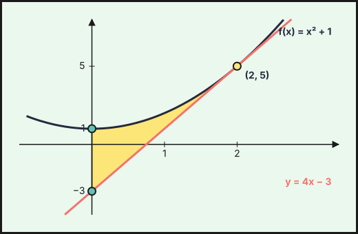{fig-alt="Recinto entre f(x)=x²+1, su tangente y=4x−3 en (2,5) y el eje de ordenadas" width="75%" fig-align="center"}

**Punto $(2,5)$.**

**b) Área del recinto.**
1. La parábola $y=x^{2}+1$ queda por encima de la recta, que es tangente en $x=2$.
2. El recinto está entre $x=0$ (eje de ordenadas) y $x=2$.
3. Se integra la diferencia, que es un cuadrado perfecto:
$$A=\int_0^2\left[(x^{2}+1)-(4x-3)\right]dx=\int_0^2(x-2)^{2}dx=\left[\dfrac{(x-2)^{3}}3\right]_0^2=\dfrac83.$$

**Área $=\dfrac83\ \text{u}^2$.**
::::
:::::

### Ordinaria · Suplente 2023

::::: {.ebau-ej #ebau-2023-ord-sup-3}
**Ejercicio 3** · Ordinaria · Suplente 2023 · Bloque A · *(2,5 puntos)* · [Examen A](../../../assets/pau/2023-ord-sup/examen-a.pdf){target="_blank"} · [Examen B](../../../assets/pau/2023-ord-sup/examen-b.pdf){target="_blank"}

Determina la función $f:(0,+\infty)\to\mathbb{R}$, sabiendo que es dos veces derivable, su gráfica pasa por el punto $(1,0)$, $f'(e)=e$ y $f''(x)=2\ln(x)+1$, para todo $x>0$ ($\ln$ denota la función logaritmo neperiano).

:::: {.callout-note collapse="true" appearance="simple"}
## Ayuda 1 · Recordatorio

**Cambio de variable:** $t=g(x)$, $dt=g'(x)\,dx$. **Por partes:** $\int u\,dv=u\,v-\int v\,du$ (regla ALPES: arcos, logaritmos, polinomios, exponenciales, senos). **Racionales:** si el grado del numerador es mayor o igual que el del denominador, se divide; después se descompone en fracciones simples $\dfrac{A}{x-a}+\dfrac{B}{x-b}$.
::::

:::: {.callout-note collapse="true" appearance="simple"}
## Ayuda 2 · Método

1. Decide el método: ¿hay una función y su derivada (cambio de variable)?, ¿un producto de tipos distintos (partes)?, ¿un cociente de polinomios (fracciones simples)?
2. Aplica el método y simplifica; si es por partes, elige $u$ y $dv$ y repite si es necesario.
3. Deshaz el cambio y añade $+C$.
4. Si es definida, cambia los límites con la variable o deshaz el cambio antes de aplicar Barrow.
5. Comprueba derivando.
::::

:::: {.callout-tip collapse="true" appearance="simple"}
## Solución

**Función a partir de su segunda derivada.**
1. Primera derivada: $f'(x)=\int(2\ln x+1)dx=2x\ln x-x+C$ (por partes: $\int2\ln x\,dx=2x\ln x-2x$).
2. Condición $f'(e)=e$: $2e-e+C=e\Rightarrow C=0$.
3. Función, integrando de nuevo por partes: $f(x)=\int(2x\ln x-x)dx=x^{2}\ln x-\dfrac{x^{2}}2-\dfrac{x^{2}}2+K=x^{2}\ln x-x^{2}+K$.
4. Condición $f(1)=0$: $-1+K=0\Rightarrow K=1$.

**$f(x)=x^{2}\ln x-x^{2}+1$.**
::::
:::::

::::: {.ebau-ej #ebau-2023-ord-sup-4}
**Ejercicio 4** · Ordinaria · Suplente 2023 · Bloque A · *(2,5 puntos)* · [Examen A](../../../assets/pau/2023-ord-sup/examen-a.pdf){target="_blank"} · [Examen B](../../../assets/pau/2023-ord-sup/examen-b.pdf){target="_blank"}

Considera las funciones $f,g:\mathbb{R}\to\mathbb{R}$ definidas por $f(x)=|x^{2}-1|$ y $g(x)=x+5$.

a) Calcula los puntos de corte de las gráficas de ambas funciones y esboza el recinto que determinan. *(1,25 puntos)*

b) Determina el área del recinto anterior. *(1,25 puntos)*

:::: {.callout-note collapse="true" appearance="simple"}
## Ayuda 1 · Recordatorio

**Área de un recinto.**

Área entre $y=f(x)$ y el eje $X$: $\int_a^b|f(x)|\,dx$, partiendo en los puntos donde $f$ cambia de signo. Área entre dos curvas: $\int_a^b\left(f(x)-g(x)\right)dx$ con $f\ge g$. Los límites de integración son las abscisas de corte.

**Integral definida (regla de Barrow).**

Regla de Barrow: $\int_a^b f(x)\,dx=F(b)-F(a)$, con $F$ una primitiva de $f$. Si $f\ge0$ en $[a,b]$, la integral es el área bajo la curva; si $f\le0$, es el área cambiada de signo.

**Primitivas inmediatas.**

$\int x^n\,dx=\dfrac{x^{n+1}}{n+1}+C\ (n\neq-1)$; $\int\dfrac{1}{x}\,dx=\ln|x|+C$; $\int e^{kx}\,dx=\dfrac{e^{kx}}{k}+C$; $\int\dfrac{u'}{u}\,dx=\ln|u|+C$; $\int\sin x\,dx=-\cos x+C$; $\int\cos x\,dx=\sin x+C$. Linealidad: $\int(af+bg)=a\int f+b\int g$. Para $F(x)$ con $F(a)=b$ se usa la constante $C$.

**Representar una función.**

Una gráfica se construye con: dominio, cortes con los ejes, asíntotas, monotonía y extremos (con $f'$), curvatura y puntos de inflexión (con $f''$), y una tabla de valores. Convexa si $f''>0$ y cóncava si $f''<0$.
::::

:::: {.callout-note collapse="true" appearance="simple"}
## Ayuda 2 · Método

**Área de un recinto.**

1. Haz un esbozo del recinto.
2. Calcula los puntos de corte (resolviendo $f=g$ o $f=0$): son los límites.
3. Decide qué función va por encima en cada tramo; si se cruzan, parte la integral.
4. Aplica Barrow y da el área en $\text{u}^2$, siempre positiva.

**Integral definida (regla de Barrow).**

1. Halla una primitiva $F$.
2. Evalúa $F(b)-F(a)$ cuidando los signos y las fracciones.
3. Interpreta el signo del resultado.

**Primitivas inmediatas.**

1. Reescribe el integrando como suma de potencias (separa fracciones, pasa raíces a exponente fraccionario).
2. Integra término a término.
3. Si piden una primitiva concreta, impón la condición $F(a)=b$ para hallar $C$.
4. Deriva el resultado para comprobarlo.

**Representar una función.**

1. Dominio y cortes.
2. Asíntotas verticales, horizontales y oblicuas con límites.
3. Signo de $f'$: intervalos de crecimiento y extremos.
4. Signo de $f''$ si hace falta, y unos cuantos puntos.
5. Dibuja y comprueba que la gráfica respeta todos los datos anteriores.
::::

:::: {.callout-tip collapse="true" appearance="simple"}
## Solución

**a) Cortes y recinto.**
1. Si $|x|\ge1$: $f(x)=x^{2}-1$ y $x^{2}-1=x+5\Rightarrow x^{2}-x-6=0\Rightarrow x=-2,\ 3$ (ambos cumplen $|x|\ge1$).
2. Si $|x|<1$: $f(x)=1-x^{2}$ y $1-x^{2}=x+5$ no tiene solución real.
3. Ordenadas: $g(-2)=3$ y $g(3)=8$.

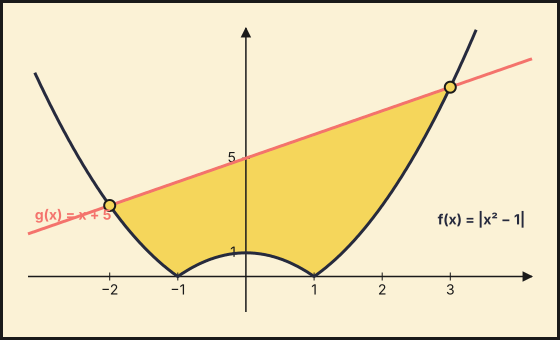{fig-alt="Recinto entre f(x)=|x²−1| y g(x)=x+5, con cortes en (−2,3) y (3,8)" width="75%" fig-align="center"}

**Puntos de corte: $(-2,3)$ y $(3,8)$.** El recinto está limitado por arriba por la recta $y=x+5$ y por abajo por $|x^{2}-1|$ (dos arcos de parábola hacia arriba y un arco invertido entre $-1$ y $1$).

**b) Área.**
1. Se parte la integral en los puntos $x=-1$ y $x=1$, donde cambia la expresión de $f$.
2. En $[-2,-1]$ y $[1,3]$ la distancia vertical es $x+5-(x^{2}-1)$; en $[-1,1]$ es $x+5-(1-x^{2})$:
$$A=\int_{-2}^{-1}(x+5-x^{2}+1)dx+\int_{-1}^{1}(x+5-1+x^{2})dx+\int_{1}^{3}(x+5-x^{2}+1)dx=\dfrac{13}6+\dfrac{26}3+\dfrac{22}3.$$

**Área $=\dfrac{109}6\ \text{u}^2$.**
::::
:::::

### Extraordinaria 2023

::::: {.ebau-ej #ebau-2023-ext-3}
**Ejercicio 3** · Extraordinaria 2023 · Bloque A · *(2,5 puntos)* · [PDF del examen](https://www.ebaumatematicas.com/wp-content/uploads/2023/10/2oBachCC_EBAU_Andalucia_2023-Extraordinaria.pdf){target="_blank"}

Calcula $a$ con $0<a<1$, tal que $\displaystyle\int_{a}^{1}\dfrac{\ln(x)}{x}\,dx+2=0$ ($\ln$ denota la función logaritmo neperiano).

:::: {.callout-note collapse="true" appearance="simple"}
## Ayuda 1 · Recordatorio

**Integrales: cambio de variable, partes y fracciones simples.**

**Cambio de variable:** $t=g(x)$, $dt=g'(x)\,dx$. **Por partes:** $\int u\,dv=u\,v-\int v\,du$ (regla ALPES: arcos, logaritmos, polinomios, exponenciales, senos). **Racionales:** si el grado del numerador es mayor o igual que el del denominador, se divide; después se descompone en fracciones simples $\dfrac{A}{x-a}+\dfrac{B}{x-b}$.

**Integral definida (regla de Barrow).**

Regla de Barrow: $\int_a^b f(x)\,dx=F(b)-F(a)$, con $F$ una primitiva de $f$. Si $f\ge0$ en $[a,b]$, la integral es el área bajo la curva; si $f\le0$, es el área cambiada de signo.
::::

:::: {.callout-note collapse="true" appearance="simple"}
## Ayuda 2 · Método

**Integrales: cambio de variable, partes y fracciones simples.**

1. Decide el método: ¿hay una función y su derivada (cambio de variable)?, ¿un producto de tipos distintos (partes)?, ¿un cociente de polinomios (fracciones simples)?
2. Aplica el método y simplifica; si es por partes, elige $u$ y $dv$ y repite si es necesario.
3. Deshaz el cambio y añade $+C$.
4. Si es definida, cambia los límites con la variable o deshaz el cambio antes de aplicar Barrow.
5. Comprueba derivando.

**Integral definida (regla de Barrow).**

1. Halla una primitiva $F$.
2. Evalúa $F(b)-F(a)$ cuidando los signos y las fracciones.
3. Interpreta el signo del resultado.
::::

:::: {.callout-tip collapse="true" appearance="simple"}
## Solución

**Cálculo de $a$.**
1. Primitiva inmediata ($\int\dfrac{\ln x}{x}dx=\dfrac{\ln^{2}x}{2}$, porque $\ln x$ y su derivada $\dfrac1x$ aparecen multiplicadas):
$$\int_a^1\dfrac{\ln x}{x}dx=\left[\dfrac{\ln^{2}x}{2}\right]_a^1=-\dfrac{\ln^{2}a}{2}.$$
2. Se impone la condición: $-\dfrac{\ln^{2}a}{2}+2=0\Rightarrow\ln^{2}a=4\Rightarrow\ln a=\pm2$.
3. Como $0<a<1$, $\ln a<0$, y se elige el signo negativo.

**$a=e^{-2}$.**
::::
:::::

::::: {.ebau-ej #ebau-2023-ext-4}
**Ejercicio 4** · Extraordinaria 2023 · Bloque A · *(2,5 puntos)* · [PDF del examen](https://www.ebaumatematicas.com/wp-content/uploads/2023/10/2oBachCC_EBAU_Andalucia_2023-Extraordinaria.pdf){target="_blank"}

Considera las funciones $f:\mathbb{R}\to\mathbb{R}$ y $g:\mathbb{R}-\{0\}\to\mathbb{R}$ definidas por $f(x)=5-x^{2}$ y $g(x)=\dfrac{4}{x^{2}}$.

a) Esboza las gráficas de las dos funciones y calcula los puntos de corte entre ellas. *(1,25 puntos)*

b) Calcula la suma de las áreas de los recintos limitados por las gráficas de $f$ y $g$. *(1,25 puntos)*

:::: {.callout-note collapse="true" appearance="simple"}
## Ayuda 1 · Recordatorio

**Área de un recinto.**

Área entre $y=f(x)$ y el eje $X$: $\int_a^b|f(x)|\,dx$, partiendo en los puntos donde $f$ cambia de signo. Área entre dos curvas: $\int_a^b\left(f(x)-g(x)\right)dx$ con $f\ge g$. Los límites de integración son las abscisas de corte.

**Integral definida (regla de Barrow).**

Regla de Barrow: $\int_a^b f(x)\,dx=F(b)-F(a)$, con $F$ una primitiva de $f$. Si $f\ge0$ en $[a,b]$, la integral es el área bajo la curva; si $f\le0$, es el área cambiada de signo.

**Primitivas inmediatas.**

$\int x^n\,dx=\dfrac{x^{n+1}}{n+1}+C\ (n\neq-1)$; $\int\dfrac{1}{x}\,dx=\ln|x|+C$; $\int e^{kx}\,dx=\dfrac{e^{kx}}{k}+C$; $\int\dfrac{u'}{u}\,dx=\ln|u|+C$; $\int\sin x\,dx=-\cos x+C$; $\int\cos x\,dx=\sin x+C$. Linealidad: $\int(af+bg)=a\int f+b\int g$. Para $F(x)$ con $F(a)=b$ se usa la constante $C$.

**Representar una función.**

Una gráfica se construye con: dominio, cortes con los ejes, asíntotas, monotonía y extremos (con $f'$), curvatura y puntos de inflexión (con $f''$), y una tabla de valores. Convexa si $f''>0$ y cóncava si $f''<0$.
::::

:::: {.callout-note collapse="true" appearance="simple"}
## Ayuda 2 · Método

**Área de un recinto.**

1. Haz un esbozo del recinto.
2. Calcula los puntos de corte (resolviendo $f=g$ o $f=0$): son los límites.
3. Decide qué función va por encima en cada tramo; si se cruzan, parte la integral.
4. Aplica Barrow y da el área en $\text{u}^2$, siempre positiva.

**Integral definida (regla de Barrow).**

1. Halla una primitiva $F$.
2. Evalúa $F(b)-F(a)$ cuidando los signos y las fracciones.
3. Interpreta el signo del resultado.

**Primitivas inmediatas.**

1. Reescribe el integrando como suma de potencias (separa fracciones, pasa raíces a exponente fraccionario).
2. Integra término a término.
3. Si piden una primitiva concreta, impón la condición $F(a)=b$ para hallar $C$.
4. Deriva el resultado para comprobarlo.

**Representar una función.**

1. Dominio y cortes.
2. Asíntotas verticales, horizontales y oblicuas con límites.
3. Signo de $f'$: intervalos de crecimiento y extremos.
4. Signo de $f''$ si hace falta, y unos cuantos puntos.
5. Dibuja y comprueba que la gráfica respeta todos los datos anteriores.
::::

:::: {.callout-tip collapse="true" appearance="simple"}
## Solución

**a) Gráficas y puntos de corte.**
1. $f$ es una parábola de vértice $(0,5)$ abierta hacia abajo.
2. $g$ es positiva y par, con asíntota vertical $x=0$ y horizontal $y=0$.

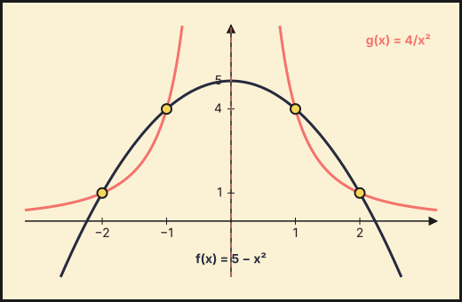{fig-alt="Gráficas de f(x)=5−x² y g(x)=4/x², que se cortan en (±1,4) y (±2,1)" width="75%" fig-align="center"}

3. Cortes: $5-x^{2}=\dfrac4{x^{2}}\Rightarrow x^{4}-5x^{2}+4=0\Rightarrow x^{2}=1,\,4$.
4. Ordenadas: $f(\pm1)=4$ y $f(\pm2)=1$.

**Puntos de corte: $(\pm1,4)$ y $(\pm2,1)$.**

**b) Suma de las áreas.**
1. Los recintos acotados son los de $1\le|x|\le2$ (entre $-1$ y $1$, $g$ no está acotada, así que no hay recinto).
2. En esos tramos $f\ge g$, y por simetría las dos áreas son iguales.
3. Se integra la diferencia y se multiplica por $2$:
$$2\int_1^2\left(5-x^{2}-\dfrac4{x^{2}}\right)dx=2\left[5x-\dfrac{x^{3}}3+\dfrac4x\right]_1^2=2\cdot\dfrac23.$$

**Suma de áreas $=\dfrac43\ \text{u}^2$.**
::::
:::::

### Extraordinaria · Reserva 2023

::::: {.ebau-ej #ebau-2023-ext-res-3}
**Ejercicio 3** · Extraordinaria · Reserva 2023 · Bloque A · *(2,5 puntos)* · [PDF del examen](https://www.ebaumatematicas.com/wp-content/uploads/2023/10/2oBachCC_EBAU_Andalucia_2023-Extraordinaria-Reserva.pdf){target="_blank"}

Sabiendo que $F:\mathbb{R}\to\mathbb{R}$ definida por $F(x)=e^{x^{2}}$ es una primitiva de $f$.

a) Comprueba que $f$ es creciente. *(1,25 puntos)*

b) Calcula el área del recinto limitado por la gráfica de la función $f$, el eje de abscisas y la recta $x=1$. *(1,25 puntos)*

*Relacionado también con:* [Aplicaciones de la derivada](08-aplicaciones-derivada.qmd).

:::: {.callout-note collapse="true" appearance="simple"}
## Ayuda 1 · Recordatorio

**Área de un recinto.**

Área entre $y=f(x)$ y el eje $X$: $\int_a^b|f(x)|\,dx$, partiendo en los puntos donde $f$ cambia de signo. Área entre dos curvas: $\int_a^b\left(f(x)-g(x)\right)dx$ con $f\ge g$. Los límites de integración son las abscisas de corte.

**Integrales: cambio de variable, partes y fracciones simples.**

**Cambio de variable:** $t=g(x)$, $dt=g'(x)\,dx$. **Por partes:** $\int u\,dv=u\,v-\int v\,du$ (regla ALPES: arcos, logaritmos, polinomios, exponenciales, senos). **Racionales:** si el grado del numerador es mayor o igual que el del denominador, se divide; después se descompone en fracciones simples $\dfrac{A}{x-a}+\dfrac{B}{x-b}$.

**Integral definida (regla de Barrow).**

Regla de Barrow: $\int_a^b f(x)\,dx=F(b)-F(a)$, con $F$ una primitiva de $f$. Si $f\ge0$ en $[a,b]$, la integral es el área bajo la curva; si $f\le0$, es el área cambiada de signo.

**Primitivas inmediatas.**

$\int x^n\,dx=\dfrac{x^{n+1}}{n+1}+C\ (n\neq-1)$; $\int\dfrac{1}{x}\,dx=\ln|x|+C$; $\int e^{kx}\,dx=\dfrac{e^{kx}}{k}+C$; $\int\dfrac{u'}{u}\,dx=\ln|u|+C$; $\int\sin x\,dx=-\cos x+C$; $\int\cos x\,dx=\sin x+C$. Linealidad: $\int(af+bg)=a\int f+b\int g$. Para $F(x)$ con $F(a)=b$ se usa la constante $C$.
::::

:::: {.callout-note collapse="true" appearance="simple"}
## Ayuda 2 · Método

**Área de un recinto.**

1. Haz un esbozo del recinto.
2. Calcula los puntos de corte (resolviendo $f=g$ o $f=0$): son los límites.
3. Decide qué función va por encima en cada tramo; si se cruzan, parte la integral.
4. Aplica Barrow y da el área en $\text{u}^2$, siempre positiva.

**Integrales: cambio de variable, partes y fracciones simples.**

1. Decide el método: ¿hay una función y su derivada (cambio de variable)?, ¿un producto de tipos distintos (partes)?, ¿un cociente de polinomios (fracciones simples)?
2. Aplica el método y simplifica; si es por partes, elige $u$ y $dv$ y repite si es necesario.
3. Deshaz el cambio y añade $+C$.
4. Si es definida, cambia los límites con la variable o deshaz el cambio antes de aplicar Barrow.
5. Comprueba derivando.

**Integral definida (regla de Barrow).**

1. Halla una primitiva $F$.
2. Evalúa $F(b)-F(a)$ cuidando los signos y las fracciones.
3. Interpreta el signo del resultado.

**Primitivas inmediatas.**

1. Reescribe el integrando como suma de potencias (separa fracciones, pasa raíces a exponente fraccionario).
2. Integra término a término.
3. Si piden una primitiva concreta, impón la condición $F(a)=b$ para hallar $C$.
4. Deriva el resultado para comprobarlo.
::::

:::: {.callout-tip collapse="true" appearance="simple"}
## Solución

**Función a partir de su primitiva.**
1. Como $F$ es primitiva de $f$, $f(x)=F'(x)=2x\,e^{x^{2}}$.

**a) $f$ es creciente.**
1. Derivada: $f'(x)=(2+4x^{2})e^{x^{2}}$.
2. $f'(x)>0$ para todo $x$ (suma de un positivo y un no negativo, por una exponencial positiva).

**$f$ es creciente.**

**b) Área.**
1. $f(0)=0$ y $f\ge 0$ en $[0,1]$, así que el recinto está entre $x=0$ y $x=1$.
2. Barrow, con la primitiva dada:
$$\int_0^1 2x\,e^{x^{2}}dx=\left[e^{x^{2}}\right]_0^1=e-1.$$

**Área $=e-1\approx 1{,}72\ \text{u}^{2}$.**
::::
:::::

::::: {.ebau-ej #ebau-2023-ext-res-4}
**Ejercicio 4** · Extraordinaria · Reserva 2023 · Bloque A · *(2,5 puntos)* · [PDF del examen](https://www.ebaumatematicas.com/wp-content/uploads/2023/10/2oBachCC_EBAU_Andalucia_2023-Extraordinaria-Reserva.pdf){target="_blank"}

Considera la función $f:[0,+\infty)\to\mathbb{R}$ definida por $f(x)=\cos(\sqrt{x})$. Calcula, si es posible, una primitiva de $f$ cuya gráfica pase por el punto $(0,5)$. Sugerencia: haz el cambio $t=\sqrt{x}$.

:::: {.callout-note collapse="true" appearance="simple"}
## Ayuda 1 · Recordatorio

**Integrales: cambio de variable, partes y fracciones simples.**

**Cambio de variable:** $t=g(x)$, $dt=g'(x)\,dx$. **Por partes:** $\int u\,dv=u\,v-\int v\,du$ (regla ALPES: arcos, logaritmos, polinomios, exponenciales, senos). **Racionales:** si el grado del numerador es mayor o igual que el del denominador, se divide; después se descompone en fracciones simples $\dfrac{A}{x-a}+\dfrac{B}{x-b}$.

**Integral definida (regla de Barrow).**

Regla de Barrow: $\int_a^b f(x)\,dx=F(b)-F(a)$, con $F$ una primitiva de $f$. Si $f\ge0$ en $[a,b]$, la integral es el área bajo la curva; si $f\le0$, es el área cambiada de signo.

**Primitivas inmediatas.**

$\int x^n\,dx=\dfrac{x^{n+1}}{n+1}+C\ (n\neq-1)$; $\int\dfrac{1}{x}\,dx=\ln|x|+C$; $\int e^{kx}\,dx=\dfrac{e^{kx}}{k}+C$; $\int\dfrac{u'}{u}\,dx=\ln|u|+C$; $\int\sin x\,dx=-\cos x+C$; $\int\cos x\,dx=\sin x+C$. Linealidad: $\int(af+bg)=a\int f+b\int g$. Para $F(x)$ con $F(a)=b$ se usa la constante $C$.
::::

:::: {.callout-note collapse="true" appearance="simple"}
## Ayuda 2 · Método

**Integrales: cambio de variable, partes y fracciones simples.**

1. Decide el método: ¿hay una función y su derivada (cambio de variable)?, ¿un producto de tipos distintos (partes)?, ¿un cociente de polinomios (fracciones simples)?
2. Aplica el método y simplifica; si es por partes, elige $u$ y $dv$ y repite si es necesario.
3. Deshaz el cambio y añade $+C$.
4. Si es definida, cambia los límites con la variable o deshaz el cambio antes de aplicar Barrow.
5. Comprueba derivando.

**Integral definida (regla de Barrow).**

1. Halla una primitiva $F$.
2. Evalúa $F(b)-F(a)$ cuidando los signos y las fracciones.
3. Interpreta el signo del resultado.

**Primitivas inmediatas.**

1. Reescribe el integrando como suma de potencias (separa fracciones, pasa raíces a exponente fraccionario).
2. Integra término a término.
3. Si piden una primitiva concreta, impón la condición $F(a)=b$ para hallar $C$.
4. Deriva el resultado para comprobarlo.
::::

:::: {.callout-tip collapse="true" appearance="simple"}
## Solución

**Primitiva con condición inicial.**
1. **Cambio de variable.** Con $t=\sqrt{x}$, $x=t^{2}$ y $dx=2t\,dt$: $\int\cos\sqrt{x}\,dx=\int 2t\cos t\,dt$.
2. **Por partes** ($u=2t$, $dv=\cos t\,dt$): $=2t\operatorname{sen}t+2\cos t+C=2\sqrt{x}\operatorname{sen}\sqrt{x}+2\cos\sqrt{x}+C$.
3. **Condición** $F(0)=5$: $2+C=5\Rightarrow C=3$.

**$F(x)=2\sqrt{x}\operatorname{sen}\sqrt{x}+2\cos\sqrt{x}+3$.**
::::
:::::

### Extraordinaria · Suplente 2023

::::: {.ebau-ej #ebau-2023-ext-sup-3}
**Ejercicio 3** · Extraordinaria · Suplente 2023 · Bloque A · *(2,5 puntos)* · [PDF del examen](https://www.ebaumatematicas.com/wp-content/uploads/2023/10/2oBachCC_EBAU_Andalucia_2023-Extraordinaria-Suplente.pdf){target="_blank"}

Calcula una primitiva de la función $f:[0,+\infty)\to\mathbb{R}$ definida por $f(x)=\operatorname{arctg}(\sqrt{x})$ cuya gráfica pase por el punto $(0,1)$ ($\operatorname{arctg}$ denota la función arco tangente). Sugerencia: efectúa el cambio $x=t^{2}$.

:::: {.callout-note collapse="true" appearance="simple"}
## Ayuda 1 · Recordatorio

**Integrales: cambio de variable, partes y fracciones simples.**

**Cambio de variable:** $t=g(x)$, $dt=g'(x)\,dx$. **Por partes:** $\int u\,dv=u\,v-\int v\,du$ (regla ALPES: arcos, logaritmos, polinomios, exponenciales, senos). **Racionales:** si el grado del numerador es mayor o igual que el del denominador, se divide; después se descompone en fracciones simples $\dfrac{A}{x-a}+\dfrac{B}{x-b}$.

**Integral definida (regla de Barrow).**

Regla de Barrow: $\int_a^b f(x)\,dx=F(b)-F(a)$, con $F$ una primitiva de $f$. Si $f\ge0$ en $[a,b]$, la integral es el área bajo la curva; si $f\le0$, es el área cambiada de signo.

**Primitivas inmediatas.**

$\int x^n\,dx=\dfrac{x^{n+1}}{n+1}+C\ (n\neq-1)$; $\int\dfrac{1}{x}\,dx=\ln|x|+C$; $\int e^{kx}\,dx=\dfrac{e^{kx}}{k}+C$; $\int\dfrac{u'}{u}\,dx=\ln|u|+C$; $\int\sin x\,dx=-\cos x+C$; $\int\cos x\,dx=\sin x+C$. Linealidad: $\int(af+bg)=a\int f+b\int g$. Para $F(x)$ con $F(a)=b$ se usa la constante $C$.
::::

:::: {.callout-note collapse="true" appearance="simple"}
## Ayuda 2 · Método

**Integrales: cambio de variable, partes y fracciones simples.**

1. Decide el método: ¿hay una función y su derivada (cambio de variable)?, ¿un producto de tipos distintos (partes)?, ¿un cociente de polinomios (fracciones simples)?
2. Aplica el método y simplifica; si es por partes, elige $u$ y $dv$ y repite si es necesario.
3. Deshaz el cambio y añade $+C$.
4. Si es definida, cambia los límites con la variable o deshaz el cambio antes de aplicar Barrow.
5. Comprueba derivando.

**Integral definida (regla de Barrow).**

1. Halla una primitiva $F$.
2. Evalúa $F(b)-F(a)$ cuidando los signos y las fracciones.
3. Interpreta el signo del resultado.

**Primitivas inmediatas.**

1. Reescribe el integrando como suma de potencias (separa fracciones, pasa raíces a exponente fraccionario).
2. Integra término a término.
3. Si piden una primitiva concreta, impón la condición $F(a)=b$ para hallar $C$.
4. Deriva el resultado para comprobarlo.
::::

:::: {.callout-tip collapse="true" appearance="simple"}
## Solución

**Primitiva con condición inicial.**
1. **Cambio de variable.** Con $x=t^{2}$, $dx=2t\,dt$: $\int\operatorname{arctg}\sqrt{x}\,dx=\int2t\operatorname{arctg}t\,dt$.
2. **Por partes** ($u=\operatorname{arctg}t$, $dv=2t\,dt$): $=t^{2}\operatorname{arctg}t-\int\dfrac{t^{2}}{1+t^{2}}dt=t^{2}\operatorname{arctg}t-t+\operatorname{arctg}t+C$ (porque $\dfrac{t^{2}}{1+t^{2}}=1-\dfrac1{1+t^{2}}$).
3. **Se deshace el cambio** ($t=\sqrt x$): $F(x)=(x+1)\operatorname{arctg}\sqrt{x}-\sqrt{x}+C$.
4. **Condición** $F(0)=1$: $F(0)=C=1$.

**$F(x)=(x+1)\operatorname{arctg}\sqrt{x}-\sqrt{x}+1$.**
::::
:::::

::::: {.ebau-ej #ebau-2023-ext-sup-4}
**Ejercicio 4** · Extraordinaria · Suplente 2023 · Bloque A · *(2,5 puntos)* · [PDF del examen](https://www.ebaumatematicas.com/wp-content/uploads/2023/10/2oBachCC_EBAU_Andalucia_2023-Extraordinaria-Suplente.pdf){target="_blank"}

Considera la función $f:(-1,+\infty)\to\mathbb{R}$, definida por $f(x)=\ln(x+1)$, donde $\ln$ denota el logaritmo neperiano. Calcula el área del recinto limitado por la gráfica de $f$, el eje de abscisas y la recta $x=e-1$.

:::: {.callout-note collapse="true" appearance="simple"}
## Ayuda 1 · Recordatorio

**Área de un recinto.**

Área entre $y=f(x)$ y el eje $X$: $\int_a^b|f(x)|\,dx$, partiendo en los puntos donde $f$ cambia de signo. Área entre dos curvas: $\int_a^b\left(f(x)-g(x)\right)dx$ con $f\ge g$. Los límites de integración son las abscisas de corte.

**Integrales: cambio de variable, partes y fracciones simples.**

**Cambio de variable:** $t=g(x)$, $dt=g'(x)\,dx$. **Por partes:** $\int u\,dv=u\,v-\int v\,du$ (regla ALPES: arcos, logaritmos, polinomios, exponenciales, senos). **Racionales:** si el grado del numerador es mayor o igual que el del denominador, se divide; después se descompone en fracciones simples $\dfrac{A}{x-a}+\dfrac{B}{x-b}$.

**Integral definida (regla de Barrow).**

Regla de Barrow: $\int_a^b f(x)\,dx=F(b)-F(a)$, con $F$ una primitiva de $f$. Si $f\ge0$ en $[a,b]$, la integral es el área bajo la curva; si $f\le0$, es el área cambiada de signo.

**Primitivas inmediatas.**

$\int x^n\,dx=\dfrac{x^{n+1}}{n+1}+C\ (n\neq-1)$; $\int\dfrac{1}{x}\,dx=\ln|x|+C$; $\int e^{kx}\,dx=\dfrac{e^{kx}}{k}+C$; $\int\dfrac{u'}{u}\,dx=\ln|u|+C$; $\int\sin x\,dx=-\cos x+C$; $\int\cos x\,dx=\sin x+C$. Linealidad: $\int(af+bg)=a\int f+b\int g$. Para $F(x)$ con $F(a)=b$ se usa la constante $C$.
::::

:::: {.callout-note collapse="true" appearance="simple"}
## Ayuda 2 · Método

**Área de un recinto.**

1. Haz un esbozo del recinto.
2. Calcula los puntos de corte (resolviendo $f=g$ o $f=0$): son los límites.
3. Decide qué función va por encima en cada tramo; si se cruzan, parte la integral.
4. Aplica Barrow y da el área en $\text{u}^2$, siempre positiva.

**Integrales: cambio de variable, partes y fracciones simples.**

1. Decide el método: ¿hay una función y su derivada (cambio de variable)?, ¿un producto de tipos distintos (partes)?, ¿un cociente de polinomios (fracciones simples)?
2. Aplica el método y simplifica; si es por partes, elige $u$ y $dv$ y repite si es necesario.
3. Deshaz el cambio y añade $+C$.
4. Si es definida, cambia los límites con la variable o deshaz el cambio antes de aplicar Barrow.
5. Comprueba derivando.

**Integral definida (regla de Barrow).**

1. Halla una primitiva $F$.
2. Evalúa $F(b)-F(a)$ cuidando los signos y las fracciones.
3. Interpreta el signo del resultado.

**Primitivas inmediatas.**

1. Reescribe el integrando como suma de potencias (separa fracciones, pasa raíces a exponente fraccionario).
2. Integra término a término.
3. Si piden una primitiva concreta, impón la condición $F(a)=b$ para hallar $C$.
4. Deriva el resultado para comprobarlo.
::::

:::: {.callout-tip collapse="true" appearance="simple"}
## Solución

**Área bajo $\ln(x+1)$.**
1. $\ln(x+1)=0\iff x=0$, y $f\ge0$ en $[0,e-1]$, así que el área es la integral.
2. Primitiva por partes ($u=\ln(x+1)$, $dv=dx$): $(x+1)\ln(x+1)-x$.
3. Barrow:
$$A=\int_0^{e-1}\ln(x+1)\,dx=\Big[(x+1)\ln(x+1)-x\Big]_0^{e-1}=e-(e-1)-0.$$

**Área $=1\ \text{u}^2$.**
::::
:::::

## 2022

### Ordinaria 2022

::::: {.ebau-ej #ebau-2022-ord-3}
**Ejercicio 3** · Ordinaria 2022 · Bloque A · *(2,5 puntos)* · [Examen](../../../assets/pau/2022-ord/examen.pdf){target="_blank"}

Sea $f$ la función definida por $f(x)=\begin{cases}2x+4 & \text{si } x<0\\(x-2)^{2} & \text{si } x\ge 0\end{cases}$

a) Calcula los puntos de corte de la gráfica de $f$ con el eje de abscisas y esboza la gráfica de la función. *(1 punto)*

b) Halla el área del recinto limitado por la gráfica de $f$ y por el eje de abscisas. *(1,5 puntos)*

:::: {.callout-note collapse="true" appearance="simple"}
## Ayuda 1 · Recordatorio

**Área de un recinto.**

Área entre $y=f(x)$ y el eje $X$: $\int_a^b|f(x)|\,dx$, partiendo en los puntos donde $f$ cambia de signo. Área entre dos curvas: $\int_a^b\left(f(x)-g(x)\right)dx$ con $f\ge g$. Los límites de integración son las abscisas de corte.

**Integral definida (regla de Barrow).**

Regla de Barrow: $\int_a^b f(x)\,dx=F(b)-F(a)$, con $F$ una primitiva de $f$. Si $f\ge0$ en $[a,b]$, la integral es el área bajo la curva; si $f\le0$, es el área cambiada de signo.

**Primitivas inmediatas.**

$\int x^n\,dx=\dfrac{x^{n+1}}{n+1}+C\ (n\neq-1)$; $\int\dfrac{1}{x}\,dx=\ln|x|+C$; $\int e^{kx}\,dx=\dfrac{e^{kx}}{k}+C$; $\int\dfrac{u'}{u}\,dx=\ln|u|+C$; $\int\sin x\,dx=-\cos x+C$; $\int\cos x\,dx=\sin x+C$. Linealidad: $\int(af+bg)=a\int f+b\int g$. Para $F(x)$ con $F(a)=b$ se usa la constante $C$.

**Representar una función.**

Una gráfica se construye con: dominio, cortes con los ejes, asíntotas, monotonía y extremos (con $f'$), curvatura y puntos de inflexión (con $f''$), y una tabla de valores. Convexa si $f''>0$ y cóncava si $f''<0$.
::::

:::: {.callout-note collapse="true" appearance="simple"}
## Ayuda 2 · Método

**Área de un recinto.**

1. Haz un esbozo del recinto.
2. Calcula los puntos de corte (resolviendo $f=g$ o $f=0$): son los límites.
3. Decide qué función va por encima en cada tramo; si se cruzan, parte la integral.
4. Aplica Barrow y da el área en $\text{u}^2$, siempre positiva.

**Integral definida (regla de Barrow).**

1. Halla una primitiva $F$.
2. Evalúa $F(b)-F(a)$ cuidando los signos y las fracciones.
3. Interpreta el signo del resultado.

**Primitivas inmediatas.**

1. Reescribe el integrando como suma de potencias (separa fracciones, pasa raíces a exponente fraccionario).
2. Integra término a término.
3. Si piden una primitiva concreta, impón la condición $F(a)=b$ para hallar $C$.
4. Deriva el resultado para comprobarlo.

**Representar una función.**

1. Dominio y cortes.
2. Asíntotas verticales, horizontales y oblicuas con límites.
3. Signo de $f'$: intervalos de crecimiento y extremos.
4. Signo de $f''$ si hace falta, y unos cuantos puntos.
5. Dibuja y comprueba que la gráfica respeta todos los datos anteriores.
::::

:::: {.callout-tip collapse="true" appearance="simple"}
## Solución

**a) Cortes con el eje y gráfica.**
1. Primer trozo ($x<0$): $2x+4=0\Rightarrow x=-2$, que cumple $x<0$.
2. Segundo trozo ($x\ge0$): $(x-2)^2=0\Rightarrow x=2$ (raíz doble, la parábola es tangente al eje en su vértice).

**Cortes con el eje: $(-2,0)$ y $(2,0)$.**

3. Gráfica: una recta de pendiente 2 desde $(-2,0)$ hasta $(0,4)$ y, desde ahí, una parábola de vértice $(2,0)$ que pasa por $(0,4)$.

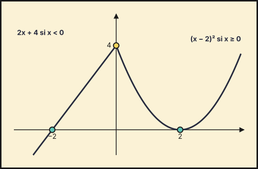{fig-alt="Gráfica de la función definida a trozos: recta 2x+4 hasta x=0 y parábola (x−2)² desde x=0; cortes en x=−2 y x=2" width="75%" fig-align="center"}

**b) Área.**
1. El recinto está entre $x=-2$ y $x=2$ y siempre por encima del eje, porque $f\ge0$ ($2x+4\ge0$ si $x\ge-2$, y un cuadrado no es negativo).
2. Se parte en los dos trozos y se aplica la regla de Barrow:
$$A=\int_{-2}^0(2x+4)\,dx+\int_0^2(x-2)^2\,dx=\Big[x^2+4x\Big]_{-2}^{0}+\left[\frac{(x-2)^3}{3}\right]_0^2=4+\tfrac83.$$

**$A=\dfrac{20}{3}$ u$^2$.**
::::
:::::

::::: {.ebau-ej #ebau-2022-ord-4}
**Ejercicio 4** · Ordinaria 2022 · Bloque A · *(2,5 puntos)* · [Examen](../../../assets/pau/2022-ord/examen.pdf){target="_blank"}

Considera la función $f$ definida por $f(x)=\dfrac{x^{3}}{x^{2}-2x+1}$ para $x\neq 1$. Halla una primitiva de $f$ que pase por el punto $(2,6)$.

:::: {.callout-note collapse="true" appearance="simple"}
## Ayuda 1 · Recordatorio

**Integral definida (regla de Barrow).**

Regla de Barrow: $\int_a^b f(x)\,dx=F(b)-F(a)$, con $F$ una primitiva de $f$. Si $f\ge0$ en $[a,b]$, la integral es el área bajo la curva; si $f\le0$, es el área cambiada de signo.

**Primitivas inmediatas.**

$\int x^n\,dx=\dfrac{x^{n+1}}{n+1}+C\ (n\neq-1)$; $\int\dfrac{1}{x}\,dx=\ln|x|+C$; $\int e^{kx}\,dx=\dfrac{e^{kx}}{k}+C$; $\int\dfrac{u'}{u}\,dx=\ln|u|+C$; $\int\sin x\,dx=-\cos x+C$; $\int\cos x\,dx=\sin x+C$. Linealidad: $\int(af+bg)=a\int f+b\int g$. Para $F(x)$ con $F(a)=b$ se usa la constante $C$.
::::

:::: {.callout-note collapse="true" appearance="simple"}
## Ayuda 2 · Método

**Integral definida (regla de Barrow).**

1. Halla una primitiva $F$.
2. Evalúa $F(b)-F(a)$ cuidando los signos y las fracciones.
3. Interpreta el signo del resultado.

**Primitivas inmediatas.**

1. Reescribe el integrando como suma de potencias (separa fracciones, pasa raíces a exponente fraccionario).
2. Integra término a término.
3. Si piden una primitiva concreta, impón la condición $F(a)=b$ para hallar $C$.
4. Deriva el resultado para comprobarlo.
::::

:::: {.callout-tip collapse="true" appearance="simple"}
## Solución

1. El grado del numerador (3) es mayor que el del denominador (2), así que primero se divide. Como $x^2-2x+1=(x-1)^2$, dividiendo $x^3$ entre $x^2-2x+1$ se obtiene cociente $x+2$ y resto $3x-2$:
$$\frac{x^3}{(x-1)^2}=x+2+\frac{3x-2}{(x-1)^2}.$$
2. El resto se descompone en fracciones simples: $\dfrac{3x-2}{(x-1)^2}=\dfrac{3}{x-1}+\dfrac{1}{(x-1)^2}$.
3. Se integra término a término:
$$F(x)=\int\left(x+2+\frac3{x-1}+\frac1{(x-1)^2}\right)dx=\frac{x^2}2+2x+3\ln|x-1|-\frac1{x-1}+C.$$
4. La primitiva debe pasar por $(2,6)$, es decir, $F(2)=6$: $F(2)=2+4+3\ln1-1+C=2+4+0-1+C=5+C=6$, de donde $C=1$.

**$F(x)=\dfrac{x^2}{2}+2x+3\ln|x-1|-\dfrac{1}{x-1}+1$.**
::::
:::::

### Ordinaria · Reserva 2022

::::: {.ebau-ej #ebau-2022-ord-res-3}
**Ejercicio 3** · Ordinaria · Reserva 2022 · Bloque A · *(2,5 puntos)* · [Examen](../../../assets/pau/2022-ord-res/examen.pdf){target="_blank"}

Considera la función $f:\mathbb{R}\to\mathbb{R}$ definida por $f(x)=e^{x}\operatorname{sen}(2x)$. Halla la primitiva de $f$ cuya gráfica pase por el punto $(0,0)$.

:::: {.callout-note collapse="true" appearance="simple"}
## Ayuda 1 · Recordatorio

**Integrales: cambio de variable, partes y fracciones simples.**

**Cambio de variable:** $t=g(x)$, $dt=g'(x)\,dx$. **Por partes:** $\int u\,dv=u\,v-\int v\,du$ (regla ALPES: arcos, logaritmos, polinomios, exponenciales, senos). **Racionales:** si el grado del numerador es mayor o igual que el del denominador, se divide; después se descompone en fracciones simples $\dfrac{A}{x-a}+\dfrac{B}{x-b}$.

**Integral definida (regla de Barrow).**

Regla de Barrow: $\int_a^b f(x)\,dx=F(b)-F(a)$, con $F$ una primitiva de $f$. Si $f\ge0$ en $[a,b]$, la integral es el área bajo la curva; si $f\le0$, es el área cambiada de signo.

**Primitivas inmediatas.**

$\int x^n\,dx=\dfrac{x^{n+1}}{n+1}+C\ (n\neq-1)$; $\int\dfrac{1}{x}\,dx=\ln|x|+C$; $\int e^{kx}\,dx=\dfrac{e^{kx}}{k}+C$; $\int\dfrac{u'}{u}\,dx=\ln|u|+C$; $\int\sin x\,dx=-\cos x+C$; $\int\cos x\,dx=\sin x+C$. Linealidad: $\int(af+bg)=a\int f+b\int g$. Para $F(x)$ con $F(a)=b$ se usa la constante $C$.
::::

:::: {.callout-note collapse="true" appearance="simple"}
## Ayuda 2 · Método

**Integrales: cambio de variable, partes y fracciones simples.**

1. Decide el método: ¿hay una función y su derivada (cambio de variable)?, ¿un producto de tipos distintos (partes)?, ¿un cociente de polinomios (fracciones simples)?
2. Aplica el método y simplifica; si es por partes, elige $u$ y $dv$ y repite si es necesario.
3. Deshaz el cambio y añade $+C$.
4. Si es definida, cambia los límites con la variable o deshaz el cambio antes de aplicar Barrow.
5. Comprueba derivando.

**Integral definida (regla de Barrow).**

1. Halla una primitiva $F$.
2. Evalúa $F(b)-F(a)$ cuidando los signos y las fracciones.
3. Interpreta el signo del resultado.

**Primitivas inmediatas.**

1. Reescribe el integrando como suma de potencias (separa fracciones, pasa raíces a exponente fraccionario).
2. Integra término a término.
3. Si piden una primitiva concreta, impón la condición $F(a)=b$ para hallar $C$.
4. Deriva el resultado para comprobarlo.
::::

:::: {.callout-tip collapse="true" appearance="simple"}
## Solución

1. Es una integral de un producto de exponencial por seno: se integra **por partes** dos veces y se despeja la integral (reaparece en el segundo miembro). El resultado es
$$\int e^x\operatorname{sen}(2x)\,dx=\frac{e^x(\operatorname{sen}2x-2\cos2x)}{5}+C.$$
2. Comprobación: derivando, $\dfrac{e^x(\operatorname{sen}2x-2\cos2x)+e^x(2\cos2x+4\operatorname{sen}2x)}{5}=e^x\operatorname{sen}2x$ ✓.
3. La primitiva debe pasar por $(0,0)$, es decir, $F(0)=0$: $F(0)=\dfrac{e^0(0-2)}{5}+C=\tfrac{-2}{5}+C=0$, de donde $C=\tfrac25$.

**$F(x)=\dfrac{e^x\left(\operatorname{sen}(2x)-2\cos(2x)\right)}{5}+\dfrac25$.**
::::
:::::

::::: {.ebau-ej #ebau-2022-ord-res-4}
**Ejercicio 4** · Ordinaria · Reserva 2022 · Bloque A · *(2,5 puntos)* · [Examen](../../../assets/pau/2022-ord-res/examen.pdf){target="_blank"}

Considera las funciones $f,g:\mathbb{R}\to\mathbb{R}$ definidas por $f(x)=1-x^{2}$ y $g(x)=2x^{2}$.

a) Calcula los puntos de corte de las gráficas de $f$ y $g$. Esboza el recinto que delimitan. *(1,25 puntos)*

b) Determina el área del recinto anterior. *(1,25 puntos)*

:::: {.callout-note collapse="true" appearance="simple"}
## Ayuda 1 · Recordatorio

**Área de un recinto.**

Área entre $y=f(x)$ y el eje $X$: $\int_a^b|f(x)|\,dx$, partiendo en los puntos donde $f$ cambia de signo. Área entre dos curvas: $\int_a^b\left(f(x)-g(x)\right)dx$ con $f\ge g$. Los límites de integración son las abscisas de corte.

**Integral definida (regla de Barrow).**

Regla de Barrow: $\int_a^b f(x)\,dx=F(b)-F(a)$, con $F$ una primitiva de $f$. Si $f\ge0$ en $[a,b]$, la integral es el área bajo la curva; si $f\le0$, es el área cambiada de signo.

**Primitivas inmediatas.**

$\int x^n\,dx=\dfrac{x^{n+1}}{n+1}+C\ (n\neq-1)$; $\int\dfrac{1}{x}\,dx=\ln|x|+C$; $\int e^{kx}\,dx=\dfrac{e^{kx}}{k}+C$; $\int\dfrac{u'}{u}\,dx=\ln|u|+C$; $\int\sin x\,dx=-\cos x+C$; $\int\cos x\,dx=\sin x+C$. Linealidad: $\int(af+bg)=a\int f+b\int g$. Para $F(x)$ con $F(a)=b$ se usa la constante $C$.

**Representar una función.**

Una gráfica se construye con: dominio, cortes con los ejes, asíntotas, monotonía y extremos (con $f'$), curvatura y puntos de inflexión (con $f''$), y una tabla de valores. Convexa si $f''>0$ y cóncava si $f''<0$.
::::

:::: {.callout-note collapse="true" appearance="simple"}
## Ayuda 2 · Método

**Área de un recinto.**

1. Haz un esbozo del recinto.
2. Calcula los puntos de corte (resolviendo $f=g$ o $f=0$): son los límites.
3. Decide qué función va por encima en cada tramo; si se cruzan, parte la integral.
4. Aplica Barrow y da el área en $\text{u}^2$, siempre positiva.

**Integral definida (regla de Barrow).**

1. Halla una primitiva $F$.
2. Evalúa $F(b)-F(a)$ cuidando los signos y las fracciones.
3. Interpreta el signo del resultado.

**Primitivas inmediatas.**

1. Reescribe el integrando como suma de potencias (separa fracciones, pasa raíces a exponente fraccionario).
2. Integra término a término.
3. Si piden una primitiva concreta, impón la condición $F(a)=b$ para hallar $C$.
4. Deriva el resultado para comprobarlo.

**Representar una función.**

1. Dominio y cortes.
2. Asíntotas verticales, horizontales y oblicuas con límites.
3. Signo de $f'$: intervalos de crecimiento y extremos.
4. Signo de $f''$ si hace falta, y unos cuantos puntos.
5. Dibuja y comprueba que la gráfica respeta todos los datos anteriores.
::::

:::: {.callout-tip collapse="true" appearance="simple"}
## Solución

**a) Puntos de corte y recinto.**
1. Se igualan las funciones: $1-x^2=2x^2\Rightarrow3x^2=1\Rightarrow x^2=\tfrac13$, es decir, $x=\pm\tfrac{\sqrt3}{3}$.
2. Se sustituye en $g$: $g\left(\pm\tfrac{\sqrt3}{3}\right)=2\cdot\tfrac13=\tfrac23$.

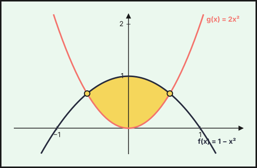{fig-alt="Recinto entre f(x)=1−x² y g(x)=2x², con cortes en x=±1/√3" width="75%" fig-align="center"}

**Puntos de corte: $\left(\pm\tfrac{\sqrt3}{3},\tfrac23\right)$.**

3. El recinto está entre la parábola $f$ (hacia abajo, vértice $(0,1)$) y la parábola $g$ (hacia arriba, vértice $(0,0)$). Por ejemplo, en $x=0$ se tiene $f(0)=1>g(0)=0$: $f\ge g$ para $|x|\le\tfrac{\sqrt3}{3}$.

**b) Área.**
1. Se integra la diferencia $f-g=1-3x^2$ entre los puntos de corte. Como es par, el área es el doble de la de $[0,\tfrac{\sqrt3}{3}]$:
$$A=\int_{-\sqrt3/3}^{\sqrt3/3}(1-3x^2)\,dx=2\left[x-x^3\right]_0^{\sqrt3/3}=2\left(\tfrac{\sqrt3}{3}-\tfrac{\sqrt3}{9}\right).$$

**$A=\dfrac{4\sqrt3}{9}$ u$^2$.**
::::
:::::

### Ordinaria · Suplente 2022

::::: {.ebau-ej #ebau-2022-ord-sup-3}
**Ejercicio 3** · Ordinaria · Suplente 2022 · Bloque A · *(2,5 puntos)* · [Examen](../../../assets/pau/2022-ord-sup/examen.pdf){target="_blank"}

Considera la función $F:[0,2\pi]\to\mathbb{R}$ definida por $F(x)=\displaystyle\int_{0}^{x}2t\cos(t)\,dt$.

a) Determina los intervalos de crecimiento y de decrecimiento de $F$. *(1 punto)*

b) Halla la ecuación de la recta tangente a la gráfica de $F$ en el punto de abscisa $x=\pi$. *(1,5 puntos)*

*Relacionado también con:* [Derivadas](07-derivadas.qmd), [Aplicaciones de la derivada](08-aplicaciones-derivada.qmd).

:::: {.callout-note collapse="true" appearance="simple"}
## Ayuda 1 · Recordatorio

**Integrales: cambio de variable, partes y fracciones simples.**

**Cambio de variable:** $t=g(x)$, $dt=g'(x)\,dx$. **Por partes:** $\int u\,dv=u\,v-\int v\,du$ (regla ALPES: arcos, logaritmos, polinomios, exponenciales, senos). **Racionales:** si el grado del numerador es mayor o igual que el del denominador, se divide; después se descompone en fracciones simples $\dfrac{A}{x-a}+\dfrac{B}{x-b}$.

**Integral definida (regla de Barrow).**

Regla de Barrow: $\int_a^b f(x)\,dx=F(b)-F(a)$, con $F$ una primitiva de $f$. Si $f\ge0$ en $[a,b]$, la integral es el área bajo la curva; si $f\le0$, es el área cambiada de signo.

**Primitivas inmediatas.**

$\int x^n\,dx=\dfrac{x^{n+1}}{n+1}+C\ (n\neq-1)$; $\int\dfrac{1}{x}\,dx=\ln|x|+C$; $\int e^{kx}\,dx=\dfrac{e^{kx}}{k}+C$; $\int\dfrac{u'}{u}\,dx=\ln|u|+C$; $\int\sin x\,dx=-\cos x+C$; $\int\cos x\,dx=\sin x+C$. Linealidad: $\int(af+bg)=a\int f+b\int g$. Para $F(x)$ con $F(a)=b$ se usa la constante $C$.

**Reglas de derivación.**

$(u\pm v)'=u'\pm v'$; $(u\cdot v)'=u'v+uv'$; $\left(\dfrac{u}{v}\right)'=\dfrac{u'v-uv'}{v^2}$; regla de la cadena $(f\circ g)'=f'(g)\cdot g'$. Básicas: $(x^n)'=nx^{n-1}$, $(e^{u})'=u'e^{u}$, $(\ln u)'=\dfrac{u'}{u}$.
::::

:::: {.callout-note collapse="true" appearance="simple"}
## Ayuda 2 · Método

**Integrales: cambio de variable, partes y fracciones simples.**

1. Decide el método: ¿hay una función y su derivada (cambio de variable)?, ¿un producto de tipos distintos (partes)?, ¿un cociente de polinomios (fracciones simples)?
2. Aplica el método y simplifica; si es por partes, elige $u$ y $dv$ y repite si es necesario.
3. Deshaz el cambio y añade $+C$.
4. Si es definida, cambia los límites con la variable o deshaz el cambio antes de aplicar Barrow.
5. Comprueba derivando.

**Integral definida (regla de Barrow).**

1. Halla una primitiva $F$.
2. Evalúa $F(b)-F(a)$ cuidando los signos y las fracciones.
3. Interpreta el signo del resultado.

**Primitivas inmediatas.**

1. Reescribe el integrando como suma de potencias (separa fracciones, pasa raíces a exponente fraccionario).
2. Integra término a término.
3. Si piden una primitiva concreta, impón la condición $F(a)=b$ para hallar $C$.
4. Deriva el resultado para comprobarlo.

**Reglas de derivación.**

1. Identifica la estructura: ¿suma, producto, cociente o función compuesta? Empieza por la operación «de fuera».
2. Aplica la regla y simplifica (saca factor común).
3. Comprueba un valor numérico si tienes dudas.
::::

:::: {.callout-tip collapse="true" appearance="simple"}
## Solución

1. Por el teorema fundamental del cálculo, $F'(x)=2x\cos x$ en $[0,2\pi]$.

**a) Crecimiento y decrecimiento.**
1. En $(0,2\pi)$ se tiene $2x>0$, así que el signo de $F'$ es el de $\cos x$.
2. $\cos x=0$ en $x=\tfrac\pi2$ y $x=\tfrac{3\pi}2$. Positivo en $\left(0,\tfrac\pi2\right)$ y $\left(\tfrac{3\pi}{2},2\pi\right)$; negativo en $\left(\tfrac\pi2,\tfrac{3\pi}2\right)$.

**$F$ crece en $\left(0,\tfrac\pi2\right)\cup\left(\tfrac{3\pi}2,2\pi\right)$ y decrece en $\left(\tfrac\pi2,\tfrac{3\pi}2\right)$.**

**b) Recta tangente en $x=\pi$.**
1. Pendiente: $F'(\pi)=2\pi\cos\pi=-2\pi$.
2. Ordenada: se calcula la integral por partes ($u=2t$, $dv=\cos t\,dt$): una primitiva es $2t\operatorname{sen}t+2\cos t$, así que $F(\pi)=\left[2t\operatorname{sen}t+2\cos t\right]_0^\pi=(0-2)-(0+2)=-4$.
3. Tangente: $y-F(\pi)=F'(\pi)(x-\pi)$.

**Tangente: $y=-4-2\pi(x-\pi)$, es decir, $y=-2\pi x+2\pi^2-4$.**
::::
:::::

::::: {.ebau-ej #ebau-2022-ord-sup-4}
**Ejercicio 4** · Ordinaria · Suplente 2022 · Bloque A · *(2,5 puntos)* · [Examen](../../../assets/pau/2022-ord-sup/examen.pdf){target="_blank"}

Calcula $\displaystyle\int_{0}^{1}x\operatorname{arctg}(x)\,dx$ (donde $\operatorname{arctg}$ denota la función arcotangente).

:::: {.callout-note collapse="true" appearance="simple"}
## Ayuda 1 · Recordatorio

**Integrales: cambio de variable, partes y fracciones simples.**

**Cambio de variable:** $t=g(x)$, $dt=g'(x)\,dx$. **Por partes:** $\int u\,dv=u\,v-\int v\,du$ (regla ALPES: arcos, logaritmos, polinomios, exponenciales, senos). **Racionales:** si el grado del numerador es mayor o igual que el del denominador, se divide; después se descompone en fracciones simples $\dfrac{A}{x-a}+\dfrac{B}{x-b}$.

**Integral definida (regla de Barrow).**

Regla de Barrow: $\int_a^b f(x)\,dx=F(b)-F(a)$, con $F$ una primitiva de $f$. Si $f\ge0$ en $[a,b]$, la integral es el área bajo la curva; si $f\le0$, es el área cambiada de signo.
::::

:::: {.callout-note collapse="true" appearance="simple"}
## Ayuda 2 · Método

**Integrales: cambio de variable, partes y fracciones simples.**

1. Decide el método: ¿hay una función y su derivada (cambio de variable)?, ¿un producto de tipos distintos (partes)?, ¿un cociente de polinomios (fracciones simples)?
2. Aplica el método y simplifica; si es por partes, elige $u$ y $dv$ y repite si es necesario.
3. Deshaz el cambio y añade $+C$.
4. Si es definida, cambia los límites con la variable o deshaz el cambio antes de aplicar Barrow.
5. Comprueba derivando.

**Integral definida (regla de Barrow).**

1. Halla una primitiva $F$.
2. Evalúa $F(b)-F(a)$ cuidando los signos y las fracciones.
3. Interpreta el signo del resultado.
::::

:::: {.callout-tip collapse="true" appearance="simple"}
## Solución

**Integración por partes.**
1. Se elige $u=\operatorname{arctg}x$ (que al derivar se simplifica) y $dv=x\,dx$, con $du=\dfrac{dx}{1+x^2}$ y $v=\dfrac{x^2}{2}$.
2. Se aplica $\int u\,dv=uv-\int v\,du$:
$$\int_0^1x\operatorname{arctg}x\,dx=\left[\tfrac{x^2}{2}\operatorname{arctg}x\right]_0^1-\frac12\int_0^1\frac{x^2}{1+x^2}\,dx=\frac\pi8-\frac12\int_0^1\frac{x^2}{1+x^2}\,dx.$$
3. En la integral restante se escribe $\dfrac{x^2}{1+x^2}=1-\dfrac{1}{1+x^2}$, y queda $\displaystyle\int_0^1\frac{x^2}{1+x^2}\,dx=\big[x-\operatorname{arctg}x\big]_0^1=1-\dfrac\pi4$:
$$\frac\pi8-\frac12\big[x-\operatorname{arctg}x\big]_0^1=\frac\pi8-\frac12\left(1-\frac\pi4\right).$$

**$\dfrac\pi4-\dfrac12$.**
::::
:::::

### Extraordinaria 2022

::::: {.ebau-ej #ebau-2022-ext-3}
**Ejercicio 3** · Extraordinaria 2022 · Bloque A · *(2,5 puntos)* · [Examen](../../../assets/pau/2022-ext/examen.pdf){target="_blank"}

Calcula $\displaystyle\int_{3}^{8}\dfrac{1}{\sqrt{1+x}-1}\,dx$. (Sugerencia: efectúa el cambio de variable $t=\sqrt{1+x}-1$.)

:::: {.callout-note collapse="true" appearance="simple"}
## Ayuda 1 · Recordatorio

**Integrales: cambio de variable, partes y fracciones simples.**

**Cambio de variable:** $t=g(x)$, $dt=g'(x)\,dx$. **Por partes:** $\int u\,dv=u\,v-\int v\,du$ (regla ALPES: arcos, logaritmos, polinomios, exponenciales, senos). **Racionales:** si el grado del numerador es mayor o igual que el del denominador, se divide; después se descompone en fracciones simples $\dfrac{A}{x-a}+\dfrac{B}{x-b}$.

**Integral definida (regla de Barrow).**

Regla de Barrow: $\int_a^b f(x)\,dx=F(b)-F(a)$, con $F$ una primitiva de $f$. Si $f\ge0$ en $[a,b]$, la integral es el área bajo la curva; si $f\le0$, es el área cambiada de signo.
::::

:::: {.callout-note collapse="true" appearance="simple"}
## Ayuda 2 · Método

**Integrales: cambio de variable, partes y fracciones simples.**

1. Decide el método: ¿hay una función y su derivada (cambio de variable)?, ¿un producto de tipos distintos (partes)?, ¿un cociente de polinomios (fracciones simples)?
2. Aplica el método y simplifica; si es por partes, elige $u$ y $dv$ y repite si es necesario.
3. Deshaz el cambio y añade $+C$.
4. Si es definida, cambia los límites con la variable o deshaz el cambio antes de aplicar Barrow.
5. Comprueba derivando.

**Integral definida (regla de Barrow).**

1. Halla una primitiva $F$.
2. Evalúa $F(b)-F(a)$ cuidando los signos y las fracciones.
3. Interpreta el signo del resultado.
::::

:::: {.callout-tip collapse="true" appearance="simple"}
## Solución

**Cambio de variable** $t=\sqrt{1+x}-1$.
1. Se despeja $x$: $\sqrt{1+x}=t+1\Rightarrow x=(t+1)^2-1$, luego $dx=2(t+1)\,dt$.
2. El denominador pasa a ser $\sqrt{1+x}-1=t$.
3. Los límites cambian: para $x=3$, $t=\sqrt4-1=1$; para $x=8$, $t=\sqrt9-1=2$.
4. Se sustituye y se simplifica:
$$\int_1^2\frac{2(t+1)}{t}\,dt=2\int_1^2\left(1+\frac1t\right)dt=2\big[t+\ln t\big]_1^2=2(1+\ln2).$$

**$2+2\ln2$.**
::::
:::::

::::: {.ebau-ej #ebau-2022-ext-4}
**Ejercicio 4** · Extraordinaria 2022 · Bloque A · *(2,5 puntos)* · [Examen](../../../assets/pau/2022-ext/examen.pdf){target="_blank"}

Considera las funciones $f,g:\mathbb{R}\to\mathbb{R}$ definidas por $f(x)=x^{3}+2$ y $g(x)=-x^{2}+2x+2$.

a) Calcula los puntos de corte de las gráficas de $f$ y $g$. Esboza sus gráficas. *(1,25 puntos)*

b) Determina el área del recinto limitado por las gráficas de $f$ y $g$ en el primer cuadrante. *(1,25 puntos)*

:::: {.callout-note collapse="true" appearance="simple"}
## Ayuda 1 · Recordatorio

**Área de un recinto.**

Área entre $y=f(x)$ y el eje $X$: $\int_a^b|f(x)|\,dx$, partiendo en los puntos donde $f$ cambia de signo. Área entre dos curvas: $\int_a^b\left(f(x)-g(x)\right)dx$ con $f\ge g$. Los límites de integración son las abscisas de corte.

**Integral definida (regla de Barrow).**

Regla de Barrow: $\int_a^b f(x)\,dx=F(b)-F(a)$, con $F$ una primitiva de $f$. Si $f\ge0$ en $[a,b]$, la integral es el área bajo la curva; si $f\le0$, es el área cambiada de signo.

**Primitivas inmediatas.**

$\int x^n\,dx=\dfrac{x^{n+1}}{n+1}+C\ (n\neq-1)$; $\int\dfrac{1}{x}\,dx=\ln|x|+C$; $\int e^{kx}\,dx=\dfrac{e^{kx}}{k}+C$; $\int\dfrac{u'}{u}\,dx=\ln|u|+C$; $\int\sin x\,dx=-\cos x+C$; $\int\cos x\,dx=\sin x+C$. Linealidad: $\int(af+bg)=a\int f+b\int g$. Para $F(x)$ con $F(a)=b$ se usa la constante $C$.

**Representar una función.**

Una gráfica se construye con: dominio, cortes con los ejes, asíntotas, monotonía y extremos (con $f'$), curvatura y puntos de inflexión (con $f''$), y una tabla de valores. Convexa si $f''>0$ y cóncava si $f''<0$.
::::

:::: {.callout-note collapse="true" appearance="simple"}
## Ayuda 2 · Método

**Área de un recinto.**

1. Haz un esbozo del recinto.
2. Calcula los puntos de corte (resolviendo $f=g$ o $f=0$): son los límites.
3. Decide qué función va por encima en cada tramo; si se cruzan, parte la integral.
4. Aplica Barrow y da el área en $\text{u}^2$, siempre positiva.

**Integral definida (regla de Barrow).**

1. Halla una primitiva $F$.
2. Evalúa $F(b)-F(a)$ cuidando los signos y las fracciones.
3. Interpreta el signo del resultado.

**Primitivas inmediatas.**

1. Reescribe el integrando como suma de potencias (separa fracciones, pasa raíces a exponente fraccionario).
2. Integra término a término.
3. Si piden una primitiva concreta, impón la condición $F(a)=b$ para hallar $C$.
4. Deriva el resultado para comprobarlo.

**Representar una función.**

1. Dominio y cortes.
2. Asíntotas verticales, horizontales y oblicuas con límites.
3. Signo de $f'$: intervalos de crecimiento y extremos.
4. Signo de $f''$ si hace falta, y unos cuantos puntos.
5. Dibuja y comprueba que la gráfica respeta todos los datos anteriores.
::::

:::: {.callout-tip collapse="true" appearance="simple"}
## Solución

**a) Puntos de corte y gráficas.**
1. Se igualan: $x^3+2=-x^2+2x+2\Rightarrow x^3+x^2-2x=0$.
2. Se factoriza: $x(x-1)(x+2)=0$, con raíces $x=0,\ 1,\ -2$.
3. Se calcula la ordenada con $f$: $f(-2)=-6$, $f(0)=2$, $f(1)=3$.

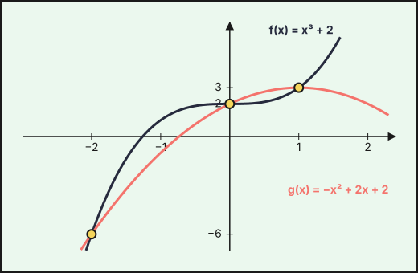{fig-alt="Gráficas de f(x)=x³+2 y g(x)=−x²+2x+2, que se cortan en (−2,−6), (0,2) y (1,3)" width="75%" fig-align="center"}

**Puntos de corte: $(-2,-6)$, $(0,2)$ y $(1,3)$.**

4. $f$ es una cúbica creciente que pasa por $(0,2)$; $g$ es una parábola con vértice en $(1,3)$ abierta hacia abajo; ambas se cortan en los tres puntos.

**b) Área en el primer cuadrante.**
1. En el primer cuadrante ($x\ge0$, $y\ge0$) los cortes son $x=0$ y $x=1$.
2. Se averigua cuál va por encima probando un punto: en $x=\tfrac12$, $g=\tfrac{11}{4}>f=\tfrac{17}{8}$, luego $g\ge f$ en $[0,1]$.
3. Se integra $g-f=-x^3-x^2+2x$:
$$A=\int_0^1(-x^3-x^2+2x)\,dx=-\tfrac14-\tfrac13+1.$$

**$A=\tfrac{5}{12}$ u$^2$.**
::::
:::::

### Extraordinaria · Reserva 2022

::::: {.ebau-ej #ebau-2022-ext-res-3}
**Ejercicio 3** · Extraordinaria · Reserva 2022 · Bloque A · *(2,5 puntos)* · [Examen](../../../assets/pau/2022-ext-res/examen.pdf){target="_blank"}

Considera la función $f:\mathbb{R}\to\mathbb{R}$ definida por $f(x)=x^{3}-x$. Calcula el área total de los recintos limitados por la gráfica de la función $f$ y la recta normal a dicha gráfica en el punto de abscisa $x=0$.

*Relacionado también con:* [Derivadas](07-derivadas.qmd).

:::: {.callout-note collapse="true" appearance="simple"}
## Ayuda 1 · Recordatorio

**Área de un recinto.**

Área entre $y=f(x)$ y el eje $X$: $\int_a^b|f(x)|\,dx$, partiendo en los puntos donde $f$ cambia de signo. Área entre dos curvas: $\int_a^b\left(f(x)-g(x)\right)dx$ con $f\ge g$. Los límites de integración son las abscisas de corte.

**Integral definida (regla de Barrow).**

Regla de Barrow: $\int_a^b f(x)\,dx=F(b)-F(a)$, con $F$ una primitiva de $f$. Si $f\ge0$ en $[a,b]$, la integral es el área bajo la curva; si $f\le0$, es el área cambiada de signo.

**Primitivas inmediatas.**

$\int x^n\,dx=\dfrac{x^{n+1}}{n+1}+C\ (n\neq-1)$; $\int\dfrac{1}{x}\,dx=\ln|x|+C$; $\int e^{kx}\,dx=\dfrac{e^{kx}}{k}+C$; $\int\dfrac{u'}{u}\,dx=\ln|u|+C$; $\int\sin x\,dx=-\cos x+C$; $\int\cos x\,dx=\sin x+C$. Linealidad: $\int(af+bg)=a\int f+b\int g$. Para $F(x)$ con $F(a)=b$ se usa la constante $C$.

**Reglas de derivación.**

$(u\pm v)'=u'\pm v'$; $(u\cdot v)'=u'v+uv'$; $\left(\dfrac{u}{v}\right)'=\dfrac{u'v-uv'}{v^2}$; regla de la cadena $(f\circ g)'=f'(g)\cdot g'$. Básicas: $(x^n)'=nx^{n-1}$, $(e^{u})'=u'e^{u}$, $(\ln u)'=\dfrac{u'}{u}$.
::::

:::: {.callout-note collapse="true" appearance="simple"}
## Ayuda 2 · Método

**Área de un recinto.**

1. Haz un esbozo del recinto.
2. Calcula los puntos de corte (resolviendo $f=g$ o $f=0$): son los límites.
3. Decide qué función va por encima en cada tramo; si se cruzan, parte la integral.
4. Aplica Barrow y da el área en $\text{u}^2$, siempre positiva.

**Integral definida (regla de Barrow).**

1. Halla una primitiva $F$.
2. Evalúa $F(b)-F(a)$ cuidando los signos y las fracciones.
3. Interpreta el signo del resultado.

**Primitivas inmediatas.**

1. Reescribe el integrando como suma de potencias (separa fracciones, pasa raíces a exponente fraccionario).
2. Integra término a término.
3. Si piden una primitiva concreta, impón la condición $F(a)=b$ para hallar $C$.
4. Deriva el resultado para comprobarlo.

**Reglas de derivación.**

1. Identifica la estructura: ¿suma, producto, cociente o función compuesta? Empieza por la operación «de fuera».
2. Aplica la regla y simplifica (saca factor común).
3. Comprueba un valor numérico si tienes dudas.
::::

:::: {.callout-tip collapse="true" appearance="simple"}
## Solución

**Recta normal.**
1. En $x=0$: $f(0)=0$ y $f'(x)=3x^2-1$, así que $f'(0)=-1$.
2. La normal es perpendicular a la tangente y tiene pendiente $-\dfrac{1}{f'(0)}=-\dfrac{1}{-1}=1$. Pasa por $(0,0)$: $y=x$.

**Recinto.**
3. Cortes de $f$ con la normal: $x^3-x=x\Rightarrow x^3-2x=0\Rightarrow x(x^2-2)=0\Rightarrow x=0,\ \pm\sqrt2$.
4. Tanto $f$ como la recta son funciones impares, así que el recinto total es simétrico respecto del origen: el área es el doble de la de $[0,\sqrt2]$.
5. En $[0,\sqrt2]$ la recta está por encima de $f$ (por ejemplo, en $x=1$: recta $1$, $f=0$). Se integra la diferencia $x-(x^3-x)=2x-x^3$:
$$A=2\int_0^{\sqrt2}(2x-x^3)\,dx=2\left[x^2-\tfrac{x^4}{4}\right]_0^{\sqrt2}=2(2-1).$$

**$A=2$ u$^2$.**
::::
:::::

::::: {.ebau-ej #ebau-2022-ext-res-4}
**Ejercicio 4** · Extraordinaria · Reserva 2022 · Bloque A · *(2,5 puntos)* · [Examen](../../../assets/pau/2022-ext-res/examen.pdf){target="_blank"}

Calcula $\displaystyle\int_{0}^{3}\dfrac{x}{\sqrt{1+x}}\,dx$. (Sugerencia: efectúa el cambio de variable $t=\sqrt{1+x}$.)

:::: {.callout-note collapse="true" appearance="simple"}
## Ayuda 1 · Recordatorio

**Integrales: cambio de variable, partes y fracciones simples.**

**Cambio de variable:** $t=g(x)$, $dt=g'(x)\,dx$. **Por partes:** $\int u\,dv=u\,v-\int v\,du$ (regla ALPES: arcos, logaritmos, polinomios, exponenciales, senos). **Racionales:** si el grado del numerador es mayor o igual que el del denominador, se divide; después se descompone en fracciones simples $\dfrac{A}{x-a}+\dfrac{B}{x-b}$.

**Integral definida (regla de Barrow).**

Regla de Barrow: $\int_a^b f(x)\,dx=F(b)-F(a)$, con $F$ una primitiva de $f$. Si $f\ge0$ en $[a,b]$, la integral es el área bajo la curva; si $f\le0$, es el área cambiada de signo.
::::

:::: {.callout-note collapse="true" appearance="simple"}
## Ayuda 2 · Método

**Integrales: cambio de variable, partes y fracciones simples.**

1. Decide el método: ¿hay una función y su derivada (cambio de variable)?, ¿un producto de tipos distintos (partes)?, ¿un cociente de polinomios (fracciones simples)?
2. Aplica el método y simplifica; si es por partes, elige $u$ y $dv$ y repite si es necesario.
3. Deshaz el cambio y añade $+C$.
4. Si es definida, cambia los límites con la variable o deshaz el cambio antes de aplicar Barrow.
5. Comprueba derivando.

**Integral definida (regla de Barrow).**

1. Halla una primitiva $F$.
2. Evalúa $F(b)-F(a)$ cuidando los signos y las fracciones.
3. Interpreta el signo del resultado.
::::

:::: {.callout-tip collapse="true" appearance="simple"}
## Solución

**Cambio de variable** $t=\sqrt{1+x}$.
1. Se despeja: $x=t^2-1$, luego $dx=2t\,dt$.
2. Los límites cambian: para $x=0$, $t=1$; para $x=3$, $t=2$.
3. Se sustituye y se simplifica ($t$ se cancela):
$$\int_1^2\frac{t^2-1}{t}\,2t\,dt=2\int_1^2(t^2-1)\,dt=2\left[\tfrac{t^3}{3}-t\right]_1^2=2\left(\tfrac23+\tfrac23\right).$$

**$\dfrac{8}{3}$.**
::::
:::::

### Extraordinaria · Suplente 2022

::::: {.ebau-ej #ebau-2022-ext-sup-3}
**Ejercicio 3** · Extraordinaria · Suplente 2022 · Bloque A · *(2,5 puntos)* · [Examen](../../../assets/pau/2022-ext-sup/examen.pdf){target="_blank"}

Calcula $\displaystyle\int\dfrac{2x^{3}+2x^{2}-2x+7}{x^{2}+x-2}\,dx$.

:::: {.callout-note collapse="true" appearance="simple"}
## Ayuda 1 · Recordatorio

$\int x^n\,dx=\dfrac{x^{n+1}}{n+1}+C\ (n\neq-1)$; $\int\dfrac{1}{x}\,dx=\ln|x|+C$; $\int e^{kx}\,dx=\dfrac{e^{kx}}{k}+C$; $\int\dfrac{u'}{u}\,dx=\ln|u|+C$; $\int\sin x\,dx=-\cos x+C$; $\int\cos x\,dx=\sin x+C$. Linealidad: $\int(af+bg)=a\int f+b\int g$. Para $F(x)$ con $F(a)=b$ se usa la constante $C$.
::::

:::: {.callout-note collapse="true" appearance="simple"}
## Ayuda 2 · Método

1. Reescribe el integrando como suma de potencias (separa fracciones, pasa raíces a exponente fraccionario).
2. Integra término a término.
3. Si piden una primitiva concreta, impón la condición $F(a)=b$ para hallar $C$.
4. Deriva el resultado para comprobarlo.
::::

:::: {.callout-tip collapse="true" appearance="simple"}
## Solución

**Integral racional.**
1. El grado del numerador (3) supera al del denominador (2): se divide. El cociente es $2x$ y el resto $2x+7$:
$$\frac{2x^3+2x^2-2x+7}{x^2+x-2}=2x+\frac{2x+7}{x^2+x-2}.$$
2. Se factoriza el denominador: $x^2+x-2=(x-1)(x+2)$.
3. Fracciones simples: $\dfrac{2x+7}{(x-1)(x+2)}=\dfrac{A}{x-1}+\dfrac{B}{x+2}$, con $A=\dfrac{2+7}{3}=3$ y $B=\dfrac{-4+7}{-3}=-1$:
$$\frac{2x+7}{(x-1)(x+2)}=\frac{3}{x-1}-\frac{1}{x+2}.$$
4. Se integra término a término:

**$x^2+3\ln|x-1|-\ln|x+2|+C$.**
::::
:::::

::::: {.ebau-ej #ebau-2022-ext-sup-4}
**Ejercicio 4** · Extraordinaria · Suplente 2022 · Bloque A · *(2,5 puntos)* · [Examen](../../../assets/pau/2022-ext-sup/examen.pdf){target="_blank"}

Considera las funciones $f,g:\mathbb{R}\to\mathbb{R}$ definidas por $f(x)=x^{2}$ y $g(x)=a|x|$, con $a>0$. Determina el valor de $a$ para que el área total de los recintos limitados por las gráficas de ambas funciones sea de 9 unidades cuadradas.

:::: {.callout-note collapse="true" appearance="simple"}
## Ayuda 1 · Recordatorio

**Área de un recinto.**

Área entre $y=f(x)$ y el eje $X$: $\int_a^b|f(x)|\,dx$, partiendo en los puntos donde $f$ cambia de signo. Área entre dos curvas: $\int_a^b\left(f(x)-g(x)\right)dx$ con $f\ge g$. Los límites de integración son las abscisas de corte.

**Integral definida (regla de Barrow).**

Regla de Barrow: $\int_a^b f(x)\,dx=F(b)-F(a)$, con $F$ una primitiva de $f$. Si $f\ge0$ en $[a,b]$, la integral es el área bajo la curva; si $f\le0$, es el área cambiada de signo.

**Primitivas inmediatas.**

$\int x^n\,dx=\dfrac{x^{n+1}}{n+1}+C\ (n\neq-1)$; $\int\dfrac{1}{x}\,dx=\ln|x|+C$; $\int e^{kx}\,dx=\dfrac{e^{kx}}{k}+C$; $\int\dfrac{u'}{u}\,dx=\ln|u|+C$; $\int\sin x\,dx=-\cos x+C$; $\int\cos x\,dx=\sin x+C$. Linealidad: $\int(af+bg)=a\int f+b\int g$. Para $F(x)$ con $F(a)=b$ se usa la constante $C$.

**Hallar parámetros de una función.**

Cada dato del enunciado da una ecuación: pasa por $(a,b)\Rightarrow f(a)=b$; extremo en $x=a\Rightarrow f'(a)=0$; pendiente $m$ en $x=a\Rightarrow f'(a)=m$; inflexión en $x=a\Rightarrow f''(a)=0$; área o integral dada $\Rightarrow$ igualar la integral.
::::

:::: {.callout-note collapse="true" appearance="simple"}
## Ayuda 2 · Método

**Área de un recinto.**

1. Haz un esbozo del recinto.
2. Calcula los puntos de corte (resolviendo $f=g$ o $f=0$): son los límites.
3. Decide qué función va por encima en cada tramo; si se cruzan, parte la integral.
4. Aplica Barrow y da el área en $\text{u}^2$, siempre positiva.

**Integral definida (regla de Barrow).**

1. Halla una primitiva $F$.
2. Evalúa $F(b)-F(a)$ cuidando los signos y las fracciones.
3. Interpreta el signo del resultado.

**Primitivas inmediatas.**

1. Reescribe el integrando como suma de potencias (separa fracciones, pasa raíces a exponente fraccionario).
2. Integra término a término.
3. Si piden una primitiva concreta, impón la condición $F(a)=b$ para hallar $C$.
4. Deriva el resultado para comprobarlo.

**Hallar parámetros de una función.**

1. Lista los datos y escribe una ecuación por cada uno.
2. Resuelve el sistema (suele ser lineal en los parámetros).
3. Comprueba que la función resultante cumple todo, y que el extremo es del tipo pedido.
::::

:::: {.callout-tip collapse="true" appearance="simple"}
## Solución

**Cortes y simetría.**
1. Las gráficas se cortan donde $x^2=a|x|$: $|x|(|x|-a)=0\Rightarrow x=0,\ \pm a$.
2. Las dos funciones son pares, así que el área total es el doble de la de $[0,a]$. En ese intervalo, $g\ge f$ (por ejemplo, en $x=\tfrac a2$: $g=\tfrac{a^2}{2}>f=\tfrac{a^2}{4}$).

**Área.**
3. Barrow:
$$A=2\int_0^a(ax-x^2)\,dx=2\left[\tfrac{a x^2}{2}-\tfrac{x^3}{3}\right]_0^a=2\left(\tfrac{a^3}{2}-\tfrac{a^3}{3}\right)=\frac{a^3}{3}.$$
4. Se impone que el área sea $9$: $\dfrac{a^3}{3}=9\Rightarrow a^3=27$.

**$a=3$.**
::::
:::::

## 2021

### Ordinaria 2021

::::: {.ebau-ej #ebau-2021-ord-4}
**Ejercicio 4** · Ordinaria 2021 · Bloque A · *(2,5 puntos)* · [Examen](../../../assets/pau/2021-ord/examen.pdf){target="_blank"}

Considera la función $F:[0,+\infty)\to\mathbb{R}$ definida por

$$F(x)=\int_{0}^{x}\left(2t+\sqrt{t}\right)dt.$$

Halla la ecuación de la recta tangente a la gráfica de $F$ en el punto de abscisa $x=1$.

*Relacionado también con:* [Derivadas](07-derivadas.qmd).

:::: {.callout-note collapse="true" appearance="simple"}
## Ayuda 1 · Recordatorio

**Integrales: cambio de variable, partes y fracciones simples.**

**Cambio de variable:** $t=g(x)$, $dt=g'(x)\,dx$. **Por partes:** $\int u\,dv=u\,v-\int v\,du$ (regla ALPES: arcos, logaritmos, polinomios, exponenciales, senos). **Racionales:** si el grado del numerador es mayor o igual que el del denominador, se divide; después se descompone en fracciones simples $\dfrac{A}{x-a}+\dfrac{B}{x-b}$.

**Integral definida (regla de Barrow).**

Regla de Barrow: $\int_a^b f(x)\,dx=F(b)-F(a)$, con $F$ una primitiva de $f$. Si $f\ge0$ en $[a,b]$, la integral es el área bajo la curva; si $f\le0$, es el área cambiada de signo.

**Primitivas inmediatas.**

$\int x^n\,dx=\dfrac{x^{n+1}}{n+1}+C\ (n\neq-1)$; $\int\dfrac{1}{x}\,dx=\ln|x|+C$; $\int e^{kx}\,dx=\dfrac{e^{kx}}{k}+C$; $\int\dfrac{u'}{u}\,dx=\ln|u|+C$; $\int\sin x\,dx=-\cos x+C$; $\int\cos x\,dx=\sin x+C$. Linealidad: $\int(af+bg)=a\int f+b\int g$. Para $F(x)$ con $F(a)=b$ se usa la constante $C$.

**Reglas de derivación.**

$(u\pm v)'=u'\pm v'$; $(u\cdot v)'=u'v+uv'$; $\left(\dfrac{u}{v}\right)'=\dfrac{u'v-uv'}{v^2}$; regla de la cadena $(f\circ g)'=f'(g)\cdot g'$. Básicas: $(x^n)'=nx^{n-1}$, $(e^{u})'=u'e^{u}$, $(\ln u)'=\dfrac{u'}{u}$.
::::

:::: {.callout-note collapse="true" appearance="simple"}
## Ayuda 2 · Método

**Integrales: cambio de variable, partes y fracciones simples.**

1. Decide el método: ¿hay una función y su derivada (cambio de variable)?, ¿un producto de tipos distintos (partes)?, ¿un cociente de polinomios (fracciones simples)?
2. Aplica el método y simplifica; si es por partes, elige $u$ y $dv$ y repite si es necesario.
3. Deshaz el cambio y añade $+C$.
4. Si es definida, cambia los límites con la variable o deshaz el cambio antes de aplicar Barrow.
5. Comprueba derivando.

**Integral definida (regla de Barrow).**

1. Halla una primitiva $F$.
2. Evalúa $F(b)-F(a)$ cuidando los signos y las fracciones.
3. Interpreta el signo del resultado.

**Primitivas inmediatas.**

1. Reescribe el integrando como suma de potencias (separa fracciones, pasa raíces a exponente fraccionario).
2. Integra término a término.
3. Si piden una primitiva concreta, impón la condición $F(a)=b$ para hallar $C$.
4. Deriva el resultado para comprobarlo.

**Reglas de derivación.**

1. Identifica la estructura: ¿suma, producto, cociente o función compuesta? Empieza por la operación «de fuera».
2. Aplica la regla y simplifica (saca factor común).
3. Comprueba un valor numérico si tienes dudas.
::::

:::: {.callout-tip collapse="true" appearance="simple"}
## Solución

1. **Derivada de $F$.** Por el teorema fundamental del cálculo, $F'(x)=2x+\sqrt x$ (el integrando evaluado en $x$).
2. **Pendiente.** $F'(1)=2+1=3$.
3. **Punto.** $F(1)=\displaystyle\int_0^1(2t+\sqrt t)\,dt=\left[t^2+\tfrac23t^{3/2}\right]_0^1=1+\tfrac23=\tfrac53$.
4. **Recta.** $y-F(1)=F'(1)(x-1)$.

**$y=\dfrac53+3(x-1)$**, es decir, $y=3x-\dfrac43$.
::::
:::::

### Ordinaria · Reserva 2021

::::: {.ebau-ej #ebau-2021-ord-res-4}
**Ejercicio 4** · Ordinaria · Reserva 2021 · Bloque A · *(2,5 puntos)* · [Examen](../../../assets/pau/2021-ord-res/examen.pdf){target="_blank"}

Calcula $\displaystyle\int_{0}^{2}\dfrac{1}{1+\sqrt{e^{x}}}\,dx$. (Sugerencia: efectúa el cambio de variable $t=\sqrt{e^{x}}$.)

:::: {.callout-note collapse="true" appearance="simple"}
## Ayuda 1 · Recordatorio

**Integrales: cambio de variable, partes y fracciones simples.**

**Cambio de variable:** $t=g(x)$, $dt=g'(x)\,dx$. **Por partes:** $\int u\,dv=u\,v-\int v\,du$ (regla ALPES: arcos, logaritmos, polinomios, exponenciales, senos). **Racionales:** si el grado del numerador es mayor o igual que el del denominador, se divide; después se descompone en fracciones simples $\dfrac{A}{x-a}+\dfrac{B}{x-b}$.

**Integral definida (regla de Barrow).**

Regla de Barrow: $\int_a^b f(x)\,dx=F(b)-F(a)$, con $F$ una primitiva de $f$. Si $f\ge0$ en $[a,b]$, la integral es el área bajo la curva; si $f\le0$, es el área cambiada de signo.
::::

:::: {.callout-note collapse="true" appearance="simple"}
## Ayuda 2 · Método

**Integrales: cambio de variable, partes y fracciones simples.**

1. Decide el método: ¿hay una función y su derivada (cambio de variable)?, ¿un producto de tipos distintos (partes)?, ¿un cociente de polinomios (fracciones simples)?
2. Aplica el método y simplifica; si es por partes, elige $u$ y $dv$ y repite si es necesario.
3. Deshaz el cambio y añade $+C$.
4. Si es definida, cambia los límites con la variable o deshaz el cambio antes de aplicar Barrow.
5. Comprueba derivando.

**Integral definida (regla de Barrow).**

1. Halla una primitiva $F$.
2. Evalúa $F(b)-F(a)$ cuidando los signos y las fracciones.
3. Interpreta el signo del resultado.
::::

:::: {.callout-tip collapse="true" appearance="simple"}
## Solución

1. **Cambio de variable.** $t=\sqrt{e^x}=e^{x/2}$, de donde $x=2\ln t$ y $dx=\dfrac{2}{t}\,dt$.
2. **Límites nuevos.** $x=0\to t=1$ y $x=2\to t=e$.
3. **Integral transformada.** Se descompone en fracciones simples, $\dfrac{1}{t(1+t)}=\dfrac1t-\dfrac1{1+t}$.
4. **Cálculo.**
$$I=\int_1^e\frac{2}{t(1+t)}\,dt=2\int_1^e\left(\frac1t-\frac1{1+t}\right)dt=2\left[\ln\frac{t}{1+t}\right]_1^e=2\left(\ln\frac{e}{1+e}+\ln2\right).$$
5. Se simplifica: $\ln e=1$.

**$I=2-2\ln(1+e)+2\ln2\approx0{,}760$**
::::
:::::

### Ordinaria · Suplente 2021

::::: {.ebau-ej #ebau-2021-ord-sup-3}
**Ejercicio 3** · Ordinaria · Suplente 2021 · Bloque A · *(2,5 puntos)* · [Examen](../../../assets/pau/2021-ord-sup/examen.pdf){target="_blank"}

Calcula $\displaystyle\int_{0}^{\pi/2}\left(2\operatorname{sen}^{2}(x)-\cos^{2}(x)\right)dx$.

:::: {.callout-note collapse="true" appearance="simple"}
## Ayuda 1 · Recordatorio

**Integrales: cambio de variable, partes y fracciones simples.**

**Cambio de variable:** $t=g(x)$, $dt=g'(x)\,dx$. **Por partes:** $\int u\,dv=u\,v-\int v\,du$ (regla ALPES: arcos, logaritmos, polinomios, exponenciales, senos). **Racionales:** si el grado del numerador es mayor o igual que el del denominador, se divide; después se descompone en fracciones simples $\dfrac{A}{x-a}+\dfrac{B}{x-b}$.

**Integral definida (regla de Barrow).**

Regla de Barrow: $\int_a^b f(x)\,dx=F(b)-F(a)$, con $F$ una primitiva de $f$. Si $f\ge0$ en $[a,b]$, la integral es el área bajo la curva; si $f\le0$, es el área cambiada de signo.
::::

:::: {.callout-note collapse="true" appearance="simple"}
## Ayuda 2 · Método

**Integrales: cambio de variable, partes y fracciones simples.**

1. Decide el método: ¿hay una función y su derivada (cambio de variable)?, ¿un producto de tipos distintos (partes)?, ¿un cociente de polinomios (fracciones simples)?
2. Aplica el método y simplifica; si es por partes, elige $u$ y $dv$ y repite si es necesario.
3. Deshaz el cambio y añade $+C$.
4. Si es definida, cambia los límites con la variable o deshaz el cambio antes de aplicar Barrow.
5. Comprueba derivando.

**Integral definida (regla de Barrow).**

1. Halla una primitiva $F$.
2. Evalúa $F(b)-F(a)$ cuidando los signos y las fracciones.
3. Interpreta el signo del resultado.
::::

:::: {.callout-tip collapse="true" appearance="simple"}
## Solución

1. **Reducir la potencia.** Con $\operatorname{sen}^2x=\dfrac{1-\cos2x}{2}$ y $\cos^2x=\dfrac{1+\cos2x}{2}$: $2\operatorname{sen}^2x-\cos^2x=(1-\cos2x)-\dfrac{1+\cos2x}{2}=\dfrac12-\dfrac32\cos2x$.
2. **Primitiva.** $\displaystyle\int\left(\tfrac12-\tfrac32\cos2x\right)dx=\tfrac x2-\tfrac34\operatorname{sen}2x$.
3. **Barrow.**
$$\int_0^{\pi/2}\left(\tfrac12-\tfrac32\cos2x\right)dx=\left[\tfrac x2-\tfrac34\operatorname{sen}2x\right]_0^{\pi/2}=\frac\pi4.$$

**$\dfrac\pi4$**
::::
:::::

::::: {.ebau-ej #ebau-2021-ord-sup-4}
**Ejercicio 4** · Ordinaria · Suplente 2021 · Bloque A · *(2,5 puntos)* · [Examen](../../../assets/pau/2021-ord-sup/examen.pdf){target="_blank"}

Considera las funciones $f,g:\mathbb{R}\to\mathbb{R}$ definidas por $f(x)=|x|-2$ y por $g(x)=4-x^{2}$.

a) Halla los puntos de corte de las gráficas de ambas funciones y esboza el recinto que delimitan. *(1 punto)*

b) Determina el área del recinto anterior. *(1,5 puntos)*

:::: {.callout-note collapse="true" appearance="simple"}
## Ayuda 1 · Recordatorio

**Área de un recinto.**

Área entre $y=f(x)$ y el eje $X$: $\int_a^b|f(x)|\,dx$, partiendo en los puntos donde $f$ cambia de signo. Área entre dos curvas: $\int_a^b\left(f(x)-g(x)\right)dx$ con $f\ge g$. Los límites de integración son las abscisas de corte.

**Integral definida (regla de Barrow).**

Regla de Barrow: $\int_a^b f(x)\,dx=F(b)-F(a)$, con $F$ una primitiva de $f$. Si $f\ge0$ en $[a,b]$, la integral es el área bajo la curva; si $f\le0$, es el área cambiada de signo.

**Primitivas inmediatas.**

$\int x^n\,dx=\dfrac{x^{n+1}}{n+1}+C\ (n\neq-1)$; $\int\dfrac{1}{x}\,dx=\ln|x|+C$; $\int e^{kx}\,dx=\dfrac{e^{kx}}{k}+C$; $\int\dfrac{u'}{u}\,dx=\ln|u|+C$; $\int\sin x\,dx=-\cos x+C$; $\int\cos x\,dx=\sin x+C$. Linealidad: $\int(af+bg)=a\int f+b\int g$. Para $F(x)$ con $F(a)=b$ se usa la constante $C$.

**Representar una función.**

Una gráfica se construye con: dominio, cortes con los ejes, asíntotas, monotonía y extremos (con $f'$), curvatura y puntos de inflexión (con $f''$), y una tabla de valores. Convexa si $f''>0$ y cóncava si $f''<0$.
::::

:::: {.callout-note collapse="true" appearance="simple"}
## Ayuda 2 · Método

**Área de un recinto.**

1. Haz un esbozo del recinto.
2. Calcula los puntos de corte (resolviendo $f=g$ o $f=0$): son los límites.
3. Decide qué función va por encima en cada tramo; si se cruzan, parte la integral.
4. Aplica Barrow y da el área en $\text{u}^2$, siempre positiva.

**Integral definida (regla de Barrow).**

1. Halla una primitiva $F$.
2. Evalúa $F(b)-F(a)$ cuidando los signos y las fracciones.
3. Interpreta el signo del resultado.

**Primitivas inmediatas.**

1. Reescribe el integrando como suma de potencias (separa fracciones, pasa raíces a exponente fraccionario).
2. Integra término a término.
3. Si piden una primitiva concreta, impón la condición $F(a)=b$ para hallar $C$.
4. Deriva el resultado para comprobarlo.

**Representar una función.**

1. Dominio y cortes.
2. Asíntotas verticales, horizontales y oblicuas con límites.
3. Signo de $f'$: intervalos de crecimiento y extremos.
4. Signo de $f''$ si hace falta, y unos cuantos puntos.
5. Dibuja y comprueba que la gráfica respeta todos los datos anteriores.
::::

:::: {.callout-tip collapse="true" appearance="simple"}
## Solución

**a) Cortes y recinto.**
1. Se separa el valor absoluto. Para $x\ge0$: $x-2=4-x^2\Rightarrow x^2+x-6=0\Rightarrow x=2$.
2. Para $x<0$: $-x-2=4-x^2\Rightarrow x^2-x-6=0\Rightarrow x=-2$.
3. Las otras raíces de cada ecuación ($x=-3$ y $x=3$) no están en su rama.

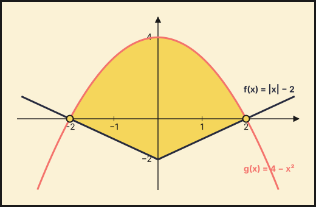{fig-alt="Recinto entre f(x)=|x|−2 y g(x)=4−x², con cortes en (−2,0) y (2,0)" width="75%" fig-align="center"}

**Puntos de corte: $(-2,0)$ y $(2,0)$.** El recinto está limitado por arriba por la parábola $g(x)=4-x^2$ (vértice $(0,4)$) y por abajo por la «V» $f(x)=|x|-2$ (vértice $(0,-2)$), entre $x=-2$ y $x=2$.

**b) Área.**
1. La figura es simétrica respecto del eje $Y$: el área es el doble de la de $[0,2]$.
2. En $[0,2]$ la función de arriba es $g$ y la de abajo es $f(x)=x-2$.
3. Barrow:

$$A=2\int_0^2\bigl[(4-x^2)-(x-2)\bigr]dx=2\int_0^2(6-x-x^2)\,dx=2\left[6x-\tfrac{x^2}{2}-\tfrac{x^3}{3}\right]_0^2=2\cdot\tfrac{22}{3}.$$

**$A=\dfrac{44}{3}\ \text{u}^2$**
::::
:::::

### Extraordinaria 2021

::::: {.ebau-ej #ebau-2021-ext-4}
**Ejercicio 4** · Extraordinaria 2021 · Bloque A · *(2,5 puntos)* · [Examen](../../../assets/pau/2021-ext/examen.pdf){target="_blank"}

Considera la función $f$ definida por $f(x)=\dfrac{x^{2}+1}{x^{2}-1}$ (para $x\neq -1$, $x\neq 1$). Halla una primitiva de $f$ cuya gráfica pase por el punto $(2,4)$.

:::: {.callout-note collapse="true" appearance="simple"}
## Ayuda 1 · Recordatorio

**Integral definida (regla de Barrow).**

Regla de Barrow: $\int_a^b f(x)\,dx=F(b)-F(a)$, con $F$ una primitiva de $f$. Si $f\ge0$ en $[a,b]$, la integral es el área bajo la curva; si $f\le0$, es el área cambiada de signo.

**Primitivas inmediatas.**

$\int x^n\,dx=\dfrac{x^{n+1}}{n+1}+C\ (n\neq-1)$; $\int\dfrac{1}{x}\,dx=\ln|x|+C$; $\int e^{kx}\,dx=\dfrac{e^{kx}}{k}+C$; $\int\dfrac{u'}{u}\,dx=\ln|u|+C$; $\int\sin x\,dx=-\cos x+C$; $\int\cos x\,dx=\sin x+C$. Linealidad: $\int(af+bg)=a\int f+b\int g$. Para $F(x)$ con $F(a)=b$ se usa la constante $C$.
::::

:::: {.callout-note collapse="true" appearance="simple"}
## Ayuda 2 · Método

**Integral definida (regla de Barrow).**

1. Halla una primitiva $F$.
2. Evalúa $F(b)-F(a)$ cuidando los signos y las fracciones.
3. Interpreta el signo del resultado.

**Primitivas inmediatas.**

1. Reescribe el integrando como suma de potencias (separa fracciones, pasa raíces a exponente fraccionario).
2. Integra término a término.
3. Si piden una primitiva concreta, impón la condición $F(a)=b$ para hallar $C$.
4. Deriva el resultado para comprobarlo.
::::

:::: {.callout-tip collapse="true" appearance="simple"}
## Solución

1. **Descomponer.** El grado del numerador es igual al del denominador: $f(x)=\dfrac{x^2+1}{x^2-1}=1+\dfrac{2}{x^2-1}$.
2. **Fracciones simples.** $\dfrac{2}{x^2-1}=\dfrac1{x-1}-\dfrac1{x+1}$, luego $f(x)=1-\dfrac1{x+1}+\dfrac1{x-1}$.
3. **Primitivas.**
$$F(x)=x+\ln|x-1|-\ln|x+1|+C=x+\ln\left|\frac{x-1}{x+1}\right|+C.$$
4. **Condición.** La gráfica pasa por $(2,4)$: $F(2)=2+\ln\frac13+C=4\Rightarrow C=2+\ln3$.

**$F(x)=x+\ln\left|\dfrac{x-1}{x+1}\right|+2+\ln3$**
::::
:::::

### Extraordinaria · Reserva 2021

::::: {.ebau-ej #ebau-2021-ext-res-4}
**Ejercicio 4** · Extraordinaria · Reserva 2021 · Bloque A · *(2,5 puntos)* · [Examen](../../../assets/pau/2021-ext-res/examen.pdf){target="_blank"}

Calcula $\displaystyle\int_{1}^{3}\left|x^{2}-3x+2\right|dx$.

:::: {.callout-note collapse="true" appearance="simple"}
## Ayuda 1 · Recordatorio

Regla de Barrow: $\int_a^b f(x)\,dx=F(b)-F(a)$, con $F$ una primitiva de $f$. Si $f\ge0$ en $[a,b]$, la integral es el área bajo la curva; si $f\le0$, es el área cambiada de signo.
::::

:::: {.callout-note collapse="true" appearance="simple"}
## Ayuda 2 · Método

1. Halla una primitiva $F$.
2. Evalúa $F(b)-F(a)$ cuidando los signos y las fracciones.
3. Interpreta el signo del resultado.
::::

:::: {.callout-tip collapse="true" appearance="simple"}
## Solución

1. **Signo del integrando.** $x^2-3x+2=(x-1)(x-2)$ es $\le0$ en $[1,2]$ y $\ge0$ en $[2,3]$.
2. **Dividir la integral.** En $[1,2]$ el valor absoluto cambia el signo; en $[2,3]$ no.
3. **Primitiva.** $F(x)=\frac{x^3}{3}-\frac{3x^2}{2}+2x$: $F(1)=\frac56$, $F(2)=\frac23$, $F(3)=\frac32$.
4. **Cálculo.**
$$\int_1^3|x^2-3x+2|\,dx=-\bigl(F(2)-F(1)\bigr)+\bigl(F(3)-F(2)\bigr)=\tfrac16+\tfrac56.$$

**Resultado: $1$**
::::
:::::

### Extraordinaria · Suplente 2021

::::: {.ebau-ej #ebau-2021-ext-sup-4}
**Ejercicio 4** · Extraordinaria · Suplente 2021 · Bloque A · *(2,5 puntos)* · [Examen](../../../assets/pau/2021-ext-sup/examen.pdf){target="_blank"}

Considera la función $f:[0,+\infty)\to\mathbb{R}$ definida por $f(x)=xe^{x}$.

a) Esboza el recinto limitado por la gráfica de $f$ y las rectas $x=2$, $y=x$. *(1 punto)*

b) Determina el área del recinto anterior. *(1,5 puntos)*

:::: {.callout-note collapse="true" appearance="simple"}
## Ayuda 1 · Recordatorio

**Área de un recinto.**

Área entre $y=f(x)$ y el eje $X$: $\int_a^b|f(x)|\,dx$, partiendo en los puntos donde $f$ cambia de signo. Área entre dos curvas: $\int_a^b\left(f(x)-g(x)\right)dx$ con $f\ge g$. Los límites de integración son las abscisas de corte.

**Integrales: cambio de variable, partes y fracciones simples.**

**Cambio de variable:** $t=g(x)$, $dt=g'(x)\,dx$. **Por partes:** $\int u\,dv=u\,v-\int v\,du$ (regla ALPES: arcos, logaritmos, polinomios, exponenciales, senos). **Racionales:** si el grado del numerador es mayor o igual que el del denominador, se divide; después se descompone en fracciones simples $\dfrac{A}{x-a}+\dfrac{B}{x-b}$.

**Integral definida (regla de Barrow).**

Regla de Barrow: $\int_a^b f(x)\,dx=F(b)-F(a)$, con $F$ una primitiva de $f$. Si $f\ge0$ en $[a,b]$, la integral es el área bajo la curva; si $f\le0$, es el área cambiada de signo.

**Primitivas inmediatas.**

$\int x^n\,dx=\dfrac{x^{n+1}}{n+1}+C\ (n\neq-1)$; $\int\dfrac{1}{x}\,dx=\ln|x|+C$; $\int e^{kx}\,dx=\dfrac{e^{kx}}{k}+C$; $\int\dfrac{u'}{u}\,dx=\ln|u|+C$; $\int\sin x\,dx=-\cos x+C$; $\int\cos x\,dx=\sin x+C$. Linealidad: $\int(af+bg)=a\int f+b\int g$. Para $F(x)$ con $F(a)=b$ se usa la constante $C$.
::::

:::: {.callout-note collapse="true" appearance="simple"}
## Ayuda 2 · Método

**Área de un recinto.**

1. Haz un esbozo del recinto.
2. Calcula los puntos de corte (resolviendo $f=g$ o $f=0$): son los límites.
3. Decide qué función va por encima en cada tramo; si se cruzan, parte la integral.
4. Aplica Barrow y da el área en $\text{u}^2$, siempre positiva.

**Integrales: cambio de variable, partes y fracciones simples.**

1. Decide el método: ¿hay una función y su derivada (cambio de variable)?, ¿un producto de tipos distintos (partes)?, ¿un cociente de polinomios (fracciones simples)?
2. Aplica el método y simplifica; si es por partes, elige $u$ y $dv$ y repite si es necesario.
3. Deshaz el cambio y añade $+C$.
4. Si es definida, cambia los límites con la variable o deshaz el cambio antes de aplicar Barrow.
5. Comprueba derivando.

**Integral definida (regla de Barrow).**

1. Halla una primitiva $F$.
2. Evalúa $F(b)-F(a)$ cuidando los signos y las fracciones.
3. Interpreta el signo del resultado.

**Primitivas inmediatas.**

1. Reescribe el integrando como suma de potencias (separa fracciones, pasa raíces a exponente fraccionario).
2. Integra término a término.
3. Si piden una primitiva concreta, impón la condición $F(a)=b$ para hallar $C$.
4. Deriva el resultado para comprobarlo.
::::

:::: {.callout-tip collapse="true" appearance="simple"}
## Solución

**a) Recinto.**
1. Para $x\ge0$ se cumple $xe^x\ge x$ (igualdad solo en $x=0$, pues $xe^x=x\iff x(e^x-1)=0$).
2. El recinto está entre $y=x$ (debajo) y $y=xe^x$ (encima), desde $x=0$ hasta $x=2$.
3. Ambas curvas parten de $(0,0)$; en $x=2$ valen $2$ y $2e^2$.

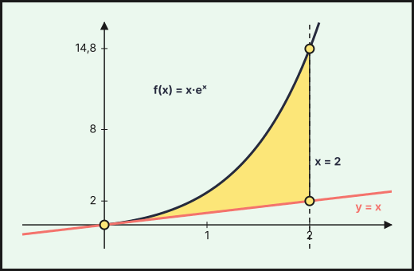{fig-alt="Recinto limitado por f(x)=x·eˣ, la recta y=x y la recta x=2" width="75%" fig-align="center"}

**b) Área.**
1. Una primitiva de $xe^x$ es $(x-1)e^x$ (por partes).
2. Barrow:

$$A=\int_0^2(xe^x-x)\,dx=\left[(x-1)e^x-\tfrac{x^2}{2}\right]_0^2=(e^2-2)-(-1).$$

**$A=e^2-1\approx6{,}389\ \text{u}^2$**
::::
:::::

## También trabajan este tema

Ejercicios cuyo tema principal es otro pero en los que aparece este tema:

- [2026 Ordinaria · Suplente 2, ejercicio 1](08-aplicaciones-derivada.qmd#ebau-2026-ord-sup2-1) (tema principal: Aplicaciones de la derivada)
- [2026 Extraordinaria · Suplente 1, ejercicio 2](08-aplicaciones-derivada.qmd#ebau-2026-ext-sup1-2) (tema principal: Aplicaciones de la derivada)
- [2023 Ordinaria, ejercicio 4](06-limites-continuidad.qmd#ebau-2023-ord-4) (tema principal: Límites y continuidad)
- [2021 Ordinaria, ejercicio 3](08-aplicaciones-derivada.qmd#ebau-2021-ord-3) (tema principal: Aplicaciones de la derivada)
- [2021 Ordinaria · Reserva, ejercicio 3](08-aplicaciones-derivada.qmd#ebau-2021-ord-res-3) (tema principal: Aplicaciones de la derivada)
- [2021 Extraordinaria, ejercicio 3](08-aplicaciones-derivada.qmd#ebau-2021-ext-3) (tema principal: Aplicaciones de la derivada)
- [2021 Extraordinaria · Reserva, ejercicio 3](07-derivadas.qmd#ebau-2021-ext-res-3) (tema principal: Derivadas)
- [2021 Extraordinaria · Suplente, ejercicio 3](08-aplicaciones-derivada.qmd#ebau-2021-ext-sup-3) (tema principal: Aplicaciones de la derivada)

---

*Enunciados: Prueba de Acceso y Admisión a la Universidad (PEvAU hasta 2024, PAU desde 2025), Matemáticas II, Andalucía, Ceuta, Melilla y centros en Marruecos (Distrito Único Andaluz). Cada ejercicio enlaza al PDF del examen completo. La clasificación por temas es propia y puede discutirse: los ejercicios mixtos figuran en su tema principal.*
